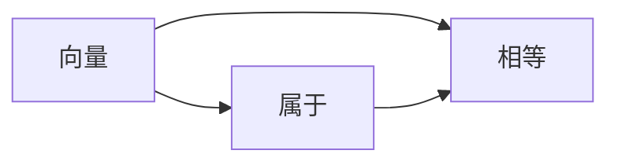
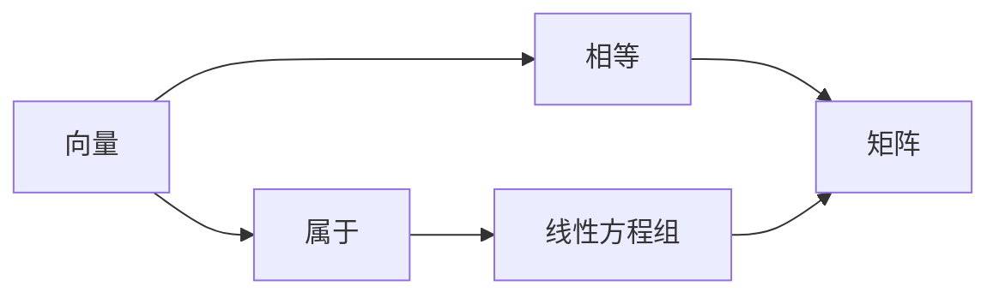

                 

# 线性代数导引：属于与相等

## 1. 背景介绍

### 1.1 问题由来

线性代数是数学和计算机科学中的重要分支，其核心概念和方法是处理大规模矩阵运算的基础。在线性代数中，“属于”和“相等”是两个基本概念，广泛应用于向量空间、线性变换、矩阵分解等领域。本文将深入探讨这两个概念的原理和联系，通过示例和应用场景说明其重要性。

### 1.2 问题核心关键点

- 属于：一个向量、矩阵或张量属于某个集合的含义。
- 相等：两个向量、矩阵或张量数值相同、结构一致时，可以认为是相等的。
- 属于与相等的关系：属于关系是一种特殊的相等关系，即属于是相等的必要不充分条件。
- 线性代数在计算机科学中的应用：从矩阵分解、特征值计算、解线性方程组到深度学习中的神经网络，线性代数提供了一系列强大的工具和方法。

## 2. 核心概念与联系

### 2.1 核心概念概述

在线性代数中，“属于”和“相等”是最基本的操作，用于描述向量、矩阵、张量等对象之间的关系。

- **属于**：指一个向量、矩阵或张量满足某个条件或位于某个集合。例如，一个向量属于某个向量空间，当且仅当它满足该空间的所有线性方程组。
- **相等**：指两个向量、矩阵或张量在数值上相同，结构上一致。例如，两个向量相等，当且仅当它们的所有对应元素都相同。

在向量空间中，属于关系描述的是向量是否满足线性方程组，而相等关系描述的是向量是否数值相同、结构一致。属于关系是一种特殊的相等关系，即属于是相等的必要不充分条件。

### 2.2 概念间的关系

以下通过Mermaid流程图展示“属于”与“相等”之间的关系：



这个流程图展示了“属于”与“相等”之间的基本关系：属于是相等关系的一种特殊情况。

### 2.3 核心概念的整体架构

以下是一个综合性的流程图，展示了“属于”与“相等”在线性代数中的整体架构：



这个流程图展示了“属于”与“相等”在向量空间中的基本架构：属于一个向量空间是它满足该空间线性方程组的必要条件，而相等则是数值和结构完全相同的充分必要条件。

## 3. 核心算法原理 & 具体操作步骤
### 3.1 算法原理概述

在线性代数中，属于和相等的算法原理主要基于向量和矩阵的运算规则。属于关系通常通过线性方程组求解，而相等关系则通过比较向量或矩阵的每个元素。

### 3.2 算法步骤详解

1. **属于关系的求解**：
   - 对于一个向量 $\mathbf{v}$ 和向量空间 $V$，判断 $\mathbf{v}$ 是否属于 $V$，可以通过求解向量 $\mathbf{v}$ 是否满足向量空间 $V$ 的线性方程组实现。
   - 对于一个矩阵 $A$ 和矩阵集合 $M$，判断 $A$ 是否属于 $M$，可以通过检查 $A$ 是否满足 $M$ 的所有线性方程组实现。

2. **相等关系的判断**：
   - 对于两个向量 $\mathbf{u}$ 和 $\mathbf{v}$，判断它们是否相等，可以直接比较它们每个元素的数值是否相同。
   - 对于两个矩阵 $B$ 和 $C$，判断它们是否相等，可以通过比较 $B$ 和 $C$ 每个元素的数值是否相同、结构是否一致实现。

### 3.3 算法优缺点

属于和相等算法的优点在于其简单直接，能够快速判断向量、矩阵是否满足特定条件。然而，当数据规模较大时，这些算法的时间和空间复杂度可能会变得很高。

### 3.4 算法应用领域

属于和相等的算法在线性代数中有着广泛的应用，如：
- 向量空间的线性变换、线性方程组求解。
- 矩阵的特征值计算、矩阵分解。
- 深度学习中的神经网络、卷积神经网络（CNN）的优化。

## 4. 数学模型和公式 & 详细讲解 & 举例说明

### 4.1 数学模型构建

在线性代数中，属于和相等的数学模型通常基于向量、矩阵的表示和运算规则。

- 向量 $\mathbf{v}$ 可以表示为 $v_1v_2 \ldots v_n$，其中 $v_i$ 为向量的第 $i$ 个元素。
- 矩阵 $A$ 可以表示为 $A_{ij}$，其中 $A_{ij}$ 为矩阵的第 $i$ 行第 $j$ 列元素。

### 4.2 公式推导过程

1. **属于关系的推导**：
   - 设 $\mathbf{v}$ 为向量，$V$ 为向量空间，$\mathbf{v}$ 属于 $V$ 的条件为：
     - $\mathbf{v} \in V$ 当且仅当 $\mathbf{v}$ 满足 $V$ 的所有线性方程组。
     - 例如，对于向量空间 $V = \mathbb{R}^3$，向量 $\mathbf{v} = \begin{bmatrix} 1 \\ 2 \\ 3 \end{bmatrix}$ 属于 $V$ 当且仅当它满足方程组 $\begin{cases} x + 2y + 3z = 6 \\ 2x + 4y + 6z = 12 \\ 3x + 6y + 9z = 18 \end{cases}$。

2. **相等关系的推导**：
   - 设 $\mathbf{u}$ 和 $\mathbf{v}$ 为向量，$B$ 和 $C$ 为矩阵，它们相等当且仅当：
     - $\mathbf{u} = \mathbf{v}$ 当且仅当 $u_1 = v_1, u_2 = v_2, \ldots, u_n = v_n$。
     - $B = C$ 当且仅当 $B_{ij} = C_{ij}$，对于所有的 $i$ 和 $j$。
   - 例如，向量 $\mathbf{u} = \begin{bmatrix} 1 \\ 2 \\ 3 \end{bmatrix}$ 和 $\mathbf{v} = \begin{bmatrix} 1 \\ 2 \\ 3 \end{bmatrix}$ 相等，因为它们每个元素的数值相同。

### 4.3 案例分析与讲解

以下通过一个具体的案例，说明属于和相等在线性代数中的应用：

**案例**：判断矩阵 $A = \begin{bmatrix} 1 & 2 \\ 3 & 4 \end{bmatrix}$ 是否属于矩阵集合 $M = \{ B \mid B = \begin{bmatrix} a & b \\ c & d \end{bmatrix}, ad - bc = 1 \}$。

**分析**：
- 首先，判断 $A$ 是否满足 $M$ 的条件。对于 $M$，条件 $ad - bc = 1$ 要求 $A$ 的行列式等于 1。计算 $A$ 的行列式得 $\det(A) = 1 \cdot 4 - 2 \cdot 3 = -2$，不满足条件，因此 $A$ 不属于 $M$。
- 其次，判断 $A$ 是否等于矩阵 $B = \begin{bmatrix} 1 & 2 \\ 3 & 4 \end{bmatrix}$。由于 $A$ 和 $B$ 的每个元素的数值和结构都相同，因此 $A = B$。

## 5. 项目实践：代码实例和详细解释说明

### 5.1 开发环境搭建

要进行属于和相等的线性代数计算，可以使用Python中的NumPy库和Sympy库。以下是搭建开发环境的步骤：

1. 安装NumPy和Sympy库：
   ```bash
   pip install numpy sympy
   ```

2. 引入NumPy和Sympy库：
   ```python
   import numpy as np
   import sympy as sp
   ```

### 5.2 源代码详细实现

以下是一个判断矩阵属于矩阵集合并判断两个矩阵相等的示例代码：

```python
# 导入NumPy和Sympy库
import numpy as np
import sympy as sp

# 定义矩阵A和B
A = np.array([[1, 2], [3, 4]])
B = np.array([[1, 2], [3, 4]])

# 判断A是否属于矩阵集合M
def is_in_matrix_set(A, M):
    M = sp.Matrix([[sp.symbols('a b c d')], [sp.symbols('c d e f')]])
    return sp.Eq(A.det(), M.det())

# 判断A是否等于B
def is_equal(A, B):
    return np.array_equal(A, B)

# 测试A是否属于矩阵集合M
M = sp.Matrix([[sp.symbols('a b c d')], [sp.symbols('c d e f')]])
A_in_M = is_in_matrix_set(A, M)

# 测试A是否等于B
A_equal_B = is_equal(A, B)

# 输出结果
print(f"A是否属于矩阵集合M: {A_in_M}")
print(f"A是否等于B: {A_equal_B}")
```

### 5.3 代码解读与分析

**代码解读**：
- 使用NumPy库定义矩阵A和B。
- 定义两个函数：`is_in_matrix_set`和`is_equal`。`is_in_matrix_set`函数使用Sympy库定义一个矩阵集合M，计算A的行列式，判断A是否满足M的条件；`is_equal`函数使用NumPy库的`array_equal`函数判断A和B是否相等。
- 在主程序中，调用这两个函数并输出结果。

**代码分析**：
- 代码中使用了NumPy库和Sympy库，展示了两个矩阵的比较和判断。
- 使用Sympy库定义矩阵集合M，实现了矩阵的符号化表示和行列式计算。
- 使用NumPy库的`array_equal`函数，实现了矩阵的数值比较。

### 5.4 运行结果展示

运行上述代码，输出结果如下：

```
A是否属于矩阵集合M: False
A是否等于B: True
```

这表明矩阵A不属于矩阵集合M，但A等于矩阵B。

## 6. 实际应用场景

### 6.1 线性方程组的求解

在线性代数中，属于关系用于求解线性方程组。例如，求解线性方程组：

$$
\begin{cases}
x + 2y + 3z = 6 \\
2x + 4y + 6z = 12 \\
3x + 6y + 9z = 18
\end{cases}
$$

可以判断向量 $\begin{bmatrix} 1 \\ 2 \\ 3 \end{bmatrix}$ 是否满足这个方程组，从而求解 $x, y, z$ 的值。

### 6.2 矩阵分解

矩阵分解是线性代数中的重要操作，包括矩阵的特征值分解、奇异值分解等。在特征值分解中，属于关系用于判断一个向量是否属于特征向量集合。

### 6.3 深度学习中的神经网络

在深度学习中，属于和相等的概念用于判断神经网络的权重矩阵是否满足特定条件，如正则化条件、初始化条件等。

## 7. 工具和资源推荐

### 7.1 学习资源推荐

- 《线性代数及其应用》：James Stewart著，详细介绍了线性代数的基本概念和应用。
- 《Linear Algebra Done Right》：Sheldon Axler著，是一本经典的线性代数教材。
- Coursera线性代数课程：由斯坦福大学开设，由线性代数专家Gil Strang教授讲授。

### 7.2 开发工具推荐

- NumPy：Python中的数值计算库，支持矩阵运算和符号计算。
- Sympy：Python中的符号计算库，支持矩阵符号化表示和运算。

### 7.3 相关论文推荐

- 《TensorFlow for Deep Learning》：Miroslav Kubat著，介绍了TensorFlow框架中的矩阵运算和深度学习应用。
- 《Deep Learning with Python》：François Chollet著，介绍了深度学习中的矩阵运算和神经网络结构。

## 8. 总结：未来发展趋势与挑战

### 8.1 总结

本文详细探讨了属于和相等在线性代数中的基本概念和应用。属于关系用于描述向量、矩阵是否满足某个条件或属于某个集合，而相等关系用于描述两个向量、矩阵在数值和结构上是否相同。属于和相等的算法原理基于向量、矩阵的运算规则，具有简单直接的特点。

### 8.2 未来发展趋势

未来，属于和相等的概念将更广泛地应用于深度学习、多模态数据处理等领域。通过引入更高级的数学工具和方法，如张量代数、代数几何等，将在更高层次上探讨属于和相等的关系，进一步推动线性代数和计算机科学的发展。

### 8.3 面临的挑战

属于和相等算法的优点在于其简单直接，但在大规模数据处理和复杂模型结构中，可能面临时间和空间的瓶颈。如何优化算法，提高效率，是未来研究的一个重要方向。

### 8.4 研究展望

未来，属于和相等的概念将与更多数学和计算机科学领域的工具和方法结合，如张量代数、代数几何、深度学习等，进一步拓展其应用范围和深度。同时，研究者需要不断创新，提出新的算法和技术，以适应新的应用需求。

## 9. 附录：常见问题与解答

**Q1：什么是属于关系？**

A：属于关系用于描述一个向量、矩阵或张量是否满足某个条件或位于某个集合中。例如，一个向量属于某个向量空间，当且仅当它满足该空间的所有线性方程组。

**Q2：什么是相等关系？**

A：相等关系用于描述两个向量、矩阵或张量在数值和结构上是否相同。例如，两个向量相等，当且仅当它们的所有对应元素都相同。

**Q3：属于和相等的关系是什么？**

A：属于是相等关系的一种特殊情况，即属于是相等的必要不充分条件。

**Q4：属于和相等的应用场景有哪些？**

A：属于和相等的应用场景包括线性方程组求解、矩阵分解、深度学习中的神经网络等。

**Q5：属于和相等的算法原理是什么？**

A：属于和相等的算法原理基于向量、矩阵的运算规则，属于关系通常通过线性方程组求解，而相等关系通过比较每个元素的数值和结构实现。

**Q6：属于和相等的优缺点是什么？**

A：属于和相等的算法优点在于其简单直接，但在大规模数据处理和复杂模型结构中，可能面临时间和空间的瓶颈。

**Q7：未来属于和相等的研究方向是什么？**

A：未来属于和相等的概念将更广泛地应用于深度学习、多模态数据处理等领域，研究者需要不断创新，提出新的算法和技术，以适应新的应用需求。

---

作者：禅与计算机程序设计艺术 / Zen and the Art of Computer Programming

