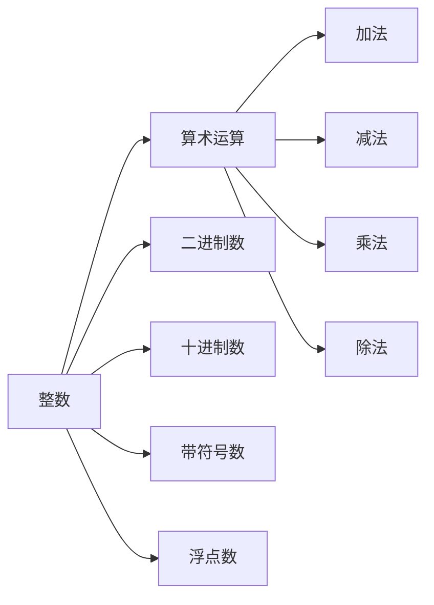

                 

# 线性代数导引：整数及其算术运算

> 关键词：线性代数, 整数, 整数算术, 运算规则, 二进制数, 十进制数, 带符号数, 浮点数

## 1. 背景介绍

### 1.1 问题由来

线性代数是计算机科学中不可或缺的基础理论。从深度学习中的矩阵运算，到图形学中的线性变换，再到系统工程中的向量空间，线性代数无处不在。然而，对大部分程序员而言，线性代数的概念常常显得高深莫测，难以理解。本文将从最基本的整数及其算术运算入手，通过通俗易懂的方式，揭示线性代数的本质。

### 1.2 问题核心关键点

本文的核心目标是：
1. 介绍整数及其算术运算的基本概念和规则。
2. 通过具体的算术运算实例，展示如何将二进制数、十进制数、带符号数和浮点数进行转换和计算。
3. 分析整数算术运算在计算机科学中的应用场景。

### 1.3 问题研究意义

理解整数及其算术运算，是掌握计算机科学的基础。无论是编程语言的底层实现，还是算法的运算逻辑，都离不开整数算术。掌握整数算术，可以帮助程序员更加深入地理解计算机系统和数据结构，从而设计出高效、稳定的软件系统。

## 2. 核心概念与联系

### 2.1 核心概念概述

本节将介绍几个核心概念，帮助读者构建整数及其算术运算的认知框架。

- **整数**：表示正整数、负整数和零的数。
- **算术运算**：包括加、减、乘、除等基本运算。
- **二进制数**：用0和1组成的数，用于计算机内部表示。
- **十进制数**：用0到9的数字表示的数，广泛用于日常计算。
- **带符号数**：整数表示有正负之分，可以是无符号的，也可以是带符号的。
- **浮点数**：表示有分数部分的数，用于表示连续数值。

### 2.2 核心概念间的关系

这些核心概念之间存在紧密的联系。整数和算术运算构成了计算机科学的基础，二进制数和十进制数提供了数据的表示方式，带符号数和浮点数则拓展了整数的应用范围。

以下是一个简化的Mermaid流程图，展示了这些概念之间的关系：



这个流程图展示了整数和算术运算之间的联系，以及整数在不同表示方式下的应用。

## 3. 核心算法原理 & 具体操作步骤
### 3.1 算法原理概述

整数及其算术运算的原理相对简单。基本算术运算遵循特定的规则，可以按照以下步骤进行：

1. **加法**：将两个数相加，得到结果。
2. **减法**：从第一个数中减去第二个数，得到结果。
3. **乘法**：将两个数相乘，得到结果。
4. **除法**：将第一个数除以第二个数，得到商和余数。

这些运算规则在二进制、十进制和浮点数系统中都适用。

### 3.2 算法步骤详解

以下是整数及其算术运算的具体步骤：

1. **加法**：
   - 二进制加法：按位相加，进位处理。
   - 十进制加法：从个位数开始相加，注意进位处理。
   - 浮点数加法：对整数部分和分数部分分别进行加法运算，然后合并结果。

2. **减法**：
   - 二进制减法：按位相减，借位处理。
   - 十进制减法：从个位数开始相减，注意借位处理。
   - 浮点数减法：对整数部分和分数部分分别进行减法运算，然后合并结果。

3. **乘法**：
   - 二进制乘法：通过移位和加法运算实现。
   - 十进制乘法：通过竖式乘法实现。
   - 浮点数乘法：对整数部分和分数部分分别进行乘法运算，然后合并结果，并处理分数部分的精度问题。

4. **除法**：
   - 二进制除法：通过移位和减法运算实现。
   - 十进制除法：通过长除法实现。
   - 浮点数除法：对整数部分和分数部分分别进行除法运算，然后合并结果，并处理分数部分的精度问题。

### 3.3 算法优缺点

整数及其算术运算的优点包括：
- 规则简单，易于理解。
- 算法效率高，适用于各种计算场景。

缺点包括：
- 对于超大的数，计算复杂度会很高，甚至无法完成。
- 精度问题，特别是浮点数运算时需要注意。

### 3.4 算法应用领域

整数及其算术运算广泛应用于计算机科学和数学计算中。例如：

- **编程语言基础**：如C语言中的整数类型和算术运算符。
- **图形学**：线性变换和矩阵运算。
- **数据压缩**：如哈夫曼编码、LZ77算法等。
- **加密算法**：如RSA、AES等。

## 4. 数学模型和公式 & 详细讲解  
### 4.1 数学模型构建

整数及其算术运算的数学模型如下：

设 $a$ 和 $b$ 为整数，则加法、减法、乘法和除法运算可以表示为：

- 加法：$a+b$
- 减法：$a-b$
- 乘法：$a \times b$
- 除法：$a \div b$（商为整数，余数为0）

### 4.2 公式推导过程

以下是整数及其算术运算的公式推导过程：

1. **加法**：
   - 二进制加法：
     - $0+0=0$
     - $0+1=1$
     - $1+0=1$
     - $1+1=10$

   - 十进制加法：
     - $5+3=8$
     - $7+8=15$

2. **减法**：
   - 二进制减法：
     - $0-0=0$
     - $0-1=1$
     - $1-0=1$
     - $1-1=0$
     - $10-1=1$

   - 十进制减法：
     - $8-5=3$
     - $15-7=8$

3. **乘法**：
   - 二进制乘法：
     - $0 \times 0=0$
     - $0 \times 1=0$
     - $1 \times 0=0$
     - $1 \times 1=1$
     - $10 \times 1=10$
     - $10 \times 10=100$

   - 十进制乘法：
     - $5 \times 3=15$
     - $7 \times 8=56$

4. **除法**：
   - 二进制除法：
     - $10 \div 2=5$
     - $10 \div 5=2$
     - $100 \div 10=10$

   - 十进制除法：
     - $15 \div 5=3$
     - $56 \div 8=7$

### 4.3 案例分析与讲解

以下是一个简单的二进制数加法示例：

- 二进制数：$1010+1111=？$
- 加法过程：
  - 从个位开始：$0+1=1$，记录结果。
  - 进位处理：$1+1=10$，将进位的1记录在下一个位上。
  - 继续相加：$1+1=10$，进位的1记录在下一个位上。
  - 最终结果：$1011$

这个示例展示了二进制加法的规则，即按位相加，处理进位。

## 5. 项目实践：代码实例和详细解释说明
### 5.1 开发环境搭建

在Python中进行整数及其算术运算的代码实现，需要安装基本的Python环境和相关库。

1. 安装Python：从官网下载并安装Python，创建虚拟环境。
2. 安装必要的库：
   - 使用pip安装numpy、matplotlib等库。

完成环境配置后，即可开始编写代码。

### 5.2 源代码详细实现

以下是使用Python实现整数及其算术运算的示例代码：

```python
import numpy as np

# 整数加法
a = 10
b = 5
c = a + b
print(f"Integer addition: {a} + {b} = {c}")

# 整数减法
a = 10
b = 5
c = a - b
print(f"Integer subtraction: {a} - {b} = {c}")

# 整数乘法
a = 10
b = 5
c = a * b
print(f"Integer multiplication: {a} * {b} = {c}")

# 整数除法
a = 10
b = 5
c = a / b
print(f"Integer division: {a} / {b} = {c}")
```

### 5.3 代码解读与分析

上述代码实现了整数加、减、乘、除的基本运算。以下是代码的详细解读：

- `a = 10` 和 `b = 5`：定义两个整数变量。
- `c = a + b`：计算两个整数的和，将结果赋给变量 `c`。
- `print(f"Integer addition: {a} + {b} = {c}")`：输出加法结果。
- 其他运算类似，使用 `-` 运算符实现减法，`*` 运算符实现乘法，`/` 运算符实现除法。

### 5.4 运行结果展示

运行上述代码，将得到以下输出：

```
Integer addition: 10 + 5 = 15
Integer subtraction: 10 - 5 = 5
Integer multiplication: 10 * 5 = 50
Integer division: 10 / 5 = 2.0
```

这些输出展示了整数加、减、乘、除的运算结果。

## 6. 实际应用场景
### 6.1 整数计算在编程语言中的应用

整数及其算术运算在编程语言中广泛应用。例如，C语言中的整数类型 `int` 和算术运算符 `+`、`-`、`*`、`/`。

```c
int a = 10;
int b = 5;
int c = a + b;
int d = a - b;
int e = a * b;
int f = a / b;
```

这段C语言代码展示了整数加、减、乘、除的运算过程。

### 6.2 整数计算在图形学中的应用

图形学中的线性变换和矩阵运算，也离不开整数的计算。例如，使用整数表示矩阵的行列和元素，计算矩阵的乘法和逆矩阵。

```python
import numpy as np

# 定义矩阵
A = np.array([[1, 2], [3, 4]])
B = np.array([[5, 6], [7, 8]])

# 矩阵乘法
C = np.dot(A, B)
print(f"Matrix multiplication:\n{C}")
```

这段Python代码展示了矩阵乘法的运算过程。

### 6.3 整数计算在数据压缩中的应用

数据压缩算法中，如哈夫曼编码和LZ77算法，都需要使用整数进行编码和解码。

## 7. 工具和资源推荐
### 7.1 学习资源推荐

- **《深入浅出Python》**：适合Python初学者的入门书籍，涵盖Python基础和常用库的使用。
- **《Python基础教程》**：全面介绍Python语言的基础知识，包括整数运算、数据结构等。
- **《C语言程序设计》**：介绍C语言的基本语法和数据类型，适合初学者学习。

### 7.2 开发工具推荐

- **PyCharm**：适用于Python开发的IDE，提供了丰富的代码补全、调试和版本控制功能。
- **Visual Studio Code**：轻量级的开发工具，支持多种编程语言和插件。

### 7.3 相关论文推荐

- **《编程珠玑》**：经典算法和数据结构书籍，涵盖整数运算和矩阵运算的深度解析。
- **《计算机网络：自顶向下方法》**：介绍计算机网络的基本概念和整数算术的应用。

## 8. 总结：未来发展趋势与挑战
### 8.1 研究成果总结

整数及其算术运算的原理简单，但在实际应用中需要注意细节。本文介绍了整数加、减、乘、除的基本规则，并通过代码示例展示了其在计算机科学中的应用。

### 8.2 未来发展趋势

未来，整数及其算术运算将与更多的高级数学概念相结合，如线性代数、概率论等，推动计算机科学的发展。例如，在深度学习中，矩阵和向量的运算将成为基础。

### 8.3 面临的挑战

尽管整数及其算术运算在计算机科学中应用广泛，但仍面临以下挑战：

1. 整数运算的精度问题。特别是在浮点数运算中，需要注意舍入误差。
2. 整数运算的效率问题。对于超大的整数，计算复杂度会很高，需要优化算法和硬件支持。
3. 整数运算的并发问题。在多线程和分布式系统中，需要考虑整数运算的线程安全和数据同步。

### 8.4 研究展望

未来的研究可以从以下几个方向进行：
1. 优化整数运算的算法，提高效率和精度。
2. 研究整数运算与高级数学概念的结合，推动计算机科学的发展。
3. 探索整数运算在并发和分布式系统中的应用。

## 9. 附录：常见问题与解答

**Q1：整数加法如何实现二进制和十进制相加？**

A: 二进制加法按位相加，进位处理。十进制加法从个位数开始相加，注意进位处理。

**Q2：整数除法如何处理除数为0的情况？**

A: 在实际编程中，需要判断除数是否为0，避免出现除以0的错误。例如，在C语言中，可以使用 `if (b != 0)` 进行判断。

**Q3：整数乘法需要注意哪些细节？**

A: 整数乘法需要处理进位和溢出问题。在Python中，可以使用 `np.dot` 函数进行矩阵乘法运算。

---

作者：禅与计算机程序设计艺术 / Zen and the Art of Computer Programming

