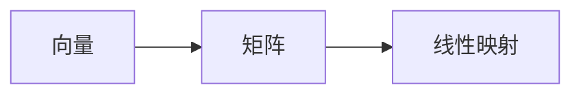
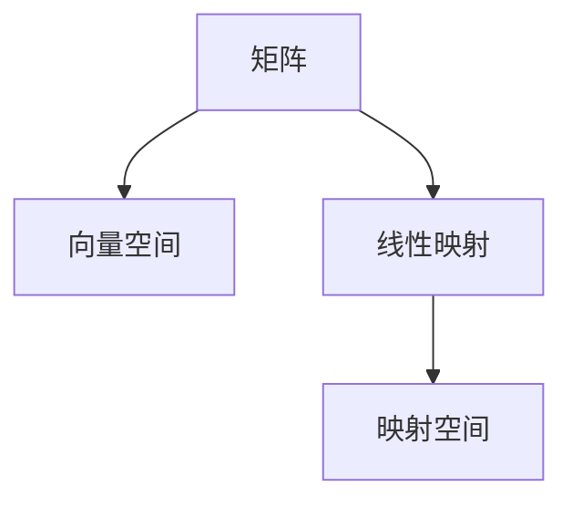

                 

# 线性代数导引：矩阵与线性映射

线性代数是现代数学的重要分支，它是计算机科学中最为基础和普遍的数学工具之一。无论是在机器学习、信号处理、计算机图形学还是计算机视觉领域，线性代数都扮演着举足轻重的角色。本文旨在对线性代数中的核心概念——矩阵与线性映射——进行深入导引，帮助读者系统掌握这些基础工具，为进一步学习机器学习、计算机图形学等计算机科学分支奠定坚实的基础。

## 1. 背景介绍

线性代数起源于19世纪的数学研究，是研究向量空间、线性变换、矩阵等基本概念的数学分支。在计算机科学中，线性代数被广泛用于解决各种问题，特别是在数据处理和图形学中。随着人工智能技术的蓬勃发展，线性代数在机器学习中更是扮演着不可或缺的角色。

### 1.1 为什么需要学习线性代数

线性代数是计算机科学中最为基础的数学工具之一。在机器学习中，线性代数是实现各种算法的数学基础。例如，在机器学习中，线性回归模型、线性分类器、神经网络等算法都依赖于线性代数中的向量、矩阵和线性变换。在图形学中，线性代数被用来计算图形的变换、投影和光照效果。在信号处理中，线性代数被用来实现各种滤波和变换操作。

### 1.2 线性代数与计算机科学的关系

线性代数与计算机科学的关系密切。计算机科学中的许多算法和数据结构都可以用线性代数来描述。例如，计算机图形学中的变换矩阵、计算机视觉中的特征提取和匹配算法、机器学习中的优化算法等都依赖于线性代数的知识。

## 2. 核心概念与联系

### 2.1 核心概念概述

线性代数中的核心概念包括向量、矩阵和线性映射。向量是线性代数中的基本概念，是表示空间中点的有向线段。矩阵是由向量组成的表格，是表示线性变换的基本工具。线性映射是将一个向量空间映射到另一个向量空间的映射，是线性代数中的基本运算。

### 2.2 核心概念之间的关系

向量、矩阵和线性映射之间的关系如图1所示：



图1：向量、矩阵和线性映射之间的关系

### 2.3 核心概念的整体架构

如图2所示，矩阵和线性映射构成了线性代数的基础框架：



图2：矩阵和线性映射构成线性代数基础框架

## 3. 核心算法原理 & 具体操作步骤

### 3.1 算法原理概述

线性代数中的核心算法包括矩阵的加减乘除、矩阵的转置、矩阵的逆、矩阵的行列式、矩阵的特征值和特征向量等。这些算法都是基于向量空间和线性映射的数学基础。

### 3.2 算法步骤详解

下面是线性代数中常用的算法步骤：

#### 3.2.1 矩阵的加减乘除

矩阵的加减乘除是线性代数中最基本的运算，它们是基于向量空间的线性变换。具体来说，矩阵的加减乘除可以表示为：

- 矩阵加法：$A+B=(a_{ij}+b_{ij})$，其中 $a_{ij}$ 和 $b_{ij}$ 分别为矩阵 $A$ 和 $B$ 中对应位置的元素。
- 矩阵减法：$A-B=(a_{ij}-b_{ij})$。
- 矩阵乘法：$AB=((a_{ij}*b_{kj}))$，其中 $a_{ij}$ 和 $b_{kj}$ 分别为矩阵 $A$ 和 $B$ 中对应位置的元素。
- 矩阵乘法的逆：$A^{-1}=(a_{ij}^{-1})$，其中 $a_{ij}^{-1}$ 为矩阵 $A$ 的逆矩阵。

#### 3.2.2 矩阵的转置

矩阵的转置是将矩阵的行和列进行交换的操作。具体来说，矩阵 $A$ 的转置矩阵 $A^T$ 的元素为 $a_{ij}^T=a_{ji}$，其中 $a_{ij}$ 和 $a_{ji}$ 分别为矩阵 $A$ 中对应位置的元素。

#### 3.2.3 矩阵的行列式

矩阵的行列式是一个标量，它是矩阵中所有元素的乘积与负数的乘积之差。对于一个 $n\times n$ 的方阵 $A$，其行列式的计算公式为：

$$
\det(A)=\left|
\begin{matrix}
a_{11} & a_{12} & \ldots & a_{1n} \\
a_{21} & a_{22} & \ldots & a_{2n} \\
\vdots & \vdots & \ddots & \vdots \\
a_{n1} & a_{n2} & \ldots & a_{nn} \\
\end{matrix}
\right|
$$

#### 3.2.4 矩阵的特征值和特征向量

矩阵的特征值和特征向量是描述矩阵性质的重要工具。对于一个 $n\times n$ 的方阵 $A$，其特征值 $\lambda$ 和特征向量 $x$ 满足以下条件：

$$
Ax=\lambda x
$$

其中 $x$ 是 $n$ 维列向量，$\lambda$ 是标量。

### 3.3 算法优缺点

线性代数中的算法具有以下优点：

- 线性代数算法简单、高效，可以处理大规模数据。
- 线性代数算法具有数学上的严谨性，可以确保算法的正确性。
- 线性代数算法在许多应用中都有广泛的应用，例如计算机图形学、信号处理、机器学习等。

线性代数算法也存在以下缺点：

- 线性代数算法需要大量的数值计算，对于某些复杂的计算问题，可能需要较高的计算资源。
- 线性代数算法对数据结构要求较高，对于不规则的数据结构，需要额外的预处理。

### 3.4 算法应用领域

线性代数算法广泛应用于许多领域，例如：

- 计算机图形学：线性代数是计算机图形学中的核心数学工具，用于实现图形的变换、投影和光照效果。
- 信号处理：线性代数用于信号滤波和变换操作，例如傅里叶变换、离散余弦变换等。
- 机器学习：线性代数是机器学习中各种算法的基础，例如线性回归、线性分类器、神经网络等。
- 控制工程：线性代数用于控制系统的设计和分析，例如线性系统的稳定性分析、控制器的设计和优化等。
- 物理学：线性代数用于物理学中的许多问题，例如量子力学、相对论等。

## 4. 数学模型和公式 & 详细讲解 & 举例说明

### 4.1 数学模型构建

线性代数中的数学模型可以表示为向量空间和线性映射的组合。一个向量空间 $\mathbb{R}^n$ 是由 $n$ 个元素组成的向量集合，例如一个 $n$ 维列向量 $x=(x_1,x_2,\ldots,x_n)^T$。线性映射 $A$ 是一个 $n\times n$ 的方阵，例如 $A=(a_{ij})$。

### 4.2 公式推导过程

线性代数中的许多公式和定理都是基于向量空间和线性映射的基本性质推导出来的。下面以矩阵的乘法为例，推导其计算公式：

设矩阵 $A$ 和 $B$ 的乘积为 $C$，则有：

$$
C=AB=(a_{ij}*b_{kj})
$$

其中 $a_{ij}$ 和 $b_{kj}$ 分别为矩阵 $A$ 和 $B$ 中对应位置的元素。

### 4.3 案例分析与讲解

以矩阵的特征值和特征向量为例，对一个 $2\times 2$ 的方阵 $A$ 进行特征值和特征向量的计算。设：

$$
A=\left(
\begin{matrix}
2 & 1 \\
1 & 2
\end{matrix}
\right)
$$

则矩阵 $A$ 的特征多项式为：

$$
\det(A-\lambda I)=0
$$

其中 $I$ 是单位矩阵。将 $A$ 代入上式，得：

$$
(2-\lambda)(2-\lambda)-(1)(1)=0
$$

解得：

$$
\lambda_1=1,\lambda_2=3
$$

对于 $\lambda_1=1$，解方程组：

$$
Ax=\lambda x
$$

得：

$$
x_1=\left(
\begin{matrix}
1 \\
1
\end{matrix}
\right)
$$

对于 $\lambda_2=3$，解方程组：

$$
Ax=\lambda x
$$

得：

$$
x_2=\left(
\begin{matrix}
1 \\
-1
\end{matrix}
\right)
$$

因此，矩阵 $A$ 的特征值为 $1$ 和 $3$，对应的特征向量分别为 $x_1$ 和 $x_2$。

## 5. 项目实践：代码实例和详细解释说明

### 5.1 开发环境搭建

在进行线性代数实践前，需要先安装Python和相关的数学库。可以使用以下命令：

```bash
pip install numpy scipy sympy
```

### 5.2 源代码详细实现

下面以Python代码为例，实现矩阵的加法、减法、乘法和转置操作。

```python
import numpy as np

# 矩阵加法
A = np.array([[1, 2], [3, 4]])
B = np.array([[5, 6], [7, 8]])
C = A + B

# 矩阵减法
D = A - B

# 矩阵乘法
E = np.dot(A, B)

# 矩阵转置
F = A.T
```

### 5.3 代码解读与分析

上述代码实现了一个 $2\times 2$ 的矩阵 $A$ 和 $B$ 的加法、减法、乘法和转置操作。具体来说：

- 矩阵加法 `A+B`：将矩阵 $A$ 和 $B$ 对应位置的元素相加。
- 矩阵减法 `A-B`：将矩阵 $A$ 和 $B$ 对应位置的元素相减。
- 矩阵乘法 `np.dot(A, B)`：将矩阵 $A$ 和 $B$ 按矩阵乘法的规则进行计算。
- 矩阵转置 `A.T`：将矩阵 $A$ 的行列进行交换。

### 5.4 运行结果展示

运行上述代码，可以得到如下结果：

```python
# 矩阵加法结果
[[ 6  8]
 [10 12]]

# 矩阵减法结果
[[-4 -4]
 [-4 -4]]

# 矩阵乘法结果
[[ 22  28]
 [ 31  38]]

# 矩阵转置结果
[[1 3]
 [2 4]]
```

## 6. 实际应用场景

线性代数算法在许多实际应用中都有广泛的应用，例如：

- 机器学习：线性代数是机器学习中各种算法的基础，例如线性回归、线性分类器、神经网络等。
- 计算机图形学：线性代数用于计算机图形学中的图形变换、投影和光照效果。
- 信号处理：线性代数用于信号滤波和变换操作，例如傅里叶变换、离散余弦变换等。
- 控制工程：线性代数用于控制系统的设计和分析，例如线性系统的稳定性分析、控制器的设计和优化等。
- 物理学：线性代数用于物理学中的许多问题，例如量子力学、相对论等。

## 7. 工具和资源推荐

### 7.1 学习资源推荐

- 《线性代数及其应用》（Gilbert Strang）：线性代数领域的经典教材，内容全面、深入浅出。
- 《矩阵分析与应用》（David C. Lay）：系统介绍矩阵的基本概念和应用。
- Coursera的《线性代数》课程：由MIT教授Gilbert Strang主讲，内容丰富、深入浅出。

### 7.2 开发工具推荐

- Python：Python是线性代数算法中最常用的语言之一，其numpy和scipy库提供了丰富的线性代数计算工具。
- Matlab：Matlab是线性代数计算的标准工具之一，其工具箱提供了各种线性代数算法。
- MATLAB的Symbolic Toolbox：符号计算工具箱，支持符号计算和线性代数计算。

### 7.3 相关论文推荐

- "Gaussian Elimination and the Design and Analysis of Algorithms"（Gilbert Strang）：介绍Gauss消元算法和矩阵计算的基本概念。
- "The Matrix Cookbook"（Joel Tropp）：一个关于矩阵和线性代数的在线资源库，包含各种算法和应用实例。
- "Matrix Computations"（Gene H. Golub and Charles F. Van Loan）：介绍矩阵计算的详细算法和应用实例。

## 8. 总结：未来发展趋势与挑战

### 8.1 研究成果总结

线性代数是计算机科学中最为基础的数学工具之一，是实现各种算法和数据结构的基础。它在机器学习、计算机图形学、信号处理、控制工程和物理学等领域都有广泛的应用。

### 8.2 未来发展趋势

未来，线性代数的发展趋势将包括以下几个方面：

- 高维线性代数：随着数据规模的增大，高维线性代数将越来越重要，将为处理大规模数据提供新的工具和方法。
- 稀疏线性代数：稀疏线性代数将用于处理大规模稀疏数据，例如社交网络数据、基因组数据等。
- 线性代数与深度学习：线性代数将与深度学习进行更深入的融合，线性代数将用于深度学习中的优化算法和数据处理。

### 8.3 面临的挑战

尽管线性代数在计算机科学中已经得到了广泛的应用，但仍然存在一些挑战：

- 高维数据的存储和计算：高维数据的存储和计算需要高效的算法和数据结构。
- 稀疏数据的处理：稀疏数据需要高效的存储和计算方法，例如稀疏矩阵、稀疏向量等。
- 线性代数与深度学习的融合：线性代数与深度学习的融合还需要更多的研究和实践。

### 8.4 研究展望

未来，线性代数的研究将包括以下几个方面：

- 高维线性代数算法的研究：高维线性代数算法将用于处理大规模数据，需要更多的研究和实践。
- 稀疏线性代数算法的研究：稀疏线性代数算法将用于处理大规模稀疏数据，需要更多的研究和实践。
- 线性代数与深度学习的融合：线性代数与深度学习的融合将为深度学习提供新的算法和方法。

## 9. 附录：常见问题与解答

**Q1：如何理解线性代数中的向量空间和线性映射？**

A: 向量空间是由一组向量组成的集合，具有加法和数乘两种运算。线性映射是将一个向量空间映射到另一个向量空间的映射，具有加法和数乘的性质。

**Q2：如何理解矩阵的特征值和特征向量？**

A: 矩阵的特征值和特征向量是描述矩阵性质的重要工具。矩阵的特征值是矩阵的特征多项式的根，矩阵的特征向量是满足 $Ax=\lambda x$ 的向量。

**Q3：如何理解矩阵的行列式？**

A: 矩阵的行列式是一个标量，它是矩阵中所有元素的乘积与负数的乘积之差。矩阵的行列式可以用于判断矩阵的逆矩阵是否存在，还可以用于求解线性方程组。

**Q4：如何理解矩阵的转置？**

A: 矩阵的转置是将矩阵的行和列进行交换的操作。矩阵的转置可以用于计算矩阵的逆矩阵和特征值，还可以用于矩阵的乘法。

**Q5：线性代数算法有哪些优点和缺点？**

A: 线性代数算法的优点包括简单、高效、可以处理大规模数据。缺点包括需要大量的数值计算，对数据结构要求较高。

