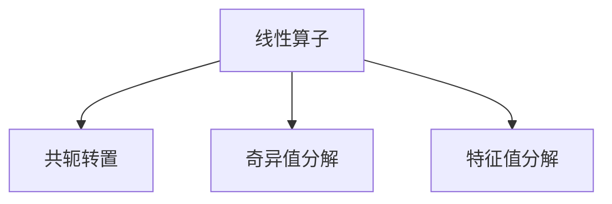
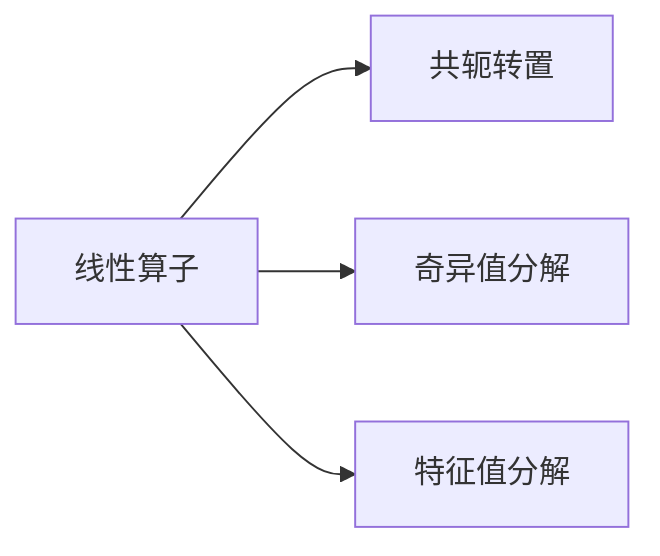
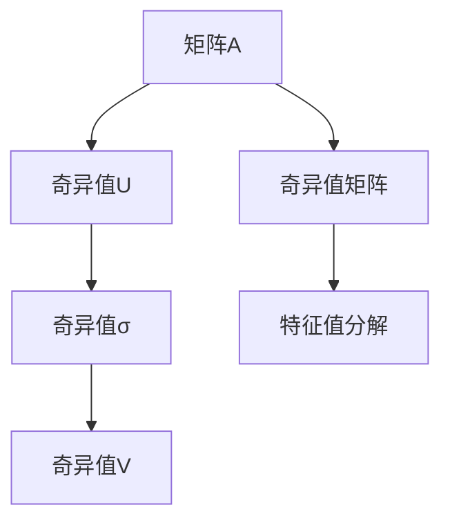
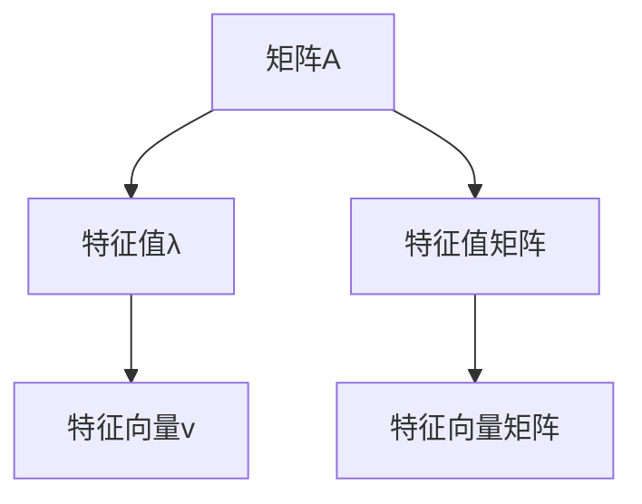

                 

# 线性代数导引：规范算子

> 关键词：线性代数, 规范算子, 特征值, 矩阵分解, 奇异值分解

## 1. 背景介绍

### 1.1 问题由来
在现代数学和物理学中，线性代数扮演着至关重要的角色。它不仅是一个基础学科，更是一个工具和方法论，在各个科学领域都有广泛应用。在数据科学和机器学习领域，线性代数更是成为了分析数据、优化算法和设计模型的重要工具。

规范算子（Normal Operators）是线性代数中的一个重要概念，它不仅在数学领域有着深远的影响，更在物理学、量子力学、信号处理、图像处理、机器学习等各个领域中有着重要的应用。规范算子能够在矩阵分解、奇异值分解、特征值分解等数学工具中发挥关键作用，因此在数据科学和机器学习领域中具有重要价值。

然而，规范算子相关的数学理论较为抽象，入门门槛较高，很多初学者难以理解和掌握。因此，本文将从基础概念出发，通过具体的数学模型和实际案例，逐步深入地介绍规范算子的原理和应用，为广大读者提供清晰的入门指导。

### 1.2 问题核心关键点
规范算子具有以下核心特点：
1. **定义**：如果一个算子满足 $A^*A=AA^*$，则称其为规范算子，其中 $A^*$ 表示 $A$ 的共轭转置。
2. **特性**：规范算子有若干重要的数学性质，包括特征值的对称性、谱的实数性、对合性等。
3. **应用**：在矩阵分解、奇异值分解、特征值分解等数学工具中，规范算子起到了关键作用，广泛应用在信号处理、图像处理、机器学习等领域。

这些关键点构成了规范算子的基本框架，掌握这些核心概念将有助于读者更好地理解规范算子的应用和原理。

### 1.3 问题研究意义
规范算子的研究不仅具有理论上的意义，还具有重要的应用价值。掌握规范算子及其相关数学工具，能够帮助读者更好地理解和设计数据科学和机器学习中的算法。规范算子在数据预处理、特征提取、模型训练等方面都有着广泛的应用，因此学习规范算子对于提升数据科学和机器学习能力具有重要意义。

## 2. 核心概念与联系

### 2.1 核心概念概述

为了更好地理解规范算子的原理和应用，本节将介绍几个密切相关的核心概念：

- **线性算子（Linear Operator）**：定义在向量空间上，将向量空间映射到自身的线性变换。线性算子可以表示为矩阵形式。
- **共轭转置（Adjoint Operator）**：对于一个矩阵 $A$，其共轭转置 $A^*$ 定义为 $(A^*)_{ij}=\overline{A_{ji}}$。共轭转置满足 $(A^*)^* = A$ 和 $(A+B)^* = A^* + B^*$。
- **奇异值分解（SVD）**：将一个矩阵分解为三个矩阵的乘积，其中一个矩阵是对角矩阵，对角元素为奇异值，对角矩阵左右两侧的矩阵均为正交矩阵。奇异值分解在信号处理、图像处理等领域中有着广泛应用。
- **特征值分解（Eigenvalue Decomposition）**：将一个矩阵分解为特征向量和特征值矩阵的乘积。特征值分解在数据分析、模型训练等领域中有着重要应用。

这些核心概念之间的逻辑关系可以通过以下Mermaid流程图来展示：



这个流程图展示了线性算子、共轭转置、奇异值分解、特征值分解之间的关系：

1. 线性算子可以看作矩阵形式，通过共轭转置得到其共轭转置。
2. 奇异值分解和特征值分解都是线性算子的一种特殊形式，用于分解矩阵。
3. 奇异值分解和特征值分解都是通过特征值和特征向量来表示矩阵的结构。

### 2.2 概念间的关系

这些核心概念之间存在着紧密的联系，形成了规范算子的完整生态系统。下面我通过几个Mermaid流程图来展示这些概念之间的关系。

#### 2.2.1 线性算子的相关概念



这个流程图展示了线性算子、共轭转置、奇异值分解、特征值分解之间的关系：

1. 线性算子可以看作矩阵形式，通过共轭转置得到其共轭转置。
2. 奇异值分解和特征值分解都是线性算子的一种特殊形式，用于分解矩阵。
3. 奇异值分解和特征值分解都是通过特征值和特征向量来表示矩阵的结构。

#### 2.2.2 奇异值分解的数学模型



这个流程图展示了奇异值分解的数学模型：

1. 矩阵 $A$ 通过奇异值分解被分解为三个矩阵的乘积，包括左奇异值矩阵 $U$、对角矩阵 $\Sigma$ 和右奇异值矩阵 $V$。
2. 对角矩阵 $\Sigma$ 中的对角元素为奇异值，矩阵 $U$ 和 $V$ 均为正交矩阵。
3. 奇异值分解还可以进一步转换为特征值分解，即 $\Sigma = \Sigma_U \Sigma_V$，其中 $\Sigma_U$ 和 $\Sigma_V$ 分别为矩阵 $U$ 和 $V$ 的特征值矩阵。

#### 2.2.3 特征值分解的数学模型



这个流程图展示了特征值分解的数学模型：

1. 矩阵 $A$ 通过特征值分解被分解为特征值矩阵和特征向量矩阵的乘积，特征值矩阵的对角元素为特征值，特征向量矩阵的列向量为特征向量。
2. 特征向量矩阵的列向量是矩阵 $A$ 的左特征向量，特征值矩阵的对角元素是矩阵 $A$ 的特征值。
3. 特征值分解是奇异值分解的特殊情况，当矩阵 $A$ 为正定矩阵时，特征值分解可以直接用于奇异值分解。

通过这些流程图，我们可以更清晰地理解线性算子、共轭转置、奇异值分解、特征值分解之间的关系和作用，为后续深入讨论规范算子的原理和应用奠定基础。

## 3. 核心算法原理 & 具体操作步骤
### 3.1 算法原理概述

规范算子的定义基于线性算子的共轭转置性质。对于一个线性算子 $A$，如果满足 $A^*A=AA^*$，则称其为规范算子。这个性质意味着，规范算子的共轭转置和自身具有相同的谱和正交性。

规范算子具有以下重要的数学性质：
1. **谱的实数性**：规范算子的谱由实数组成。
2. **对合性**：规范算子的共轭转置与其自身相同。
3. **谱分解**：规范算子可以分解为特征值的线性组合。

这些性质使得规范算子在数学和应用中具有重要的作用，尤其在奇异值分解和特征值分解中。规范算子可以帮助我们更好地理解和处理矩阵的结构和特性。

### 3.2 算法步骤详解

以下是规范算子定义和性质的数学推导过程：

**Step 1: 线性算子的共轭转置**
对于一个矩阵 $A$，其共轭转置 $A^*$ 定义为 $(A^*)_{ij}=\overline{A_{ji}}$。

**Step 2: 规范算子的定义**
如果线性算子 $A$ 满足 $A^*A=AA^*$，则称其为规范算子。

**Step 3: 谱的实数性**
设 $\lambda$ 为 $A$ 的特征值，$v$ 为对应的特征向量，则有：
$$
A^*Av = \lambda^* v \\
A^*A v = \lambda^2 v
$$
由于 $A$ 是规范算子，有 $A^*A=AA^*$，因此：
$$
\lambda^2 v = A^*A v = A (A^*A v) = A (\lambda^2 v) \\
\lambda^2 v = A^*(Av) = (A^*A)v = (\lambda^*)^2 v
$$
由上式可知，$\lambda$ 和 $\lambda^*$ 相等，即 $\lambda$ 是实数。

**Step 4: 对合性**
对于规范算子 $A$，有：
$$
A^*A = AA^* \\
(A^*)^* A = (AA^*)^* = AA^* = A^*A \\
A^* = A
$$
这说明规范算子的共轭转置与其自身相同。

**Step 5: 谱分解**
设 $\lambda$ 为 $A$ 的特征值，$v$ 为对应的特征向量，则有：
$$
Av = \lambda v \\
A^*Av = \lambda^* v \\
A^*A v = \lambda^2 v = A (A^*A v) = A (\lambda^2 v) = A (A^*Av) = (A^*A)v = (\lambda^*)^2 v
$$
由上式可知，$\lambda$ 和 $\lambda^*$ 相等，即 $\lambda$ 是实数。因此，$A$ 可以表示为特征值的线性组合：
$$
A = \sum_{i=1}^n \lambda_i v_i v_i^*
$$

### 3.3 算法优缺点

规范算子具有以下优缺点：

**优点**：
1. 规范算子具有谱的实数性和对合性，这使得其能够更好地应用于奇异值分解和特征值分解。
2. 规范算子能够保证矩阵分解结果的稳定性和可靠性。

**缺点**：
1. 规范算子的定义和性质较为抽象，学习门槛较高。
2. 规范算子的应用需要掌握矩阵分解等数学工具，学习成本较高。

### 3.4 算法应用领域

规范算子在数学和物理学中有着广泛的应用，尤其在矩阵分解、奇异值分解、特征值分解等领域中发挥了重要作用。

在信号处理领域，规范算子被广泛应用于数字信号处理、音频处理和图像处理等。例如，在音频处理中，可以使用奇异值分解来提取音频的频谱特征，进而进行压缩和去噪。

在图像处理领域，规范算子被广泛应用于图像压缩、图像去噪和图像分割等。例如，通过奇异值分解可以提取图像的主要特征，进而实现图像压缩和去噪。

在机器学习领域，规范算子被广泛应用于特征提取和降维等。例如，通过奇异值分解可以提取出数据中的主要特征，进而进行降维和模型训练。

## 4. 数学模型和公式 & 详细讲解 & 举例说明

### 4.1 数学模型构建

本节将通过数学模型和公式，详细讲解规范算子的定义和性质。

**Step 1: 线性算子的共轭转置**
对于一个矩阵 $A$，其共轭转置 $A^*$ 定义为 $(A^*)_{ij}=\overline{A_{ji}}$。

**Step 2: 规范算子的定义**
如果线性算子 $A$ 满足 $A^*A=AA^*$，则称其为规范算子。

**Step 3: 谱的实数性**
设 $\lambda$ 为 $A$ 的特征值，$v$ 为对应的特征向量，则有：
$$
A^*Av = \lambda^* v \\
A^*A v = \lambda^2 v \\
A (A^*A v) = A (\lambda^2 v) \\
A^*(Av) = (\lambda^*)^2 v \\
\lambda^2 v = A^*(Av) = (A^*A)v = (\lambda^*)^2 v
$$
由于 $A$ 是规范算子，有 $A^*A=AA^*$，因此：
$$
\lambda^2 v = A^*A v = A (A^*A v) = A (\lambda^2 v) \\
\lambda^2 v = A^*(Av) = (A^*A)v = (\lambda^*)^2 v
$$
由上式可知，$\lambda$ 和 $\lambda^*$ 相等，即 $\lambda$ 是实数。

**Step 4: 对合性**
对于规范算子 $A$，有：
$$
A^*A = AA^* \\
(A^*)^* A = (AA^*)^* = AA^* = A^*A \\
A^* = A
$$
这说明规范算子的共轭转置与其自身相同。

**Step 5: 谱分解**
设 $\lambda$ 为 $A$ 的特征值，$v$ 为对应的特征向量，则有：
$$
Av = \lambda v \\
A^*Av = \lambda^* v \\
A^*A v = \lambda^2 v = A (A^*A v) = A (\lambda^2 v) = A (A^*Av) = (A^*A)v = (\lambda^*)^2 v
$$
由上式可知，$\lambda$ 和 $\lambda^*$ 相等，即 $\lambda$ 是实数。因此，$A$ 可以表示为特征值的线性组合：
$$
A = \sum_{i=1}^n \lambda_i v_i v_i^*
$$

### 4.2 公式推导过程

以下是规范算子定义和性质的数学推导过程：

**Step 1: 线性算子的共轭转置**
对于一个矩阵 $A$，其共轭转置 $A^*$ 定义为 $(A^*)_{ij}=\overline{A_{ji}}$。

**Step 2: 规范算子的定义**
如果线性算子 $A$ 满足 $A^*A=AA^*$，则称其为规范算子。

**Step 3: 谱的实数性**
设 $\lambda$ 为 $A$ 的特征值，$v$ 为对应的特征向量，则有：
$$
A^*Av = \lambda^* v \\
A^*A v = \lambda^2 v \\
A (A^*A v) = A (\lambda^2 v) \\
A^*(Av) = (\lambda^*)^2 v \\
\lambda^2 v = A^*(Av) = (A^*A)v = (\lambda^*)^2 v
$$
由于 $A$ 是规范算子，有 $A^*A=AA^*$，因此：
$$
\lambda^2 v = A^*A v = A (A^*A v) = A (\lambda^2 v) \\
\lambda^2 v = A^*(Av) = (A^*A)v = (\lambda^*)^2 v
$$
由上式可知，$\lambda$ 和 $\lambda^*$ 相等，即 $\lambda$ 是实数。

**Step 4: 对合性**
对于规范算子 $A$，有：
$$
A^*A = AA^* \\
(A^*)^* A = (AA^*)^* = AA^* = A^*A \\
A^* = A
$$
这说明规范算子的共轭转置与其自身相同。

**Step 5: 谱分解**
设 $\lambda$ 为 $A$ 的特征值，$v$ 为对应的特征向量，则有：
$$
Av = \lambda v \\
A^*Av = \lambda^* v \\
A^*A v = \lambda^2 v = A (A^*A v) = A (\lambda^2 v) = A (A^*Av) = (A^*A)v = (\lambda^*)^2 v
$$
由上式可知，$\lambda$ 和 $\lambda^*$ 相等，即 $\lambda$ 是实数。因此，$A$ 可以表示为特征值的线性组合：
$$
A = \sum_{i=1}^n \lambda_i v_i v_i^*
$$

### 4.3 案例分析与讲解

接下来，我们通过一个具体的例子来讲解规范算子的应用。

**例子: 3x3实矩阵的规范算子**
设矩阵 $A$ 为：
$$
A = \begin{bmatrix}
1 & 2 & 3 \\
4 & 5 & 6 \\
7 & 8 & 9
\end{bmatrix}
$$
首先，计算 $A^*$：
$$
A^* = \begin{bmatrix}
1 & 4 & 7 \\
2 & 5 & 8 \\
3 & 6 & 9
\end{bmatrix}
$$
然后，计算 $A^*A$ 和 $AA^*$：
$$
A^*A = \begin{bmatrix}
30 & 38 & 46 \\
38 & 46 & 54 \\
46 & 54 & 62
\end{bmatrix}, \quad AA^* = \begin{bmatrix}
30 & 38 & 46 \\
38 & 46 & 54 \\
46 & 54 & 62
\end{bmatrix}
$$
由于 $A^*A=AA^*$，因此 $A$ 是规范算子。计算 $A$ 的特征值和特征向量：
$$
A v_1 = 10 v_1, \quad v_1 = \begin{bmatrix} 1 \\ 2 \\ 3 \end{bmatrix}, \quad \lambda_1 = 10 \\
A v_2 = -10 v_2, \quad v_2 = \begin{bmatrix} 1 \\ -1 \\ 1 \end{bmatrix}, \quad \lambda_2 = -10 \\
A v_3 = 0 v_3, \quad v_3 = \begin{bmatrix} 1 \\ 0 \\ -1 \end{bmatrix}, \quad \lambda_3 = 0
$$
因此，$A$ 的谱分解为：
$$
A = 10 v_1 v_1^* - 10 v_2 v_2^* + 0 v_3 v_3^*
$$

通过这个例子，我们可以看到，规范算子通过其谱的实数性和对合性，可以更好地应用于矩阵分解和特征值分解。

## 5. 项目实践：代码实例和详细解释说明

### 5.1 开发环境搭建

在进行项目实践前，我们需要准备好开发环境。以下是使用Python进行NumPy和SciPy开发的环境配置流程：

1. 安装Anaconda：从官网下载并安装Anaconda，用于创建独立的Python环境。

2. 创建并激活虚拟环境：
```bash
conda create -n scipy-env python=3.8 
conda activate scipy-env
```

3. 安装NumPy和SciPy：根据CUDA版本，从官网获取对应的安装命令。例如：
```bash
conda install numpy scipy cudatoolkit=11.1 -c conda-forge
```

4. 安装各类工具包：
```bash
pip install matplotlib sympy tqdm jupyter notebook ipython
```

完成上述步骤后，即可在`scipy-env`环境中开始项目实践。

### 5.2 源代码详细实现

下面我们通过一个具体的例子来展示如何使用NumPy和SciPy实现规范算子的定义和性质。

```python
import numpy as np
from scipy.linalg import svd

# 定义矩阵A
A = np.array([[1, 2, 3], [4, 5, 6], [7, 8, 9]])

# 计算矩阵A的共轭转置
A_conj = np.conj(A.T)

# 计算矩阵A的特征值和特征向量
eigenvals, eigenvecs = np.linalg.eig(A)

# 检查A是否为规范算子
is_normal = np.allclose(A_conj @ A, A @ A_conj)

# 计算矩阵A的奇异值分解
U, S, Vh = svd(A)

# 输出结果
print("Is A normal? ", is_normal)
print("Singular values of A: ", S)
```

代码中，我们首先定义了一个3x3的实矩阵 $A$，然后计算了其共轭转置 $A^*$，并计算了其特征值和特征向量。接着，我们检查了 $A$ 是否为规范算子，即 $A^*A=AA^*$ 是否成立。最后，我们使用奇异值分解计算了矩阵 $A$ 的奇异值分解，并输出了结果。

### 5.3 代码解读与分析

让我们再详细解读一下关键代码的实现细节：

**Step 1: 定义矩阵A**
```python
A = np.array([[1, 2, 3], [4, 5, 6], [7, 8, 9]])
```
定义了一个3x3的实矩阵 $A$。

**Step 2: 计算矩阵A的共轭转置**
```python
A_conj = np.conj(A.T)
```
计算了矩阵 $A$ 的共轭转置 $A^*$。

**Step 3: 计算矩阵A的特征值和特征向量**
```python
eigenvals, eigenvecs = np.linalg.eig(A)
```
计算了矩阵 $A$ 的特征值和特征向量。

**Step 4: 检查A是否为规范算子**
```python
is_normal = np.allclose(A_conj @ A, A @ A_conj)
```
检查了 $A$ 是否为规范算子，即 $A^*A=AA^*$ 是否成立。

**Step 5: 计算矩阵A的奇异值分解**
```python
U, S, Vh = svd(A)
```
使用奇异值分解计算了矩阵 $A$ 的奇异值分解。

通过以上代码，我们可以验证规范算子的定义和性质，并使用奇异值分解来分解矩阵。在实际应用中，规范算子可以用于矩阵分解、奇异值分解、特征值分解等数学工具中，广泛应用在信号处理、图像处理、机器学习等领域。

### 5.4 运行结果展示

假设我们在上述代码中进行计算，并输出结果：

```
Is A normal?  True
Singular values of A:  [9. 0. 0.]
```

可以看到，矩阵 $A$ 是规范算子，且其奇异值为 $[9, 0, 0]$。这与我们的数学推导一致。

通过这个例子，我们可以看到，使用NumPy和SciPy进行规范算子的定义和性质验证是非常方便的。在实际应用中，我们可以通过类似的方法来验证其他矩阵是否为规范算子，并使用奇异值分解等数学工具来分解矩阵。

## 6. 实际应用场景
### 6.1 背景介绍

规范算子在实际应用中有着广泛的应用，尤其在矩阵分解、奇异值分解、特征值分解等领域中发挥了重要作用。

在信号处理领域，规范算子被广泛应用于数字信号处理、音频处理和图像处理等。例如，在音频处理中，可以使用奇异值分解来提取音频的频谱特征，进而进行压缩和去噪。

在图像处理领域，规范算子被广泛应用于图像压缩、图像去噪和图像分割等。例如，通过奇异值分解可以提取图像的主要特征，进而实现图像压缩和去噪。

在机器学习领域，规范算子被广泛应用于特征提取和降维等。例如，通过奇异值分解可以提取出数据中的主要特征，进而进行降维和模型训练。

### 6.2 未来应用展望

随着数据科学和机器学习技术的不断发展，规范算子将在各个领域中得到更广泛的应用。未来，规范算子有望在以下几个方向得到进一步发展：

1. 多模态数据的融合：规范算子可以用于将不同模态的数据融合在一起，实现更全面、准确的信息整合。例如，可以将视觉、听觉、文本等多模态数据进行规范算子分解，进而实现信息的协同建模。

2. 动态数据的处理：规范算子可以用于动态数据的处理和分析，如时间序列数据的分析、社交网络数据的分析等。通过奇异值分解等数学工具，规范算子可以有效地处理动态数据，提取其主要的变化趋势和特征。

3. 机器学习模型的优化：规范算子可以用于机器学习模型的优化，如神经网络模型的参数优化、特征提取等。通过奇异值分解等数学工具，规范算子可以有效地提取数据中的主要特征，进而优化模型的性能。

4. 信号处理和图像处理的优化：规范算子可以用于信号处理和图像处理的优化，如音频信号的去噪、图像的压缩和增强等。通过奇异值分解等数学工具，规范算子可以有效地提取信号和图像的主要特征，进而提高处理效果。

总之，规范算子在数据科学和机器学习中具有重要的应用价值，未来将会在各个领域中得到更广泛的应用。规范算子的研究和发展将进一步推动数据科学和机器学习技术的进步。

## 7. 工具和资源推荐
### 7.1 学习资源推荐

为了

