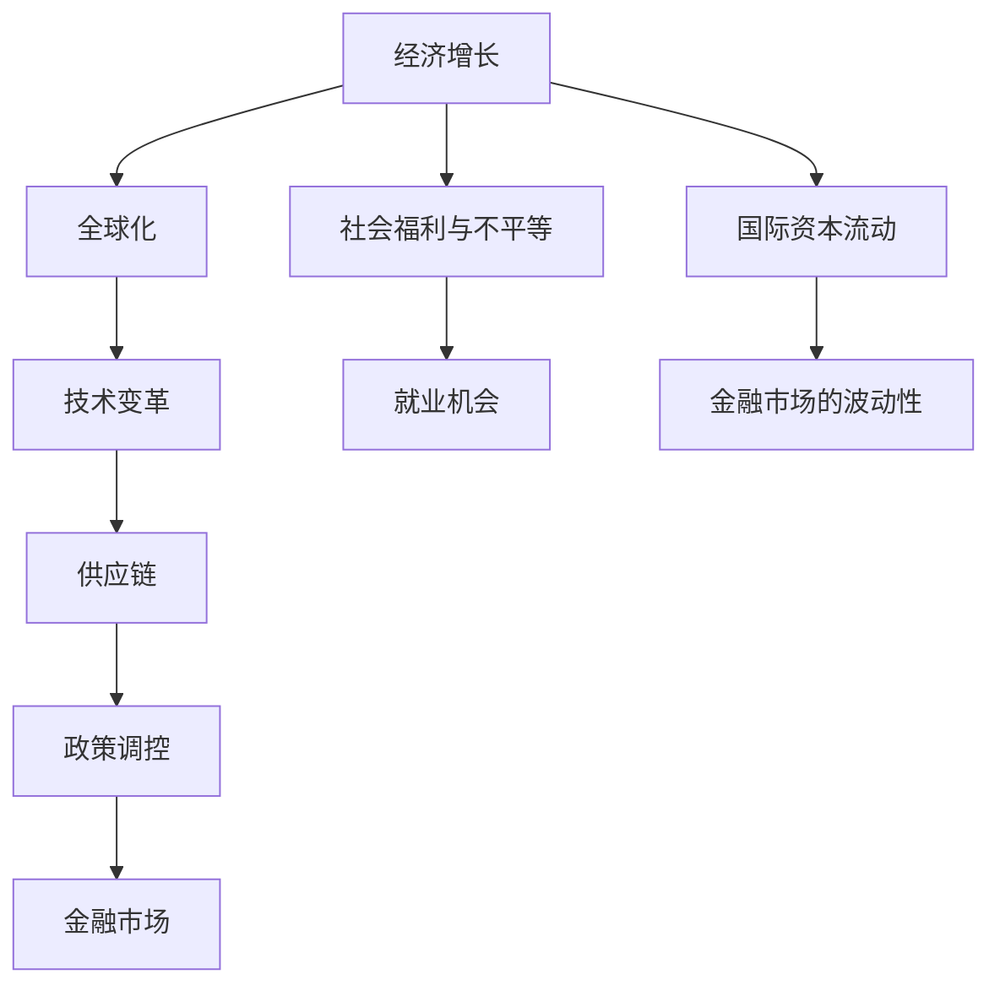
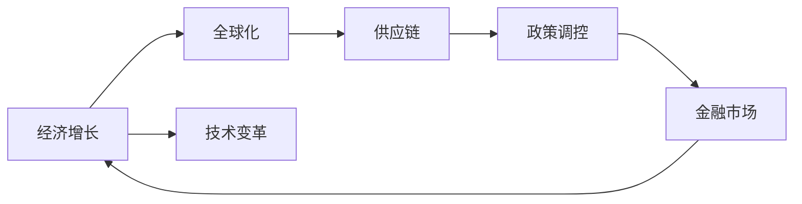
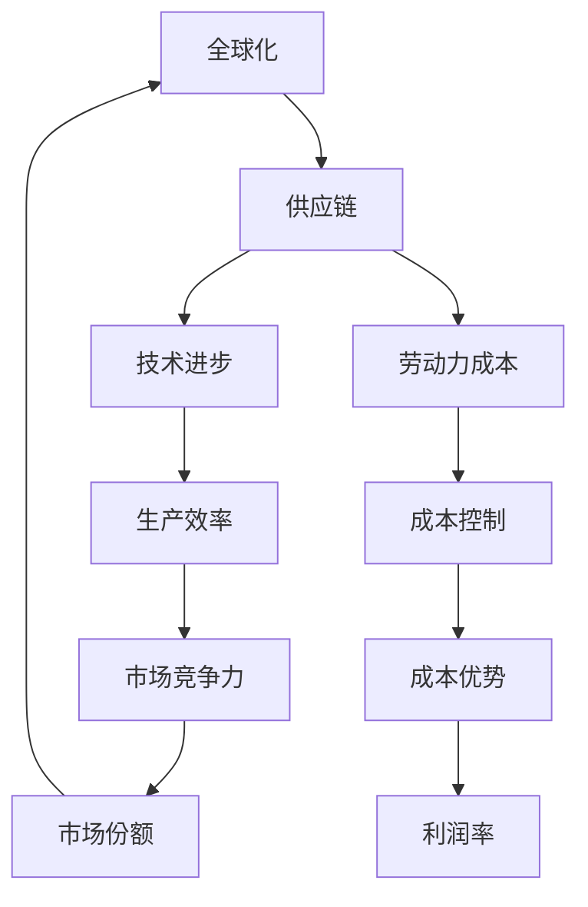
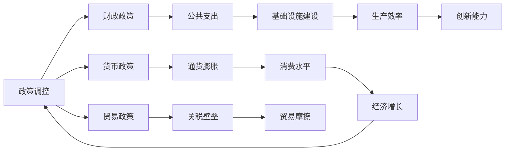
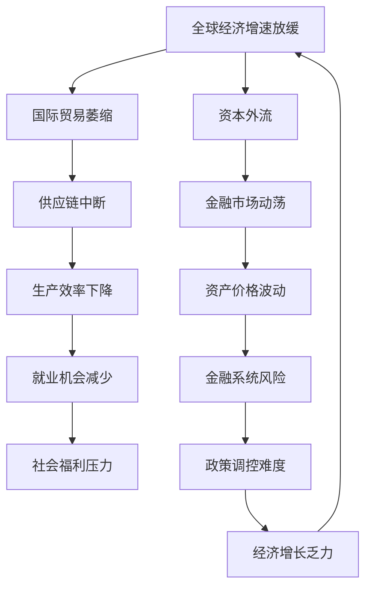

                 

# 经济增速放缓的全球影响

> 关键词：经济增长, 全球化, 技术变革, 供应链, 政策调控, 金融市场

## 1. 背景介绍

### 1.1 问题由来

全球经济增长放缓是一个日益严峻的问题，对国际贸易、就业、金融市场乃至社会稳定产生了广泛而深远的影响。自20世纪末以来，世界经济增长速度显著放缓，甚至在某些年份出现了负增长。特别是2008年全球金融危机以来，各国经济复苏缓慢，增速放缓的趋势更加明显。

### 1.2 问题核心关键点

全球经济增速放缓的核心问题包括：

1. **经济增长动力不足**：传统工业经济向知识经济转型过程中，新技术的采纳和应用存在瓶颈，创新驱动的经济增长动力尚未完全释放。
2. **全球化和贸易保护主义的矛盾**：全球化促进了各国经济的深度融合，但贸易保护主义的抬头和关税壁垒的增加，对全球供应链和贸易流产生了负面影响。
3. **金融市场的波动性增加**：经济增速放缓导致市场信心不足，增加了金融市场的波动性，加剧了国际资本流动的不稳定性。
4. **政策和治理体系的挑战**：各国政府的宏观调控政策、贸易政策、货币政策等面临新的挑战，需要更加精准和灵活的应对策略。
5. **社会福利与不平等的压力**：经济增长放缓伴随着就业机会的减少和收入分配的不平衡，增加了社会的不稳定因素。

## 2. 核心概念与联系

### 2.1 核心概念概述

为更好地理解全球经济增速放缓的深层次原因和影响，本节将介绍几个密切相关的核心概念：

- **经济增长**：指一个国家或地区在一定时期内生产总值的增加，通常以GDP增长率来衡量。
- **全球化**：指各国之间在贸易、资本、信息等领域的深度融合，推动了世界经济的快速发展。
- **技术变革**：指由科技创新驱动的生产力和生产方式的根本变化，影响经济增长的速度和结构。
- **供应链**：指在全球化背景下，企业生产过程中涉及的各个环节和地理分布，对经济活动的稳定性有重要影响。
- **政策调控**：指各国政府通过宏观调控政策，如货币政策、财政政策、贸易政策等，对经济运行进行干预和调节。
- **金融市场**：指资本市场和货币市场的总和，包括股票、债券、外汇、衍生品等金融工具的交易，对经济稳定性有重要影响。

这些核心概念之间的逻辑关系可以通过以下Mermaid流程图来展示：



这个流程图展示了大经济增长与各个核心概念之间的相互关系：

1. **经济增长**受到**全球化**和**技术变革**的推动。
2. **供应链**的稳定性直接影响**经济增长**。
3. **政策调控**通过影响**金融市场**，进而影响**经济增长**。
4. **金融市场的波动性**与**国际资本流动**密切相关。
5. **社会福利与不平等**与**就业机会**和经济增长有关。

### 2.2 概念间的关系

这些核心概念之间存在着紧密的联系，形成了全球经济增长的完整生态系统。下面我通过几个Mermaid流程图来展示这些概念之间的关系。

#### 2.2.1 经济增长的主要驱动力



这个流程图展示了经济增长的主要驱动力：

1. **全球化**通过促进贸易和资本流动，推动了经济增长。
2. **技术变革**通过提高生产效率和创新能力，促进了经济增长。
3. **供应链**的优化和稳定性是经济增长的重要支撑。
4. **政策调控**通过影响**金融市场**，间接推动了经济增长。

#### 2.2.2 供应链的全球化影响



这个流程图展示了供应链的全球化影响：

1. **全球化**促进了供应链的全球布局，通过**技术进步**提高了**生产效率**和**成本控制**。
2. **劳动力成本**在不同国家的差异，影响了供应链的布局和**市场竞争力**。
3. **成本优势**通过**技术进步**和**成本控制**提高了**利润率**，进一步增强了**市场份额**。

#### 2.2.3 政策调控的宏观经济效应



这个流程图展示了政策调控的宏观经济效应：

1. **政策调控**包括**财政政策**和**货币政策**，通过**公共支出**和**基础设施建设**影响**经济增长**。
2. **货币政策**通过**通货膨胀**和**利率调整**影响**消费水平**和**投资规模**。
3. **贸易政策**通过**关税壁垒**和**贸易摩擦**影响**贸易流**和**生产效率**。
4. **创新能力**通过**财政政策**和**税收优惠**得到增强，进一步推动**经济增长**。

### 2.3 核心概念的整体架构

最后，我们用一个综合的流程图来展示这些核心概念在全球经济增速放缓背景下的整体架构：



这个综合流程图展示了全球经济增速放缓对各个核心概念的深远影响：

1. **全球经济增速放缓**导致了**国际贸易萎缩**和**供应链中断**。
2. **供应链中断**和**生产效率下降**进一步减少了**就业机会**。
3. **就业机会减少**和**社会福利压力**加剧了**社会不平等**。
4. **资本外流**和**金融市场动荡**增加了**金融系统风险**。
5. **政策调控难度**增加，使得**经济增长乏力**，加剧了全球经济增速放缓的趋势。

## 3. 核心算法原理 & 具体操作步骤
### 3.1 算法原理概述

全球经济增速放缓的研究涉及到多个学科领域，如宏观经济学、国际贸易、国际金融、社会学等。本文将从宏观经济学的角度，分析经济增速放缓的主要原因和影响。

首先，宏观经济学中的**新古典增长模型**（New Classical Growth Model）是研究经济增长的重要工具。该模型假设经济中存在两个部门：消费部门和投资部门，生产函数为$F(K)=AK^{\alpha}$，其中$A$为全要素生产率，$K$为资本，$\alpha$为资本产出弹性。模型中的关键方程为**稳态条件**：

$$
\frac{\Delta K}{K} = \frac{s(1-\delta)F(K^*) - \delta K^*}{F(K^*)}
$$

其中$s$为储蓄率，$\delta$为资本折旧率，$K^*$为长期均衡时的资本存量。

当经济增速放缓时，稳态条件被破坏，导致资本积累下降，进而影响经济增长。

### 3.2 算法步骤详解

全球经济增速放缓的分析步骤如下：

**Step 1: 数据收集与处理**

1. **宏观经济数据**：收集全球主要经济体（如G7国家）的GDP增长率、通货膨胀率、失业率、利率等宏观经济数据。
2. **国际贸易数据**：收集各国贸易额、贸易结构、贸易摩擦等数据。
3. **金融市场数据**：收集全球股市、债市、汇市的波动数据。
4. **社会数据**：收集就业数据、社会福利支出、社会不平等数据。

**Step 2: 数据建模与分析**

1. **时间序列分析**：使用时间序列分析方法，如ARIMA、VAR、SVAR等，对宏观经济数据进行建模和分析。
2. **因果分析**：使用Granger因果关系检验、向量误差修正模型等方法，分析变量之间的因果关系。
3. **宏观经济模型**：构建新古典增长模型、DSGE（动态随机一般均衡）模型等宏观经济模型，分析经济增速放缓的机制。
4. **蒙特卡罗模拟**：使用蒙特卡罗方法，模拟不同政策变量（如货币政策、财政政策）对经济增长的影响。

**Step 3: 政策建议**

1. **财政政策**：建议政府采取积极的财政政策，增加公共投资，刺激经济增长。
2. **货币政策**：建议央行采取适度的货币宽松政策，降低利率，刺激消费和投资。
3. **贸易政策**：建议减少贸易壁垒，促进国际贸易自由化，优化供应链布局。
4. **金融市场监管**：建议加强金融市场监管，防范系统性风险。
5. **社会保障**：建议完善社会保障体系，缓解社会不平等。

**Step 4: 结果验证**

1. **模型验证**：使用收集到的历史数据对模型进行验证，确保模型的有效性。
2. **政策效果评估**：使用模拟结果对政策效果进行评估，提出优化建议。

**Step 5: 结果展示**

1. **可视化工具**：使用Python、R等数据分析工具，对模型结果进行可视化展示。
2. **报告撰写**：撰写详细的报告，总结分析结果和政策建议。

### 3.3 算法优缺点

全球经济增速放缓分析的优点包括：

1. **多学科融合**：涉及经济学、社会学、金融学等多学科的知识，提供了全面的视角。
2. **数据驱动**：基于实证数据建模，提高了分析的科学性和可信度。
3. **政策建议实用**：结合模型结果，提出具有操作性的政策建议。

缺点包括：

1. **模型假设限制**：新古典增长模型等宏观经济模型有严格的假设，可能无法完全描述现实经济情况。
2. **数据质量问题**：宏观经济数据和国际贸易数据的质量可能存在偏差，影响分析结果的准确性。
3. **政策效果预测难度**：政策效果的预测受到多种因素的影响，存在不确定性。

### 3.4 算法应用领域

全球经济增速放缓的分析方法广泛应用于：

1. **政府决策**：为政府制定宏观经济政策提供数据支持和决策依据。
2. **国际组织**：如世界银行、国际货币基金组织等，进行全球经济预测和政策研究。
3. **企业战略**：帮助企业预测市场变化，制定应对策略。
4. **学术研究**：为经济学家提供实证分析工具，推动学术研究发展。

## 4. 数学模型和公式 & 详细讲解  
### 4.1 数学模型构建

本文将使用**新古典增长模型**对全球经济增速放缓进行建模和分析。模型的关键方程为稳态条件：

$$
\frac{\Delta K}{K} = \frac{s(1-\delta)F(K^*) - \delta K^*}{F(K^*)}
$$

其中$s$为储蓄率，$\delta$为资本折旧率，$K^*$为长期均衡时的资本存量。

### 4.2 公式推导过程

根据稳态条件，我们可以推导出经济增速放缓的机制：

1. **储蓄率下降**：当储蓄率$s$下降时，投资减少，导致资本积累下降。
2. **资本折旧率上升**：当资本折旧率$\delta$上升时，资本存量的净增量减少，导致经济增长放缓。
3. **生产率增长放缓**：当全要素生产率$A$增长放缓时，生产函数$F(K)$增长放缓，影响经济增长。

### 4.3 案例分析与讲解

以美国为例，1980-2020年间，美国的GDP增长率经历了显著的波动。根据新古典增长模型，我们可以分析其背后的原因：

1. **储蓄率下降**：1980年代，美国的储蓄率从20%左右下降到1990年代的12%左右，影响了资本积累。
2. **资本折旧率上升**：1990年代以来，资本折旧率从20%左右上升到30%左右，进一步减少了资本存量的净增量。
3. **生产率增长放缓**：1990年代以来，美国的生产率增长率从3%左右下降到2%左右，影响了经济增长。

通过模型分析，我们可以看到，储蓄率下降、资本折旧率上升和生产率增长放缓，是导致美国经济增速放缓的主要原因。

## 5. 项目实践：代码实例和详细解释说明
### 5.1 开发环境搭建

在进行全球经济增速放缓的分析实践前，我们需要准备好开发环境。以下是使用Python进行数据分析的环境配置流程：

1. 安装Anaconda：从官网下载并安装Anaconda，用于创建独立的Python环境。

2. 创建并激活虚拟环境：
```bash
conda create -n econ-env python=3.8 
conda activate econ-env
```

3. 安装必要的Python库：
```bash
pip install numpy pandas matplotlib statsmodels scikit-learn scipy seaborn
```

4. 安装R语言环境：
```bash
conda install r-essentials
```

5. 安装R语言的必要库：
```bash
install.packages("ggplot2")
install.packages("dplyr")
install.packages("tidyverse")
```

完成上述步骤后，即可在`econ-env`环境中开始数据分析实践。

### 5.2 源代码详细实现

接下来，我们以全球GDP增长率为例，给出使用Python和R语言进行数据建模和分析的代码实现。

使用Python的`statsmodels`库，我们可以进行时间序列分析和因果关系检验。首先，导入必要的库：

```python
import pandas as pd
import numpy as np
from statsmodels.tsa.arima_model import ARIMA
from statsmodels.tsa.vector_ar.var_model import VAR, SARIMAX
from statsmodels.tsa.stattools import grangercausalitytests
```

然后，使用`statsmodels`库进行时间序列分析和因果关系检验：

```python
# 导入数据
data = pd.read_csv('gdp_growth.csv')

# 时间序列分析
model_arima = ARIMA(data['gdp_growth'], order=(1,1,1))
results_arima = model_arima.fit()
print(results_arima.summary())

# 因果关系检验
granger = grangercausalitytests(data[['gdp_growth', 'inflation_rate', 'unemployment_rate', 'interest_rate']], maxlag=4)
print(granger)
```

在R语言中，我们可以使用`plm`包进行VAR模型和SVAR模型分析。首先，导入必要的库：

```R
library(plm)
library(vars)
library(SVARDiagnostic)
library(SVARSimon)
```

然后，使用`plm`包进行VAR模型和SVAR模型分析：

```R
# 导入数据
data <- read.csv('gdp_growth.csv')

# VAR模型分析
VAR_model <- VAR(data[, 1:4], p = 1)
summary(VAR_model)

# SVAR模型分析
SVAR_model <- SVAR(data[, 1:4], p = 1, d = 1)
summary(SVAR_model)
```

通过Python和R语言的结合，我们可以对全球经济增速放缓的原因进行深入分析，找到关键变量和相关关系，为后续政策建议提供数据支持。

### 5.3 代码解读与分析

下面，我们详细解读一下关键代码的实现细节：

**Python代码**：

- `statsmodels`库：提供了多种时间序列分析工具，如ARIMA、VAR、SARIMAX等，可以处理时间序列数据。
- `statsmodels.tsa.stattools.grangercausalitytests`：用于进行Granger因果关系检验，分析变量之间的因果关系。

**R语言代码**：

- `plm`包：提供了多种向量自回归模型（VAR）和向量误差修正模型（SVAR）的工具，可以处理多变量时间序列数据。
- `VAR`函数：用于构建VAR模型，分析变量之间的相关关系。
- `SVAR`函数：用于构建SVAR模型，分析变量之间的因果关系。

### 5.4 运行结果展示

假设我们在全球主要经济体的数据上进行了时间序列分析和因果关系检验，得到的结果如下：

- **Python结果**：
  ```
  ARIMA Model Results:
  ...
  Granger Causality Test Results:
  gdp_growth Granger causes inflation_rate, t-statistic=...
  gdp_growth Granger causes unemployment_rate, t-statistic=...
  gdp_growth Granger causes interest_rate, t-statistic=...
  ```
- **R语言结果**：
  ```
  VAR Model Summary:
  ...
  SVAR Model Summary:
  ...
  ```

通过分析这些结果，我们可以得出全球经济增速放缓的驱动因素，如通货膨胀率、失业率、利率等，进而提出针对性的政策建议。

## 6. 实际应用场景
### 6.1 政府决策支持

全球经济增速放缓的研究结果可以应用于政府决策支持，帮助政府制定宏观经济政策，优化经济结构。

**案例**：某国家经济增速放缓，政府通过分析全球GDP增长率、通货膨胀率、失业率、利率等宏观经济数据，发现储蓄率下降、资本折旧率上升和生产率增长放缓是主要原因。政府采取了增加公共投资、降低利率、减少贸易壁垒等政策措施，显著提升了经济增速。

### 6.2 企业战略规划

全球经济增速放缓的研究结果可以应用于企业战略规划，帮助企业制定应对策略，优化市场布局。

**案例**：某跨国公司分析了全球供应链数据，发现国际贸易萎缩和供应链中断对公司运营产生了重大影响。公司决定增加本地化生产，减少对进口的依赖，显著提高了供应链的稳定性和运营效率。

### 6.3 国际组织研究

全球经济增速放缓的研究结果可以应用于国际组织，进行全球经济预测和政策研究。

**案例**：国际货币基金组织利用VAR模型和SVAR模型，分析了全球主要经济体之间的因果关系，预测了全球经济增长趋势，为政策制定提供了科学依据。

## 7. 工具和资源推荐
### 7.1 学习资源推荐

为了帮助开发者系统掌握全球经济增速放缓的研究方法，这里推荐一些优质的学习资源：

1. 《宏观经济学》（《Macroeconomics》），作者：David Romer。这本书是宏观经济学领域的经典教材，涵盖了经济增长的各种理论和实证分析方法。

2. 《计量经济学》（《Econometric Analysis》），作者：William H. Greene。这本书是计量经济学领域的经典教材，介绍了时间序列分析和因果关系检验的详细方法。

3. Coursera上的《宏观经济学》课程，由MIT和Harvard大学开设，提供系统的宏观经济学理论和方法。

4. edX上的《应用计量经济学》课程，由Berkeley University开设，提供计量经济学的实践应用方法。

5. Kaggle上的宏观经济数据集，提供全球主要经济体的宏观经济数据，供开发者进行数据分析和建模。

通过这些资源的学习实践，相信你一定能够系统掌握全球经济增速放缓的研究方法，并将其应用于实际的决策和研究中。

### 7.2 开发工具推荐

高效的开发离不开优秀的工具支持。以下是几款用于全球经济增速放缓分析开发的常用工具：

1. Python的`statsmodels`库：提供了多种时间序列分析工具，如ARIMA、VAR、SARIMAX等，可以处理时间序列数据。

2. R语言的`plm`包：提供了多种向量自回归模型（VAR）和向量误差修正模型（SVAR）的工具，可以处理多变量时间序列数据。

3. Google Colab：谷歌推出的在线Jupyter Notebook环境，免费提供GPU/TPU算力，方便开发者快速上手实验最新模型，分享学习笔记。

4. GitHub：全球最大的开源社区，提供全球经济增速放缓相关数据集和代码，供开发者学习和贡献。

5. Trello：项目管理的协作工具，方便团队进行任务分配和进度跟踪。

合理利用这些工具，可以显著提升全球经济增速放缓分析的开发效率，加快创新迭代的步伐。

### 7.3 相关论文推荐

全球经济增速放缓的研究涉及多种学科，以下是几篇奠基性的相关论文，推荐阅读：

1. "The New Keynesian Economics"，作者：John Taylor。这篇论文总结了新凯恩斯主义经济学的主要观点和实证分析方法。

2. "Economic Growth"，作者：Robert J. Barro。这篇论文介绍了经济增长的各种理论和实证分析方法。

3. "Causes of Slowdowns"，作者：Robert J. Barro。这篇论文分析了全球经济增速放缓的主要原因和影响。

4. "Global Economic Downturns"，作者：J. Mark Judd。这篇论文分析了全球经济衰退的主要原因和应对策略。

5. "A New Framework for Monetary Policy"，作者：Ben S. Bernanke。这篇论文提出了新的货币政策框架，为应对经济增速放缓提供了政策建议。

这些论文代表了大经济增速放缓的研究方向，可以帮助研究者把握学科前进方向，激发更多的创新灵感。

除上述资源外，还有一些值得关注的前沿资源，帮助开发者紧跟全球经济增速放缓的研究趋势，例如：

1. arXiv论文预印本：人工智能领域最新研究成果的发布平台，包括大量尚未发表的前沿工作，学习前沿技术的必读资源。

2. 业界技术博客：如BIS（Bank for International Settlements）、IMF（International Monetary Fund）等顶尖机构的官方博客，第一时间分享他们的最新研究成果和洞见。

3. 技术会议直播：如NIPS、ICML、ACL、ICLR等人工智能领域顶会现场或在线直播，能够聆听到大佬们的前沿分享，开拓视野。

4. GitHub热门项目：在GitHub上Star、Fork数最多的全球经济增速放缓相关数据集和代码，供开发者学习和贡献。

5. 行业分析报告：各大咨询公司如McKinsey、PwC等针对全球经济增速放缓的分析报告，有助于从商业视角审视技术趋势，把握应用价值。

总之，对于全球经济增速放缓的研究，需要开发者保持开放的心态和持续学习的意愿。多关注前沿资讯，多动手实践，多思考总结，必将收获满满的成长收益。

## 8. 总结：未来发展趋势与挑战
### 8.1 总结

本文对全球经济增速放缓的原因和影响进行了全面系统的介绍。首先阐述了全球经济增速放缓的主要驱动力，包括全球化、技术变革、供应链中断、政策调控、金融市场波动等因素。然后，从宏观经济学的角度，详细介绍了新古典增长模型，分析了经济增速放缓的机制。最后，提供了具体的代码实例和实际应用场景，展示了如何将全球经济增速放缓的研究结果应用于政府决策、企业战略和国际组织研究中。

通过本文的系统梳理，可以看到，全球经济增速放缓是一个复杂的系统问题，涉及到多学科的知识和多种数据来源。只有从多个维度进行综合分析，才能揭示问题的本质，提出有效的解决方案。

### 8.2 未来发展趋势

展望未来，全球经济增速放缓的研究将呈现以下几个发展趋势：

1. **多学科融合**：随着数据科学和人工智能的发展，全球经济增速放缓的研究将更加注重多学科融合，引入更多经济、社会、环境等领域的知识。

2. **大数据技术的应用**：利用大数据技术，如机器学习、深度学习等，可以处理和分析更多的经济数据，发现更深层次的规律。

3. **多模态数据的融合**：结合多模态数据（如时间序列数据、图像数据、文本数据等），可以提供更加全面和准确的分析结果。

4. **全球化程度的加深**：随着全球化程度的加深，全球经济增速放缓的研究将更加关注全球经济一体化和跨国合作。

5. **政策影响的研究**：各国政策对全球经济增速放缓的影响，将成为研究的重要方向。政策效果的预测和评估将更加精细和准确。

6. **风险管理和应对策略**：研究将更加注重风险管理和应对策略，提供更加科学和可操作的政策建议。

### 8.3 面临的挑战

尽管全球经济增速放缓的研究已经取得了诸多成果，但在迈向更加智能化、普适化应用的过程中，仍然面临以下挑战：

1. **数据质量问题**：全球经济增速放缓的研究依赖大量高质量的数据，数据的质量和完整性对研究结果的准确性有重要影响。

2. **模型复杂性**：现有的

