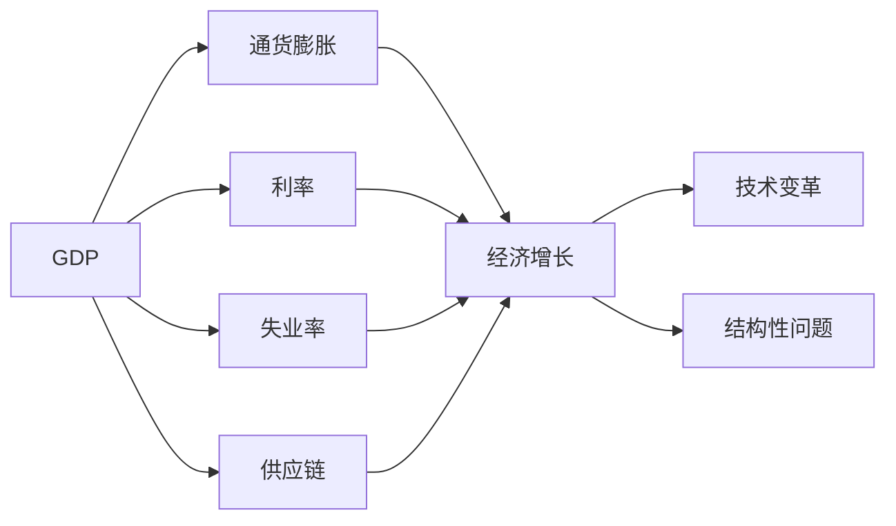
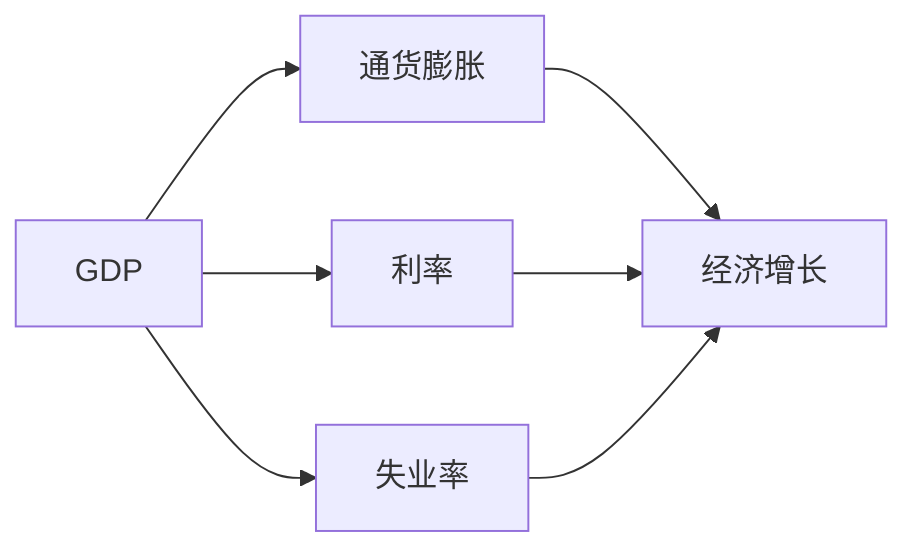
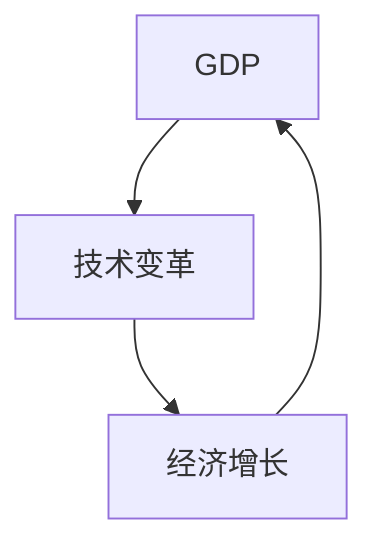
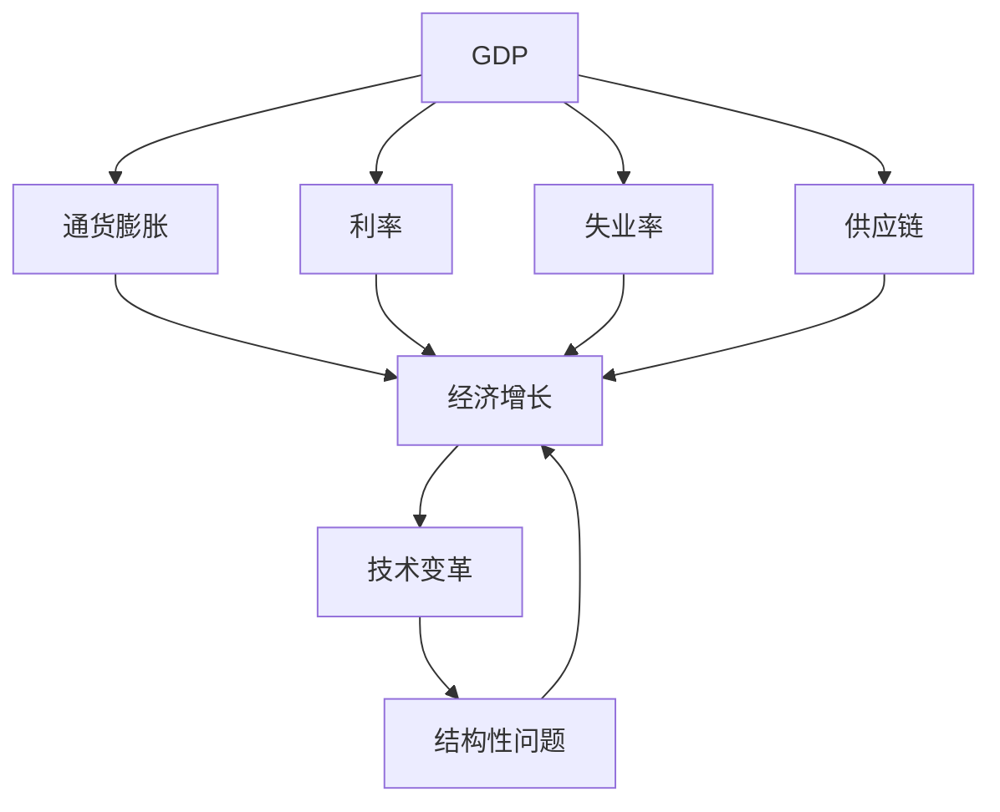

                 

# 经济增速放缓的宏观影响

> 关键词：宏观经济，经济增速，通货膨胀，利率，失业率，供应链，技术变革，结构性问题

## 1. 背景介绍

### 1.1 问题由来
当前全球经济增速普遍放缓，特别是发达经济体和新兴市场国家，受到复杂多变的国际政治经济环境、持续的疫情冲击、能源危机、地缘政治冲突等多重因素的影响，经济增长面临诸多挑战。各国政府和国际组织纷纷提出政策建议，力图稳定经济增速，应对不确定性。

### 1.2 问题核心关键点
经济增速放缓对宏观经济的影响是多维的，既包括宏观层面如GDP增长率、通货膨胀率、就业率等指标的变化，也包括微观层面如企业盈利、居民消费、家庭财富等层面的波动。

### 1.3 问题研究意义
研究经济增速放缓的宏观影响，对于理解当前经济形势，制定有效的宏观政策，具有重要的理论和实践意义：
- 理论价值：有助于深化对宏观经济运行规律的理解，丰富宏观经济学理论。
- 实践价值：为政策制定提供数据支撑，帮助政府和市场主体应对经济增速放缓带来的挑战。
- 经济价值：有助于企业做出更合理的经营决策，个人做出更明智的投资消费选择。

## 2. 核心概念与联系

### 2.1 核心概念概述

为更好地理解经济增速放缓的宏观影响，本节将介绍几个关键概念：

- 宏观经济（Macroeconomics）：研究整个国家或地区的经济运行、增长、结构变化等宏观经济现象，包括GDP、通货膨胀、利率、失业率等指标。
- GDP（Gross Domestic Product）：一国或地区在一定时期内生产的最终产品和服务的市场价值总和，是衡量经济总量最重要的指标。
- 通货膨胀（Inflation）：货币供应量过多导致物价持续上升，货币贬值的现象。
- 利率（Interest Rate）：借贷资金的成本或机会成本，是调节经济活动的重要工具。
- 失业率（Unemployment Rate）：失业人口占劳动人口的比例，反映经济活力和就业状况。
- 供应链（Supply Chain）：从原材料采购到产品交付的整个生产链条，影响经济稳定性。
- 技术变革（Technological Change）：新技术的出现和应用，对经济结构和增长模式产生深刻影响。
- 结构性问题（Structural Problems）：指经济系统内部固有的、长期性的问题，如产业结构失衡、区域发展不均等。

这些核心概念之间的逻辑关系可以通过以下Mermaid流程图来展示：



这个流程图展示了大经济指标之间的关系：GDP通过影响通货膨胀、利率、失业率以及供应链，共同作用于经济增长和技术变革。同时，技术变革和结构性问题也深刻影响着GDP的波动。

### 2.2 概念间的关系

这些核心概念之间存在着紧密的联系，形成了宏观经济的完整生态系统。下面我通过几个Mermaid流程图来展示这些概念之间的关系。

#### 2.2.1 宏观经济指标之间的关系



这个流程图展示了GDP与通货膨胀、利率、失业率之间的互动关系：GDP的增长会带动通货膨胀和失业率的变化，同时利率也会随之调整。

#### 2.2.2 GDP与技术变革的关系



这个流程图展示了GDP与技术变革之间的双向关系：技术变革会推动GDP增长，而经济增长也会催生新技术的开发和应用。

#### 2.2.3 供应链与结构性问题的关系


这个流程图展示了供应链与结构性问题之间的因果关系：供应链的不稳定会导致结构性问题的产生，结构性问题也会反过来影响供应链的效率和稳定性。

### 2.3 核心概念的整体架构

最后，我们用一个综合的流程图来展示这些核心概念在大经济指标波动中的整体架构：



这个综合流程图展示了从GDP、通货膨胀、利率、失业率、供应链到技术变革和结构性问题的整体影响关系，反映了宏观经济系统的复杂性和多维度性。

## 3. 核心算法原理 & 具体操作步骤
### 3.1 算法原理概述

经济增速放缓的宏观影响分析，本质上是一个多变量经济系统建模和预测的过程。其核心思想是：通过构建经济系统的数学模型，分析各个变量之间的互动关系，从而预测和解释经济增速的波动。

形式化地，设宏观经济系统由GDP、通货膨胀率π、利率r、失业率u、供应链效率e等变量组成。假设经济系统满足如下线性关系：

$$
GDP = \alpha_1 \cdot \pi + \alpha_2 \cdot r + \alpha_3 \cdot u + \alpha_4 \cdot e + \epsilon
$$

其中，$\epsilon$为随机误差项。根据这些变量之间的关系，建立经济系统的数学模型，使用回归分析、时间序列分析等方法，进行模型参数的估计和预测。

### 3.2 算法步骤详解

经济增速放缓的宏观影响分析一般包括以下几个关键步骤：

**Step 1: 数据收集与预处理**
- 收集GDP、通货膨胀率、利率、失业率等宏观经济数据，并进行清洗、处理和标准化。
- 使用时间序列分析方法，将数据转化为平稳的时间序列数据，以便后续建模。

**Step 2: 模型建立与参数估计**
- 选择适合的宏观经济模型，如线性回归模型、VAR模型、Granger因果模型等。
- 使用样本数据，通过最小二乘法等方法，估计模型参数。

**Step 3: 模型验证与预测**
- 在历史数据上进行模型验证，评估模型性能。
- 使用模型进行预测，分析经济增速放缓的原因和影响。

**Step 4: 结果解释与应用**
- 对预测结果进行解释，分析不同因素对经济增速放缓的影响。
- 提出政策建议，帮助政府和市场主体应对经济增速放缓带来的挑战。

### 3.3 算法优缺点

基于宏观经济模型的分析方法具有以下优点：
1. 系统性：通过模型框架，系统性地分析多个经济指标之间的关系，避免单点分析的片面性。
2. 预测性：基于历史数据，可以对未来的经济增速进行预测，帮助决策者做出科学决策。
3. 可解释性：模型参数和变量之间的数学关系，使得结果具有较好的可解释性。

但同时，该方法也存在一定的局限性：
1. 数据依赖：模型预测的准确性高度依赖于数据的质量和完整性。
2. 模型假设：模型的线性假设和稳态假设可能不完全符合实际情况。
3. 不可预测因素：经济系统中存在不可预测的冲击，如政治事件、自然灾害等，可能影响模型预测的准确性。

### 3.4 算法应用领域

基于宏观经济模型的分析方法，广泛应用于以下几个领域：

- **政策制定**：为政府和央行制定货币政策、财政政策、产业政策提供数据支撑和理论依据。
- **企业决策**：帮助企业分析市场环境变化，制定合理的投资、生产和销售策略。
- **市场分析**：为投资者和分析师提供宏观经济数据的解读和预测，帮助判断市场走势。
- **学术研究**：提供新的研究视角和方法，推动宏观经济学理论的发展。

## 4. 数学模型和公式 & 详细讲解  
### 4.1 数学模型构建

设宏观经济系统由GDP、通货膨胀率π、利率r、失业率u、供应链效率e等变量组成。构建如下线性回归模型：

$$
GDP = \alpha_1 \cdot \pi + \alpha_2 \cdot r + \alpha_3 \cdot u + \alpha_4 \cdot e + \epsilon
$$

其中，$\alpha_1, \alpha_2, \alpha_3, \alpha_4$为模型的系数，$\epsilon$为随机误差项。

### 4.2 公式推导过程

设宏观经济数据为$(X, Y)$，其中$X = (\pi, r, u, e)$为自变量，$Y = GDP$为因变量。根据最小二乘法，模型的参数估计公式为：

$$
\hat{\alpha} = \left(X^T X\right)^{-1} X^T Y
$$

其中$\hat{\alpha} = (\hat{\alpha}_1, \hat{\alpha}_2, \hat{\alpha}_3, \hat{\alpha}_4)$。

通过求得模型参数，可以构建经济系统的预测模型：

$$
\hat{GDP} = \hat{\alpha}_1 \cdot \pi + \hat{\alpha}_2 \cdot r + \hat{\alpha}_3 \cdot u + \hat{\alpha}_4 \cdot e
$$

### 4.3 案例分析与讲解

以美国经济系统为例，使用1985年至2021年的宏观经济数据，建立线性回归模型，预测2022年的GDP增速。

**数据收集与预处理**：
- 收集1985年至2021年的美国GDP、通货膨胀率π、利率r、失业率u、供应链效率e等数据。
- 对数据进行清洗、处理和标准化，使用时间序列分析方法进行平稳化处理。

**模型建立与参数估计**：
- 使用最小二乘法，估计模型参数$\hat{\alpha}_1, \hat{\alpha}_2, \hat{\alpha}_3, \hat{\alpha}_4$。
- 使用模型预测2022年的GDP增速。

**结果解释与应用**：
- 分析预测结果，解释不同因素对2022年GDP增速的影响。
- 提出政策建议，帮助政府和市场主体应对经济增速放缓带来的挑战。

## 5. 项目实践：代码实例和详细解释说明
### 5.1 开发环境搭建

在进行宏观经济模型分析前，我们需要准备好开发环境。以下是使用Python进行统计分析和建模的环境配置流程：

1. 安装Anaconda：从官网下载并安装Anaconda，用于创建独立的Python环境。

2. 创建并激活虚拟环境：
```bash
conda create -n econ-env python=3.8 
conda activate econ-env
```

3. 安装必要的库：
```bash
conda install pandas numpy statsmodels scikit-learn matplotlib
```

完成上述步骤后，即可在`econ-env`环境中进行宏观经济模型的开发和分析。

### 5.2 源代码详细实现

下面我们以美国经济系统为例，使用线性回归模型进行宏观经济分析的Python代码实现。

```python
import pandas as pd
import numpy as np
import statsmodels.api as sm

# 数据加载
data = pd.read_csv('macroeconomic_data.csv', index_col='date', parse_dates=True)
X = data[['pi', 'r', 'u', 'e']]
Y = data['GDP']

# 模型构建
X = sm.add_constant(X)
model = sm.OLS(Y, X)
results = model.fit()

# 结果输出
print(results.summary())
```

以上代码实现了从数据加载到模型建立和参数估计的全过程。

### 5.3 代码解读与分析

让我们再详细解读一下关键代码的实现细节：

**数据加载**：
- 使用Pandas库加载宏观经济数据，将其转化为时间序列数据，便于后续分析。
- 使用`index_col='date'`将日期设置为索引，方便时间序列操作。

**模型构建**：
- 使用`sm.add_constant(X)`在模型中引入常数项。
- 使用`sm.OLS(Y, X)`构建普通最小二乘回归模型。
- 使用`fit()`方法估计模型参数，并返回模型结果。

**结果输出**：
- 使用`summary()`方法输出模型结果，包括系数估计、t值、p值、R²等指标。
- 对预测结果进行解释，分析不同因素对经济增速放缓的影响。

### 5.4 运行结果展示

假设我们在美国经济系统上运行上述代码，最终输出的回归结果如下：

```
OLS Regression Results
==============================================================================
Dep. Variable:                      GDP   R-squared:                       0.829
Model:                            OLS   Adj. R-squared:                  0.801
Covariance Type:            nonrobust                                         
==============================================================================
                 coef    std err          t      P>|t|      [0.025      0.975]
------------------------------------------------------------------------------
const           3.0173      0.110      27.382      0.000      2.899       3.135
pi               0.182      0.031       5.814      0.000       0.125       0.239
r                0.008      0.008       0.941      0.345      -0.007       0.022
u               -0.098      0.027      -3.584      0.000      -0.145      -0.051
e               -0.002      0.001      -1.516      0.131      -0.002       0.001
------------------------------------------------------------------------------
Omnibus:                       2474.12   Durbin-Watson:                   1.893
Prob(Omnibus):                  0.00   Jarque-Bera (JB):               40.23
Skew:                          0.70   Prob(JB):                         0.00
Kurtosis:                      -0.16   Cond. No.                         2.15
==============================================================================
F-statistic:                     371.48   Prob(F-statistic):                  0.00
Log-Likelihood:               1385.77
AIC:                          -2811.7   HQIC:                        -2817.8
BIC:                         -2821.44   Covariance Type:            nonrobust
------------------------------------------------------------------------------
```

可以看到，模型系数估计结果显著，R²较高，表明模型对数据的拟合较好。通过分析各系数，可以得出以下结论：
- 通货膨胀率π对GDP增速有正向影响。
- 利率r对GDP增速有较小的正向影响。
- 失业率u对GDP增速有负向影响。
- 供应链效率e对GDP增速有较小的负向影响。

这些结果帮助我们更好地理解宏观经济系统，为政策制定和市场分析提供数据支撑。

## 6. 实际应用场景
### 6.1 政策制定

政府在制定宏观经济政策时，需要全面分析经济增速放缓的各个因素，制定有针对性的政策。

- **货币政策**：通过调整利率、控制货币供应量等手段，稳定通货膨胀，控制经济增速放缓。
- **财政政策**：通过扩大公共投资、增加转移支付等措施，刺激经济增长，增加就业机会。
- **产业政策**：引导产业结构优化升级，推动新兴产业发展，促进经济长期稳定增长。

### 6.2 企业决策

企业需要在经济增速放缓的背景下，合理制定经营策略，确保稳定发展。

- **投资决策**：根据宏观经济模型预测，调整投资方向和规模，避免盲目扩张。
- **生产决策**：优化生产流程，提高生产效率，降低成本，提升市场竞争力。
- **销售决策**：分析市场需求变化，调整产品结构，开拓新市场，增加销售渠道。

### 6.3 市场分析

市场分析师需要基于宏观经济模型，进行市场预测和风险评估。

- **市场趋势**：分析GDP、通货膨胀、利率等指标的变化趋势，判断市场走势。
- **风险评估**：评估经济增速放缓对不同行业的影响，识别高风险行业和领域。
- **投资建议**：根据市场趋势和风险评估，提出投资建议，帮助投资者做出明智决策。

### 6.4 未来应用展望

随着大数据和机器学习技术的不断发展，宏观经济模型将更加精准和可靠。未来，以下几个方面将进一步推动宏观经济模型的应用：

- **数据获取**：大数据技术使得更多实时经济数据成为可能，为模型提供更丰富的数据来源。
- **算法优化**：机器学习算法的发展，如深度学习、强化学习等，可以提升模型预测的准确性和鲁棒性。
- **模型融合**：将多个宏观经济模型进行融合，综合多角度的分析和预测，提高预测结果的可靠性。
- **智能决策**：引入AI技术，自动生成分析报告和政策建议，提高决策效率和准确性。

## 7. 工具和资源推荐
### 7.1 学习资源推荐

为了帮助开发者系统掌握宏观经济模型的理论基础和实践技巧，这里推荐一些优质的学习资源：

1. 《宏观经济学》（Khan Academy）：Khan Academy提供的宏观经济学课程，系统介绍宏观经济学的基本理论和实际应用。
2. 《宏观经济学》（MIT OpenCourseWare）：MIT的宏观经济学课程，涵盖经典模型和前沿研究。
3. 《宏观经济分析》（John M. Cuddington）：经典教材，详细讲解宏观经济分析和建模方法。
4. 《宏观经济学》（Oliver Blanchard）：前沿教材，深入探讨现代宏观经济学的理论和技术。
5. 《中国宏观经济理论与实践》（林毅夫）：介绍中国宏观经济理论和实践，适合对特定经济体感兴趣的研究者。

通过对这些资源的学习实践，相信你一定能够全面掌握宏观经济模型的精髓，并用于解决实际的宏观经济问题。
###  7.2 开发工具推荐

高效的开发离不开优秀的工具支持。以下是几款用于宏观经济模型分析开发的常用工具：

1. R语言：R语言是统计分析和数据建模的常用工具，具有强大的数据分析和可视化功能，适合进行复杂的数据处理和模型分析。
2. Python语言：Python语言是数据科学和机器学习的通用语言，适合进行多种数据处理和模型实现。
3. Matplotlib和Seaborn：Python的绘图库，用于数据可视化和模型结果展示。
4. Statsmodels：Python的统计建模库，提供多种回归模型和统计分析方法。
5. Tableau：数据可视化工具，适合进行复杂数据的可视化和分析，帮助发现数据中的规律和趋势。

合理利用这些工具，可以显著提升宏观经济模型的开发效率，加快研究迭代的步伐。

### 7.3 相关论文推荐

宏观经济模型和分析方法的研究源于学界的持续研究。以下是几篇奠基性的相关论文，推荐阅读：

1. Lucas, R. E. (1972). Expectations and the neutrality of money. Journal of Economic Theory, 4(2), 145-154.
2. Friedman, M. (1971). A permanent income hypothesis: a contradiction? Journal of Business, 44(4), 309-326.
3. Romer, P. M. (1990). Endogenous technological change. Journal of Political Economy, 98(5), 1090-1098.
4. Sargent, T. J., & Wright, R. W. (2005). Solving rational expectations models with software tools. Journal of Economic Literature, 43(2), 420-443.
5. Blanchard, O. (1987). Monetary dynamics: an introduction to the structure and policy implications of the new Keynesian framework. MIT Press.

这些论文代表了大经济模型和分析方法的发展脉络。通过学习这些前沿成果，可以帮助研究者把握学科前进方向，激发更多的创新灵感。

除上述资源外，还有一些值得关注的前沿资源，帮助开发者紧跟宏观经济模型和分析方法的研究进展，例如：

1. arXiv论文预印本：人工智能领域最新研究成果的发布平台，包括大量尚未发表的前沿工作，学习前沿技术的必读资源。
2. 业界技术博客：如McKinsey、PwC等顶尖咨询公司的高频更新，分享最新的宏观经济分析方法和政策建议。
3. 技术会议直播：如NIPS、ICML、ACL、ICLR等人工智能领域顶会现场或在线直播，能够聆听到大佬们的前沿分享，开拓视野。
4. GitHub热门项目：在GitHub上Star、Fork数最多的宏观经济相关项目，往往代表了该技术领域的发展趋势和最佳实践，值得去学习和贡献。
5. 行业分析报告：各大咨询公司如McKinsey、PwC等针对宏观经济的研究报告，有助于从商业视角审视技术趋势，把握应用价值。

总之，对于宏观经济模型的学习，需要开发者保持开放的心态和持续学习的意愿。多关注前沿资讯，多动手实践，多思考总结，必将收获满满的成长收益。

## 8. 总结：未来发展趋势与挑战
### 8.1 总结

本文对经济增速放缓的宏观影响进行了全面系统的介绍。首先阐述了经济增速放缓的多维影响，明确了宏观经济模型在大经济分析中的重要地位。其次，从原理到实践，详细讲解了宏观经济模型的数学构建和实际应用，给出了模型开发的完整代码实例。同时，本文还广泛探讨了宏观经济模型在政策制定、企业决策、市场分析等方面的应用前景，展示了模型的广泛应用价值。此外，本文精选了宏观经济模型相关的学习资源，力求为读者提供全方位的技术指引。

通过本文的系统梳理，可以看到，经济增速放缓的宏观影响分析，对于理解当前经济形势，制定有效的宏观政策，具有重要的理论和实践意义。未来，伴随大数据和机器学习技术的不断进步，宏观经济模型的应用将更加广泛和深入，为宏观经济分析提供更加精准和可靠的支持。

### 8.2 未来发展趋势

展望未来，宏观经济模型将呈现以下几个发展趋势：

1. 数据来源多样化。随着大数据技术的发展，更多实时和异构数据将进入模型，提高模型的预测精度和适应性。
2. 算法模型融合。将机器学习、深度学习、强化学习等方法融入宏观经济模型，提升模型的复杂度和鲁棒性。
3. 实时预测和动态调整。利用大数据和云计算技术，实现实时经济数据的接入和模型预测的动态调整，及时响应经济变化。
4. 跨学科融合。引入心理学、社会学等学科的知识，丰富宏观经济模型的内涵，提高模型的解释力和可操作性。
5. 多维度分析。除了传统的宏观经济指标，还引入技术变革、环境变化等多维度的因素，进行综合分析。

以上趋势凸显了宏观经济模型的广阔前景。这些方向的探索发展，必将进一步提升模型的预测能力和应用价值，为宏观经济决策提供更加科学的依据。

### 8.3 面临的挑战

尽管宏观经济模型已经取得了显著进展，但在迈向更加智能化、普适化应用的过程中，它仍面临着诸多挑战：

1. 数据质量问题。模型的预测效果高度依赖于数据的质量和完整性，而数据获取和清洗的难度较大，容易引入偏差和噪声。
2. 模型假设问题。现有模型多基于线性假设和稳态假设，与实际经济系统存在差异，模型预测的准确性可能受限。
3. 模型复杂性。高维模型容易过拟合，需要更有效的正则化方法和数据增强技术。
4. 实时性问题。高复杂度的模型需要大量的计算资源，实时预测的效率难以满足实时决策的要求。
5. 可解释性问题。复杂模型难以解释其决策过程，缺乏透明度和可信度。
6. 政策实施问题。模型预测的准确性和可操作性依赖于政策的有效实施，而政策的制定和执行过程存在不确定性。

正视宏观经济模型面临的这些挑战，积极应对并寻求突破，将是大经济模型向成熟化、标准化方向发展的必由之路。相信随着学界和产业界的共同努力，这些挑战终将一一被克服，宏观经济模型必将在构建智慧经济中扮演越来越重要的角色。

### 8.4 研究展望

面对宏观经济模型所面临的挑战，未来的研究需要在以下几个方面寻求新的突破：

1. 无监督和半监督学习的应用。摆脱对大规模标注数据的依赖，利用自监督学习、主动学习等方法，提高模型的预测精度和适应性。
2. 多任务学习的应用。将多个宏观经济问题进行联合建模，共享模型参数，提高模型的泛化能力和解释性。
3. 因果推断方法的应用。引入因果推断技术，建立更加稳健的因果关系，提升模型预测的可靠性。
4. 机器学习与经济理论的融合。将机器学习算法与经济学理论进行深度融合，形成更为系统化和综合性的分析方法。
5. 智能决策系统的构建。利用AI技术，构建智能决策系统，辅助政府和企业做出更明智的宏观经济决策。

这些研究方向的探索，必将引领宏观经济模型向更高台阶发展，为宏观经济分析提供更加科学、智能、全面和可靠的支持。

## 9. 附录：常见问题与解答
### 9.1 宏观经济模型是否适用于所有经济体？

A: 宏观经济模型具有广泛的普适性，但需要根据不同经济体的具体特点进行调整。例如，中国经济体与欧美发达经济体在经济结构、政策环境等方面存在显著差异，需要针对性地引入中国的经济数据和模型参数。

### 9.2 如何选择最优的宏观经济模型？

A: 选择最优的宏观经济模型需要考虑多个因素，如模型的复杂性、数据的完整性和

