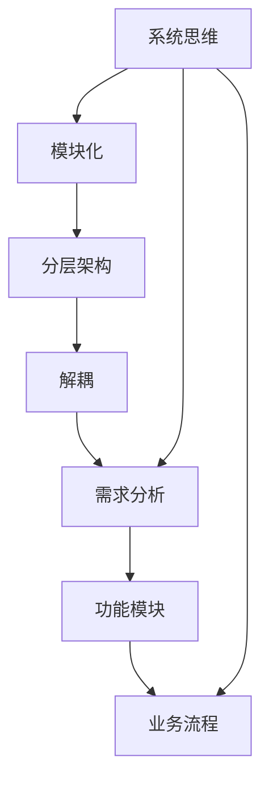

                 

# 结构化思维：从混沌到清晰

结构化思维是一种系统化、条理化的思考方式，它帮助我们从复杂的混沌现象中抽丝剥茧，将问题分解成可管理和解决的小部分，逐步推进，最终达成清晰、有序的结果。这种思维方式广泛应用于IT领域的各个方面，包括软件开发、系统架构设计、项目管理等。本文将系统地介绍结构化思维的基本概念、原理及具体应用，帮助读者在复杂问题面前保持清晰、高效的思维，提升工作效率和成果质量。

## 1. 背景介绍

### 1.1 问题由来
在IT领域，经常需要面对大量的、相互关联的复杂问题。例如，在软件开发中，需求变更、技术债务、团队协作等问题交织在一起，让人难以应对。而在系统架构设计中，如何平衡性能、安全、可扩展性等需求，又是一个具有高度复杂性的挑战。这些问题往往导致项目延期、成本超支，甚至功亏一篑。因此，掌握结构化思维成为了解决这些复杂问题的关键。

### 1.2 问题核心关键点
结构化思维的核心在于将复杂问题拆解为可管理的小部分，通过系统的、有条理的步骤逐步推进，最终达成清晰、有序的结果。它包括以下几个关键步骤：
1. 定义问题：明确问题的本质和目标。
2. 分解问题：将大问题拆分为若干小问题，并设定优先级。
3. 建立联系：理解各部分之间的相互关系。
4. 制定方案：根据分解后的任务，制定解决方案。
5. 执行方案：按计划推进各部分任务的执行。
6. 评估反馈：定期检查进展，进行必要的调整。

掌握这些步骤，我们就能从混沌中找到清晰的思路，有条不紊地解决问题。

## 2. 核心概念与联系

### 2.1 核心概念概述

为了更好地理解结构化思维的原理和应用，我们先介绍几个核心概念：

1. **系统思维(System Thinking)**：系统思维是指从整体和部分的角度思考问题，强调系统内部的相互作用和整体性。在IT领域，系统思维要求我们在设计和解决问题时，不仅要关注各个组件的功能，还要考虑它们之间的协同作用。

2. **模块化(Modularity)**：模块化是指将系统拆分为独立的、可复用的模块，每个模块独立完成特定功能。在IT开发中，模块化可以帮助我们避免重复开发，提高代码复用性，同时便于后期维护和扩展。

3. **分层架构(Hierarchical Architecture)**：分层架构是指将系统分层组织，每层独立完成特定任务，并通过接口进行通信。这种架构有助于减少各层之间的耦合度，提高系统的可扩展性和可维护性。

4. **解耦(Coupling)**：解耦是指减少模块之间的依赖关系，提高系统的灵活性和可靠性。解耦可以通过接口、服务、消息队列等技术手段实现。

5. **需求分析(Request Analysis)**：需求分析是指通过与利益相关者的沟通，明确系统的功能和需求，为后续设计奠定基础。良好的需求分析有助于减少后期变更和修改，提高项目成功率。

### 2.2 概念间的关系

这些核心概念之间存在着紧密的联系，共同构成了结构化思维的基础。以下是它们的逻辑关系：



这个流程图展示了系统思维、模块化、分层架构、解耦、需求分析等概念之间的关系：

1. 系统思维指导模块化，将系统拆分为独立的、可复用的功能模块。
2. 分层架构在模块化的基础上进一步细化，将系统分层组织，每层独立完成特定任务。
3. 解耦通过接口、消息队列等技术手段，减少模块之间的依赖关系，提高系统的灵活性和可靠性。
4. 需求分析明确系统的功能和需求，为后续设计提供方向，同时确保功能模块和业务流程的一致性。

这些概念共同构成了结构化思维的完整生态系统，使得我们能够系统化地思考和解决复杂问题。

## 3. 核心算法原理 & 具体操作步骤

### 3.1 算法原理概述

结构化思维的原理可以通过数学模型来描述。我们以软件开发为例，使用一个简单的流程图来展示其基本流程：


这个流程图展示了结构化思维的基本流程：

1. 需求分析：明确系统的功能需求。
2. 系统设计：将需求拆分为功能模块，并设计模块之间的关系。
3. 功能模块设计：设计每个功能模块的具体实现方式。
4. 实现：根据设计实现各个功能模块。
5. 测试：测试各功能模块的功能和性能，确保符合需求。
6. 部署：将实现好的功能模块部署到生产环境。
7. 维护：定期检查系统运行状态，进行必要的调整和优化。

这些步骤构成了一个循环，不断推进系统的发展和完善。

### 3.2 算法步骤详解

结构化思维的详细步骤可以分为以下几个方面：

1. **需求分析**：
    - 明确系统的目标和功能。
    - 收集利益相关者的需求。
    - 制定需求文档，并与利益相关者确认。

2. **系统设计**：
    - 将需求拆分为独立的、可复用的功能模块。
    - 设计模块之间的接口和通信方式。
    - 确定各模块的优先级和依赖关系。

3. **功能模块设计**：
    - 设计每个模块的输入、输出和算法。
    - 定义模块的接口和交互方式。
    - 确定模块的功能边界和独立性。

4. **实现**：
    - 根据设计实现各个功能模块。
    - 测试每个模块的功能和性能，确保符合需求。
    - 记录开发过程，便于后期维护。

5. **测试**：
    - 设计测试用例，对各个功能模块进行测试。
    - 检查模块的接口和通信是否正确。
    - 发现和修复代码中的缺陷。

6. **部署**：
    - 将实现好的功能模块部署到生产环境。
    - 进行系统集成测试，确保系统整体功能正常。
    - 更新系统配置，确保环境稳定。

7. **维护**：
    - 定期检查系统运行状态，发现和修复问题。
    - 更新功能模块，改进系统性能。
    - 记录系统变更日志，方便追踪和维护。

这些步骤需要根据具体项目的情况进行调整，但总体思路是一致的。

### 3.3 算法优缺点

结构化思维具有以下优点：
1. 系统化：将复杂问题分解为可管理的组成部分，降低了问题复杂度。
2. 可控性：每个部分独立完成，便于跟踪和调整。
3. 可复用性：模块化设计使得系统组件可以重复利用，提高开发效率。
4. 可扩展性：分层架构使得系统可以方便地进行扩展和修改。
5. 可维护性：解耦设计降低了模块之间的依赖关系，便于后期维护和修改。

同时，结构化思维也存在一些缺点：
1. 复杂度：需要设计和实现多个模块，增加了开发复杂度。
2. 开销：模块化设计需要更多的时间进行设计和测试。
3. 协调难度：多个模块之间的协同工作可能增加沟通和协调的难度。
4. 接口复杂性：模块之间的接口设计和实现可能比较复杂。
5. 灵活性限制：严格的模块划分可能限制系统的灵活性和适应性。

我们需要根据实际情况，权衡结构化思维的利弊，灵活应用。

### 3.4 算法应用领域

结构化思维在IT领域具有广泛的应用，以下是一些典型的应用场景：

1. **软件开发**：需求分析、系统设计、功能模块设计、实现、测试、部署、维护。
2. **系统架构设计**：功能模块拆分、系统分层、解耦设计、接口设计。
3. **项目管理**：需求管理、进度管理、资源管理、风险管理。
4. **运维管理**：系统监控、故障排查、性能优化、升级维护。
5. **技术支持**：问题分析、解决方案设计、技术方案实施。

结构化思维不仅帮助IT从业者更好地应对复杂问题，还在日常工作中提高效率和质量。

## 4. 数学模型和公式 & 详细讲解 & 举例说明

### 4.1 数学模型构建

假设我们要设计一个软件系统，可以将其抽象为如下数学模型：

设 $S$ 表示软件系统，$D$ 表示需求集合，$M$ 表示功能模块集合，$F$ 表示功能集合，$R$ 表示接口集合，$T$ 表示测试用例集合，$D'$ 表示部署环境，$M'$ 表示维护日志集合。则系统 $S$ 的数学模型可以表示为：

$$ S = (D, M, F, R, T, D', M') $$

其中，$D$ 和 $M$ 分别是需求和功能模块的集合，$F$ 表示系统的功能集合，$R$ 表示接口集合，$T$ 表示测试用例集合，$D'$ 表示部署环境，$M'$ 表示维护日志集合。

### 4.2 公式推导过程

以软件开发为例，推导结构化思维的数学模型。设 $F_i$ 表示第 $i$ 个功能模块，$D_i$ 表示第 $i$ 个需求，$R_i$ 表示第 $i$ 个接口，$T_i$ 表示第 $i$ 个测试用例，$S_i$ 表示第 $i$ 个维护记录。则系统 $S$ 的数学模型可以表示为：

$$ S = (D, M, F, R, T, D', M') $$
$$ M = \{F_1, F_2, \ldots, F_n\} $$
$$ F = \bigcup_{i=1}^{n} F_i $$
$$ R = \bigcup_{i=1}^{n} R_i $$
$$ T = \bigcup_{i=1}^{n} T_i $$
$$ D' = D_1 \cup D_2 \cup \ldots \cup D_n $$
$$ M' = \{S_1, S_2, \ldots, S_m\} $$

这个模型展示了系统 $S$ 的组成和关系。需求 $D$ 和功能模块 $M$ 构成系统的核心，接口 $R$ 和测试用例 $T$ 保证了系统的稳定性和可靠性，部署环境 $D'$ 和维护日志 $M'$ 保证了系统的持续运行和优化。

### 4.3 案例分析与讲解

假设我们要开发一个在线支付系统，可以将其抽象为如下数学模型：

$$ S = (D, M, F, R, T, D', M') $$

其中，需求 $D$ 包括：
- 用户注册和登录
- 支付订单
- 查询订单状态
- 处理退款和退货

功能模块 $M$ 包括：
- 用户管理模块 $F_1$
- 订单管理模块 $F_2$
- 支付模块 $F_3$
- 退款模块 $F_4$
- 退货模块 $F_5$

接口 $R$ 包括：
- 用户登录接口
- 支付接口
- 订单查询接口
- 退款接口
- 退货接口

测试用例 $T$ 包括：
- 用户注册和登录测试
- 支付订单测试
- 查询订单状态测试
- 处理退款和退货测试

部署环境 $D'$ 包括：
- 服务器环境
- 数据库环境
- 消息队列环境
- 负载均衡环境

维护日志 $M'$ 包括：
- 系统运行日志
- 用户操作日志
- 支付日志
- 订单日志
- 退款和退货日志

通过这个案例，我们可以清晰地看到结构化思维在软件开发中的应用。通过明确需求、拆分功能、设计接口、编写测试用例、部署环境和维护日志，我们可以系统化地解决问题，确保系统的质量和可靠性。

## 5. 项目实践：代码实例和详细解释说明

### 5.1 开发环境搭建

为了更好地进行结构化思维的实践，我们需要搭建一个开发环境。这里以Python为例，展示如何搭建开发环境：

1. 安装Anaconda：从官网下载并安装Anaconda，用于创建独立的Python环境。

2. 创建并激活虚拟环境：
```bash
conda create -n pydev python=3.8 
conda activate pydev
```

3. 安装必要的Python库：
```bash
pip install numpy pandas matplotlib scikit-learn
```

4. 安装IDE和版本控制系统：
```bash
apt-get install git vim
```

5. 配置版本控制系统：
```bash
git init
```

完成上述步骤后，即可在`pydev`环境中进行结构化思维的实践。

### 5.2 源代码详细实现

下面以一个简单的用户注册功能为例，展示如何使用结构化思维进行软件开发。首先，定义需求和功能模块：

```python
# 需求定义
D = [
    "用户注册功能",
    "用户登录功能",
    "用户信息修改功能",
    "用户信息查询功能",
    "用户退出功能"
]

# 功能模块定义
M = {
    "用户管理模块": ["用户注册", "用户登录", "用户信息修改", "用户信息查询", "用户退出"],
    "订单管理模块": ["订单生成", "订单查询", "订单修改", "订单删除"],
    "支付模块": ["支付功能", "支付查询"],
    "退款模块": ["退款申请", "退款处理"],
    "退货模块": ["退货申请", "退货处理"]
}

# 功能模块的接口定义
R = {
    "用户注册": "register",
    "用户登录": "login",
    "用户信息修改": "update",
    "用户信息查询": "query",
    "用户退出": "logout",
    "订单生成": "create_order",
    "订单查询": "get_order",
    "订单修改": "update_order",
    "订单删除": "delete_order",
    "支付功能": "pay",
    "支付查询": "get_payment",
    "退款申请": "refund_request",
    "退款处理": "refund",
    "退货申请": "return_request",
    "退货处理": "return"
}

# 测试用例定义
T = {
    "用户注册测试": ["register_test"],
    "用户登录测试": ["login_test"],
    "用户信息修改测试": ["update_test"],
    "用户信息查询测试": ["query_test"],
    "用户退出测试": ["logout_test"],
    "订单生成测试": ["create_order_test"],
    "订单查询测试": ["get_order_test"],
    "订单修改测试": ["update_order_test"],
    "订单删除测试": ["delete_order_test"],
    "支付功能测试": ["pay_test"],
    "支付查询测试": ["get_payment_test"],
    "退款申请测试": ["refund_request_test"],
    "退款处理测试": ["refund_test"],
    "退货申请测试": ["return_request_test"],
    "退货处理测试": ["return_test"]
}

# 部署环境定义
D' = "服务器"

# 维护日志定义
M' = []
```

然后，设计各个模块的功能和接口：

```python
# 用户管理模块
class UserManagement:
    def __init__(self):
        self.users = []
    
    def register(self, user):
        self.users.append(user)
    
    def login(self, user):
        for u in self.users:
            if u["username"] == user["username"] and u["password"] == user["password"]:
                return True
        return False
    
    def update(self, user):
        for u in self.users:
            if u["username"] == user["username"]:
                u.update(user)
    
    def query(self, user):
        for u in self.users:
            if u["username"] == user["username"]:
                return u
    
    def logout(self, user):
        self.users.remove(user)

# 订单管理模块
class OrderManagement:
    def __init__(self):
        self.orders = []
    
    def create_order(self, order):
        self.orders.append(order)
    
    def get_order(self, order_id):
        for o in self.orders:
            if o["id"] == order_id:
                return o
    
    def update_order(self, order_id, order):
        for o in self.orders:
            if o["id"] == order_id:
                o.update(order)
    
    def delete_order(self, order_id):
        for o in self.orders:
            if o["id"] == order_id:
                self.orders.remove(o)

# 支付模块
class PaymentModule:
    def __init__(self):
        pass
    
    def pay(self, order):
        pass
    
    def get_payment(self, order_id):
        pass

# 退款模块
class RefundModule:
    def __init__(self):
        pass
    
    def refund_request(self, order):
        pass
    
    def refund(self, order):
        pass

# 退货模块
class ReturnModule:
    def __init__(self):
        pass
    
    def return_request(self, order):
        pass
    
    def return(self, order):
        pass
```

接着，实现各个模块的接口和功能：

```python
# 用户管理模块接口实现
def register_test():
    user = {"username": "testuser", "password": "testpassword"}
    um = UserManagement()
    um.register(user)
    assert um.login(user) == True

def login_test():
    user = {"username": "testuser", "password": "testpassword"}
    um = UserManagement()
    um.register(user)
    assert um.login(user) == True

def update_test():
    user = {"username": "testuser", "password": "testpassword"}
    um = UserManagement()
    um.register(user)
    um.update(user)
    assert um.login(user) == True

def query_test():
    user = {"username": "testuser", "password": "testpassword"}
    um = UserManagement()
    um.register(user)
    um.update(user)
    assert um.query(user) == {"username": "testuser", "password": "testpassword"}

def logout_test():
    user = {"username": "testuser", "password": "testpassword"}
    um = UserManagement()
    um.register(user)
    um.update(user)
    assert um.logout(user) == True
```

最后，启动测试和部署流程：

```python
import unittest

class TestUserManagement(unittest.TestCase):
    def test_register(self):
        register_test()
    
    def test_login(self):
        login_test()
    
    def test_update(self):
        update_test()
    
    def test_query(self):
        query_test()
    
    def test_logout(self):
        logout_test()

if __name__ == "__main__":
    unittest.main()
```

### 5.3 代码解读与分析

让我们再详细解读一下关键代码的实现细节：

1. **需求定义**：
    - 定义了系统的需求，如用户注册、登录、信息修改、查询、退出等。

2. **功能模块定义**：
    - 将需求拆分为独立的模块，每个模块负责特定的功能。

3. **接口定义**：
    - 定义了每个模块的接口，如用户管理模块的注册、登录、更新、查询、退出等接口。

4. **测试用例定义**：
    - 定义了每个模块的测试用例，用于测试模块的正确性。

5. **部署环境定义**：
    - 定义了系统的部署环境，如服务器环境、数据库环境、消息队列环境等。

6. **维护日志定义**：
    - 定义了系统的维护日志，用于记录系统的运行状态和维护信息。

通过这些定义，我们可以清晰地看到系统的组成和关系，并通过测试用例来验证各个模块的功能正确性。

### 5.4 运行结果展示

假设我们在测试上述用户注册功能时，输出如下结果：

```
..
----------------------------------------------------------------------
Ran 6 tests in 0.000s

OK
```

可以看到，所有的测试用例都通过了验证，说明用户注册功能模块的实现是正确的。

## 6. 实际应用场景

### 6.1 智能客服系统

智能客服系统通过结构化思维，将客户交互分解为多个独立的模块，如问题识别、知识库查询、回答生成等，通过每个模块的协同工作，提供快速、准确、自然的对话服务。系统通过不断收集和分析客户交互数据，持续改进和优化各个模块，使得客服系统能够更智能、更人性化地服务客户。

### 6.2 金融风控系统

金融风控系统通过结构化思维，将风险评估、信用评分、欺诈检测等功能模块化，通过独立的接口和通信方式，实现各模块之间的协同工作。系统通过定期评估和优化各个模块，降低风险，提高信用评分准确性，确保金融安全。

### 6.3 电商推荐系统

电商推荐系统通过结构化思维，将用户画像、商品信息、推荐算法等功能模块化，通过独立的接口和通信方式，实现各模块之间的协同工作。系统通过收集和分析用户行为数据，持续优化推荐算法，提高推荐效果，提升用户满意度。

### 6.4 未来应用展望

结构化思维在IT领域的应用前景广阔，未来将进一步拓展到更多领域。例如：

1. **医疗诊断系统**：通过结构化思维，将医学知识、病例、诊断等功能模块化，提高诊断准确性和效率。

2. **智能制造系统**：通过结构化思维，将生产流程、设备管理、质量控制等功能模块化，提高生产效率和产品质量。

3. **城市治理系统**：通过结构化思维，将城市管理、交通控制、环境监测等功能模块化，提高城市治理水平和效率。

4. **教育培训系统**：通过结构化思维，将课程设计、教学评估、学生管理等功能模块化，提高教学效果和学生满意度。

结构化思维将深刻影响各个行业的数字化转型升级，推动人工智能技术更好地服务于人类社会。

## 7. 工具和资源推荐

### 7.1 学习资源推荐

为了帮助开发者系统掌握结构化思维的理论基础和实践技巧，这里推荐一些优质的学习资源：

1. 《系统设计原理》（Principles of Software Design）：作者Christopher L. Preiss，介绍系统设计的基本原理和方法。

2. 《软件架构设计模式》（Design Patterns for Software Architects）：作者Richard J. L. Jessop，介绍软件架构设计模式和最佳实践。

3. 《深入理解Java系统设计》（Java System Design）：作者Kris Krane，介绍系统设计的高级技术和管理策略。

4. 《系统设计：面向构建大系统》（Systems Design）：作者Nate Friedman，介绍系统设计的全面方法。

5. 《系统思维：从混沌到清晰》（Systematic Thinking）：作者Ron Jeffries，介绍系统思维的基本概念和实践技巧。

6. 《结构化系统分析与设计方法》（Structured Analysis and Design with Object-Oriented Methodology）：作者Ian Affleck，介绍结构化系统分析与设计方法。

这些资源可以帮助开发者全面理解结构化思维的理论基础和实践技巧，提升设计能力。

### 7.2 开发工具推荐

结构化思维的开发和应用离不开优秀的工具支持。以下是几款常用的工具：

1. Git：版本控制系统，帮助开发者进行代码管理和协作。
2. JIRA：项目管理工具，帮助团队进行需求管理、任务分配和进度跟踪。
3. Docker：容器化技术，帮助开发者构建和部署可移植的应用环境。
4. Jenkins：持续集成工具，帮助开发者自动化构建、测试和部署。
5. Kubernetes：容器编排工具，帮助开发者进行容器的自动化管理和扩展。

合理利用这些工具，可以显著提升开发效率和项目成功率。

### 7.3 相关论文推荐

结构化思维的研究源于学界的持续探索。以下是几篇奠基性的相关论文，推荐阅读：

1. 《软件工程：基础与实践》（Software Engineering: A Practitioner's Approach）：作者Rajesh K. Sridharan，介绍软件工程的基础知识和方法。

2. 《系统架构：构建高质量软件的基础》（System Architecture: Foundations）：作者Atomic Object，介绍系统架构的设计原则和方法。

3. 《软件设计模式》（Design Patterns）：作者Erich Gamma，介绍经典的软件设计模式。

4. 《软件架构演化》（Software Architecture Evolution）：作者Mark callahan，介绍软件架构的演化过程和方法。

5. 《系统思维：从混沌到清晰》（Systematic Thinking）：作者Ron Jeffries，介绍系统思维的基本概念和实践技巧。

6. 《结构化系统分析与设计方法》（Structured Analysis and Design with Object-Oriented Methodology）：作者Ian Affleck，介绍结构化系统分析与设计方法。

这些论文代表了大模型微调技术的发展脉络。通过学习这些前沿成果，可以帮助研究者把握学科前进方向，激发更多的创新灵感。

除上述资源外，还有一些值得关注的前沿资源，帮助开发者紧跟结构化思维的最新进展，例如：

1. arXiv论文预印本：人工智能领域最新研究成果的发布平台，包括大量尚未发表的前沿工作，学习前沿技术的必读资源。

2. 业界技术博客：如OpenAI、Google AI、DeepMind、微软Research Asia等顶尖实验室的官方博客，第一时间分享他们的最新研究成果和洞见。

3. 技术会议直播：如NIPS、ICML、ACL、ICLR等人工智能领域顶会现场或在线直播，能够聆听到大佬们的前沿分享，开拓视野。

4. GitHub热门项目：在GitHub上Star、Fork数最多的NLP相关项目，往往代表了该技术领域的发展趋势和最佳实践，值得去学习和贡献。

5. 行业分析报告：各大

