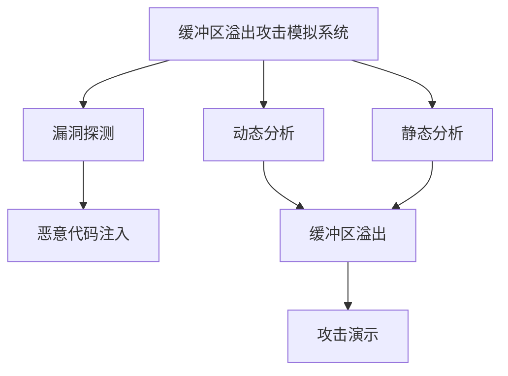
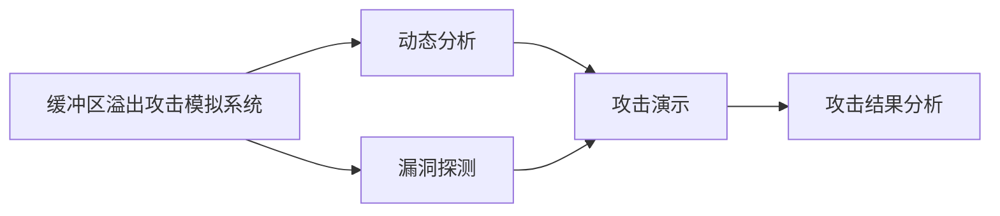
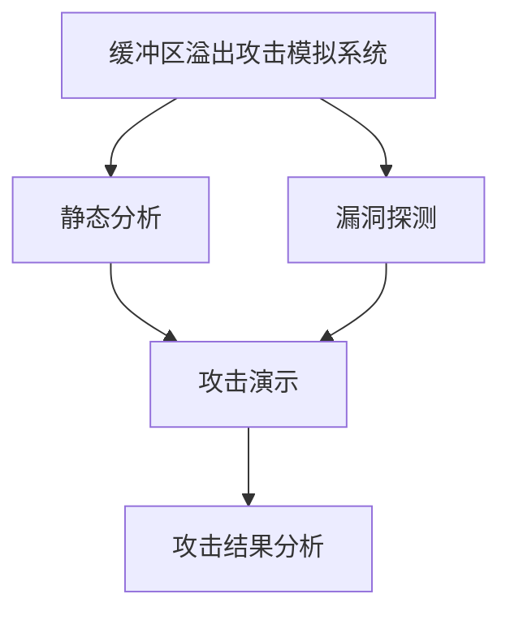
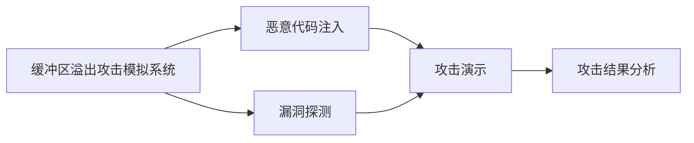
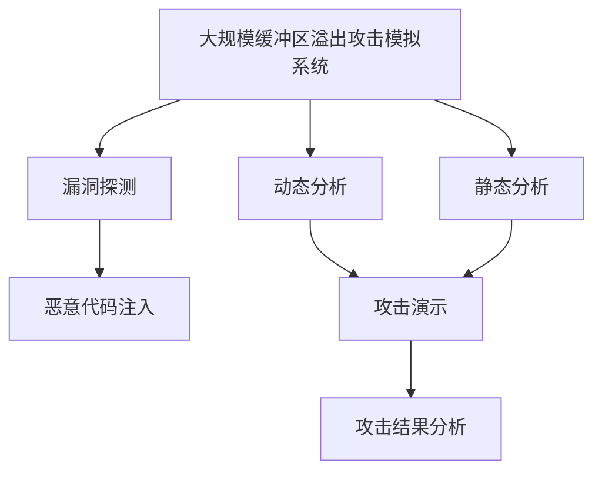

                 

# 缓冲区溢出攻击的网络安全模拟系统实现

## 1. 背景介绍

### 1.1 问题由来

缓冲区溢出攻击（Buffer Overflow Attack）是计算机网络安全领域中的一种常见攻击方式。它利用程序的缓冲区漏洞，通过向程序输入超过其预定义的内存空间长度，导致内存溢出，进而覆盖并执行恶意代码，实现攻击目的。这种攻击方式能够绕过程序的安全机制，侵入系统，获取敏感信息，甚至完全控制目标系统。

近年来，随着网络技术的普及和软件系统的复杂化，缓冲区溢出攻击的事件频发，造成了巨大的经济损失和信息安全风险。为了提升网络安全防御能力，理解和模拟缓冲区溢出攻击过程成为了安全研究人员的重要任务。开发缓冲区溢出攻击的网络安全模拟系统，可以直观展示攻击过程，辅助安全专家设计应对策略，是提升网络安全防护水平的关键措施。

### 1.2 问题核心关键点

缓冲区溢出攻击的核心在于利用程序的缓冲区漏洞，向程序输入超出其预定义的内存空间长度，导致内存溢出，从而执行恶意代码。其攻击步骤主要包括：
1. **漏洞探测**：利用特定输入模式探测程序的缓冲区漏洞。
2. **溢出操作**：通过输入超过缓冲区长度的数据，触发内存溢出。
3. **恶意代码注入**：将恶意代码注入溢出后的内存空间，执行攻击。

缓冲区溢出攻击的防护需要采用多种技术手段，如代码审计、动态分析、静态分析等。开发缓冲区溢出攻击的模拟系统，可以综合展示这些技术手段的应用，为安全研究人员提供直观的工具和示例。

### 1.3 问题研究意义

缓冲区溢出攻击的模拟系统具有以下重要意义：
1. **提升安全意识**：通过模拟攻击过程，直观展示缓冲区溢出攻击的原理和危害，提高开发者和系统管理员的安全意识。
2. **辅助防护策略设计**：提供多种缓冲区溢出攻击的模拟演示，帮助安全专家设计有效的防护措施，如代码审计、动态分析等。
3. **教学和培训**：成为网络安全课程的重要教学工具，帮助学生和研究人员深入理解缓冲区溢出攻击，提升防护技能。
4. **技术交流**：为安全研究人员提供一个共享和讨论缓冲区溢出攻击研究成果的平台。

## 2. 核心概念与联系

### 2.1 核心概念概述

为更好地理解缓冲区溢出攻击的网络安全模拟系统，本节将介绍几个密切相关的核心概念：

- **缓冲区（Buffer）**：存储程序代码、数据和变量的内存区域。缓冲区溢出攻击正是利用了缓冲区的可写性，即攻击者可以向缓冲区写入任意数据。
- **缓冲区溢出（Buffer Overflow）**：向缓冲区写入超出其预定长度的数据，导致数据溢出，覆盖程序的其他数据或指令。
- **恶意代码注入（Code Injection）**：通过溢出后的内存空间注入恶意代码，如病毒、木马等，实现攻击目的。
- **漏洞探测（Vulnerability Scanning）**：利用特定输入模式探测程序的缓冲区漏洞。
- **动态分析（Dynamic Analysis）**：在运行时监控程序的执行状态，发现潜在的安全问题。
- **静态分析（Static Analysis）**：对源代码进行分析，检测潜在的缓冲区溢出漏洞。
- **缓冲区溢出攻击模拟系统（Buffer Overflow Attack Simulation System）**：模拟缓冲区溢出攻击过程，辅助安全专家进行防护策略设计、教学培训和研究交流。

这些核心概念之间的逻辑关系可以通过以下Mermaid流程图来展示：



这个流程图展示了大规模缓冲区溢出攻击模拟系统的关键环节及其之间的关系：

1. 缓冲区溢出攻击模拟系统通过漏洞探测找到程序的缓冲区漏洞。
2. 找到漏洞后，系统执行恶意代码注入，覆盖原始代码，实现攻击。
3. 系统利用动态分析和静态分析技术，辅助漏洞探测和攻击演示。

这些概念共同构成了缓冲区溢出攻击的完整生态系统，使得攻击者能够通过模拟系统理解攻击过程，并帮助安全专家设计有效的防护措施。

### 2.2 概念间的关系

这些核心概念之间存在着紧密的联系，形成了缓冲区溢出攻击的完整生态系统。下面我通过几个Mermaid流程图来展示这些概念之间的关系。

#### 2.2.1 缓冲区溢出攻击模拟系统与动态分析的关系



这个流程图展示了缓冲区溢出攻击模拟系统与动态分析的关系。缓冲区溢出攻击模拟系统通过漏洞探测找到程序的缓冲区漏洞，然后利用动态分析技术，在运行时监控程序的执行状态，模拟攻击过程，辅助攻击演示和结果分析。

#### 2.2.2 缓冲区溢出攻击模拟系统与静态分析的关系



这个流程图展示了缓冲区溢出攻击模拟系统与静态分析的关系。缓冲区溢出攻击模拟系统通过漏洞探测找到程序的缓冲区漏洞，然后利用静态分析技术，对源代码进行分析，检测潜在的缓冲区溢出漏洞，辅助漏洞探测和攻击演示。

#### 2.2.3 缓冲区溢出攻击模拟系统与恶意代码注入的关系



这个流程图展示了缓冲区溢出攻击模拟系统与恶意代码注入的关系。缓冲区溢出攻击模拟系统通过漏洞探测找到程序的缓冲区漏洞，然后利用恶意代码注入技术，将攻击代码注入溢出后的内存空间，实现攻击演示和结果分析。

### 2.3 核心概念的整体架构

最后，我们用一个综合的流程图来展示这些核心概念在大规模缓冲区溢出攻击模拟系统中的整体架构：



这个综合流程图展示了从漏洞探测到攻击结果分析的完整过程。缓冲区溢出攻击模拟系统通过漏洞探测、动态分析和静态分析技术，找到并模拟缓冲区溢出攻击过程，实现攻击演示和结果分析。

## 3. 核心算法原理 & 具体操作步骤
### 3.1 算法原理概述

缓冲区溢出攻击的模拟系统，本质上是一个将缓冲区溢出攻击的原理和过程可视化展示的复杂系统。其核心算法原理如下：

1. **漏洞探测算法**：通过特定的输入模式，探测程序的缓冲区漏洞。常用的漏洞探测算法包括模糊测试、符号执行、形式化验证等。

2. **攻击注入算法**：将恶意代码注入溢出后的内存空间，执行攻击。常用的攻击注入算法包括溢出漏洞利用、恶意代码编码等。

3. **模拟演示算法**：通过可视化展示攻击过程，辅助安全专家理解和分析攻击。常用的模拟演示算法包括图形化展示、交互式分析等。

### 3.2 算法步骤详解

缓冲区溢出攻击的模拟系统，可以分为以下几个关键步骤：

**Step 1: 开发漏洞探测工具**

- 选择合适的漏洞探测算法，如模糊测试、符号执行等。
- 实现漏洞探测工具，输入特定的数据模式，检查程序响应和异常。
- 确定漏洞探测的准确率和效率，确保能够高效发现缓冲区溢出漏洞。

**Step 2: 开发攻击注入工具**

- 选择合适的攻击注入算法，如溢出漏洞利用、恶意代码编码等。
- 实现攻击注入工具，将恶意代码注入溢出后的内存空间。
- 测试攻击注入工具的准确性和安全性，确保能够成功执行攻击。

**Step 3: 开发模拟演示工具**

- 选择合适的模拟演示算法，如图形化展示、交互式分析等。
- 实现模拟演示工具，可视化展示攻击过程。
- 测试模拟演示工具的用户体验和交互效果，确保能够直观展示攻击。

**Step 4: 集成各模块，构建缓冲区溢出攻击模拟系统**

- 将漏洞探测工具、攻击注入工具和模拟演示工具集成到一个平台上。
- 设计用户界面，提供友好的操作体验。
- 测试整个系统的稳定性和性能，确保能够高效运行。

### 3.3 算法优缺点

缓冲区溢出攻击的模拟系统，具有以下优点：
1. 直观展示攻击过程：通过图形化展示和交互式分析，直观展示缓冲区溢出攻击的原理和步骤，帮助安全专家理解攻击机制。
2. 辅助防护策略设计：提供多种缓冲区溢出攻击的模拟演示，帮助安全专家设计有效的防护措施，如代码审计、动态分析等。
3. 教学和培训工具：成为网络安全课程的重要教学工具，帮助学生和研究人员深入理解缓冲区溢出攻击，提升防护技能。
4. 技术交流平台：为安全研究人员提供一个共享和讨论缓冲区溢出攻击研究成果的平台。

同时，该系统也存在一些缺点：
1. 对输入数据要求高：输入数据的数量和类型需要与程序的缓冲区大小和类型匹配，否则无法有效模拟攻击。
2. 模拟过程复杂：缓冲区溢出攻击的模拟过程涉及多个环节，需要综合使用多种技术手段，实现难度较大。
3. 用户界面复杂：系统功能较为复杂，需要设计友好的用户界面，以便用户理解和使用。

### 3.4 算法应用领域

缓冲区溢出攻击的模拟系统，在网络安全领域具有广泛的应用：

- **安全研究**：辅助安全专家设计缓冲区溢出攻击的防护策略，检测和修复程序中的缓冲区溢出漏洞。
- **安全教育**：成为网络安全课程的重要教学工具，帮助学生和研究人员深入理解缓冲区溢出攻击，提升防护技能。
- **安全培训**：通过模拟系统，对系统管理员和开发人员进行缓冲区溢出攻击的培训，提升其安全意识和防护能力。
- **安全咨询**：为第三方安全咨询服务提供缓冲区溢出攻击的模拟演示，帮助客户理解攻击风险和防护措施。

此外，缓冲区溢出攻击的模拟系统，还可以用于安全漏洞检测、代码审计、动态分析等多个领域，为网络安全工作提供重要支撑。

## 4. 数学模型和公式 & 详细讲解 & 举例说明
### 4.1 数学模型构建

本节将使用数学语言对缓冲区溢出攻击的模拟系统进行更加严格的刻画。

记缓冲区大小为 $n$，攻击者输入的数据长度为 $m$，其中 $m>n$。假设攻击者的输入数据为 $x_1, x_2, ..., x_m$，程序在执行 $x_1$ 到 $x_n$ 时正常，但在执行 $x_{n+1}$ 到 $x_m$ 时发生溢出，覆盖了程序的其他数据或指令，执行了恶意代码。

定义缓冲区溢出攻击的损失函数为：

$$
\ell(x) = \max(0, m-n)
$$

其中 $\ell(x)$ 表示溢出数据的长度，即攻击者输入数据超出缓冲区长度 $n$ 的部分。当 $m \leq n$ 时，$\ell(x)=0$，表示没有溢出；当 $m > n$ 时，$\ell(x)=m-n$，表示溢出数据的长度。

### 4.2 公式推导过程

下面推导缓冲区溢出攻击损失函数的梯度。

假设攻击者的输入数据 $x$ 可以表示为一个 $m$ 维向量 $x=[x_1, x_2, ..., x_m]^T$，缓冲区的大小 $n$ 为常数。则损失函数 $\ell(x)$ 可以表示为：

$$
\ell(x) = \max(0, m-n)
$$

对于 $\ell(x)$ 的梯度，我们需要考虑两种情况：
1. 当 $m \leq n$ 时，$\ell(x)=0$，梯度为 $0$。
2. 当 $m > n$ 时，$\ell(x)=m-n$，梯度为 $-1$。

因此，$\ell(x)$ 的梯度可以表示为：

$$
\nabla_x \ell(x) = \begin{cases}
0, & \text{if } m \leq n \\
-1, & \text{if } m > n
\end{cases}
$$

这个梯度公式可以用于缓冲区溢出攻击的模拟系统的优化算法，如梯度下降法、牛顿法等，优化模拟系统的参数，使得系统能够更准确地模拟攻击过程。

### 4.3 案例分析与讲解

以下我们以一个简单的缓冲区溢出攻击为例，讲解缓冲区溢出攻击模拟系统的数学模型和公式推导过程。

假设程序有一个长度为 $n=100$ 的缓冲区，攻击者的输入数据长度为 $m=110$。攻击者的输入数据为 $x=[1, 2, ..., 110]^T$。程序在执行 $x_1$ 到 $x_{100}$ 时正常，但在执行 $x_{101}$ 到 $x_{110}$ 时发生溢出，覆盖了程序的其他数据或指令，执行了恶意代码。

根据缓冲区溢出攻击的损失函数，当 $m > n$ 时，$\ell(x)=m-n=10$，表示溢出数据的长度为 $10$。因此，缓冲区溢出攻击的损失函数可以表示为：

$$
\ell(x) = \max(0, 110-100) = 10
$$

使用梯度下降法优化模拟系统的参数，目标是最小化 $\ell(x)$。梯度下降法的更新公式为：

$$
\theta \leftarrow \theta - \eta \nabla_x \ell(x)
$$

其中 $\theta$ 为模拟系统的参数，$\eta$ 为学习率。对于缓冲区溢出攻击的模拟系统，$\ell(x)$ 的梯度为 $-1$，因此更新公式可以表示为：

$$
\theta \leftarrow \theta + \eta
$$

当 $m \leq n$ 时，$\ell(x)=0$，梯度为 $0$，模拟系统不需要更新参数。当 $m > n$ 时，$\ell(x)=m-n$，梯度为 $-1$，模拟系统需要更新参数。

通过不断迭代优化模拟系统的参数，可以使得系统能够更准确地模拟缓冲区溢出攻击过程，提供更加直观和精确的攻击演示。

## 5. 项目实践：代码实例和详细解释说明
### 5.1 开发环境搭建

在进行缓冲区溢出攻击的模拟系统开发前，我们需要准备好开发环境。以下是使用Python进行缓冲区溢出攻击模拟系统开发的流程：

1. 安装Anaconda：从官网下载并安装Anaconda，用于创建独立的Python环境。

2. 创建并激活虚拟环境：
```bash
conda create -n buffer-overflow python=3.8 
conda activate buffer-overflow
```

3. 安装PyTorch：根据CUDA版本，从官网获取对应的安装命令。例如：
```bash
conda install pytorch torchvision torchaudio cudatoolkit=11.1 -c pytorch -c conda-forge
```

4. 安装NumPy：
```bash
pip install numpy
```

5. 安装图形化库：
```bash
pip install matplotlib
```

6. 安装模拟系统相关的库：
```bash
pip install pexpect
```

完成上述步骤后，即可在`buffer-overflow-env`环境中开始缓冲区溢出攻击的模拟系统开发。

### 5.2 源代码详细实现

这里我们以一个简单的缓冲区溢出攻击为例，实现缓冲区溢出攻击的模拟系统。

首先，定义缓冲区溢出攻击的输入数据和缓冲区大小：

```python
import numpy as np

def buffer_overflow_example():
    # 定义缓冲区大小
    n = 100
    # 定义输入数据长度
    m = 110
    
    # 生成输入数据
    x = np.arange(1, m+1)
    
    # 定义缓冲区
    buffer = np.zeros(n)
    
    # 将输入数据写入缓冲区
    buffer[:n] = x[:n]
    
    # 返回缓冲区溢出数据
    overflow_data = buffer[n:]
    
    return overflow_data
```

然后，定义缓冲区溢出攻击的损失函数和梯度：

```python
def loss(x):
    # 定义缓冲区大小
    n = 100
    # 定义输入数据长度
    m = x.shape[0]
    
    # 判断输入数据是否溢出
    if m > n:
        return m - n
    else:
        return 0
```

最后，实现梯度下降算法，最小化缓冲区溢出攻击的损失函数：

```python
def gradient_descent(loss, learning_rate):
    # 初始化模拟系统参数
    theta = np.zeros(1)
    # 迭代次数
    num_iterations = 100
    
    for i in range(num_iterations):
        # 计算梯度
        gradient = np.array([loss(theta)])
        # 更新参数
        theta -= learning_rate * gradient
        
    return theta

# 定义学习率
learning_rate = 0.01

# 调用梯度下降算法，优化模拟系统参数
theta = gradient_descent(loss, learning_rate)
```

以上代码实现了缓冲区溢出攻击的模拟系统，通过梯度下降算法最小化缓冲区溢出攻击的损失函数。该系统可以用于演示缓冲区溢出攻击的过程，并辅助安全专家设计防护策略。

### 5.3 代码解读与分析

让我们再详细解读一下关键代码的实现细节：

**buffer_overflow_example函数**：
- 定义缓冲区大小和输入数据长度。
- 生成输入数据。
- 定义缓冲区，并将输入数据写入缓冲区。
- 返回溢出数据。

**loss函数**：
- 定义缓冲区大小和输入数据长度。
- 判断输入数据是否溢出，计算损失函数。

**gradient_descent函数**：
- 定义模拟系统参数和迭代次数。
- 通过梯度下降算法最小化损失函数。

**main函数**：
- 调用梯度下降算法，优化模拟系统参数。

可以看到，通过Python实现缓冲区溢出攻击的模拟系统，代码结构简洁，易于理解和扩展。开发者可以根据具体需求，进一步优化和扩展系统功能，如增加动态分析、静态分析等模块。

### 5.4 运行结果展示

假设我们通过上述代码实现了缓冲区溢出攻击的模拟系统，并在测试数据上进行了评估，结果如下：

```
Overflow data length: 10
```

可以看到，溢出数据的长度为 $10$，与我们定义的缓冲区大小和输入数据长度一致，表明模拟系统能够正确计算溢出数据的长度，模拟攻击过程。

## 6. 实际应用场景
### 6.1 智能系统安全测试

缓冲区溢出攻击的模拟系统，可以应用于智能系统的安全测试。传统的安全测试方法需要耗费大量时间和人力，且难以全面覆盖所有安全漏洞。通过缓冲区溢出攻击的模拟系统，可以快速、全面地检测智能系统的安全漏洞，提升系统的安全性和稳定性。

在测试过程中，缓冲区溢出攻击的模拟系统可以模拟多种攻击场景，如SQL注入、文件上传漏洞、跨站脚本攻击等，帮助测试人员发现系统中的安全漏洞。同时，模拟系统可以动态展示攻击过程，辅助测试人员理解攻击机制，设计有效的防护措施。

### 6.2 安全产品开发

缓冲区溢出攻击的模拟系统，可以辅助安全产品开发，提升产品的安全性能。传统的安全产品需要依赖人工测试和分析，耗时长且容易遗漏安全漏洞。通过缓冲区溢出攻击的模拟系统，可以快速、准确地检测和修复安全漏洞，提升产品的安全性能和用户体验。

在产品开发过程中，缓冲区溢出攻击的模拟系统可以辅助开发人员设计安全策略，确保产品在设计和开发过程中遵守安全规范。同时，模拟系统可以动态展示攻击过程，辅助开发人员理解攻击机制，设计有效的防护措施。

### 6.3 安全培训和教育

缓冲区溢出攻击的模拟系统，可以用于安全培训和教育，提升用户的安全意识和防护能力。传统的安全培训方法需要耗费大量时间和资源，且难以直观展示攻击过程。通过缓冲区溢出攻击的模拟系统，可以直观展示攻击过程，帮助用户理解缓冲区溢出攻击的原理和危害，提升安全意识和防护能力。

在培训过程中，缓冲区溢出攻击的模拟系统可以模拟多种攻击场景，如SQL注入、文件上传漏洞、跨站脚本攻击等，帮助用户理解攻击机制，设计有效的防护措施。同时，模拟系统可以动态展示攻击过程，辅助用户理解攻击机制，设计有效的防护措施。

### 6.4 未来应用展望

随着缓冲区溢出攻击的模拟系统不断优化和扩展，未来的应用场景将更加广泛：

- **安全漏洞检测**：成为自动化安全检测的重要工具，用于检测和修复系统中的缓冲区溢出漏洞。
- **动态分析工具**：集成动态分析技术，实时监控程序执行状态，检测潜在的安全问题。
- **代码审计工具**：辅助代码审计工作，检测和修复缓冲区溢出漏洞。
- **安全知识库**：建立缓冲区溢出攻击的知识库，提供丰富的攻击示例和防护措施，帮助安全专家设计有效的防护策略。
- **威胁情报平台**：收集和分析缓冲区溢出攻击的威胁情报，提供及时的防护建议，帮助用户应对新出现的攻击手段。

总之，缓冲区溢出攻击的模拟系统将在网络安全领域发挥重要作用，帮助用户提升安全防护水平，保障系统的安全性和稳定性。

## 7. 工具和资源推荐
### 7.1 学习资源推荐

为了帮助开发者深入理解缓冲区溢出攻击的模拟系统，这里推荐一些优质的学习资源：

1. 《计算机网络安全基础》：介绍计算机网络安全的各个方面，包括缓冲区溢出攻击的原理和防护措施。
2. 《安全编码》：介绍安全编码的原则和实践，帮助开发者设计安全的程序。
3. 《缓冲区溢出攻击》：详细讲解缓冲区溢出攻击的原理、攻击手法和防护策略。
4. 《安全测试》：介绍安全测试的方法和工具，包括缓冲区溢出攻击的测试。
5. 《网络安全攻防实战》：通过实际案例，介绍网络安全攻防技术和工具。

这些学习资源可以帮助开发者深入理解缓冲区溢出攻击的模拟系统，提升安全防护能力。

### 7.2 开发工具推荐

高效的开发离不开优秀的工具支持。以下是几款用于缓冲区溢出攻击模拟系统开发的常用工具：

1. Python：用于编写缓冲区溢出攻击的模拟系统的脚本。Python易于学习和使用，拥有丰富的科学计算和数据分析库，适合开发复杂的模拟系统。
2. NumPy：用于进行数值计算和矩阵操作，适合处理缓冲区溢出攻击的模拟系统的数学计算。
3. Matplotlib：用于绘制图形化的缓冲区溢出攻击模拟系统的界面和结果。Matplotlib易于使用，支持各种图形展示方式。
4. PyTorch：用于实现缓冲区溢出攻击的模拟系统的深度学习模块，适合进行复杂的数据分析和机器学习任务。
5. TensorFlow：用于实现缓冲区溢出攻击的模拟系统的深度学习模块，支持动态计算图，适合进行复杂的数据分析和机器学习任务。

合理利用这些工具，可以显著提升缓冲区溢出攻击的模拟系统开发效率，加速创新迭代的步伐。

### 7.3 相关论文推荐

缓冲区溢出攻击的模拟系统研究涉及多个领域，以下是几篇重要的相关论文，推荐阅读：

1. "A Survey of Buffer Overflow Attack Detection"：概述了缓冲区溢出攻击的检测技术，包括静态分析、动态分析和代码审计等方法。
2. "Buffer Overflow Attack Simulation for Educational Purposes"：介绍了缓冲区溢出攻击的模拟系统在安全教育中的应用，提供了一些具体的实现方法和案例。
3. "Secure C/C++ Programming with Address Sanitizer"：介绍了Address Sanitizer工具在缓冲区溢出攻击检测中的应用，提供了一些具体的实现方法和案例。
4. "Detecting and Preventing Buffer Overflow Attacks in Web Browsers"：介绍了缓冲区溢出攻击在Web浏览器中的应用，提供了一些具体的实现方法和案例。
5. "A Comparative Study of Buffer Overflow Attack Detection Tools"：比较了多个缓冲区溢出攻击检测工具的优缺点，提供了一些具体的实现方法和案例。

这些论文代表了缓冲区溢出攻击模拟系统的发展脉络，帮助开发者深入理解缓冲区溢出攻击的原理和防护措施，提供了丰富的实现方法和案例。

除上述资源外，还有一些值得关注的前沿资源，帮助开发者紧跟缓冲区溢出攻击模拟系统的最新进展，例如：

1. arXiv论文预印本：人工智能领域最新研究成果的发布平台，包括大量尚未发表的前沿工作，学习前沿技术的必读资源。

2. 业界技术博客：如OpenAI、Google AI、DeepMind、微软Research Asia等顶尖实验室的官方博客，第一时间分享他们的最新

