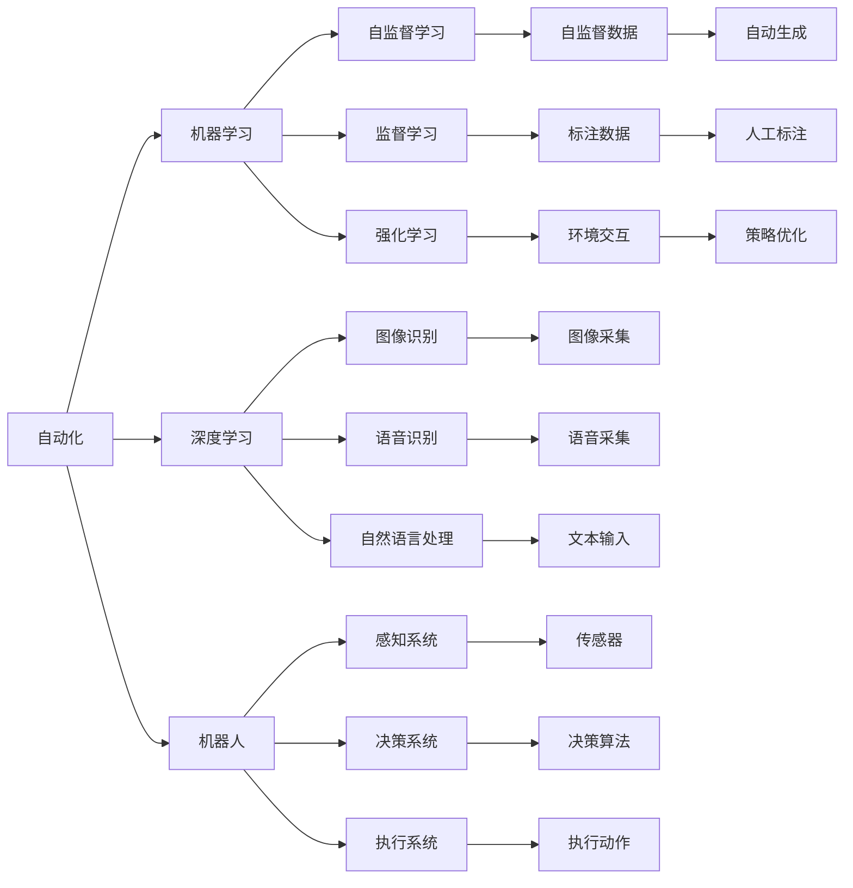

                 

# 自动化技术的发展与应用

> 关键词：自动化,工业4.0,机器学习,机器人,人工智能,自动驾驶,智能制造

## 1. 背景介绍

### 1.1 问题由来

自动化技术是20世纪以来技术革命的重要标志，它不仅极大地提高了生产效率，还彻底改变了人们的生活方式。然而，随着工业自动化和信息化的发展，传统的生产方式和商业逻辑逐渐无法满足当前社会和经济的需求。如何进一步提升生产自动化水平，实现更高效、更智能的生产体系，成为了工业界和学术界共同关注的热点话题。

近年来，随着机器学习、深度学习等人工智能技术的不断发展，基于机器学习的自动化技术（Machine Learning-based Automation）成为了新的趋势。它通过在机器上安装感知、决策、执行等智能化组件，使机器能够自主感知环境、自主决策和自主执行任务，实现了真正的"智能制造"。这种技术不仅适用于传统的制造业，还广泛应用于农业、服务业、医疗、交通等领域，为各行各业带来了翻天覆地的变化。

### 1.2 问题核心关键点

自动化技术的发展与应用的重点在于以下几点：

1. **自主感知**：通过安装各种传感器和摄像头，使机器能够实时获取环境数据，为后续决策提供基础。

2. **自主决策**：利用机器学习算法，使机器具备自主决策能力，可以处理复杂的生产流程和业务逻辑。

3. **自主执行**：基于决策结果，机器能够自动执行动作，实现精确控制。

4. **互联互通**：自动化系统需要实现与生产设备、人员、流程等的互联互通，以实现数据共享和业务协同。

5. **智能优化**：通过学习历史数据和实时数据，机器能够不断优化自身行为，提升生产效率和质量。

6. **人机协作**：最终目标是人机协同工作，而非机器取代人类。自动化技术应更好地服务于人类，提升工作效率和生活品质。

### 1.3 问题研究意义

自动化技术的发展与应用，对于提升产业智能化水平、推动经济结构优化、促进社会进步具有重要意义：

1. **提升生产效率**：通过智能化生产，实现对生产流程的全面优化，减少人力成本，提升生产效率。

2. **降低运营成本**：自动化系统可以24小时不间断工作，减少停机和人力投入，降低运营成本。

3. **增强企业竞争力**：自动化技术可以提升产品质量和生产稳定性，增强企业的市场竞争力和品牌影响力。

4. **促进创新发展**：自动化技术的发展催生了新兴产业和新兴技术，为产业创新和转型提供了新动力。

5. **推动经济转型**：通过智能制造，推动传统制造业向高端化、智能化、服务化方向发展，促进经济结构的优化升级。

6. **改善生活质量**：自动化技术能够提升人类生活品质，实现更安全、更健康、更高效的生活方式。

## 2. 核心概念与联系

### 2.1 核心概念概述

在自动化技术的发展与应用中，以下几个关键概念尤为核心：

- **自动化（Automation）**：是指利用各种技术手段（如机器学习、机器人技术等），使机器能够自动执行任务，替代或辅助人类完成生产或服务工作。

- **工业4.0（Industry 4.0）**：指利用信息化技术，通过“网络化”、“数字化”、“智能化”的方式，实现工厂智能化生产、供应链智能协同和用户个性化定制的全新生产模式。

- **机器学习（Machine Learning）**：通过训练数据模型，使机器具备自主学习和改进能力，能够处理各种复杂任务。

- **深度学习（Deep Learning）**：是机器学习的一种，基于多层神经网络，能够自动学习和处理高维数据，广泛应用于图像、语音、自然语言处理等领域。

- **机器人（Robotics）**：是自动化技术的重要组成部分，利用人工智能、传感器等技术，使机器具备自主感知、决策和执行能力，广泛应用在制造业、服务业等领域。

- **自动驾驶（Autonomous Driving）**：利用机器学习、计算机视觉等技术，使车辆能够自主感知环境、自主决策和执行，实现无人驾驶。

- **智能制造（Intelligent Manufacturing）**：通过机器学习、物联网等技术，实现生产过程的全面智能化，提升生产效率和质量。

这些核心概念相互关联，共同构成了自动化技术的发展与应用框架。

### 2.2 概念间的关系

这些核心概念之间的关系可以通过以下Mermaid流程图来展示：



这个流程图展示了各个核心概念之间的关系：

1. **自动化**是整体框架的核心，通过各种智能化技术手段实现任务自动化。
2. **机器学习**是自动化技术的核心驱动，通过数据训练模型，使机器具备自主学习能力。
3. **深度学习**是机器学习的重要组成部分，通过多层神经网络处理复杂数据。
4. **机器人**是自动化技术的重要载体，具备自主感知、决策和执行能力。
5. **自动驾驶**是机器人在交通领域的具体应用，实现无人驾驶。
6. **智能制造**是自动化技术在制造业的具体应用，实现生产过程的全面智能化。

这些概念通过技术手段相互作用，共同推动了自动化技术的发展与应用。

## 3. 核心算法原理 & 具体操作步骤
### 3.1 算法原理概述

自动化技术中的算法原理，主要是通过机器学习算法使机器具备自主感知、决策和执行能力。其基本流程包括数据采集、数据处理、模型训练和模型应用等步骤。

- **数据采集**：通过传感器、摄像头等设备，实时采集环境数据，如温度、湿度、位置、速度等。
- **数据处理**：对采集到的数据进行预处理，包括数据清洗、特征提取、数据增强等。
- **模型训练**：使用机器学习算法训练模型，如回归、分类、聚类、深度学习等，使模型能够自主学习和处理数据。
- **模型应用**：将训练好的模型应用于生产或服务中，实现自主感知、决策和执行。

### 3.2 算法步骤详解

以下是自动化技术中机器学习算法的详细步骤：

1. **数据准备**：收集并准备训练数据，包括样本数据、标签数据、特征数据等。

2. **特征工程**：对数据进行特征提取、特征选择、特征转换等处理，提取最具代表性的特征。

3. **模型选择**：根据任务类型和数据特点，选择合适的机器学习模型，如线性回归、逻辑回归、决策树、随机森林、支持向量机、深度神经网络等。

4. **模型训练**：将数据输入模型，进行训练，更新模型参数，使模型能够自动学习并处理数据。

5. **模型评估**：使用验证集或测试集对模型进行评估，评估指标包括准确率、召回率、F1分数、均方误差等。

6. **模型应用**：将训练好的模型应用于生产或服务中，实现自主感知、决策和执行。

### 3.3 算法优缺点

自动化技术中的机器学习算法具有以下优点：

- **高效性**：机器学习算法能够自动处理大量数据，速度快，效率高。
- **准确性**：通过训练大量的数据，机器学习算法能够提高模型的准确性和泛化能力。
- **可扩展性**：机器学习算法可以处理各种复杂任务，具有较强的扩展性。
- **自适应性**：机器学习算法能够根据数据不断更新模型，实现自适应学习。

同时，也存在一些缺点：

- **数据依赖**：机器学习算法需要大量的标注数据进行训练，获取高质量数据的成本较高。
- **模型复杂**：深度学习模型结构复杂，训练和推理速度较慢。
- **过拟合风险**：模型容易过拟合训练数据，泛化能力较弱。
- **可解释性不足**：机器学习算法的决策过程缺乏可解释性，难以理解和调试。

### 3.4 算法应用领域

机器学习算法广泛应用于以下领域：

- **制造业**：通过机器学习算法优化生产流程，实现智能制造。
- **农业**：利用机器学习算法对农业数据进行分析和预测，提高生产效率。
- **物流**：使用机器学习算法优化物流配送路径，提高运输效率。
- **医疗**：通过机器学习算法进行疾病预测、影像分析等，提高医疗诊断水平。
- **金融**：使用机器学习算法进行风险评估、欺诈检测等，提高金融安全性。
- **能源**：利用机器学习算法优化能源消耗，提高能源利用率。
- **交通**：通过机器学习算法进行交通流量预测、路径规划等，提高交通效率。
- **服务业**：使用机器学习算法进行客户行为分析、个性化推荐等，提高服务质量。

## 4. 数学模型和公式 & 详细讲解 & 举例说明

### 4.1 数学模型构建

在自动化技术中，常见的数学模型包括回归模型、分类模型、聚类模型、神经网络模型等。以下是几个典型模型的数学表示：

1. **线性回归模型**：
$$
y = w_0 + w_1 x_1 + w_2 x_2 + \ldots + w_n x_n + \epsilon
$$
其中 $y$ 为输出变量，$x_1, x_2, \ldots, x_n$ 为输入变量，$w_0, w_1, w_2, \ldots, w_n$ 为模型参数，$\epsilon$ 为误差项。

2. **逻辑回归模型**：
$$
P(y=1|x) = \sigma(w_0 + w_1 x_1 + w_2 x_2 + \ldots + w_n x_n)
$$
其中 $P(y=1|x)$ 为输出变量 $y$ 的概率，$\sigma$ 为sigmoid函数，$w_0, w_1, w_2, \ldots, w_n$ 为模型参数。

3. **决策树模型**：
$$
T = \bigcup_{i=1}^m T_i
$$
其中 $T$ 为决策树，$m$ 为决策树的叶节点数，$T_i$ 为决策树的子树。

4. **随机森林模型**：
$$
F = \{T_1, T_2, \ldots, T_M\}
$$
其中 $F$ 为随机森林，$M$ 为随机森林的树数，$T_i$ 为随机森林的决策树。

5. **神经网络模型**：
$$
y = \sigma(z)
$$
其中 $z = w_0 + w_1 x_1 + w_2 x_2 + \ldots + w_n x_n$，$\sigma$ 为激活函数，$w_0, w_1, w_2, \ldots, w_n$ 为模型参数。

### 4.2 公式推导过程

以线性回归模型为例，推导其训练过程和预测过程的公式：

1. **训练过程**：
$$
w = (X^T X)^{-1} X^T y
$$
其中 $w$ 为模型参数，$X$ 为输入数据矩阵，$y$ 为输出变量向量，$X^T$ 为 $X$ 的转置矩阵。

2. **预测过程**：
$$
y' = w^T x
$$
其中 $y'$ 为预测输出变量，$x$ 为输入数据向量，$w$ 为模型参数。

### 4.3 案例分析与讲解

以制造业中的智能检测系统为例，分析其基于机器学习的自动化检测过程：

1. **数据采集**：通过传感器采集生产过程中的温度、压力、振动等数据。

2. **数据处理**：对采集到的数据进行预处理，包括数据清洗、特征提取、数据增强等。

3. **模型训练**：使用机器学习算法训练模型，如线性回归、支持向量机、深度神经网络等，使模型能够自动学习和处理数据。

4. **模型评估**：使用验证集或测试集对模型进行评估，评估指标包括准确率、召回率、F1分数等。

5. **模型应用**：将训练好的模型应用于生产中，实现自主检测和质量控制。

## 5. 项目实践：代码实例和详细解释说明

### 5.1 开发环境搭建

在进行自动化技术开发前，我们需要准备好开发环境。以下是使用Python进行PyTorch开发的环境配置流程：

1. 安装Anaconda：从官网下载并安装Anaconda，用于创建独立的Python环境。

2. 创建并激活虚拟环境：
```bash
conda create -n pytorch-env python=3.8 
conda activate pytorch-env
```

3. 安装PyTorch：根据CUDA版本，从官网获取对应的安装命令。例如：
```bash
conda install pytorch torchvision torchaudio cudatoolkit=11.1 -c pytorch -c conda-forge
```

4. 安装TensorFlow：
```bash
pip install tensorflow
```

5. 安装各类工具包：
```bash
pip install numpy pandas scikit-learn matplotlib tqdm jupyter notebook ipython
```

完成上述步骤后，即可在`pytorch-env`环境中开始开发实践。

### 5.2 源代码详细实现

以下是使用PyTorch进行机器学习算法实现的代码示例：

```python
import torch
import torch.nn as nn
import torch.optim as optim

# 定义模型
class LinearRegression(nn.Module):
    def __init__(self, input_dim, output_dim):
        super(LinearRegression, self).__init__()
        self.linear = nn.Linear(input_dim, output_dim)

    def forward(self, x):
        return self.linear(x)

# 定义数据集
train_x = torch.tensor([[0.1, 0.2, 0.3], [0.4, 0.5, 0.6], [0.7, 0.8, 0.9]])
train_y = torch.tensor([0.4, 0.5, 0.6])

# 定义模型参数
input_dim = train_x.size(1)
output_dim = train_y.size(1)
model = LinearRegression(input_dim, output_dim)

# 定义损失函数和优化器
criterion = nn.MSELoss()
optimizer = optim.SGD(model.parameters(), lr=0.01)

# 训练模型
for epoch in range(100):
    optimizer.zero_grad()
    predictions = model(train_x)
    loss = criterion(predictions, train_y)
    loss.backward()
    optimizer.step()
    print(f"Epoch {epoch+1}, Loss: {loss.item()}")

# 预测新数据
test_x = torch.tensor([[0.5, 0.6, 0.7]])
predictions = model(test_x)
print(f"Prediction: {predictions.item()}")
```

### 5.3 代码解读与分析

让我们再详细解读一下关键代码的实现细节：

**定义模型**：
- `__init__`方法：初始化模型的线性层。
- `forward`方法：前向传播计算模型输出。

**定义数据集**：
- `train_x`和`train_y`分别为训练数据的输入和输出。

**定义模型参数**：
- `input_dim`和`output_dim`分别为输入向量和输出向量的维度。

**定义损失函数和优化器**：
- `criterion`为均方误差损失函数。
- `optimizer`为随机梯度下降优化器。

**训练模型**：
- 每个epoch内，在训练集上前向传播计算预测值，计算损失函数，反向传播更新模型参数。
- 输出每个epoch的损失值。

**预测新数据**：
- 对新数据进行前向传播，得到预测结果。

这个简单的代码示例展示了使用PyTorch进行线性回归的训练和预测过程。可以看到，利用深度学习框架，实现机器学习算法变得非常简单高效。

## 6. 实际应用场景

### 6.1 智能制造

智能制造是大规模自动化技术应用的主要领域之一，通过机器学习算法对生产过程进行优化和控制，实现了高度智能化和自动化。智能制造的主要应用场景包括：

1. **智能检测**：通过机器学习算法对生产过程中的质量数据进行实时监控和分析，实现异常检测和故障预警。

2. **智能调度**：利用机器学习算法对生产任务进行智能调度，优化生产流程，提高生产效率。

3. **智能维护**：通过机器学习算法对生产设备的运行状态进行预测和维护，降低设备故障率。

4. **智能仓储**：使用机器学习算法对库存进行智能管理，优化库存量和物流路径。

5. **智能设计**：通过机器学习算法对产品设计进行优化，实现自动化的产品设计。

### 6.2 智能交通

智能交通是另一个重要的自动化技术应用场景，通过机器学习算法对交通数据进行处理和分析，实现了智能驾驶和交通管理。智能交通的主要应用场景包括：

1. **自动驾驶**：通过机器学习算法对道路环境进行感知和决策，实现无人驾驶。

2. **智能调度**：利用机器学习算法对交通流量进行预测和调度，优化交通拥堵情况。

3. **智能监控**：通过机器学习算法对交通视频进行实时监控和分析，提高交通安全性。

4. **智能导航**：使用机器学习算法对路径进行智能规划，提高导航精度。

### 6.3 智慧医疗

智慧医疗是大规模自动化技术在医疗领域的重要应用，通过机器学习算法对医疗数据进行处理和分析，实现了智能诊断和健康管理。智慧医疗的主要应用场景包括：

1. **智能诊断**：通过机器学习算法对医疗影像进行分析和诊断，提高诊断精度。

2. **智能治疗**：利用机器学习算法对治疗方案进行优化和推荐，提高治疗效果。

3. **智能监测**：通过机器学习算法对患者数据进行实时监控和分析，实现个性化健康管理。

4. **智能药物研发**：使用机器学习算法对药物进行筛选和设计，提高药物研发效率。

## 7. 工具和资源推荐

### 7.1 学习资源推荐

为了帮助开发者系统掌握自动化技术的基础知识和高级技巧，这里推荐一些优质的学习资源：

1. 《深度学习》（Ian Goodfellow等著）：深度学习领域的经典教材，详细介绍了深度学习算法和应用。

2. 《机器学习实战》（Peter Harrington著）：详细介绍了机器学习算法的实现和应用。

3. 《Python机器学习》（Sebastian Raschka著）：详细介绍了Python在机器学习中的应用。

4. Coursera的《机器学习》课程：由斯坦福大学Andrew Ng教授主讲，是机器学习领域的重要入门课程。

5. Udacity的《深度学习》课程：由DeepMind联合创始人Geoffrey Hinton主讲，深入浅出地介绍了深度学习算法。

6. Fast.ai的课程：通过动手实践，介绍了深度学习和机器学习的实用技巧。

通过对这些资源的学习实践，相信你一定能够快速掌握自动化技术的基础知识和高级技巧，并应用于实际的工程项目中。

### 7.2 开发工具推荐

高效的开发离不开优秀的工具支持。以下是几款用于自动化技术开发的常用工具：

1. PyTorch：基于Python的开源深度学习框架，灵活动态的计算图，适合快速迭代研究。

2. TensorFlow：由Google主导开发的开源深度学习框架，生产部署方便，适合大规模工程应用。

3. OpenCV：开源计算机视觉库，提供了丰富的图像处理和分析工具。

4. ROS：机器人操作系统，支持机器人感知、决策和执行。

5. UAVCAN：高可靠性、高效率的通信协议，适用于工业机器人等自动化设备。

6. ARKIOT：开源物联网平台，支持智能设备的互联互通。

7. Docker和Kubernetes：容器化和容器编排工具，支持自动化任务的部署和管理。

8. Jenkins和Travis CI：开源自动化工具，支持持续集成和持续交付。

合理利用这些工具，可以显著提升自动化技术的开发效率，加快创新迭代的步伐。

### 7.3 相关论文推荐

自动化技术的发展与应用是一个不断探索和创新的过程，以下是几篇奠基性的相关论文，推荐阅读：

1. 《自动机器学习：方法、系统与应用》（J. Bergstra等著）：介绍了自动机器学习（AutoML）的概念和方法。

2. 《Deep Reinforcement Learning for Automated Robot Learning》（J. Leibo等著）：介绍了基于深度强化学习的自动化机器人学习。

3. 《Network In Network》（Gao Huang等著）：介绍了神经网络架构搜索（NAS）的概念和方法。

4. 《Robotics Automation: Systems, Modelling and Control》（Russell A. S.著）：介绍了机器人技术的基础知识和最新进展。

5. 《Towards AI-Driven Service Robotics》（D. Chen等著）：介绍了基于AI驱动的自动化服务机器人。

这些论文代表了自动化技术的发展脉络，通过学习这些前沿成果，可以帮助研究者把握学科前进方向，激发更多的创新灵感。

除上述资源外，还有一些值得关注的前沿资源，帮助开发者紧跟自动化技术的发展趋势，例如：

1. arXiv论文预印本：人工智能领域最新研究成果的发布平台，包括大量尚未发表的前沿工作，学习前沿技术的必读资源。

2. 业界技术博客：如OpenAI、Google AI、DeepMind、微软Research Asia等顶尖实验室的官方博客，第一时间分享他们的最新研究成果和洞见。

3. 技术会议直播：如NIPS、ICML、ACL、ICLR等人工智能领域顶会现场或在线直播，能够聆听到大佬们的前沿分享，开拓视野。

4. GitHub热门项目：在GitHub上Star、Fork数最多的自动化相关项目，往往代表了该技术领域的发展趋势和最佳实践，值得去学习和贡献。

5. 行业分析报告：各大咨询公司如McKinsey、PwC等针对自动化行业的分析报告，有助于从商业视角审视技术趋势，把握应用价值。

总之，对于自动化技术的学习和实践，需要开发者保持开放的心态和持续学习的意愿。多关注前沿资讯，多动手实践，多思考总结，必将收获满满的成长收益。

## 8. 总结：未来发展趋势与挑战

### 8.1 总结

本文对自动化技术的发展与应用进行了全面系统的介绍。首先阐述了自动化技术的发展背景和应用意义，明确了自动化技术对提升生产效率、降低运营成本、增强企业竞争力等方面的重要性。其次，从原理到实践，详细讲解了自动化技术的核心算法和操作步骤，给出了代码实例和详细解释说明。同时，本文还探讨了自动化技术在多个行业领域的应用前景，展示了其广阔的应用空间。最后，本文精选了自动化技术的各类学习资源，力求为读者提供全方位的技术指引。

通过本文的系统梳理，可以看到，自动化技术正处于快速发展时期，其应用前景广阔。得益于机器学习、深度学习等人工智能技术的不断发展，自动化技术已经渗透到了生产、服务、医疗、交通等多个领域，为各行各业带来了翻天覆地的变化。未来，随着技术的进一步突破，自动化技术必将发挥更大的作用，推动社会和经济的全面进步。

### 8.2 未来发展趋势

展望未来，自动化技术的发展与应用将呈现以下几个趋势：

1. **智能化水平提升**：随着深度学习和人工智能技术的不断发展，自动化系统的智能化水平将不断提升，能够处理更复杂、更精细的任务。

2. **多模态融合**：未来自动化系统将不仅仅局限于单一模态，而是实现视觉、语音、文本等多模态数据的融合，提升系统的感知能力和决策能力。

3. **人机协同**：未来自动化系统将更多地与人类协作，实现人机协同工作，提升系统的灵活性和可控性。

4. **自主学习**：未来自动化系统将具备自主学习能力，能够根据环境和任务的变化不断更新模型，适应新的情况。

5. **自动化技术标准化**：未来自动化技术将逐步标准化，实现跨平台、跨系统的互操作和集成。

6. **边缘计算**：未来自动化系统将更多地部署在边缘设备上，实现实时数据处理和决策，降低延迟和带宽需求。

7. **可持续发展**：未来自动化系统将更多地考虑可持续发展，实现能源效率和环境友好的生产方式。

### 8.3 面临的挑战

尽管自动化技术取得了巨大成功，但在其发展与应用过程中，仍然面临许多挑战：

1. **数据质量与隐私**：高质量的数据是自动化技术的基础，但数据采集和处理过程中存在隐私和安全问题。

2. **算法鲁棒性**：自动化系统需要面对各种复杂环境和任务，算法鲁棒性不足容易导致系统失效。

3. **可解释性**：自动化系统的决策过程缺乏可解释性，难以理解和调试。

4. **安全与可靠性**：自动化系统的安全性、可靠性问题是其应用的重要保障，需要多方协作确保系统安全稳定。

5. **经济成本**：自动化技术的实施需要高昂的初期投资，如何降低成本、提高性价比，是未来发展的重要方向。

6. **标准与规范**：自动化技术的标准化和规范化问题，需要行业和政府共同推动，才能实现健康发展。

7. **伦理与法律**：自动化技术的应用需要考虑伦理和法律问题，确保其公平、公正、透明。

### 8.4 研究展望

面对自动化技术面临的挑战，未来的研究需要在以下几个方面寻求新的突破：

1. **数据隐私保护**：研究数据隐私保护技术，确保数据采集和处理过程中的隐私安全

