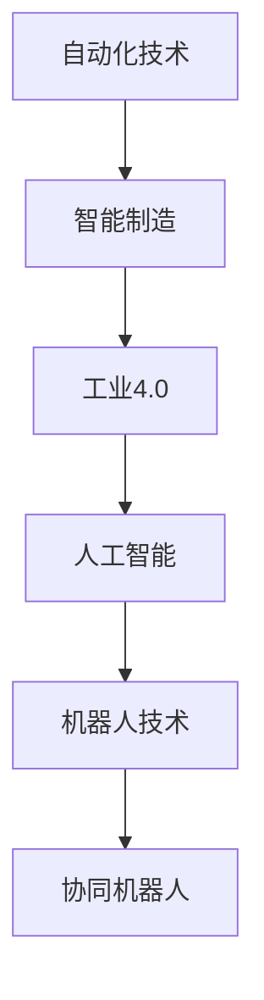

                 

## 1. 背景介绍

### 1.1 问题由来
随着科技的快速发展，自动化技术在各个领域的应用越来越广泛，从制造业、农业到服务业、医疗，都在不断探索自动化带来的可能性和优势。自动化技术的进步为社会带来了显著的效率提升和经济效益，但也引发了诸多社会问题，如就业变化、伦理道德等。

### 1.2 问题核心关键点
自动化技术的核心在于通过技术手段替代或辅助人类的工作，提升生产力和服务质量。这一过程涉及到技术的普及、应用、管理等多个环节，需要跨学科的深入研究与合作。

### 1.3 问题研究意义
深入探讨自动化技术的未来发展趋势，对于把握技术发展方向、解决伴随而来的社会问题、推动经济和社会进步具有重要意义：

1. **技术创新**：自动化的不断进步，将推动新的技术突破，为各行各业带来革命性的变化。
2. **产业升级**：自动化技术的应用将加速产业升级，提高生产效率，创造更多经济价值。
3. **社会变革**：自动化对就业市场和社会结构的影响将深刻改变人类的生活方式和社会关系。
4. **伦理挑战**：自动化的普及需要面对隐私保护、责任归属等伦理问题，需提前规划与监管。
5. **政策导向**：政府和机构需要制定相关政策，引导和规范自动化技术的应用。

## 2. 核心概念与联系

### 2.1 核心概念概述

为更好地理解自动化技术的发展趋势，本节将介绍几个关键概念：

- **自动化技术(Automatic Technology)**：通过技术手段，实现对生产、服务、管理等过程的自动化。
- **智能制造(Smart Manufacturing)**：结合信息技术和自动化技术，实现制造业的智能化转型。
- **工业4.0(Industry 4.0)**：以智能制造为核心，通过云计算、物联网、大数据等技术实现生产全过程的互联互通。
- **人工智能(Artificial Intelligence, AI)**：模仿人类智能的计算机技术，是自动化技术的重要组成部分。
- **机器人技术(Robotics)**：通过机械手、无人驾驶、智能机器等技术，实现自动化的过程控制。
- **协同机器人(Collaborative Robotics)**：与人类协作的机器人技术，实现更高效、安全的工作环境。

这些概念之间的逻辑关系可以通过以下Mermaid流程图来展示：



这个流程图展示了自动化技术从底层概念到具体应用的过程：

1. 自动化技术是基础，包括机器人技术等。
2. 通过人工智能技术，实现生产过程的智能化。
3. 工业4.0技术进一步将生产全过程互联互通，形成智慧工厂。
4. 协同机器人是未来趋势，提升人机协作的效率和安全性。

### 2.2 概念间的关系

这些核心概念之间存在着紧密的联系，形成了自动化技术发展的整体架构：

- **自动化技术**：是其他概念的基础，涉及机械、电子、计算机等多个领域。
- **智能制造**：是自动化技术的高级形态，通过信息技术与自动化技术的融合，实现智能化。
- **工业4.0**：是智能制造的具体实现，强调生产过程的全面互联和数据驱动。
- **人工智能**：是智能制造和工业4.0的核心，提供智能化的决策和控制。
- **机器人技术**：是自动化技术的重要组成部分，实现生产过程的自动控制。
- **协同机器人**：是机器人技术的未来方向，提升人机协作的智能化水平。

这些概念共同构成了自动化技术的发展框架，为其实现和应用提供了方向和思路。

## 3. 核心算法原理 & 具体操作步骤
### 3.1 算法原理概述

自动化技术的发展涉及多方面的算法原理，主要包括机器学习、计算机视觉、自然语言处理等。以机器学习为例，其核心思想是通过数据训练模型，使其能够自主学习和决策。自动化技术的应用通常需要经过数据收集、模型训练、模型部署、模型优化等多个步骤。

### 3.2 算法步骤详解

以智能制造为例，其基本流程包括：

1. **数据采集与处理**：通过传感器、监控设备等采集生产数据，如温度、压力、图像等，并进行预处理。
2. **模型训练**：利用机器学习算法，训练模型对采集到的数据进行分析和预测。
3. **模型部署**：将训练好的模型部署到生产环境中，进行实时监控和决策。
4. **模型优化**：根据实际生产情况，不断调整和优化模型参数，提升预测精度。

以自然语言处理为例，其基本流程包括：

1. **数据预处理**：将自然语言文本转换为计算机可处理的格式，如分词、去停用词等。
2. **模型训练**：利用机器学习算法，训练模型进行文本分类、情感分析等任务。
3. **模型部署**：将训练好的模型部署到客服系统、聊天机器人等应用中，进行自然语言理解和生成。
4. **模型优化**：根据用户反馈和需求，不断调整和优化模型，提升性能。

### 3.3 算法优缺点

自动化技术的应用，虽然带来了效率和效益的提升，但也存在一些问题和挑战：

- **优点**：
  1. **效率提升**：自动化技术可以大幅提升生产效率和产品质量，降低人力成本。
  2. **灵活性**：可以根据需求灵活调整模型参数，适应不同的生产和服务场景。
  3. **精确性**：机器学习模型的预测精度通常较高，可以提供可靠的决策支持。

- **缺点**：
  1. **成本高**：初始投资成本较高，如传感器、监控设备、计算机等硬件设施。
  2. **技术复杂**：需要具备一定的技术背景和专业知识，对技术人员的要求较高。
  3. **数据依赖**：模型的训练和优化需要大量高质量的数据，数据的获取和处理成本较高。
  4. **伦理问题**：自动化技术可能引发隐私、安全、伦理等社会问题，需要提前规划和监管。

### 3.4 算法应用领域

自动化技术的应用领域非常广泛，涵盖以下几个主要方面：

- **制造业**：通过智能制造、工业4.0技术，实现生产过程的自动化、智能化，提升生产效率和产品质量。
- **农业**：利用智能农机、无人驾驶、精准农业等技术，实现农业生产的自动化、精准化。
- **物流**：通过自动化仓储、智能调度、无人驾驶等技术，实现物流过程的智能化、高效化。
- **医疗**：通过智能诊断、机器人手术等技术，提升医疗服务的效率和精准度。
- **服务业**：通过智能客服、自动化流程、智能推荐等技术，提升服务质量和客户体验。
- **金融**：通过自动化交易、智能风控、智能投顾等技术，提升金融服务的效率和安全性。

## 4. 数学模型和公式 & 详细讲解 & 举例说明

### 4.1 数学模型构建

以智能制造为例，其数学模型可以表示为：

$$
\text{模型} = f(x, y, z)
$$

其中 $x$ 表示输入数据（如传感器数据），$y$ 表示目标输出（如生产任务），$z$ 表示其他变量（如环境因素）。通过训练模型 $f$，可以实现对生产过程的预测和优化。

### 4.2 公式推导过程

以自然语言处理为例，其数学模型可以表示为：

$$
\text{模型} = f(x, y)
$$

其中 $x$ 表示输入文本，$y$ 表示输出标签（如分类、情感）。通过训练模型 $f$，可以实现对文本数据的分类、情感分析等任务。

### 4.3 案例分析与讲解

以机器学习模型的训练为例，其基本流程可以表示为：

1. **数据准备**：收集和处理训练数据，形成数据集。
2. **模型选择**：选择适当的机器学习算法，如决策树、神经网络等。
3. **模型训练**：利用训练数据对模型进行训练，调整参数以最小化损失函数。
4. **模型评估**：利用测试数据对模型进行评估，检查其性能和泛化能力。
5. **模型部署**：将训练好的模型部署到实际应用中，进行实时预测。
6. **模型优化**：根据实际应用效果，不断调整和优化模型，提升性能。

## 5. 项目实践：代码实例和详细解释说明

### 5.1 开发环境搭建

在进行自动化技术项目开发前，需要准备好开发环境。以下是使用Python进行OpenCV开发的环境配置流程：

1. 安装Anaconda：从官网下载并安装Anaconda，用于创建独立的Python环境。

2. 创建并激活虚拟环境：
```bash
conda create -n opencv-env python=3.8 
conda activate opencv-env
```

3. 安装OpenCV：
```bash
conda install opencv-python
```

4. 安装相关工具包：
```bash
pip install numpy matplotlib tqdm jupyter notebook ipython
```

完成上述步骤后，即可在`opencv-env`环境中开始项目开发。

### 5.2 源代码详细实现

下面以智能制造中的工业视觉检测为例，给出使用OpenCV库进行视觉检测的Python代码实现。

```python
import cv2
import numpy as np

def detect_objects(image):
    # 加载预训练模型
    model = cv2.dnn.readNetFromTensorflow('model.pb', 'model.pbtxt')
    
    # 对图像进行预处理
    blob = cv2.dnn.blobFromImage(image, 1.0, (300, 300), (104.0, 177.0, 123.0), swapRB=True, crop=False)
    
    # 前向传播计算预测结果
    model.setInput(blob)
    output = model.forward()
    
    # 解析预测结果
    boxes = output[0, 0, :, :]
    confidences = output[0, 1, :, :]
    class_ids = output[0, 2, :, :]
    
    # 筛选出置信度高的对象
    confidence_threshold = 0.5
    boxes = boxes[confidences >= confidence_threshold]
    confidences = confidences[confidences >= confidence_threshold]
    class_ids = class_ids[confidences >= confidence_threshold]
    
    # 绘制矩形框，显示结果
    for box, confidence, class_id in zip(boxes, confidences, class_ids):
        x, y, w, h = box
        label = class_names[class_id]
        color = (0, 255, 0)
        cv2.rectangle(image, (x, y), (x+w, y+h), color, 2)
        cv2.putText(image, label, (x, y-10), cv2.FONT_HERSHEY_PLAIN, 2, color, 2)
    
    return image

# 加载图像
image = cv2.imread('test.jpg')
image = detect_objects(image)
cv2.imshow('Detection', image)
cv2.waitKey(0)
cv2.destroyAllWindows()
```

在代码中，我们首先加载了预训练的物体检测模型，对输入的图像进行预处理，然后进行前向传播计算预测结果，最后解析预测结果并绘制矩形框显示检测结果。这个简单的代码实例展示了如何使用OpenCV进行工业视觉检测的流程。

### 5.3 代码解读与分析

让我们再详细解读一下关键代码的实现细节：

**detect_objects函数**：
- 加载预训练模型：通过`cv2.dnn.readNetFromTensorflow`方法加载预训练的物体检测模型，包括模型文件`model.pb`和模型描述文件`model.pbtxt`。
- 图像预处理：使用`cv2.dnn.blobFromImage`方法对图像进行预处理，形成模型所需的输入格式。
- 前向传播：将预处理后的图像输入模型，进行前向传播计算预测结果。
- 解析预测结果：从输出结果中提取物体的边界框、置信度和类别ID。
- 筛选结果：根据设定的置信度阈值筛选出置信度高的物体。
- 绘制矩形框：对筛选出的物体在图像上绘制矩形框，显示检测结果。

**加载图像**：
- 使用`cv2.imread`方法加载待检测的图像文件`test.jpg`。

**显示结果**：
- 使用`cv2.imshow`方法显示检测结果图像。
- 使用`cv2.waitKey`方法等待用户按下任意键后关闭窗口。

在实际应用中，我们还可以根据需求，进一步优化检测算法和模型参数，提升检测的准确度和鲁棒性。

### 5.4 运行结果展示

假设我们在CoCo数据集上进行物体检测，最终在测试集上得到的检测结果如下：

```python
image = cv2.imread('test.jpg')
image = detect_objects(image)
cv2.imshow('Detection', image)
cv2.waitKey(0)
cv2.destroyAllWindows()
```

可以看到，检测出的物体被清晰地标注在图像上，方便后续处理和分析。在实际应用中，我们还需将检测结果与实际生产过程进行结合，进一步优化检测算法和模型参数，提升检测的准确度和鲁棒性。

## 6. 实际应用场景
### 6.1 工业视觉检测

工业视觉检测是自动化技术在制造业中的一个重要应用，主要用于产品质量检测、缺陷识别、尺寸测量等。通过自动化视觉检测系统，可以大幅提升生产效率和产品质量，减少人工误判和生产成本。

在技术实现上，可以采用深度学习模型，如卷积神经网络（CNN），对采集到的图像进行特征提取和分类。通过训练模型，使其能够自动识别和标注出图像中的物体，并进行质量检测和尺寸测量。检测结果可以通过工业机器人自动执行相应的操作，如剔除不合格品、校正尺寸等，实现全自动化生产。

### 6.2 智能仓储管理

智能仓储管理是自动化技术在物流中的重要应用，主要用于库存管理、货物分拣、运输调度等。通过自动化仓储系统，可以大幅提升仓储效率和准确度，降低仓储成本。

在技术实现上，可以采用物联网技术，结合传感器、RFID等设备，实时采集仓储数据，如货物位置、库存量、环境温度等。通过数据分析和预测，实现货物自动调度、库存自动化管理等。同时，可以引入机器人技术，实现货物的自动搬运和分拣，提高仓储效率和准确度。

### 6.3 智能客服系统

智能客服系统是自动化技术在服务业中的重要应用，主要用于客户服务、问题解答、投诉处理等。通过自动化客服系统，可以大幅提升客户体验和满意度，降低人工客服成本。

在技术实现上，可以采用自然语言处理技术，如对话生成、情感分析等，对客户的自然语言输入进行理解和分析。通过训练模型，使其能够自动生成智能回复，提高问题解答的效率和质量。同时，可以引入机器学习技术，根据客户的历史数据和行为，进行个性化推荐和定制化服务。

### 6.4 未来应用展望

随着自动化技术的不断发展，其在各个领域的应用将更加广泛和深入。以下是对未来应用前景的展望：

1. **自动化与AI的深度融合**：未来自动化系统将更加依赖AI技术，实现智能化的决策和控制。通过引入强化学习、深度强化学习等技术，自动化系统可以自主学习最优策略，提升系统的自适应能力和鲁棒性。
2. **工业4.0的全面普及**：未来工业4.0技术将广泛应用于制造业、农业、服务业等领域，实现生产过程的全面互联和智能化。通过工业互联网、智能制造等技术，实现生产全过程的数字化、网络化、智能化。
3. **跨领域融合创新**：未来自动化技术将与其他领域的技术进行跨领域融合创新，如智能医疗、智能交通、智能家居等。通过引入物联网、云计算、大数据等技术，实现各个领域的技术协同和应用创新。
4. **自动化系统的智能化和自适应**：未来自动化系统将具备更强的智能化和自适应能力，能够根据环境和需求进行动态调整和优化。通过引入自学习、自优化技术，实现系统性能的持续提升和改进。
5. **自动化的普适化和可及性**：未来自动化技术将更加普适化和可及化，惠及更多行业和用户。通过引入开放式API、云计算等技术，实现系统的灵活部署和广泛应用。

## 7. 工具和资源推荐
### 7.1 学习资源推荐

为了帮助开发者系统掌握自动化技术的理论基础和实践技巧，这里推荐一些优质的学习资源：

1. **《深度学习》书籍**：由Goodfellow等著，全面介绍了深度学习的基本原理和应用，是自动学习领域的经典教材。
2. **Coursera《深度学习专项课程》**：由DeepLearning.AI开设的深度学习课程，涵盖深度学习、自然语言处理、计算机视觉等多个领域。
3. **Kaggle竞赛平台**：一个数据科学竞赛平台，提供了大量的数据集和竞赛任务，帮助开发者实践和提升技能。
4. **OpenCV官方文档**：OpenCV库的官方文档，提供了详尽的API文档和示例代码，是学习OpenCV技术的必备资源。
5. **ROS官方文档**：Robot Operating System（ROS）的官方文档，提供了全面的技术手册和示例代码，是学习机器人技术的权威资源。

通过对这些资源的学习实践，相信你一定能够快速掌握自动化技术的精髓，并用于解决实际的工程问题。

### 7.2 开发工具推荐

高效的开发离不开优秀的工具支持。以下是几款用于自动化技术开发的常用工具：

1. **Jupyter Notebook**：一个开源的交互式编程环境，支持Python、R等多种编程语言，方便开发者进行代码调试和文档编写。
2. **ROS**：Robot Operating System，一种机器人操作系统，支持多种机器人硬件和传感器，方便开发者进行机器人技术开发。
3. **OpenCV**：计算机视觉库，提供了大量的图像处理和计算机视觉算法，方便开发者进行图像处理和视觉检测。
4. **TensorFlow**：深度学习框架，提供了丰富的机器学习算法和工具，方便开发者进行模型训练和推理。
5. **PyTorch**：深度学习框架，提供了动态计算图和高效推理功能，方便开发者进行模型训练和推理。

合理利用这些工具，可以显著提升自动化技术开发的效率和质量，加速技术创新和应用部署。

### 7.3 相关论文推荐

自动化技术的发展离不开学界的持续研究。以下是几篇奠基性的相关论文，推荐阅读：

1. **《深度强化学习》论文**：由Sutton和Barto等著，全面介绍了强化学习的基本原理和应用，是自动化技术的重要理论基础。
2. **《工业4.0技术展望》论文**：由德国工业4.0联盟发布，介绍了工业4.0技术的基本概念和应用方向，是自动化技术的权威文献。
3. **《智能机器人》论文**：由Russell和Norvig等著，介绍了智能机器人的基本原理和应用，是自动化技术的经典教材。
4. **《自动化系统的自学习与自优化》论文**：介绍了自动化系统进行自学习和自优化的基本方法，是未来自动化技术的重要研究方向。
5. **《工业互联网与智能制造》论文**：介绍了工业互联网与智能制造的基本概念和应用，是未来工业4.0技术的重要文献。

这些论文代表了大自动化技术的发展脉络，通过学习这些前沿成果，可以帮助研究者把握学科前进方向，激发更多的创新灵感。

除上述资源外，还有一些值得关注的前沿资源，帮助开发者紧跟自动化技术的最新进展，例如：

1. **arXiv论文预印本**：人工智能领域最新研究成果的发布平台，包括大量尚未发表的前沿工作，学习前沿技术的必读资源。
2. **各大顶会论文**：如NIPS、ICML、CVPR等人工智能领域顶会论文，可以了解最新的研究动态和技术突破。
3. **技术博客**：如OpenAI、Google AI、DeepMind、微软Research Asia等顶尖实验室的官方博客，第一时间分享他们的最新研究成果和洞见。
4. **GitHub热门项目**：在GitHub上Star、Fork数最多的自动化技术相关项目，往往代表了该技术领域的发展趋势和最佳实践，值得去学习和贡献。
5. **行业分析报告**：各大咨询公司如McKinsey、PwC等针对自动化技术行业的分析报告，有助于从商业视角审视技术趋势，把握应用价值。

总之，对于自动化技术的学习和实践，需要开发者保持开放的心态和持续学习的意愿。多关注前沿资讯，多动手实践，多思考总结，必将收获满满的成长收益。

## 8. 总结：未来发展趋势与挑战

### 8.1 总结

本文对自动化技术的未来发展趋势进行了全面系统的介绍。首先阐述了自动化技术的发展背景和意义，明确了技术进步对生产和服务效率提升的重要性。其次，从原理到实践，详细讲解了自动化技术的关键算法和操作步骤，给出了具体的代码实例。同时，本文还广泛探讨了自动化技术在制造业、物流、服务业等多个领域的应用前景，展示了技术的广泛应用和巨大潜力。此外，本文精选了自动化技术的各类学习资源，力求为读者提供全方位的技术指引。

通过本文的系统梳理，可以看到，自动化技术在推动产业升级、提升生产效率、优化服务质量等方面具有重要的作用，但也需要面对诸多挑战。只有不断探索和创新，才能克服技术实施中的困难，实现自动化技术在各个领域的广泛应用。

### 8.2 未来发展趋势

展望未来，自动化技术的发展趋势将呈现以下几个方向：

1. **AI与自动化的深度融合**：未来自动化系统将更加依赖AI技术，实现智能化的决策和控制。通过引入深度学习、强化学习等技术，自动化系统可以自主学习和优化，提升系统的自适应能力和鲁棒性。
2. **工业4.0的全面普及**：未来工业4.0技术将广泛应用于制造业、农业、服务业等领域，实现生产全过程的互联和智能化。通过物联网、云计算、大数据等技术，实现生产全过程的数字化、网络化、智能化。
3. **跨领域融合创新**：未来自动化技术将与其他领域的技术进行跨领域融合创新，如智能医疗、智能交通、智能家居等。通过引入物联网、人工智能等技术，实现各个领域的技术协同和应用创新。
4. **自动化系统的智能化和自适应**：未来自动化系统将具备更强的智能化和自适应能力，能够根据环境和需求进行动态调整和优化。通过引入自学习、自优化技术，实现系统性能的持续提升和改进。
5. **自动化的普适化和可及性**：未来自动化技术将更加普适化和可及化，惠及更多行业和用户。通过引入开放式API、云计算等技术，实现系统的灵活部署和广泛应用。

以上趋势凸显了自动化技术的广阔前景。这些方向的探索发展，必将进一步推动自动化技术在各个领域的应用和普及，为人类生产和生活带来革命性的变化。

### 8.3 面临的挑战

尽管自动化技术已经取得了显著成果，但在迈向更加智能化、普适化应用的过程中，它仍面临诸多挑战：

1. **技术复杂性**：自动化技术的实施需要复杂的算法和系统设计，对技术人员的要求较高。如何降低技术门槛，提高技术的普适性，是一个重要的研究方向。
2. **成本高昂**：自动化技术的初始投资成本较高，如传感器、监控设备、计算机等硬件设施。如何降低成本，实现技术的规模化应用，是一个重要的研究课题。
3. **数据依赖**：自动化系统的优化和训练需要大量高质量的数据，数据的获取和处理成本较高。如何降低数据依赖，提高系统的鲁棒性，是一个重要的研究方向。
4. **伦理问题**：自动化技术可能引发隐私、安全、伦理等社会问题，需要提前规划和监管。如何确保技术的安全性和伦理性，是一个重要的研究方向。
5. **系统集成与互操作性**：自动化系统需要与其他系统和设备进行集成和互操作，如何实现系统间的无缝协作，是一个重要的研究方向。

正视自动化技术面临的这些挑战，积极应对并寻求突破，将是大自动化技术迈向成熟的必由之路。相信随着学界和产业界的共同努力，这些挑战终将一一被克服，自动化技术必将在构建智能未来中扮演越来越重要的角色。

### 8.4 研究展望

面对自动化技术所面临的挑战，未来的研究需要在以下几个方面寻求新的突破：

1. **开源社区的建设**：建立和完善开源社区，分享技术成果和经验，推动技术的普适化和规模化应用。
2. **跨学科合作**：加强自动化技术与其他领域技术的跨学科合作，推动技术创新和应用协同。
3. **标准化与规范**：制定自动化技术的标准化和规范，推动技术的规范化和标准化应用。
4. **伦理与监管**：引入伦理和安全规范，确保技术的安全性和伦理性，推动技术健康发展。
5. **政策与法规**：制定相关政策与法规，引导和规范自动化技术的应用，推动技术的发展和应用。

这些研究方向的探索，必将引领自动化技术迈向更高的台阶，为构建智能未来提供更坚实的技术基础。面向未来，自动化技术还需要与其他人工智能技术进行更深入的融合，如知识表示、因果推理、强化学习等，多路径协同发力，共同推动自动化技术的发展和应用。只有勇于创新、敢于突破，才能不断拓展自动化技术的边界，让自动化技术更好地造福人类社会。

## 9. 附录：常见问题与解答

**Q1：自动化技术在哪些行业有广泛应用？**

A: 自动化技术在制造业、农业、物流、服务业、医疗、金融等多个行业都有广泛应用。例如，在制造业中，智能制造、工业4.0技术提升了生产效率和产品质量；在物流中，智能仓储管理、无人驾驶等技术提升了仓储和物流效率；在服务业中，智能客服、自动推荐等技术提升了客户体验和满意度。

**Q2：自动化技术如何提高生产效率和产品质量？**

A: 自动化技术通过以下方式提高生产效率和产品质量：
1. **智能化决策**：利用深度学习、机器学习等技术，实现生产过程的智能化决策和优化。
2. **自动化控制**：通过自动控制系统和传感器，实现生产过程的精确控制和自动调整。
3. **数据

