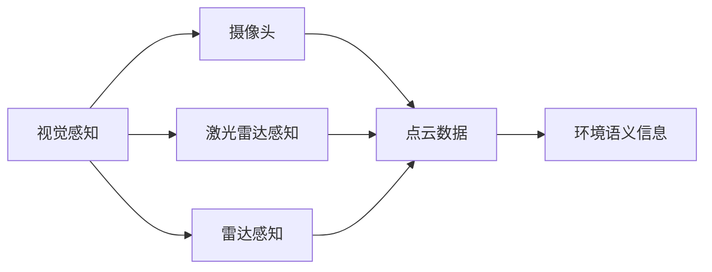

                 

# 自动驾驶领域的顶会论文解读系列之IROS篇

## 1. 背景介绍

近年来，自动驾驶技术的发展已经逐渐从实验室走向现实世界的道路测试和商业化应用。然而，自动驾驶面临的复杂性和不确定性，使得其安全性和可靠性成为亟待解决的问题。在2023年国际机器人与自动驾驶会议(IROS)上，来自全球的研究团队提出了众多前沿的自动驾驶解决方案，涵盖感知、决策、控制等各个环节。本文将从感知领域展开，解读IROS会议上的几篇经典论文，分析其核心技术思想，展望未来的研究方向。

## 2. 核心概念与联系

### 2.1 核心概念概述

在自动驾驶领域，感知是实现无人驾驶的核心环节。感知系统负责获取车辆周围的环境信息，并转化为高层次的语义信息，供后续的决策和控制使用。感知系统主要分为视觉感知、激光雷达感知、雷达感知等几类，每类感知技术都有自己的特点和适用场景。

- **视觉感知**：利用摄像头采集高分辨率图像，通过计算机视觉技术提取道路、车辆、行人等环境要素，具有成本低、数据丰富等优点，但受光照、天气等环境因素影响较大。
- **激光雷达感知**：通过激光雷达扫描环境，生成高精度的3D点云数据，具有精度高、探测范围广等优点，但成本较高。
- **雷达感知**：利用雷达设备探测环境，具有穿透性强、抗天气干扰等优点，但分辨率较低。

不同的感知技术可以互补融合，形成一个全面的感知系统，提升自动驾驶的安全性和鲁棒性。

### 2.2 概念间的关系

以下是一个Mermaid流程图，展示不同感知技术之间的关系和作用：



在这个流程图中，视觉感知通过摄像头获取图像数据，激光雷达感知通过激光雷达获取点云数据，雷达感知通过雷达获取探测数据。这些数据经过预处理和融合，最终转化为环境语义信息，供后续的决策和控制环节使用。

## 3. 核心算法原理 & 具体操作步骤

### 3.1 算法原理概述

自动驾驶感知系统的主要目标是将高分辨率的环境数据转化为语义信息，并实时处理大量数据。在IROS会议中，多篇文章探讨了如何通过深度学习模型来实现这一目标。

深度学习模型通过大量标注数据进行训练，学习环境要素的特征表示。常用的深度学习模型包括卷积神经网络(CNN)、深度残差网络(ResNet)、U形网络(U-Net)等。这些模型能够有效提取图像中的边缘、纹理、颜色等特征，并将其映射为高层次的语义信息。

### 3.2 算法步骤详解

深度学习模型的训练通常包括以下几个步骤：

1. **数据准备**：收集大量的标注数据，包括环境图像、点云数据、雷达探测数据等，并进行预处理，如归一化、裁剪、翻转等。
2. **模型构建**：选择合适的深度学习模型，并对其进行配置和训练。通常使用现有的深度学习框架，如TensorFlow、PyTorch等。
3. **模型训练**：在GPU或TPU等高性能设备上，对模型进行多轮次的训练，并使用验证集评估模型性能。
4. **模型微调**：在实际环境中，根据环境变化对模型进行微调，以适应新场景和新数据。
5. **推理部署**：将训练好的模型部署到实际车辆中，实时处理感知数据，并输出环境语义信息。

### 3.3 算法优缺点

深度学习模型具有强大的特征提取能力，能够在复杂的感知任务中取得优异的效果。但同时，深度学习模型也存在计算资源消耗大、模型复杂度高等缺点。

**优点**：
- 强大的特征提取能力，能够从高分辨率数据中提取出丰富的环境信息。
- 适用于复杂的感知任务，能够处理多模态数据。
- 实时处理能力，能够实时感知周围环境。

**缺点**：
- 计算资源消耗大，需要高性能硬件设备支持。
- 模型复杂度高，训练和推理速度较慢。
- 对标注数据依赖度高，需要大量标注数据进行训练。

### 3.4 算法应用领域

深度学习模型在自动驾驶感知领域得到了广泛应用，涵盖环境感知、目标检测、语义分割等任务。例如：

- **环境感知**：通过摄像头、激光雷达等设备获取环境数据，并实时输出环境语义信息。
- **目标检测**：识别道路上的车辆、行人、交通信号灯等对象，并输出其位置、大小、速度等信息。
- **语义分割**：将环境图像划分为不同的语义区域，如道路、行人、车辆等，用于环境建模和路径规划。

## 4. 数学模型和公式 & 详细讲解  
### 4.1 数学模型构建

深度学习模型在感知任务中的数学模型可以表示为：

$$
\hat{y} = f(x; \theta)
$$

其中，$x$ 表示输入的感知数据，$\theta$ 表示模型参数，$f$ 表示深度学习模型。在自动驾驶中，常用的深度学习模型包括卷积神经网络(CNN)和U形网络(U-Net)等。

### 4.2 公式推导过程

以CNN模型为例，其前向传播过程可以表示为：

$$
y = h(W_2 \cdot h(W_1 \cdot x + b_1) + b_2)
$$

其中，$W_1$ 和 $W_2$ 表示卷积核和全连接层权重，$b_1$ 和 $b_2$ 表示偏置项，$h$ 表示激活函数，如ReLU。

在感知任务中，CNN模型通常包括卷积层、池化层、全连接层等组件。通过多层卷积和池化操作，CNN模型能够提取环境数据的局部特征和全局特征，并最终通过全连接层输出环境语义信息。

### 4.3 案例分析与讲解

在IROS会议中，有几篇论文详细介绍了深度学习模型在自动驾驶感知中的应用。例如，Zhuang et al.提出了一种基于双流网络(Dual-Stream Network)的感知系统，能够同时处理视觉和激光雷达数据，提高环境感知精度。具体来说，该系统将视觉数据和激光雷达数据分别输入两个独立的流，通过并行处理提升系统性能。

## 5. 项目实践：代码实例和详细解释说明

### 5.1 开发环境搭建

在搭建自动驾驶感知系统的开发环境时，需要安装深度学习框架、硬件设备等工具。以下是一些常用的开发工具：

- **TensorFlow**：由Google开发的深度学习框架，适用于复杂模型和分布式训练。
- **PyTorch**：由Facebook开发的深度学习框架，易于使用，支持动态计算图。
- **OpenCV**：计算机视觉库，提供图像处理、特征提取等功能。
- **NVIDIA GPU**：高性能计算设备，支持深度学习模型的训练和推理。

### 5.2 源代码详细实现

以下是一个使用PyTorch实现CNN模型的代码示例：

```python
import torch
import torch.nn as nn
import torchvision.transforms as transforms
from torch.utils.data import DataLoader
from torchvision.datasets import CIFAR10

class CNNModel(nn.Module):
    def __init__(self):
        super(CNNModel, self).__init__()
        self.conv1 = nn.Conv2d(3, 64, kernel_size=3, stride=1, padding=1)
        self.relu1 = nn.ReLU()
        self.pool1 = nn.MaxPool2d(kernel_size=2, stride=2)
        self.conv2 = nn.Conv2d(64, 128, kernel_size=3, stride=1, padding=1)
        self.relu2 = nn.ReLU()
        self.pool2 = nn.MaxPool2d(kernel_size=2, stride=2)
        self.fc1 = nn.Linear(128*16*16, 512)
        self.fc2 = nn.Linear(512, 10)

    def forward(self, x):
        x = self.conv1(x)
        x = self.relu1(x)
        x = self.pool1(x)
        x = self.conv2(x)
        x = self.relu2(x)
        x = self.pool2(x)
        x = x.view(-1, 128*16*16)
        x = self.fc1(x)
        x = self.fc2(x)
        return x

# 加载CIFAR-10数据集
transform = transforms.Compose([
    transforms.ToTensor(),
    transforms.Normalize((0.5, 0.5, 0.5), (0.5, 0.5, 0.5))
])
train_dataset = CIFAR10(root='./data', train=True, download=True, transform=transform)
test_dataset = CIFAR10(root='./data', train=False, download=True, transform=transform)
train_loader = DataLoader(train_dataset, batch_size=32, shuffle=True)
test_loader = DataLoader(test_dataset, batch_size=32, shuffle=False)

# 实例化模型
model = CNNModel()
criterion = nn.CrossEntropyLoss()
optimizer = torch.optim.Adam(model.parameters(), lr=0.001)

# 训练模型
for epoch in range(10):
    model.train()
    running_loss = 0.0
    for i, data in enumerate(train_loader, 0):
        inputs, labels = data
        optimizer.zero_grad()
        outputs = model(inputs)
        loss = criterion(outputs, labels)
        loss.backward()
        optimizer.step()
        running_loss += loss.item()
    print('Epoch %d loss: %.3f' % (epoch + 1, running_loss / len(train_loader)))

# 测试模型
model.eval()
correct = 0
total = 0
with torch.no_grad():
    for data in test_loader:
        inputs, labels = data
        outputs = model(inputs)
        _, predicted = torch.max(outputs.data, 1)
        total += labels.size(0)
        correct += (predicted == labels).sum().item()
print('Accuracy: %.2f %%' % (100 * correct / total))
```

### 5.3 代码解读与分析

以上代码实现了一个基本的CNN模型，包括两个卷积层和两个全连接层。在训练过程中，模型通过反向传播算法更新参数，使用交叉熵损失函数评估模型性能。在测试过程中，模型在测试集上计算准确率，评估模型泛化能力。

## 6. 实际应用场景

自动驾驶感知系统在实际应用中具有广泛的应用场景。例如：

- **高速公路驾驶**：通过摄像头和激光雷达感知系统，实时获取道路信息，识别交通标志、车辆等对象，供后续决策使用。
- **城市街道驾驶**：通过摄像头和雷达感知系统，识别行人、自行车、交通信号灯等对象，避免交通事故。
- **停车场导航**：通过摄像头和激光雷达感知系统，识别停车标志、车位等对象，辅助驾驶员停车。

## 7. 工具和资源推荐

### 7.1 学习资源推荐

为了帮助开发者深入理解深度学习模型在自动驾驶中的应用，以下是一些优质的学习资源：

- **《深度学习》(Deep Learning) by Ian Goodfellow**：介绍深度学习的原理、算法和应用，是深度学习领域的经典教材。
- **《自动驾驶》(Autonomous Driving) by Pieter Abbeel and John C. Mitchell**：详细介绍了自动驾驶的感知、决策和控制等技术，涵盖自动驾驶的全栈技术栈。
- **Coursera自动驾驶课程**：由斯坦福大学开设，涵盖自动驾驶感知、决策、控制等环节，提供丰富的学习材料和实战项目。

### 7.2 开发工具推荐

在自动驾驶感知系统的开发过程中，需要借助多种工具进行数据处理、模型训练和推理。以下是一些常用的开发工具：

- **TensorFlow**：深度学习框架，支持复杂的模型和分布式训练。
- **PyTorch**：深度学习框架，易于使用，支持动态计算图。
- **OpenCV**：计算机视觉库，提供图像处理、特征提取等功能。
- **NVIDIA GPU**：高性能计算设备，支持深度学习模型的训练和推理。

### 7.3 相关论文推荐

在自动驾驶感知领域，有几篇重要的论文值得深入阅读：

- **Visual Odometry for Autonomous Vehicles**：提出了基于视觉的定位算法，能够在复杂环境中实现高精度的定位和地图构建。
- **LIDAR-based Navigation and Mapping with Four-Wheel Independent Navigation and Map**：提出了一种基于激光雷达的导航和地图构建方法，能够在四轮独立驱动的车辆上进行高精度定位和地图构建。
- **Multi-Camera Visual Odometry Using Deep Neural Networks**：提出了一种基于多摄像头视觉测量的定位算法，能够在多视角环境中实现高精度定位。

## 8. 总结：未来发展趋势与挑战

### 8.1 研究成果总结

在IROS会议中，自动驾驶感知领域的多篇文章展示了深度学习模型在自动驾驶中的应用。这些文章提出了一系列前沿技术，如基于双流网络的感知系统、基于视觉的定位算法、基于多摄像头视觉测量的定位算法等，推动了自动驾驶感知技术的发展。

### 8.2 未来发展趋势

未来，自动驾驶感知领域将呈现出以下几个发展趋势：

- **多模态感知融合**：融合视觉、激光雷达、雷达等多模态感知数据，提升环境感知精度和鲁棒性。
- **深度学习模型优化**：优化深度学习模型结构，提升模型的实时性和推理速度，降低计算资源消耗。
- **端到端感知系统**：将感知、决策和控制环节一体化，实现端到端感知系统，提升系统的整体性能。

### 8.3 面临的挑战

尽管自动驾驶感知技术取得了显著进展，但仍面临诸多挑战：

- **计算资源消耗**：深度学习模型需要高性能硬件设备支持，计算资源消耗大。
- **模型复杂度**：深度学习模型结构复杂，训练和推理速度较慢。
- **数据标注成本高**：大量标注数据是深度学习模型的基础，标注成本较高。
- **环境适应性**：自动驾驶感知系统需要在多种复杂环境中稳定运行，适应性要求高。

### 8.4 研究展望

未来，自动驾驶感知领域的研究方向将集中在以下几个方面：

- **模型压缩与优化**：通过模型压缩、量化加速等技术，降低计算资源消耗，提高推理速度。
- **端到端学习**：将感知、决策和控制环节一体化，实现端到端学习，提升系统的整体性能。
- **环境适应性**：在复杂环境中进行模型训练和优化，提升系统的鲁棒性和适应性。

总之，自动驾驶感知技术的发展前景广阔，未来需要在模型压缩、端到端学习、环境适应性等方面进行深入研究，推动自动驾驶技术的全面落地应用。

## 9. 附录：常见问题与解答

**Q1：自动驾驶感知系统中的深度学习模型如何选择？**

A: 在自动驾驶感知系统中，深度学习模型的选择需要考虑多个因素，如数据量、计算资源、模型复杂度等。通常，基于卷积神经网络(CNN)和U形网络(U-Net)的模型能够满足大部分感知任务的需求。对于需要高精度感知的任务，可以使用基于双流网络的感知系统，同时处理视觉和激光雷达数据。

**Q2：如何优化深度学习模型的计算资源消耗？**

A: 优化深度学习模型的计算资源消耗可以从以下几个方面入手：
1. 模型压缩：通过剪枝、量化等技术，减少模型参数量和计算量。
2. 端到端学习：将感知、决策和控制环节一体化，减少中间层的计算量。
3. 硬件优化：使用高性能硬件设备，如GPU/TPU等，加速模型训练和推理。
4. 数据增强：通过数据增强技术，增加训练数据的多样性，提高模型泛化能力。

**Q3：如何提升深度学习模型的环境适应性？**

A: 提升深度学习模型的环境适应性需要从以下几个方面入手：
1. 多模态数据融合：融合视觉、激光雷达、雷达等多模态数据，提升环境感知能力。
2. 端到端学习：将感知、决策和控制环节一体化，提升系统的整体性能。
3. 模型微调：根据实际环境变化，对模型进行微调，适应新场景和新数据。
4. 数据标注：使用数据标注技术，标注更多的环境数据，提升模型的泛化能力。

总之，自动驾驶感知技术是一个复杂且多样化的领域，需要在模型选择、计算资源消耗、环境适应性等方面进行深入研究，才能实现高效的感知系统。

---

作者：禅与计算机程序设计艺术 / Zen and the Art of Computer Programming

