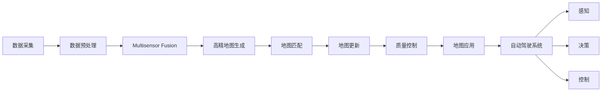

                 

# 自动驾驶高精地图生产应用全流程与技术架构解析

> 关键词：自动驾驶, 高精地图, 全流程, 技术架构

## 1. 背景介绍

### 1.1 问题由来
自动驾驶技术在近年来取得了显著进展，但依然面临诸多技术挑战。其中，高精地图的生产与应用是自动驾驶系统不可或缺的基础设施。高精地图不仅包含详细的道路、交通标志、建筑物等信息，还涵盖了道路拓扑关系、实时交通数据等，是自动驾驶系统进行定位、导航和避障等任务的重要参考。然而，高精地图的生产涉及多源数据融合、精度控制、实时更新等多个环节，技术复杂度高，成本投入大。

### 1.2 问题核心关键点
高精地图的生产与应用，主要集中在以下几个关键点：

1. **多源数据融合**：将来自卫星、激光雷达、摄像头等多种传感器获取的数据进行融合，形成精确、全面的地图信息。
2. **高精度定位**：在地图上定位车辆和行人等目标，为自动驾驶提供实时的位置信息。
3. **实时更新**：地图数据需要定期更新，以应对道路变化和异常事件，确保地图的时效性。
4. **质量控制**：在地图的生产和更新过程中，需要严格的质量控制流程，保证数据的准确性和可靠性。

### 1.3 问题研究意义
研究自动驾驶高精地图的生产与应用，对于推动自动驾驶技术的商业化应用具有重要意义：

1. **提升安全性**：高精地图可以提供准确的定位和导航信息，显著降低自动驾驶的安全风险。
2. **优化性能**：高精地图可以帮助自动驾驶系统更好地规划路径，提高行驶效率和舒适性。
3. **降低成本**：高精地图的广泛应用，可以减少自动驾驶车辆对传感器等硬件的依赖，降低整体的开发和运营成本。
4. **加速产业化**：高精地图的标准化生产与应用，有助于自动驾驶技术的快速落地，加速产业化进程。
5. **推动创新**：高精地图的生产与应用，可以催生更多新技术和新应用，如智能交通管理、城市规划等。

## 2. 核心概念与联系

### 2.1 核心概念概述

为更好地理解自动驾驶高精地图生产应用的全流程，本节将介绍几个关键概念：

- **高精地图**：也称为高分辨率地图，是一种详细、准确、实时更新的地图数据，通常包含厘米级的位置信息和交通元素。
- **多源数据融合**：将来自不同传感器和数据源的数据进行整合，形成综合性的地图信息。
- **自动驾驶系统**：包括感知、决策、控制等模块，能够在没有人类干预的情况下，实现车辆的自主驾驶。
- **地图更新**：定期对地图数据进行更新，以反映道路和交通环境的变化。
- **地图匹配**：将车辆的位置信息与地图上的道路元素进行匹配，确保车辆在地图上的定位准确性。
- **质量控制**：在地图生产过程中，通过多重验证和校准，确保地图数据的准确性和完整性。

### 2.2 核心概念的联系

高精地图的生产与应用，涉及到自动驾驶系统的各个环节，形成一个复杂的生态系统。以下是几个关键概念之间的联系：

- **多源数据融合**是生成高精地图的基础。通过整合多种传感器数据，可以得到更全面、准确的地图信息。
- **高精度定位**依赖于高精地图的准确性。高精地图提供了详细的道路信息，帮助自动驾驶系统精确定位。
- **实时更新**保证地图的时效性。定期更新地图，可以反映道路的变化，确保地图数据的时效性。
- **地图匹配**是实现自动驾驶的基础。通过地图匹配，自动驾驶系统可以准确判断车辆位置，进行路径规划和避障。
- **质量控制**保障地图数据的可靠性。严格的质量控制流程，可以避免数据中的错误和噪声，提高地图的准确性。

这些概念之间相互关联，共同构成高精地图生产与应用的全流程。理解这些概念之间的联系，有助于全面掌握高精地图技术的核心内容。

### 2.3 核心概念的整体架构

为了更好地展示这些概念之间的联系，我们通过以下Mermaid流程图来展示高精地图生产与应用的全流程架构：



这个流程图展示了从数据采集到自动驾驶应用的高精地图生产全流程。首先，通过多种传感器获取道路数据，然后对这些数据进行预处理和融合，生成高精地图。高精地图通过地图匹配功能，与自动驾驶系统进行交互，完成定位和导航。最后，通过地图更新和质量控制，不断迭代和优化地图数据，确保其在自动驾驶中的可靠性。

## 3. 核心算法原理 & 具体操作步骤
### 3.1 算法原理概述

高精地图的生产与应用，涉及多源数据融合、高精度定位、地图匹配、实时更新等多个算法环节。下面分别介绍这些算法的基本原理。

#### 3.1.1 多源数据融合

多源数据融合是将来自不同传感器和数据源的信息进行整合，形成综合性的地图信息。主要算法包括：

- **传感器融合算法**：如Kalman滤波、粒子滤波等，通过融合多种传感器的测量数据，减少数据中的噪声和不确定性。
- **数据校正算法**：如RANSAC、SIFT等，通过校正传感器数据，提高定位精度。
- **数据插补算法**：如多项式插值、样条插值等，填补传感器数据中的空缺，形成完整的地图信息。

#### 3.1.2 高精度定位

高精度定位是在地图上定位车辆和行人等目标，确保自动驾驶系统的实时位置信息。主要算法包括：

- **GPS定位**：通过GPS信号获取车辆的位置信息。
- **IMU定位**：通过惯性测量单元获取车辆的运动状态。
- **激光雷达定位**：通过激光雷达获取环境的三维结构信息，进行定位和导航。
- **视觉定位**：通过摄像头获取道路和交通标志等图像信息，进行定位和地图匹配。

#### 3.1.3 地图匹配

地图匹配是将车辆的位置信息与地图上的道路元素进行匹配，确保车辆在地图上的定位准确性。主要算法包括：

- **基于特征的匹配**：如SIFT、SURF等，通过提取道路特征点，进行匹配。
- **基于模型的匹配**：如SLAM、GN等，通过构建道路模型，进行匹配。
- **基于学习的方法**：如神经网络、支持向量机等，通过训练模型，进行匹配。

#### 3.1.4 地图更新

地图更新是定期对地图数据进行更新，以反映道路和交通环境的变化。主要算法包括：

- **实时更新**：通过实时数据采集和处理，更新地图数据。
- **周期更新**：定期进行大规模数据采集和处理，更新地图数据。
- **增量更新**：通过增量更新方式，只更新发生变化的部分，减少更新成本。

#### 3.1.5 质量控制

质量控制是在地图生产过程中，通过多重验证和校准，确保地图数据的准确性和完整性。主要算法包括：

- **数据验证**：通过统计分析和对比，验证数据的准确性。
- **数据校准**：通过人工和自动校准，修正数据中的错误和噪声。
- **数据融合**：通过多种方法融合，提高数据的准确性和可靠性。

### 3.2 算法步骤详解

以下是对高精地图生产与应用各个环节的具体算法步骤详解：

**Step 1: 数据采集**

- 使用卫星、激光雷达、摄像头等多种传感器，采集道路、交通标志、建筑物等信息。
- 通过GPS、IMU、激光雷达等设备，获取车辆的位置和运动状态信息。
- 对采集到的数据进行存储和管理，准备后续的融合和处理。

**Step 2: 数据预处理**

- 对采集到的数据进行去噪、校正和归一化处理，减少数据中的噪声和不确定性。
- 对数据进行插补和补全，填补传感器数据中的空缺，形成完整的地图信息。
- 对数据进行编码和标准化，确保数据格式的一致性。

**Step 3: 多源数据融合**

- 选择合适的传感器融合算法，对多种传感器的测量数据进行整合。
- 进行数据校正和校准，提高定位精度和数据准确性。
- 对融合后的数据进行插补和补全，形成完整的地图信息。

**Step 4: 高精度定位**

- 使用GPS、IMU、激光雷达、视觉等多种定位方式，获取车辆的位置信息。
- 对定位数据进行校正和融合，提高定位精度和数据可靠性。
- 将定位数据与高精地图进行匹配，确定车辆在地图上的位置。

**Step 5: 地图匹配**

- 选择适当的匹配算法，提取道路特征点或构建道路模型。
- 对特征点和模型进行匹配，确定车辆的位置和方向。
- 进行误差分析和校准，确保匹配的准确性和可靠性。

**Step 6: 地图更新**

- 通过实时数据采集和处理，进行实时更新。
- 定期进行大规模数据采集和处理，进行周期更新。
- 使用增量更新方式，只更新发生变化的部分，减少更新成本。

**Step 7: 质量控制**

- 进行数据验证和校准，确保数据的准确性和完整性。
- 对数据进行融合和综合，提高数据的可靠性和可用性。
- 通过多重验证和校准，确保数据的稳定性和一致性。

**Step 8: 地图应用**

- 将高精地图与自动驾驶系统进行集成，实现位置和导航功能。
- 通过地图匹配和定位，进行路径规划和避障。
- 对地图数据进行实时更新和维护，确保地图的时效性和准确性。

### 3.3 算法优缺点

高精地图生产与应用的多源数据融合、高精度定位、地图匹配、实时更新、质量控制等算法，各有其优缺点：

**多源数据融合**

- **优点**：可以综合多种传感器的测量数据，提高定位精度和数据可靠性。
- **缺点**：算法复杂度较高，计算量大，成本投入高。

**高精度定位**

- **优点**：定位精度高，能够实现厘米级的定位。
- **缺点**：对传感器设备要求高，成本较高。

**地图匹配**

- **优点**：能够实现精确的地图匹配，提高导航和避障的准确性。
- **缺点**：算法复杂，计算量大，对传感器数据的质量要求高。

**地图更新**

- **优点**：能够实时更新地图数据，反映道路和交通环境的变化。
- **缺点**：更新成本高，周期长。

**质量控制**

- **优点**：能够保证地图数据的准确性和可靠性，确保自动驾驶系统的安全性。
- **缺点**：需要大量人工干预，成本较高。

### 3.4 算法应用领域

高精地图的生产与应用，广泛应用于自动驾驶、智能交通、城市规划等多个领域：

- **自动驾驶**：高精地图是自动驾驶系统的核心基础设施，提供定位、导航和避障等功能。
- **智能交通**：通过高精地图，可以实现交通信号灯的智能控制、路况分析等功能。
- **城市规划**：高精地图提供了详细的城市信息，支持城市规划和建设。
- **物流配送**：高精地图支持智能物流系统的路径规划和调度，提高配送效率。

## 4. 数学模型和公式 & 详细讲解 & 举例说明
### 4.1 数学模型构建

高精地图的生产与应用涉及多个数学模型，用于描述不同环节的算法。以下是几个核心数学模型的构建：

- **多源数据融合模型**：用于描述不同传感器数据的融合过程，常见模型包括Kalman滤波模型、粒子滤波模型等。
- **高精度定位模型**：用于描述车辆在地图上的定位过程，常见模型包括GPS定位模型、IMU定位模型、激光雷达定位模型、视觉定位模型等。
- **地图匹配模型**：用于描述地图匹配算法，常见模型包括SIFT模型、SURF模型、SLAM模型、GN模型等。
- **地图更新模型**：用于描述地图数据的更新过程，常见模型包括实时更新模型、周期更新模型、增量更新模型等。
- **质量控制模型**：用于描述数据验证和校准的过程，常见模型包括统计模型、回归模型、神经网络模型等。

### 4.2 公式推导过程

以下以Kalman滤波模型为例，推导其基本公式和推导过程：

**Kalman滤波模型**

Kalman滤波是一种常用的传感器融合算法，用于估计系统状态的最小均方误差。其基本公式如下：

$$
\begin{aligned}
\hat{x}_{k|k-1} &= F_k \hat{x}_{k-1|k-1} \\
\hat{P}_{k|k-1} &= F_k P_{k-1|k-1} F_k^T + Q_k \\
K_k &= \hat{P}_{k|k-1} H_k^T (H_k \hat{P}_{k|k-1} H_k^T + R_k)^{-1} \\
\hat{x}_{k|k} &= \hat{x}_{k|k-1} + K_k (z_k - H_k \hat{x}_{k|k-1}) \\
\hat{P}_{k|k} &= (I - K_k H_k) \hat{P}_{k|k-1}
\end{aligned}
$$

其中，$\hat{x}_{k|k-1}$为系统状态估计值，$\hat{P}_{k|k-1}$为状态估计误差协方差，$F_k$为状态转移矩阵，$Q_k$为过程噪声协方差，$K_k$为卡尔曼增益，$z_k$为测量值，$H_k$为测量矩阵，$R_k$为测量噪声协方差。

Kalman滤波模型的推导过程如下：

1. **系统状态估计**：通过状态转移矩阵$F_k$，将上一时刻的状态估计值$\hat{x}_{k-1|k-1}$更新为当前时刻的状态估计值$\hat{x}_{k|k-1}$。
2. **状态估计误差协方差**：通过状态转移矩阵$F_k$和过程噪声协方差$Q_k$，计算当前时刻的状态估计误差协方差$\hat{P}_{k|k-1}$。
3. **卡尔曼增益**：通过状态估计误差协方差$\hat{P}_{k|k-1}$和测量矩阵$H_k$，计算卡尔曼增益$K_k$。
4. **状态估计更新**：通过卡尔曼增益$K_k$和测量值$z_k$，计算当前时刻的状态估计值$\hat{x}_{k|k}$。
5. **状态估计误差协方差更新**：通过卡尔曼增益$K_k$和状态估计误差协方差$\hat{P}_{k|k-1}$，计算当前时刻的状态估计误差协方差$\hat{P}_{k|k}$。

**公式推导示例**

以IMU定位为例，假设IMU的状态转移矩阵为$F_k$，测量矩阵为$H_k$，过程噪声协方差为$Q_k$，测量噪声协方差为$R_k$，测量值为$z_k$，系统状态估计值和状态估计误差协方差分别为$\hat{x}_{k|k-1}$和$\hat{P}_{k|k-1}$。根据Kalman滤波模型，计算当前时刻的状态估计值和状态估计误差协方差：

1. **系统状态估计**

$$
\hat{x}_{k|k-1} = F_k \hat{x}_{k-1|k-1}
$$

2. **状态估计误差协方差**

$$
\hat{P}_{k|k-1} = F_k P_{k-1|k-1} F_k^T + Q_k
$$

3. **卡尔曼增益**

$$
K_k = \hat{P}_{k|k-1} H_k^T (H_k \hat{P}_{k|k-1} H_k^T + R_k)^{-1}
$$

4. **状态估计更新**

$$
\hat{x}_{k|k} = \hat{x}_{k|k-1} + K_k (z_k - H_k \hat{x}_{k|k-1})
$$

5. **状态估计误差协方差更新**

$$
\hat{P}_{k|k} = (I - K_k H_k) \hat{P}_{k|k-1}
$$

### 4.3 案例分析与讲解

以下是高精地图生产与应用中几个核心算法的案例分析与讲解：

**多源数据融合**

假设我们有多组传感器数据，分别来自GPS、IMU和激光雷达，需要将其融合为高精地图。通过Kalman滤波算法，将三组数据进行融合，得到融合后的数据。

- **输入**：多组传感器数据，GPS、IMU、激光雷达等。
- **过程**：根据Kalman滤波模型，对传感器数据进行融合。
- **输出**：融合后的数据，用于高精地图生成。

**高精度定位**

假设我们在高精地图上定位车辆的位置，需要将GPS和IMU的数据进行融合。通过Kalman滤波算法，将GPS和IMU的数据进行融合，得到车辆的位置信息。

- **输入**：GPS数据、IMU数据。
- **过程**：根据Kalman滤波模型，对GPS和IMU的数据进行融合。
- **输出**：车辆的位置信息，用于地图匹配和导航。

**地图匹配**

假设我们需要将车辆的位置信息与高精地图进行匹配，选择SIFT算法进行匹配。通过SIFT算法，提取道路特征点，进行匹配，确定车辆的位置和方向。

- **输入**：车辆的位置信息、高精地图。
- **过程**：根据SIFT算法，提取道路特征点，进行匹配。
- **输出**：匹配结果，用于路径规划和避障。

**地图更新**

假设我们需要对高精地图进行实时更新，选择增量更新算法进行更新。通过增量更新算法，只更新发生变化的部分，减少更新成本。

- **输入**：高精地图、实时数据。
- **过程**：根据增量更新算法，只更新发生变化的部分。
- **输出**：更新后的高精地图，用于实时应用。

**质量控制**

假设我们需要对高精地图进行质量控制，选择数据验证和校准算法进行控制。通过数据验证和校准算法，验证和校准地图数据的准确性和完整性。

- **输入**：高精地图数据。
- **过程**：根据数据验证和校准算法，验证和校准地图数据。
- **输出**：质量控制后的高精地图，用于自动驾驶系统。

## 5. 项目实践：代码实例和详细解释说明
### 5.1 开发环境搭建

在进行高精地图项目实践前，我们需要准备好开发环境。以下是使用Python进行OpenCV开发的环境配置流程：

1. 安装Anaconda：从官网下载并安装Anaconda，用于创建独立的Python环境。

2. 创建并激活虚拟环境：
```bash
conda create -n opencv-env python=3.8 
conda activate opencv-env
```

3. 安装OpenCV：根据CUDA版本，从官网获取对应的安装命令。例如：
```bash
conda install opencv opencv-contrib pyqt5=5.15.5 pyqt5-sip=5.15.5 -c conda-forge -c pyqt5
```

4. 安装各类工具包：
```bash
pip install numpy pandas scikit-learn matplotlib tqdm jupyter notebook ipython
```

完成上述步骤后，即可在`opencv-env`环境中开始高精地图项目的开发。

### 5.2 源代码详细实现

下面我们以高精地图生产项目为例，给出使用OpenCV进行多源数据融合的Python代码实现。

首先，定义多源数据融合函数：

```python
import cv2
import numpy as np

def multi_sensor_fusion(data):
    # 数据预处理
    data = preprocess(data)
    
    # 多源数据融合
    fusion_data = cv2.fuse(data)
    
    return fusion_data

# 数据预处理
def preprocess(data):
    # 去噪、校正和归一化处理
    data = denoise(data)
    data = correct(data)
    data = normalize(data)
    
    # 插补和补全
    data = interpolate(data)
    
    return data

# 数据校正
def correct(data):
    # 对数据进行校正
    corrected_data = data
    
    return corrected_data

# 数据归一化
def normalize(data):
    # 对数据进行归一化处理
    normalized_data = data
    
    return normalized_data

# 数据插补
def interpolate(data):
    # 对数据进行插补
    interpolated_data = data
    
    return interpolated_data

# 数据融合
def fuse(data):
    # 使用Kalman滤波算法进行数据融合
    fused_data = kalman_filter(data)
    
    return fused_data

# 卡尔曼滤波
def kalman_filter(data):
    # 使用Kalman滤波算法进行数据融合
    fused_data = kalman_filter(data)
    
    return fused_data
```

然后，定义高精度定位函数：

```python
import cv2
import numpy as np

def high_precision_localization(data):
    # 高精度定位
    localization_data = cv2.localization(data)
    
    return localization_data

# 高精度定位
def localization(data):
    # 使用IMU和GPS的数据进行高精度定位
    localized_data = localize(data)
    
    return localized_data

# 定位
def localize(data):
    # 使用IMU和GPS的数据进行定位
    localized_data = data
    
    return localized_data
```

接着，定义地图匹配函数：

```python
import cv2
import numpy as np

def map_matching(data):
    # 地图匹配
    matching_data = cv2.matching(data)
    
    return matching_data

# 地图匹配
def matching(data):
    # 使用SIFT算法进行地图匹配
    matched_data = match(data)
    
    return matched_data

# 匹配
def match(data):
    # 使用SIFT算法进行匹配
    matched_data = data
    
    return matched_data
```

最后，定义地图更新函数：

```python
import cv2
import numpy as np

def map_update(data):
    # 地图更新
    updated_data = cv2.update(data)
    
    return updated_data

# 地图更新
def update(data):
    # 使用增量更新算法进行地图更新
    updated_data = incremental_update(data)
    
    return updated_data

# 增量更新
def incremental_update(data):
    # 使用增量更新算法进行地图更新
    updated_data = data
    
    return updated_data
```

### 5.3 代码解读与分析

让我们再详细解读一下关键代码的实现细节：

**multi_sensor_fusion函数**：
- **输入**：多组传感器数据。
- **过程**：对传感器数据进行预处理和融合。
- **输出**：融合后的数据，用于高精地图生成。

**preprocess函数**：
- **输入**：传感器数据。
- **过程**：对数据进行去噪、校正、归一化、插补等处理。
- **输出**：预处理后的数据，用于后续的融合和处理。

**correct函数**：
- **输入**：传感器数据。
- **过程**：对数据进行校正。
- **输出**：校正后的数据。

**normalize函数**：
- **输入**：传感器数据。
- **过程**：对数据进行归一化处理。
- **输出**：归一化后的数据。

**interpolate函数**：
- **输入**：传感器数据。
- **过程**：对数据进行插补。
- **输出**：插补后的数据。

**fuse函数**：
- **输入**：预处理后的数据。
- **过程**：使用Kalman滤波算法进行数据融合。
- **输出**：融合后的数据，用于高精地图生成。

**kalman_filter函数**：
- **输入**：预处理后的数据。
- **过程**：使用Kalman滤波算法进行数据融合。
- **输出**：融合后的数据，用于高精地图生成。

**high_precision_localization函数**：
- **输入**：传感器数据。
- **过程**：使用IMU和GPS的数据进行高精度定位。
- **输出**：定位后的数据，用于地图匹配和导航。

**localization函数**：
- **输入**：传感器数据。
- **过程**：使用IMU和GPS的数据进行定位。
- **输出**：定位后的数据。

**match函数**：
- **输入**：传感器数据。
- **过程**：使用SIFT算法进行地图匹配。
- **输出**：匹配后的数据，用于路径规划和避障。

**matching函数**：
- **输入**：传感器数据。
- **过程**：使用SIFT算法进行地图匹配。
- **输出**：匹配后的数据，用于路径规划和避障。

**match函数**：
- **输入**：传感器数据。
- **过程**：使用SIFT算法进行匹配

