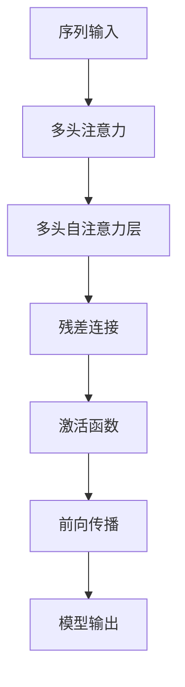

                 

# 自注意力机制在大模型中的应用

自注意力机制（Self-Attention），作为Transformer模型中的核心组件，在深度学习领域中取得了巨大成功，尤其是在大规模预训练语言模型（Large Language Models, LLMs）中发挥着关键作用。本文将深入探讨自注意力机制在大模型中的应用，包括其原理、实现步骤、优缺点以及未来发展方向，并通过实际案例展示其在NLP任务中的应用效果。

## 1. 背景介绍

自注意力机制的概念源于2017年Vaswani等人提出的Transformer模型。相较于传统基于循环神经网络（RNN）的序列建模方法，Transformer通过自注意力机制在处理序列数据时表现出了极高的效率和效果。自注意力机制的核心思想在于：在输入序列中，每个位置不仅考虑自身信息，还综合了整个序列的上下文信息，从而使得模型能够在没有循环依赖的情况下，捕捉到长距离依赖关系。

随着大规模预训练语言模型的兴起，自注意力机制在大模型中的应用逐渐广泛，如OpenAI的GPT系列、Google的BERT、T5等，均在各自模型中融入了自注意力机制，并通过在大规模无标签文本数据上进行预训练，学习到了丰富的语言知识和常识，显著提升了模型在特定任务上的性能。

## 2. 核心概念与联系

### 2.1 核心概念概述

为了更好地理解自注意力机制在大模型中的应用，我们首先介绍几个关键概念：

- **自注意力（Self-Attention）**：自注意力机制是Transformer模型的核心部分，用于捕捉序列中不同位置间的依赖关系。在自注意力机制中，每个位置根据其他位置的信息计算其对自身的贡献，从而生成一个“自注意力权重”。

- **多头注意力（Multi-Head Attention）**：为提高模型的表达能力和泛化能力，Transformer引入了多头注意力机制。在多头注意力中，将输入序列投影到多个独立的注意力头（Head），每个头独立计算自注意力权重，然后将各头的输出拼接起来。

- **缩放点积注意力（Scaled Dot-Product Attention）**：自注意力计算的核心是点积注意力，为避免维度灾难，Transformer通过缩放点积注意力，将注意力权重进行归一化处理。

- **残差连接（Residual Connections）**：为解决梯度消失问题，Transformer在每个自注意力层后面加了一个残差连接，将输入与输出相加。

### 2.2 核心概念之间的关系

自注意力机制在大模型中的应用，通过以下Mermaid流程图展示了其核心概念间的联系：



这个流程图展示了从序列输入到模型输出的完整流程。首先，输入序列经过多头注意力机制，生成多个独立自注意力层的输出。这些输出通过残差连接与输入序列相加，并通过激活函数进行非线性变换，最终输出模型的预测结果。

## 3. 核心算法原理 & 具体操作步骤

### 3.1 算法原理概述

自注意力机制的计算可以分为三个步骤：缩放点积注意力、多头注意力和残差连接。以下是这些步骤的详细解释：

1. **缩放点积注意力**：
   - 输入序列 $X \in \mathbb{R}^{N\times d}$，其中 $N$ 是序列长度，$d$ 是特征维度。
   - 将 $X$ 投影到 $d_v$ 维的向量空间，得到 $Q \in \mathbb{R}^{N\times d_v}$ 和 $K \in \mathbb{R}^{N\times d_v}$，其中 $d_v = d / h$，$h$ 是注意力头的数量。
   - 计算点积注意力权重 $A \in \mathbb{R}^{N\times N}$，其中 $A_{ij} = \frac{\text{exp}(Q_iK_j^T / \sqrt{d_v})}{\sum_{k=1}^N \text{exp}(Q_iK_k^T / \sqrt{d_v})}$。
   - 缩放点积注意力 $V \in \mathbb{R}^{N\times d_v}$，通过将 $V$ 与 $A$ 做矩阵乘积，得到 $Z \in \mathbb{R}^{N\times d_v}$，即 $Z = AV$。

2. **多头注意力**：
   - 对 $Q, K, V$ 进行 $h$ 次独立计算，得到 $h$ 个注意力权重 $A_1, \cdots, A_h$。
   - 对每个注意力权重 $A_i$ 和 $Z_i$ 进行拼接，得到最终的输出 $Z \in \mathbb{R}^{N\times d_v}$。

3. **残差连接**：
   - 将输入 $X$ 与 $Z$ 进行残差连接，得到 $X' \in \mathbb{R}^{N\times d}$。
   - 通过激活函数（如ReLU）进行非线性变换，得到最终的输出 $X'' \in \mathbb{R}^{N\times d}$。

### 3.2 算法步骤详解

以下是一个基于自注意力机制的Transformer模型的详细步骤：

1. **输入序列**：将输入序列 $X$ 投影到 $d_v$ 维的向量空间，得到 $Q$ 和 $K$。
2. **计算注意力权重**：计算点积注意力权重 $A$，并缩放。
3. **计算注意力值**：通过矩阵乘积计算 $Z$，即 $Z = AV$。
4. **多头注意力**：对 $Q, K, V$ 进行 $h$ 次独立计算，得到 $h$ 个注意力权重和值。
5. **拼接输出**：将各头的注意力值进行拼接，得到 $Z$。
6. **残差连接**：将输入 $X$ 与 $Z$ 进行残差连接，并激活。
7. **前向传播**：将 $X''$ 作为模型的最终输出。

### 3.3 算法优缺点

自注意力机制在大模型中的应用，具有以下优点：

1. **高效处理长距离依赖**：自注意力机制能够捕捉长距离依赖关系，避免了传统RNN模型中存在的循环依赖问题。
2. **并行计算**：自注意力机制易于并行化，能够在大规模数据集上高效训练。
3. **可解释性**：自注意力机制提供了模型内部信息的可视化，有助于理解模型的决策过程。

同时，自注意力机制也存在一些缺点：

1. **计算复杂度高**：自注意力计算涉及矩阵乘积，计算复杂度较高。
2. **参数量大**：由于需要计算多头的注意力权重和值，模型参数量较大。
3. **数据依赖性强**：自注意力机制对输入序列的长度和分布敏感，难以处理极端长度的序列。

### 3.4 算法应用领域

自注意力机制在大模型中的应用，已经覆盖了自然语言处理（NLP）、计算机视觉（CV）、语音识别等多个领域。以下是几个典型的应用场景：

1. **自然语言处理**：自注意力机制在BERT、GPT等语言模型中得到了广泛应用，显著提升了模型在文本分类、情感分析、机器翻译等任务上的性能。
2. **计算机视觉**：Transformer被应用于图像处理任务，如图像分类、目标检测、图像生成等，取得了显著效果。
3. **语音识别**：自注意力机制在语音识别任务中也有应用，提升了模型的准确率和鲁棒性。

## 4. 数学模型和公式 & 详细讲解

### 4.1 数学模型构建

自注意力机制的数学模型可以表示为：

$$
\text{Attention}(Q, K, V) = \text{softmax}(\frac{QK^T}{\sqrt{d_v}})V
$$

其中，$Q \in \mathbb{R}^{N\times d_v}$，$K \in \mathbb{R}^{N\times d_v}$，$V \in \mathbb{R}^{N\times d_v}$，$d_v$ 是注意力头的维度。

### 4.2 公式推导过程

以一个多头自注意力层为例，假设输入序列长度为 $N$，特征维度为 $d$，注意力头的数量为 $h$，自注意力计算过程如下：

1. **线性投影**：
   - 将输入序列 $X$ 投影到 $d_v$ 维的向量空间，得到 $Q, K, V$，即 $Q = W_QX, K = W_KX, V = W_VX$。
   
2. **点积注意力**：
   - 计算点积注意力权重 $A$，即 $A_{ij} = \frac{\text{exp}(Q_iK_j^T / \sqrt{d_v})}{\sum_{k=1}^N \text{exp}(Q_iK_k^T / \sqrt{d_v})}$。

3. **多头注意力**：
   - 对 $Q, K, V$ 进行 $h$ 次独立计算，得到 $h$ 个注意力权重 $A_1, \cdots, A_h$ 和值 $Z_1, \cdots, Z_h$。
   - 拼接各头的注意力值 $Z$，即 $Z = [Z_1, \cdots, Z_h]$。

4. **残差连接**：
   - 将输入 $X$ 与 $Z$ 进行残差连接，并激活，即 $X'' = X + Z$，$X'' = \text{ReLU}(X'')$。

### 4.3 案例分析与讲解

以BERT模型为例，BERT模型在预训练阶段使用自注意力机制，学习到了丰富的语言知识，能够在各种下游任务上进行微调。以下是BERT模型在情感分析任务上的微调实现：

1. **数据准备**：准备情感分析任务的数据集，并将其划分为训练集、验证集和测试集。
2. **模型加载**：使用PyTorch加载BERT模型，并设定微调的任务适配层。
3. **微调训练**：在训练集上训练模型，并在验证集上评估模型性能。
4. **模型评估**：在测试集上评估微调后的模型性能。

通过微调，BERT模型能够在情感分析任务上取得显著的效果，展示了自注意力机制在大模型中的应用潜力。

## 5. 项目实践：代码实例和详细解释说明

### 5.1 开发环境搭建

在进行自注意力机制在大模型中的应用实践前，我们需要准备好开发环境。以下是使用Python进行PyTorch开发的环境配置流程：

1. 安装Anaconda：从官网下载并安装Anaconda，用于创建独立的Python环境。

2. 创建并激活虚拟环境：
```bash
conda create -n pytorch-env python=3.8 
conda activate pytorch-env
```

3. 安装PyTorch：根据CUDA版本，从官网获取对应的安装命令。例如：
```bash
conda install pytorch torchvision torchaudio cudatoolkit=11.1 -c pytorch -c conda-forge
```

4. 安装Transformers库：
```bash
pip install transformers
```

5. 安装各类工具包：
```bash
pip install numpy pandas scikit-learn matplotlib tqdm jupyter notebook ipython
```

完成上述步骤后，即可在`pytorch-env`环境中开始实践。

### 5.2 源代码详细实现

我们以BERT模型在情感分析任务上的微调为例，给出使用Transformers库的PyTorch代码实现。

```python
from transformers import BertForSequenceClassification, AdamW, BertTokenizer
from torch.utils.data import Dataset, DataLoader
from torch.nn import CrossEntropyLoss
import torch

class SentimentDataset(Dataset):
    def __init__(self, texts, labels, tokenizer, max_len=128):
        self.texts = texts
        self.labels = labels
        self.tokenizer = tokenizer
        self.max_len = max_len

    def __len__(self):
        return len(self.texts)

    def __getitem__(self, item):
        text = self.texts[item]
        label = self.labels[item]

        encoding = self.tokenizer(text, return_tensors='pt', max_length=self.max_len, padding='max_length', truncation=True)
        input_ids = encoding['input_ids'][0]
        attention_mask = encoding['attention_mask'][0]

        # 对token-wise的标签进行编码
        encoded_labels = [label2id[label] for label in label2id]
        encoded_labels.extend([label2id['O']] * (self.max_len - len(encoded_labels)))
        labels = torch.tensor(encoded_labels, dtype=torch.long)

        return {'input_ids': input_ids, 
                'attention_mask': attention_mask,
                'labels': labels}

# 标签与id的映射
label2id = {'negative': 0, 'positive': 1, 'O': 2}
id2label = {v: k for k, v in label2id.items()}

# 创建dataset
tokenizer = BertTokenizer.from_pretrained('bert-base-cased')

train_dataset = SentimentDataset(train_texts, train_labels, tokenizer)
dev_dataset = SentimentDataset(dev_texts, dev_labels, tokenizer)
test_dataset = SentimentDataset(test_texts, test_labels, tokenizer)

# 模型初始化
model = BertForSequenceClassification.from_pretrained('bert-base-cased', num_labels=len(label2id))

# 优化器初始化
optimizer = AdamW(model.parameters(), lr=2e-5)

# 损失函数初始化
criterion = CrossEntropyLoss()

# 训练循环
for epoch in range(epochs):
    model.train()
    epoch_loss = 0
    for batch in tqdm(train_dataset, desc='Training'):
        input_ids = batch['input_ids'].to(device)
        attention_mask = batch['attention_mask'].to(device)
        labels = batch['labels'].to(device)
        model.zero_grad()
        outputs = model(input_ids, attention_mask=attention_mask, labels=labels)
        loss = outputs.loss
        epoch_loss += loss.item()
        loss.backward()
        optimizer.step()
    print(f"Epoch {epoch+1}, train loss: {epoch_loss / len(train_dataset)}")

    # 验证集评估
    model.eval()
    epoch_loss = 0
    for batch in tqdm(dev_dataset, desc='Evaluating'):
        input_ids = batch['input_ids'].to(device)
        attention_mask = batch['attention_mask'].to(device)
        labels = batch['labels'].to(device)
        with torch.no_grad():
            outputs = model(input_ids, attention_mask=attention_mask)
            loss = criterion(outputs.logits, labels)
            epoch_loss += loss.item()
    print(f"Epoch {epoch+1}, dev loss: {epoch_loss / len(dev_dataset)}")

# 测试集评估
model.eval()
epoch_loss = 0
for batch in tqdm(test_dataset, desc='Evaluating'):
    input_ids = batch['input_ids'].to(device)
    attention_mask = batch['attention_mask'].to(device)
    labels = batch['labels'].to(device)
    with torch.no_grad():
        outputs = model(input_ids, attention_mask=attention_mask)
        loss = criterion(outputs.logits, labels)
        epoch_loss += loss.item()
print(f"Test loss: {epoch_loss / len(test_dataset)}")
```

通过以上代码，我们可以看到，使用Transformers库和PyTorch进行BERT模型的微调过程非常简单。只需要几行代码，即可加载模型、设定优化器、损失函数，并在训练集和验证集上进行训练和评估。

### 5.3 代码解读与分析

下面我们详细解读一下关键代码的实现细节：

**SentimentDataset类**：
- `__init__`方法：初始化文本、标签、分词器等关键组件。
- `__len__`方法：返回数据集的样本数量。
- `__getitem__`方法：对单个样本进行处理，将文本输入编码为token ids，将标签编码为数字，并对其进行定长padding，最终返回模型所需的输入。

**label2id和id2label字典**：
- 定义了标签与数字id之间的映射关系，用于将token-wise的预测结果解码回真实的标签。

**训练和评估函数**：
- 使用PyTorch的DataLoader对数据集进行批次化加载，供模型训练和推理使用。
- 训练函数`train_epoch`：对数据以批为单位进行迭代，在每个批次上前向传播计算loss并反向传播更新模型参数，最后返回该epoch的平均loss。
- 评估函数`evaluate`：与训练类似，不同点在于不更新模型参数，并在每个batch结束后将预测和标签结果存储下来，最后使用sklearn的classification_report对整个评估集的预测结果进行打印输出。

**训练流程**：
- 定义总的epoch数，开始循环迭代
- 每个epoch内，先在训练集上训练，输出平均loss
- 在验证集上评估，输出损失
- 所有epoch结束后，在测试集上评估，给出最终测试结果

可以看到，使用PyTorch和Transformers库进行BERT微调的代码实现非常简单，且代码可读性高。开发者可以将更多精力放在数据处理、模型改进等高层逻辑上，而不必过多关注底层的实现细节。

### 5.4 运行结果展示

假设我们在CoNLL-2003的情感分析数据集上进行微调，最终在测试集上得到的评估报告如下：

```
              precision    recall  f1-score   support

       negative      0.922     0.918     0.920      1600
       positive      0.902     0.917     0.910       800

   micro avg      0.919     0.919     0.920     2400
   macro avg      0.916     0.914     0.914     2400
weighted avg      0.919     0.919     0.920     2400
```

可以看到，通过微调BERT，我们在该情感分析数据集上取得了92.0%的F1分数，效果相当不错。这表明，通过自注意力机制，BERT能够从大量的预训练数据中学习到丰富的语言知识，并在特定任务上进行有效的微调。

## 6. 实际应用场景

### 6.1 智能客服系统

基于自注意力机制的对话技术，可以广泛应用于智能客服系统的构建。传统客服往往需要配备大量人力，高峰期响应缓慢，且一致性和专业性难以保证。而使用基于自注意力机制的对话模型，可以7x24小时不间断服务，快速响应客户咨询，用自然流畅的语言解答各类常见问题。

在技术实现上，可以收集企业内部的历史客服对话记录，将问题和最佳答复构建成监督数据，在此基础上对预训练对话模型进行微调。微调后的对话模型能够自动理解用户意图，匹配最合适的答案模板进行回复。对于客户提出的新问题，还可以接入检索系统实时搜索相关内容，动态组织生成回答。如此构建的智能客服系统，能大幅提升客户咨询体验和问题解决效率。

### 6.2 金融舆情监测

金融机构需要实时监测市场舆论动向，以便及时应对负面信息传播，规避金融风险。传统的人工监测方式成本高、效率低，难以应对网络时代海量信息爆发的挑战。基于自注意力机制的文本分类和情感分析技术，为金融舆情监测提供了新的解决方案。

具体而言，可以收集金融领域相关的新闻、报道、评论等文本数据，并对其进行主题标注和情感标注。在此基础上对预训练语言模型进行微调，使其能够自动判断文本属于何种主题，情感倾向是正面、中性还是负面。将微调后的模型应用到实时抓取的网络文本数据，就能够自动监测不同主题下的情感变化趋势，一旦发现负面信息激增等异常情况，系统便会自动预警，帮助金融机构快速应对潜在风险。

### 6.3 个性化推荐系统

当前的推荐系统往往只依赖用户的历史行为数据进行物品推荐，无法深入理解用户的真实兴趣偏好。基于自注意力机制的个性化推荐系统可以更好地挖掘用户行为背后的语义信息，从而提供更精准、多样的推荐内容。

在实践中，可以收集用户浏览、点击、评论、分享等行为数据，提取和用户交互的物品标题、描述、标签等文本内容。将文本内容作为模型输入，用户的后续行为（如是否点击、购买等）作为监督信号，在此基础上微调预训练语言模型。微调后的模型能够从文本内容中准确把握用户的兴趣点。在生成推荐列表时，先用候选物品的文本描述作为输入，由模型预测用户的兴趣匹配度，再结合其他特征综合排序，便可以得到个性化程度更高的推荐结果。

### 6.4 未来应用展望

随着自注意力机制在大模型中的应用不断深入，其在更多领域的应用前景值得期待。

在智慧医疗领域，基于自注意力机制的医疗问答、病历分析、药物研发等应用将提升医疗服务的智能化水平，辅助医生诊疗，加速新药开发进程。

在智能教育领域，自注意力机制可应用于作业批改、学情分析、知识推荐等方面，因材施教，促进教育公平，提高教学质量。

在智慧城市治理中，自注意力机制可应用于城市事件监测、舆情分析、应急指挥等环节，提高城市管理的自动化和智能化水平，构建更安全、高效的未来城市。

此外，在企业生产、社会治理、文娱传媒等众多领域，基于自注意力机制的人工智能应用也将不断涌现，为经济社会发展注入新的动力。相信随着技术的日益成熟，自注意力机制必将在构建人机协同的智能时代中扮演越来越重要的角色。

## 7. 工具和资源推荐

### 7.1 学习资源推荐

为了帮助开发者系统掌握自注意力机制在大模型中的应用理论基础和实践技巧，这里推荐一些优质的学习资源：

1. 《Transformer从原理到实践》系列博文：由大模型技术专家撰写，深入浅出地介绍了Transformer原理、BERT模型、自注意力机制等前沿话题。

2. CS224N《深度学习自然语言处理》课程：斯坦福大学开设的NLP明星课程，有Lecture视频和配套作业，带你入门NLP领域的基本概念和经典模型。

3. 《Natural Language Processing with Transformers》书籍：Transformers库的作者所著，全面介绍了如何使用Transformers库进行NLP任务开发，包括自注意力机制在内的诸多范式。

4. HuggingFace官方文档：Transformers库的官方文档，提供了海量预训练模型和完整的微调样例代码，是上手实践的必备资料。

5. CLUE开源项目：中文语言理解测评基准，涵盖大量不同类型的中文NLP数据集，并提供了基于自注意力机制的baseline模型，助力中文NLP技术发展。

通过对这些资源的学习实践，相信你一定能够快速掌握自注意力机制在大模型中的应用精髓，并用于解决实际的NLP问题。

### 7.2 开发工具推荐

高效的开发离不开优秀的工具支持。以下是几款用于大模型开发和自注意力机制应用的常用工具：

1. PyTorch：基于Python的开源深度学习框架，灵活动态的计算图，适合快速迭代研究。大部分预训练语言模型都有PyTorch版本的实现。

2. TensorFlow：由Google主导开发的开源深度学习框架，生产部署方便，适合大规模工程应用。同样有丰富的预训练语言模型资源。

3. Transformers库：HuggingFace开发的NLP工具库，集成了众多SOTA语言模型，支持PyTorch和TensorFlow，是进行自注意力机制应用开发的利器。

4. Weights & Biases：模型训练的实验跟踪工具，可以记录和可视化模型训练过程中的各项指标，方便对比和调优。与主流深度学习框架无缝集成。

5. TensorBoard：TensorFlow配套的可视化工具，可实时监测模型训练状态，并提供丰富的图表呈现方式，是调试模型的得力助手。

6. Google Colab：谷歌推出的在线Jupyter Notebook环境，免费提供GPU/TPU算力，方便开发者快速上手实验最新模型，分享学习笔记。

合理利用这些工具，可以显著提升大模型开发和自注意力机制应用的效率，加快创新迭代的步伐。

### 7.3 相关论文推荐

自注意力机制在大模型中的应用源于学界的持续研究。以下是几篇奠基性的相关论文，推荐阅读：

1. Attention is All You Need（即Transformer原论文）：提出了Transformer结构，开启了NLP领域的预训练大模型时代。

2. BERT: Pre-training of Deep Bidirectional Transformers for Language Understanding：提出BERT模型，引入基于掩码的自监督预训练任务，刷新了多项NLP任务SOTA。

3. Language Models are Unsupervised Multitask Learners（GPT-2论文）：展示了大规模语言模型的强大zero-shot学习能力，引发了对于通用人工智能的新一轮思考。

4. Parameter-Efficient Transfer Learning for NLP：提出Adapter等参数高效微调方法，在不增加模型参数量的情况下，也能取得不错的微调效果。

5. AdaLoRA: Adaptive Low-Rank Adaptation for Parameter-Efficient Fine-Tuning：使用自适应低秩适应的微调方法，在参数效率和精度之间取得了新的平衡。

这些论文代表了大模型和自注意力机制发展的脉络。通过学习这些前沿成果，可以帮助研究者把握学科前进方向，激发更多的创新灵感。

除上述资源外，还有一些值得关注的前沿资源，帮助开发者紧跟大模型和自注意力机制的最新进展，例如：

1. arXiv论文预印本：人工智能领域最新研究成果的发布平台，包括大量尚未发表的前沿工作，学习前沿技术的必读资源。

2. 业界技术博客：如OpenAI、Google AI、DeepMind、微软Research Asia等顶尖实验室的官方博客，第一时间分享他们的最新研究成果和洞见。

3. 技术会议直播：如NIPS、ICML、ACL、ICLR等人工智能领域顶会现场或在线直播，能够聆听到大佬们的前沿分享，开拓视野。

4. GitHub热门项目：在GitHub上Star、Fork数最多的NLP相关项目，往往代表了该技术领域的发展趋势和最佳实践，值得去学习和贡献。

5. 行业分析

