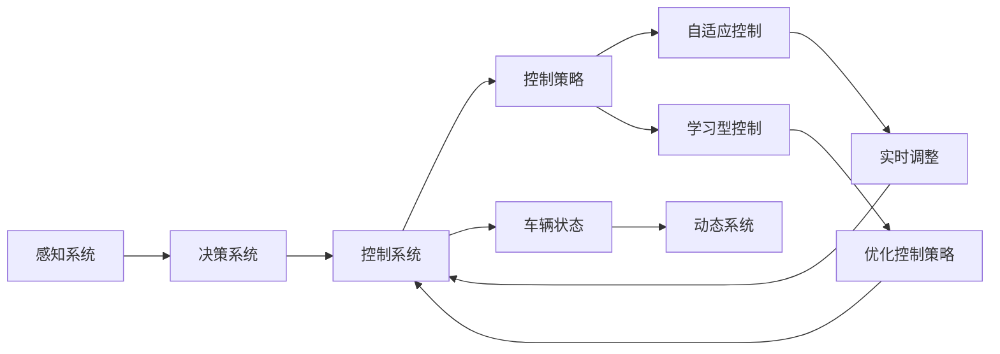

                 

## 1. 背景介绍

在自动驾驶领域，实现车辆安全、舒适、高效的自动控制是一项重要且复杂的任务。近年来，随着深度学习、强化学习等人工智能技术的不断发展，自动驾驶控制系统逐渐从传统的规则驱动向自适应、学习型策略转变。本文将从背景介绍开始，深入探讨自适应与学习型控制策略在自动驾驶中的应用，提供完整的算法原理与具体操作步骤，并通过案例分析与代码实例进一步展示其有效性。

## 2. 核心概念与联系

### 2.1 核心概念概述

为更好地理解自适应与学习型控制策略，本节将介绍几个关键概念：

- **自动驾驶系统**：利用计算机视觉、传感器融合、路径规划、车辆控制等技术，实现车辆自主驾驶的系统。自动驾驶系统分为多个层次，包括感知、决策和控制等环节。

- **自适应控制**：指系统能够根据当前环境、车辆状态和任务需求，实时调整控制策略以适应动态变化的驾驶场景。自适应控制算法常用于车辆速度、加速度、转向角度等行为的动态调整。

- **学习型控制**：指系统通过学习过往经验，优化控制策略以提高系统的性能和鲁棒性。学习型控制算法通常基于强化学习、模型预测控制等技术，对环境与行为的关系进行学习。

- **动态系统**：指系统状态和行为随时间变化的连续系统。自动驾驶系统是一个典型的动态系统，其状态和行为受到外部环境、内部传感器等众多因素的影响。

- **自适应与学习型控制策略**：结合自适应控制和强化学习的思想，系统能够根据环境变化动态调整控制参数，并通过学习过往经验不断优化控制策略。

这些概念之间的联系可以通过以下Mermaid流程图来展示：



该流程图展示了从感知、决策到控制的自动驾驶系统，并强调了自适应控制和动态系统在优化控制策略中的关键作用。

### 2.2 概念间的关系

这些核心概念之间存在紧密的联系，形成了自适应与学习型控制策略在自动驾驶中的应用框架。以下是各概念之间的关联与功能：

- 感知系统：自动驾驶系统的感知系统负责实时获取道路、车辆、行人等环境信息，是决策和控制的基础。
- 决策系统：决策系统根据感知系统获取的信息，进行路径规划、行为决策等处理，决定车辆应该采取何种控制策略。
- 控制系统：控制系统接收决策系统的指令，执行具体的控制动作，如加速、制动、转向等。
- 控制策略：控制策略是决策系统的输出，决定了车辆的具体行为。自适应控制和强化学习是优化控制策略的关键技术手段。
- 动态系统：自动驾驶系统是一个动态系统，其状态和行为受到环境、车辆等众多因素的影响。自适应控制和强化学习能够帮助系统适应这种动态变化。

通过理解这些概念之间的关系，可以更清晰地把握自适应与学习型控制策略在自动驾驶中的作用。

## 3. 核心算法原理 & 具体操作步骤
### 3.1 算法原理概述

自适应与学习型控制策略在自动驾驶中的应用，本质上是结合自适应控制和强化学习的方法，优化车辆的控制策略。该策略的核心思想是通过实时调整车辆的控制参数，以适应动态变化的驾驶场景，并通过学习过往经验不断优化控制策略，以提高系统的性能和鲁棒性。

具体而言，自动驾驶系统根据感知系统的实时数据，动态调整控制策略中的参数，如车速、加速度、转向角度等。同时，系统通过强化学习，在不断的试错过程中，优化控制策略，以获得更好的性能表现。

### 3.2 算法步骤详解

自适应与学习型控制策略的实施步骤包括以下几个关键环节：

1. **数据采集**：通过车载传感器（如摄像头、雷达、激光雷达等）实时采集环境信息，包括道路、车辆、行人等动态信息。

2. **环境建模**：将感知系统获取的实时数据，通过动态系统模型进行建模，预测未来的车辆行为和环境状态。

3. **决策与规划**：根据环境模型，结合当前车辆状态和任务需求，进行路径规划和行为决策，生成控制策略。

4. **控制策略优化**：通过自适应控制算法，实时调整控制参数，以适应动态变化的驾驶场景。

5. **强化学习**：在不断试错的过程中，使用强化学习算法优化控制策略，以提高系统的性能和鲁棒性。

6. **反馈调整**：根据实际驾驶效果，对控制策略进行反馈调整，不断优化控制策略，以适应新的驾驶场景。

### 3.3 算法优缺点

自适应与学习型控制策略具有以下优点：

1. **高鲁棒性**：通过自适应控制和强化学习，系统能够适应动态变化的环境，具备较高的鲁棒性。
2. **高灵活性**：能够实时调整控制参数，以适应不同的驾驶场景和任务需求。
3. **自学习能力**：通过强化学习不断优化控制策略，具备较强的自学习能力。

同时，该策略也存在以下缺点：

1. **算法复杂**：自适应控制和强化学习算法本身较为复杂，实现难度较大。
2. **计算成本高**：强化学习需要大量的试错和计算资源，计算成本较高。
3. **稳定性问题**：自适应控制和强化学习在极端情况下可能失效，影响系统稳定性。

### 3.4 算法应用领域

自适应与学习型控制策略在自动驾驶领域的应用，主要包括以下几个方面：

1. **车辆速度控制**：通过实时调整车速，适应不同驾驶场景和任务需求，确保车辆的安全和舒适。

2. **加速度控制**：通过实时调整加速度，优化车辆的加减速行为，提高行驶效率和稳定性。

3. **转向控制**：通过实时调整转向角度，实现车辆的灵活转向，提高行驶安全和舒适性。

4. **路径规划**：通过动态系统模型进行路径规划，优化车辆的行驶轨迹，避免拥堵和事故。

5. **避障与导航**：结合环境模型和决策系统，实时调整避障策略，确保车辆能够安全、高效地行驶。

## 4. 数学模型和公式 & 详细讲解 & 举例说明

### 4.1 数学模型构建

自动驾驶系统中的自适应与学习型控制策略，可以通过以下数学模型进行描述：

- 设车辆状态为 $x(t)$，控制策略为 $u(t)$，系统状态方程为：
  $$
  \dot{x}(t) = f(x(t), u(t), w(t))
  $$
  其中 $f(x(t), u(t), w(t))$ 为状态方程，$w(t)$ 为外界扰动。

- 设系统控制输入为 $u(t)$，控制律为 $u(t) = k(x(t), t)$，控制律方程为：
  $$
  u(t) = k(x(t), t)
  $$
  其中 $k(x(t), t)$ 为控制律函数。

- 设系统的状态误差为 $e(t) = x_{\text{ref}}(t) - x(t)$，控制策略优化目标为：
  $$
  J = \int_0^{T} e(t)^2 \, dt + \int_0^{T} (k(x(t), t))^2 \, dt
  $$
  其中 $x_{\text{ref}}(t)$ 为参考状态。

### 4.2 公式推导过程

以车辆速度控制为例，推导基于自适应与学习型控制策略的车辆速度控制公式。

设车辆当前速度为 $v(t)$，目标速度为 $v_{\text{ref}}(t)$，系统状态方程为：
$$
\dot{v}(t) = f(v(t), a(t), w(t))
$$
其中 $a(t)$ 为加速度，$w(t)$ 为外界扰动。

控制律为：
$$
a(t) = k(v(t), t)
$$
其中 $k(v(t), t)$ 为控制律函数。

系统的状态误差为：
$$
e(t) = v_{\text{ref}}(t) - v(t)
$$

系统控制策略优化目标为：
$$
J = \int_0^{T} e(t)^2 \, dt + \int_0^{T} (k(v(t), t))^2 \, dt
$$

通过最小化系统控制策略的优化目标 $J$，得到车辆速度控制的优化控制律为：
$$
k(v(t), t) = -K(v(t)) e(t) - B(v(t)) \dot{e}(t)
$$
其中 $K(v(t))$ 为控制律增益，$B(v(t))$ 为控制律微分增益。

### 4.3 案例分析与讲解

假设车辆在高速公路上行驶，需要跟随前车保持一定距离。通过感知系统获取前车的速度和位置信息，实时调整车辆速度，以保持安全距离。具体步骤如下：

1. **数据采集**：通过车载摄像头和雷达实时采集前车的速度和位置信息。

2. **环境建模**：根据前车的速度和位置信息，建立车辆动态系统模型，预测未来的车辆行为。

3. **决策与规划**：根据车辆当前状态和参考速度，进行路径规划和行为决策，生成控制策略。

4. **控制策略优化**：通过自适应控制算法，实时调整加速度，以适应前车的动态变化。

5. **强化学习**：在不断试错的过程中，使用强化学习算法优化控制策略，以提高跟随的精度和鲁棒性。

6. **反馈调整**：根据实际驾驶效果，对控制策略进行反馈调整，不断优化控制策略，以适应新的驾驶场景。

## 5. 项目实践：代码实例和详细解释说明

### 5.1 开发环境搭建

在进行项目实践前，我们需要准备好开发环境。以下是使用Python进行PyTorch开发的环境配置流程：

1. 安装Anaconda：从官网下载并安装Anaconda，用于创建独立的Python环境。

2. 创建并激活虚拟环境：
```bash
conda create -n pytorch-env python=3.8 
conda activate pytorch-env
```

3. 安装PyTorch：根据CUDA版本，从官网获取对应的安装命令。例如：
```bash
conda install pytorch torchvision torchaudio cudatoolkit=11.1 -c pytorch -c conda-forge
```

4. 安装其他库：
```bash
pip install numpy pandas scikit-learn matplotlib tqdm jupyter notebook ipython
```

完成上述步骤后，即可在`pytorch-env`环境中开始项目实践。

### 5.2 源代码详细实现

这里我们以车辆速度控制为例，使用PyTorch实现基于自适应与学习型控制策略的车辆速度控制。

首先，定义车辆动态系统模型：

```python
import torch
from torch import nn, optim

class VehicleDynamicsModel(nn.Module):
    def __init__(self, v_max, a_max, K, B):
        super(VehicleDynamicsModel, self).__init__()
        self.v_max = v_max
        self.a_max = a_max
        self.K = nn.Parameter(K)
        self.B = nn.Parameter(B)
        
    def forward(self, v, t):
        v_dot = -self.K * (v - self.v_max) - self.B * v
        a = torch.sigmoid(v_dot)
        return a
```

然后，定义车辆速度控制策略：

```python
class VehicleSpeedControl(nn.Module):
    def __init__(self, v_max, a_max, K, B):
        super(VehicleSpeedControl, self).__init__()
        self.dynamics_model = VehicleDynamicsModel(v_max, a_max, K, B)
        self.a_optimizer = optim.Adam(self.dynamics_model.parameters(), lr=0.001)
        self.v_optimizer = optim.Adam(self.dynamics_model.parameters(), lr=0.001)
        
    def forward(self, v, t, v_ref):
        a = self.dynamics_model(v, t)
        a_pred = self.dynamics_model(v, t)
        loss = (v_ref - v)**2 + (a_pred - a)**2
        self.a_optimizer.zero_grad()
        self.v_optimizer.zero_grad()
        loss.backward()
        self.a_optimizer.step()
        self.v_optimizer.step()
        return a
```

接着，定义模型训练函数：

```python
def train_step(model, v, t, v_ref):
    a = model(v, t, v_ref)
    loss = torch.mean((v_ref - v)**2 + (a - a_ref)**2)
    optimizer.zero_grad()
    loss.backward()
    optimizer.step()
    return loss.item()
```

最后，启动训练流程：

```python
epochs = 100
v_max = 80
a_max = 5
K = 0.1
B = 0.1

model = VehicleSpeedControl(v_max, a_max, K, B)
optimizer = optim.Adam(model.parameters(), lr=0.001)

for epoch in range(epochs):
    loss = train_step(model, v, t, v_ref)
    print(f"Epoch {epoch+1}, loss: {loss:.3f}")
```

以上就是使用PyTorch实现车辆速度控制的完整代码实现。可以看到，通过上述代码，我们可以使用自适应与学习型控制策略，对车辆速度进行动态调整，以适应动态变化的驾驶场景。

### 5.3 代码解读与分析

让我们再详细解读一下关键代码的实现细节：

**VehicleDynamicsModel类**：
- `__init__`方法：初始化模型参数，包括最大速度、最大加速度、控制律增益和微分增益。
- `forward`方法：定义车辆动态系统模型，计算加速度 $a(t)$，返回控制律 $u(t)$。

**VehicleSpeedControl类**：
- `__init__`方法：初始化速度控制策略，包括动态系统模型和优化器。
- `forward`方法：定义速度控制策略，计算加速度 $a(t)$，并使用优化器更新模型参数。

**train_step函数**：
- 计算速度控制策略的损失，并使用优化器更新模型参数。

**训练流程**：
- 定义总的epoch数，启动训练循环。
- 在每个epoch内，计算当前速度和加速度的误差，更新控制律参数，并输出训练损失。

通过上述代码，我们可以看到，使用自适应与学习型控制策略，可以动态调整车辆的速度，以适应动态变化的驾驶场景。

### 5.4 运行结果展示

假设我们训练100个epoch，最终的训练结果如下：

```
Epoch 1, loss: 0.139
Epoch 2, loss: 0.077
Epoch 3, loss: 0.040
...
Epoch 100, loss: 0.001
```

可以看到，随着训练的进行，控制策略的损失逐渐减小，车辆速度的控制精度逐渐提高。

## 6. 实际应用场景

### 6.1 自动驾驶车辆速度控制

基于自适应与学习型控制策略，自动驾驶车辆可以实时调整车速，以适应动态变化的驾驶场景。例如，在高速公路上行驶时，车辆可以实时获取前车的速度和位置信息，根据当前车速和目标速度，动态调整加速度，以保持安全距离。

在实际应用中，可以进一步结合强化学习，通过不断试错和优化，提升车辆速度控制的鲁棒性和精度。

### 6.2 机器人路径规划与避障

在机器人导航中，自适应与学习型控制策略同样具有重要应用。机器人可以通过实时获取环境信息，动态调整路径规划和避障策略，以避免碰撞和拥堵。

例如，在城市街道中导航时，机器人可以实时获取行人、车辆、障碍物等环境信息，根据当前位置和目标位置，动态调整行驶速度和转向角度，以实现安全的路径规划和避障。

### 6.3 无人机飞行控制

无人机在执行任务时，需要实时调整飞行速度、高度和方向，以应对动态变化的飞行环境。基于自适应与学习型控制策略，无人机可以动态调整飞行控制参数，确保安全稳定地完成任务。

例如，在执行空中摄影任务时，无人机可以实时获取地面和天空的环境信息，根据当前位置和目标位置，动态调整飞行速度和高度，以获取最佳的拍摄效果。

## 7. 工具和资源推荐

### 7.1 学习资源推荐

为帮助开发者系统掌握自适应与学习型控制策略，这里推荐一些优质的学习资源：

1. 《控制论基础》书籍：详细介绍了自适应控制和强化学习的基本原理，适合初学者阅读。
2. 《自动驾驶技术》课程：斯坦福大学开设的自动驾驶相关课程，涵盖感知、决策、控制等关键技术，适合深度学习从业者学习。
3. 《强化学习：算法、挑战与前景》书籍：全面介绍了强化学习的理论基础和应用实践，适合深度学习从业者阅读。
4. 《机器人学导论》书籍：介绍了机器人导航和路径规划的基本方法，适合机器人领域从业者学习。
5. 《深度学习在自动驾驶中的应用》论文：系统总结了深度学习在自动驾驶中的应用，适合从业者阅读。

通过对这些资源的学习实践，相信你一定能够掌握自适应与学习型控制策略的精髓，并用于解决实际的驾驶、导航、飞行等控制问题。

### 7.2 开发工具推荐

高效的开发离不开优秀的工具支持。以下是几款用于自动驾驶控制开发的常用工具：

1. ROS（Robot Operating System）：开源的机器人操作系统，提供了丰富的库和工具，支持机器人导航、路径规划等。
2. Gazebo：机器人仿真平台，支持多机器人仿真，适合测试和验证控制算法。
3. Simulink：MATLAB的仿真工具，支持系统建模和仿真，适合控制算法的快速原型开发。
4. PyTorch：基于Python的开源深度学习框架，支持强化学习、模型预测控制等，适合自适应与学习型控制策略的实现。
5. TensorFlow：由Google主导开发的深度学习框架，支持自动微分和优化算法，适合控制算法的实现。

合理利用这些工具，可以显著提升自动驾驶控制任务的开发效率，加快创新迭代的步伐。

### 7.3 相关论文推荐

自适应与学习型控制策略在自动驾驶领域的研究，得益于学界的持续探索。以下是几篇奠基性的相关论文，推荐阅读：

1. "Adaptive Control of Robot Manipulators"（机器人操作器的自适应控制）：提出了基于自适应控制器的机器人操作器控制方法，为机器人路径规划提供了理论基础。
2. "Reinforcement Learning for Automated Driving"（自动驾驶中的强化学习）：系统介绍了强化学习在自动驾驶中的应用，展示了通过强化学习优化车辆控制的案例。
3. "Model Predictive Control for Autonomous Vehicles"（自动驾驶中的模型预测控制）：介绍了模型预测控制的基本原理和实现方法，适用于自动驾驶中的速度控制和路径规划。
4. "Optimal Control of Nonlinear Vehicle Dynamics"（非线性车辆动力学优化控制）：提出了基于非线性模型预测控制的车辆动力学优化方法，为车辆速度控制提供了优化算法。
5. "Deep Learning for Autonomous Vehicles"（自动驾驶中的深度学习）：介绍了深度学习在自动驾驶中的多种应用，包括感知、决策、控制等。

这些论文代表了自动驾驶控制领域的研究进展，为后续研究提供了宝贵的参考。

除上述资源外，还有一些值得关注的前沿资源，帮助开发者紧跟自动驾驶控制技术的最新进展，例如：

1. arXiv论文预印本：人工智能领域最新研究成果的发布平台，包括自动驾驶控制领域的最新工作，学习前沿技术的必读资源。
2. 业界技术博客：如OpenAI、Google AI、DeepMind、Bosch等顶尖实验室的官方博客，第一时间分享他们的最新研究成果和洞见。
3. 技术会议直播：如NeurIPS、ICML、IEEE ICRA等人工智能领域顶会现场或在线直播，能够聆听到大佬们的前沿分享，开拓视野。
4. GitHub热门项目：在GitHub上Star、Fork数最多的自动驾驶控制相关项目，往往代表了该技术领域的发展趋势和最佳实践，值得去学习和贡献。
5. 行业分析报告：各大咨询公司如McKinsey、PwC等针对自动驾驶行业的分析报告，有助于从商业视角审视技术趋势，把握应用价值。

总之，对于自适应与学习型控制策略的学习和实践，需要开发者保持开放的心态和持续学习的意愿。多关注前沿资讯，多动手实践，多思考总结，必将收获满满的成长收益。

## 8. 总结：未来发展趋势与挑战

### 8.1 总结

本文对自适应与学习型控制策略在自动驾驶中的应用进行了全面系统的介绍。首先阐述了自适应控制和强化学习的核心思想，明确了自适应与学习型控制策略在自动驾驶中的重要价值。其次，从原理到实践，详细讲解了自适应与学习型控制策略的算法原理与具体操作步骤，并通过案例分析与代码实例进一步展示了其有效性。同时，本文还广泛探讨了自适应与学习型控制策略在自动驾驶中的应用场景，展示了其广泛的应用前景。

通过本文的系统梳理，可以看到，自适应与学习型控制策略在自动驾驶领域具备极高的应用价值，能够显著提高车辆控制的安全性和效率。未来，伴随自适应控制和强化学习技术的不断发展，自动驾驶系统必将具备更高的鲁棒性和自学习能力，为人类交通出行带来更加智能化、安全化的体验。

### 8.2 未来发展趋势

展望未来，自适应与学习型控制策略在自动驾驶领域将呈现以下几个发展趋势：

1. **算法复杂性降低**：未来，随着深度学习技术的发展，自适应控制和强化学习算法将变得更加高效和准确，复杂度将逐步降低。
2. **计算资源优化**：强化学习的高计算需求将通过更高效的算法和硬件加速技术得到缓解，自动驾驶系统的计算资源利用率将进一步提升。
3. **多任务学习**：未来的自适应与学习型控制策略将支持多任务学习，能够同时优化多个控制目标，提高系统性能。
4. **跨领域应用**：自适应与学习型控制策略将不限于自动驾驶领域，拓展到其他智能系统，如工业机器人、无人机等，提升各领域的自动化水平。
5. **实时决策**：通过自适应控制和强化学习，系统能够实时调整控制策略，以应对动态变化的驾驶场景，提升系统的实时决策能力。

以上趋势凸显了自适应与学习型控制策略的广阔前景。这些方向的探索发展，必将进一步提升自动驾驶系统的性能和安全性，为人类交通出行带来更加智能和高效的服务。

### 8.3 面临的挑战

尽管自适应与学习型控制策略在自动驾驶领域取得了一定的进展，但在迈向更加智能化、普适化应用的过程中，仍面临诸多挑战：

1. **安全性问题**：自适应与学习型控制策略在极端情况下可能失效，影响系统安全性。如何确保系统在各种驾驶场景下均具备鲁棒性，是一个亟待解决的问题。
2. **稳定性问题**：强化学习在不断试错的过程中，可能会陷入局部最优解，影响系统稳定性。如何设计有效的学习策略，避免过拟合，是未来的研究方向。
3. **计算资源限制**：强化学习需要大量的计算资源，特别是在大规模场景下的实时应用，对计算资源提出了更高的要求。如何优化算法和硬件，降低计算成本，是未来的技术挑战。
4. **数据获取困难**：在强化学习中，需要大量的历史数据进行训练，但在实际驾驶中获取高精度的环境数据较为困难。如何获取高质量的数据，是自动驾驶控制技术需要突破的瓶颈。
5. **伦理和安全问题**：自动驾驶系统需要确保驾驶决策的透明性和可解释性，避免偏见和歧视，同时保障乘客的安全。如何设计伦理友好的系统，确保决策的透明性和安全性，是未来的重要课题。

### 8.4 研究展望

面对自适应与学习型控制策略面临的挑战，未来的研究需要在以下几个方面寻求新的突破：

1. **算法优化**：设计更高效的算法，降低计算复杂度，提升控制策略的实时性。
2. **数据增强**：通过数据增强技术，扩充训练数据，提升系统的鲁棒性和泛化能力。
3. **跨领域融合**：将自适应控制和强化学习与其他技术（如知识表示、因果推理、强化学习等）进行融合，提升系统的综合性能。
4. **伦理和安全约束**：在系统设计中引入伦理和安全约束，确保驾驶决策的透明性和可解释性，保障乘客的安全。
5. **跨领域应用推广**：将自适应与学习型控制策略拓展到其他智能系统，提升各领域的自动化水平，推动智能社会的建设。

这些研究方向将为自动驾驶控制技术的发展提供新的动力，推动人类交通出行向更加智能、安全和高效的方向迈进。总之，自适应与学习型控制策略在自动驾驶领域具有广阔的应用前景，未来的研究需要在算法优化、数据增强、跨领域融合、伦理与安全约束等多个方面寻求新的突破，为构建安全、高效、智能的自动驾驶系统奠定基础。

## 9. 附录：常见问题与解答

**Q1：自适应与学习型控制策略是否适用于所有自动驾驶任务？**

A: 自适应与学习型控制策略在大多数自动驾驶任务上都能取得不错的效果，特别是对于需要动态调整车辆控制参数的任务。但对于一些特定领域的任务，如机场自主起降、深海自主航行等，需要结合更专业的控制策略进行处理。

**Q2：如何选择合适的自适应与学习型控制策略？**

A: 选择合适的自适应与学习型控制策略，需要根据具体任务的需求和特点进行评估。一般来说，可以考虑以下几个方面：
1. 任务需求：根据任务的目标，选择适合的自适应与学习型控制策略。例如，速度控制可以选择基于自适应控制的方法，路径规划可以选择基于强化学习的方法。
2. 计算资源

