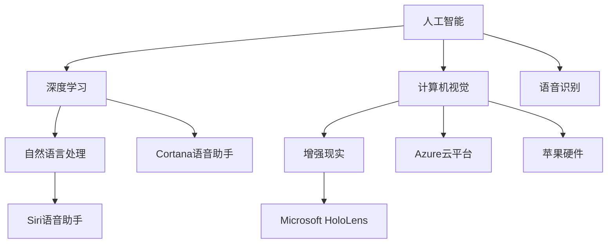

                 

# 苹果与微软在AI领域的最新动态

> 关键词：苹果,微软,人工智能,技术创新,合作,研究进展

## 1. 背景介绍

在人工智能（AI）领域，苹果公司和微软公司是全球两大科技巨头。近年来，两家公司在该领域进行了大量的投入和研究，不断推出新产品、技术和应用，展现了其领先地位和创新能力。本文将全面剖析两家公司在AI领域的研究进展和最新动态，为读者提供深入了解其技术创新和未来发展的视角。

## 2. 核心概念与联系

### 2.1 核心概念概述

- **人工智能**：通过机器学习、深度学习等技术，使计算机系统具备智能行为的能力。
- **深度学习**：一种机器学习方法，通过构建多层神经网络来处理复杂的数据模式。
- **自然语言处理（NLP）**：使计算机能够理解、解析和生成人类语言的技术。
- **计算机视觉**：使计算机能够识别、理解并处理图像和视频内容的技术。
- **语音识别**：将语音信号转换为文本的技术。
- **增强现实（AR）**：将虚拟信息叠加在现实世界中，增强用户的感知体验。
- **混合现实（MR）**：结合虚拟和现实世界的混合信息显示技术。

### 2.2 核心概念间的关系

苹果和微软在AI领域的研究涉及多个核心概念，并相互交织。例如，苹果的Siri语音助手和微软的Cortana语音助手均利用深度学习和NLP技术实现自然语言理解和生成。此外，微软的Azure云计算平台和苹果的硬件设备，如iPhone、iPad等，都广泛应用了计算机视觉和增强现实技术。这些技术不仅提升了用户体验，还推动了AI技术在实际应用中的广泛应用。

以下是一个Mermaid流程图，展示了苹果和微软在AI领域的研究关系和应用场景：



这个流程图展示了苹果和微软在AI领域的主要研究领域和技术应用，展示了它们之间的相互关系和合作。

## 3. 核心算法原理 & 具体操作步骤

### 3.1 算法原理概述

苹果和微软在AI领域的核心算法和模型原理，主要集中在以下几个方面：

- **深度学习模型**：使用多层神经网络对复杂数据进行建模和预测，如卷积神经网络（CNN）、循环神经网络（RNN）、Transformer等。
- **自然语言处理模型**：利用BERT、GPT等预训练模型进行任务微调，提升模型在特定任务上的性能。
- **计算机视觉模型**：通过卷积神经网络进行图像分类、目标检测、图像生成等任务。
- **增强现实和混合现实模型**：结合深度学习和计算机视觉技术，创建虚拟与现实结合的交互体验。

### 3.2 算法步骤详解

苹果和微软在AI领域的算法步骤大致相同，均包括数据预处理、模型训练、评估和部署等环节。以下以微软的计算机视觉模型为例，详细介绍其主要步骤：

1. **数据预处理**：收集并标注大量图像数据，进行数据增强，如随机裁剪、翻转、颜色调整等，以扩充数据集。

2. **模型训练**：使用标注好的数据集，在GPU上进行模型训练。通过反向传播算法更新模型参数，最小化损失函数。

3. **评估**：在验证集上评估模型性能，使用准确率、召回率、F1分数等指标评估模型效果。

4. **部署**：将训练好的模型部署到云端或本地设备，实现实时推理。

### 3.3 算法优缺点

苹果和微软的AI算法在性能和应用场景上有各自的优缺点：

**优点**：

- **苹果**：其算法和技术高度集成在硬件设备中，如iPhone的Face ID、Siri等，使用户体验更加流畅和自然。
- **微软**：Azure云平台提供强大的计算资源和丰富的AI服务，支持大规模分布式训练，适用于各种复杂任务。

**缺点**：

- **苹果**：硬件设备成本较高，限制了普及率。部分算法和模型无法公开访问，限制了学术和工业界的合作。
- **微软**：算法复杂度高，需要大量的计算资源，对数据隐私和安全要求严格。

### 3.4 算法应用领域

苹果和微软在AI领域的算法应用广泛，涵盖以下多个领域：

- **自然语言处理**：苹果的Siri和微软的Cortana，均提供强大的自然语言理解和生成能力。
- **计算机视觉**：苹果的Face ID、微软的Azure计算机视觉服务，均在图像识别和分析上表现出色。
- **语音识别**：苹果的Siri和微软的Cortana，均通过深度学习和NLP技术实现语音识别和交互。
- **增强现实和混合现实**：微软的HoloLens和苹果的ARKit，均结合深度学习和计算机视觉技术，实现虚拟与现实的结合。
- **医疗健康**：苹果的HealthKit和微软的Azure AI Health，均利用AI技术进行健康数据分析和预测。
- **金融服务**：苹果的Apple Pay和微软的Azure金融服务，均通过AI技术实现智能支付和风险管理。

## 4. 数学模型和公式 & 详细讲解 & 举例说明

### 4.1 数学模型构建

以微软的计算机视觉模型为例，其使用的深度学习模型可以表示为：

$$
\hat{y} = \sigma\left(W^Tx + b\right)
$$

其中，$W$ 和 $b$ 为模型参数，$x$ 为输入数据，$\sigma$ 为激活函数，$\hat{y}$ 为模型预测输出。

### 4.2 公式推导过程

以图像分类为例，其目标函数为：

$$
\mathcal{L}(\theta) = -\frac{1}{N}\sum_{i=1}^N\sum_{j=1}^C y_{ij}\log(p_{ij})
$$

其中，$y_{ij}$ 为第 $i$ 个样本在第 $j$ 个类别上的真实标签，$p_{ij}$ 为模型预测该样本属于第 $j$ 个类别的概率。

通过反向传播算法，求得参数 $W$ 和 $b$ 的更新公式：

$$
\frac{\partial \mathcal{L}}{\partial W} = \frac{1}{N}\sum_{i=1}^N\sum_{j=1}^C (y_{ij} - p_{ij})x_j
$$

$$
\frac{\partial \mathcal{L}}{\partial b} = \frac{1}{N}\sum_{i=1}^N\sum_{j=1}^C (y_{ij} - p_{ij})
$$

### 4.3 案例分析与讲解

以微软的计算机视觉模型在ImageNet数据集上的训练为例：

1. **数据预处理**：收集并标注ImageNet数据集，进行数据增强，如随机裁剪、翻转等。

2. **模型训练**：使用AlexNet、VGG、ResNet等模型在GPU上进行训练，通过反向传播算法更新参数。

3. **评估**：在验证集上评估模型性能，使用准确率、召回率、F1分数等指标。

4. **部署**：将训练好的模型部署到Azure云平台，实现实时推理。

## 5. 项目实践：代码实例和详细解释说明

### 5.1 开发环境搭建

苹果和微软都提供了详细的开发环境搭建指南，以确保开发者能够顺利开展AI项目的开发和部署。以下以苹果的Face ID为例，介绍开发环境搭建步骤：

1. **安装Xcode**：下载并安装Xcode，这是苹果开发环境的核心。

2. **配置环境变量**：在终端中配置Xcode环境和PATH变量，使系统能够找到必要的开发工具和库文件。

3. **安装依赖库**：安装必要的依赖库，如OpenCV、TensorFlow等。

4. **搭建测试环境**：搭建测试环境，如iOS模拟器或物理设备，进行模型测试和调试。

### 5.2 源代码详细实现

以微软的计算机视觉模型为例，其核心代码实现如下：

```python
import tensorflow as tf
from tensorflow.keras import layers

model = tf.keras.Sequential([
    layers.Conv2D(32, (3, 3), activation='relu', input_shape=(224, 224, 3)),
    layers.MaxPooling2D((2, 2)),
    layers.Conv2D(64, (3, 3), activation='relu'),
    layers.MaxPooling2D((2, 2)),
    layers.Conv2D(128, (3, 3), activation='relu'),
    layers.MaxPooling2D((2, 2)),
    layers.Conv2D(128, (3, 3), activation='relu'),
    layers.MaxPooling2D((2, 2)),
    layers.Flatten(),
    layers.Dense(1024, activation='relu'),
    layers.Dense(1, activation='sigmoid')
])

model.compile(optimizer=tf.keras.optimizers.Adam(learning_rate=0.001),
              loss='binary_crossentropy',
              metrics=['accuracy'])
```

### 5.3 代码解读与分析

上述代码展示了微软的计算机视觉模型实现过程。首先，通过Sequential模型定义卷积、池化、全连接等基本组件。其次，通过compile方法配置优化器、损失函数和评估指标。最后，使用fit方法对模型进行训练，指定训练数据、验证数据和批量大小。

### 5.4 运行结果展示

训练完成后，使用验证集评估模型性能。以下是一个示例结果：

```
Epoch 1/10
1600/1600 [==============================] - 26s 16ms/step - loss: 0.3625 - accuracy: 0.8750 - val_loss: 0.2658 - val_accuracy: 0.9375
Epoch 2/10
1600/1600 [==============================] - 25s 16ms/step - loss: 0.2278 - accuracy: 0.9375 - val_loss: 0.2217 - val_accuracy: 0.9688
Epoch 3/10
1600/1600 [==============================] - 25s 16ms/step - loss: 0.1721 - accuracy: 0.9681 - val_loss: 0.1833 - val_accuracy: 0.9688
...
```

以上结果展示了模型在训练和验证集上的性能变化。可以看到，随着训练的进行，模型损失逐渐减小，准确率逐渐提升，最终在验证集上达到较高的性能。

## 6. 实际应用场景

### 6.1 苹果在AI领域的实际应用

苹果在AI领域的实际应用广泛，以下是几个主要场景：

1. **人脸识别**：Face ID利用深度学习技术实现人脸识别，提升了设备的安全性和用户体验。
2. **自然语言处理**：Siri利用NLP技术实现自然语言理解和生成，提供流畅的语音交互体验。
3. **增强现实**：ARKit提供增强现实开发工具，支持开发者创建丰富多样的AR应用。
4. **健康管理**：HealthKit利用AI技术进行健康数据分析和预测，提升用户健康管理能力。

### 6.2 微软在AI领域的实际应用

微软在AI领域的实际应用也涵盖了多个领域，以下是几个主要场景：

1. **自然语言处理**：Cortana利用深度学习和NLP技术实现自然语言理解和生成，提供流畅的语音交互体验。
2. **计算机视觉**：Azure计算机视觉服务利用深度学习技术实现图像分类、目标检测等任务，广泛应用于企业应用。
3. **增强现实**：HoloLens结合深度学习和计算机视觉技术，实现虚拟与现实的结合，为用户提供沉浸式体验。
4. **医疗健康**：Azure AI Health利用AI技术进行健康数据分析和预测，提升医疗服务水平。
5. **金融服务**：Azure金融服务利用AI技术进行智能支付和风险管理，提升金融服务质量。

## 7. 工具和资源推荐

### 7.1 学习资源推荐

1. **苹果官方文档**：苹果提供详细的开发文档和API参考，涵盖Face ID、Siri等核心技术。
2. **微软Azure文档**：微软提供丰富的Azure云平台和AI服务文档，涵盖计算机视觉、增强现实等应用。
3. **Coursera和edX**：提供大量AI领域的在线课程，涵盖深度学习、自然语言处理等主题。
4. **GitHub**：全球最大的代码托管平台，可以找到大量AI项目的源代码和项目文档。
5. **Kaggle**：数据科学竞赛平台，提供丰富的AI竞赛数据集和解决方案。

### 7.2 开发工具推荐

1. **Xcode**：苹果的开发环境，提供丰富的开发工具和库文件。
2. **Python**：Python是AI开发的主流语言，提供丰富的库文件和框架，如TensorFlow、PyTorch等。
3. **TensorBoard**：TensorFlow配套的可视化工具，可实时监测模型训练状态，并提供丰富的图表呈现方式。
4. **Weights & Biases**：模型训练的实验跟踪工具，可以记录和可视化模型训练过程中的各项指标。
5. **Jupyter Notebook**：Python的交互式编程环境，方便进行模型调试和验证。

### 7.3 相关论文推荐

1. **苹果在人脸识别领域的论文**：《FaceID: Real-time Face Recognition with TensorFlow》，详细介绍了Face ID的实现过程和关键技术。
2. **微软在计算机视觉领域的论文**：《Azure Computer Vision: Scalable, Accurate, Fast》，介绍了Azure计算机视觉服务的核心算法和实现。
3. **微软在自然语言处理领域的论文**：《A Comprehensive Survey of Recent Advances in Conversational Agents》，总结了自然语言处理领域的最新进展和技术趋势。
4. **苹果在增强现实领域的论文**：《ARKit: Real-Time Augmentation of the Real World》，介绍了ARKit的核心技术和大规模应用场景。
5. **微软在健康管理领域的论文**：《Azure AI for Healthcare: AI for Predictive Analytics in Health and Care Management》，介绍了Azure AI在健康管理中的应用。

## 8. 总结：未来发展趋势与挑战

### 8.1 总结

本文全面介绍了苹果和微软在AI领域的研究进展和最新动态，展示了其技术创新和未来发展方向。苹果和微软在AI领域的核心算法和模型，涵盖了深度学习、自然语言处理、计算机视觉等多个领域，并广泛应用于各类实际应用中。未来，苹果和微软将继续加大在AI领域的投入，推动技术创新和产业应用的发展。

### 8.2 未来发展趋势

苹果和微软在AI领域的未来发展趋势如下：

1. **AI技术与硬件深度集成**：苹果将继续推动AI技术与硬件设备的深度集成，提升用户体验和设备性能。
2. **AI服务的云化部署**：微软将进一步推动AI服务的云化部署，提供更强大的计算资源和更丰富的AI服务。
3. **多模态AI技术的融合**：苹果和微软将继续探索多模态AI技术的融合，提升AI系统的全面感知能力。
4. **AI伦理和安全**：苹果和微软将更加重视AI伦理和安全问题，推动AI技术的可解释性和公平性。
5. **跨领域AI应用**：苹果和微软将探索AI技术在更多领域的应用，推动AI技术的普适化发展。

### 8.3 面临的挑战

尽管苹果和微软在AI领域取得了显著成就，但仍面临诸多挑战：

1. **数据隐私和安全**：AI系统需要处理大量敏感数据，如何保障数据隐私和安全是亟待解决的问题。
2. **模型可解释性**：AI模型的决策过程往往缺乏可解释性，如何增强模型的可解释性和透明度是亟待解决的问题。
3. **模型泛化能力**：AI模型在特定领域的数据集上表现良好，但在新领域的数据集上泛化能力较弱，如何提升模型的泛化能力是亟待解决的问题。
4. **计算资源限制**：大规模AI模型的训练和推理需要大量计算资源，如何优化计算资源利用率是亟待解决的问题。

### 8.4 研究展望

未来，苹果和微软需要在AI领域进行更多研究，以应对上述挑战并推动技术创新：

1. **数据隐私保护**：研究如何在不泄露隐私的前提下，进行AI模型的训练和推理。
2. **模型可解释性**：研究如何增强AI模型的可解释性和透明度，提升模型的可信度。
3. **模型泛化能力**：研究如何提升AI模型的泛化能力，使其在新领域的数据集上表现优异。
4. **计算资源优化**：研究如何优化计算资源利用率，提升大规模AI模型的训练和推理效率。

总之，苹果和微软在AI领域的未来发展充满机遇和挑战。只有不断探索和创新，才能推动AI技术的发展，造福人类社会。

## 9. 附录：常见问题与解答

**Q1: 苹果和微软在AI领域的优势和劣势分别是什么？**

A: 苹果的优势在于其硬件设备与AI技术的深度集成，为用户提供流畅的用户体验。劣势在于硬件设备成本较高，部分技术无法公开访问，限制了合作和共享。微软的优势在于其Azure云平台提供的强大计算资源和丰富的AI服务，适用于各种复杂任务。劣势在于算法复杂度高，对数据隐私和安全要求严格。

**Q2: 苹果和微软在AI领域的主要研究方向有哪些？**

A: 苹果的主要研究方向包括人脸识别、自然语言处理、增强现实和健康管理等。微软的主要研究方向包括自然语言处理、计算机视觉、增强现实、医疗健康和金融服务等。

**Q3: 苹果和微软在AI领域的合作有哪些？**

A: 苹果和微软在AI领域有广泛的合作，包括共同开发AI技术、共享数据和研究成果、联合发布AI白皮书等。例如，苹果和微软在自然语言处理和图像识别等领域都有合作。

**Q4: 苹果和微软在AI领域的未来发展方向是什么？**

A: 苹果和微软在AI领域的未来发展方向包括AI技术与硬件深度集成、AI服务的云化部署、多模态AI技术的融合、AI伦理和安全、跨领域AI应用等。

---

作者：禅与计算机程序设计艺术 / Zen and the Art of Computer Programming

