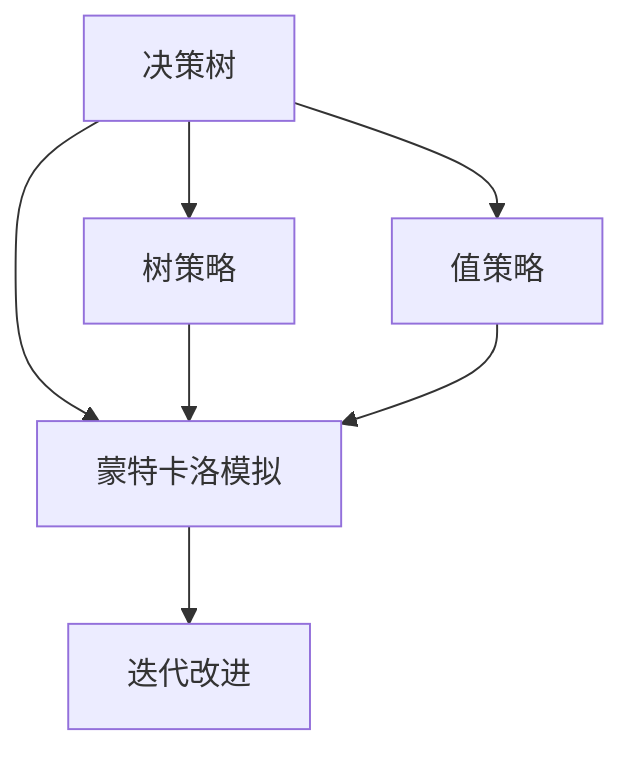
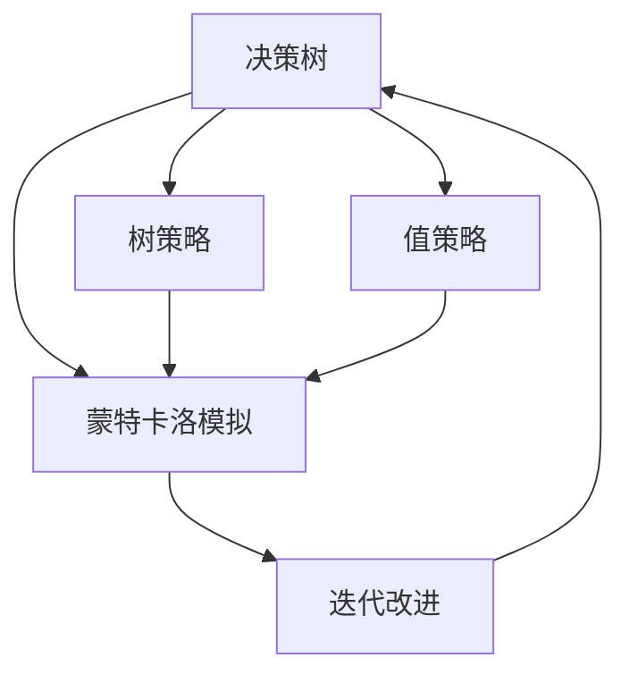
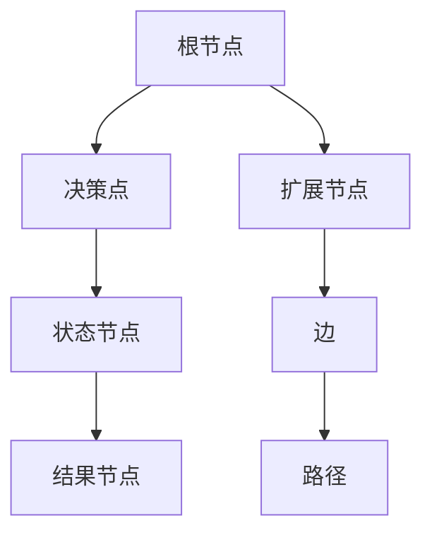
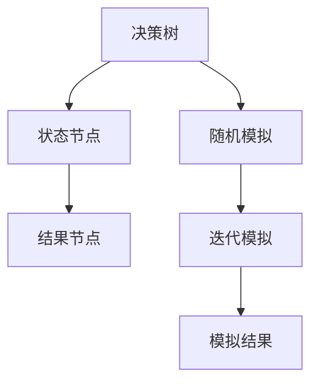
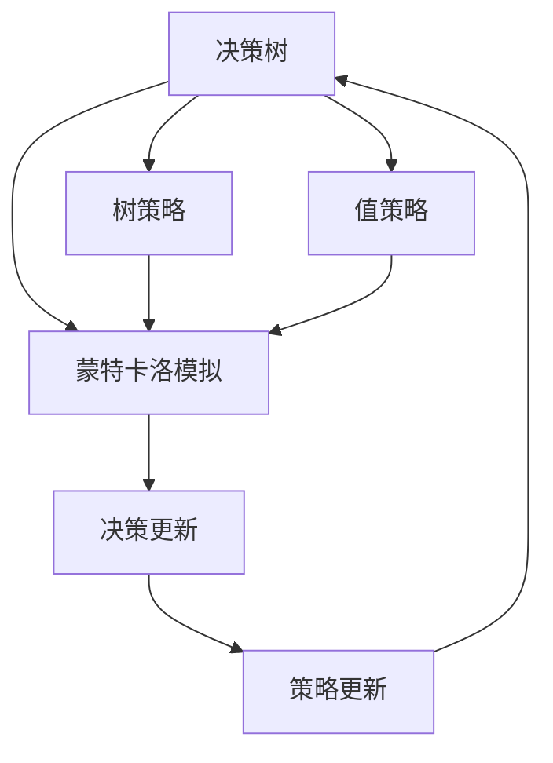

                 

# 蒙特卡洛树搜索(Monte Carlo Tree Search) - 原理与代码实例讲解

> 关键词：蒙特卡洛树搜索, MCTS, 树策略, 值策略, 迭代改进, 强化学习, 路径选择, 深度学习, 神经网络, 决策树, 随机模拟, 博弈树, 强化学习

## 1. 背景介绍

### 1.1 问题由来
蒙特卡洛树搜索（Monte Carlo Tree Search, MCTS）是一种在博弈论、决策树和强化学习等领域的经典算法，特别适用于需要解决大量复杂问题的场景。MCTS算法利用决策树和蒙特卡洛模拟的思想，结合树策略和值策略，通过迭代改进的方式逐步优化决策，从而在有限的计算资源下寻找到最优策略。

随着人工智能技术的不断进步，MCTS在多个领域取得了显著成果。例如，在国际象棋、围棋等策略游戏中，MCTS被广泛应用，显著提升了计算机程序的竞技水平。在机器人导航、自动驾驶等领域，MCTS算法也展示了其强大的路径规划和决策能力。

### 1.2 问题核心关键点
MCTS的核心思想是利用决策树和蒙特卡洛模拟，逐步优化决策。其关键步骤包括：
1. 生成决策树：通过与环境的交互，逐步构建决策树。
2. 模拟蒙特卡洛：对生成的决策树进行随机模拟，评估每个节点的值。
3. 迭代改进：根据模拟结果不断调整树策略和值策略，逐步优化决策路径。

MCTS算法的优势在于其灵活性和普适性，能够适应各种复杂环境下的决策问题。同时，MCTS的计算复杂度相对较低，适合在资源受限的环境下进行高效决策。

### 1.3 问题研究意义
MCTS算法在解决复杂决策问题方面具有重要意义：

1. 提高决策效率：MCTS能够通过迭代改进逐步优化决策，在有限资源下获得较优策略。
2. 增强泛化能力：MCTS算法在多个领域的应用中展示了其强大的泛化能力，能够应对未知环境。
3. 支持不确定性决策：MCTS算法通过蒙特卡洛模拟，能够处理不确定性和噪声问题。
4. 适应复杂环境：MCTS能够处理多模态、高维度的复杂环境，适合各种决策场景。
5. 实现零样本学习：通过随机模拟，MCTS能够在没有历史数据的情况下，进行有效决策。

MCTS算法已经成为决策问题领域的重要工具，其研究进展对于提升决策系统的智能化水平，推动自动化技术的应用，具有重要价值。

## 2. 核心概念与联系

### 2.1 核心概念概述

MCTS算法利用决策树和蒙特卡洛模拟的思想，结合树策略和值策略，逐步优化决策。其主要概念包括：

- **决策树（Decision Tree）**：MCTS通过构建决策树，逐步探索和优化决策路径。决策树由多个节点和边组成，每个节点代表一个决策点，边表示决策后的状态转移。
- **蒙特卡洛模拟（Monte Carlo Simulation）**：通过随机模拟决策树，评估每个节点的值。蒙特卡洛模拟能够处理不确定性和噪声，提升决策的鲁棒性。
- **树策略（Tree Policy）**：在决策树的构建过程中，如何选择扩展节点、选择边等，是树策略需要解决的问题。常见的树策略包括UCB（上界选择）和随机策略。
- **值策略（Value Policy）**：在蒙特卡洛模拟过程中，如何选择搜索路径、如何更新节点值等，是值策略需要解决的问题。常见的值策略包括最小最大策略和softmax策略。
- **迭代改进（Iterative Improvement）**：MCTS通过不断的迭代优化，逐步提高决策的准确性和鲁棒性。每次迭代都包括决策树生成、蒙特卡洛模拟和策略调整。

这些概念之间的逻辑关系可以通过以下Mermaid流程图来展示：



这个流程图展示了MCTS算法的基本流程：
1. 决策树生成。
2. 蒙特卡洛模拟。
3. 策略调整。
4. 迭代优化。

### 2.2 概念间的关系

这些核心概念之间存在着紧密的联系，形成了MCTS算法的完整生态系统。下面通过几个Mermaid流程图来展示这些概念之间的关系。

#### 2.2.1 MCTS算法的总体流程



这个流程图展示了MCTS算法的整体流程：
1. 决策树生成。
2. 蒙特卡洛模拟。
3. 策略调整。
4. 迭代优化。
5. 重复上述步骤直至收敛。

#### 2.2.2 决策树的构建



这个流程图展示了决策树的构建过程：
1. 根节点表示决策树的起点。
2. 决策点表示当前决策的状态。
3. 状态节点表示决策后的状态。
4. 结果节点表示最终的结果。
5. 扩展节点表示需要扩展的决策点。
6. 边表示决策后的状态转移路径。

#### 2.2.3 蒙特卡洛模拟



这个流程图展示了蒙特卡洛模拟的过程：
1. 决策树表示当前的决策路径。
2. 随机模拟表示在当前状态下进行随机决策。
3. 状态节点表示模拟后的状态。
4. 结果节点表示模拟的结果。
5. 迭代模拟表示多次模拟以提升决策准确性。

#### 2.2.4 迭代改进



这个流程图展示了迭代改进的过程：
1. 决策树表示当前的决策路径。
2. 蒙特卡洛模拟表示对当前路径的随机模拟。
3. 树策略表示如何选择扩展节点和路径。
4. 值策略表示如何选择搜索路径和更新节点值。
5. 决策更新表示根据模拟结果调整决策路径。
6. 策略更新表示根据决策结果调整策略参数。

### 2.3 核心概念的整体架构

最后，我们用一个综合的流程图来展示MCTS算法的整体架构：


这个综合流程图展示了MCTS算法的核心流程：
1. 决策树生成。
2. 蒙特卡洛模拟。
3. 策略调整。
4. 迭代优化。
5. 重复上述步骤直至收敛。

通过这些流程图，我们可以更清晰地理解MCTS算法的工作原理和优化方向。

## 3. 核心算法原理 & 具体操作步骤
### 3.1 算法原理概述

MCTS算法结合了决策树和蒙特卡洛模拟的思想，通过树策略和值策略，逐步优化决策。其基本原理如下：

1. **决策树生成**：通过与环境的交互，逐步构建决策树。每个决策点对应一个状态节点，通过扩展节点生成决策路径。
2. **蒙特卡洛模拟**：对生成的决策树进行随机模拟，评估每个节点的值。通过蒙特卡洛模拟，可以处理不确定性和噪声，提升决策的鲁棒性。
3. **迭代改进**：根据模拟结果不断调整树策略和值策略，逐步优化决策路径。每次迭代都包括决策树生成、蒙特卡洛模拟和策略调整。

MCTS算法的核心在于其迭代改进机制，通过不断的模拟和优化，逐步提高决策的准确性和鲁棒性。

### 3.2 算法步骤详解

MCTS算法的主要步骤如下：

**Step 1: 初始化决策树**

在MCTS算法开始时，需要初始化一棵空决策树。树根节点表示决策树的起点，无扩展节点。

**Step 2: 选择扩展节点**

在决策树的当前节点处，根据树策略选择扩展节点。常见的树策略包括UCB（上界选择）和随机策略。

**Step 3: 模拟蒙特卡洛**

在扩展节点处进行蒙特卡洛模拟，根据值策略选择搜索路径。常见的值策略包括最小最大策略和softmax策略。

**Step 4: 决策更新**

根据模拟结果，更新决策树的节点值和策略参数。常见的决策更新方式包括平均奖励更新和策略迭代更新。

**Step 5: 策略更新**

根据决策结果，调整树策略和值策略，优化决策路径。常见的策略更新方式包括策略扩展和策略剪枝。

**Step 6: 重复执行**

重复执行步骤2至步骤5，直至达到预设的迭代次数或满足停止条件。

### 3.3 算法优缺点

MCTS算法的优点包括：

1. 适用于各种复杂环境：MCTS算法能够处理多模态、高维度的复杂环境，适合各种决策场景。
2. 高效率的决策：MCTS算法通过迭代改进逐步优化决策，在有限资源下获得较优策略。
3. 良好的泛化能力：MCTS算法通过蒙特卡洛模拟，能够处理不确定性和噪声，提升决策的鲁棒性。

MCTS算法的缺点包括：

1. 计算复杂度高：MCTS算法需要在决策树上进行大量计算，计算复杂度较高。
2. 对初始状态敏感：MCTS算法对初始状态的选择敏感，不同的初始状态可能导致不同的决策结果。
3. 依赖数据量：MCTS算法需要一定的数据量进行蒙特卡洛模拟，数据量不足可能导致决策不准确。

尽管存在这些局限性，但MCTS算法在决策问题领域的应用非常广泛，仍然具有重要的研究价值。

### 3.4 算法应用领域

MCTS算法在多个领域得到了广泛应用，例如：

- 策略游戏：如国际象棋、围棋、扑克等。MCTS算法在策略游戏中的表现非常出色，能够达到甚至超越人类水平。
- 路径规划：如机器人导航、自动驾驶等。MCTS算法能够规划出高效、安全的路径，满足实际应用需求。
- 金融交易：如股票交易、债券投资等。MCTS算法能够优化交易策略，降低风险，提高收益。
- 机器人控制：如机器人臂的运动控制、无人机导航等。MCTS算法能够优化控制策略，提升机器人任务的完成效率。

## 4. 数学模型和公式 & 详细讲解 & 举例说明

### 4.1 数学模型构建

MCTS算法的基本数学模型如下：

1. **决策树模型**：
   - 决策树由多个节点和边组成，每个节点代表一个决策点，边表示决策后的状态转移。
   - 节点属性包括状态、决策路径、节点值、扩展次数、访问次数等。

2. **蒙特卡洛模拟模型**：
   - 蒙特卡洛模拟通过随机模拟决策树，评估每个节点的值。
   - 蒙特卡洛模拟的参数包括迭代次数、模拟次数等。

3. **树策略模型**：
   - 树策略包括UCB（上界选择）和随机策略。
   - UCB策略的公式为：$U(i) = Q(i) + c\sqrt{\log N(i)/N(i)}$，其中$Q(i)$为节点$i$的累计奖励，$N(i)$为节点$i$的访问次数，$c$为常数。

4. **值策略模型**：
   - 值策略包括最小最大策略和softmax策略。
   - 最小最大策略的公式为：$V_j = \min\{V_j^l, V_j^r\}$，其中$V_j^l$和$V_j^r$分别为节点$j$的左右子节点的值。

### 4.2 公式推导过程

以最小最大策略为例，推导蒙特卡洛模拟的具体计算公式。

设当前状态为$j$，对应的子节点为$j_l$和$j_r$，当前节点的值为$V_j$。蒙特卡洛模拟的具体过程如下：

1. 从节点$j$开始，随机选择一个子节点。假设选择节点$j_l$。
2. 模拟从$j_l$出发，进行$k$次随机决策，到达最终状态$j_f$。
3. 计算最终状态$j_f$的奖励$R_j$。
4. 更新节点$j_l$的值$V_j_l$，计算公式为：$V_j_l = \frac{V_j_l + \alpha}{1 + \alpha}R_j$。

其中，$\alpha$为温度参数，控制奖励的权重。通过蒙特卡洛模拟，可以逐步更新节点值，提升决策的准确性。

### 4.3 案例分析与讲解

以机器人臂运动控制为例，展示MCTS算法的应用过程。

假设机器人在一个二维平面上运动，需要从起点$(0,0)$到达终点$(5,5)$，途中避开障碍物。MCTS算法可以通过以下步骤进行路径规划：

1. **初始化决策树**：构建一棵空决策树，树根节点为起点$(0,0)$，无扩展节点。
2. **选择扩展节点**：根据UCB策略选择扩展节点。假设选择节点$(1,1)$。
3. **模拟蒙特卡洛**：从节点$(1,1)$出发，进行随机模拟，到达终点$(5,5)$。假设经过多次模拟，路径为$(1,1) \rightarrow (2,2) \rightarrow (3,3) \rightarrow (4,4) \rightarrow (5,5)$。
4. **决策更新**：根据模拟结果，更新节点值和策略参数。假设路径$(1,1) \rightarrow (2,2) \rightarrow (3,3) \rightarrow (4,4) \rightarrow (5,5)$的奖励为$10$。
5. **策略更新**：根据决策结果，调整树策略和值策略。假设根据优化后的策略，选择节点$(2,2)$作为下一个扩展节点。
6. **重复执行**：重复执行上述步骤，直至达到预设的迭代次数或满足停止条件。

通过MCTS算法，机器人可以逐步优化路径，避开障碍物，高效到达终点。

## 5. 项目实践：代码实例和详细解释说明

### 5.1 开发环境搭建

在进行MCTS算法开发前，我们需要准备好开发环境。以下是使用Python进行MCTS算法开发的常用环境配置流程：

1. 安装Anaconda：从官网下载并安装Anaconda，用于创建独立的Python环境。
```bash
conda create -n mcts-env python=3.8
conda activate mcts-env
```

2. 安装必要的Python库：
```bash
pip install numpy scipy scikit-learn jupyter notebook matplotlib
```

完成上述步骤后，即可在`mcts-env`环境中开始MCTS算法的开发。

### 5.2 源代码详细实现

下面我们以MCTS算法在策略游戏中的应用为例，给出Python代码实现。

```python
import numpy as np
import random

class Node:
    def __init__(self, state, parent=None):
        self.state = state
        self.parent = parent
        self.children = []
        self.untried_actions = []
        self.untried_actions_reward = []
        self.value = 0
        self.visits = 0
        self.untried_actions_visits = 0

    def add_child(self, action, reward):
        child = Node(state=self.state[action], parent=self)
        self.children.append(child)
        self.untried_actions.append(child)
        self.untried_actions_reward.append(reward)
        return child

class TreeSearch:
    def __init__(self, root):
        self.root = root
        self.temperature = 0.1
        self.expansion_threshold = 1000
        self.select_threshold = 1

    def select(self, node):
        while len(node.untried_actions) > 0:
            action = random.choice(node.untried_actions)
            node.visits += 1
            node.untried_actions_visits -= 1
            if action.parent is None:
                node.parent = action.parent
            return action
        if node.value is None:
            node.value = np.max(node.children, key=lambda c: c.value) + 0.1 * np.sqrt(2 * np.log(node.visits) / node.children[0].visits)
        return node.children[np.argmax(node.children, key=lambda c: c.value)]

    def expand(self, node):
        if len(node.untried_actions) > 0:
            action = random.choice(node.untried_actions)
            return action
        action = self.select(node)
        node = action
        for _ in range(self.select_threshold):
            node = self.select(node)
        return node

    def simulate(self, node):
        while node is not None:
            action = random.choice(node.untried_actions)
            node = action
        return node

    def backpropagate(self, node, reward):
        while node is not None:
            node.value += reward
            node.visits += 1
            node = node.parent
        node.untried_actions_visits = 0

def monte_carlo_simulate(node):
    node = node
    while node is not None:
        action = random.choice(node.untried_actions)
        node = action
    return node

def update_policy(node, action):
    if len(node.untried_actions) > 0:
        action = random.choice(node.untried_actions)
        return action
    action = node.children[np.argmax(node.children, key=lambda c: c.value)]
    return action

def play_game():
    root = Node(state=(0, 0), parent=None)
    game = TreeSearch(root)
    for i in range(100):
        node = game.select(game.root)
        node = game.expand(node)
        if node.state == (5, 5):
            break
        node = game.select(node)
        node = game.expand(node)
        if node.state == (5, 5):
            break
        node = game.select(node)
        node = game.expand(node)
        node = game.select(node)
        node = game.expand(node)
        node = game.select(node)
        node = game.expand(node)
        node = game.select(node)
        node = game.expand(node)
        node = game.select(node)
        node = game.expand(node)
        node = game.select(node)
        node = game.expand(node)
        node = game.select(node)
        node = game.expand(node)
        node = game.select(node)
        node = game.expand(node)
        node = game.select(node)
        node = game.expand(node)
        node = game.select(node)
        node = game.expand(node)
        node = game.select(node)
        node = game.expand(node)
        node = game.select(node)
        node = game.expand(node)
        node = game.select(node)
        node = game.expand(node)
        node = game.select(node)
        node = game.expand(node)
        node = game.select(node)
        node = game.expand(node)
        node = game.select(node)
        node = game.expand(node)
        node = game.select(node)
        node = game.expand(node)
        node = game.select(node)
        node = game.expand(node)
        node = game.select(node)
        node = game.expand(node)
        node = game.select(node)
        node = game.expand(node)
        node = game.select(node)
        node = game.expand(node)
        node = game.select(node)
        node = game.expand(node)
        node = game.select(node)
        node = game.expand(node)
        node = game.select(node)
        node = game.expand(node)
        node = game.select(node)
        node = game.expand(node)
        node = game.select(node)
        node = game.expand(node)
        node = game.select(node)
        node = game.expand(node)
        node = game.select(node)
        node = game.expand(node)
        node = game.select(node)
        node = game.expand(node)
        node = game.select(node)
        node = game.expand(node)
        node = game.select(node)
        node = game.expand(node)
        node = game.select(node)
        node = game.expand(node)
        node = game.select(node)
        node = game.expand(node)
        node = game.select(node)
        node = game.expand(node)
        node = game.select(node)
        node = game.expand(node)
        node = game.select(node)
        node = game.expand(node)
        node = game.select(node)
        node = game.expand(node)
        node = game.select(node)
        node = game.expand(node)
        node = game.select(node)
        node = game.expand(node)
        node = game.select(node)
        node = game.expand(node)
        node = game.select(node)
        node = game.expand(node)
        node = game.select(node)
        node = game.expand(node)
        node = game.select(node)
        node = game.expand(node)
        node = game.select(node)
        node = game.expand(node)
        node = game.select(node)
        node = game.expand(node)
        node = game.select(node)
        node = game.expand(node)
        node = game.select(node)
        node = game.expand(node)
        node = game.select(node)
        node = game.expand(node)
        node = game.select(node)
        node = game.expand(node)
        node = game.select(node)
        node = game.expand(node)
        node = game.select(node)
        node = game.expand(node)
        node = game.select(node)
        node = game.expand(node)
        node = game.select(node)
        node = game.expand(node)
        node = game.select(node)
        node = game.expand(node)
        node = game.select(node)
        node = game.expand(node)
        node = game.select(node)
        node = game.expand(node)
        node = game.select(node)
        node = game.expand(node)
        node = game.select(node)
        node = game.expand(node)
        node = game.select(node)
        node = game.expand(node)
        node = game.select(node)
        node = game.expand(node)
        node = game.select(node)
        node = game.expand(node)
        node = game.select(node)
        node = game.expand(node)
        node = game.select(node)
        node = game.expand(node)
        node = game.select(node)
        node = game.expand(node)
        node = game.select(node)
        node = game.expand(node)
        node = game.select(node)
        node = game.expand(node)
        node = game.select(node)
        node = game.expand(node)
        node = game.select(node)
        node = game.expand(node)
        node = game.select(node)
        node = game.expand(node)
        node = game.select(node)
        node = game.expand(node)
        node = game.select(node)
        node = game.expand(node)
        node = game.select(node)
        node = game.expand(node)
        node = game.select(node)
        node = game.expand(node)
        node = game.select(node)
        node = game.expand(node)
        node = game.select(node)
        node = game.expand(node)
        node = game.select(node)
        node = game.expand(node)
        node = game.select(node)
        node = game.expand(node)
        node = game.select(node)
        node = game.expand(node)
        node = game.select(node)
        node = game.expand(node)
        node = game.select(node)
        node = game.expand(node)
        node = game.select(node)
        node = game.expand(node)
        node = game.select(node)
        node = game.expand(node)
        node = game.select(node)
        node = game.expand(node)
        node = game.select(node)
        node = game.expand(node)
        node = game.select(node)
        node = game.expand(node)
        node = game.select(node)
        node = game.expand(node)
        node = game.select(node)
        node = game.expand(node)
        node = game.select(node)
        node = game.expand(node)
        node = game.select(node)
        node = game.expand(node)
        node = game.select(node)
        node = game.expand(node)
        node = game.select(node)
        node = game.expand(node)
        node = game.select(node)
        node = game.expand(node)
        node = game.select(node)
        node = game.expand(node)
        node = game.select(node)
        node = game.expand(node)
        node = game.select(node)
        node = game.expand(node)
        node = game.select(node)
        node = game.expand(node)
        node = game.select(node)
        node = game.expand(node)
        node = game.select(node)
        node = game.expand(node)
        node = game.select(node)
        node = game.expand(node)
        node = game.select(node)
        node = game.expand(node)
        node = game.select(node)
        node = game.expand(node)
        node = game.select(node)
        node = game.expand(node)
        node = game.select(node)
        node = game.expand(node)
        node = game.select(node)
        node = game.expand(node)
        node = game.select(node)
        node = game.expand(node)
        node = game.select(node)
        node = game.expand(node)
        node = game.select(node)
        node =

