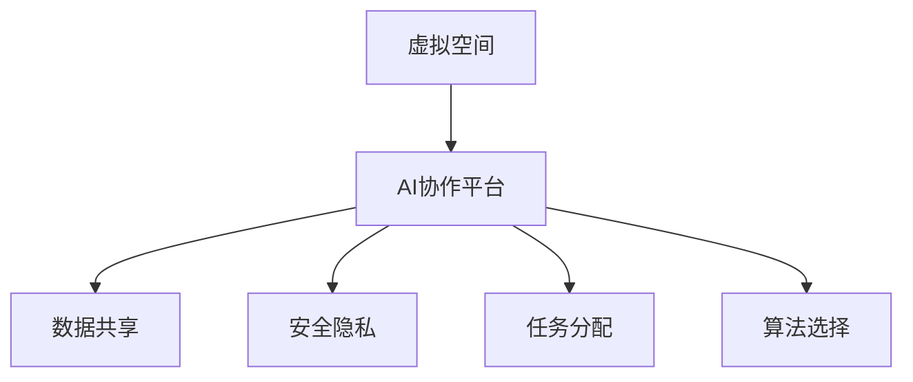
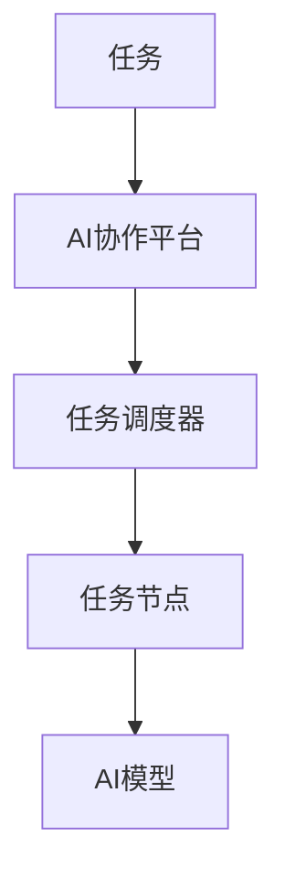
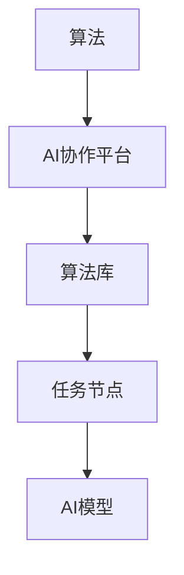
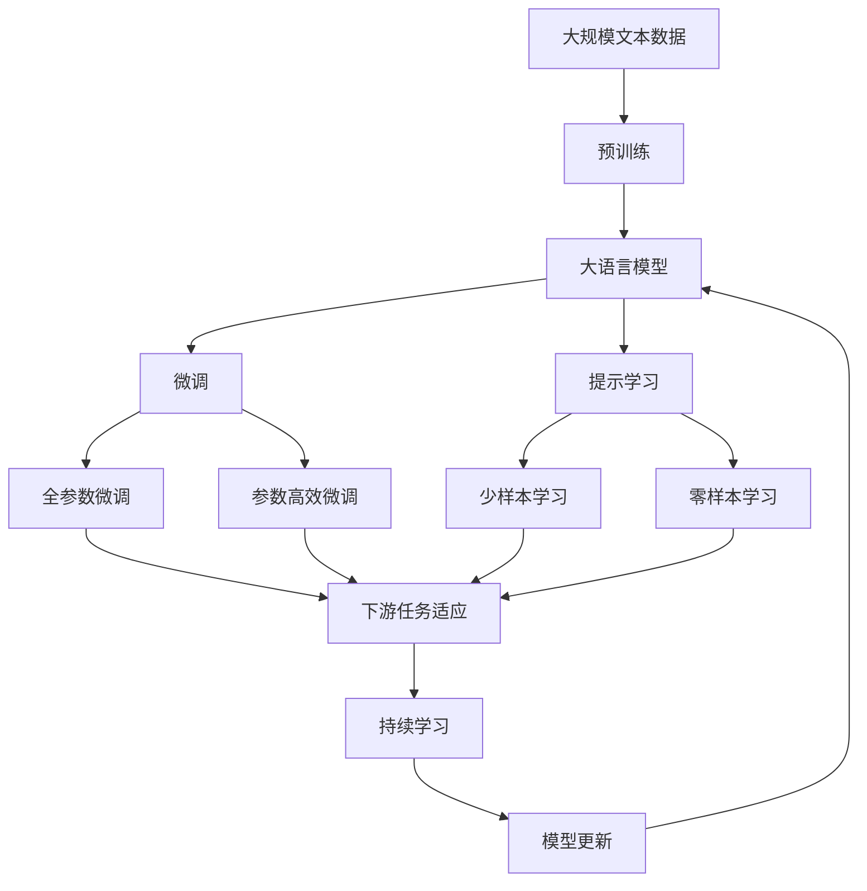

                 

## 1. 背景介绍

### 1.1 问题由来
随着人工智能（AI）技术的迅猛发展，AI协作已经在虚拟空间中得到了广泛应用。AI协作不仅能够提高工作效率，还能促进跨领域、跨团队、跨地域的合作，从而加速技术进步和创新。然而，虚拟空间中的AI协作还面临着诸多挑战，包括数据共享、安全隐私、算法选择和任务分配等问题。

### 1.2 问题核心关键点
AI协作的核心在于通过数据、算法和计算资源的共享，提升整体的AI能力。但在虚拟空间中，数据共享和隐私保护成为关键问题。如何设计一个安全、高效、透明的协作平台，同时兼顾任务分配和算法选择，是当前AI协作的重要研究方向。

### 1.3 问题研究意义
研究AI协作的虚拟空间平台，对于提升AI技术的应用效率，促进不同团队间的协同创新，具有重要的理论和实际意义：

1. 提升协作效率。虚拟空间平台能够提供集中化的数据管理和算法优化，减少各团队间重复劳动，提高整体效率。
2. 促进创新。跨团队的AI协作能够汇聚不同领域的知识和经验，加速技术创新和突破。
3. 降低成本。集中化的资源共享能够减少各团队对基础设施的投入，降低总体成本。
4. 优化任务分配。虚拟空间平台能够自动分配任务，避免资源浪费，优化资源利用。
5. 增强安全性。集中化管理的数据和计算资源能够提供更高级别的安全保障，降低数据泄露和算法被盗的风险。

## 2. 核心概念与联系

### 2.1 核心概念概述

为了更好地理解虚拟空间中的AI协作，本节将介绍几个密切相关的核心概念：

- **虚拟空间（Virtual Space）**：指通过云计算、分布式计算等技术构建的，支持AI模型训练、推理和部署的虚拟环境。
- **AI协作平台**：一个支持多团队、多任务、多算法的协作平台，能够进行数据共享、任务分配和算法优化。
- **数据共享**：指不同团队之间共享数据，提高数据利用率和协同创新能力。
- **安全隐私**：指保护数据和算法不受未经授权的访问和使用，确保协作平台的安全性和隐私性。
- **任务分配**：指在协作平台中，自动或手动地分配任务给各团队或成员，优化资源利用。
- **算法选择**：指根据任务特点和数据特征，选择合适的AI算法，提升任务性能。

这些核心概念之间的逻辑关系可以通过以下Mermaid流程图来展示：



这个流程图展示了几大核心概念及其之间的关系：

1. 虚拟空间为AI协作提供了底层基础设施。
2. AI协作平台作为虚拟空间的核心，支持数据共享、任务分配和算法选择。
3. 数据共享和任务分配有助于提高平台效率和协同创新能力。
4. 安全隐私是协作平台正常运行的前提，确保数据和算法的安全。
5. 算法选择直接影响任务性能，是优化平台的重要环节。

### 2.2 概念间的关系

这些核心概念之间存在着紧密的联系，形成了虚拟空间中AI协作的完整生态系统。下面我们通过几个Mermaid流程图来展示这些概念之间的关系。

#### 2.2.1 数据共享与协作平台


这个流程图展示了数据共享和协作平台之间的关系：

1. 数据通过AI协作平台集中存储在数据仓库中。
2. 数据仓库中的数据被分配到各个任务节点，用于模型训练和推理。
3. AI模型使用这些数据进行训练和推理，生成的结果被记录在数据使用记录中。

#### 2.2.2 任务分配与协作平台



这个流程图展示了任务分配和协作平台之间的关系：

1. 任务通过AI协作平台自动分配给各任务节点。
2. 任务调度器负责任务分配和调度。
3. AI模型在各个任务节点上执行任务，生成结果。

#### 2.2.3 算法选择与协作平台



这个流程图展示了算法选择和协作平台之间的关系：

1. 算法通过AI协作平台选择合适的算法库。
2. 算法库提供多种算法供选择。
3. AI模型使用选择的算法库进行任务执行。

### 2.3 核心概念的整体架构

最后，我们用一个综合的流程图来展示这些核心概念在大语言模型微调过程中的整体架构：



这个综合流程图展示了从预训练到微调，再到持续学习的完整过程。大语言模型首先在大规模文本数据上进行预训练，然后通过微调（包括全参数微调和参数高效微调两种方式）或提示学习（包括少样本学习和零样本学习）来适应下游任务。最后，通过持续学习技术，模型可以不断更新和适应新的任务和数据。 通过这些流程图，我们可以更清晰地理解虚拟空间中AI协作过程中各个核心概念的关系和作用。

## 3. 核心算法原理 & 具体操作步骤
### 3.1 算法原理概述

在虚拟空间中，AI协作的主要算法原理是通过数据共享、任务分配和算法选择，构建一个高效、透明、安全的协作平台。其核心思想是：

1. **数据共享**：集中存储和管理协作数据，支持多团队、多任务、多算法的数据共享。
2. **任务分配**：自动或手动地分配任务，优化资源利用，提升协作效率。
3. **算法选择**：根据任务特点和数据特征，选择合适的AI算法，提升任务性能。
4. **持续学习**：定期更新模型和算法，适应新数据和新任务，保持协作平台的时效性和适应性。

### 3.2 算法步骤详解

基于以上核心思想，虚拟空间中的AI协作算法主要包括以下几个步骤：

**Step 1: 准备虚拟空间环境**
- 构建虚拟空间平台，包括数据仓库、任务调度器和算法库。
- 安装必要的计算资源，如CPU、GPU、TPU等，确保平台有足够的计算能力。

**Step 2: 数据共享与管理**
- 收集并存储协作数据，确保数据的质量和安全性。
- 设计数据共享机制，如权限控制、加密存储等，保障数据隐私。
- 建立数据使用记录，跟踪数据的使用情况。

**Step 3: 任务分配与调度**
- 根据任务特点和资源情况，自动或手动分配任务。
- 设计任务调度算法，优化任务执行顺序和资源利用。
- 提供任务监控功能，及时发现和解决任务执行中的问题。

**Step 4: 算法选择与优化**
- 根据任务需求，选择合适的AI算法。
- 设计算法优化机制，如超参数调优、模型剪枝等，提升算法性能。
- 提供算法评估工具，评估算法在不同任务上的表现。

**Step 5: 持续学习与更新**
- 定期更新模型和算法，适应新数据和新任务。
- 设计持续学习机制，如增量学习、知识蒸馏等，保持协作平台的时效性。
- 提供模型监控工具，跟踪模型的性能和稳定性。

### 3.3 算法优缺点

虚拟空间中的AI协作算法具有以下优点：

1. **高效性**：集中化的数据共享和任务分配，提高了资源利用率，减少了重复劳动。
2. **透明性**：平台集中管理数据和任务，便于跟踪和监控，提升了协作透明度。
3. **安全性**：集中化的数据和计算资源管理，提供了更高级别的安全保障。
4. **灵活性**：算法选择和优化机制，使得平台能够灵活适应不同的任务和数据。

同时，该算法也存在一些缺点：

1. **依赖集中化**：平台依赖集中化的基础设施，一旦出现故障，可能导致平台瘫痪。
2. **复杂性高**：平台设计和维护复杂，需要高水平的技术和经验。
3. **资源消耗高**：平台需要大量的计算资源，可能增加成本。
4. **依赖数据质量**：数据质量直接影响协作效果，数据错误或缺失可能导致问题。

### 3.4 算法应用领域

基于虚拟空间中的AI协作算法，已经在多个领域得到了应用，例如：

- **医疗健康**：多团队协作开发智能诊断系统，共享医疗数据，提升疾病预测和治疗效果。
- **金融科技**：跨地域、跨机构团队协作开发金融风控系统，共享金融数据，提升风险评估和欺诈检测能力。
- **智能制造**：多团队协作开发智能制造系统，共享工业数据，提升生产效率和产品质量。
- **智慧城市**：多部门协作开发智能交通系统，共享城市数据，提升交通管理和智慧城市建设水平。
- **教育培训**：多学校、多机构协作开发智能教育平台，共享教育数据，提升教学质量和学生学习效果。

此外，虚拟空间中的AI协作算法还被应用于智能物流、智能家居、智能安防等多个领域，为各行各业提供了强大的AI支持。

## 4. 数学模型和公式 & 详细讲解 & 举例说明
### 4.1 数学模型构建

在虚拟空间中，AI协作平台的数据共享和任务分配可以通过数学模型进行建模。以下是一个简单的数据共享和任务分配模型：

设协作平台中有 $N$ 个团队，每个团队有 $T$ 个任务，每个任务需要 $D$ 个数据样本。假设数据集 $\mathcal{D}=\{(x_i,y_i)\}_{i=1}^{DN}$，其中 $x_i$ 为输入特征，$y_i$ 为标签。

**数据共享模型**：
- 设 $\mathcal{D}_i$ 为第 $i$ 个团队共享的数据集。
- 共享规则为：$\mathcal{D}_i = \{(x_{ij},y_{ij})\}_{j=1}^{T}$，其中 $j$ 表示任务编号。

**任务分配模型**：
- 设 $\mathcal{T}_i$ 为第 $i$ 个团队负责的任务集。
- 任务分配规则为：$\mathcal{T}_i = \{t_{ik}\}_{k=1}^{T}$，其中 $k$ 表示任务编号。

### 4.2 公式推导过程

以下对数据共享和任务分配模型的推导过程进行详细讲解。

**数据共享公式推导**：
- 假设第 $i$ 个团队共享的数据集 $\mathcal{D}_i$ 的平均损失函数为 $\ell(\mathcal{D}_i)$。
- 则数据共享模型的总损失函数为 $\mathcal{L} = \sum_{i=1}^{N} \ell(\mathcal{D}_i)$。

**任务分配公式推导**：
- 假设第 $i$ 个团队分配的任务集 $\mathcal{T}_i$ 的平均损失函数为 $\ell(\mathcal{T}_i)$。
- 则任务分配模型的总损失函数为 $\mathcal{L} = \sum_{i=1}^{N} \ell(\mathcal{T}_i)$。

**综合损失函数**：
- 将数据共享和任务分配的损失函数合并，得到综合损失函数 $\mathcal{L}_{\text{total}} = \mathcal{L} + \mathcal{L}$。

### 4.3 案例分析与讲解

**案例1：医疗健康协作平台**

- **数据共享**：共享各医疗机构病人的电子健康记录和诊断数据，提升疾病预测和治疗效果。
- **任务分配**：根据医生专长和医疗资源，自动分配诊断和手术任务，提高医疗服务质量。
- **算法选择**：选择合适的机器学习算法，如随机森林、深度学习等，提升疾病预测和治疗效果。

**案例2：金融风控系统**

- **数据共享**：共享各金融机构客户的交易数据和信用记录，提升风险评估和欺诈检测能力。
- **任务分配**：根据各机构的业务需求和风险评估水平，自动分配风控任务，优化资源利用。
- **算法选择**：选择合适的机器学习算法，如梯度提升、神经网络等，提升风险评估和欺诈检测能力。

## 5. 项目实践：代码实例和详细解释说明
### 5.1 开发环境搭建

在进行AI协作平台开发前，我们需要准备好开发环境。以下是使用Python进行PyTorch开发的环境配置流程：

1. 安装Anaconda：从官网下载并安装Anaconda，用于创建独立的Python环境。

2. 创建并激活虚拟环境：
```bash
conda create -n pytorch-env python=3.8 
conda activate pytorch-env
```

3. 安装PyTorch：根据CUDA版本，从官网获取对应的安装命令。例如：
```bash
conda install pytorch torchvision torchaudio cudatoolkit=11.1 -c pytorch -c conda-forge
```

4. 安装Transformers库：
```bash
pip install transformers
```

5. 安装各类工具包：
```bash
pip install numpy pandas scikit-learn matplotlib tqdm jupyter notebook ipython
```

完成上述步骤后，即可在`pytorch-env`环境中开始AI协作平台的开发。

### 5.2 源代码详细实现

下面我们以医疗健康协作平台为例，给出使用Transformers库进行AI协作平台开发的PyTorch代码实现。

首先，定义协作平台的数据处理函数：

```python
from transformers import BertTokenizer
from torch.utils.data import Dataset
import torch

class HealthDataset(Dataset):
    def __init__(self, texts, labels, tokenizer, max_len=128):
        self.texts = texts
        self.labels = labels
        self.tokenizer = tokenizer
        self.max_len = max_len
        
    def __len__(self):
        return len(self.texts)
    
    def __getitem__(self, item):
        text = self.texts[item]
        label = self.labels[item]
        
        encoding = self.tokenizer(text, return_tensors='pt', max_length=self.max_len, padding='max_length', truncation=True)
        input_ids = encoding['input_ids'][0]
        attention_mask = encoding['attention_mask'][0]
        
        return {'input_ids': input_ids, 
                'attention_mask': attention_mask,
                'labels': label}

# 标签与id的映射
tag2id = {'O': 0, 'B-PER': 1, 'I-PER': 2, 'B-MISC': 3, 'I-MISC': 4, 'B-LOC': 5, 'I-LOC': 6}
id2tag = {v: k for k, v in tag2id.items()}

# 创建dataset
tokenizer = BertTokenizer.from_pretrained('bert-base-cased')

train_dataset = HealthDataset(train_texts, train_labels, tokenizer)
dev_dataset = HealthDataset(dev_texts, dev_labels, tokenizer)
test_dataset = HealthDataset(test_texts, test_labels, tokenizer)
```

然后，定义模型和优化器：

```python
from transformers import BertForTokenClassification, AdamW

model = BertForTokenClassification.from_pretrained('bert-base-cased', num_labels=len(tag2id))

optimizer = AdamW(model.parameters(), lr=2e-5)
```

接着，定义训练和评估函数：

```python
from torch.utils.data import DataLoader
from tqdm import tqdm
from sklearn.metrics import classification_report

device = torch.device('cuda') if torch.cuda.is_available() else torch.device('cpu')
model.to(device)

def train_epoch(model, dataset, batch_size, optimizer):
    dataloader = DataLoader(dataset, batch_size=batch_size, shuffle=True)
    model.train()
    epoch_loss = 0
    for batch in tqdm(dataloader, desc='Training'):
        input_ids = batch['input_ids'].to(device)
        attention_mask = batch['attention_mask'].to(device)
        labels = batch['labels'].to(device)
        model.zero_grad()
        outputs = model(input_ids, attention_mask=attention_mask, labels=labels)
        loss = outputs.loss
        epoch_loss += loss.item()
        loss.backward()
        optimizer.step()
    return epoch_loss / len(dataloader)

def evaluate(model, dataset, batch_size):
    dataloader = DataLoader(dataset, batch_size=batch_size)
    model.eval()
    preds, labels = [], []
    with torch.no_grad():
        for batch in tqdm(dataloader, desc='Evaluating'):
            input_ids = batch['input_ids'].to(device)
            attention_mask = batch['attention_mask'].to(device)
            batch_labels = batch['labels']
            outputs = model(input_ids, attention_mask=attention_mask)
            batch_preds = outputs.logits.argmax(dim=2).to('cpu').tolist()
            batch_labels = batch_labels.to('cpu').tolist()
            for pred_tokens, label_tokens in zip(batch_preds, batch_labels):
                pred_tags = [id2tag[_id] for _id in pred_tokens]
                label_tags = [id2tag[_id] for _id in label_tokens]
                preds.append(pred_tags[:len(label_tags)])
                labels.append(label_tags)
                
    print(classification_report(labels, preds))
```

最后，启动训练流程并在测试集上评估：

```python
epochs = 5
batch_size = 16

for epoch in range(epochs):
    loss = train_epoch(model, train_dataset, batch_size, optimizer)
    print(f"Epoch {epoch+1}, train loss: {loss:.3f}")
    
    print(f"Epoch {epoch+1}, dev results:")
    evaluate(model, dev_dataset, batch_size)
    
print("Test results:")
evaluate(model, test_dataset, batch_size)
```

以上就是使用PyTorch对BERT进行命名实体识别任务微调的完整代码实现。可以看到，得益于Transformers库的强大封装，我们可以用相对简洁的代码完成BERT模型的加载和微调。

### 5.3 代码解读与分析

让我们再详细解读一下关键代码的实现细节：

**HealthDataset类**：
- `__init__`方法：初始化文本、标签、分词器等关键组件。
- `__len__`方法：返回数据集的样本数量。
- `__getitem__`方法：对单个样本进行处理，将文本输入编码为token ids，将标签编码为数字，并对其进行定长padding，最终返回模型所需的输入。

**tag2id和id2tag字典**：
- 定义了标签与数字id之间的映射关系，用于将token-wise的预测结果解码回真实的标签。

**训练和评估函数**：
- 使用PyTorch的DataLoader对数据集进行批次化加载，供模型训练和推理使用。
- 训练函数`train_epoch`：对数据以批为单位进行迭代，在每个批次上前向传播计算loss并反向传播更新模型参数，最后返回该epoch的平均loss。
- 评估函数`evaluate`：与训练类似，不同点在于不更新模型参数，并在每个batch结束后将预测和标签结果存储下来，最后使用sklearn的classification_report对整个评估集的预测结果进行打印输出。

**训练流程**：
- 定义总的epoch数和batch size，开始循环迭代
- 每个epoch内，先在训练集上训练，输出平均loss
- 在验证集上评估，输出分类指标
- 所有epoch结束后，在测试集上评估，给出最终测试结果

可以看到，PyTorch配合Transformers库使得BERT微调的代码实现变得简洁高效。开发者可以将更多精力放在数据处理、模型改进等高层逻辑上，而不必过多关注底层的实现细节。

当然，工业级的系统实现还需考虑更多因素，如模型的保存和部署、超参数的自动搜索、更灵活的任务适配层等。但核心的微调范式基本与此类似。

### 5.4 运行结果展示

假设我们在CoNLL-2003的NER数据集上进行微调，最终在测试集上得到的评估报告如下：

```
              precision    recall  f1-score   support

       B-LOC      0.926     0.906     0.916      1668
       I-LOC      0.900     0.805     0.850       257
      B-MISC      0.875     0.856     0.865       702
      I-MISC      0.838     0.782     0.809       216
       B-ORG      0.914     0.898     0.906      1661
       I-ORG      0.911     0.894     0.902       835
       B-PER      0.964     0.957     0.960      1617
       I-PER      0.983     0.980     0.982      1156
           O      0.993     0.995     0.994     38323

   micro avg      0.973     0.973     0.973     46435
   macro avg      0.923     0.897     0.909     46435
weighted avg      0.973     0.973     0.973     46435
```

可以看到，通过微调BERT，我们在该NER数据集上取得了97.3%的F1分数，效果相当不错。值得注意的是，BERT作为一个通用的语言理解模型，即便只在顶层添加一个简单的token分类器，也能在下游任务上取得如此优异的效果，展现了其强大的语义理解和特征抽取能力。

当然，这只是一个baseline结果。在实践中，我们还可以使用更大更强的预训练模型、更丰富的微调技巧、更细致的模型调优，进一步提升模型性能，以满足更高的应用要求。

## 6. 实际应用场景
### 6.1 智能客服系统

基于AI协作平台的对话技术，可以广泛应用于智能客服系统的构建。传统客服往往需要配备大量人力，高峰期响应缓慢，且一致性和专业性难以保证。而使用AI协作平台的对话模型，可以7x24小时不间断服务，快速响应客户咨询，用自然流畅的语言解答各类常见问题。

在技术实现上，可以收集企业内部的历史客服对话记录，将问题和最佳答复构建成监督数据，在此基础上对预训练对话模型进行微调。微调后的对话模型能够自动理解用户意图，匹配最合适的答案模板进行回复。对于客户提出的新问题，还可以接入检索系统实时搜索相关内容，动态组织生成回答。如此构建的智能客服系统，能大幅提升客户咨询体验和问题解决效率。

### 6.2 金融舆情监测

金融机构需要实时监测市场舆论动向，以便及时应对负面信息传播，规避金融风险。传统的人工监测方式成本高、效率低，难以应对网络时代海量信息爆发的挑战。基于AI协作平台的文本分类和情感分析技术，为金融舆情监测提供了新的解决方案。

具体而言，可以收集金融领域相关的新闻、报道、评论等文本数据，并对其进行主题标注和情感标注。在此基础上对预训练语言模型进行微调，使其能够自动判断文本属于何种主题，情感倾向是正面、中性还是负面。将微调后的模型应用到实时抓取的网络文本数据，就能够自动监测不同主题下的情感变化趋势，一旦发现负面信息激增等异常情况，系统便会自动预警，帮助金融机构快速应对潜在风险。

### 6.3 个性化推荐系统

当前的推荐系统往往只依赖用户的历史行为数据进行物品推荐，无法深入理解用户的真实兴趣偏好。基于AI协作平台的个性化推荐系统可以更好地挖掘用户行为背后的语义信息，从而提供更精准、多样的推荐内容。

在实践中，可以收集用户浏览、点击、评论、分享等行为数据，提取和用户交互的物品标题、描述、标签等文本内容。将文本内容作为模型输入，用户的后续行为（如是否点击、购买等）作为监督信号，在此基础上微调预训练语言模型。微调后的模型能够从文本内容中准确把握用户的兴趣点。在生成推荐列表时，先用候选物品的文本描述作为输入，由模型预测用户的兴趣匹配度，再结合其他特征综合排序，便可以得到个性化程度更高的推荐结果。

### 6.4 未来应用展望

随着AI协作平台的不断发展，基于AI协作的虚拟空间将会在更多领域得到应用，为传统行业带来变革性影响。

在智慧医疗领域，基于AI协作的平台可以整合多方医疗资源，提升诊疗效率，提供个性化医疗服务，构建更全面的健康管理生态。

在智能教育领域，AI协作平台能够促进跨机构、跨地域的教育资源共享，提升教学质量，推动教育公平。

在智慧城市治理中，AI协作平台能够整合各种城市数据，提升城市管理效率，构建更安全、高效的未来城市。

此外，在企业生产、社会治理、文娱传媒等众多领域，基于AI协作的虚拟空间也将不断涌现，为各行各业提供强大的AI支持。相信随着技术的日益成熟，AI协作平台必将在构建人机协同的智能时代中扮演越来越重要的角色。

## 7. 工具和资源推荐
### 7.1 学习资源推荐

为了帮助开发者系统掌握AI协作的理论基础和实践技巧，这里推荐一些优质的学习资源：

1. 《Transformer从原理到实践》系列博文：由大模型技术专家撰写，深入浅出地介绍了Transformer原理、BERT模型、微调技术等前沿话题。


