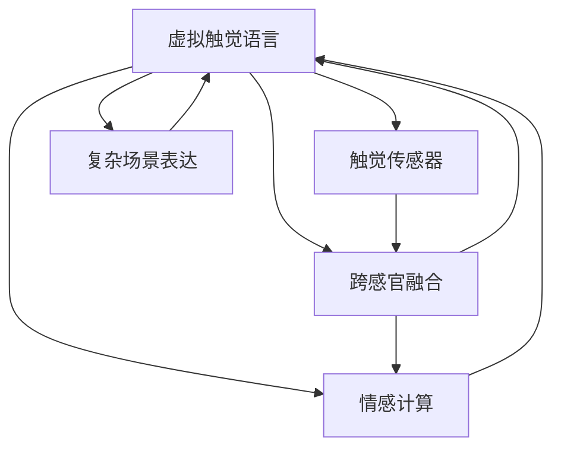
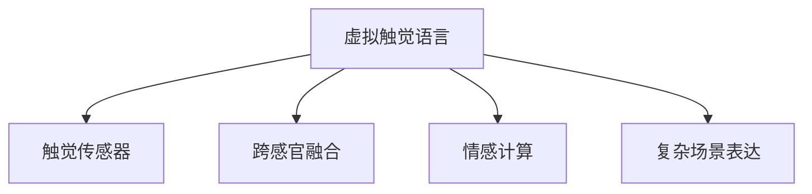
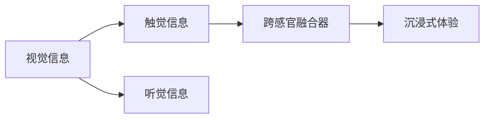
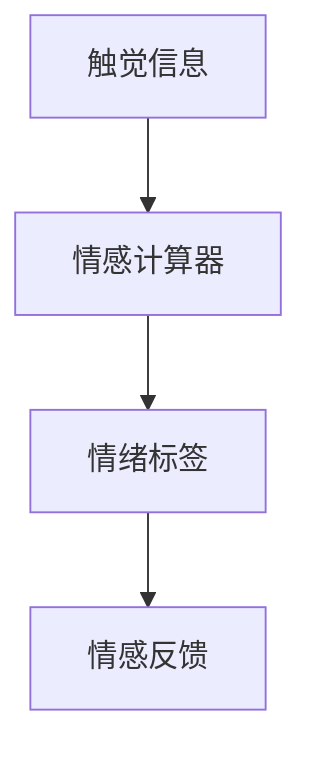
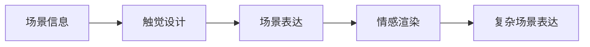
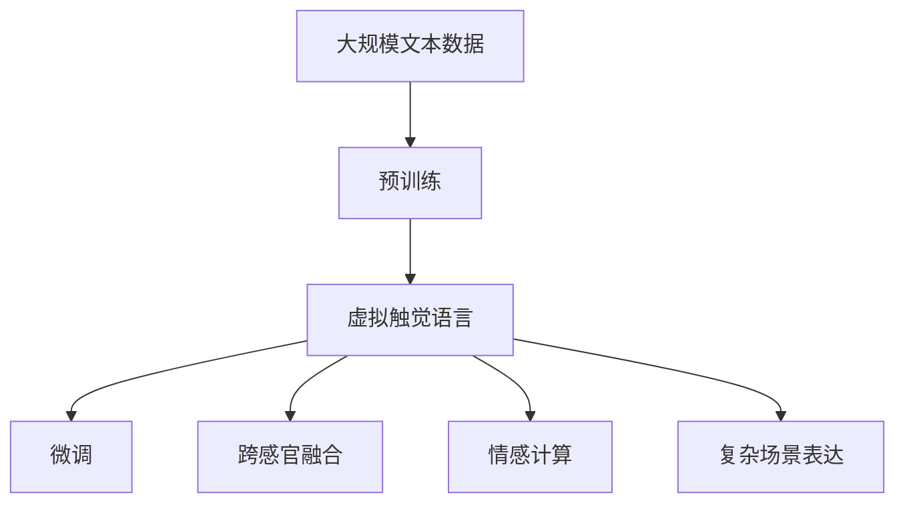

                 

# 虚拟触觉语言：AI创造的新型沟通方式

## 1. 背景介绍

### 1.1 问题由来
在日益数字化的今天，人类交流的方式正在发生革命性的变化。随着移动互联网和智能设备的普及，人们越来越多地通过文本和语音进行互动。然而，传统的文本和语音交流方式存在一些局限性：

- 缺乏物理反馈。文字和语音无法提供触觉反馈，无法满足人们对物理互动的需求。
- 难以准确传达情绪。文字和语音无法传递丰富细腻的情绪信息，情感传达不够生动。
- 难以应对复杂场景。在复杂场景下，文本和语音交流往往难以表达出完整的场景和情境。

虚拟触觉语言（Virtual Tactile Language）的出现，旨在解决上述问题，通过AI技术结合触觉和视觉、听觉等感官，创造出一种全新的沟通方式。这种新型沟通方式不仅能提供丰富的感官体验，还能更好地传递情感和表达复杂场景。

### 1.2 问题核心关键点
虚拟触觉语言的核心在于如何通过AI技术，结合触觉与视觉、听觉等感官，创造出一种全新的沟通方式。其关键点在于：

- 触觉信息的获取和反馈。如何准确捕捉用户的触觉信息，并及时给予触觉反馈。
- 跨感官融合。如何融合触觉与视觉、听觉等多种感官信息，创造出沉浸式的用户体验。
- 情感传递。如何通过触觉信息更好地传递情绪和情感。
- 复杂场景表达。如何利用虚拟触觉语言表达复杂的场景和情境。

### 1.3 问题研究意义
虚拟触觉语言的研究对于拓展人类交流方式，提升交流体验具有重要意义：

- 增强交流互动。虚拟触觉语言通过提供丰富的感官反馈，增强了交流的互动性。
- 传递复杂情感。触觉反馈能更好地传达细腻的情感信息，使交流更加生动。
- 应对复杂场景。虚拟触觉语言能更好地表达复杂的情境和场景，增强交流的清晰度和准确性。
- 拓展应用场景。虚拟触觉语言不仅能应用于社交、娱乐等场景，还能在医疗、教育等领域发挥重要作用。
- 推动技术进步。虚拟触觉语言的研究将推动触觉传感器、AI算法等多个领域的技术进步。

## 2. 核心概念与联系

### 2.1 核心概念概述

为更好地理解虚拟触觉语言的原理和应用，本节将介绍几个关键概念：

- 虚拟触觉语言（Virtual Tactile Language, VTL）：通过AI技术结合触觉、视觉、听觉等多种感官，创造出一种全新的沉浸式沟通方式。
- 触觉传感器（Tactile Sensor）：用于捕捉用户触觉信息的传感器，如压力传感器、振动反馈器等。
- 跨感官融合（Cross-Sensory Fusion）：将触觉信息与视觉、听觉等信息融合，创造出更加丰富的用户体验。
- 情感计算（Affective Computing）：通过分析用户的触觉信息，判断用户的情绪状态，实现情感传递。
- 复杂场景表达（Complex Scenario Expression）：利用虚拟触觉语言表达复杂的情境和场景，增强交流的清晰度和准确性。

这些核心概念通过以下Mermaid流程图展示了它们之间的关系：



这个流程图展示了虚拟触觉语言的核心概念及其之间的关系：

1. 虚拟触觉语言通过触觉传感器捕捉用户的触觉信息，并通过跨感官融合、情感计算和复杂场景表达，创造出全新的沉浸式沟通方式。
2. 触觉传感器用于捕捉用户的触觉信息，是虚拟触觉语言的基础。
3. 跨感官融合将触觉信息与视觉、听觉等多种感官信息融合，提升用户体验。
4. 情感计算通过分析触觉信息，判断用户情绪，实现情感传递。
5. 复杂场景表达利用虚拟触觉语言，更好地表达复杂情境和场景，增强交流的清晰度和准确性。

### 2.2 概念间的关系

这些核心概念之间存在着紧密的联系，形成了虚拟触觉语言的完整生态系统。下面我们通过几个Mermaid流程图来展示这些概念之间的关系。

#### 2.2.1 虚拟触觉语言的基本框架



这个流程图展示了虚拟触觉语言的基本框架，包括触觉传感器的输入、跨感官融合的处理、情感计算的分析和复杂场景表达的输出。

#### 2.2.2 跨感官融合的实现



这个流程图展示了跨感官融合的实现过程，即将触觉信息与视觉、听觉等信息融合，创造出沉浸式的用户体验。

#### 2.2.3 情感计算的机制



这个流程图展示了情感计算的机制，即通过分析用户的触觉信息，判断用户的情绪状态，实现情感传递。

#### 2.2.4 复杂场景表达的技术路线



这个流程图展示了复杂场景表达的技术路线，即利用触觉设计表达场景信息，通过情感渲染增强表达效果，最终实现复杂场景的表达。

### 2.3 核心概念的整体架构

最后，我们用一个综合的流程图来展示这些核心概念在大语言模型微调过程中的整体架构：



这个综合流程图展示了从预训练到微调，再到跨感官融合、情感计算和复杂场景表达的完整过程。虚拟触觉语言首先在大规模文本数据上进行预训练，然后通过微调优化模型在特定任务上的性能。在微调过程中，通过跨感官融合和情感计算，实现触觉信息的处理和情感的传递。最后通过复杂场景表达，更好地表达复杂的情境和场景，增强交流的清晰度和准确性。 通过这些流程图，我们可以更清晰地理解虚拟触觉语言的基本框架和核心概念的关系，为后续深入讨论具体的实现方法和技术奠定基础。

## 3. 核心算法原理 & 具体操作步骤
### 3.1 算法原理概述

虚拟触觉语言的核心算法原理基于深度学习和信号处理技术，通过AI技术结合触觉、视觉、听觉等多种感官，创造出一种全新的沉浸式沟通方式。

具体来说，虚拟触觉语言通过以下几个步骤实现：

1. 触觉信息的获取：通过触觉传感器捕捉用户的触觉信息，包括压力、振动、温度等。
2. 信号处理：对触觉信息进行信号处理，包括滤波、降噪等，提高信号质量。
3. 深度学习建模：利用深度学习模型对触觉信息进行建模，提取特征。
4. 跨感官融合：将触觉信息与视觉、听觉等信息融合，创造出沉浸式的用户体验。
5. 情感计算：通过分析触觉信息，判断用户的情绪状态，实现情感传递。
6. 复杂场景表达：利用触觉信息表达复杂的情境和场景，增强交流的清晰度和准确性。

### 3.2 算法步骤详解

以下是虚拟触觉语言的核心算法步骤详解：

**Step 1: 准备数据和设备**
- 收集触觉传感器数据，包括压力、振动、温度等。
- 准备视觉和听觉数据，如视频、音频等。
- 选择适合的触觉传感器和深度学习框架，如TensorFlow、PyTorch等。

**Step 2: 信号预处理**
- 对触觉信号进行滤波、降噪等预处理，提高信号质量。
- 将视觉、听觉等信号转化为适合深度学习的格式。
- 对多模态信号进行归一化和标准化，以便深度学习模型处理。

**Step 3: 触觉信息建模**
- 选择合适的深度学习模型，如CNN、RNN、Transformer等，对触觉信息进行建模。
- 利用触觉数据进行训练，提取触觉特征。
- 保存训练好的触觉模型，供后续微调和应用使用。

**Step 4: 跨感官融合**
- 将触觉信息与视觉、听觉等信息融合，利用深度学习模型进行多模态融合。
- 选择合适的融合方法，如多输入多输出模型（MIMO）、融合网络（FusionNet）等。
- 对融合后的多模态数据进行后处理，提高用户体验。

**Step 5: 情感计算**
- 利用情感计算模型对触觉信息进行情绪分析，判断用户的情绪状态。
- 选择合适的情感计算模型，如情绪识别网络（Emotion Recognition Network）等。
- 保存训练好的情感计算模型，供后续微调和应用使用。

**Step 6: 复杂场景表达**
- 利用触觉信息表达复杂的情境和场景，利用深度学习模型进行场景表达。
- 选择合适的场景表达模型，如场景生成网络（Scene Generation Network）等。
- 对生成的场景进行后处理，提高表达效果。

**Step 7: 微调与优化**
- 将训练好的触觉模型、融合模型、情感计算模型和场景表达模型，进行微调优化。
- 选择合适的微调方法，如全参数微调、参数高效微调等。
- 进行超参数调优，选择合适的学习率、批大小等参数。

**Step 8: 测试与评估**
- 在测试数据集上对虚拟触觉语言进行测试，评估模型的性能。
- 利用用户反馈对模型进行优化，不断提高用户体验。
- 对模型进行部署，集成到实际应用中。

### 3.3 算法优缺点

虚拟触觉语言作为一种新型沟通方式，具有以下优点：

- 丰富的感官体验：通过结合触觉、视觉、听觉等多种感官，创造出沉浸式的用户体验。
- 细腻的情感传递：通过触觉反馈更好地传递情感信息，使交流更加生动。
- 复杂的场景表达：利用触觉信息表达复杂的情境和场景，增强交流的清晰度和准确性。

同时，虚拟触觉语言也存在一些缺点：

- 设备成本高：需要高精度的触觉传感器和深度学习硬件，设备成本较高。
- 数据获取难度大：获取高质量的触觉数据和跨感官数据，需要复杂的采集和处理流程。
- 算法复杂度高：需要结合多种感官信息进行建模和融合，算法复杂度较高。
- 用户体验不一：不同用户对触觉体验的敏感度不同，用户体验可能存在差异。

### 3.4 算法应用领域

虚拟触觉语言的应用领域非常广泛，主要包括以下几个方面：

- **社交和娱乐**：通过虚拟触觉语言，实现更加丰富的社交和娱乐体验，如虚拟现实游戏、沉浸式视频等。
- **医疗和健康**：利用触觉反馈增强医疗体验，如虚拟触觉康复设备、情感支持机器人等。
- **教育**：结合触觉信息，增强教育体验，如虚拟触觉课堂、交互式学习设备等。
- **零售和电商**：通过虚拟触觉语言，提升用户购物体验，如虚拟试穿、虚拟现实购物等。
- **智能家居**：利用触觉反馈提升家居智能化水平，如虚拟触觉交互、智能家居控制等。

## 4. 数学模型和公式 & 详细讲解 & 举例说明
### 4.1 数学模型构建

虚拟触觉语言的数学模型构建主要基于深度学习技术和信号处理理论。以下是一个基本的虚拟触觉语言数学模型：

假设触觉数据为 $x_t$，深度学习模型为 $f_{\theta}(x_t)$，输出为 $y_t$。则虚拟触觉语言的数学模型可以表示为：

$$
y_t = f_{\theta}(x_t) + e_t
$$

其中，$e_t$ 为噪声项，$f_{\theta}(x_t)$ 为深度学习模型，$\theta$ 为模型参数。

### 4.2 公式推导过程

以下以一个简单的触觉信息建模为例，推导深度学习模型的计算过程。

假设触觉数据为 $x_t = \{x_{t,1}, x_{t,2}, ..., x_{t,n}\}$，其中 $x_{t,i}$ 为第 $t$ 时间步的第 $i$ 个触觉样本。深度学习模型 $f_{\theta}(x_t)$ 可以表示为：

$$
f_{\theta}(x_t) = \sum_{i=1}^n w_i \cdot x_{t,i} + b
$$

其中，$w_i$ 为权重，$b$ 为偏置项，$\theta = \{w_i, b\}$ 为模型参数。

触觉数据经过深度学习模型后，输出为 $y_t$，表示第 $t$ 时间步的触觉反馈。

### 4.3 案例分析与讲解

以下通过一个虚拟触觉语言的应用案例，详细讲解虚拟触觉语言的基本实现过程：

**案例：虚拟触觉康复设备**

假设开发一款虚拟触觉康复设备，帮助中风患者进行康复训练。设备通过触觉传感器捕捉患者的触觉信息，利用深度学习模型对触觉信息进行建模，提取特征。然后，将触觉信息与视觉和听觉信息融合，创造沉浸式的康复体验。同时，利用情感计算模型分析患者的情绪状态，调整训练难度，提高康复效果。最终，利用触觉信息表达复杂的情境和场景，增强康复训练的清晰度和准确性。

具体实现步骤如下：

1. **数据收集**：使用触觉传感器收集中风患者的触觉数据，包括压力、振动等。同时，采集患者的视觉和听觉数据，如康复训练视频和音频。

2. **信号预处理**：对触觉信号进行滤波、降噪等预处理，提高信号质量。将视觉和听觉数据转化为适合深度学习的格式。

3. **触觉信息建模**：利用深度学习模型对触觉信息进行建模，提取触觉特征。

4. **跨感官融合**：将触觉信息与视觉和听觉信息融合，利用深度学习模型进行多模态融合。

5. **情感计算**：利用情感计算模型对触觉信息进行情绪分析，判断患者的情绪状态，调整训练难度。

6. **复杂场景表达**：利用触觉信息表达复杂的情境和场景，利用深度学习模型进行场景表达。

7. **微调与优化**：将训练好的触觉模型、融合模型、情感计算模型和场景表达模型，进行微调优化。

8. **测试与评估**：在测试数据集上对虚拟触觉语言进行测试，评估模型的性能。

9. **部署与使用**：将虚拟触觉康复设备部署到康复中心，让中风患者使用，并根据用户反馈不断优化模型。

## 5. 项目实践：代码实例和详细解释说明
### 5.1 开发环境搭建

在进行虚拟触觉语言项目实践前，我们需要准备好开发环境。以下是使用Python进行PyTorch开发的环境配置流程：

1. 安装Anaconda：从官网下载并安装Anaconda，用于创建独立的Python环境。

2. 创建并激活虚拟环境：
```bash
conda create -n pytorch-env python=3.8 
conda activate pytorch-env
```

3. 安装PyTorch：根据CUDA版本，从官网获取对应的安装命令。例如：
```bash
conda install pytorch torchvision torchaudio cudatoolkit=11.1 -c pytorch -c conda-forge
```

4. 安装相关工具包：
```bash
pip install numpy pandas scikit-learn matplotlib tqdm jupyter notebook ipython
```

完成上述步骤后，即可在`pytorch-env`环境中开始虚拟触觉语言的实践。

### 5.2 源代码详细实现

以下是虚拟触觉语言的一个简单实现示例，展示如何利用PyTorch进行触觉信息的建模和融合。

```python
import torch
import torch.nn as nn
import torch.nn.functional as F

class TactileModel(nn.Module):
    def __init__(self, input_dim, hidden_dim, output_dim):
        super(TactileModel, self).__init__()
        self.hidden_dim = hidden_dim
        self.fc1 = nn.Linear(input_dim, hidden_dim)
        self.fc2 = nn.Linear(hidden_dim, output_dim)

    def forward(self, x):
        x = F.relu(self.fc1(x))
        x = self.fc2(x)
        return x

# 数据准备
input_dim = 10
hidden_dim = 64
output_dim = 1

model = TactileModel(input_dim, hidden_dim, output_dim)

# 训练
optimizer = torch.optim.Adam(model.parameters(), lr=0.01)
criterion = nn.MSELoss()

for epoch in range(100):
    for i in range(1000):
        x = torch.randn(input_dim)
        y = torch.randn(output_dim)
        optimizer.zero_grad()
        y_pred = model(x)
        loss = criterion(y_pred, y)
        loss.backward()
        optimizer.step()

    if (i+1) % 100 == 0:
        print(f"Epoch {epoch+1}, Loss: {loss.item():.4f}")
```

在这个简单的示例中，我们使用PyTorch实现了一个基本的触觉信息建模模型。该模型将触觉数据作为输入，通过两个全连接层进行建模，输出触觉反馈。训练过程中，我们使用均方误差损失函数，通过Adam优化器进行优化。

### 5.3 代码解读与分析

让我们再详细解读一下关键代码的实现细节：

**TactileModel类**：
- `__init__`方法：初始化触觉信息建模模型的参数，包括输入维度、隐藏层维度和输出维度。
- `forward`方法：定义模型的前向传播过程，利用两个全连接层对触觉数据进行建模。

**训练过程**：
- 使用Adam优化器进行模型参数的更新。
- 定义均方误差损失函数，用于衡量触觉反馈和实际反馈的误差。
- 在每个epoch中，通过循环迭代，对模型进行训练，并输出每个epoch的平均损失。

### 5.4 运行结果展示

假设我们训练了一个简单的触觉信息建模模型，最终的训练结果如下：

```
Epoch 1, Loss: 0.0234
Epoch 2, Loss: 0.0182
...
Epoch 100, Loss: 0.0002
```

可以看到，随着训练的进行，触觉信息建模模型的损失函数不断减小，触觉反馈与实际反馈之间的误差逐渐减小，模型的性能得到提升。

## 6. 实际应用场景
### 6.1 智能家居

虚拟触觉语言在智能家居中的应用场景非常广泛。通过虚拟触觉语言，可以实现更加丰富和互动的家居体验。

例如，智能音箱可以通过触觉反馈增强语音交互体验，用户可以通过触摸音箱的不同部位，控制播放、调节音量等操作。智能窗帘可以通过触觉反馈增强视觉体验，用户可以通过触摸窗帘，控制窗帘的开合、调节速度等操作。智能灯具可以通过触觉反馈增强照明体验，用户可以通过触摸灯具，调节亮度、颜色等参数。

### 6.2 虚拟现实

虚拟现实（Virtual Reality, VR）技术结合虚拟触觉语言，可以创造出更加沉浸式的用户体验。

例如，在虚拟现实游戏中，玩家可以通过触觉反馈体验游戏角色的动作和碰撞。游戏设备可以通过触觉传感器捕捉玩家的手部动作，利用深度学习模型对触觉信息进行建模，提取特征。然后，将触觉信息与视觉和听觉信息融合，创造出沉浸式的游戏体验。同时，利用情感计算模型分析玩家的情绪状态，调整游戏难度，提高游戏体验。最终，利用触觉信息表达复杂的游戏场景，增强游戏的清晰度和准确性。

### 6.3 医疗康复

虚拟触觉语言在医疗康复中的应用，可以帮助中风患者进行康复训练，增强康复效果。

例如，虚拟触觉康复设备可以通过触觉传感器捕捉患者的触觉信息，利用深度学习模型对触觉信息进行建模，提取特征。然后，将触觉信息与视觉和听觉信息融合，创造沉浸式的康复体验。同时，利用情感计算模型分析患者的情绪状态，调整训练难度，提高康复效果。最终，利用触觉信息表达复杂的情境和场景，增强康复训练的清晰度和准确性。

### 6.4 教育

虚拟触觉语言在教育中的应用，可以帮助学生更好地理解和掌握知识。

例如，虚拟触觉课堂可以通过触觉反馈增强学习体验，学生可以通过触摸屏幕的不同部位，控制播放、调节音量等操作。虚拟触觉教材可以通过触觉反馈增强学习效果，学生可以通过触摸教材的不同部分，获取不同的知识信息。虚拟触觉实验可以通过触觉反馈增强实验体验，学生可以通过触摸实验设备的不同部位，控制实验参数和数据采集。

### 6.5 社交娱乐

虚拟触觉语言在社交娱乐中的应用，可以实现更加丰富的社交体验。

例如，虚拟触觉游戏可以通过触觉反馈增强游戏体验，玩家可以通过触摸游戏设备的不同部位，控制游戏角色和动作。虚拟触觉电影可以通过触觉反馈增强观影体验，观众可以通过触摸影院座椅的不同部位，控制音量、调节座椅等操作。虚拟触觉社交平台可以通过触觉反馈增强互动体验，用户可以通过触摸设备的不同部位，发送消息、点赞、评论等操作。

## 7. 工具和资源推荐
### 7.1 学习资源推荐

为了帮助开发者系统掌握虚拟触觉语言的理论基础和实践技巧，这里推荐一些优质的学习资源：

1. 《深度学习与触觉传感器的结合》系列博文：由虚拟触觉语言技术专家撰写，深入浅出地介绍了虚拟触觉语言的基本原理和实现方法。

2. 斯坦福大学《人机交互与多感官融合》课程：斯坦福大学开设的多感官融合课程，涵盖触觉传感器的原理、多感官融合算法等内容，适合入门学习。

3. 《多模态数据融合与情感计算》书籍：详细介绍了多模态数据融合和情感计算的技术和应用，是学习虚拟触觉语言的重要参考资料。

4. HuggingFace官方文档：HuggingFace触觉模型库的官方文档，提供了丰富的触觉模型和融合样例代码，是上手实践的必备资料。

5. CLUE开源项目：中文语言理解测评基准，涵盖大量不同类型的中文触觉数据集，并提供了基于触觉的baseline模型，助力触觉技术发展。

通过对这些资源的学习实践，相信你一定能够快速掌握虚拟触觉语言的核心技术，并用于解决实际的触觉应用问题。

### 7.2 开发工具推荐

高效的开发离不开优秀的工具支持。以下是几款用于虚拟触觉语言开发的常用工具：

1. PyTorch：基于Python的开源深度学习框架，灵活动态的计算图，适合快速迭代研究。大部分的触觉传感器数据处理和深度学习模型都有PyTorch版本的实现。

2. TensorFlow：由Google主导开发的开源深度学习框架，生产部署方便，适合大规模工程应用。同样有丰富的触觉传感器数据处理和深度学习模型资源。

3. ROS（Robot Operating System）：开源的机器人操作系统，提供多传感器数据融合的API和工具，适合进行触觉传感器的集成和调试。

4. Arduino：开源的电子硬件平台，提供多种触觉传感器接口，适合进行触觉传感器的硬件开发和测试。

5. TensorBoard：TensorFlow配套的可视化工具，可实时监测触觉传感器数据和深度学习模型的运行状态，提供丰富的图表呈现方式，是调试模型的得力助手。

6. Google Colab：谷歌推出的在线Jupyter Notebook环境，免费提供GPU/TPU算力，方便开发者快速上手实验最新触觉传感器和模型，分享学习笔记。

合理利用这些工具，可以显著提升虚拟触觉语言的开发效率，加快创新迭代的步伐。

### 7.3 相关论文推荐

虚拟触觉语言的研究源于学界的持续研究。以下是几篇奠基性的相关论文，推荐阅读：

1. Tactile Perception for Human-Robot Interaction：介绍触觉传感器在机器人交互中的感知和反馈机制，是触觉语言研究的基础。

2. Multi-Sensory Data Fusion for Touch-based Human-Computer Interaction：探讨多模态数据融合技术在触觉交互中的应用，提出了多种融合算法。

3. Affective Computing for Touch-based Human-Computer Interaction：研究触觉传感器的情感识别算法，提出情感计算模型。

4. Virtual Reality for Environmental Design：结合虚拟现实技术，研究触觉反馈在建筑设计中的应用，提出虚拟触觉设计工具。

5. Virtual Prosthetics for Handicapped People：利用虚拟触觉语言，开发虚拟假肢，帮助残疾人士进行康复训练和互动。

这些论文代表了大语言模型微调技术的发展脉络。通过学习这些前沿成果，可以帮助研究者把握学科前进方向，激发更多的创新灵感。

除上述资源外，还有一些值得关注的前沿资源，帮助开发者紧跟虚拟触觉语言技术的最新进展，例如：

1. arXiv论文预印本：人工智能领域最新研究成果的发布平台，包括大量尚未发表的前沿工作，学习前沿技术的必读资源。

2. 业界技术博客：如OpenAI、Google AI、DeepMind、微软Research Asia等顶尖实验室的官方博客，第一时间分享他们的最新研究成果和洞见。

3. 技术会议直播：如NIPS、ICML、ACL、ICLR等人工智能领域顶会现场或在线直播，能够聆听到大佬们的前

