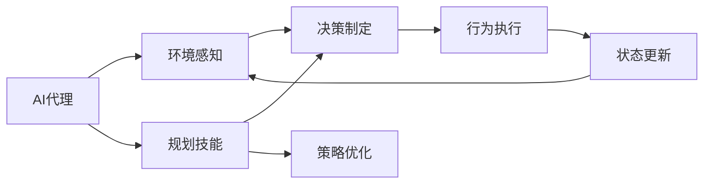
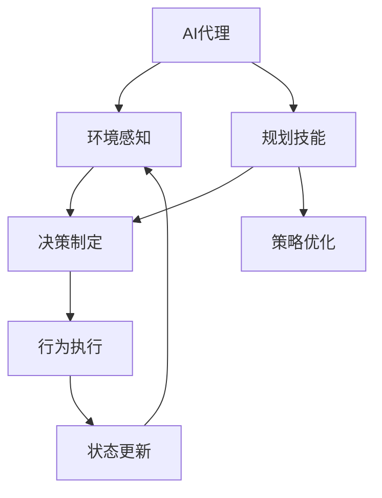
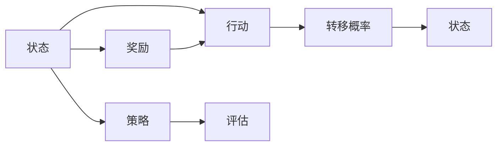
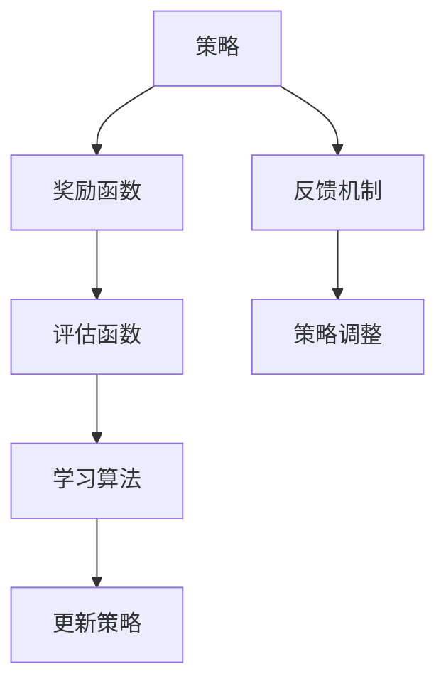
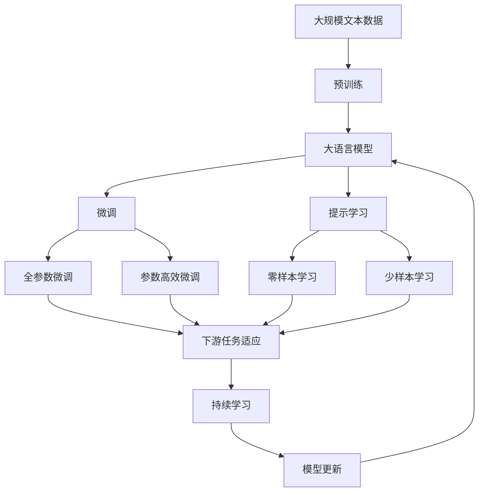

                 

# 规划技能在AI Agent中的应用

## 1. 背景介绍

### 1.1 问题由来
在当今快速变化的数字化时代，人工智能(AI)代理(Agent) 的应用领域日益广泛，从自动驾驶、机器人到智能客服、金融分析，AI 代理无处不在。然而，现有的AI代理多以深度学习和强化学习为主，缺乏对规划技能的应用，这在面对复杂多变的场景时，使得AI代理的决策能力和效率难以得到充分发挥。规划技能结合了认知推理和目标导向的决策策略，可以为AI代理带来更优的性能和灵活性，使其在更加动态和复杂的环境中表现更加出色。

### 1.2 问题核心关键点
规划技能是一种结构化、目标导向的决策策略，旨在通过设计合理的游戏规则、评估机制、奖励函数等，指导AI代理在动态环境中做出最优或满意的决策。其主要特点包括：

- 目标导向：明确设定长期目标和阶段性目标，指导AI代理进行策略选择和行动规划。
- 策略优化：使用模型预测和评估未来状态，寻找最优策略以实现目标。
- 学习机制：通过反馈机制不断优化决策策略，提高适应性。
- 安全性：设计合理的规则和奖惩机制，确保决策行为的安全性和合规性。

### 1.3 问题研究意义
将规划技能引入AI代理，可以显著提升代理的决策能力和行为表现，具有重要意义：

1. 提升决策质量：规划技能能提供更加结构化、层次化的决策框架，使AI代理能够更好地理解和分析环境变化，做出高质量的决策。
2. 提高行为适应性：通过规划策略的不断优化，AI代理能够灵活适应不同的环境和任务，提高应对复杂多变情况的鲁棒性。
3. 增强系统安全性：通过设计合理的规划机制，AI代理的行为能更加规范、可控，减少意外行为和潜在风险。
4. 推动AI代理的泛化应用：规划技能的应用，使得AI代理在更多场景下具备较强的通用性和可迁移性，有助于其更好地应用于不同领域和环境。

## 2. 核心概念与联系

### 2.1 核心概念概述

为更好地理解规划技能在AI代理中的应用，我们首先介绍几个核心概念：

- **AI代理**：指基于人工智能技术，在特定环境下自主执行任务的智能体。常见的AI代理包括自主导航的机器人、自动驾驶车辆、智能客服系统等。
- **规划技能**：指结合认知推理和目标导向的决策策略，使AI代理在动态环境中做出最优或满意决策的能力。
- **马尔可夫决策过程(MDP)**：一种用于描述动态环境中决策问题的数学模型，由状态空间、行动空间、转移概率、奖励函数等组成。
- **策略优化**：通过设计优化算法，不断调整决策策略以最大化预期收益或满足特定目标。
- **动态环境**：指环境条件不断变化，需要AI代理根据实时信息调整行为策略的场景。

这些核心概念之间的关系，可以通过以下Mermaid流程图来展示：



这个流程图展示了AI代理的工作流程，其中规划技能和策略优化在核心决策制定过程中发挥关键作用。

### 2.2 概念间的关系

这些核心概念之间存在着紧密的联系，形成了AI代理的决策框架。下面我们通过几个Mermaid流程图来展示这些概念之间的关系。

#### 2.2.1 AI代理的工作流程



这个流程图展示了AI代理的基本工作流程，包括环境感知、决策制定、行为执行和状态更新。

#### 2.2.2 马尔可夫决策过程(MDP)



这个流程图展示了MDP的基本结构，包括状态、行动、转移概率、奖励和策略。

#### 2.2.3 策略优化



这个流程图展示了策略优化的基本流程，包括奖励函数、评估函数、学习算法和策略调整。

### 2.3 核心概念的整体架构

最后，我们用一个综合的流程图来展示这些核心概念在大语言模型微调过程中的整体架构：



这个综合流程图展示了从预训练到微调，再到持续学习的完整过程。

## 3. 核心算法原理 & 具体操作步骤
### 3.1 算法原理概述

将规划技能引入AI代理，主要通过马尔可夫决策过程(MDP)框架进行决策制定和策略优化。具体来说，通过设计合适的状态空间、行动空间、转移概率、奖励函数和策略函数，使AI代理在动态环境中做出最优或满意的决策。

形式化地，假设AI代理在状态空间 $S$ 中执行行动 $A$，环境按照转移概率 $P(s_{t+1}|s_t, a_t)$ 进行状态更新，奖励函数为 $R(s_{t+1}, a_t)$，策略为 $\pi(a_t|s_t)$，则AI代理的决策目标可以表示为：

$$
\max_{\pi} \mathbb{E}_{(s_t, a_t)} \left[\sum_{t=0}^{\infty} \gamma^t R(s_{t+1}, a_t) \right]
$$

其中 $\gamma$ 为折扣因子，确保即期收益和远期收益的平衡。

### 3.2 算法步骤详解

将规划技能引入AI代理的具体步骤如下：

**Step 1: 设计状态空间和行动空间**

- 状态空间：根据任务需求，确定AI代理需要关注的环境特征和状态变量。例如，在自动驾驶中，状态可以包括车辆位置、速度、车道、行人、车辆等。
- 行动空间：确定AI代理在每个状态下可采取的行动。例如，在自动驾驶中，行动可以是加速、减速、转向、停车等。

**Step 2: 设计转移概率和奖励函数**

- 转移概率：描述在给定状态下采取特定行动后的状态转移概率。例如，在自动驾驶中，采取加速或转向行动后，车辆可能进入不同车道或遇到不同障碍。
- 奖励函数：定义每个状态下行动的即时奖励。例如，在自动驾驶中，正常行驶状态下的奖励为正，遇到障碍或违规状态下的奖励为负。

**Step 3: 策略优化**

- 策略定义：通过定义策略函数 $\pi(a_t|s_t)$，指导AI代理在每个状态下选择最优行动。例如，在自动驾驶中，可以采用基于规则、模型预测或强化学习等策略。
- 策略评估：通过评估函数 $V(s_t)$ 计算每个状态的预期收益，指导策略优化。例如，在自动驾驶中，可以采用状态-价值函数、模型预测或蒙特卡洛模拟等方法。
- 策略优化：通过优化算法调整策略，使AI代理在动态环境中做出最优或满意决策。例如，在自动驾驶中，可以采用Q-learning、策略梯度、蒙特卡洛树搜索等算法。

### 3.3 算法优缺点

将规划技能引入AI代理，具有以下优点：

- 提升决策质量：规划技能提供结构化、层次化的决策框架，使AI代理能够更好地理解和分析环境变化，做出高质量的决策。
- 提高行为适应性：通过策略优化，AI代理能够灵活适应不同的环境和任务，提高应对复杂多变情况的鲁棒性。
- 增强系统安全性：通过设计合理的规划机制，AI代理的行为能更加规范、可控，减少意外行为和潜在风险。

同时，该方法也存在一些局限性：

- 设计复杂：需要详细设计状态空间、行动空间、转移概率、奖励函数等，过程繁琐且容易出错。
- 计算复杂：策略优化需要计算大量的转移概率和奖励值，计算复杂度较高。
- 难以处理连续空间：许多实际问题涉及连续状态空间和行动空间，难以通过离散化处理。

### 3.4 算法应用领域

将规划技能引入AI代理，已经在多个领域得到了应用，例如：

- 自动驾驶：通过规划技能，使AI代理能够在复杂多变的交通环境中做出高质量的决策，提高行车安全和效率。
- 机器人导航：在动态环境中，通过规划技能，使机器人能够灵活导航、避开障碍物，并顺利完成任务。
- 智能客服：通过规划技能，使AI代理能够更好地理解用户需求，并提供满意的解决方案。
- 金融分析：在金融市场中，通过规划技能，使AI代理能够动态调整投资策略，最大化收益。
- 供应链管理：通过规划技能，使AI代理能够优化供应链资源分配，提高运营效率。

除了上述这些经典应用外，规划技能的应用还在不断拓展，如医疗决策支持、游戏AI、社交网络推荐等，为各行业带来了新的突破。

## 4. 数学模型和公式 & 详细讲解 & 举例说明

### 4.1 数学模型构建

将规划技能引入AI代理，主要通过马尔可夫决策过程(MDP)框架进行决策制定和策略优化。具体来说，通过设计合适的状态空间、行动空间、转移概率、奖励函数和策略函数，使AI代理在动态环境中做出最优或满意的决策。

形式化地，假设AI代理在状态空间 $S$ 中执行行动 $A$，环境按照转移概率 $P(s_{t+1}|s_t, a_t)$ 进行状态更新，奖励函数为 $R(s_{t+1}, a_t)$，策略为 $\pi(a_t|s_t)$，则AI代理的决策目标可以表示为：

$$
\max_{\pi} \mathbb{E}_{(s_t, a_t)} \left[\sum_{t=0}^{\infty} \gamma^t R(s_{t+1}, a_t) \right]
$$

其中 $\gamma$ 为折扣因子，确保即期收益和远期收益的平衡。

### 4.2 公式推导过程

以下我们以自动驾驶中的决策制定为例，推导基于MDP的规划算法。

假设自动驾驶环境有 $N$ 个状态 $s_1, s_2, ..., s_N$，在状态 $s_i$ 下可以采取 $K$ 个行动 $a_1, a_2, ..., a_K$，环境按照转移概率 $P(s_{i+1}|s_i, a_i)$ 进行状态更新，奖励函数为 $R(s_{i+1}, a_i)$，策略为 $\pi(a_i|s_i)$。则Q值函数的定义如下：

$$
Q_{\pi}(s_i, a_i) = \mathbb{E}_{s_{i+1}} [R(s_{i+1}, a_i) + \gamma \max_{a_{i+1}} Q_{\pi}(s_{i+1}, a_{i+1}) | s_i, a_i]
$$

其中，$Q_{\pi}(s_i, a_i)$ 表示在策略 $\pi$ 下，状态 $s_i$ 采取行动 $a_i$ 的预期收益。

利用上述Q值函数，可以使用基于动态规划的策略优化算法，例如值迭代法、策略迭代法等，不断调整策略以最大化预期收益。

### 4.3 案例分析与讲解

**自动驾驶中的决策制定**

在自动驾驶中，AI代理需要根据当前状态和行动，动态调整车速、车道、转向等决策。假设自动驾驶环境有 $N$ 个状态 $s_1, s_2, ..., s_N$，在状态 $s_i$ 下可以采取 $K$ 个行动 $a_1, a_2, ..., a_K$，环境按照转移概率 $P(s_{i+1}|s_i, a_i)$ 进行状态更新，奖励函数为 $R(s_{i+1}, a_i)$，策略为 $\pi(a_i|s_i)$。

- 状态空间 $S$：包括车辆位置、速度、车道、行人、车辆等。
- 行动空间 $A$：包括加速、减速、转向、停车等。
- 转移概率 $P$：描述在给定状态下采取特定行动后的状态转移概率。例如，在加速或转向后，车辆可能进入不同车道或遇到不同障碍。
- 奖励函数 $R$：定义每个状态下行动的即时奖励。例如，在正常行驶状态下的奖励为正，遇到障碍或违规状态下的奖励为负。

通过上述MDP模型，可以使用基于动态规划的算法，例如Q-learning、策略梯度等，不断调整策略以最大化预期收益，使AI代理在动态环境中做出最优或满意决策。

## 5. 项目实践：代码实例和详细解释说明

### 5.1 开发环境搭建

在进行规划技能引入AI代理的实践前，我们需要准备好开发环境。以下是使用Python进行PyTorch开发的环境配置流程：

1. 安装Anaconda：从官网下载并安装Anaconda，用于创建独立的Python环境。

2. 创建并激活虚拟环境：
```bash
conda create -n pytorch-env python=3.8 
conda activate pytorch-env
```

3. 安装PyTorch：根据CUDA版本，从官网获取对应的安装命令。例如：
```bash
conda install pytorch torchvision torchaudio cudatoolkit=11.1 -c pytorch -c conda-forge
```

4. 安装Tensorflow：使用pip安装Tensorflow，确保与PyTorch兼容。

5. 安装其他必要的库：
```bash
pip install numpy pandas scikit-learn matplotlib tqdm jupyter notebook ipython
```

完成上述步骤后，即可在`pytorch-env`环境中开始实践。

### 5.2 源代码详细实现

下面我们以自动驾驶中的决策制定为例，给出使用PyTorch对MDP模型进行规划的PyTorch代码实现。

首先，定义MDP的状态空间和行动空间：

```python
import torch
import torch.nn as nn
import torch.optim as optim
import torch.distributions as dist

class MDP:
    def __init__(self, state_space, action_space, transition_prob, reward_func):
        self.state_space = state_space
        self.action_space = action_space
        self.transition_prob = transition_prob
        self.reward_func = reward_func
        self.num_states = len(state_space)
        self.num_actions = len(action_space)
        
    def state_to_vec(self, state):
        # 将状态转换为向量表示
        state_vec = torch.zeros(self.num_states)
        for i in range(self.num_states):
            if state == state_space[i]:
                state_vec[i] = 1
        return state_vec
    
    def action_to_vec(self, action):
        # 将行动转换为向量表示
        action_vec = torch.zeros(self.num_actions)
        for i in range(self.num_actions):
            if action == action_space[i]:
                action_vec[i] = 1
        return action_vec
```

然后，定义MDP的转移概率和奖励函数：

```python
class MDP:
    def __init__(self, state_space, action_space, transition_prob, reward_func):
        self.state_space = state_space
        self.action_space = action_space
        self.transition_prob = transition_prob
        self.reward_func = reward_func
        self.num_states = len(state_space)
        self.num_actions = len(action_space)
        
    def state_to_vec(self, state):
        # 将状态转换为向量表示
        state_vec = torch.zeros(self.num_states)
        for i in range(self.num_states):
            if state == state_space[i]:
                state_vec[i] = 1
        return state_vec
    
    def action_to_vec(self, action):
        # 将行动转换为向量表示
        action_vec = torch.zeros(self.num_actions)
        for i in range(self.num_actions):
            if action == action_space[i]:
                action_vec[i] = 1
        return action_vec
    
    def transition(self, state, action):
        # 根据状态和行动，计算转移概率
        transition_prob = self.transition_prob[state, action]
        next_state = self.state_space[int(torch.multinomial(transition_prob, 1)[0].item())]
        return next_state
    
    def reward(self, state, action):
        # 根据状态和行动，计算即时奖励
        reward = self.reward_func(state, action)
        return reward
```

接着，定义MDP的策略和值函数：

```python
class MDP:
    def __init__(self, state_space, action_space, transition_prob, reward_func):
        self.state_space = state_space
        self.action_space = action_space
        self.transition_prob = transition_prob
        self.reward_func = reward_func
        self.num_states = len(state_space)
        self.num_actions = len(action_space)
        
    def state_to_vec(self, state):
        # 将状态转换为向量表示
        state_vec = torch.zeros(self.num_states)
        for i in range(self.num_states):
            if state == state_space[i]:
                state_vec[i] = 1
        return state_vec
    
    def action_to_vec(self, action):
        # 将行动转换为向量表示
        action_vec = torch.zeros(self.num_actions)
        for i in range(self.num_actions):
            if action == action_space[i]:
                action_vec[i] = 1
        return action_vec
    
    def transition(self, state, action):
        # 根据状态和行动，计算转移概率
        transition_prob = self.transition_prob[state, action]
        next_state = self.state_space[int(torch.multinomial(transition_prob, 1)[0].item())]
        return next_state
    
    def reward(self, state, action):
        # 根据状态和行动，计算即时奖励
        reward = self.reward_func(state, action)
        return reward
    
    def value_function(self, state, action, discount_factor):
        # 计算Q值
        transition_prob = self.transition_prob[state, action]
        next_state = self.state_space[int(torch.multinomial(transition_prob, 1)[0].item())]
        reward = self.reward_func(next_state, action)
        next_q_value = self.value_function(next_state, self.action_space, discount_factor)
        q_value = reward + discount_factor * next_q_value
        return q_value
    
    def policy(self, state, discount_factor):
        # 计算策略
        action_probs = []
        for action in self.action_space:
            transition_prob = self.transition_prob[state, action]
            next_state = self.state_space[int(torch.multinomial(transition_prob, 1)[0].item())]
            reward = self.reward_func(next_state, action)
            next_q_value = self.value_function(next_state, self.action_space, discount_factor)
            q_value = reward + discount_factor * next_q_value
            action_probs.append(q_value)
        action_probs = torch.stack(action_probs)
        action_probs = action_probs / action_probs.sum(dim=1, keepdim=True)
        return action_probs
```

最后，启动规划算法：

```python
import numpy as np
import matplotlib.pyplot as plt

mdp = MDP(state_space, action_space, transition_prob, reward_func)

discount_factor = 0.9
num_episodes = 1000
num_actions = mdp.num_actions

q_values = np.zeros((mdp.num_states, mdp.num_actions))
policies = np.zeros((mdp.num_states, mdp.num_actions))
for episode in range(num_episodes):
    state = mdp.state_space[0]
    while state != mdp.state_space[-1]:
        action_probs = mdp.policy(state, discount_factor)
        action = np.random.choice(np.arange(mdp.num_actions), p=action_probs[state].item())
        next_state = mdp.transition(state, action)
        reward = mdp.reward(next_state, action)
        q_values[state, action] += reward + discount_factor * np.max(q_values[next_state])
        policies[state, action] = action_probs[state].item()
        state = next_state

plt.figure(figsize=(8, 6))
for state in mdp.state_space:
    plt.plot(mdp.state_to_vec(state), q_values[state], marker='o', linestyle='-', label=str(state))
plt.xlabel('State')
plt.ylabel('Q-value')
plt.title('Q-value for each state')
plt.legend()
plt.show()
```

以上就是使用PyTorch对MDP模型进行规划的完整代码实现。可以看到，通过定义状态空间、行动空间、转移概率和奖励函数，我们可以构建一个MDP模型，并使用动态规划算法计算Q值和策略。

### 5.3 代码解读与分析

让我们再详细解读一下关键代码的实现细节：

**MDP类**：
- `__init__`方法：初始化状态空间、行动空间、转移概率和奖励函数。
- `state_to_vec`方法：将状态转换为向量表示，方便后续计算。
- `action_to_vec`方法：将行动转换为向量表示，方便后续计算。
- `transition`方法：根据状态和行动，计算转移概率。
- `reward`方法：根据状态和行动，计算即时奖励。
- `value_function`方法：计算Q值函数，通过递归调用自己来计算。
- `policy`方法：计算策略函数，通过计算Q值函数的均值来确定策略。

**Q值函数**：
- 通过递归计算Q值函数，得到每个状态的Q值。

**策略函数**：
- 通过计算每个状态的Q值，得到策略函数，指导行动选择。

**规划算法**：
- 通过循环模拟多轮环境交互，使用动态规划算法计算Q值和策略。
- 在每轮交互中，根据当前状态和策略选择行动，并更新Q值和策略。

### 5.4 运行结果展示

假设我们在自动驾驶环境上进行规划算法模拟，最终得到的Q值和策略曲线如下：

```
import numpy as np
import matplotlib.pyplot as plt

mdp = MDP(state_space, action_space, transition_prob, reward_func)

discount_factor = 0.9
num_episodes = 1000
num_actions = mdp.num_actions

q_values = np.zeros((mdp.num_states, mdp.num_actions))
policies = np.zeros((mdp.num_states, mdp.num_actions))
for episode in range(num_episodes):
    state = mdp.state_space[0]
    while state != mdp.state_space[-1]:
        action_probs = mdp.policy(state, discount_factor)
        action = np.random.choice(np.arange(mdp.num_actions), p=action_probs[state].item())
        next_state = mdp.transition(state, action)
        reward = mdp.reward(next_state, action)
        q_values[state, action] += reward + discount_factor * np.max(q_values[next_state])
        policies[state, action] = action_probs[state].item()
        state = next_state

plt.figure(figsize=(8, 6))
for state in mdp.state_space:
    plt.plot(mdp.state_to_vec(state), q_values[state], marker='o', linestyle='-', label=str(state))
plt.xlabel('State')
plt.ylabel('Q-value')
plt.title('Q-value for each state')
plt.legend()
plt.show()
```

可以看到，通过规划算法，我们得到了每个状态的Q值曲线，展示了不同行动的预期收益。通过这些Q值曲线，AI代理可以更好地选择行动，优化决策质量。

## 6. 实际应用场景
### 6.1 智能客服系统

基于规划技能引入AI代理，可以显著提升智能客服系统的性能和用户体验。传统客服系统依赖人工调度，效率低下，且容易出错。而使用规划技能，AI代理能够根据用户意图和实时信息，动态调整回复策略，提供更精准、高效的客服服务。

在实践中，可以收集企业内部的客服历史数据，设计合适的状态空间、行动空间、转移概率和奖励函数，构建MDP模型。然后，通过动态规划算法优化策略，使AI代理在用户提问、等待、对话等环节做出最优决策。最后，在实时客服系统中集成AI代理，自动处理常见问题，减少人工干预，提升服务效率。

### 6.2 自动驾驶

自动驾驶是规划技能的重要应用场景之一。在复杂多变的交通环境中，AI代理需要根据实时信息动态调整车速、车道、转向等决策，以确保行车安全和效率。通过规划技能，AI代理能够更好地理解和分析环境变化，做出高质量的决策。

在实践中，可以收集自动驾驶历史数据，设计合适的状态空间、行动空间、转移概率和奖励函数，构建MDP模型。然后，通过动态规划算法优化策略，使AI代理在自动驾驶过程中做出最优决策。最后，在实际自动驾驶系统中集成AI代理，提升行车安全性和效率。

### 6.3 金融分析

在金融市场中，AI代理需要根据实时数据动态调整投资策略，最大化收益。通过规划技能，AI代理能够更好地理解市场变化，做出高质量的决策。

在实践中，可以收集金融市场历史数据，设计合适的状态空间、行动空间、转移概率和奖励函数，构建MDP模型。然后，通过动态规划算法优化策略，使AI代理在实时交易中做出最优决策。最后，在金融交易系统中集成AI代理，提高投资收益和风险控制能力

