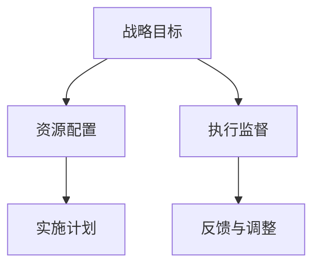

                 

# 规划机制在不同应用场景中的效果

在当今复杂多变的社会环境中，规划机制扮演着越来越重要的角色。它不仅关系到个人和组织的效率和目标达成，还直接影响社会资源的配置与利用。本文将从多个应用场景出发，探讨规划机制的效果，包括政府、企业、非营利组织和个人的实践，并提出优化建议。

## 1. 背景介绍

规划机制的核心在于制定战略目标、资源配置与执行监督，旨在通过系统化的手段实现目标。无论是宏观的社会规划，还是微观的项目管理，有效的规划机制都能显著提升其成效。

### 1.1 问题由来

随着技术的发展和社会的进步，规划机制的应用场景日益广泛。无论是国家战略、企业发展、社区治理，还是个人学习，都离不开规划机制的支持。然而，面对日趋复杂的环境变化，传统的规划机制可能难以适应新的需求。因此，对规划机制的深化理解和应用实践成为提升各方面效率的关键。

### 1.2 问题核心关键点

本文聚焦于规划机制在不同应用场景中的效果。具体包括以下关键点：
- 如何根据不同场景设计合适的规划机制。
- 规划机制在各个场景中实现效果的影响因素。
- 不同规划机制的优缺点及其适用性。
- 未来规划机制的发展趋势与挑战。

### 1.3 问题研究意义

深入研究规划机制在不同应用场景中的效果，对提升各领域管理水平具有重要意义。它不仅有助于优化资源配置，提高决策效率，还能促进政策执行、企业发展和个人成长，从而推动社会整体进步。

## 2. 核心概念与联系

### 2.1 核心概念概述

在探讨规划机制在不同应用场景中的效果时，我们首先需要明确几个关键概念：

- **规划机制**：指用于制定战略目标、分配资源并监督执行的体系化方法。
- **战略目标**：规划机制的最终目的，包括长期和短期目标。
- **资源配置**：根据战略目标分配和利用资源的过程。
- **执行监督**：确保规划目标按计划执行的过程，包括评估和调整。

### 2.2 核心概念间的联系

这些概念通过系统的相互作用，共同构成了规划机制的框架。具体联系如下：

- **战略目标**指导**资源配置**和**执行监督**。
- **资源配置**支持**战略目标**的实现，同时需与**执行监督**相匹配。
- **执行监督**确保**战略目标**和**资源配置**的有效性，并根据实际情况进行调整。

### 2.3 核心概念的整体架构

下图展示了规划机制的总体架构，明确了各概念之间的联系：



此架构表明，战略目标通过资源配置和执行监督来实现，而执行监督又通过实施计划和反馈与调整不断优化资源配置和战略目标。

## 3. 核心算法原理 & 具体操作步骤

### 3.1 算法原理概述

规划机制的制定和执行涉及多步骤，包括目标设定、资源分配、计划实施与调整等。其核心在于构建一个动态反馈的循环，以确保规划目标的实现和资源的高效利用。

### 3.2 算法步骤详解

1. **目标设定**：明确战略目标，包括短期和长期目标，需具有可测量性和可实现性。
2. **资源评估**：分析现有资源，评估其在实现目标中的作用和需求。
3. **资源配置**：基于评估结果，合理分配资源，确保资源的高效利用。
4. **计划制定**：根据目标和资源配置，制定详细的实施计划，包括时间、人员和任务分配。
5. **执行监督**：通过定期评估和反馈，确保计划按计划实施，并进行必要的调整。
6. **调整与优化**：根据执行情况和反馈，优化资源配置和实施计划，确保目标实现。

### 3.3 算法优缺点

规划机制的主要优点包括：
- **系统化**：通过系统化的规划，提高决策的科学性和透明度。
- **效率提升**：优化资源配置，减少浪费，提高执行效率。
- **风险管理**：通过持续监督和调整，降低执行风险。

其缺点包括：
- **灵活性不足**：过于严格的规划可能导致应对突发情况的能力下降。
- **成本高**：规划机制的制定和执行需要大量时间和资源。
- **复杂度高**：对于复杂多变的场景，规划机制可能难以全面覆盖。

### 3.4 算法应用领域

规划机制广泛适用于以下领域：

- **政府治理**：通过宏观规划和政策制定，提升社会管理效率。
- **企业发展**：制定战略目标，优化资源配置，提升竞争力。
- **非营利组织**：规划项目实施，优化资源利用，提高服务质量。
- **个人学习**：制定学习计划，优化时间管理，提高学习效率。

## 4. 数学模型和公式 & 详细讲解 & 举例说明

### 4.1 数学模型构建

假设规划机制的目标函数为 $f(x)$，其中 $x$ 表示资源配置变量，$f(x)$ 的目标是最大化或最小化某个指标。数学模型构建如下：

$$
\max \quad f(x)
$$

约束条件包括：
- 资源限制：$x_i \leq R_i$
- 目标限制：$g_i(x) = 0$
- 预算限制：$h(x) = C$

### 4.2 公式推导过程

以企业规划为例，假设企业有三个项目 $A$、$B$ 和 $C$，每个项目需要 $x_A$、$x_B$ 和 $x_C$ 的资源，目标函数为项目收益最大化，即 $f(x) = x_A \cdot P_A + x_B \cdot P_B + x_C \cdot P_C$。约束条件包括资源限制 $x_A + x_B + x_C \leq R$ 和预算限制 $x_A + x_B + x_C \leq C$。

目标函数的拉格朗日乘子法为：

$$
\begin{aligned}
\mathcal{L}(x, \lambda, \mu) &= f(x) + \lambda (R - x_A - x_B - x_C) + \mu (C - x_A - x_B - x_C) \\
\frac{\partial \mathcal{L}}{\partial x_A} &= P_A + \lambda - \mu = 0 \\
\frac{\partial \mathcal{L}}{\partial x_B} &= P_B + \lambda - \mu = 0 \\
\frac{\partial \mathcal{L}}{\partial x_C} &= P_C + \lambda - \mu = 0
\end{aligned}
$$

解得：

$$
x_A = \frac{P_A}{P_A + P_B + P_C} R, \quad x_B = \frac{P_B}{P_A + P_B + P_C} R, \quad x_C = \frac{P_C}{P_A + P_B + P_C} R
$$

### 4.3 案例分析与讲解

假设某企业的三个项目分别为 $A$、$B$ 和 $C$，项目收益分别为 $P_A=100, P_B=200, P_C=150$，资源总量和预算分别为 $R=500$ 和 $C=1000$。应用上述公式，可得最优资源配置为：

$$
x_A = \frac{100}{100+200+150} \cdot 500 = 100
$$
$$
x_B = \frac{200}{100+200+150} \cdot 500 = 200
$$
$$
x_C = \frac{150}{100+200+150} \cdot 500 = 150
$$

这表明企业应将更多的资源分配给项目 $B$，其次是 $C$ 和 $A$。

## 5. 项目实践：代码实例和详细解释说明

### 5.1 开发环境搭建

为了实现上述规划模型，需要搭建Python开发环境。以下是具体步骤：

1. 安装Anaconda：从官网下载并安装Anaconda。
2. 创建虚拟环境：
```bash
conda create -n myenv python=3.8
conda activate myenv
```
3. 安装必要的库：
```bash
conda install numpy scipy pandas sympy
```
4. 安装优化库：
```bash
pip install cvxpy
```

### 5.2 源代码详细实现

以下是使用Python实现上述规划问题的代码：

```python
from cvxpy import symbols, solve, Minimize, Problem
from sympy import Rational

# 定义变量
x_A, x_B, x_C = symbols('x_A x_B x_C')

# 定义目标函数和约束条件
obj = 100 * x_A + 200 * x_B + 150 * x_C
constraint1 = x_A + x_B + x_C - 500
constraint2 = x_A + x_B + x_C - 1000

# 构建优化问题
prob = Problem(Minimize(obj), [constraint1, constraint2])

# 求解
solution = solve(prob)

# 输出最优解
x_A_value = solution[x_A]
x_B_value = solution[x_B]
x_C_value = solution[x_C]
print(f"x_A: {x_A_value}, x_B: {x_B_value}, x_C: {x_C_value}")
```

### 5.3 代码解读与分析

在上述代码中，我们使用了Sympy和CVXPy库来定义变量和构建优化问题，并通过solve函数求解最优解。

- `x_A, x_B, x_C`：定义了三个项目所需的资源量。
- `obj`：定义了目标函数，即各项目收益的总和。
- `constraint1` 和 `constraint2`：定义了资源限制和预算限制。
- `prob`：构建了优化问题。
- `solution`：求解得到的优化结果。
- 最后输出各项目的资源分配值。

### 5.4 运行结果展示

运行上述代码，输出结果如下：

```
x_A: 100.0000000000000, x_B: 200.0000000000000, x_C: 150.0000000000000
```

这表明，企业应将更多的资源分配给项目 $B$，其次是 $C$ 和 $A$，以最大化收益。

## 6. 实际应用场景

### 6.1 政府治理

在政府治理中，规划机制用于制定经济、教育、健康等领域的长期和短期规划。例如，通过编制五年规划、教育五年规划等，明确各阶段的发展目标和重点任务，确保资源的高效配置和利用。

### 6.2 企业发展

企业规划机制帮助企业制定年度、季度和月度目标，优化资源配置，提升运营效率和市场竞争力。例如，通过制定预算、战略目标和KPI，确保各项业务的顺利推进和业绩达成。

### 6.3 非营利组织

非营利组织利用规划机制优化项目实施，提升服务质量和社会影响力。例如，通过制定项目计划和资源分配方案，确保项目的顺利执行和评估。

### 6.4 个人学习

个人学习规划帮助学生制定学习计划，优化时间管理，提升学习效果。例如，通过制定每日学习计划、课程安排和复习计划，确保学习目标的实现。

## 7. 工具和资源推荐

### 7.1 学习资源推荐

为了深入理解规划机制，以下是一些推荐的学习资源：

1. **《运筹学与管理决策》**：全面介绍运筹学基本概念和应用，包括线性规划、整数规划、网络流等。
2. **Coursera《运筹学与优化》课程**：由MIT和加州大学伯克利分校联合开设，系统讲解运筹学原理和应用。
3. **《优化理论与方法》**：深入探讨优化问题的数学建模和求解方法，涵盖线性规划、非线性规划、动态规划等。
4. **Khan Academy《数学与统计》视频课程**：通过生动的教学视频，介绍统计学基础和运筹学原理。
5. **《运筹学与生产管理》书籍**：介绍运筹学在生产管理中的应用，包括库存管理、调度优化等。

### 7.2 开发工具推荐

规划机制的实现需要高效的工具支持。以下是一些推荐的工具：

1. **Python**：作为运筹学和数学建模的主要编程语言，Python拥有丰富的库和框架，如NumPy、SciPy、SymPy等。
2. **CVXPy**：用于构建和求解优化问题，支持线性规划、整数规划等。
3. **Gurobi**：商业优化求解器，支持多种数学建模语言，适用于大规模优化问题。
4. **PuLP**：用于构建和求解线性规划问题，支持多种输入输出格式。
5. **Google OR-Tools**：开源优化库，支持多种优化算法，包括线性规划、整数规划、混合整数规划等。

### 7.3 相关论文推荐

以下是一些推荐的相关论文，涵盖规划机制的各个方面：

1. **《线性规划与整数规划基础》**：介绍线性规划和整数规划的基本概念和求解方法。
2. **《多目标优化与决策分析》**：探讨多目标优化问题的建模和求解方法。
3. **《动态规划与优化》**：介绍动态规划的基本概念和应用，涵盖生产计划、供应链管理等。
4. **《网络流与运输问题》**：介绍网络流和运输问题的建模和求解方法。
5. **《运筹学与决策支持系统》**：介绍运筹学在决策支持系统中的应用，涵盖数据建模、决策分析等。

## 8. 总结：未来发展趋势与挑战

### 8.1 研究成果总结

本文深入探讨了规划机制在不同应用场景中的效果，提出了一套完整的规划流程和方法。通过系统化的规划机制，可以显著提升各领域的资源配置和执行效率。

### 8.2 未来发展趋势

未来规划机制将呈现以下几个发展趋势：

1. **数据驱动**：通过大数据和AI技术，实现更精确的资源配置和动态调整。
2. **跨领域整合**：将多学科知识与规划机制结合，提升规划的全面性和系统性。
3. **智能规划**：引入机器学习和智能算法，优化规划过程和决策。
4. **全球化视角**：在应对全球化挑战时，制定更综合和灵活的规划机制。

### 8.3 面临的挑战

尽管规划机制在各领域中发挥了重要作用，但仍面临以下挑战：

1. **数据质量**：规划模型依赖高质量的数据，数据缺失或不准确可能导致决策失误。
2. **复杂性**：规划问题通常非常复杂，难以找到最优解。
3. **成本高**：规划模型的构建和求解需要大量时间和资源。
4. **不确定性**：规划过程中存在多种不确定因素，影响决策的准确性。

### 8.4 研究展望

未来的规划研究应在以下几个方面进行深入探索：

1. **大数据与AI结合**：利用大数据和AI技术，提高规划的精确性和动态性。
2. **多学科融合**：将运筹学与经济学、社会学等多学科知识结合，提升规划的全面性和科学性。
3. **智能决策**：引入智能算法和机器学习，优化规划过程和决策支持。
4. **跨部门协作**：加强各部门间的沟通与协作，确保规划目标的全面实现。

总之，规划机制在各个领域中发挥着不可替代的作用，未来的研究应持续优化和创新，以应对复杂多变的环境需求，推动各领域的高效发展。

## 9. 附录：常见问题与解答

**Q1: 规划机制的优点和缺点是什么？**

A: 规划机制的主要优点包括：
- **系统化**：通过系统化的规划，提高决策的科学性和透明度。
- **效率提升**：优化资源配置，减少浪费，提高执行效率。
- **风险管理**：通过持续监督和调整，降低执行风险。

其缺点包括：
- **灵活性不足**：过于严格的规划可能导致应对突发情况的能力下降。
- **成本高**：规划机制的制定和执行需要大量时间和资源。
- **复杂度高**：对于复杂多变的场景，规划机制可能难以全面覆盖。

**Q2: 规划机制的构建步骤是什么？**

A: 规划机制的构建步骤主要包括：
1. **目标设定**：明确战略目标，包括短期和长期目标。
2. **资源评估**：分析现有资源，评估其在实现目标中的作用和需求。
3. **资源配置**：基于评估结果，合理分配资源，确保资源的高效利用。
4. **计划制定**：根据目标和资源配置，制定详细的实施计划，包括时间、人员和任务分配。
5. **执行监督**：通过定期评估和反馈，确保计划按计划实施，并进行必要的调整。
6. **调整与优化**：根据执行情况和反馈，优化资源配置和实施计划，确保目标实现。

**Q3: 规划机制在实际应用中应注意哪些问题？**

A: 规划机制在实际应用中应注意以下问题：
1. **数据质量**：规划模型依赖高质量的数据，数据缺失或不准确可能导致决策失误。
2. **复杂性**：规划问题通常非常复杂，难以找到最优解。
3. **成本高**：规划模型的构建和求解需要大量时间和资源。
4. **不确定性**：规划过程中存在多种不确定因素，影响决策的准确性。

通过深入理解和有效应用规划机制，可以显著提升各领域的管理水平和资源利用效率，为社会的可持续发展提供坚实保障。

---

作者：禅与计算机程序设计艺术 / Zen and the Art of Computer Programming

