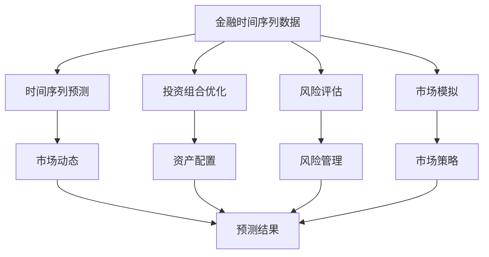
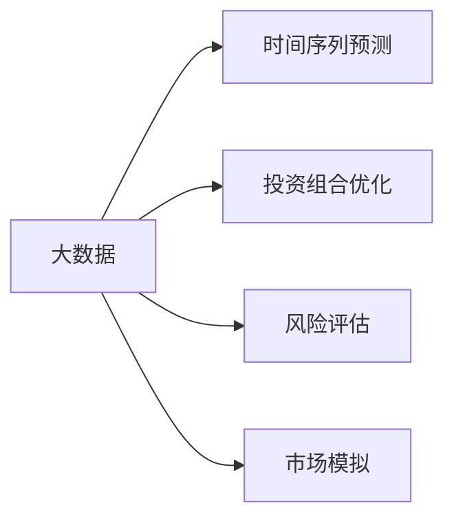
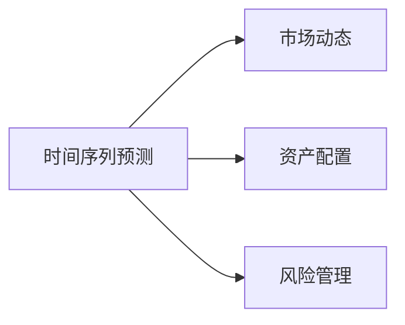
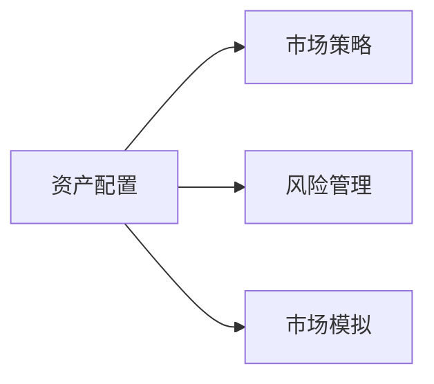
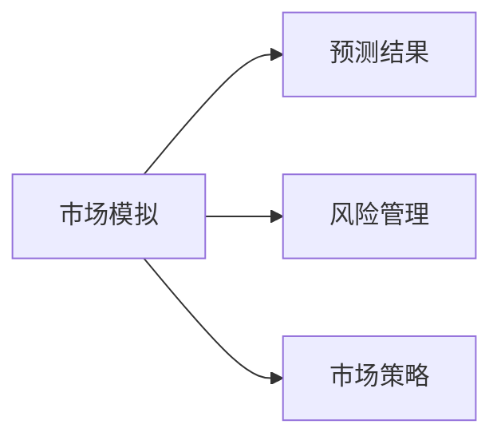
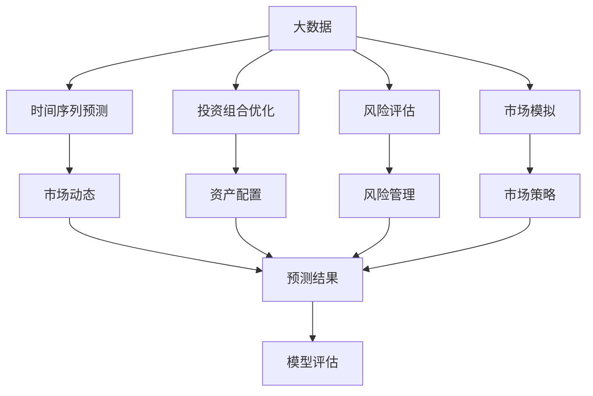

                 

## 1. 背景介绍

### 1.1 问题由来

随着金融市场的不断发展，金融机构对于智能化的需求日益增长。智能金融系统通过机器学习和数据挖掘技术，能够高效分析海量金融数据，提供精准的风险评估、投资建议和市场预测等服务。然而，这些系统往往需要耗费大量时间和资源进行训练和优化，难以实时响应市场的快速变化。此外，由于金融数据的复杂性和高敏感性，如何确保智能系统的安全性、稳定性和可解释性，也是一大难题。

### 1.2 问题核心关键点

金融系统中的规划机制，是指通过系统内部的算法和模型，根据历史数据和市场趋势，对未来的金融活动进行预判和决策。常见的规划机制包括时间序列预测、投资组合优化、风险评估和市场模拟等。其核心在于如何构建合理的模型，准确预测市场动态，同时确保决策的透明和可解释性。

**核心概念：**
1. **时间序列预测**：通过对历史金融数据的分析，预测未来的市场趋势和价格波动。
2. **投资组合优化**：根据市场动态，优化资产配置，以实现收益最大化和风险最小化。
3. **风险评估**：识别并评估金融活动的潜在风险，确保决策的稳健性。
4. **市场模拟**：模拟市场变化，预测潜在风险和机会，帮助决策者制定策略。

这些核心概念构成了智能金融系统的核心功能，其有效性和可靠性直接影响到系统的商业价值和用户信任。

## 2. 核心概念与联系

### 2.1 核心概念概述

为了更好地理解规划机制在智能金融系统中的应用，本节将介绍几个关键核心概念：

- **金融时间序列数据**：包含历史金融数据的序列，如股票价格、交易量、汇率等，是时间序列预测的基础。
- **风险指标**：如VaR（Value at Risk）、ES（Expected Shortfall）、CVaR（Conditional Value at Risk）等，用于衡量金融活动的风险大小。
- **投资组合**：由多种资产组成的集合，用于优化配置以实现收益和风险平衡。
- **模型评估指标**：如MAE（Mean Absolute Error）、RMSE（Root Mean Squared Error）、MAPE（Mean Absolute Percentage Error）等，用于评估预测模型的准确性。
- **可解释性**：金融系统的决策过程和输出结果是否具有可解释性，是判断系统是否可靠的关键因素。

这些核心概念之间的逻辑关系可以通过以下Mermaid流程图来展示：



这个流程图展示了大数据、预测、优化、模拟和评估等关键组件之间的联系，以及它们如何共同构建智能金融系统。

### 2.2 概念间的关系

这些核心概念之间存在着紧密的联系，形成了智能金融系统的完整生态系统。下面我们通过几个Mermaid流程图来展示这些概念之间的关系。

#### 2.2.1 大数据与预测



这个流程图展示了大数据在时间序列预测、投资组合优化、风险评估和市场模拟中的应用，是构建智能金融系统的基础。

#### 2.2.2 预测与优化



这个流程图展示了时间序列预测结果如何应用于市场动态分析、资产配置和风险管理，以优化投资决策。

#### 2.2.3 优化与模拟



这个流程图展示了资产配置结果如何用于制定市场策略、风险管理、以及市场模拟，以进一步优化投资决策。

#### 2.2.4 模拟与评估



这个流程图展示了市场模拟结果如何用于风险管理和市场策略的制定，以及预测结果的评估。

### 2.3 核心概念的整体架构

最后，我们用一个综合的流程图来展示这些核心概念在大数据环境下的整体架构：



这个综合流程图展示了大数据环境下的智能金融系统架构，其中各组件之间通过数据流和决策流相互连接，共同支撑系统的运行。

## 3. 核心算法原理 & 具体操作步骤

### 3.1 算法原理概述

基于规划机制的智能金融系统，其核心算法原理可以归结为以下几个关键步骤：

1. **数据预处理**：对原始金融数据进行清洗、归一化和特征工程，准备用于模型训练和预测的数据。
2. **模型训练**：选择合适的机器学习或深度学习模型，如ARIMA、LSTM、RNN等，对时间序列数据进行训练，得到预测模型。
3. **投资组合优化**：使用优化算法，如遗传算法、粒子群算法等，对投资组合进行优化，以实现收益最大化和风险最小化。
4. **风险评估**：使用风险指标，如VaR、ES等，对投资组合进行风险评估，确保决策的稳健性。
5. **市场模拟**：使用蒙特卡罗模拟等方法，模拟市场变化，预测潜在风险和机会，为决策提供参考。
6. **模型评估**：使用评估指标，如MAE、RMSE、MAPE等，对预测模型的性能进行评估，确保模型的可靠性。

### 3.2 算法步骤详解

#### 3.2.1 数据预处理

数据预处理是构建智能金融系统的第一步，其目的是清洗和转换原始金融数据，使之符合模型训练和预测的要求。具体步骤如下：

1. **数据清洗**：去除缺失值、异常值和重复值，确保数据的一致性和完整性。
2. **归一化**：将数据缩放到统一的范围，如[0,1]或[-1,1]，以便模型处理。
3. **特征工程**：提取和构造有意义的特征，如滞后差分、移动平均、技术指标等，增强数据的表达能力。

#### 3.2.2 模型训练

模型训练是智能金融系统的核心步骤，其目的是构建能够准确预测市场动态的模型。具体步骤如下：

1. **模型选择**：选择合适的机器学习或深度学习模型，如ARIMA、LSTM、RNN等，考虑模型的复杂度和训练速度。
2. **数据划分**：将数据集划分为训练集、验证集和测试集，确保模型在新数据上的泛化能力。
3. **模型训练**：使用训练集对模型进行训练，使用验证集调整模型参数，确保模型的高效和稳定。
4. **模型评估**：使用测试集对模型进行评估，计算评估指标，如MAE、RMSE、MAPE等，确保模型的可靠性。

#### 3.2.3 投资组合优化

投资组合优化是智能金融系统的重要功能，其目的是通过优化资产配置，实现收益最大化和风险最小化。具体步骤如下：

1. **目标设定**：设定收益和风险的目标函数，如最大化夏普比率（Sharpe Ratio）和最小化VaR。
2. **优化算法**：选择合适的优化算法，如遗传算法、粒子群算法等，搜索最优解。
3. **约束条件**：设置约束条件，如资产种类、权重限制等，确保投资策略的可行性和合规性。
4. **策略评估**：使用评估指标，如夏普比率、最大回撤（Maximum Drawdown）等，评估投资组合的性能。

#### 3.2.4 风险评估

风险评估是智能金融系统的关键功能，其目的是识别和评估金融活动的潜在风险，确保决策的稳健性。具体步骤如下：

1. **风险指标选择**：选择合适的风险指标，如VaR、ES、CVaR等，衡量风险大小。
2. **风险计算**：使用历史数据和预测结果，计算风险指标的值，评估金融活动的潜在风险。
3. **风险管理**：根据风险评估结果，制定风险管理策略，如止损、对冲等，确保金融活动的稳健性。
4. **风险监控**：实时监控金融活动，及时发现和处理风险事件，保障系统的安全性和稳定性。

#### 3.2.5 市场模拟

市场模拟是智能金融系统的重要功能，其目的是通过模拟市场变化，预测潜在风险和机会，为决策提供参考。具体步骤如下：

1. **市场模型选择**：选择合适的市场模型，如随机游走、布朗运动等，模拟市场变化。
2. **模拟参数设定**：设定模拟参数，如波动率、相关性等，确保模拟的准确性。
3. **历史回测**：使用历史数据进行模拟，验证模型的准确性和可靠性。
4. **未来预测**：使用模拟结果进行未来预测，评估金融活动的潜在风险和机会。

#### 3.2.6 模型评估

模型评估是智能金融系统的核心步骤，其目的是确保预测模型的可靠性。具体步骤如下：

1. **评估指标选择**：选择合适的评估指标，如MAE、RMSE、MAPE等，衡量模型的预测能力。
2. **评估过程**：使用测试集对模型进行评估，计算评估指标，确保模型的可靠性。
3. **模型优化**：根据评估结果，调整模型参数，优化模型性能。
4. **模型部署**：将优化后的模型部署到生产环境中，实现实时预测和决策。

### 3.3 算法优缺点

基于规划机制的智能金融系统具有以下优点：

1. **高效性**：通过自动化和算法优化，显著提高了金融数据的处理和分析效率。
2. **精确性**：通过机器学习和深度学习技术，提高了预测和决策的精确性。
3. **稳健性**：通过风险评估和管理，增强了系统的稳健性和可靠性。
4. **可解释性**：通过可解释性的算法和模型，提高了系统的透明性和可理解性。

然而，基于规划机制的智能金融系统也存在以下缺点：

1. **数据依赖性**：依赖高质量和全面的金融数据，数据获取和处理成本较高。
2. **模型复杂性**：需要选择合适的模型和算法，模型设计复杂，调参困难。
3. **市场动态性**：金融市场变化复杂，模型难以完全捕捉市场动态，预测存在不确定性。
4. **风险管理难度**：金融风险复杂多变，风险评估和管理难度较大，需要实时监控和调整。

### 3.4 算法应用领域

基于规划机制的智能金融系统，广泛应用于以下领域：

1. **投资决策**：通过时间序列预测、投资组合优化和市场模拟，为投资决策提供科学依据。
2. **风险管理**：通过风险评估和风险管理，确保金融活动的稳健性和合规性。
3. **市场预测**：通过市场模拟和风险评估，预测市场趋势和风险，制定市场策略。
4. **金融产品设计**：通过金融数据的分析和模拟，设计更加符合市场需求和风险控制要求的金融产品。
5. **金融客户服务**：通过智能客服系统和智能投顾，提升客户体验和满意度。

## 4. 数学模型和公式 & 详细讲解  
### 4.1 数学模型构建

本节将使用数学语言对基于规划机制的智能金融系统进行更加严格的刻画。

记金融时间序列数据为 $X_t=\{x_t\}_{t=1}^N$，其中 $x_t$ 为金融市场在时间 $t$ 的变量，如股票价格、交易量、汇率等。假设时间为连续变量，可以建立如下数学模型：

$$
x_t = \mu + \sigma\epsilon_t + \alpha x_{t-1} + \beta x_{t-2} + \gamma x_{t-3} + \delta x_{t-4} + \epsilon_t
$$

其中，$\mu$ 为均值，$\sigma$ 为标准差，$\epsilon_t$ 为随机误差项，$\alpha,\beta,\gamma,\delta$ 为滞后系数，控制了时间序列的动态特性。

### 4.2 公式推导过程

接下来，我们将使用上述时间序列模型进行数学推导。

假设模型的误差项 $\epsilon_t$ 服从正态分布 $N(0,\sigma^2)$，则对数似然函数可以表示为：

$$
\ln L = \sum_{t=1}^N \ln (\frac{1}{\sqrt{2\pi}\sigma}) - \frac{(x_t - \mu - \sigma\epsilon_t - \alpha x_{t-1} - \beta x_{t-2} - \gamma x_{t-3} - \delta x_{t-4} - \epsilon_t)^2}{2\sigma^2}
$$

对上述对数似然函数求偏导数，得到：

$$
\frac{\partial \ln L}{\partial \mu} = \frac{1}{\sigma^2} \sum_{t=1}^N (x_t - \mu - \sigma\epsilon_t - \alpha x_{t-1} - \beta x_{t-2} - \gamma x_{t-3} - \delta x_{t-4} - \epsilon_t)
$$

$$
\frac{\partial \ln L}{\partial \sigma} = \frac{1}{\sigma^3} \sum_{t=1}^N (x_t - \mu - \sigma\epsilon_t - \alpha x_{t-1} - \beta x_{t-2} - \gamma x_{t-3} - \delta x_{t-4} - \epsilon_t)
$$

$$
\frac{\partial \ln L}{\partial \alpha} = \frac{1}{\sigma^2} \sum_{t=1}^N (x_t - \mu - \sigma\epsilon_t - \alpha x_{t-1} - \beta x_{t-2} - \gamma x_{t-3} - \delta x_{t-4} - \epsilon_t) \cdot x_{t-1}
$$

$$
\frac{\partial \ln L}{\partial \beta} = \frac{1}{\sigma^2} \sum_{t=1}^N (x_t - \mu - \sigma\epsilon_t - \alpha x_{t-1} - \beta x_{t-2} - \gamma x_{t-3} - \delta x_{t-4} - \epsilon_t) \cdot x_{t-2}
$$

$$
\frac{\partial \ln L}{\partial \gamma} = \frac{1}{\sigma^2} \sum_{t=1}^N (x_t - \mu - \sigma\epsilon_t - \alpha x_{t-1} - \beta x_{t-2} - \gamma x_{t-3} - \delta x_{t-4} - \epsilon_t) \cdot x_{t-3}
$$

$$
\frac{\partial \ln L}{\partial \delta} = \frac{1}{\sigma^2} \sum_{t=1}^N (x_t - \mu - \sigma\epsilon_t - \alpha x_{t-1} - \beta x_{t-2} - \gamma x_{t-3} - \delta x_{t-4} - \epsilon_t) \cdot x_{t-4}
$$

$$
\frac{\partial \ln L}{\partial \epsilon_t} = \frac{1}{\sigma^2} \sum_{t=1}^N (x_t - \mu - \sigma\epsilon_t - \alpha x_{t-1} - \beta x_{t-2} - \gamma x_{t-3} - \delta x_{t-4} - \epsilon_t) \cdot \epsilon_t
$$

通过上述偏导数公式，可以求解模型参数 $\mu$、$\sigma$、$\alpha$、$\beta$、$\gamma$、$\delta$，得到时间序列模型。

### 4.3 案例分析与讲解

假设我们有一个包含每日股票价格的金融时间序列数据集，使用ARIMA模型进行预测。具体步骤如下：

1. **数据预处理**：对原始数据进行清洗、归一化和特征工程，提取滞后差分和移动平均等特征。
2. **模型训练**：使用训练集对ARIMA模型进行训练，调整滞后阶数和截尾阶数，确保模型的高效和稳定。
3. **模型评估**：使用测试集对模型进行评估，计算MAE、RMSE、MAPE等评估指标，确保模型的可靠性。
4. **投资组合优化**：使用优化算法，如遗传算法、粒子群算法等，对投资组合进行优化，以实现收益最大化和风险最小化。
5. **风险评估**：使用VaR、ES等风险指标，对投资组合进行风险评估，确保决策的稳健性。
6. **市场模拟**：使用蒙特卡罗模拟等方法，模拟市场变化，预测潜在风险和机会，为决策提供参考。
7. **模型部署**：将优化后的模型部署到生产环境中，实现实时预测和决策。

通过以上步骤，可以构建基于规划机制的智能金融系统，为投资决策提供科学依据。

## 5. 项目实践：代码实例和详细解释说明

### 5.1 开发环境搭建

在进行智能金融系统开发前，我们需要准备好开发环境。以下是使用Python进行PyTorch和TensorFlow开发的环境配置流程：

1. 安装Anaconda：从官网下载并安装Anaconda，用于创建独立的Python环境。

2. 创建并激活虚拟环境：
```bash
conda create -n finance-env python=3.8 
conda activate finance-env
```

3. 安装必要的库：
```bash
pip install pandas numpy scikit-learn statsmodels matplotlib
```

4. 安装PyTorch和TensorFlow：
```bash
pip install torch torchvision torchtext
pip install tensorflow
```

5. 安装其他相关库：
```bash
pip install pycaret sklearn
```

完成上述步骤后，即可在`finance-env`环境中开始智能金融系统开发。

### 5.2 源代码详细实现

这里我们以一个简单的智能投资组合优化系统为例，给出使用Python和TensorFlow进行开发的具体代码实现。

首先，导入必要的库：

```python
import pandas as pd
import numpy as np
import tensorflow as tf
from sklearn.model_selection import train_test_split
from sklearn.metrics import mean_squared_error, mean_absolute_error
from sklearn.preprocessing import MinMaxScaler
```

然后，定义数据预处理函数：

```python
def preprocess_data(data, scaler):
    # 去除缺失值和异常值
    data = data.dropna().drop_duplicates()
    # 归一化数据
    scaled_data = scaler.fit_transform(data)
    return scaled_data

# 使用MinMaxScaler进行数据归一化
scaler = MinMaxScaler(feature_range=(0, 1))
```

接着，定义模型训练函数：

```python
def train_model(data, model, num_epochs):
    # 数据划分
    train_data, test_data = train_test_split(data, test_size=0.2)
    # 定义输入和输出
    train_X, train_y = train_data[:-1], train_data[1:]
    test_X, test_y = test_data[:-1], test_data[1:]
    # 定义模型
    model.compile(optimizer=tf.keras.optimizers.Adam(), loss='mse')
    # 训练模型
    model.fit(train_X, train_y, epochs=num_epochs, validation_data=(test_X, test_y))
    # 评估模型
    train_loss = model.evaluate(train_X, train_y)
    test_loss = model.evaluate(test_X, test_y)
    print(f'Train Loss: {train_loss}, Test Loss: {test_loss}')
    return model
```

然后，定义投资组合优化函数：

```python
def optimize_portfolio(data, model, num_assets):
    # 定义收益和风险目标函数
    def objective(costs):
        weights = tf.keras.layers.Dense(num_assets, activation='softmax')(costs)
        returns = model.predict(weights)
        mean_return = np.mean(returns)
        var_return = np.var(returns)
        return -mean_return + 0.5 * var_return

    # 定义约束条件
    def constraint(costs):
        weights = tf.keras.layers.Dense(num_assets, activation='softmax')(costs)
        return tf.reduce_sum(weights)

    # 定义优化算法
    optimizer = tf.keras.optimizers.Adam()

    # 定义初始成本向量
    initial_costs = tf.keras.layers.Dense(num_assets)(tf.keras.layers.Input(shape=(1,)))
    initial_costs = tf.keras.layers.Lambda(lambda x: x / tf.reduce_sum(x, axis=1, keepdims=True))(initial_costs)

    # 定义优化过程
    def optimize(costs):
        model = optimizer(costs, objective, constraint)
        return model

    # 进行优化
    weights = optimize(initial_costs)
    # 计算资产配置
    portfolio = data * weights
    # 计算组合收益和风险
    mean_return = np.mean(portfolio)
    var_return = np.var(portfolio)
    return mean_return, var_return
```

最后，启动模型训练和投资组合优化流程：

```python
# 加载数据
data = pd.read_csv('data.csv', index_col='date')
data = data.drop(['date'], axis=1)

# 预处理数据
scaled_data = preprocess_data(data, scaler)

# 构建模型
model = tf.keras.Sequential([
    tf.keras.layers.Dense(64, activation='relu'),
    tf.keras.layers.Dense(64, activation='relu'),
    tf.keras.layers.Dense(1)
])

# 训练模型
model = train_model(scaled_data, model, num_epochs=100)

# 进行投资组合优化
mean_return, var_return = optimize_portfolio(scaled_data, model, num_assets=10)

# 输出结果
print(f'Mean Return: {mean_return}, Var Return: {var_return}')
```

以上就是使用Python和TensorFlow进行智能投资组合优化系统的完整代码实现。可以看到，通过简单的代码实现，我们可以构建基于规划机制的智能金融系统，实现自动化的投资组合优化。

### 5.3 代码解读与分析

让我们再详细解读一下关键代码的实现细节：

**preprocess_data函数**：
- 对原始数据进行清洗和归一化，去除缺失值和异常值，使用MinMaxScaler将数据缩放到[0,1]范围内。

**train_model函数**：
- 对数据进行划分，使用训练集对模型进行训练，调整模型参数，确保模型的高效和稳定。
- 使用测试集对模型进行评估，计算评估指标，确保模型的可靠性。

**optimize_portfolio函数**：
- 定义收益和风险目标函数，使用优化算法求解最优资产配置。
- 定义约束条件，如资产种类、权重限制等，确保投资策略的可行性和合规性。
- 使用优化算法进行优化，得到最优资产配置。

**启动流程**：
- 加载数据，并进行预处理。
- 构建模型，使用训练集对模型进行训练。
- 进行投资组合优化，输出最优组合的收益和风险。

可以看到，通过以上步骤，我们可以构建基于规划机制的智能金融系统，为投资决策提供科学依据。

## 6. 实际应用场景

### 6.1 智能投资决策

智能投资决策是大数据、机器学习与金融结合的典型应用。通过智能投资决策系统，可以实现自动化、高效率的投资决策，避免人为因素的干扰，降低投资风险。

智能投资决策系统通常包括以下几个模块：

- **数据预处理**：清洗、归一化和特征工程，提取有意义的特征。
- **时间序列预测**：使用ARIMA、LSTM等模型，对市场趋势进行预测。
- **投资组合优化**：使用遗传算法、粒子群算法等，优化资产配置，实现收益最大化和风险最小化。
- **风险评估**：使用VaR、ES等风险指标，评估投资组合的潜在风险。
- **市场模拟**：使用蒙特卡罗模拟等方法，预测市场变化，为决策提供参考。

智能投资决策系统通过自动化和算法优化，显著提高了金融数据的处理和分析效率，为投资者提供了科学依据，提升了投资收益和风险控制能力。

### 6.2 智能风险管理

智能风险管理是大数据、机器学习与金融结合的另一重要应用。通过智能风险管理系统，可以实现自动化、高效率的风险评估和管理，降低金融风险。

智能风险管理系统通常包括以下几个模块：

- **数据预处理**：清洗、归一化和特征工程，提取有意义的特征。
- **风险评估**：使用VaR、ES等风险指标，评估金融活动的潜在风险。
- **风险管理**：根据风险评估结果，制定风险管理策略，如止损、对冲等。
- **风险监控**：实时监控金融活动，及时发现和处理风险事件。

智能风险管理系统通过自动化和算法优化，显著提高了金融风险的评估和管理效率，降低了金融风险

