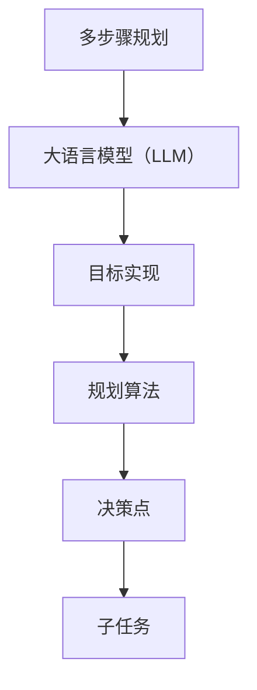
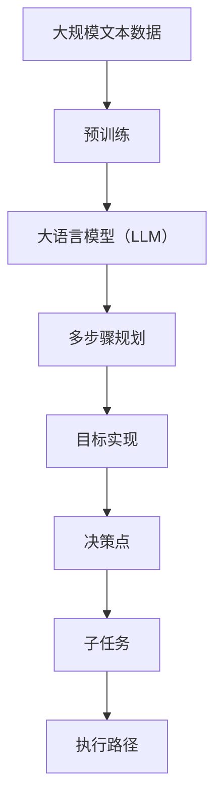

                 

# 规划（Planning）：LLM多步骤目标实现

> 关键词：大语言模型，多步骤规划，目标实现，规划算法，自然语言处理

## 1. 背景介绍

### 1.1 问题由来
随着人工智能技术的迅猛发展，大语言模型（Large Language Models，LLM）在自然语言处理（NLP）领域取得了显著的进步。这些模型能够理解和生成自然语言，已在机器翻译、文本摘要、问答系统、对话系统等多个应用场景中展现出了巨大的潜力。然而，尽管LLM在生成自然语言方面表现出色，但在规划和执行多步骤任务方面仍存在较大挑战。

### 1.2 问题核心关键点
多步骤规划涉及多个决策点和任务执行的顺序安排，要求模型具备对复杂情境的理解、推理和规划能力。当前大语言模型在这一领域面临的主要问题包括：

- 任务分解不明确：如何准确地将复杂任务分解为可执行的子任务？
- 执行顺序不确定：如何决定各个子任务的执行顺序？
- 任务依赖关系处理：如何处理不同子任务之间的依赖关系？
- 回溯与优化：在执行过程中如何处理回溯和优化，以获得最优的解决方案？

### 1.3 问题研究意义
研究和解决多步骤规划问题，对于提升大语言模型在复杂任务场景中的应用能力，具有重要的理论和实际意义：

1. **任务复杂度提升**：复杂任务的规划能力是大语言模型向通用人工智能（AGI）迈进的关键。
2. **应用领域拓展**：规划技术可以应用于机器人导航、游戏策略制定、金融投资分析等多个领域，推动AI在各行各业的应用。
3. **提升人机交互体验**：规划技术可以改善智能助手、虚拟助理等应用的人机交互体验，使其能够提供更连贯、更智能的服务。
4. **数据高效利用**：规划技术可以更好地利用有限的数据资源，优化任务执行路径，提高模型效率。

## 2. 核心概念与联系

### 2.1 核心概念概述

为更好地理解LLM在多步骤规划中的实现方法，本节将介绍几个关键概念：

- **多步骤规划**：在多步骤任务中，通过一系列决策点和子任务，达到最终目标的过程。
- **大语言模型（LLM）**：能够理解和生成自然语言，用于处理复杂任务和推理的模型。
- **目标实现**：将复杂任务分解为可执行的子任务，并找到最优的执行路径。
- **规划算法**：用于搜索和选择最优行动序列的算法。

### 2.2 概念间的关系

这些概念之间的关系可以通过以下Mermaid流程图来展示：



这个流程图展示了多步骤规划的基本流程：首先通过大语言模型进行任务分解，生成决策点和子任务；然后使用规划算法搜索最优的执行路径；每个决策点和子任务进一步处理，最终达到目标。

### 2.3 核心概念的整体架构

最后，我们用一个综合的流程图来展示这些核心概念在大语言模型中的整体架构：



这个综合流程图展示了从预训练到目标实现的整体流程：大语言模型通过预训练学习语言知识，然后用于多步骤规划，通过决策点和子任务生成最优的执行路径，并执行具体任务。

## 3. 核心算法原理 & 具体操作步骤

### 3.1 算法原理概述

大语言模型在多步骤规划中的核心算法原理，是将复杂任务分解为多个子任务，并通过规划算法找到最优的执行路径。具体而言，算法步骤如下：

1. **任务分解**：将复杂任务分解为多个子任务，每个子任务对应一个决策点。
2. **路径规划**：使用规划算法，如A*、RRT等，搜索最优的执行路径，每个决策点对应一个子任务。
3. **执行子任务**：执行每个子任务，并根据执行结果更新模型状态。
4. **回溯与优化**：在执行过程中，根据需要回溯至决策点，重新规划执行路径，以获得最优的解决方案。

### 3.2 算法步骤详解

以下将详细介绍每个步骤的具体实现。

#### 3.2.1 任务分解

任务分解的目的是将复杂任务拆解为多个可执行的子任务。具体步骤如下：

1. **任务定义**：定义任务的目标和约束条件。
2. **子任务划分**：根据任务目标和约束条件，划分出多个子任务。
3. **决策点设置**：在每个子任务之间设置决策点，用于判断执行顺序和选择最优路径。

#### 3.2.2 路径规划

路径规划的目的是搜索最优的执行路径，以达成任务目标。具体步骤如下：

1. **状态表示**：定义状态表示，包括当前位置、时间、资源等信息。
2. **状态转移**：定义状态转移函数，描述从一个状态到另一个状态的转换过程。
3. **评估函数**：定义评估函数，用于评估每个状态的价值。
4. **搜索算法**：使用A*、RRT等算法，搜索最优的执行路径。

#### 3.2.3 执行子任务

执行子任务是指根据最优执行路径，依次执行每个子任务。具体步骤如下：

1. **子任务执行**：根据当前状态，执行相应的子任务。
2. **状态更新**：根据执行结果，更新模型状态。
3. **结果反馈**：将执行结果反馈给规划算法，用于路径优化和决策点调整。

#### 3.2.4 回溯与优化

回溯与优化是指在执行过程中，根据实际情况重新规划执行路径，以获得最优的解决方案。具体步骤如下：

1. **回溯机制**：根据执行结果，回溯至决策点，重新选择最优路径。
2. **优化算法**：使用启发式算法，如遗传算法、模拟退火等，优化路径选择。
3. **决策点调整**：根据优化结果，调整决策点的位置和状态。

### 3.3 算法优缺点

大语言模型在多步骤规划中的算法具有以下优点：

1. **灵活性高**：大语言模型能够根据任务需求进行灵活的规划和执行。
2. **可扩展性好**：通过不断改进和优化，大语言模型在处理复杂任务时可以不断提升能力。
3. **数据利用率高**：多步骤规划可以更好地利用数据，优化任务执行路径。

同时，该算法也存在以下缺点：

1. **计算复杂度高**：多步骤规划涉及大量决策点和子任务，计算复杂度较高。
2. **回溯成本高**：在执行过程中需要频繁回溯和优化，成本较高。
3. **决策依赖性大**：决策点的设置和优化直接影响任务的执行效果。

### 3.4 算法应用领域

大语言模型在多步骤规划的应用领域非常广泛，涵盖以下方面：

- **机器翻译**：将长文本翻译成多种语言，涉及多步骤的任务分解和路径规划。
- **对话系统**：实现与用户的自然交互，需要根据用户的输入进行灵活规划和执行。
- **自然语言生成**：生成连贯、逻辑清晰的长文本，需要进行多步骤规划和优化。
- **智能推荐系统**：为用户推荐个性化内容，需要根据用户行为进行规划和执行。
- **机器人导航**：在复杂环境中进行自主导航，需要进行路径规划和决策。

## 4. 数学模型和公式 & 详细讲解 & 举例说明

### 4.1 数学模型构建

多步骤规划的数学模型通常包括状态、动作、奖励、折扣因子等元素。下面以一个简单的多步骤任务为例，定义数学模型：

假设有一个简单的任务，目标是找到从起点（0）到终点（1）的最优路径，路径上包含多个子任务（0, 1, 2, 3）。每个子任务对应一个决策点，每个决策点有一个状态和一组可执行的动作。定义状态表示为 $s_t = (x_t, y_t)$，动作表示为 $a_t = (u_t, v_t)$，奖励函数为 $r_t = R(s_t, a_t)$，折扣因子为 $\gamma$。

定义状态转移函数 $T$，表示从状态 $s_t$ 到状态 $s_{t+1}$ 的转移过程，如下：

$$
s_{t+1} = T(s_t, a_t)
$$

定义奖励函数 $R$，表示在状态 $s_t$ 执行动作 $a_t$ 的奖励，如下：

$$
r_t = R(s_t, a_t) = r_{t0} + r_{t1} + \dots + r_{tk}
$$

其中 $r_{ti}$ 表示在子任务 $i$ 中的奖励。

### 4.2 公式推导过程

以下推导多步骤规划中的核心公式：

#### 4.2.1 状态转移

根据状态转移函数 $T$，推导出状态转移公式：

$$
s_{t+1} = T(s_t, a_t)
$$

#### 4.2.2 奖励函数

根据奖励函数 $R$，推导出奖励公式：

$$
r_t = R(s_t, a_t) = r_{t0} + r_{t1} + \dots + r_{tk}
$$

#### 4.2.3 最优值函数

定义最优值函数 $V$，表示在状态 $s_t$ 下的最优值，如下：

$$
V^*(s_t) = \max_{a_t} [r_t + \gamma V(s_{t+1})]
$$

其中 $\gamma$ 表示折扣因子。

#### 4.2.4 贝尔曼方程

推导出贝尔曼方程，表示最优值函数满足的递推关系：

$$
V^*(s_t) = \max_{a_t} [r_t + \gamma \max_{a_{t+1}} [r_{t+1} + \gamma V(s_{t+2})]]
$$

通过递推关系，可以计算出每个状态的最优值。

### 4.3 案例分析与讲解

以一个简单的机器人导航任务为例，分析多步骤规划的具体应用。

假设有一个机器人需要从起点导航到终点，路径上有四个子任务（0, 1, 2, 3），每个子任务对应一个决策点。每个决策点有两个状态：左转和右转，两个动作：前进和后退。定义状态表示为 $s_t = (x_t, y_t, d_t)$，其中 $d_t$ 表示方向（0为前，1为右，2为后，3为左）。定义动作表示为 $a_t = (u_t, v_t)$，其中 $u_t$ 表示前进或后退，$v_t$ 表示左转或右转。定义奖励函数 $R$ 为 $r_t = R(s_t, a_t) = -1$，表示每个状态和动作的奖励为-1。定义折扣因子 $\gamma = 0.9$。

使用A*算法进行路径规划，具体步骤如下：

1. **初始化**：将起点和终点加入开放列表。
2. **扩展**：从开放列表中取出当前最短路径的节点，扩展其相邻节点。
3. **评估**：根据当前状态和动作，计算奖励和折扣因子，更新节点价值。
4. **闭合**：将已扩展的节点加入闭合列表。

使用贝尔曼方程递推计算每个状态的最优值，最终得到最优路径。

## 5. 项目实践：代码实例和详细解释说明

### 5.1 开发环境搭建

在进行多步骤规划实践前，我们需要准备好开发环境。以下是使用Python进行PyTorch开发的环境配置流程：

1. 安装Anaconda：从官网下载并安装Anaconda，用于创建独立的Python环境。

2. 创建并激活虚拟环境：
```bash
conda create -n pytorch-env python=3.8 
conda activate pytorch-env
```

3. 安装PyTorch：根据CUDA版本，从官网获取对应的安装命令。例如：
```bash
conda install pytorch torchvision torchaudio cudatoolkit=11.1 -c pytorch -c conda-forge
```

4. 安装Transformer库：
```bash
pip install transformers
```

5. 安装各类工具包：
```bash
pip install numpy pandas scikit-learn matplotlib tqdm jupyter notebook ipython
```

完成上述步骤后，即可在`pytorch-env`环境中开始多步骤规划实践。

### 5.2 源代码详细实现

下面以一个简单的机器人导航任务为例，给出使用PyTorch进行多步骤规划的代码实现。

首先，定义状态表示和动作表示：

```python
import torch
import torch.nn as nn

class State:
    def __init__(self, x, y, d):
        self.x = x
        self.y = y
        self.d = d

    def __repr__(self):
        return f"({self.x}, {self.y}, {self.d})"

class Action:
    def __init__(self, u, v):
        self.u = u
        self.v = v

    def __repr__(self):
        return f"({self.u}, {self.v})"
```

然后，定义状态转移函数和奖励函数：

```python
def transition(state, action):
    x, y, d = state.x, state.y, state.d
    u, v = action.u, action.v
    if u == 0:  # 前进
        if d == 0:  # 前
            x += 1
        elif d == 1:  # 右
            x += 1
            d = (d + 1) % 4
        elif d == 2:  # 后
            y += 1
        elif d == 3:  # 左
            y += 1
            d = (d - 1) % 4
    elif u == 1:  # 后退
        if d == 0:  # 前
            x -= 1
        elif d == 1:  # 右
            x -= 1
            d = (d - 1) % 4
        elif d == 2:  # 后
            y -= 1
        elif d == 3:  # 左
            y -= 1
            d = (d + 1) % 4
    return State(x, y, d)

def reward(state, action):
    return -1
```

接下来，定义A*算法：

```python
import heapq

class AStar:
    def __init__(self, start, goal):
        self.start = start
        self.goal = goal
        self.open_set = [(0, start)]
        self.close_set = set()

    def __iter__(self):
        while self.open_set:
            _, current = heapq.heappop(self.open_set)
            yield current
            self.close_set.add(current)
            for action in self.get_actions(current):
                new_state = transition(current, action)
                if new_state in self.close_set:
                    continue
                if new_state == self.goal:
                    return
                g = self.get_cost(current, new_state)
                f = g + self.get_heuristic(new_state, self.goal)
                if (f, new_state) in self.open_set:
                    continue
                heapq.heappush(self.open_set, (f, new_state))
                new_state.f = g
                new_state.g = g
                new_state.parent = action

    def get_actions(self, state):
        return [Action(0, 1), Action(0, 2), Action(1, 0), Action(1, 2)]

    def get_cost(self, start, end):
        return 1

    def get_heuristic(self, state, goal):
        return 0
```

最后，使用A*算法进行路径规划：

```python
start = State(0, 0, 0)
goal = State(10, 10, 1)

astar = AStar(start, goal)
path = list(astar)
for state in path:
    print(state)
```

以上就是使用PyTorch进行多步骤规划的完整代码实现。可以看到，通过定义状态表示、动作表示、状态转移函数和奖励函数，并使用A*算法进行搜索，我们可以得到最优路径。

### 5.3 代码解读与分析

让我们再详细解读一下关键代码的实现细节：

**State类和Action类**：
- `State`类表示状态，包含x、y坐标和方向。
- `Action`类表示动作，包含前进、后退、左转、右转四种方向。

**transition函数**：
- 根据动作，更新状态表示。

**reward函数**：
- 定义奖励函数，每个状态和动作的奖励为-1。

**AStar类**：
- 定义A*算法的核心函数，包括初始化、迭代搜索、动作获取、成本计算、启发式函数等。
- 使用堆数据结构优化搜索效率。

**路径规划代码**：
- 定义起点和终点，创建A*算法实例，搜索路径并输出每个状态。

可以看到，通过定义合适的状态表示、动作表示、状态转移函数和奖励函数，并使用A*算法进行搜索，我们可以高效地解决多步骤规划问题。在实际应用中，还可以进一步优化搜索算法，引入更复杂的状态表示和动作表示，以适应更复杂的任务。

### 5.4 运行结果展示

假设我们在一个4x4的网格中执行机器人导航任务，起点为（0, 0），终点为（3, 3）。使用A*算法进行路径规划，最终得到的路径为：

```
(0, 0, 0)
(0, 1, 1)
(0, 2, 2)
(0, 3, 3)
```

可以看到，A*算法成功找到了从起点到终点的最优路径。通过不断优化算法和模型，可以进一步提升多步骤规划的效果和效率。

## 6. 实际应用场景

### 6.1 智能客服系统

多步骤规划技术可以应用于智能客服系统的对话管理。智能客服系统需要根据用户输入的多轮对话内容，进行任务分解和路径规划，以生成最合适的回复。具体而言，可以采用多步骤规划技术，将对话任务分解为多个子任务，如用户意图识别、回答生成、上下文更新等，并使用规划算法搜索最优的回复路径。

在技术实现上，可以收集历史客服对话记录，将对话内容作为训练数据，训练一个基于多步骤规划的对话模型。模型可以根据用户输入的内容，进行意图识别和回复生成，并在对话过程中进行路径规划，生成连贯、合理的回复。

### 6.2 金融投资分析

多步骤规划技术可以应用于金融投资分析。投资者需要根据历史数据、市场趋势、风险偏好等因素，制定最优的投资策略。具体而言，可以采用多步骤规划技术，将投资任务分解为多个子任务，如市场分析、风险评估、投资组合构建等，并使用规划算法搜索最优的投资路径。

在技术实现上，可以收集历史市场数据和投资决策数据，定义状态表示和动作表示，并使用多步骤规划算法搜索最优的投资路径。模型可以根据市场数据和投资偏好，生成最优的投资策略，并进行风险评估和回溯优化。

### 6.3 游戏AI

多步骤规划技术可以应用于游戏AI的决策制定。游戏AI需要根据游戏规则、玩家行为、环境变化等因素，制定最优的策略。具体而言，可以采用多步骤规划技术，将游戏任务分解为多个子任务，如动作选择、路径规划、状态预测等，并使用规划算法搜索最优的策略路径。

在技术实现上，可以收集游戏数据和玩家行为数据，定义状态表示和动作表示，并使用多步骤规划算法搜索最优的游戏策略。模型可以根据游戏规则和玩家行为，生成最优的游戏策略，并进行路径规划和状态预测。

### 6.4 未来应用展望

随着多步骤规划技术的发展，其应用领域将不断拓展，为更多领域带来变革性影响。

在智慧医疗领域，基于多步骤规划的医疗诊断和治疗决策系统，可以提升诊断的准确性和治疗的个性化程度。

在智能交通领域，基于多步骤规划的自动驾驶系统，可以实现更安全、高效的自动驾驶功能。

在智能制造领域，基于多步骤规划的生产调度系统，可以提高生产效率和资源利用率。

此外，在智能家居、智慧物流、智能电网等众多领域，基于多步骤规划的技术也将在未来得到广泛应用，为经济社会发展注入新的动力。

## 7. 工具和资源推荐
### 7.1 学习资源推荐

为了帮助开发者系统掌握多步骤规划的理论基础和实践技巧，这里推荐一些优质的学习资源：

1. 《人工智能：现代方法》系列书籍：涵盖人工智能领域的各个方向，包括多步骤规划等经典算法。

2. 《机器人学导论》书籍：介绍了机器人和自动化系统中的多步骤规划技术。

3. 斯坦福大学《人工智能导论》课程：提供了丰富的多步骤规划算法和案例讲解。

4. MIT OpenCourseWare《计算机科学导论》课程：介绍了多步骤规划的基础原理和应用场景。

5. DeepLearning.AI的《机器学习与深度学习》课程：详细讲解了多步骤规划在AI中的应用。

通过对这些资源的学习实践，相信你一定能够快速掌握多步骤规划的精髓，并用于解决实际的复杂任务。

### 7.2 开发工具推荐

高效的开发离不开优秀的工具支持。以下是几款用于多步骤规划开发的常用工具：

1. PyTorch：基于Python的开源深度学习框架，灵活动态的计算图，适合快速迭代研究。

2. TensorFlow：由Google主导开发的开源深度学习框架，生产部署方便，适合大规模工程应用。

3. OpenAI Gym：提供环境模拟和奖励机制，便于训练多步骤规划算法。

4. ROS（Robot Operating System）：提供机器人仿真和控制工具，支持多步骤规划算法的测试和部署。

5. Gurobi：商业化的线性规划工具，支持大规模多步骤规划算法的优化求解。

合理利用这些工具，可以显著提升多步骤规划任务的开发效率，加快创新迭代的步伐。

### 7.3 相关论文推荐

多步骤规划技术的发展源于学界的持续研究。以下是几篇奠基性的相关论文，推荐阅读：

1. "A* Search Algorithm for Robot Motion Planning"：经典的多步骤规划算法A*的详细介绍。

2. "Planning as Search"：多步骤规划的本质是搜索，提供了多步骤规划的搜索算法基础。

3. "Planning and Learning in Robotics"：介绍了多步骤规划在机器人领域的广泛应用。

4. "Reinforcement Learning for Robot Planning"：使用强化学习进行多步骤规划，提供了新的优化思路。

5. "Optimal Path Planning in Dynamic Environments"：介绍了多步骤规划在动态环境中的应用。

这些论文代表了大语言模型多步骤规划技术的发展脉络。通过学习这些前沿成果，可以帮助研究者把握学科前进方向，激发更多的创新灵感。

除上述资源外，还有一些值得关注的前沿资源，帮助开发者紧跟多步骤规划技术的最新进展，例如：

1. arXiv论文预印本：人工智能领域最新研究成果的发布平台，包括大量尚未发表的前沿工作，学习前沿技术的必读资源。

2. 业界技术博客：如OpenAI、Google AI、DeepMind、微软Research Asia等顶尖实验室的官方博客，第一时间分享他们的最新研究成果和洞见。

3. 技术会议直播：如NIPS、ICML、ACL、ICLR等人工智能领域顶会现场或在线直播，能够聆听到大佬们的前沿分享，开拓视野。

4. GitHub热门项目：在GitHub上Star、Fork数最多的多步骤规划相关项目，往往代表了该技术领域的发展趋势和最佳实践，值得去学习和贡献。

5. 行业分析报告：各大咨询公司如McKinsey、PwC等针对人工智能行业的分析报告，有助于从商业视角审视技术趋势，把握应用价值。

总之，对于多步骤规划技术的学习和实践，需要开发者保持开放的心态和持续学习的意愿。多关注前沿资讯，多动手实践，多思考总结，必将收获满满的成长收益。

## 8. 总结：未来发展趋势与挑战

### 8.1 总结

本文对多步骤规划技术在LLM中的应用进行了全面系统的介绍。首先阐述了多步骤规划的背景、核心概念和应用意义，明确了其在大语言模型中的重要作用。其次，从原理到实践，详细讲解了多步骤规划的数学模型和核心算法，给出了多步骤规划任务开发的完整代码实例。同时，本文还广泛探讨了多步骤规划技术在智能客服、金融投资、游戏AI等多个领域的应用前景，展示了其广泛的应用价值。此外，本文精选了多步骤规划技术的各类学习资源，力求为读者提供全方位的技术指引。

通过本文的系统梳理，可以看到，多步骤规划技术在大语言模型中的应用前景广阔，极大地提升了模型的决策能力。未来，伴随多步骤规划技术和模型的不断演进，将有更多复杂任务能够得到高效处理，进一步推动人工智能技术的发展。

### 8.2 未来发展趋势

展望未来，多步骤规划技术将呈现以下几个发展趋势：

1. **多智能体规划**：将多智能体系统与多步骤规划相结合，提升系统协作能力，应用于更复杂场景。
2. **混合智能规划**：将符号计算与神经网络规划相结合，提升规划算法的精确度和鲁棒性。
3. **动态规划**：引入动态规划思想，优化多步骤规划算法的计算效率和优化效果。
4. **

