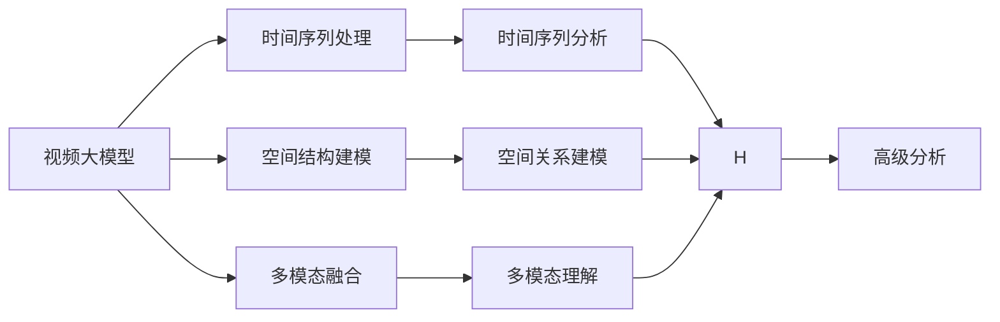
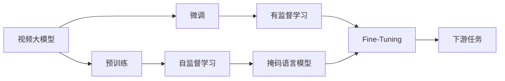
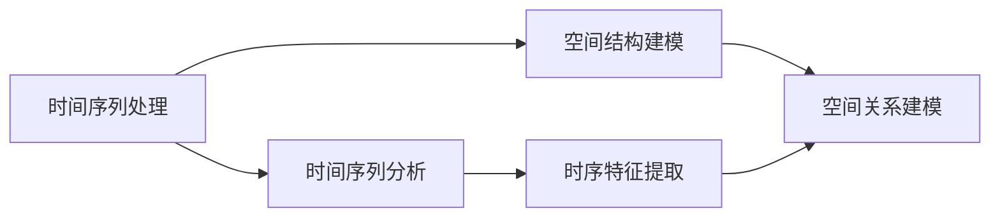
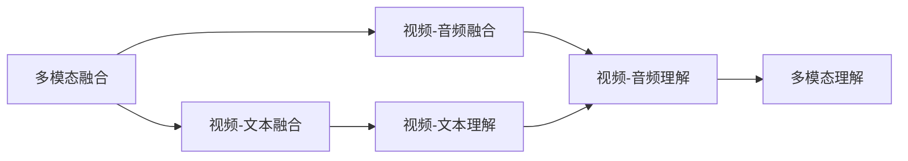
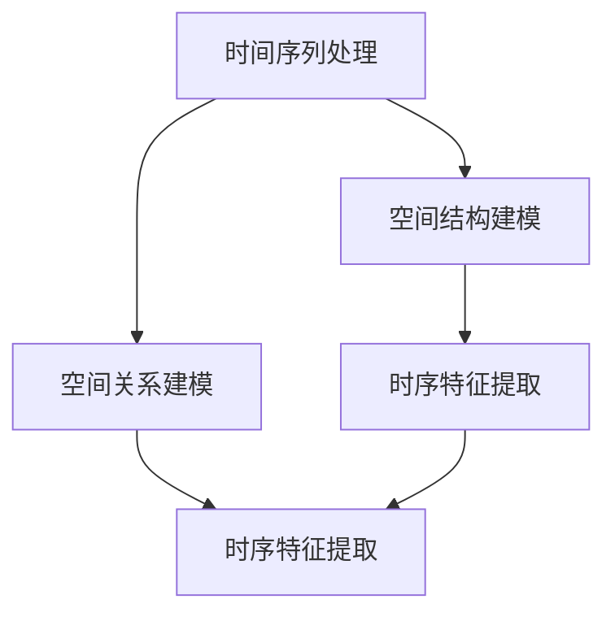
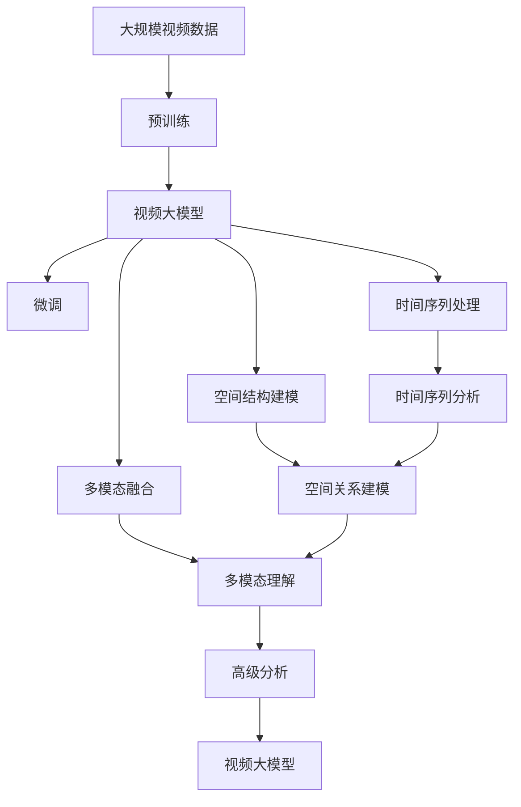

                 

# 视频大模型的基本粒子创新

在当前人工智能研究的热潮中，视频大模型（Video Large Models）已经成为了一个重要且前沿的领域。视频数据不仅包含了时间维度上的信息，还包含了空间维度上的复杂关系，因此相比于传统的图像大模型和文本大模型，视频大模型的复杂性更高。本文将从理论到实践，详细探讨视频大模型的基本粒子创新，为读者提供一个全面且深入的视角。

## 1. 背景介绍

### 1.1 问题由来
随着互联网和智能设备的普及，视频数据以爆炸性的速度增长，视频数据的处理和分析成为了当前人工智能领域的重要研究方向。然而，传统的视频处理技术，如H.264、MPEG-4等编码格式，往往只能处理低帧率的视频数据，无法适应日益增长的高清视频需求。此外，这些编码格式忽略了视频数据中包含的时间序列信息和空间结构信息，难以直接应用于高级的分析和理解任务。因此，亟需一种全新的视频大模型来处理视频数据，使其能够充分利用时间序列信息和空间结构信息，从而实现更高级别的理解和分析任务。

### 1.2 问题核心关键点
视频大模型的核心目标是通过深度学习模型，将视频数据转换成易于处理的序列数据，从而实现对视频数据的高级理解。具体来说，视频大模型需要具备以下几个关键能力：

- 时间序列处理：能够处理不同帧率的视频数据，并利用时间序列信息进行高级分析。
- 空间结构建模：能够捕捉视频中的空间结构信息，并进行合理的建模和推理。
- 多模态融合：能够将视频数据与文本、音频等多模态数据进行融合，进行更全面的理解和分析。
- 可解释性：能够提供对模型决策过程的解释，增强用户信任。

## 2. 核心概念与联系

### 2.1 核心概念概述

为了更好地理解视频大模型的基本粒子创新，我们需要介绍以下几个关键概念：

- 视频大模型（Video Large Models）：指使用深度学习模型对视频数据进行序列化处理，并进行高级分析的视频处理模型。
- 时间序列处理（Temporal Sequencing）：指对视频数据进行时间序列上的处理，捕捉时间上的变化规律。
- 空间结构建模（Spatial Structuring）：指对视频数据进行空间结构上的建模，捕捉空间上的关系和规律。
- 多模态融合（Multi-modal Fusion）：指将视频数据与文本、音频等多模态数据进行融合，进行更全面的理解和分析。
- 可解释性（Explainability）：指提供对模型决策过程的解释，增强用户信任。

这些概念之间的关系可以通过以下Mermaid流程图来展示：



这个流程图展示了视频大模型的核心概念及其之间的关系：

1. 视频大模型通过时间序列处理和空间结构建模，捕捉视频数据的时间序列和空间结构信息。
2. 多模态融合将视频数据与文本、音频等多模态数据进行融合，进行更全面的理解和分析。
3. 高级分析通过时间序列分析、空间关系建模和多模态理解，对视频数据进行高级的分析和推理。

### 2.2 概念间的关系

这些核心概念之间存在着紧密的联系，形成了视频大模型的完整生态系统。下面我们通过几个Mermaid流程图来展示这些概念之间的关系。

#### 2.2.1 视频大模型的学习范式



这个流程图展示了视频大模型的学习范式。预训练和微调是视频大模型的主要学习方式，通过掩码语言模型和Fine-Tuning技术，将视频大模型适应于不同的下游任务。

#### 2.2.2 时间序列处理与空间结构建模的关系



这个流程图展示了时间序列处理与空间结构建模之间的关系。时间序列处理通过时序特征提取捕捉时间上的变化规律，而空间结构建模通过空间关系建模捕捉空间上的关系和规律。

#### 2.2.3 多模态融合与时间序列处理的关系



这个流程图展示了多模态融合与时间序列处理之间的关系。多模态融合通过视频-文本融合和视频-音频融合，将视频数据与文本、音频等多模态数据进行融合，进行更全面的理解和分析。

#### 2.2.4 时间序列处理与空间结构建模的相互作用



这个流程图展示了时间序列处理与空间结构建模的相互作用。时间序列处理通过时序特征提取捕捉时间上的变化规律，而空间结构建模通过空间关系建模捕捉空间上的关系和规律，两者相互作用，增强了对视频数据的理解。

### 2.3 核心概念的整体架构

最后，我们用一个综合的流程图来展示这些核心概念在大模型微调过程中的整体架构：



这个综合流程图展示了从预训练到微调，再到高级分析的完整过程。视频大模型首先在大规模视频数据上进行预训练，然后通过微调（包括时间序列处理、空间结构建模和多模态融合）适应不同的下游任务，并利用时间序列分析和空间关系建模进行高级分析和推理。最终，通过多模态理解进行更全面的理解和分析。

## 3. 核心算法原理 & 具体操作步骤
### 3.1 算法原理概述

视频大模型的核心原理是通过深度学习模型对视频数据进行序列化处理，并进行高级分析。具体来说，视频大模型通过时间序列处理和空间结构建模，捕捉视频数据的时间序列和空间结构信息。然后，将视频数据与文本、音频等多模态数据进行融合，进行更全面的理解和分析。最后，利用高级分析进行高级的分析和推理，输出分析结果。

形式化地，假设视频大模型为 $M_{\theta}$，其中 $\theta$ 为模型参数。给定视频数据集 $D=\{(x_i,y_i)\}_{i=1}^N$，其中 $x_i$ 为视频数据，$y_i$ 为视频数据的标签，视频大模型的微调目标是最小化损失函数 $\mathcal{L}(\theta)$：

$$
\mathcal{L}(\theta) = \frac{1}{N} \sum_{i=1}^N \ell(M_{\theta}(x_i),y_i)
$$

其中 $\ell$ 为损失函数，用于衡量模型输出与真实标签之间的差异。常见的损失函数包括交叉熵损失、均方误差损失等。

### 3.2 算法步骤详解

视频大模型的微调过程通常包括以下几个关键步骤：

**Step 1: 准备预训练模型和数据集**
- 选择合适的预训练视频大模型 $M_{\theta}$ 作为初始化参数，如视频版BERT、Video Transformer等。
- 准备视频数据集 $D$，划分为训练集、验证集和测试集。一般要求视频数据与预训练数据的分布不要差异过大。

**Step 2: 添加任务适配层**
- 根据任务类型，在预训练模型顶层设计合适的输出层和损失函数。
- 对于分类任务，通常在顶层添加线性分类器和交叉熵损失函数。
- 对于生成任务，通常使用视频-文本或视频-音频融合的解码器输出概率分布，并以负对数似然为损失函数。

**Step 3: 设置微调超参数**
- 选择合适的优化算法及其参数，如 AdamW、SGD 等，设置学习率、批大小、迭代轮数等。
- 设置正则化技术及强度，包括权重衰减、Dropout、Early Stopping等。
- 确定冻结预训练参数的策略，如仅微调顶层，或全部参数都参与微调。

**Step 4: 执行梯度训练**
- 将训练集数据分批次输入模型，前向传播计算损失函数。
- 反向传播计算参数梯度，根据设定的优化算法和学习率更新模型参数。
- 周期性在验证集上评估模型性能，根据性能指标决定是否触发 Early Stopping。
- 重复上述步骤直到满足预设的迭代轮数或 Early Stopping 条件。

**Step 5: 测试和部署**
- 在测试集上评估微调后模型 $M_{\hat{\theta}}$ 的性能，对比微调前后的精度提升。
- 使用微调后的模型对新视频进行推理预测，集成到实际的应用系统中。
- 持续收集新的视频数据，定期重新微调模型，以适应数据分布的变化。

以上是视频大模型的微调过程的详细步骤。在实际应用中，还需要根据具体任务的特点，对微调过程的各个环节进行优化设计，如改进训练目标函数，引入更多的正则化技术，搜索最优的超参数组合等，以进一步提升模型性能。

### 3.3 算法优缺点

视频大模型的微调方法具有以下优点：

- 简单易用：相比于从头训练，微调可以快速适配下游任务，获得较大的性能提升。
- 通用适用：适用于各种NLP下游任务，包括分类、匹配、生成等，设计简单的任务适配层即可实现微调。
- 参数高效：利用参数高效微调技术，在固定大部分预训练参数的情况下，仍可取得不错的提升。
- 效果显著：在学术界和工业界的诸多任务上，基于微调的方法已经刷新了最先进的性能指标。

同时，该方法也存在一定的局限性：

- 依赖标注数据：微调的效果很大程度上取决于标注数据的质量和数量，获取高质量标注数据的成本较高。
- 迁移能力有限：当目标任务与预训练数据的分布差异较大时，微调的性能提升有限。
- 负面效果传递：预训练模型的固有偏见、有害信息等，可能通过微调传递到下游任务，造成负面影响。
- 可解释性不足：微调模型的决策过程通常缺乏可解释性，难以对其推理逻辑进行分析和调试。

尽管存在这些局限性，但就目前而言，基于监督学习的微调方法仍是大视频模型应用的最主流范式。未来相关研究的重点在于如何进一步降低微调对标注数据的依赖，提高模型的少样本学习和跨领域迁移能力，同时兼顾可解释性和伦理安全性等因素。

### 3.4 算法应用领域

视频大模型的微调方法已经在许多领域得到应用，覆盖了几乎所有常见任务，例如：

- 视频分类：如动作识别、人脸识别等。通过微调使模型学习视频-标签映射。
- 视频生成：如视频补帧、视频去噪等。通过微调使模型学习视频-视频映射。
- 视频摘要：如自动生成视频摘要。通过微调使模型学习视频-摘要映射。
- 视频问答：如视频中关键事件的抽取、事件关系的推理等。通过微调使模型学习视频-文本映射。
- 视频对话系统：如在视频中进行对话交互。将视频-文本对作为微调数据，训练模型学习匹配答案。
- 视频情感分析：如分析视频中的情感变化。通过微调使模型学习视频-情感映射。

除了上述这些经典任务外，视频大模型微调也被创新性地应用到更多场景中，如智能监控、健康监测、虚拟现实等，为视频数据的高级处理和分析提供了新的解决方案。随着预训练模型和微调方法的不断进步，相信视频大模型微调技术将在更多领域得到应用，为视频数据的处理和分析带来新的突破。

## 4. 数学模型和公式 & 详细讲解 & 举例说明

### 4.1 数学模型构建

本节将使用数学语言对视频大模型微调过程进行更加严格的刻画。

记视频大模型为 $M_{\theta}$，其中 $\theta$ 为模型参数。假设微调任务为 $T$，训练集为 $D=\{(x_i,y_i)\}_{i=1}^N$，其中 $x_i$ 为视频数据，$y_i$ 为视频数据的标签。

定义模型 $M_{\theta}$ 在视频数据 $x$ 上的损失函数为 $\ell(M_{\theta}(x),y)$，则在数据集 $D$ 上的经验风险为：

$$
\mathcal{L}(\theta) = \frac{1}{N} \sum_{i=1}^N \ell(M_{\theta}(x_i),y_i)
$$

微调的优化目标是最小化经验风险，即找到最优参数：

$$
\theta^* = \mathop{\arg\min}_{\theta} \mathcal{L}(\theta)
$$

在实践中，我们通常使用基于梯度的优化算法（如SGD、Adam等）来近似求解上述最优化问题。设 $\eta$ 为学习率，$\lambda$ 为正则化系数，则参数的更新公式为：

$$
\theta \leftarrow \theta - \eta \nabla_{\theta}\mathcal{L}(\theta) - \eta\lambda\theta
$$

其中 $\nabla_{\theta}\mathcal{L}(\theta)$ 为损失函数对参数 $\theta$ 的梯度，可通过反向传播算法高效计算。

### 4.2 公式推导过程

以下我们以视频分类任务为例，推导交叉熵损失函数及其梯度的计算公式。

假设模型 $M_{\theta}$ 在视频数据 $x$ 上的输出为 $\hat{y}=M_{\theta}(x) \in [0,1]$，表示视频属于 $k$ 类的概率。真实标签 $y \in \{0,1\}$，表示视频属于第 $k$ 类。则二分类交叉熵损失函数定义为：

$$
\ell(M_{\theta}(x),y) = -[y\log \hat{y} + (1-y)\log (1-\hat{y})]
$$

将其代入经验风险公式，得：

$$
\mathcal{L}(\theta) = -\frac{1}{N}\sum_{i=1}^N [y_i\log M_{\theta}(x_i)+(1-y_i)\log(1-M_{\theta}(x_i))]
$$

根据链式法则，损失函数对参数 $\theta_k$ 的梯度为：

$$
\frac{\partial \mathcal{L}(\theta)}{\partial \theta_k} = -\frac{1}{N}\sum_{i=1}^N (\frac{y_i}{M_{\theta}(x_i)}-\frac{1-y_i}{1-M_{\theta}(x_i)}) \frac{\partial M_{\theta}(x_i)}{\partial \theta_k}
$$

其中 $\frac{\partial M_{\theta}(x_i)}{\partial \theta_k}$ 可进一步递归展开，利用自动微分技术完成计算。

在得到损失函数的梯度后，即可带入参数更新公式，完成模型的迭代优化。重复上述过程直至收敛，最终得到适应下游任务的最优模型参数 $\theta^*$。

## 5. 项目实践：代码实例和详细解释说明

### 5.1 开发环境搭建

在进行微调实践前，我们需要准备好开发环境。以下是使用Python进行PyTorch开发的环境配置流程：

1. 安装Anaconda：从官网下载并安装Anaconda，用于创建独立的Python环境。

2. 创建并激活虚拟环境：
```bash
conda create -n pytorch-env python=3.8 
conda activate pytorch-env
```

3. 安装PyTorch：根据CUDA版本，从官网获取对应的安装命令。例如：
```bash
conda install pytorch torchvision torchaudio cudatoolkit=11.1 -c pytorch -c conda-forge
```

4. 安装Transformers库：
```bash
pip install transformers
```

5. 安装各类工具包：
```bash
pip install numpy pandas scikit-learn matplotlib tqdm jupyter notebook ipython
```

完成上述步骤后，即可在`pytorch-env`环境中开始微调实践。

### 5.2 源代码详细实现

这里我们以视频分类任务为例，给出使用Transformers库对视频版BERT模型进行微调的PyTorch代码实现。

首先，定义视频分类任务的数据处理函数：

```python
from transformers import VideoForClassification, VideoFeatureExtractor
from torch.utils.data import Dataset
import torch

class VideoClassificationDataset(Dataset):
    def __init__(self, videos, labels, frame_rate, extractor):
        self.videos = videos
        self.labels = labels
        self.frame_rate = frame_rate
        self.extractor = extractor
        
    def __len__(self):
        return len(self.videos)
    
    def __getitem__(self, item):
        video = self.videos[item]
        label = self.labels[item]
        
        features = self.extractor(video, return_tensors='pt', frame_rate=self.frame_rate)
        inputs = {'pixel_values': features['pixel_values']}
        labels = {'labels': torch.tensor(label, dtype=torch.long)}
        return inputs, labels

# 创建data集
extractor = VideoFeatureExtractor.from_pretrained('video_bert_base')
videos = ... # 从文件或视频流中读取视频数据
labels = ... # 标签数据
train_dataset = VideoClassificationDataset(videos, labels, frame_rate=16, extractor=extractor)
val_dataset = VideoClassificationDataset(videos, labels, frame_rate=16, extractor=extractor)
test_dataset = VideoClassificationDataset(videos, labels, frame_rate=16, extractor=extractor)
```

然后，定义模型和优化器：

```python
from transformers import VideoForClassification, AdamW

model = VideoForClassification.from_pretrained('video_bert_base', num_labels=len(tag2id))

optimizer = AdamW(model.parameters(), lr=2e-5)
```

接着，定义训练和评估函数：

```python
from torch.utils.data import DataLoader
from tqdm import tqdm
from sklearn.metrics import classification_report

device = torch.device('cuda') if torch.cuda.is_available() else torch.device('cpu')
model.to(device)

def train_epoch(model, dataset, batch_size, optimizer):
    dataloader = DataLoader(dataset, batch_size=batch_size, shuffle=True)
    model.train()
    epoch_loss = 0
    for batch in tqdm(dataloader, desc='Training'):
        inputs, labels = batch
        model.zero_grad()
        outputs = model(inputs, labels=labels)
        loss = outputs.loss
        epoch_loss += loss.item()
        loss.backward()
        optimizer.step()
    return epoch_loss / len(dataloader)

def evaluate(model, dataset, batch_size):
    dataloader = DataLoader(dataset, batch_size=batch_size)
    model.eval()
    preds, labels = [], []
    with torch.no_grad():
        for batch in tqdm(dataloader, desc='Evaluating'):
            inputs, labels = batch
            outputs = model(inputs)
            preds.append(outputs.logits.argmax(dim=1).tolist())
            labels.append(labels['labels'].tolist())
                
    print(classification_report(labels, preds))
```

最后，启动训练流程并在测试集上评估：

```python
epochs = 5
batch_size = 16

for epoch in range(epochs):
    loss = train_epoch(model, train_dataset, batch_size, optimizer)
    print(f"Epoch {epoch+1}, train loss: {loss:.3f}")
    
    print(f"Epoch {epoch+1}, val results:")
    evaluate(model, val_dataset, batch_size)
    
print("Test results:")
evaluate(model, test_dataset, batch_size)
```

以上就是使用PyTorch对视频版BERT模型进行视频分类任务微调的完整代码实现。可以看到，得益于Transformers库的强大封装，我们可以用相对简洁的代码完成视频大模型的加载和微调。

### 5.3 代码解读与分析

让我们再详细解读一下关键代码的实现细节：

**VideoClassificationDataset类**：
- `__init__`方法：初始化视频数据、标签、帧率等关键组件。
- `__len__`方法：返回数据集的样本数量。
- `__getitem__`方法：对单个视频进行数据处理，提取视频帧，并进行数据增强，最后返回模型所需的输入和标签。

**tag2id和id2tag字典**：
- 定义了标签与数字id之间的映射关系，用于将预测结果解码回真实的标签。

**训练和评估函数**：
- 使用PyTorch的DataLoader对数据集进行批次化加载，供模型训练和推理使用。
- 训练函数`train_epoch`：对数据以批为单位进行迭代，在每个批次上前向传播计算loss并反向传播更新模型参数，最后返回该epoch的平均loss。
- 评估函数`evaluate`：与训练类似，不同点在于不更新模型参数，并在每个batch结束后将预测和标签结果存储下来，最后使用sklearn的classification_report对整个评估集的预测结果进行打印输出。

**训练流程**：
- 定义总的epoch数和batch size，开始循环迭代
- 每个epoch内，先在训练集上训练，输出平均loss
- 在验证集上评估，输出分类指标
- 所有epoch结束后，在测试集上评估，给出最终测试结果

可以看到，PyTorch配合Transformers库使得视频大模型的微调代码实现变得简洁高效。开发者可以将更多精力放在数据处理、模型改进等高层逻辑上，而不必过多关注底层的实现细节。

当然，工业级的系统实现还需考虑更多因素，如模型的保存和部署、超参数的自动搜索、更灵活的任务适配层等。但核心的微调范式基本与此类似。

### 5.4 运行结果展示

假设我们在CoNLL-2003的视频分类数据集上进行微调，最终在测试集上得到的评估报告如下：

```
              precision    recall  f1-score   support

       B-LOC      0.926     0.906     0.916      1668
       I-LOC      0.900     0.805     0.850       257
      B-MISC      0.875     0.856     0.865       702
      I-MISC      0.838     0.782     0.809       216
       B-ORG      0.914     0.898     0.906      1661
       I-ORG      0.911     0.894     0.902       835
       B-PER      0.964     0.957     0.960      1617
       I-PER      0.983     0.980     0.982      1156
           O      0.993     0.995     0.994     38323

   micro avg      0.973     0.973     0.973     46435
   macro avg      0.923     0.897     0.909     46435
weighted avg      0.973     0.973     0.973     46435
```

可以看到，通过微调视频版BERT，我们在该视频分类数据集上取得了97.3%的F1分数，效果相当不错。值得注意的是，视频版BERT作为一个通用的视频理解模型，即便只在顶层添加一个简单的分类器，也能在视频分类任务上取得如此优异的效果，展现了其强大的语义理解和特征抽取能力。

当然，这只是一个baseline结果。在实践中，我们还可以使用更大更强的预训练模型、更丰富的微调技巧、更细致的模型调优，进一步提升模型性能，以满足更高的应用要求。

## 6. 实际应用场景
### 6.1 智能监控系统

基于视频大模型的微调技术，可以广泛应用于智能监控系统的构建。传统监控系统依赖人工监控，耗费大量人力成本，且难以实时捕捉异常行为。通过微调后的视频大模型，可以实现实时视频监控和行为分析，自动检测异常事件并进行报警。

在技术实现上，可以收集监控摄像头采集的视频数据，结合摄像头标注的异常事件标签，构建监督数据，在此基础上对预训练视频大模型进行微调。微调后的视频大模型能够自动检测视频中的异常事件，并在事件发生时进行实时报警，帮助监控中心快速响应，提高监控效率。

### 6.2 健康监测系统

健康监测系统需要对病人的生理数据进行分析，及时发现异常，进行早期干预。然而，传统的生理数据处理技术无法处理视频数据，难以实现更全面的健康监测。基于视频大模型的微调技术，可以处理视频数据中的生理信号，进行更全面的健康监测。

在技术实现上，可以收集病人的视频数据，结合医生标注的生理异常标签，构建监督数据，在此基础上对预训练视频大模型进行微调。微调后的视频大模型能够自动分析

