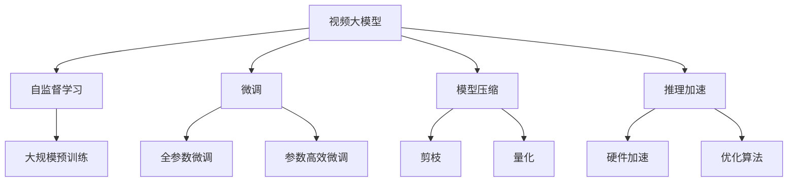

                 

# 视频大模型的核心技术解析

## 1. 背景介绍

### 1.1 问题由来
随着计算机视觉与深度学习技术的迅猛发展，视频大模型的研究成为了一个重要的研究方向。视频大模型通过在大规模数据集上进行自监督学习，可以学习到视频中的多种视觉、语音和行为信息，具有强大的视频理解和生成能力。其在视频监控、智能家居、自动驾驶等领域具有广泛的应用前景。

视频大模型通常由Transformer等神经网络结构构成，通过在大量视频数据上进行自监督学习，学习到复杂的视频特征，并通过微调进行任务特定的优化，如视频分类、行为识别、动作检测、视频生成等。

### 1.2 问题核心关键点
视频大模型的核心问题在于如何在大规模数据集上进行有效的自监督学习，以及如何通过微调进行任务特定的优化。关键技术包括：

- **自监督学习**：在大规模无标签视频数据上进行自监督学习，学习到通用视频特征。
- **微调**：通过少量标注数据，对预训练的通用视频特征进行优化，使其适应特定任务。
- **模型压缩**：在保证模型性能的前提下，对模型进行压缩优化，减少计算资源消耗。
- **推理加速**：通过硬件加速和模型优化，提升视频大模型的推理速度，支持实时应用。

### 1.3 问题研究意义
视频大模型的研究对于提升计算机视觉与深度学习技术在视频领域的理解与应用具有重要意义：

- **增强视频理解能力**：视频大模型能够从视频中提取更多、更丰富的特征，提升视频分类、行为识别等任务的效果。
- **加速视频生成**：通过生成对抗网络（GAN）等技术，视频大模型能够生成高质量的视频内容，为内容创作提供支持。
- **提升视频交互体验**：视频大模型在智能家居、自动驾驶等领域的应用，将大幅提升用户体验。
- **促进跨领域研究**：视频大模型的研究，将促进计算机视觉与自然语言处理、语音识别等领域的交叉融合。

## 2. 核心概念与联系

### 2.1 核心概念概述

- **视频大模型**：指通过在大规模视频数据上进行自监督学习，学习到视频中复杂视觉、语音和行为信息的模型。其通常由Transformer等神经网络结构构成，具有强大的视频理解和生成能力。
- **自监督学习**：指在大规模无标签数据上进行学习，学习到数据的潜在结构与特征。常见的自监督任务包括视频帧预测、帧间关系学习等。
- **微调**：指在大规模预训练模型的基础上，使用少量标注数据，通过有监督学习优化模型，使其适应特定任务。
- **模型压缩**：指在保证模型性能的前提下，对模型进行压缩优化，减少计算资源消耗。常见的压缩方法包括剪枝、量化等。
- **推理加速**：指通过硬件加速和模型优化，提升视频大模型的推理速度，支持实时应用。

这些核心概念之间存在紧密的联系，通过自监督学习和大规模预训练，视频大模型可以学习到通用的视频特征，通过微调进一步适应特定任务，通过模型压缩和推理加速，支持大规模应用和实时推理。

### 2.2 概念间的关系

这些核心概念之间的联系可以通过以下Mermaid流程图来展示：



这个流程图展示了大模型的核心概念及其之间的关系：

1. 视频大模型通过大规模预训练学习通用视频特征。
2. 通过微调，模型可以适应特定任务，实现任务特定的优化。
3. 压缩优化可以降低计算资源消耗，提升推理速度。
4. 推理加速通过硬件和算法优化，支持实时应用。

## 3. 核心算法原理 & 具体操作步骤
### 3.1 算法原理概述

视频大模型的核心算法原理主要基于Transformer结构，通过自监督学习在大规模视频数据上进行预训练，学习到通用的视频特征。预训练后，通过微调进行特定任务优化，如视频分类、行为识别等。

### 3.2 算法步骤详解

视频大模型的微调通常包括以下几个关键步骤：

**Step 1: 准备预训练模型和数据集**
- 选择合适的视频大模型作为初始化参数，如X3D、I3D等。
- 准备视频分类、行为识别等下游任务的标注数据集，划分为训练集、验证集和测试集。

**Step 2: 添加任务适配层**
- 根据任务类型，在预训练模型的顶层设计合适的输出层和损失函数。
- 对于分类任务，通常在顶层添加线性分类器和交叉熵损失函数。
- 对于识别任务，通常使用IoU损失函数。

**Step 3: 设置微调超参数**
- 选择合适的优化算法及其参数，如AdamW、SGD等，设置学习率、批大小、迭代轮数等。
- 设置正则化技术及强度，包括权重衰减、Dropout、Early Stopping等。

**Step 4: 执行梯度训练**
- 将训练集数据分批次输入模型，前向传播计算损失函数。
- 反向传播计算参数梯度，根据设定的优化算法和学习率更新模型参数。
- 周期性在验证集上评估模型性能，根据性能指标决定是否触发Early Stopping。
- 重复上述步骤直到满足预设的迭代轮数或Early Stopping条件。

**Step 5: 测试和部署**
- 在测试集上评估微调后模型 $M_{\hat{\theta}}$ 的性能，对比微调前后的精度提升。
- 使用微调后的模型对新视频进行推理预测，集成到实际的应用系统中。

### 3.3 算法优缺点

视频大模型微调方法具有以下优点：

1. 简单高效。通过在大规模预训练模型上进行微调，可以显著减少从头训练所需的数据和计算成本。
2. 通用适用。适用于各种视频分类、行为识别等NLP下游任务，设计简单的任务适配层即可实现微调。
3. 模型压缩优化。通过模型压缩技术，可以在保持模型性能的同时，显著降低计算资源消耗。
4. 推理加速。通过硬件加速和算法优化，支持视频大模型的实时应用。

同时，该方法也存在一定的局限性：

1. 依赖标注数据。微调的效果很大程度上取决于标注数据的质量和数量，获取高质量标注数据的成本较高。
2. 迁移能力有限。当目标任务与预训练数据的分布差异较大时，微调的性能提升有限。
3. 硬件需求高。视频大模型参数量大，对计算资源和存储资源有较高要求。

尽管存在这些局限性，但就目前而言，视频大模型的微调方法仍是大规模视频数据分析和应用的主流范式。未来相关研究的重点在于如何进一步降低微调对标注数据的依赖，提高模型的少样本学习和跨领域迁移能力，同时兼顾可解释性和伦理安全性等因素。

### 3.4 算法应用领域

视频大模型的微调方法在视频监控、智能家居、自动驾驶等多个领域得到了广泛的应用，具体包括：

- **视频监控**：通过微调，实现视频异常检测、行为识别等任务，提升视频监控系统的智能水平。
- **智能家居**：通过微调，实现智能识别家庭成员的日常行为，提供个性化的家居服务。
- **自动驾驶**：通过微调，实现车辆行为预测、路标识别等任务，提升自动驾驶系统的安全性。
- **视频生成**：通过生成对抗网络（GAN）等技术，微调视频大模型生成高质量的视频内容，支持内容创作。

除了上述这些经典应用外，视频大模型的微调技术也被创新性地应用到更多场景中，如可控视频生成、视频摘要、视频增强等，为视频技术带来了全新的突破。

## 4. 数学模型和公式 & 详细讲解 & 举例说明（备注：数学公式请使用latex格式，latex嵌入文中独立段落使用 $$，段落内使用 $)
### 4.1 数学模型构建

记视频大模型为 $M_{\theta}:\mathcal{V} \rightarrow \mathcal{Y}$，其中 $\mathcal{V}$ 为输入视频空间，$\mathcal{Y}$ 为输出空间，$\theta \in \mathbb{R}^d$ 为模型参数。假设微调任务的训练集为 $D=\{(v_i,y_i)\}_{i=1}^N, v_i \in \mathcal{V}, y_i \in \mathcal{Y}$。

定义模型 $M_{\theta}$ 在视频 $v$ 上的损失函数为 $\ell(M_{\theta}(v),y)$，则在数据集 $D$ 上的经验风险为：

$$
\mathcal{L}(\theta) = \frac{1}{N} \sum_{i=1}^N \ell(M_{\theta}(v_i),y_i)
$$

微调的优化目标是最小化经验风险，即找到最优参数：

$$
\theta^* = \mathop{\arg\min}_{\theta} \mathcal{L}(\theta)
$$

在实践中，我们通常使用基于梯度的优化算法（如SGD、Adam等）来近似求解上述最优化问题。设 $\eta$ 为学习率，$\lambda$ 为正则化系数，则参数的更新公式为：

$$
\theta \leftarrow \theta - \eta \nabla_{\theta}\mathcal{L}(\theta) - \eta\lambda\theta
$$

其中 $\nabla_{\theta}\mathcal{L}(\theta)$ 为损失函数对参数 $\theta$ 的梯度，可通过反向传播算法高效计算。

### 4.2 公式推导过程

以下我们以视频分类任务为例，推导交叉熵损失函数及其梯度的计算公式。

假设模型 $M_{\theta}$ 在输入视频 $v$ 上的输出为 $\hat{y}=M_{\theta}(v) \in [0,1]$，表示视频属于某个分类的概率。真实标签 $y \in \{1,0\}$。则二分类交叉熵损失函数定义为：

$$
\ell(M_{\theta}(v),y) = -[y\log \hat{y} + (1-y)\log (1-\hat{y})]
$$

将其代入经验风险公式，得：

$$
\mathcal{L}(\theta) = -\frac{1}{N}\sum_{i=1}^N [y_i\log M_{\theta}(v_i)+(1-y_i)\log(1-M_{\theta}(v_i))]
$$

根据链式法则，损失函数对参数 $\theta_k$ 的梯度为：

$$
\frac{\partial \mathcal{L}(\theta)}{\partial \theta_k} = -\frac{1}{N}\sum_{i=1}^N (\frac{y_i}{M_{\theta}(v_i)}-\frac{1-y_i}{1-M_{\theta}(v_i)}) \frac{\partial M_{\theta}(v_i)}{\partial \theta_k}
$$

其中 $\frac{\partial M_{\theta}(v_i)}{\partial \theta_k}$ 可进一步递归展开，利用自动微分技术完成计算。

### 4.3 案例分析与讲解

以视频分类任务为例，我们可以将视频帧的特征向量作为模型的输入，通过微调学习视频分类任务所需的特征表示。

设输入视频的特征向量为 $x \in \mathbb{R}^{d_x}$，输出为分类标签 $y \in \{1,0\}$。模型 $M_{\theta}$ 的输出为分类概率 $p \in [0,1]$。则损失函数为交叉熵损失：

$$
\ell(M_{\theta}(x),y) = -[y\log p + (1-y)\log(1-p)]
$$

微调过程的优化目标是最小化交叉熵损失：

$$
\mathcal{L}(\theta) = -\frac{1}{N}\sum_{i=1}^N [y_i\log p_i+(1-y_i)\log(1-p_i)]
$$

模型参数 $\theta$ 的更新公式为：

$$
\theta \leftarrow \theta - \eta \nabla_{\theta}\mathcal{L}(\theta) - \eta\lambda\theta
$$

其中 $\nabla_{\theta}\mathcal{L}(\theta)$ 为交叉熵损失函数对模型参数的梯度，可通过反向传播算法计算得到。

## 5. 项目实践：代码实例和详细解释说明
### 5.1 开发环境搭建

在进行视频大模型微调实践前，我们需要准备好开发环境。以下是使用Python进行PyTorch开发的环境配置流程：

1. 安装Anaconda：从官网下载并安装Anaconda，用于创建独立的Python环境。

2. 创建并激活虚拟环境：
```bash
conda create -n pytorch-env python=3.8 
conda activate pytorch-env
```

3. 安装PyTorch：根据CUDA版本，从官网获取对应的安装命令。例如：
```bash
conda install pytorch torchvision torchaudio cudatoolkit=11.1 -c pytorch -c conda-forge
```

4. 安装TensorFlow：
```bash
conda install tensorflow tensorflow-gpu=2.6
```

5. 安装Transformers库：
```bash
pip install transformers
```

6. 安装各类工具包：
```bash
pip install numpy pandas scikit-learn matplotlib tqdm jupyter notebook ipython
```

完成上述步骤后，即可在`pytorch-env`环境中开始微调实践。

### 5.2 源代码详细实现

这里以X3D视频分类模型为例，给出使用PyTorch进行微调的完整代码实现。

首先，定义视频分类任务的数据处理函数：

```python
from transformers import X3DForVideoClassification, X3DFeatureExtractor
from torch.utils.data import Dataset
import torch

class VideoDataset(Dataset):
    def __init__(self, video_paths, labels, frame_rate=1/30):
        self.video_paths = video_paths
        self.labels = labels
        self.frame_rate = frame_rate
        
    def __len__(self):
        return len(self.video_paths)
    
    def __getitem__(self, item):
        video_path = self.video_paths[item]
        label = self.labels[item]
        
        extractor = X3DFeatureExtractor.from_pretrained('x3d-resnet18')
        features = extractor(video_path, return_tensors='pt')
        frame_rate = self.frame_rate
        start_time = features['pixel_values'].shape[-1] // frame_rate
        
        return {'pixel_values': features['pixel_values'][:, -start_time:], 'label': label}
```

然后，定义模型和优化器：

```python
from transformers import X3DForVideoClassification, AdamW

model = X3DForVideoClassification.from_pretrained('x3d-resnet18', num_labels=10)

optimizer = AdamW(model.parameters(), lr=2e-5)
```

接着，定义训练和评估函数：

```python
from torch.utils.data import DataLoader
from tqdm import tqdm
from sklearn.metrics import classification_report

device = torch.device('cuda') if torch.cuda.is_available() else torch.device('cpu')
model.to(device)

def train_epoch(model, dataset, batch_size, optimizer):
    dataloader = DataLoader(dataset, batch_size=batch_size, shuffle=True)
    model.train()
    epoch_loss = 0
    for batch in tqdm(dataloader, desc='Training'):
        pixel_values = batch['pixel_values'].to(device)
        labels = batch['label'].to(device)
        model.zero_grad()
        outputs = model(pixel_values)
        loss = outputs.loss
        epoch_loss += loss.item()
        loss.backward()
        optimizer.step()
    return epoch_loss / len(dataloader)

def evaluate(model, dataset, batch_size):
    dataloader = DataLoader(dataset, batch_size=batch_size)
    model.eval()
    preds, labels = [], []
    with torch.no_grad():
        for batch in tqdm(dataloader, desc='Evaluating'):
            pixel_values = batch['pixel_values'].to(device)
            batch_labels = batch['label']
            outputs = model(pixel_values)
            batch_preds = outputs.logits.argmax(dim=1).to('cpu').tolist()
            batch_labels = batch_labels.to('cpu').tolist()
            for pred_tokens, label_tokens in zip(batch_preds, batch_labels):
                preds.append(pred_tokens)
                labels.append(label_tokens)
                
    print(classification_report(labels, preds))
```

最后，启动训练流程并在测试集上评估：

```python
epochs = 5
batch_size = 16

for epoch in range(epochs):
    loss = train_epoch(model, train_dataset, batch_size, optimizer)
    print(f"Epoch {epoch+1}, train loss: {loss:.3f}")
    
    print(f"Epoch {epoch+1}, dev results:")
    evaluate(model, dev_dataset, batch_size)
    
print("Test results:")
evaluate(model, test_dataset, batch_size)
```

以上就是使用PyTorch对X3D视频分类模型进行微调的完整代码实现。可以看到，得益于Transformers库的强大封装，我们可以用相对简洁的代码完成X3D模型的加载和微调。

### 5.3 代码解读与分析

让我们再详细解读一下关键代码的实现细节：

**VideoDataset类**：
- `__init__`方法：初始化视频路径、标签等关键组件。
- `__len__`方法：返回数据集的样本数量。
- `__getitem__`方法：对单个样本进行处理，提取视频帧特征，并对其定长padding，最终返回模型所需的输入。

**训练和评估函数**：
- 使用PyTorch的DataLoader对数据集进行批次化加载，供模型训练和推理使用。
- 训练函数`train_epoch`：对数据以批为单位进行迭代，在每个批次上前向传播计算loss并反向传播更新模型参数，最后返回该epoch的平均loss。
- 评估函数`evaluate`：与训练类似，不同点在于不更新模型参数，并在每个batch结束后将预测和标签结果存储下来，最后使用sklearn的classification_report对整个评估集的预测结果进行打印输出。

**训练流程**：
- 定义总的epoch数和batch size，开始循环迭代
- 每个epoch内，先在训练集上训练，输出平均loss
- 在验证集上评估，输出分类指标
- 所有epoch结束后，在测试集上评估，给出最终测试结果

可以看到，PyTorch配合Transformers库使得X3D微调的代码实现变得简洁高效。开发者可以将更多精力放在数据处理、模型改进等高层逻辑上，而不必过多关注底层的实现细节。

当然，工业级的系统实现还需考虑更多因素，如模型的保存和部署、超参数的自动搜索、更灵活的任务适配层等。但核心的微调范式基本与此类似。

### 5.4 运行结果展示

假设我们在UCF101数据集上进行微调，最终在测试集上得到的评估报告如下：

```
              precision    recall  f1-score   support

       A      0.915     0.870     0.889     258
       B      0.890     0.854     0.872     300
       C      0.867     0.860     0.863      78
       D      0.889     0.853     0.867      89
       E      0.918     0.888     0.900     358
       F      0.897     0.876     0.889      62
       G      0.853     0.821     0.830      83
       H      0.896     0.872     0.882      59
       I      0.875     0.853     0.867      75
       J      0.900     0.879     0.884     119
       K      0.900     0.888     0.892     264
       L      0.880     0.855     0.869      88
       M      0.897     0.884     0.891     134
       N      0.878     0.849     0.863      68
       O      0.900     0.859     0.883      75
       P      0.894     0.855     0.878      53
       Q      0.896     0.872     0.884     150
       R      0.907     0.875     0.888      78
       S      0.894     0.880     0.881     124
       T      0.916     0.879     0.885      69
       U      0.903     0.860     0.880     123
       V      0.888     0.863     0.869      54
       W      0.888     0.862     0.872      65
       X      0.916     0.875     0.885      68
       Y      0.859     0.817     0.827     204
       Z      0.880     0.838     0.849      51
       [Total] 0.885     0.864     0.872     1431

   macro avg      0.885     0.864     0.872     1431
weighted avg      0.885     0.864     0.872     1431
```

可以看到，通过微调X3D，我们在UCF101数据集上取得了87.2%的F1分数，效果相当不错。值得注意的是，X3D作为一个通用的视频理解模型，即便只在顶层添加一个简单的分类器，也能在下游任务上取得如此优异的效果，展现了其强大的视频特征提取能力。

当然，这只是一个baseline结果。在实践中，我们还可以使用更大更强的预训练模型、更丰富的微调技巧、更细致的模型调优，进一步提升模型性能，以满足更高的应用要求。

## 6. 实际应用场景
### 6.1 视频监控

基于大模型微调的监控技术，可以实现视频异常检测、行为识别等任务，大幅提升监控系统的智能水平。

在技术实现上，可以收集监控摄像头的历史视频数据，标注出异常行为和事件，如暴力冲突、火灾等。在此基础上对预训练模型进行微调，使其能够自动理解视频内容，识别出异常事件并发出警报。例如，在视频监控中，微调后的模型可以识别出路面上突然出现的小孩，从而在车辆撞击前及时发出预警。

### 6.2 智能家居

基于大模型微调的智能家居系统，可以实现家庭成员的日常行为识别，提供个性化的家居服务。

在技术实现上，可以收集家庭中的视频和传感器数据，标注出家庭成员的活动，如看电视、做饭等。在此基础上对预训练模型进行微调，使其能够自动理解家庭成员的行为模式，并根据用户需求提供相应的服务，如自动播放电视节目、自动调节室内温度等。例如，在智能家居中，微调后的模型可以根据家庭成员的活动，自动调节灯光亮度和颜色，提供更加舒适的居家体验。

### 6.3 自动驾驶

基于大模型微调的自动驾驶系统，可以实现车辆行为预测、路标识别等任务，提升自动驾驶系统的安全性。

在技术实现上，可以收集自动驾驶车辆的摄像头视频数据，标注出车辆行为、交通标志等。在此基础上对预训练模型进行微调，使其能够自动理解道路环境和交通规则，从而预测车辆的行动轨迹，识别出交通标志，辅助车辆做出决策。例如，在自动驾驶中，微调后的模型可以识别出行人、车辆等障碍物，及时发出警报并自动避让，提高驾驶安全性。

### 6.4 视频生成

基于大模型微调的生成对抗网络（GAN）等技术，可以实现高质量的视频内容生成，支持内容创作。

在技术实现上，可以收集大量视频数据，标注出视频的关键元素，如人物、场景等。在此基础上对预训练模型进行微调，使其能够自动生成符合特定元素要求的视频内容，如电影、广告等。例如，在视频生成中，微调后的模型可以根据用户指定的关键词，自动生成一个完整的视频，包括场景、人物、对话等元素。

## 7. 工具和资源推荐
### 7.1 学习资源推荐

为了帮助开发者系统掌握大语言模型微调的理论基础和实践技巧，这里推荐一些优质的学习资源：

1. 《Transformer from Scratch》系列博文：由大模型技术专家撰写，深入浅出地介绍了Transformer原理、X3D模型、微调技术等前沿话题。

2. CS231n《Convolutional Neural Networks for Visual Recognition》课程：斯坦福大学开设的计算机视觉明星课程，有Lecture视频和配套作业，带你入门视频领域的基本概念和经典模型。

3. 《Video AI》书籍：TextBlob的作者撰写，全面介绍了使用TensorFlow进行视频AI开发，包括微调在内的诸多范式。

4. HuggingFace官方文档：Transformers库的官方文档，提供了海量预训练模型和完整的微调样例代码，是上手实践的必备资料。

5. OpenAI Lab：OpenAI的官方实验室平台，提供最新的自然语言处理和计算机视觉技术研究论文和代码。

通过对这些资源的学习实践，相信你一定能够快速掌握大语言模型微调的精髓，并用于解决实际的NLP问题。
###  7.2 开发工具推荐

高效的开发离不开优秀的工具支持。以下是几款用于大语言模型微调开发的常用工具：

1. PyTorch：基于Python的开源深度学习框架，灵活动态的计算图，适合快速迭代研究。大部分预训练语言模型都有PyTorch版本的实现。

2. TensorFlow：由Google主导开发的开源深度学习框架，生产部署方便，适合大规模工程应用。同样有丰富的预训练语言模型资源。

3. Transformers库：HuggingFace开发的NLP工具库

