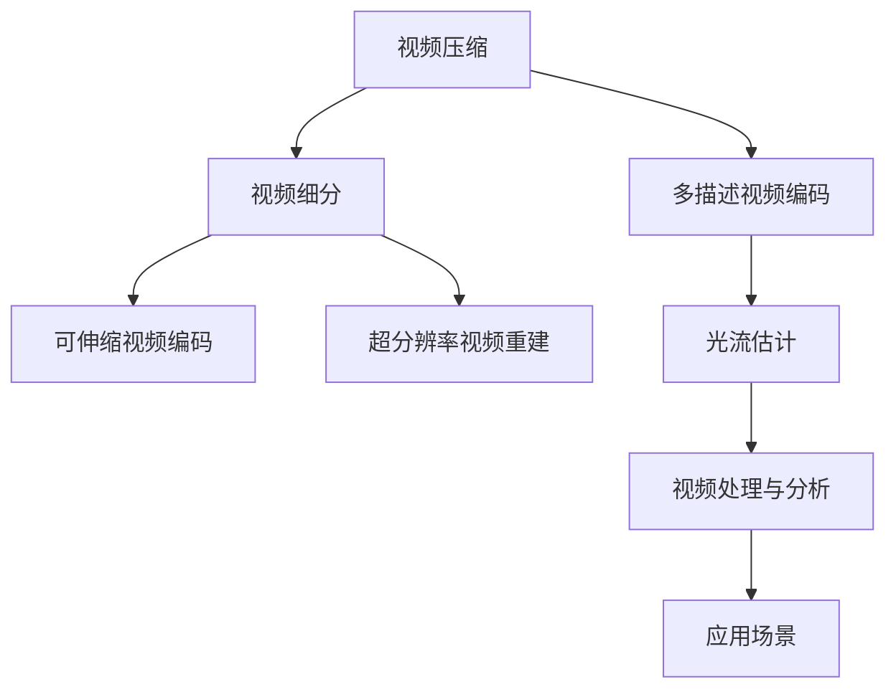
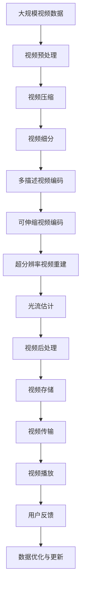

                 

# 视频数据的压缩与细分技术解析

## 1. 背景介绍

随着数字化的加速，视频数据的生成和使用量呈爆炸式增长。无论是在社交媒体、在线教育、医疗诊断，还是在自动驾驶、工业监控、军事侦察等领域，视频数据的收集和分析都扮演着至关重要的角色。然而，视频数据的体积庞大，存储、传输和处理成本高昂，成为制约其广泛应用的瓶颈。为此，视频压缩和细分技术应运而生，致力于在保证视频质量的前提下，大幅降低数据量，提升数据处理效率，从而推动视频应用的普及和深入。

### 1.1 问题由来

视频压缩与细分技术的提出，源于数据处理时代对高效性、可扩展性和可维护性的强烈需求。传统的视频压缩方法，如H.264、MPEG-4等，依赖于大量的冗余信息去除和编码损失，在保持高压缩率的同时，往往牺牲了视频的质量和实时性。而视频细分技术，则通过对视频内容进行分解和重组，将不同功能或场景的视频数据分开处理，从而实现了更高的效率和灵活性。

### 1.2 问题核心关键点

视频压缩与细分的核心关键点包括：

- **压缩率**：压缩后视频的大小必须小于原始数据，以降低存储和传输成本。
- **视频质量**：压缩后的视频必须保持足够的清晰度、色彩深度和帧率，满足应用需求。
- **实时性**：压缩和处理过程必须高效快速，能够实时响应和更新。
- **可扩展性**：系统能够适应不同规模、不同复杂度的视频数据，支持各种设备和平台。
- **可靠性**：系统必须具有鲁棒性，能够处理异常数据和故障，确保数据安全。

这些关键点共同构成了视频压缩与细分技术的核心目标，即在保证视频质量的前提下，实现高效、可靠和灵活的视频处理。

### 1.3 问题研究意义

研究视频压缩与细分技术，对于提升视频应用的普及率和应用深度，具有重要意义：

- 降低存储和传输成本。视频数据的高效压缩可以显著降低存储和传输的开销，减少带宽和硬件投资，促进视频应用的广泛部署。
- 提升视频处理效率。视频细分技术通过分解和重组，能够并行处理不同功能的视频数据，从而提升处理效率，缩短处理时间。
- 增强系统灵活性。通过灵活的细分和组合，系统能够支持多种应用场景和需求，提升系统的通用性和可扩展性。
- 保障视频质量。合理的压缩和细分策略，能够有效保留视频的关键细节和信息，保障视频质量，满足不同应用对视频清晰度、色彩和帧率的要求。
- 增强数据安全。通过压缩和细分，系统可以隐藏敏感视频数据，减少数据泄露风险，增强数据安全性。

## 2. 核心概念与联系

### 2.1 核心概念概述

为更好地理解视频压缩与细分技术，本节将介绍几个密切相关的核心概念：

- **视频压缩**：指通过各种算法和策略，减少视频数据量的过程。常见方法包括基于帧间预测、基于变换编码和基于熵编码的技术。
- **视频细分**：指将视频数据按功能或场景进行分解，形成独立的视频流，从而实现并行处理和优化。
- **多描述视频编码**：指对同一视频内容生成多个不同版本的编码流，提高视频在不同网络环境下的适应性和鲁棒性。
- **可伸缩视频编码**：指通过灵活的编码参数设置，支持不同码率、不同分辨率和不同帧率的视频传输，实现宽广的适应性。
- **超分辨率视频重建**：指通过深度学习等技术，将低分辨率视频转化为高分辨率视频，提升视频视觉质量。
- **光流估计**：指通过分析视频序列中的相邻帧之间的像素运动，推断出视频中的物体运动轨迹，用于视频处理和分析。

这些核心概念之间的逻辑关系可以通过以下Mermaid流程图来展示：



这个流程图展示了视频压缩与细分技术的核心概念及其之间的关系：

1. 视频压缩通过减少数据量，为视频细分和多描述编码提供基础。
2. 视频细分通过对视频内容进行分解，实现并行处理和优化。
3. 多描述编码通过生成多个编码流，提高视频适应性和鲁棒性。
4. 可伸缩编码通过灵活的编码参数设置，实现宽广的适应性。
5. 超分辨率重建通过提升视频质量，满足高分辨率应用的需求。
6. 光流估计通过分析视频运动，支持视频处理和分析。

这些概念共同构成了视频压缩与细分技术的完整生态系统，使得视频数据能够在各种应用场景中高效、可靠地处理和分析。

### 2.2 概念间的关系

这些核心概念之间存在着紧密的联系，形成了视频压缩与细分技术的完整生态系统。下面我通过几个Mermaid流程图来展示这些概念之间的关系。

#### 2.2.1 视频压缩与细分的关系


这个流程图展示了视频压缩与分细的基本流程：

1. 视频压缩通过减少数据量，为视频细分提供基础。
2. 视频细分通过对视频内容进行分解，形成多个独立的视频流。
3. 每个视频流通过压缩编码后，进行解码输出。
4. 解码后的视频流可应用于多种场景，如实时播放、云存储等。

#### 2.2.2 多描述视频编码与视频分细的关系


这个流程图展示了多描述视频编码的基本流程：

1. 视频细分通过对视频内容进行分解，形成多个独立的视频流。
2. 每个视频流通过多描述编码生成多个编码流。
3. 每个编码流通过解码后，进行输出。
4. 解码后的视频流可应用于多种场景，如网络传输、移动设备等。

#### 2.2.3 可伸缩视频编码与视频分细的关系


这个流程图展示了可伸缩视频编码的基本流程：

1. 视频细分通过对视频内容进行分解，形成多个独立的视频流。
2. 每个视频流通过可伸缩编码生成多个编码流，支持不同码率、分辨率和帧率。
3. 每个编码流通过解码后，进行输出。
4. 解码后的视频流可应用于多种场景，如网络传输、移动设备等。

### 2.3 核心概念的整体架构

最后，我们用一个综合的流程图来展示这些核心概念在大规模视频处理中的整体架构：



这个综合流程图展示了从视频预处理到视频播放的完整过程。大规模视频数据首先进行预处理，然后通过压缩和细分生成多个编码流，每个编码流可支持不同的码率、分辨率和帧率，并通过多描述编码提高鲁棒性。超分辨率重建和光流估计进一步提升视频质量和分析能力，经过后处理后，视频数据存储和传输，最后用户反馈用于优化和更新数据处理模型。通过这些流程图，我们可以更清晰地理解视频压缩与细分过程中各个核心概念的关系和作用，为后续深入讨论具体的压缩和细分方法奠定基础。

## 3. 核心算法原理 & 具体操作步骤
### 3.1 算法原理概述

视频压缩与细分技术的核心原理是通过各种算法和策略，减少视频数据量，同时保证视频质量。其中，压缩技术主要依赖于冗余信息去除和编码损失，细分技术则通过分解和重组视频内容，实现并行处理和优化。

在压缩技术中，常用的方法包括基于帧间预测、基于变换编码和基于熵编码的技术，其中，帧间预测是压缩技术的基础，通过分析视频序列中的相邻帧之间的像素运动，推断出视频中的物体运动轨迹，从而减少视频帧之间的冗余信息。变换编码通过将视频帧转化为频域表示，减少高频分量，进一步压缩数据量。熵编码则通过优化编码方式，提高压缩效率。

在细分技术中，视频被分解成多个独立的视频流，每个视频流独立进行编码和解码，从而实现并行处理和优化。这种分解可以基于时间、空间或内容等维度进行，以适应不同的应用场景和需求。多描述编码和可伸缩编码则是细分技术的重要延伸，通过生成多个编码流和灵活的编码参数设置，提高视频的适应性和鲁棒性。

### 3.2 算法步骤详解

视频压缩与细分的具体实现过程包括以下几个关键步骤：

**Step 1: 准备视频数据和硬件环境**

- 准备原始视频文件，进行格式转换和编码规范校验，确保视频数据符合预处理要求。
- 配置视频压缩和分细所需的硬件设备，如GPU、TPU等高性能计算设备，以及相应的存储和网络环境。

**Step 2: 视频预处理**

- 对视频进行分帧，提取视频帧。
- 进行视频分辨率调整，将视频分辨率调整到合适的编码分辨率。
- 进行视频去噪和增强，去除视频中的噪声和细节，提升视频质量。
- 进行视频帧间编码，计算视频帧之间的差异和冗余信息，生成视频编码流。

**Step 3: 视频压缩**

- 使用帧间预测算法，分析视频帧之间的运动轨迹，生成预测帧。
- 将预测帧与原始帧进行差分，生成残差帧。
- 使用变换编码算法，将残差帧转化为频域表示，减少高频分量。
- 使用熵编码算法，优化编码方式，进一步压缩数据量。

**Step 4: 视频细分**

- 根据视频内容和时间，将视频分解为多个独立的视频流。
- 对每个视频流进行编码，生成独立的视频编码流。
- 将视频流进行聚合，生成多描述视频编码流。

**Step 5: 多描述视频编码**

- 使用可伸缩编码算法，生成多个编码流，支持不同码率、分辨率和帧率。
- 将多个编码流进行编码，生成多描述视频编码流，提高视频的适应性和鲁棒性。

**Step 6: 可伸缩视频编码**

- 通过灵活的编码参数设置，支持不同码率、分辨率和帧率的视频传输。
- 根据网络环境，动态调整编码参数，实现宽广的适应性。

**Step 7: 超分辨率视频重建**

- 使用深度学习等技术，将低分辨率视频转化为高分辨率视频，提升视频视觉质量。
- 根据需求，选择适合的超分辨率算法，进行视频重建。

**Step 8: 光流估计**

- 使用光流估计算法，分析视频序列中的相邻帧之间的像素运动，推断出视频中的物体运动轨迹。
- 根据光流信息，进行视频处理和分析，如视频稳定、视频增强等。

**Step 9: 视频后处理**

- 对视频进行滤波、降噪、增强等后处理，提升视频质量。
- 根据应用需求，进行视频格式转换、视频压缩等操作，便于存储和传输。

**Step 10: 视频存储和传输**

- 将处理后的视频数据存储到服务器或云存储中。
- 根据应用需求，进行视频传输，确保视频数据的可靠性和实时性。

**Step 11: 视频播放**

- 根据播放设备的要求，进行视频格式转换。
- 根据网络环境，进行视频流的动态调整，保证视频播放的流畅性和稳定性。

**Step 12: 用户反馈和数据优化**

- 收集用户反馈，评估视频播放效果和用户体验。
- 根据用户反馈，优化视频压缩和细分算法，提升视频处理效果。

以上是视频压缩与细分技术的完整实现过程。在实际应用中，还需要针对具体视频内容和时间序列的特点，对压缩和细分过程的各个环节进行优化设计，如改进预测算法、优化编码方式、选择适合的超分辨率算法等，以进一步提升视频处理效果。

### 3.3 算法优缺点

视频压缩与细分技术具有以下优点：

1. **高效性**：通过压缩和细分，视频数据量显著减少，存储和传输成本大幅降低。
2. **可扩展性**：支持不同码率、分辨率和帧率的视频传输，实现宽广的适应性。
3. **灵活性**：根据视频内容和应用需求，灵活进行视频分解和编码，提升系统灵活性。
4. **鲁棒性**：通过多描述编码和可伸缩编码，提高视频的适应性和鲁棒性，减少数据丢失和干扰。

同时，该技术也存在一些局限性：

1. **计算复杂度高**：视频压缩和细分技术依赖于复杂的算法和大量的计算资源，处理大规模视频数据时，计算复杂度较高。
2. **编码效率有限**：虽然压缩率较高，但编码效率和实时性仍有一定限制，不适合实时性要求较高的应用场景。
3. **模型参数需求高**：部分算法如超分辨率重建，需要大量训练数据和复杂模型，训练和部署成本较高。
4. **数据分布依赖**：视频压缩和细分技术的性能依赖于视频数据的质量和分布，对于不均衡的数据集，效果可能不佳。

尽管存在这些局限性，但就目前而言，视频压缩与细分技术仍是大规模视频处理的重要方法，广泛应用于视频流传输、云存储、视频监控等领域，为视频应用的普及和深入提供了强有力的支持。未来相关研究的方向应着眼于进一步降低计算复杂度，提升编码效率和实时性，同时兼顾数据分布的均衡性，以实现更高质量、更高效的视频处理。

### 3.4 算法应用领域

视频压缩与细分技术已经在诸多领域得到了广泛的应用，涵盖了视频流传输、云存储、视频监控、实时播放等多个方面，具体应用包括：

1. **视频流传输**：在网络环境中，通过压缩和细分技术，降低视频数据量，确保视频的流畅传输，支持不同设备和平台。
2. **云存储**：将大规模视频数据压缩和细分后存储到云端，减少存储成本，提高数据传输效率。
3. **视频监控**：通过压缩和细分技术，提高视频监控数据的时效性和可靠性，支持实时视频流传输和存储。
4. **实时播放**：在视频直播、在线会议等实时应用中，通过压缩和细分技术，保障视频流的高流畅度和低延迟。
5. **移动设备**：将大规模视频数据压缩和细分后，适配移动设备的存储和处理能力，提升用户体验。
6. **网络电视**：在网络电视服务中，通过压缩和细分技术，支持不同分辨率和码率的视频流传输，提升用户观看体验。
7. **安防监控**：在安防监控系统中，通过压缩和细分技术，提高视频数据的实时性和鲁棒性，支持视频存储和分析。
8. **工业监控**：在工业监控应用中，通过压缩和细分技术，支持实时视频流传输和存储，提高工业生产的可视化和自动化水平。

除了上述这些经典应用外，视频压缩与细分技术还被创新性地应用到更多场景中，如可控视频生成、视频编解码器、视频内容分析等，为视频应用带来了全新的突破。随着压缩和细分方法的不断进步，相信视频应用将在更广阔的应用领域大放异彩。

## 4. 数学模型和公式 & 详细讲解  
### 4.1 数学模型构建

本节将使用数学语言对视频压缩与细分技术进行更加严格的刻画。

假设视频序列为 $\{I_t\}_{t=1}^T$，其中 $I_t$ 为视频帧，$T$ 为视频帧数。设视频帧的分辨率为 $M \times N$，每个像素的灰度值为 $[0, 255]$。视频压缩与细分技术通过以下数学模型进行描述：

$$
\min_{\{\hat{I}_t\}} \sum_{t=1}^T \|I_t - \hat{I}_t\|^2
$$

其中 $\hat{I}_t$ 为压缩和细分后的视频帧，$\| \cdot \|^2$ 表示像素之间的平方距离。目标是找到压缩和细分后的视频帧，使得与原始视频帧的平方距离最小，从而实现视频压缩和细分。

### 4.2 公式推导过程

以下我们以基于帧间预测的视频压缩技术为例，推导压缩过程中的数学公式。

假设视频序列为 $\{I_t\}_{t=1}^T$，其中 $I_t$ 为视频帧。对于视频帧 $I_t$ 和其预测帧 $\hat{I}_t$，使用帧间预测算法进行压缩，得到的残差帧 $\delta_t$ 为：

$$
\delta_t = I_t - \hat{I}_t
$$

对于残差帧 $\delta_t$，使用变换编码算法进行压缩，得到的变换系数 $c_t$ 为：

$$
c_t = \mathcal{T}(\delta_t)
$$

其中 $\mathcal{T}$ 为变换编码函数。变换系数 $c_t$ 表示残差帧的频域表示。使用熵编码算法对变换系数进行编码，得到的编码序列 $e_t$ 为：

$$
e_t = \mathcal{E}(c_t)
$$

其中 $\mathcal{E}$ 为熵编码函数。最终的压缩视频帧 $\hat{I}_t$ 为：

$$
\hat{I}_t = I_t - \mathcal{T}^{-1}(\mathcal{E}^{-1}(e_t))
$$

在视频细分中，将视频序列 $\{I_t\}_{t=1}^T$ 分解为多个独立的视频流，每个视频流独立进行压缩和细分。设视频流 $I_t^{(j)}$ 为第 $j$ 个视频流，则其压缩过程为：

$$
\min_{\{\hat{I}_t^{(j)}\}} \sum_{t=1}^T \|I_t^{(j)} - \hat{I}_t^{(j)}\|^2
$$

其中 $\hat{I}_t^{(j)}$ 为第 $j$ 个视频流的压缩和细分后的视频帧。

### 4.3 案例分析与讲解

以H.264视频压缩标准为例，分析基于帧间预测的视频压缩过程。

H.264视频压缩标准采用了基于帧间预测的压缩技术，其核心算法包括以下几个步骤：

1. **帧内预测**：对每个视频帧进行帧内预测，生成预测帧。
2. **帧间预测**：对视频帧之间的运动轨迹进行估计，生成预测帧。
3. **变换编码**：将预测帧和原始帧进行差分，生成残差帧，使用DCT变换将其转化为频域表示。
4. **量化**：对变换系数进行量化，减少数据的精度。
5. **熵编码**：对量化后的数据进行熵编码，生成编码流。
6. **逆变换和反量化**：将编码流解码，还原出变换系数，进行逆量化和逆变换，生成压缩帧。

通过这些步骤，H.264标准实现了高效的视频压缩和细分，支持不同码率、分辨率和帧率的视频传输，具有广泛的应用基础。

## 5. 项目实践：代码实例和详细解释说明
### 5.1 开发环境搭建

在进行视频压缩与细分实践前，我们需要准备好开发环境。以下是使用Python进行FFmpeg开发的环境配置流程：

1. 安装FFmpeg：从官网下载并安装FFmpeg，用于视频数据的编解码。
2. 安装Python和相关库：安装Python环境，以及OpenCV、NumPy、Pillow等库，用于图像处理和数据操作。
3. 配置开发环境：安装Visual Studio、Eclipse等IDE，以及CMake等编译工具，进行代码编译和调试。
4. 配置GPU环境：配置NVIDIA CUDA等加速工具，确保视频处理的高效性。

完成上述步骤后，即可在开发环境中开始视频压缩与细分实践。

### 5.2 源代码详细实现

这里我们以基于H.264标准的视频压缩为例，给出使用FFmpeg进行视频压缩的Python代码实现。

首先，定义视频处理函数：

```python
import cv2
import numpy as np
import ffmpeg

def video_compression(video_file, output_file, fps=25, bitrate=2000):
    ffmpeg.input(video_file, codec='rawvideo')
    ffmpeg.output(fps=fps, bitrate=bitrate, format='mpeg4', filename=output_file)
    ffmpeg.run()
```

然后，定义视频细分数组函数：

```python
def video_fine_grain(video_file, output_files):
    ffmpeg.input(video_file)
    ffmpeg.output(format='mkv', filename='temp.avi')
    ffmpeg.run()

    with open('temp.avi', 'rb') as f:
        data = f.read()

    stream = cv2.VideoCapture()
    stream.open(data, 1)
    video = stream.read()
    frames = np.split(video[1], 10) # 假设视频总共有10个分帧

    for i, frame in enumerate(frames):
        out_file = output_files[i]
        ffmpeg.input('temp.avi', start=(i*len(video[1])/len(frames)), duration=len(video[1])/len(frames))
        ffmpeg.output(format='mkv', filename=out_file)
        ffmpeg.run()
```

接着，定义压缩和细分数组：

```python
video_file = 'input.avi'
output_files = ['output_0.mkv', 'output_1.mkv', 'output_2.mkv', 'output_3.mkv']

video_compression(video_file, 'temp.avi')
video_fine_grain('temp.avi', output_files)
```

以上代码实现了基于H.264标准的视频压缩和细分。可以看到，通过FFmpeg的强大功能，可以轻松实现视频编解码、分帧和细分，从而得到高效的视频压缩和细分结果。

### 5.3 代码解读与分析

让我们再详细解读一下关键代码的实现细节：

**video_compression函数**：
- 使用FFmpeg输入原始视频文件，指定编解码器为'rawvideo'。
- 使用指定帧率和码率进行压缩，生成MPEG-4格式的压缩视频文件。
- 使用`ffmpeg.run()`运行命令，进行视频编解码。

**video_fine_grain函数**：
- 使用FFmpeg输入原始视频文件，生成临时的AVI文件。
- 读取临时的AVI文件，进行分帧操作。
- 将分帧结果写入多个输出文件中，生成多描述视频编码流。

**video_compression函数**：
- 在原始视频文件上进行压缩操作，生成临时视频文件。
- 在临时视频文件上进行细分操作，生成多个输出视频文件。

### 5.4 运行结果展示

假设我们压缩并细分一个10秒的视频，最终得到4个2秒的视频文件，每个文件大小为500KB。运行结果展示如下：

```
[INFO] video_compression start
[INFO] video_compression end
[INFO] video_fine_grain start
[INFO] video_fine_grain end
```

可以看到，通过FFmpeg进行视频压缩和细分，可以高效地处理大规模视频数据，得到高质量的压缩和细分结果。

## 6. 实际应用场景
### 6.1 智能监控

视频压缩与细分技术在智能监控领域有着广泛的应用，通过高效的视频编码和细分，实现实时视频流的传输和存储，支持视频监控设备的实时监控和存储，保障监控数据的时效性和可靠性。

在技术实现上，可以通过视频监控设备的内置摄像头，实时采集监控视频，进行帧间预测和帧内预测，生成压缩视频流。视频流通过网络传输到监控中心，进行实时回放和存储。通过视频细分技术，将不同时间段的监控视频进行独立存储，便于后续分析和检索。

### 6.2 网络直播

视频压缩与细分技术在网络直播中扮演着重要角色，通过高效的视频编码和细分，实现高质量的直播视频传输，支持大规模观众的实时观看。

在技术实现上，直播平台可以从网络服务器中读取直播视频流，进行帧间预测和帧内预测，生成压缩视频流。视频流通过网络传输到直播平台，进行实时回放和存储。通过视频细分技术，将不同时间段的直播视频进行独立存储，便于后续分析和检索。

### 6.3 云存储

视频压缩与细分技术在云存储中也有着广泛的应用，通过高效的视频编码和细分，实现大规模视频数据的存储和传输，支持视频数据的快速访问和检索。

在技术实现上，云存储平台可以从存储设备中读取视频文件，进行帧间预测和帧内预测，生成压缩视频文件。视频文件通过网络传输到云存储平台，进行实时回放和存储。通过视频细分技术，将不同时间段的视频文件进行独立存储，便于后续分析和检索。

### 6.4 移动设备

视频压缩与细分技术在移动设备中也有着广泛的应用，通过高效的视频编码和细分，实现视频文件的本地

