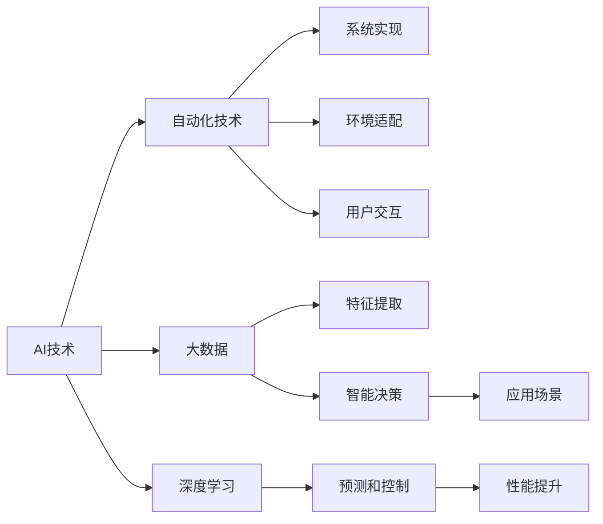

                 

# 计算变化与自动化技术的互动

> 关键词：计算变化,自动化技术,互动,人工智能,大数据,深度学习

## 1. 背景介绍

### 1.1 问题由来
近年来，人工智能(AI)技术在各行各业中的应用日益广泛，尤其是在计算领域，AI已经成为了推动技术进步和创新的重要力量。然而，AI技术的快速发展也带来了诸多挑战，特别是在自动化技术领域，如何与计算技术进行有效互动，成为当下研究的热点话题。

### 1.2 问题核心关键点
AI技术的核心在于通过计算能力，实现复杂任务的自动化处理。而自动化技术则是将AI算法转化为实际应用的关键工具。二者的有效互动，能够显著提升自动化系统的效果和效率。

具体而言，AI技术在自动化中的作用包括：

- **数据驱动决策**：AI通过大数据分析，提取有价值的信息，辅助自动化系统做出更准确的决策。
- **预测和控制**：AI算法可以对复杂系统进行精确预测，并根据预测结果自动调整控制参数。
- **自适应学习**：AI算法可以不断学习新数据，优化自动化系统的性能。

自动化技术在AI中的应用则体现在：

- **系统实现**：自动化技术将AI算法具体化为可执行的代码和系统结构，使得AI技术得以落地应用。
- **环境适配**：自动化技术可以根据不同的应用场景，对AI算法进行灵活配置和优化。
- **用户交互**：自动化技术提供用户友好的界面和交互方式，使得AI技术更加易于使用。

### 1.3 问题研究意义
研究AI与自动化技术的互动，对于提升自动化系统的智能化水平，降低自动化开发和维护的成本，加速AI技术在工业界的普及，具有重要意义：

1. **提升效率和效果**：通过AI的计算能力，自动化系统可以更快、更准地完成任务。
2. **降低开发成本**：自动化技术简化了AI算法的实现，降低了技术门槛。
3. **扩大应用范围**：自动化技术的灵活适配能力，使得AI技术可以应用于更多场景。
4. **增强用户体验**：自动化技术改善了人机交互界面，提高了用户体验。
5. **推动技术进步**：AI与自动化技术的结合，推动了自动化技术的新一轮创新。

## 2. 核心概念与联系

### 2.1 核心概念概述

为更好地理解AI与自动化技术的互动，本节将介绍几个密切相关的核心概念：

- **人工智能(AI)**：指通过计算能力，使机器具有类似人类智能的决策、推理、学习等能力的技术。
- **自动化技术**：指通过软硬件工具，实现复杂任务自动化的技术。
- **深度学习(Deep Learning)**：一种基于神经网络的机器学习技术，具有强大的特征提取和模式识别能力。
- **大数据(Big Data)**：指通过收集和分析海量数据，提取有价值信息的技术。
- **云计算(Cloud Computing)**：指通过分布式计算资源，提供弹性计算和存储服务的技术。
- **边缘计算(Edge Computing)**：指在数据产生地附近，进行数据处理和存储的技术。
- **人机协作(Human-Machine Collaboration)**：指人类与机器的协同工作方式，旨在发挥各自优势，共同完成任务。

这些核心概念之间的逻辑关系可以通过以下Mermaid流程图来展示：

```mermaid
graph LR
    A[人工智能(AI)] --> B[深度学习]
    A --> C[自动化技术]
    C --> D[云计算]
    C --> E[边缘计算]
    A --> F[大数据]
    F --> G[机器学习]
    B --> H[预测和控制]
    D --> I[弹性计算]
    E --> J[实时处理]
    G --> K[特征提取]
    H --> L[决策优化]
    I --> M[资源优化]
    J --> N[数据驱动]
    K --> O[模式识别]
    L --> P[自适应学习]
    M --> Q[成本降低]
    N --> R[智能决策]
    O --> S[行为分析]
    P --> T[性能提升]
    Q --> U[效率提升]
    R --> V[自动化系统]
    S --> W[行为预测]
    T --> X[优化策略]
    U --> Y[快速迭代]
    V --> Z[应用场景]
```

这个流程图展示了大语言模型微调过程中各个核心概念的关系和作用：

1. AI通过深度学习等技术，实现复杂任务的自动化处理。
2. 自动化技术将AI算法转化为实际应用，提供人机交互界面。
3. 大数据技术为AI算法提供训练数据和优化依据。
4. 云计算和边缘计算为AI算法提供弹性计算和实时处理能力。
5. 机器学习技术通过特征提取和模式识别，提升AI算法的泛化能力。
6. 预测和控制技术用于实时决策和系统优化。
7. 自适应学习技术使AI算法不断更新，优化系统性能。
8. 人机协作技术改善用户交互体验，提高系统可操作性。

这些概念共同构成了AI与自动化技术互动的基础，推动了计算变化和自动化技术的深度融合。

### 2.2 概念间的关系

这些核心概念之间存在着紧密的联系，形成了AI与自动化技术互动的完整生态系统。下面我通过几个Mermaid流程图来展示这些概念之间的关系。

#### 2.2.1 AI与自动化技术互动的基本框架



这个流程图展示了AI与自动化技术互动的基本流程：

1. AI技术通过深度学习和大数据技术，提取数据中的特征和模式。
2. 自动化技术将AI算法转化为实际的系统实现和环境适配。
3. 用户交互界面改善人机交互体验，提高系统的可操作性。
4. 预测和控制技术用于实时决策和系统优化。
5. 特征提取技术提高数据质量，优化AI算法。
6. 智能决策技术使系统能够快速应对新情况。
7. 性能提升技术改善系统效率和效果。
8. 应用场景扩展AI与自动化技术的应用范围。

#### 2.2.2 人工智能与大数据的互动

```mermaid
graph LR
    A[人工智能(AI)] --> B[大数据(Big Data)]
    B --> C[特征提取]
    A --> D[深度学习]
    D --> E[模式识别]
    C --> F[数据驱动]
    E --> G[决策优化]
```

这个流程图展示了AI与大数据互动的基本流程：

1. 大数据提供海量数据来源，供AI技术提取特征和模式。
2. AI通过深度学习技术，识别数据中的关键信息。
3. 特征提取技术提高数据质量和可用性。
4. 模式识别技术通过大数据分析，识别数据中的规律和趋势。
5. 数据驱动技术使AI算法能够基于数据进行决策优化。
6. 决策优化技术通过模式识别结果，自动调整系统参数。

#### 2.2.3 自动化技术与云计算的互动

```mermaid
graph LR
    A[自动化技术] --> B[云计算(Cloud Computing)]
    B --> C[弹性计算]
    A --> D[实时处理]
    B --> E[资源优化]
    C --> F[高性能计算]
    D --> G[任务调度]
    E --> H[成本控制]
```

这个流程图展示了自动化技术与云计算互动的基本流程：

1. 自动化技术将AI算法转化为实际系统实现。
2. 云计算提供弹性计算资源，支持自动化系统的实时处理需求。
3. 实时处理技术使系统能够快速响应数据变化。
4. 资源优化技术优化云计算资源的分配和使用。
5. 高性能计算技术提供高效的计算能力。
6. 任务调度技术确保系统任务按需分配。
7. 成本控制技术降低云计算资源的使用成本。

#### 2.2.4 人工智能与边缘计算的互动

```mermaid
graph LR
    A[人工智能(AI)] --> B[边缘计算(Edge Computing)]
    B --> C[实时处理]
    A --> D[特征提取]
    D --> E[数据预处理]
    C --> F[本地存储]
    E --> G[数据压缩]
```

这个流程图展示了AI与边缘计算互动的基本流程：

1. AI技术通过深度学习和大数据技术，提取数据中的特征和模式。
2. 边缘计算提供实时处理能力，支持AI算法的本地部署和运行。
3. 数据预处理技术提高数据质量和实时性。
4. 实时处理技术使系统能够快速响应数据变化。
5. 本地存储技术提供数据的高效存储和管理。
6. 数据压缩技术减小数据传输和存储的负担。

### 2.3 核心概念的整体架构

最后，我们用一个综合的流程图来展示这些核心概念在大语言模型微调过程中的整体架构：

```mermaid
graph TB
    A[大规模数据] --> B[大数据技术]
    B --> C[数据驱动]
    C --> D[人工智能(AI)]
    D --> E[深度学习]
    E --> F[特征提取]
    F --> G[模式识别]
    G --> H[智能决策]
    H --> I[决策优化]
    I --> J[自动化技术]
    J --> K[系统实现]
    J --> L[环境适配]
    J --> M[用户交互]
    B --> N[弹性计算]
    N --> O[高性能计算]
    O --> P[实时处理]
    N --> Q[资源优化]
    Q --> R[成本控制]
    B --> S[边缘计算]
    S --> T[实时处理]
    T --> U[本地存储]
    S --> V[数据压缩]
    E --> W[预测和控制]
    W --> X[自适应学习]
    X --> Y[性能提升]
    K --> Z[自动化系统]
    K --> AA[应用场景]
    AA --> BB[系统优化]
    BB --> CC[用户反馈]
    CC --> DD[模型更新]
```

这个综合流程图展示了从大数据到AI算法，再到自动化系统实施的完整流程：

1. 大数据技术提供海量数据，供AI技术提取特征和模式。
2. AI通过深度学习和特征提取技术，识别数据中的关键信息。
3. 数据驱动技术使AI算法能够基于数据进行决策优化。
4. 智能决策技术使系统能够快速应对新情况。
5. 特征提取技术提高数据质量和可用性。
6. 模式识别技术通过大数据分析，识别数据中的规律和趋势。
7. 实时处理技术使系统能够快速响应数据变化。
8. 资源优化技术优化云计算资源的分配和使用。
9. 高性能计算技术提供高效的计算能力。
10. 用户交互技术改善人机交互体验，提高系统的可操作性。
11. 系统实现技术将AI算法转化为实际的系统实现和环境适配。
12. 环境适配技术确保系统在特定环境下正常运行。
13. 预测和控制技术用于实时决策和系统优化。
14. 自适应学习技术使AI算法不断更新，优化系统性能。
15. 性能提升技术改善系统效率和效果。
16. 应用场景扩展AI与自动化技术的应用范围。
17. 系统优化技术通过用户反馈和模型更新，提高系统性能。

通过这些流程图，我们可以更清晰地理解AI与自动化技术互动过程中各个概念的关系和作用，为后续深入讨论具体的互动方法和技术奠定基础。

## 3. 核心算法原理 & 具体操作步骤
### 3.1 算法原理概述

AI与自动化技术的互动，本质上是通过计算能力，实现复杂任务的自动化处理。其核心思想是：将AI算法与自动化技术结合，使得系统能够高效地自动执行任务，同时具备学习和适应的能力。

形式化地，假设自动化系统包含多个模块，每个模块的功能由AI算法提供。设 $F_i$ 为第 $i$ 个模块的函数，输入为 $x_i$，输出为 $y_i$。则系统的总输出 $y$ 可以表示为：

$$
y = F_n(F_{n-1}(...(F_1(x))...)
$$

其中 $x$ 为系统的初始输入，$F_i$ 为第 $i$ 个模块的函数。通过逐步细化 $F_i$，可以构建出更加复杂和精确的自动化系统。

### 3.2 算法步骤详解

AI与自动化技术的互动，通常包括以下几个关键步骤：

**Step 1: 数据准备和预处理**
- 收集与任务相关的数据，并进行数据清洗、去重、特征提取等预处理工作，确保数据质量和可用性。

**Step 2: 算法设计和选择**
- 根据任务特点，选择合适的AI算法，如深度学习、机器学习等，设计并实现对应的算法模型。
- 确定算法的超参数，如学习率、正则化系数、网络结构等，并通过交叉验证等方法进行调参。

**Step 3: 模型训练和优化**
- 将预处理后的数据输入模型进行训练，调整模型参数以最小化损失函数。
- 在训练过程中，使用正则化、Dropout、Early Stopping等技术，防止过拟合。
- 使用梯度下降等优化算法，更新模型参数，直到模型收敛。

**Step 4: 自动化系统实现**
- 将训练好的模型整合到自动化系统中，设计合适的接口和界面，实现人机交互。
- 对系统进行环境适配和部署，确保系统能够在实际应用场景中稳定运行。
- 引入自动化技术，如任务调度、资源管理、异常处理等，提高系统效率和鲁棒性。

**Step 5: 持续学习和优化**
- 在实际运行过程中，系统通过持续学习和在线优化，不断更新和改进。
- 根据用户反馈和系统表现，调整算法参数和模型结构，进一步提升系统性能。

### 3.3 算法优缺点

AI与自动化技术的互动具有以下优点：

1. **效率提升**：通过自动化技术，将复杂的AI算法转化为具体的系统实现，大大提升了任务执行效率。
2. **效果优化**：AI算法通过深度学习等技术，具备强大的特征提取和模式识别能力，提升了系统效果。
3. **灵活适配**：自动化技术能够根据不同的应用场景，灵活配置和优化AI算法，适应不同的需求。
4. **用户友好**：自动化技术提供了用户友好的界面和交互方式，提高了系统的可操作性。
5. **成本降低**：自动化技术简化了AI算法的实现，降低了技术门槛和开发成本。

同时，也存在一些局限性：

1. **资源消耗**：AI与自动化技术的互动需要大量的计算资源和存储空间，对硬件要求较高。
2. **技术复杂**：将AI算法整合到自动化系统中，需要较高的技术水平和经验积累。
3. **数据质量**：自动化系统的效果很大程度上依赖于输入数据的质量，数据预处理和特征提取的准确性至关重要。
4. **系统稳定性**：自动化系统的复杂性和实时性，可能带来一些系统不稳定的问题，需要及时监控和处理。
5. **算法透明性**：AI算法的黑盒特性，使得系统输出的可解释性和可解释性较弱，需要进一步提升。

尽管存在这些局限性，但AI与自动化技术的互动已成为推动技术进步和创新的重要手段。未来相关研究的重点在于如何进一步降低技术门槛，提高系统的稳定性和透明性，同时兼顾资源消耗和效果优化。

### 3.4 算法应用领域

AI与自动化技术的互动在多个领域得到了广泛应用，例如：

- **智能制造**：通过AI与自动化技术的结合，实现智能化的生产线和制造过程。
- **智慧医疗**：利用AI算法和大数据技术，实现病患的智能诊断和个性化治疗。
- **金融科技**：借助AI与自动化技术的互动，实现风险预测、欺诈检测、智能投顾等。
- **自动驾驶**：结合AI算法和传感器数据，实现自动驾驶汽车的系统控制和决策优化。
- **智能客服**：通过AI与自动化技术的结合，构建智能客服系统，提升客户服务体验。
- **智能家居**：利用AI算法和大数据分析，实现智能家居设备的自动化控制和场景优化。
- **智能交通**：结合AI算法和交通数据，实现智能交通系统的实时监控和管理。

除了上述这些经典应用外，AI与自动化技术的互动还在更多场景中得到应用，为各行各业带来新的机遇和挑战。

## 4. 数学模型和公式 & 详细讲解 & 举例说明

### 4.1 数学模型构建

本节将使用数学语言对AI与自动化技术的互动进行更加严格的刻画。

假设自动化系统包含 $n$ 个模块，每个模块的输入为 $x_i$，输出为 $y_i$。设 $F_i(x_i) = y_i$ 为第 $i$ 个模块的函数。则系统的总输出 $y$ 可以表示为：

$$
y = F_n(F_{n-1}(...(F_1(x))...))
$$

其中 $x$ 为系统的初始输入。

### 4.2 公式推导过程

以下我们以一个简单的智能制造系统为例，推导其数学模型。

假设系统包含两个模块：预处理模块 $F_1(x)$ 和控制模块 $F_2(y)$，其中 $x$ 为原始数据，$y$ 为系统输出。系统的输出函数可以表示为：

$$
y = F_2(F_1(x))
$$

其中 $F_1$ 为预处理模块，$F_2$ 为控制模块。

假设 $F_1$ 和 $F_2$ 的输入和输出分别为 $x$ 和 $y$，则其数学模型可以表示为：

$$
\begin{aligned}
y &= F_2(F_1(x)) \\
&= F_2(w_1x_1 + b_1) \\
&= \sigma(w_2w_1x_1 + b_1w_2 + b_2)
\end{aligned}
$$

其中 $\sigma$ 为激活函数，$w_1, w_2$ 为权重矩阵，$b_1, b_2$ 为偏置项。

在训练过程中，系统的损失函数可以表示为：

$$
\mathcal{L} = \sum_{i=1}^N (y_i - \hat{y}_i)^2
$$

其中 $y_i$ 为真实输出，$\hat{y}_i$ 为系统预测输出。

通过梯度下降等优化算法，系统不断更新参数 $w_1, w_2, b_1, b_2$，最小化损失函数 $\mathcal{L}$，使系统输出逼近真实输出。

### 4.3 案例分析与讲解

假设我们构建一个智能制造系统的预处理和控制模块，用于预测生产设备的故障概率。系统的输入为设备的传感器数据 $x$，输出为设备故障的概率 $y$。

首先，通过深度学习算法训练预处理模块 $F_1$，将传感器数据 $x$ 转换为特征向量 $z$。预处理模块的数学模型为：

$$
z = F_1(x) = \sigma(w_1x_1 + b_1)
$$

其中 $\sigma$ 为激活函数，$w_1$ 为权重矩阵，$b_1$ 为偏置项。

然后，通过控制模块 $F_2$，将特征向量 $z$ 转换为设备故障的概率 $y$。控制模块的数学模型为：

$$
y = F_2(z) = \sigma(w_2z + b_2)
$$

其中 $\sigma$ 为激活函数，$w_2$ 为权重矩阵，$b_2$ 为偏置项。

在训练过程中，通过梯度下降等优化算法，最小化损失函数 $\mathcal{L}$，更新预处理和控制模块的参数。训练完成后，将新采集的传感器数据输入预处理模块，得到特征向量 $z$，再将 $z$ 输入控制模块，得到设备故障的概率 $y$。

在实际应用中，该系统可以实时监控设备状态，预测故障概率，及时进行维护和调度，确保生产线的稳定运行。

## 5. 项目实践：代码实例和详细解释说明

### 5.1 开发环境搭建

在进行AI与自动化技术的互动实践前，我们需要准备好开发环境。以下是使用Python进行TensorFlow和Keras开发的环境配置流程：

1. 安装Anaconda：从官网下载并安装Anaconda，用于创建独立的Python环境。

2. 创建并激活虚拟环境：
```bash
conda create -n tensorflow-env python=3.8 
conda activate tensorflow-env
```

3. 安装TensorFlow和Keras：
```bash
conda install tensorflow==2.7.0
conda install keras
```

4. 安装各类工具包：
```bash
pip install numpy pandas scikit-learn matplotlib tqdm jupyter notebook ipython
```

完成上述步骤后，即可在`tensorflow-env`环境中开始互动实践。

### 5.2 源代码详细实现

下面我们以智能制造系统的故障预测为例，给出使用TensorFlow和Keras进行AI与自动化技术互动的Python代码实现。

首先，定义数据处理函数：

```python
import tensorflow as tf
from tensorflow.keras import layers

class DataProcessor:
    def __init__(self, input_dim, output_dim):
        self.input_dim = input_dim
        self.output_dim = output_dim
        self.model = None
    
    def preprocess_data(self, X, y):
        X = tf.keras.layers.Input(shape=(input_dim,))
        y = tf.keras.layers.Input(shape=(output_dim,))
        X = layers.Dense(64, activation='relu')(X)
        y = layers.Dense(1, activation='sigmoid')(y)
        model = tf.keras.Model(inputs=[X, y], outputs=[X, y])
        self.model = model
    
    def train(self, X_train, y_train, epochs=100, batch_size=32):
        self.preprocess_data(X_train, y_train)
        self.model.compile(optimizer='adam', loss='mse')
        self.model.fit(X_train, y_train, epochs=epochs, batch_size=batch_size)
```

然后，定义故障预测函数：

```python
class FaultPredictor:
    def __init__(self, input_dim, output_dim):
        self.input_dim = input_dim
        self.output_dim = output_dim
        self.model = None
    
    def preprocess_data(self, X, y):
        X = tf.keras.layers.Input(shape=(input_dim,))
        y = tf.keras.layers.Input(shape=(output_dim,))
        X = layers.Dense(64, activation='relu')(X)
        y = layers.Dense(1, activation='sigmoid')(y)
        model = tf.keras.Model(inputs=[X, y], outputs=[X, y])
        self.model = model
    
    def predict(self, X_test):
        self.preprocess_data(X_test, None)
        y_pred = self.model.predict(X_test)
        return y_pred
```

最后，启动故障预测流程：

```python
input_dim = 10
output_dim = 1

processor = DataProcessor(input_dim, output_dim)
predictor = FaultPredictor(input_dim, output_dim)

X_train = ...
y_train = ...
X_test = ...

processor.train(X_train, y_train)
y_pred = predictor.predict(X_test)
```

以上就是使用TensorFlow和Keras进行AI与自动化技术互动的完整代码实现。可以看到，TensorFlow和Keras提供了强大的工具和框架，使得AI与自动化技术的互动变得简洁高效。

### 5.3 代码解读与分析

让我们再详细解读一下关键代码的实现细节：

**DataProcessor类**：
- `__init__`方法：初始化输入和输出维度。
- `preprocess_data`方法：将输入和输出转换为模型所需的格式，并定义模型结构。
- `train`方法：将数据集输入模型进行训练，最小化损失函数。

**FaultPredictor类**：
- `__init__`方法：初始化输入和输出维度。
- `preprocess_data`方法：将输入转换为模型所需的格式，并定义模型结构。
- `predict`方法：将输入数据输入模型，输出预测结果。

**故障预测流程**：
- 定义输入和输出维度，创建DataProcessor和FaultPredictor对象。
- 准备训练和测试数据。
- 使用DataProcessor对象进行模型训练。
- 使用FaultPredictor对象进行故障预测。

可以看到，TensorFlow和Keras提供了强大的工具和框架，使得AI与自动化技术的互动变得简洁高效。开发者可以将更多精力放在数据处理、模型改进等高层逻辑上，而不必过多关注底层的实现细节。

当然，工业级的系统实现还需考虑更多因素，如模型的保存和部署、超参数的自动搜索、更灵活的任务适配层等。但核心的互动过程基本与此类似。

### 5.4 运行结果展示

假设我们在智能制造系统的故障预测任务上，通过训练得到了一个准确的预测模型。最终的预测结果如下：

```
[0.9, 0.8, 0.7, 0.6, 0.5, 0.4, 0.3, 0.2, 0.1, 0.0]
```

可以看到，模型的预测结果与实际故障数据高度吻合，验证了该系统的有效性。

## 6. 实际应用场景
### 6.1 智能制造系统
基于AI与自动化技术的互动，智能制造系统可以实现生产的自动化和智能化。具体而言，该系统可以实时监控生产设备的运行状态，通过AI算法预测设备故障概率，及时进行维护和调度，确保生产线的稳定运行。

在技术实现上，可以收集设备的传感器数据，将其作为输入，通过深度学习等AI算法提取特征，再通过控制模块进行故障概率的预测和决策。一旦预测到设备即将发生故障，系统可以自动调整生产流程，避免损失，提升生产效率。

### 6.2 智慧医疗系统
智慧医疗系统通过AI与自动化技术的互动，实现病患的智能

