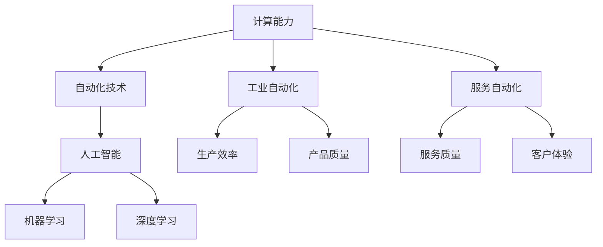
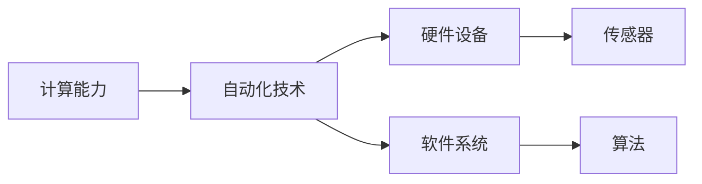
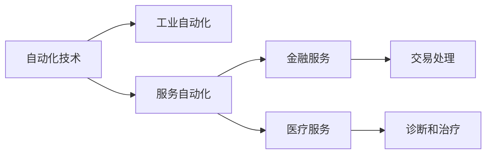
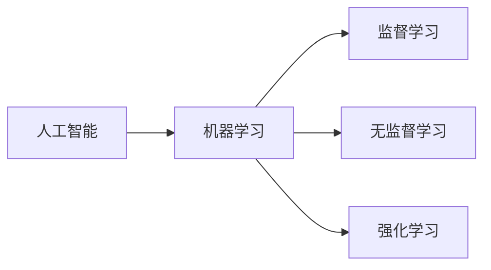
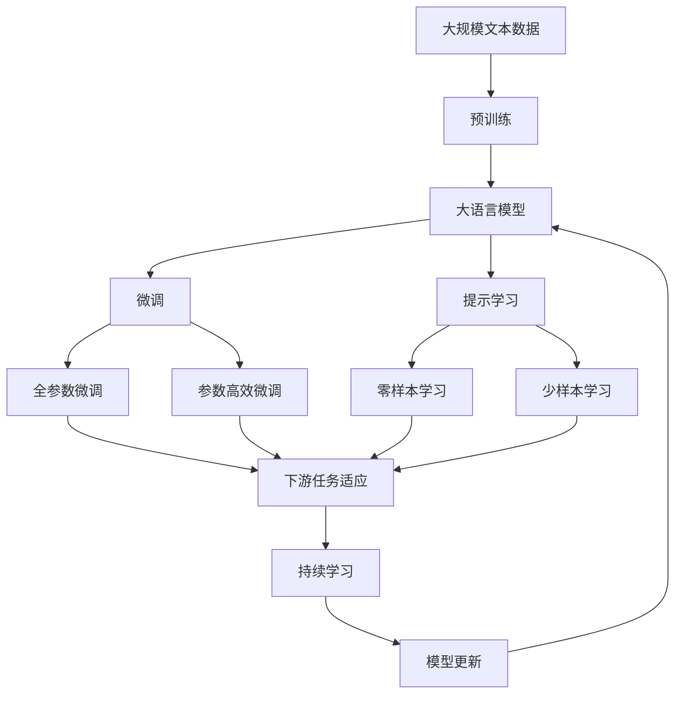

                 

## 1. 背景介绍

### 1.1 问题由来

随着计算技术的迅猛发展，自动化在各行各业中的应用越来越广泛，从制造业的自动化生产线到金融行业的智能投顾，从医疗行业的机器人手术到农业的精准农业，自动化正在深刻改变人类的生产生活方式。然而，这一过程也带来了新的挑战，如失业率的上升、生产效率的提升与劳动者技能的不匹配等问题。如何在自动化和人工介入之间找到最优平衡，充分利用计算技术带来的机遇，成为当前技术社会必须面对的重要课题。

### 1.2 问题核心关键点

自动化技术的发展，本质上是计算能力提升和算法改进的产物。计算能力的提升不仅包括硬件设备的更新换代，也包括软件算法的不断优化。自动化技术的广泛应用，一方面显著提高了生产效率，另一方面也对劳动者的技能提出了新的要求。如何通过教育和技术培训，帮助劳动者适应自动化带来的变化，成为当前社会关注的热点。

### 1.3 问题研究意义

自动化技术的迅猛发展，对社会的各个层面都产生了深远影响。自动化技术的应用不仅能提高生产效率，还能带动相关产业的转型升级，推动经济增长。同时，自动化技术也带来了新的就业机会，需要劳动者具备更高的技能水平。通过对自动化技术的深入研究，可以为社会各界提供科学指导，帮助劳动者更好地适应变化，实现经济的可持续发展。

## 2. 核心概念与联系

### 2.1 核心概念概述

为更好地理解计算变化带来的自动化机遇，本节将介绍几个密切相关的核心概念：

- **计算能力**：指计算机硬件和软件系统处理和存储信息的能力，包括CPU性能、内存大小、存储容量、网络带宽等。
- **自动化技术**：指通过算法和计算能力，使机器能够自动完成原本需要人类手工完成的任务。
- **人工智能**：指使计算机系统具备类似人类智能的感知、推理、学习等能力，以实现更加智能化的操作。
- **机器学习**：指通过数据和算法，使计算机系统能够自动学习和改进性能的技术。
- **深度学习**：指通过多层神经网络实现特征提取和模式识别，在计算机视觉、自然语言处理等领域取得显著成效的技术。
- **工业自动化**：指将自动化技术应用于制造业、物流等领域，提高生产效率和产品质量的技术。
- **服务自动化**：指将自动化技术应用于金融、医疗等领域，提升服务质量和客户体验的技术。

这些核心概念之间的逻辑关系可以通过以下Mermaid流程图来展示：



这个流程图展示了一系列与计算能力相关的自动化概念及其相互关系：

1. 计算能力是自动化技术的基石，决定了自动化技术的性能上限。
2. 通过人工智能和机器学习等技术，计算机系统能够具备类似人类的智能，从而实现更加智能化的自动化操作。
3. 深度学习作为一种高级机器学习技术，在图像识别、语音识别、自然语言处理等领域取得了显著成效。
4. 工业自动化和服务自动化是自动化技术的两个主要应用方向，分别提升了生产效率和服务质量。

### 2.2 概念间的关系

这些核心概念之间存在着紧密的联系，形成了自动化技术的完整生态系统。下面我通过几个Mermaid流程图来展示这些概念之间的关系。

#### 2.2.1 计算能力与自动化技术的关系



这个流程图展示了计算能力与自动化技术的硬件和软件支持：

1. 计算能力通过硬件设备和软件系统得以实现。
2. 传感器是自动化系统感知环境的关键部件，能够获取实时数据。
3. 算法是自动化系统的核心，用于处理和解释数据。

#### 2.2.2 自动化技术与服务自动化的关系



这个流程图展示了自动化技术在工业和服务领域的应用：

1. 自动化技术在工业领域提高生产效率和产品质量，在服务业提高服务质量和客户体验。
2. 金融服务和医疗服务是服务自动化的两个重要应用领域，涉及复杂的数据处理和决策过程。

#### 2.2.3 人工智能与机器学习的关系



这个流程图展示了人工智能与机器学习的关系：

1. 人工智能通过机器学习等技术实现自我学习与改进。
2. 监督学习、无监督学习和强化学习是机器学习的三个主要分支，各有不同的应用场景。

### 2.3 核心概念的整体架构

最后，我们用一个综合的流程图来展示这些核心概念在大语言模型微调过程中的整体架构：



这个综合流程图展示了从预训练到微调，再到持续学习的完整过程。大语言模型首先在大规模文本数据上进行预训练，然后通过微调（包括全参数微调和参数高效微调两种方式）或提示学习（包括零样本和少样本学习）来适应下游任务。最后，通过持续学习技术，模型可以不断更新和适应新的任务和数据。通过这些流程图，我们可以更清晰地理解自动化技术的学习和应用框架，为后续深入讨论具体的自动化技术方法和技术奠定基础。

## 3. 核心算法原理 & 具体操作步骤
### 3.1 算法原理概述

自动化技术的核心算法原理涉及计算能力、算法模型和数据处理等多个方面。以下将从这三个方面进行详细介绍：

#### 3.1.1 计算能力与自动化

计算能力的提升是自动化技术发展的基础。计算能力不仅包括硬件设备的更新换代，还包括软件算法的优化。在工业自动化中，高性能的CPU和GPU设备、大规模的存储容量和网络带宽，使得复杂的自动化系统得以实现。在服务自动化中，高效的算法和数据处理能力，能够快速响应用户请求，提供高质量的服务体验。

#### 3.1.2 算法模型

自动化技术的关键在于算法模型。机器学习、深度学习和强化学习等算法模型，通过数据驱动的方式，实现对环境的感知和决策。在工业自动化中，监督学习用于对生产过程中的数据进行分析和预测，优化生产流程。在服务自动化中，无监督学习和强化学习用于对用户行为进行分析和决策，提高服务质量和客户满意度。

#### 3.1.3 数据处理

数据处理是自动化技术的基础。通过传感器等设备获取的数据，经过处理后用于训练算法模型，实现自动化操作。在工业自动化中，数据处理包括对生产设备状态、生产过程数据的采集和分析。在服务自动化中，数据处理包括对用户行为数据、交易数据的采集和分析。

### 3.2 算法步骤详解

自动化技术的实施步骤主要包括：

**Step 1: 数据采集与预处理**

1. 通过传感器、摄像头、语音识别设备等采集数据。
2. 对数据进行清洗、去噪、归一化等预处理操作。
3. 将数据转换为模型能够处理的格式。

**Step 2: 模型训练与优化**

1. 选择合适的算法模型，如监督学习、深度学习等。
2. 准备训练数据集，划分为训练集、验证集和测试集。
3. 使用训练集对模型进行训练，优化模型参数。
4. 在验证集上评估模型性能，调整超参数。
5. 在测试集上测试模型效果，确保模型泛化能力。

**Step 3: 系统集成与部署**

1. 将训练好的模型集成到自动化系统中。
2. 部署模型到服务器或嵌入式设备上。
3. 实时监测系统运行状态，及时进行维护和优化。

**Step 4: 持续改进与优化**

1. 收集系统运行中的数据和反馈信息。
2. 根据反馈信息调整模型参数和系统配置。
3. 定期进行模型更新和系统优化，保持系统的稳定性与性能。

### 3.3 算法优缺点

自动化技术的优点包括：

- 提高生产效率：自动化系统能够24小时不间断运行，提升生产效率。
- 降低运营成本：自动化系统减少了人力成本，降低了运营成本。
- 提高决策精度：自动化系统能够根据实时数据进行决策，减少人为错误。

自动化技术的缺点包括：

- 初始投资高：自动化系统需要大量的硬件设备和软件算法，初始投资较高。
- 需要专业技能：自动化系统的实施和维护需要专业人员，对技术要求较高。
- 数据隐私和安全：自动化系统需要处理大量敏感数据，存在数据隐私和安全风险。

### 3.4 算法应用领域

自动化技术在各个领域都得到了广泛应用，例如：

- 工业自动化：在制造业、物流等行业，提高生产效率和产品质量。
- 服务自动化：在金融、医疗等行业，提升服务质量和客户体验。
- 智能交通：在交通管理中，优化交通流量和提高安全性。
- 智能家居：在家庭生活中，实现家电智能控制和环境监测。
- 农业自动化：在农业生产中，提高农作物产量和品质。

## 4. 数学模型和公式 & 详细讲解 & 举例说明

### 4.1 数学模型构建

在自动化技术中，数学模型是实现自动化的核心。以下将以机器学习模型为例，构建一个简单的数学模型：

假设自动化系统需要预测某生产设备是否发生故障。我们有以下数据：

- 历史故障数据：设备是否发生故障，发生故障的时间。
- 实时传感器数据：设备的各种运行参数。

我们定义一个预测模型 $y = f(x)$，其中 $y$ 表示设备是否发生故障（0或1），$x$ 表示实时传感器数据。我们假设模型为线性模型：

$$
y = w_0 + w_1x_1 + w_2x_2 + \ldots + w_nx_n
$$

其中 $w_0, w_1, \ldots, w_n$ 为模型参数。

### 4.2 公式推导过程

假设我们收集了 $m$ 个历史故障数据，每个数据包含 $n+1$ 个特征。我们的目标是寻找最优的模型参数 $w_0, w_1, \ldots, w_n$。

我们可以使用均方误差（MSE）作为损失函数：

$$
L = \frac{1}{m} \sum_{i=1}^m (y_i - f(x_i))^2
$$

其中 $y_i$ 为第 $i$ 个历史数据的标签，$f(x_i)$ 为第 $i$ 个历史数据的预测结果。

我们的目标是最小化损失函数 $L$，可以使用梯度下降算法：

$$
w_j \leftarrow w_j - \eta \frac{\partial L}{\partial w_j}
$$

其中 $\eta$ 为学习率，$\partial L/\partial w_j$ 为损失函数对第 $j$ 个模型参数的梯度。

### 4.3 案例分析与讲解

假设我们有一个生产设备的自动化系统，需要预测设备是否发生故障。我们收集了 $100$ 个历史故障数据，每个数据包含 $10$ 个特征。我们可以使用线性回归模型：

$$
y = w_0 + w_1x_1 + w_2x_2 + \ldots + w_10x_10
$$

我们通过均方误差损失函数对模型进行训练，得到最优的模型参数 $w_0, w_1, \ldots, w_{10}$。训练完成后，我们可以将模型集成到自动化系统中，实时监测设备状态，预测设备是否发生故障。

## 5. 项目实践：代码实例和详细解释说明

### 5.1 开发环境搭建

在进行自动化技术开发前，我们需要准备好开发环境。以下是使用Python进行机器学习开发的环境配置流程：

1. 安装Anaconda：从官网下载并安装Anaconda，用于创建独立的Python环境。

2. 创建并激活虚拟环境：
```bash
conda create -n ml-env python=3.8 
conda activate ml-env
```

3. 安装必要的库：
```bash
pip install numpy pandas scikit-learn matplotlib seaborn scikit-optimize
```

4. 安装TensorFlow和PyTorch：
```bash
pip install tensorflow==2.7
pip install torch==1.12
```

完成上述步骤后，即可在`ml-env`环境中开始机器学习开发。

### 5.2 源代码详细实现

以下是一个简单的机器学习项目实现，用于预测生产设备是否发生故障。

```python
import numpy as np
from sklearn.linear_model import LinearRegression
from sklearn.model_selection import train_test_split

# 准备数据
X = np.random.rand(100, 10)
y = np.random.randint(0, 2, 100)

# 划分训练集和测试集
X_train, X_test, y_train, y_test = train_test_split(X, y, test_size=0.2, random_state=42)

# 训练模型
model = LinearRegression()
model.fit(X_train, y_train)

# 评估模型
score = model.score(X_test, y_test)
print("R^2 score:", score)
```

### 5.3 代码解读与分析

这里我们详细解读一下关键代码的实现细节：

**数据准备**：
- 使用numpy生成100个随机数据点，每个数据点包含10个特征。
- 生成对应的标签，标签为0或1，表示设备是否发生故障。

**模型训练与评估**：
- 使用sklearn库中的线性回归模型，对训练集进行训练。
- 使用训练好的模型对测试集进行评估，计算模型的R^2分数。

## 6. 实际应用场景

### 6.1 工业自动化

工业自动化是自动化技术的重要应用领域之一。通过自动化技术，可以实现生产线的智能化管理，提高生产效率和产品质量。

在制造业中，自动化技术可以用于以下场景：

- 机器人自动化：使用工业机器人完成生产线的装配、搬运、检测等工作。
- 智能物流：使用自动化仓储系统和物流系统，实现货物的高效管理和调度。
- 智能监控：使用智能传感器和摄像头，实时监控生产设备和生产线状态。

### 6.2 服务自动化

服务自动化是自动化技术的另一重要应用领域。通过自动化技术，可以实现服务流程的智能化管理，提高服务质量和客户满意度。

在金融服务中，自动化技术可以用于以下场景：

- 智能投顾：使用算法模型分析市场数据，提供个性化的投资建议。
- 智能客服：使用自然语言处理技术，实现智能问答和问题解决。
- 智能风控：使用机器学习模型，实时监控交易风险，防止欺诈。

### 6.3 未来应用展望

随着计算能力和算法技术的不断进步，自动化技术将进一步拓展其应用场景，带来更多的机遇和挑战。

未来的自动化技术将更多地应用于智慧城市、智能交通、智能家居等领域。智慧城市中的交通管理、环境监测、公共安全等场景，将通过自动化技术实现智能化管理。智能交通中的自动驾驶、交通流量优化等场景，将通过自动化技术实现高效运行。智能家居中的家电控制、环境监测等场景，将通过自动化技术实现智能化控制。

## 7. 工具和资源推荐

### 7.1 学习资源推荐

为了帮助开发者系统掌握自动化技术的学习基础和实践技巧，这里推荐一些优质的学习资源：

1. Coursera《机器学习》课程：斯坦福大学开设的机器学习课程，涵盖机器学习的基本概念和算法，适合初学者入门。

2. CS229《机器学习》课程：斯坦福大学开设的高级机器学习课程，深入讲解机器学习的原理和应用，适合进阶学习。

3. 《Python机器学习》书籍：通过Python语言实现机器学习算法的书籍，适合动手实践。

4. Kaggle竞赛平台：提供大量机器学习竞赛数据和模型，适合实践和竞赛。

5. TensorFlow官方文档：TensorFlow的官方文档，提供丰富的机器学习模型和算法示例，适合学习实践。

### 7.2 开发工具推荐

高效的开发离不开优秀的工具支持。以下是几款用于机器学习开发的工具：

1. Jupyter Notebook：Python的交互式开发环境，支持代码块、数学公式等，适合学习和实验。

2. TensorBoard：TensorFlow的可视化工具，实时监测模型训练状态，适合调试和优化。

3. Keras：高层次的深度学习框架，支持快速构建和训练深度学习模型，适合初学者和快速实验。

4. PyTorch：灵活的深度学习框架，支持动态计算图，适合研究开发。

5. Google Colab：谷歌推出的在线Jupyter Notebook环境，免费提供GPU/TPU算力，适合实验和研究。

合理利用这些工具，可以显著提升机器学习模型的开发效率，加快创新迭代的步伐。

### 7.3 相关论文推荐

自动化技术的发展源于学界的持续研究。以下是几篇奠基性的相关论文，推荐阅读：

1. 《机器学习：一种学习方法》（周志华）：介绍机器学习的基本概念和算法，适合初学者入门。

2. 《深度学习》（Ian Goodfellow）：介绍深度学习的基本概念和算法，适合进阶学习。

3. 《强化学习》（Richard S. Sutton）：介绍强化学习的基本概念和算法，适合研究开发。

4. 《人工智能：一种现代方法》（Stuart Russell and Peter Norvig）：介绍人工智能的基本概念和算法，适合综合学习。

这些论文代表了大数据、机器学习、深度学习等领域的经典成果，通过学习这些前沿成果，可以帮助研究者把握学科前进方向，激发更多的创新灵感。

## 8. 总结：未来发展趋势与挑战

### 8.1 总结

本文对计算变化带来的自动化机遇进行了全面系统的介绍。首先阐述了自动化技术的背景和意义，明确了自动化技术在各个领域的广泛应用及其带来的机遇和挑战。其次，从原理到实践，详细讲解了自动化技术的数学模型和关键步骤，给出了自动化技术任务开发的完整代码实例。同时，本文还广泛探讨了自动化技术在工业、服务、智能家居等多个领域的应用前景，展示了自动化技术的巨大潜力。最后，本文精选了自动化技术的各类学习资源，力求为读者提供全方位的技术指引。

通过本文的系统梳理，可以看到，自动化技术正在深刻改变人类的生产生活方式，显著提高了生产效率和服务质量，为经济社会的可持续发展提供了新的动力。未来，伴随计算能力和算法技术的持续进步，自动化技术必将进一步拓展其应用范围，为各行各业带来更多的机遇和挑战。

### 8.2 未来发展趋势

展望未来，自动化技术的进一步发展将呈现以下几个趋势：

1. 智能决策系统：自动化技术将更多地应用于智能决策系统，如自动驾驶、金融投顾、医疗诊断等领域，提高决策的精准度和效率。

2. 自动化协作：自动化技术将实现更广泛的自动化协作，如自动化的生产调度、智能客服、智能运维等，提高协作效率和协同能力。

3. 个性化定制：自动化技术将实现更个性化的定制服务，如个性化推荐系统、智能广告投放、智能家居控制等，提升用户满意度。

4. 环境智能：自动化技术将更多地应用于环境智能，如智能电网、智能交通、智慧城市等，提高资源利用率和环境监测能力。

5. 实时优化：自动化技术将实现更实时、动态的优化，如实时优化生产流程、交通流量、供应链管理等，提高资源利用率和运营效率。

以上趋势凸显了自动化技术的广阔前景。这些方向的探索发展，必将进一步提升自动化系统的性能和应用范围，为经济社会的可持续发展提供新的动力。

### 8.3 面临的挑战

尽管自动化技术的发展已经取得了显著成效，但在迈向更加智能化、普适化应用的过程中，仍面临诸多挑战：

1. 技术壁垒高：自动化技术的实施需要高水平的计算能力和算法模型，对技术要求较高。如何降低技术门槛，提高技术普及度，将是重要挑战。

2. 数据隐私和安全：自动化系统需要处理大量敏感数据，存在数据隐私和安全风险。如何保障数据隐私和安全，将是重要挑战。

3. 人机协同：自动化技术将替代部分人力工作，如何实现人机协同，提高工作效率和用户体验，将是重要挑战。

4. 知识共享：自动化技术将带来新的知识和技能需求，如何实现知识共享和技能培训，将是重要挑战。

5. 社会伦理：自动化技术将带来新的社会伦理问题，如何应对人工智能伦理和社会责任，将是重要挑战。

### 8.4 研究展望

未来的研究需要在以下几个方面寻求新的突破：

1. 自动化协作系统：构建更加智能、高效的自动化协作系统，实现更广泛、更灵活的人机协同。

2. 自动化决策系统：开发更智能、更可靠的自动化决策系统，提升决策的精准度和效率。

3. 自动化个性化系统：实现更个性化的自动化系统，提升用户满意度和服务体验。

4. 自动化优化系统：构建实时、动态的自动化优化系统，提高资源利用率和运营效率。

5. 自动化伦理系统：建立自动化伦理和社会责任机制，确保自动化技术的安全和可靠性。

6. 自动化知识系统：构建自动化知识库和知识图谱，实现更全面、更高效的知识整合。

这些研究方向将引领自动化技术迈向更高的台阶，为构建安全、可靠、智能化的未来系统提供科学指导。

## 9. 附录：常见问题与解答

**Q1：自动化技术是否会替代所有人类工作？**

A: 自动化技术的发展将替代部分重复性、低技能的工作，但并不会完全替代人类工作。许多复杂、创意性强的任务仍然需要人类的参与和决策。同时，自动化技术也将带来新的职业和就业机会，如自动化系统维护、数据分析、智能决策等。

**Q2：自动化技术如何保障数据隐私和安全？**

A: 自动化技术在处理数据时，需要严格遵守数据隐私和安全的法律法规，如GDPR等。常见的方法包括数据加密、去标识化、访问控制等。同时，还需要定期进行安全审计和风险评估，确保系统安全性。

**Q3：自动化技术如何实现人机协同？**

A: 人机协同可以通过智能界面、智能助手等方式实现。智能界面可以通过语音识别、自然语言处理等技术，实现人机交互的自然流畅。智能助手可以通过知识图谱、推理算法等技术，提供更精准、更可靠的建议和决策。

**Q4：自动化技术如何应对人工智能伦理和社会责任？**

A: 人工智能伦理和社会责任是自动化技术发展的关键问题。自动化技术的应用需要严格遵守法律法规和伦理规范，如避免歧视、保护隐私、防止滥用等。同时，还需要建立责任机制，明确各方的责任和义务，确保系统的公平性和透明性。

**Q5：自动化技术如何实现实时优化？**

A: 实时优化可以通过智能算法和控制系统实现。智能算法可以通过机器学习、强化学习等技术，实时监测系统状态，优化系统参数。控制系统可以通过智能控制、决策优化等技术，实时调整系统状态，提高系统效率。

作者：禅与计算机程序设计艺术 / Zen and the Art of Computer Programming

