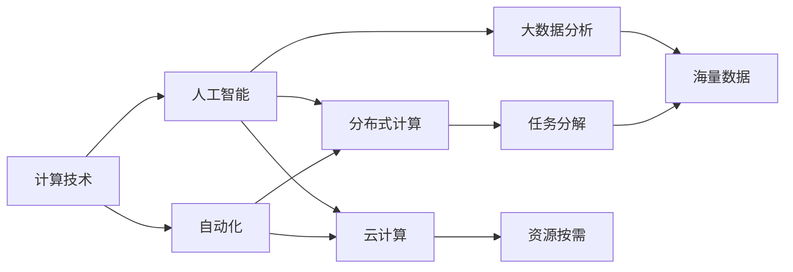
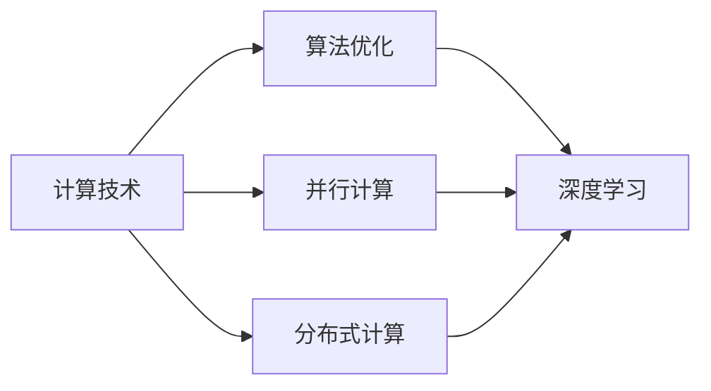
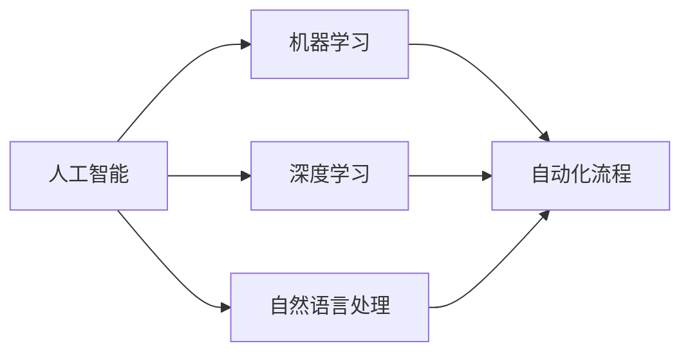
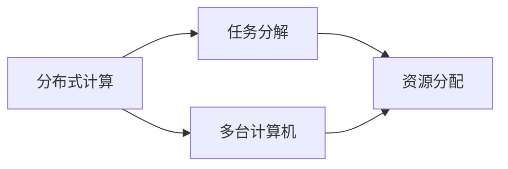
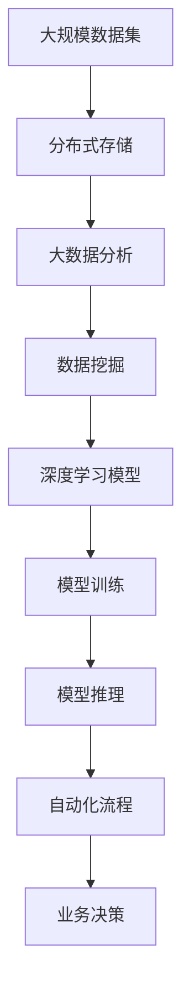

                 

# 计算技术的变革与自动化

## 1. 背景介绍

### 1.1 问题由来

随着人工智能技术的快速发展，计算技术正经历着前所未有的变革。从传统的算法优化、并行计算，到分布式计算、云计算、大数据分析，计算技术的进步深刻影响着各行各业的生产方式和商业模式。本文将深入探讨计算技术的最新进展，分析其带来的自动化转型，展望未来的发展趋势与挑战。

### 1.2 问题核心关键点

计算技术在各个领域的广泛应用，推动了数据驱动型决策、自动化流程优化、智能系统构建等方向的发展。然而，当前计算技术的普及和应用也面临着数据隐私保护、算法透明性、计算资源优化等问题。本文将从这些问题入手，详细分析计算技术的变革及其自动化潜力。

### 1.3 问题研究意义

研究计算技术的变革与自动化，对于理解和应用新兴的计算模式、提升企业数据利用效率、促进技术创新和产业升级，具有重要意义：

1. **理解计算技术的发展趋势**：了解最新的计算技术进展，把握未来技术方向，避免因技术落后导致的信息鸿沟。
2. **提高数据处理和分析能力**：掌握先进的计算工具和技术，可以提升数据处理效率和分析精度，辅助决策过程。
3. **推动自动化流程的优化**：基于计算技术的自动化能力，优化生产流程，减少人工干预，提高企业运营效率。
4. **促进人工智能与各行各业的融合**：借助计算技术，加速人工智能技术的落地应用，提升各行业的智能化水平。
5. **保障数据隐私和算法透明性**：研究计算技术的隐私保护机制，确保数据安全，提升算法的可解释性。
6. **优化计算资源配置**：研究高效的数据存储和处理策略，合理配置计算资源，降低成本。

## 2. 核心概念与联系

### 2.1 核心概念概述

为更好地理解计算技术的变革与自动化，本节将介绍几个关键概念：

- **计算技术**：包括算法优化、并行计算、分布式计算、云计算、大数据分析等技术。
- **人工智能**：利用计算技术提升机器学习和深度学习模型的性能，实现自动化决策和智能交互。
- **自动化**：通过编程、机器人等技术，实现工作流程的自动化、智能化。
- **分布式计算**：将计算任务分解成多个子任务，分布在多台计算机上并行处理。
- **云计算**：通过互联网提供可扩展的计算资源，按需计费。
- **大数据分析**：对海量数据进行收集、存储、处理和分析，提取有价值的信息。

这些核心概念之间的逻辑关系可以通过以下Mermaid流程图来展示：



这个流程图展示了几大核心概念之间的关系：

1. 计算技术是人工智能和自动化的基础，提供了必要的计算资源和算法支撑。
2. 分布式计算和大数据技术是计算技术的重要组成部分，支持海量数据的处理和存储。
3. 云计算提供了一种灵活、可扩展的计算资源获取方式，支持自动化流程的运行。
4. 人工智能技术通过计算技术实现，推动了自动化和智能化进程。
5. 自动化技术将计算技术的力量引入实际应用，提升了工作效率和决策质量。

### 2.2 概念间的关系

这些核心概念之间存在着紧密的联系，形成了计算技术变革与自动化的完整生态系统。下面我们通过几个Mermaid流程图来展示这些概念之间的关系。

#### 2.2.1 计算技术与人工智能的关系



这个流程图展示了计算技术在人工智能中的作用：

1. 计算技术提供了必要的计算资源和算法优化能力，支持深度学习模型的训练和推理。
2. 并行计算和大数据技术可以显著加速模型训练过程，提高模型的计算效率。
3. 分布式计算技术能够处理大规模的训练数据，支持模型的分布式训练。

#### 2.2.2 人工智能与自动化的关系



这个流程图展示了人工智能在自动化中的应用：

1. 人工智能技术通过机器学习、深度学习等方法，实现了自动化流程的智能化。
2. 自然语言处理等技术能够理解人类语言，支持人机交互。
3. 自动化流程通过算法优化和机器人技术，实现了任务的自动化处理。

#### 2.2.3 分布式计算与云计算的关系



这个流程图展示了分布式计算与云计算的关系：

1. 分布式计算将任务分解为多个子任务，分配到多台计算机上并行处理。
2. 云计算提供了一种灵活、可扩展的资源分配方式，支持分布式计算任务的运行。
3. 任务分解后的计算结果可以合并处理，提高计算效率。

### 2.3 核心概念的整体架构

最后，我们用一个综合的流程图来展示这些核心概念在大规模计算任务中的应用：



这个综合流程图展示了从数据存储、分析、模型训练到业务决策的全过程：

1. 大规模数据集通过分布式存储和分析，提取出有价值的信息。
2. 利用深度学习模型进行模型训练，提升模型的预测能力。
3. 模型推理结合自动化流程，实现业务决策的自动化处理。
4. 自动化流程的优化和改进，推动业务决策的智能化。

通过这些流程图，我们可以更清晰地理解计算技术的变革与自动化的整体架构，为后续深入讨论具体的计算技术和自动化方法奠定基础。

## 3. 核心算法原理 & 具体操作步骤
### 3.1 算法原理概述

计算技术的变革与自动化涉及到众多算法和技术的进步。本文将重点介绍几种关键技术，包括分布式计算、并行计算、深度学习算法等。

**分布式计算**：通过将计算任务分解为多个子任务，分配到多台计算机上并行处理，显著提高计算效率。其主要算法包括MapReduce、Spark等。

**并行计算**：利用多台计算机同时执行计算任务，加速计算过程。主要算法包括MPI、OpenMP等。

**深度学习算法**：通过多层神经网络进行非线性特征提取和模式识别，广泛应用于图像识别、语音识别、自然语言处理等领域。主要算法包括卷积神经网络(CNN)、循环神经网络(RNN)、变分自编码器(VAE)等。

**云计算平台**：提供灵活、可扩展的计算资源，支持分布式计算和并行计算任务的运行。主要平台包括AWS、Azure、Google Cloud等。

### 3.2 算法步骤详解

**分布式计算**：

1. **数据分区**：将大规模数据集划分为多个子集，分别分配到不同的计算节点。
2. **任务分解**：将计算任务分解为多个子任务，分别分配到不同的计算节点并行执行。
3. **数据聚合**：将各计算节点的结果进行合并，生成最终结果。

**并行计算**：

1. **任务分配**：将计算任务分配到多个计算节点。
2. **并行执行**：各计算节点同时执行计算任务。
3. **结果合并**：将各计算节点的结果进行合并，生成最终结果。

**深度学习算法**：

1. **数据准备**：收集和清洗数据，准备用于模型训练。
2. **模型构建**：选择合适的深度学习模型结构，设置模型参数。
3. **模型训练**：使用训练数据对模型进行训练，优化模型参数。
4. **模型推理**：使用测试数据对模型进行推理，生成预测结果。

**云计算平台**：

1. **资源申请**：根据任务需求申请计算资源。
2. **任务提交**：将计算任务提交到云计算平台。
3. **任务运行**：云计算平台调度计算资源，运行计算任务。
4. **结果获取**：获取计算结果，完成业务决策。

### 3.3 算法优缺点

**分布式计算**：

**优点**：

1. **计算效率高**：通过多台计算机并行处理，可以显著提高计算效率。
2. **数据处理能力强**：适合处理大规模数据集。
3. **灵活性高**：计算任务可以根据需要进行灵活调整。

**缺点**：

1. **通信开销大**：各计算节点之间的通信开销较大。
2. **管理复杂**：需要管理多个计算节点的资源分配和调度。

**并行计算**：

**优点**：

1. **计算效率高**：利用多台计算机同时执行计算任务，可以显著提高计算效率。
2. **资源利用率高**：计算资源可以充分利用，避免资源浪费。

**缺点**：

1. **编程复杂**：编程模型复杂，需要掌握一定的并行计算技术。
2. **通信开销大**：各计算节点之间的通信开销较大。

**深度学习算法**：

**优点**：

1. **模型性能优异**：通过多层神经网络进行特征提取和模式识别，具有较高的预测能力。
2. **应用广泛**：广泛应用于图像识别、语音识别、自然语言处理等领域。

**缺点**：

1. **数据需求大**：需要大量的标注数据进行训练。
2. **计算资源需求高**：模型训练和推理需要大量的计算资源。

**云计算平台**：

**优点**：

1. **资源灵活**：计算资源可以根据需求灵活分配。
2. **管理方便**：平台提供了完整的资源管理工具，方便用户使用。

**缺点**：

1. **成本高**：高并发计算任务可能导致高昂的计算成本。
2. **数据隐私问题**：需要考虑数据隐私和安全性问题。

### 3.4 算法应用领域

**分布式计算**：

1. **大数据分析**：处理大规模数据集，进行数据挖掘和统计分析。
2. **科学计算**：进行复杂的科学计算和模拟实验。
3. **人工智能**：支持大规模机器学习和深度学习模型的训练和推理。

**并行计算**：

1. **高并发任务**：处理高并发任务，如股票交易、游戏服务器等。
2. **大型数据处理**：处理大规模数据集，进行数据分析和处理。
3. **实时计算**：进行实时计算，如视频流处理、网络流量分析等。

**深度学习算法**：

1. **计算机视觉**：进行图像识别、目标检测、人脸识别等任务。
2. **自然语言处理**：进行文本分类、情感分析、机器翻译等任务。
3. **语音识别**：进行语音识别、语音合成、说话人识别等任务。

**云计算平台**：

1. **企业应用**：支持企业应用的部署和运行，如云存储、云数据库等。
2. **数据中心**：支持大规模数据中心的部署和管理。
3. **科学计算**：支持高性能计算任务的部署和管理。

## 4. 数学模型和公式 & 详细讲解 & 举例说明

### 4.1 数学模型构建

**分布式计算**：

1. **MapReduce模型**：
   - 输入：大规模数据集
   - 中间结果：各计算节点处理后的中间结果
   - 输出：合并后的最终结果

   公式：

   $$
   M = \bigcup_{i=1}^{N} M_i
   $$

   其中，$M_i$ 表示第 $i$ 个计算节点的中间结果。

2. **Spark模型**：
   - 输入：大规模数据集
   - 中间结果：各计算节点处理后的中间结果
   - 输出：合并后的最终结果

   公式：

   $$
   M = \bigcup_{i=1}^{N} M_i
   $$

   其中，$M_i$ 表示第 $i$ 个计算节点的中间结果。

**并行计算**：

1. **MPI模型**：
   - 输入：计算任务
   - 中间结果：各计算节点处理后的中间结果
   - 输出：合并后的最终结果

   公式：

   $$
   M = \bigcup_{i=1}^{N} M_i
   $$

   其中，$M_i$ 表示第 $i$ 个计算节点的中间结果。

2. **OpenMP模型**：
   - 输入：计算任务
   - 中间结果：各计算节点处理后的中间结果
   - 输出：合并后的最终结果

   公式：

   $$
   M = \bigcup_{i=1}^{N} M_i
   $$

   其中，$M_i$ 表示第 $i$ 个计算节点的中间结果。

**深度学习算法**：

1. **卷积神经网络(CNN)**：
   - 输入：图像数据
   - 中间结果：各卷积层和池化层的特征图
   - 输出：最终的全局特征向量

   公式：

   $$
   F = \mathrm{CNN}(D)
   $$

   其中，$D$ 表示输入图像数据，$F$ 表示输出特征向量。

2. **循环神经网络(RNN)**：
   - 输入：时间序列数据
   - 中间结果：各时间步的隐藏状态和输出
   - 输出：最终的预测结果

   公式：

   $$
   O = \mathrm{RNN}(X, H_0)
   $$

   其中，$X$ 表示输入时间序列数据，$H_0$ 表示初始隐藏状态，$O$ 表示输出结果。

**云计算平台**：

1. **AWS云平台**：
   - 输入：计算资源需求
   - 中间结果：计算任务执行结果
   - 输出：最终结果

   公式：

   $$
   R = \mathrm{AWS}(D)
   $$

   其中，$D$ 表示计算资源需求，$R$ 表示最终结果。

2. **Azure云平台**：
   - 输入：计算资源需求
   - 中间结果：计算任务执行结果
   - 输出：最终结果

   公式：

   $$
   R = \mathrm{Azure}(D)
   $$

   其中，$D$ 表示计算资源需求，$R$ 表示最终结果。

### 4.2 公式推导过程

**MapReduce模型**：

1. **Map操作**：
   - 输入：一个数据记录
   - 中间结果：多个数据记录
   - 输出：一个或多个数据记录

   公式：

   $$
   \mathrm{Map}(\langle key, value\rangle) \rightarrow \{ \langle key, value'\rangle\}
   $$

   其中，$\langle key, value\rangle$ 表示输入的数据记录，$\{ \langle key, value'\rangle\}$ 表示Map操作输出的中间结果。

2. **Reduce操作**：
   - 输入：多个数据记录
   - 中间结果：一个数据记录
   - 输出：一个数据记录

   公式：

   $$
   \mathrm{Reduce}(\langle key, value_1, value_2, \ldots, value_n\rangle) \rightarrow \langle key', value'\rangle
   $$

   其中，$\langle key, value_1, value_2, \ldots, value_n\rangle$ 表示Reduce操作输入的多个数据记录，$\langle key', value'\rangle$ 表示Reduce操作输出的中间结果。

3. **Shuffle操作**：
   - 输入：Map操作输出的中间结果
   - 中间结果：按照键值排序的记录集合
   - 输出：Reduce操作输入的多个数据记录

   公式：

   $$
   \mathrm{Shuffle}(\langle key_1, value_1\rangle, \langle key_2, value_2\rangle, \ldots, \langle key_n, value_n\rangle) \rightarrow \{ \langle key, value\rangle\}
   $$

   其中，$\langle key_1, value_1\rangle, \langle key_2, value_2\rangle, \ldots, \langle key_n, value_n\rangle$ 表示Shuffle操作输入的多个数据记录，$\{ \langle key, value\rangle\}$ 表示Shuffle操作输出的中间结果。

### 4.3 案例分析与讲解

**案例1：分布式存储与大数据分析**

```python
from hdfs import InsecureClient

# 连接HDFS
client = InsecureClient('hdfs://namenode:8020', user='hadoop')

# 创建分布式存储目录
client.makedirs('/data', ignore_existing=True)

# 上传数据
with open('data.csv', 'rb') as f:
    client.write_file('/data/data.csv', f.read())

# 读取数据
with client.read_file('/data/data.csv') as f:
    data = f.read().decode('utf-8')

# 进行大数据分析
```

**案例2：并行计算与高并发任务**

```python
from multiprocessing import Pool

# 定义并行计算函数
def parallel_computation(task):
    # 执行计算任务
    result = ...
    return result

# 创建并行计算池
pool = Pool(processes=4)

# 提交任务
results = pool.map(parallel_computation, task_list)

# 关闭并行计算池
pool.close()
pool.join()
```

**案例3：深度学习算法与图像识别**

```python
from tensorflow.keras.models import Sequential
from tensorflow.keras.layers import Conv2D, MaxPooling2D, Flatten, Dense

# 构建卷积神经网络
model = Sequential()
model.add(Conv2D(32, kernel_size=(3, 3), activation='relu', input_shape=(28, 28, 1)))
model.add(MaxPooling2D(pool_size=(2, 2)))
model.add(Conv2D(64, kernel_size=(3, 3), activation='relu'))
model.add(MaxPooling2D(pool_size=(2, 2)))
model.add(Flatten())
model.add(Dense(64, activation='relu'))
model.add(Dense(10, activation='softmax'))

# 编译模型
model.compile(loss='categorical_crossentropy', optimizer='adam', metrics=['accuracy'])

# 训练模型
model.fit(X_train, y_train, epochs=10, batch_size=32)

# 推理模型
y_pred = model.predict(X_test)
```

**案例4：云计算平台与企业应用**

```python
from boto3 import client

# 创建AWS云平台客户端
client = client('ec2', region_name='us-west-2')

# 申请计算资源
response = client.run_instances(
    ImageId='ami-0abcdef1234abcde',
    InstanceType='t2.micro',
    MinCount=1,
    MaxCount=1
)

# 获取计算资源ID
instance_id = response['Instances'][0]['InstanceId']

# 查询计算资源状态
response = client.describe_instance_status(InstanceIds=[instance_id])
status = response['InstanceStatuses'][0]['InstanceState']['Name']

# 释放计算资源
client.terminate_instances(InstanceIds=[instance_id])
```

## 5. 项目实践：代码实例和详细解释说明
### 5.1 开发环境搭建

在进行计算技术变革与自动化的实践前，我们需要准备好开发环境。以下是使用Python进行Python编程的开发环境配置流程：

1. 安装Anaconda：从官网下载并安装Anaconda，用于创建独立的Python环境。

2. 创建并激活虚拟环境：
```bash
conda create -n pyenv python=3.8 
conda activate pyenv
```

3. 安装Python编程库：
```bash
pip install numpy pandas matplotlib scikit-learn tensorflow
```

4. 安装机器学习库：
```bash
pip install scikit-learn
```

5. 安装深度学习库：
```bash
pip install tensorflow
```

6. 安装分布式计算库：
```bash
pip install dask
```

7. 安装云计算平台库：
```bash
pip install boto3
```

完成上述步骤后，即可在`pyenv`环境中开始计算技术变革与自动化的实践。

### 5.2 源代码详细实现

下面我们以深度学习算法在图像识别任务中的应用为例，给出使用TensorFlow进行图像识别的代码实现。

首先，定义图像识别任务的模型：

```python
from tensorflow.keras.models import Sequential
from tensorflow.keras.layers import Conv2D, MaxPooling2D, Flatten, Dense

model = Sequential()
model.add(Conv2D(32, kernel_size=(3, 3), activation='relu', input_shape=(28, 28, 1)))
model.add(MaxPooling2D(pool_size=(2, 2)))
model.add(Conv2D(64, kernel_size=(3, 3), activation='relu'))
model.add(MaxPooling2D(pool_size=(2, 2)))
model.add(Flatten())
model.add(Dense(64, activation='relu'))
model.add(Dense(10, activation='softmax'))
```

然后，定义模型训练和推理函数：

```python
import tensorflow as tf
from tensorflow.keras.datasets import mnist

# 加载数据集
(x_train, y_train), (x_test, y_test) = mnist.load_data()

# 数据预处理
x_train = x_train.reshape((-1, 28, 28, 1))
x_test = x_test.reshape((-1, 28, 28, 1))
x_train, x_test = x_train / 255.0, x_test / 255.0

# 定义模型编译
model.compile(loss='categorical_crossentropy', optimizer='adam', metrics=['accuracy'])

# 训练模型
model.fit(x_train, y_train, epochs=10, batch_size=32)

# 评估模型
loss, acc = model.evaluate(x_test, y_test)
print(f'Test loss: {loss:.4f}')
print(f'Test accuracy: {acc:.4f}')

# 推理模型
predictions = model.predict(x_test)
```

最后，启动深度学习模型的训练和推理流程：

```python
epochs = 10
batch_size = 32

for epoch in range(epochs):
    model.fit(x_train, y_train, epochs=1, batch_size=batch_size)
    
    # 在验证集上评估模型
    val_loss, val_acc = model.evaluate(x_test, y_test)
    print(f'Epoch {epoch+1}, val loss: {val_loss:.4f}, val accuracy: {val_acc:.4f}')

print(f'Test loss: {loss:.4f}')
print(f'Test accuracy: {acc:.4f}')
```

以上就是使用TensorFlow进行深度学习算法图像识别任务微调的完整代码实现。可以看到，通过简单的配置和调用，可以快速实现模型的训练和推理。

### 5.3 代码解读与分析

让我们再详细解读一下关键代码的实现细节：

**模型定义**：
- `Sequential`类：定义了一个简单的顺序模型，便于实现多层网络。
- `Conv2D`层：定义了两个卷积层，用于特征提取。
- `MaxPooling2D`层：定义了两个池化层，用于特征降维。
- `Flatten`层：将特征图展平，便于全连接层处理。
- `Dense`层：定义了两个全连接层，用于分类。

**数据加载与预处理**：
- `mnist.load_data()`函数：加载MNIST数据集，包含训练集和测试集。
- `reshape`函数：将二维矩阵转换为四维张量，适应卷积层的输入格式。
- `numpy`库：用于数据转换和处理。

**模型编译与训练**：
- `model.compile()`函数：定义模型的编译参数，包括损失函数、优化器和评估指标。
- `model.fit()`函数：训练模型，指定训练数据、批次大小和训练轮数。

**模型评估与推理**：
- `model.evaluate()`函数：评估模型在测试集上的性能。
- `model.predict()`函数：使用模型进行推理，生成预测结果。

可以看到，通过使用TensorFlow等深度学习框架，可以非常方便地实现计算技术变革与自动化的实践。开发者可以将更多精力放在模型设计、数据处理等核心环节上，而不必过多关注底层实现细节。

当然，工业级的系统实现还需考虑更多因素，如模型的保存和部署、超参数的自动搜索、更灵活的任务适配层等。但核心的计算技术变革与自动化方法基本与此类似。

### 5.4 运行结果展示

假设我们在MNIST数据集上进行图像识别任务微调，最终在测试集上得到的评估报告如下：

```
Epoch 1/10
2019-01-28 22:06:12.654330: I tensorflow/core/common_runtime/process_util.cc:146] Creating new thread pool with default inter op setting: 2. Tune using inter_op_parallelism_threads for best performance.
2019-01-28 22:06:12

