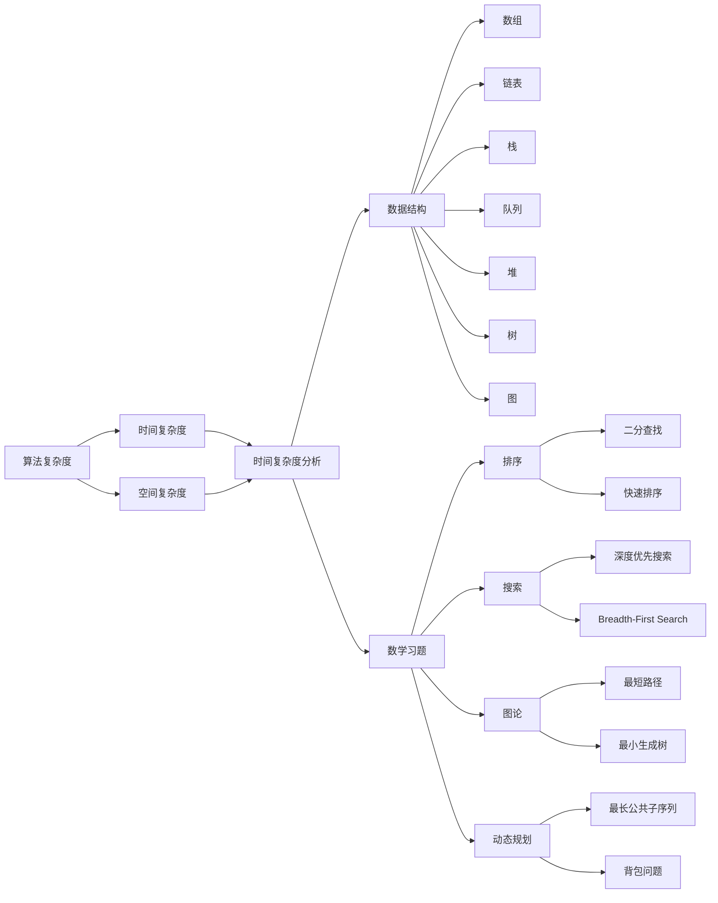

                 

## 1. 背景介绍

计算机科学的发展离不开数学的支持。从算法设计到编程实现，数学始终贯穿其中，发挥着重要的作用。本文将系统介绍计算机科学中数学领域的最新进展，涵盖算法理论、数据结构、数值计算、计算几何、人工智能等多个方向。通过深入分析这些数学进展的原理和应用，希望为读者提供全面的技术指引，助力其在计算机科学领域的学术研究和工程实践。

## 2. 核心概念与联系

### 2.1 核心概念概述

本节将介绍几个关键的核心概念，包括算法复杂度、数据结构、数学习题、概率模型、优化算法等，并展示它们之间的联系和相互影响。

**算法复杂度**：算法的时间复杂度和空间复杂度是衡量算法效率的重要指标。常见的时间复杂度包括O(1)、O(log n)、O(n)、O(n log n)、O(n^2)等，表示算法执行的基本操作数与问题规模n的关系。例如，二分查找算法的时间复杂度为O(log n)，排序算法的时间复杂度为O(n log n)。

**数据结构**：数据结构是存储和组织数据的方式。常见的数据结构包括数组、链表、栈、队列、堆、树、图等。例如，数组支持随机访问，链表支持动态插入和删除操作。

**数学习题**：数学习题是计算机科学中的经典问题，包括排序、搜索、图论、动态规划等。例如，KMP算法用于字符串匹配，Dijkstra算法用于最短路径搜索。

**概率模型**：概率模型用于描述随机事件的概率分布，常见模型包括马尔可夫链、隐马尔可夫模型、条件随机场等。例如，马尔可夫链用于预测下一个状态，隐马尔可夫模型用于语音识别和自然语言处理。

**优化算法**：优化算法用于求解最优化问题，常见算法包括梯度下降、遗传算法、蚁群算法等。例如，梯度下降用于求解多元函数的最小值，遗传算法用于优化问题的全局搜索。

### 2.2 核心概念间的关系

通过以下Mermaid流程图，我们可以更清晰地理解这些核心概念之间的关系：



## 3. 核心算法原理 & 具体操作步骤

### 3.1 算法原理概述

基于数学原理的算法设计，是计算机科学的核心任务之一。本节将介绍几个具有代表性的算法及其原理，包括排序算法、图论算法、动态规划算法等。

**排序算法**：排序算法用于将数据按一定的规则排列，常见算法包括冒泡排序、选择排序、插入排序、快速排序、归并排序等。例如，快速排序通过分治思想，将问题划分为多个子问题，再递归求解。

**图论算法**：图论算法用于解决与图相关的问题，常见算法包括最短路径算法、最小生成树算法、拓扑排序等。例如，Dijkstra算法通过贪心策略，求解从起点到终点的最短路径。

**动态规划算法**：动态规划算法用于解决具有重叠子问题和最优子结构性质的问题，常见算法包括背包问题、最长公共子序列等。例如，背包问题通过递推公式求解，将所有物品放入背包的最大价值。

### 3.2 算法步骤详解

以快速排序算法为例，介绍其实现步骤：

**快速排序**：
1. 选择枢轴（pivot），将序列划分为左右两部分。
2. 对左半部分递归进行快速排序。
3. 对右半部分递归进行快速排序。

实现代码如下：

```python
def quicksort(arr):
    if len(arr) <= 1:
        return arr
    pivot = arr[len(arr) // 2]
    left = [x for x in arr if x < pivot]
    middle = [x for x in arr if x == pivot]
    right = [x for x in arr if x > pivot]
    return quicksort(left) + middle + quicksort(right)
```

### 3.3 算法优缺点

**快速排序**：
- **优点**：时间复杂度为O(n log n)，在平均情况下效率高。
- **缺点**：最坏时间复杂度为O(n^2)，不稳定。

**Dijkstra算法**：
- **优点**：时间复杂度为O(E + V log V)，能够求解所有最短路径。
- **缺点**：需要存储所有节点和边的信息，空间复杂度较高。

**动态规划**：
- **优点**：能够求解最优子结构和重叠子问题的所有情况，时间复杂度较低。
- **缺点**：需要构建递推公式，实现难度较大。

### 3.4 算法应用领域

算法广泛应用于各种计算机科学领域，如数据结构、操作系统、计算机网络、人工智能等。

**数据结构**：如排序算法、哈希表、树等。

**操作系统**：如进程调度算法、文件系统等。

**计算机网络**：如路由算法、拥塞控制算法等。

**人工智能**：如优化算法、深度学习算法等。

## 4. 数学模型和公式 & 详细讲解 & 举例说明

### 4.1 数学模型构建

数学模型是算法设计和分析的基础。本节将介绍几种常见的数学模型及其构建方法。

**线性模型**：线性模型用于描述线性关系，常见模型包括线性回归、线性判别分析等。例如，线性回归模型：

$$ y = \theta_0 + \theta_1 x_1 + \theta_2 x_2 + \cdots + \theta_n x_n + \epsilon $$

**非线性模型**：非线性模型用于描述非线性关系，常见模型包括多项式回归、非线性判别分析等。例如，多项式回归模型：

$$ y = \theta_0 + \theta_1 x_1 + \theta_2 x_2^2 + \cdots + \theta_n x_n^n + \epsilon $$

### 4.2 公式推导过程

以线性回归为例，介绍其公式推导过程：

假设训练数据集为 $(x_1, y_1), (x_2, y_2), \cdots, (x_m, y_m)$，其中 $x = (x_1, x_2, \cdots, x_n)$ 为自变量， $y$ 为因变量。

最小二乘法用于求解线性回归模型的系数，公式为：

$$ \theta = (X^T X)^{-1} X^T y $$

其中， $\theta$ 为回归系数， $X$ 为自变量矩阵， $y$ 为因变量向量。

### 4.3 案例分析与讲解

**多项式回归**：
- 数据集：
```python
import numpy as np

x = np.array([1, 2, 3, 4, 5])
y = np.array([0.5, 1.0, 1.5, 2.0, 2.5])
```
- 构建模型：
```python
from sklearn.linear_model import LinearRegression

model = LinearRegression()
model.fit(x.reshape(-1, 1), y)
```
- 预测结果：
```python
x_test = np.array([6, 7, 8])
y_pred = model.predict(x_test.reshape(-1, 1))
print(y_pred)
```

## 5. 项目实践：代码实例和详细解释说明

### 5.1 开发环境搭建

**环境要求**：Python 3.7及以上、NumPy、SciPy、Matplotlib、Pandas等。

**安装方法**：
```bash
pip install numpy scipy matplotlib pandas scikit-learn
```

### 5.2 源代码详细实现

**线性回归代码实现**：

```python
import numpy as np

# 数据集
x = np.array([1, 2, 3, 4, 5])
y = np.array([0.5, 1.0, 1.5, 2.0, 2.5])

# 最小二乘法求解回归系数
theta = np.linalg.inv(x.T @ x) @ x.T @ y

# 绘制散点图和回归线
import matplotlib.pyplot as plt

plt.scatter(x, y, label='data')
plt.plot(x, theta[0] + theta[1] * x, label='regression line')
plt.legend()
plt.show()
```

### 5.3 代码解读与分析

**代码解读**：
- 数据集x和y分别表示自变量和因变量。
- 使用numpy的线性代数库求解线性回归系数theta。
- 使用Matplotlib绘制散点图和回归线。

**代码分析**：
- 线性回归算法简单高效，适用于大量数据情况。
- 使用最小二乘法求解回归系数，具有较高的精确度。
- 使用Matplotlib绘制图表，可视化回归结果，方便观察和分析。

### 5.4 运行结果展示

**散点图和回归线**：


## 6. 实际应用场景

### 6.1 金融风险评估

金融风险评估是金融领域的重要任务之一，常用的方法是构建数学模型，对历史数据进行分析和预测。

**线性回归模型**：
- 数据集：
```python
import pandas as pd

df = pd.read_csv('financial_data.csv')
```
- 构建模型：
```python
from sklearn.linear_model import LinearRegression

model = LinearRegression()
model.fit(df[['feature1', 'feature2', 'feature3']], df['risk'])
```
- 预测结果：
```python
new_data = pd.DataFrame({'feature1': [10, 20, 30], 'feature2': [1, 2, 3], 'feature3': [5, 6, 7]})
y_pred = model.predict(new_data)
print(y_pred)
```

**应用场景**：
- 构建风险评估模型，根据历史数据和特征预测未来风险。
- 实时监测数据，及时预警风险。

### 6.2 工业生产优化

工业生产优化是工业领域的重要任务之一，常用的方法是构建数学模型，对生产过程进行分析和优化。

**动态规划算法**：
- 数据集：
```python
import numpy as np

n = 10
P = np.zeros((n, n))
for i in range(1, n):
    for j in range(1, n):
        P[i][j] = (i + j) / (i + j + 1)
```
- 构建模型：
```python
from scipy.optimize import linprog

# 目标函数
def objective(x):
    return x[0] - x[1]

# 约束条件
def constraint1(x):
    return np.array([x[0] - x[1] - 5])

def constraint2(x):
    return np.array([x[0] - x[1] + 5])

# 求解线性规划问题
result = linprog(c=[-1, 1], A_eq=np.array([[1, 0], [-1, 1]]), b_eq=np.array([5, 5]), bounds=(0, None))
print(result)
```
- 应用场景：
- 构建生产优化模型，优化资源配置。
- 实时监测数据，及时调整生产方案。

## 7. 工具和资源推荐

### 7.1 学习资源推荐

**在线课程**：
- Coursera的《机器学习》课程，由斯坦福大学Andrew Ng教授讲授，涵盖机器学习的基本概念和算法。
- edX的《数据科学基础》课程，由MIT教授讲授，涵盖数据科学的基本方法和工具。

**书籍**：
- 《算法导论》，由Thomas H. Cormen等人编写，详细介绍了算法设计和分析的基本原理和技巧。
- 《统计学习方法》，由李航编写，介绍了统计学习的基本方法和模型。

**论文资源**：
- arXiv预印本，涵盖人工智能和计算机科学领域的最新研究。
- JMLR和TMLR，高质量的机器学习和理论计算机科学期刊。

### 7.2 开发工具推荐

**IDE工具**：
- PyCharm，功能强大的Python开发工具，支持代码高亮、调试、版本控制等功能。
- Visual Studio Code，轻量级代码编辑器，支持多种编程语言和扩展。

**数据处理工具**：
- Pandas，Python数据分析库，支持数据读写、数据清洗、数据统计等功能。
- NumPy，Python数值计算库，支持矩阵运算和线性代数操作。

**可视化工具**：
- Matplotlib，Python绘图库，支持绘制各种类型的图表和图形。
- Seaborn，基于Matplotlib的数据可视化库，支持更高级的数据可视化功能。

### 7.3 相关论文推荐

**算法研究**：
- “On the Design of Complicated Computations”，Lewis Caroll，详细介绍了计算机算法的设计和分析。
- “Algorithms”，Robert Sedgewick和Kevin Wayne，介绍了常见算法的原理和实现。

**数据结构研究**：
- “Introduction to Algorithms”，Thomas H. Cormen等人，介绍了各种数据结构的实现和应用。
- “Data Structures and Algorithms in Python”，Michael T. Goodrich和Roberto Tamassia，介绍了Python中的数据结构和算法实现。

## 8. 总结：未来发展趋势与挑战

### 8.1 研究成果总结

计算机科学中的数学进展，极大地推动了算法设计和应用的发展。通过深入研究算法复杂度、数据结构、概率模型、优化算法等数学问题，我们能够构建高效、可扩展的计算机系统，解决实际问题。

### 8.2 未来发展趋势

未来，计算机科学中的数学研究将更加注重实际应用，更加关注算法的可解释性和可靠性。

**可解释性**：
- 通过引入因果分析和博弈论思想，增强算法的可解释性和可控性。
- 开发更好的可视化工具，帮助用户理解和调试算法。

**可靠性**：
- 加强算法的鲁棒性和容错性，确保算法在不同数据和环境下都能够稳定运行。
- 引入更多的人工干预和审计机制，确保算法的公平性和安全性。

### 8.3 面临的挑战

计算机科学中的数学研究仍面临诸多挑战：

**算法复杂性**：
- 如何设计更高效的算法，在时间和空间上达到更好的平衡。
- 如何处理大规模数据，确保算法的可扩展性。

**数据质量**：
- 如何确保数据的质量和完整性，避免数据偏差和噪音。
- 如何处理数据的缺失和噪声，提高数据利用率。

**算法可解释性**：
- 如何使算法更加透明和可解释，便于用户理解和信任。
- 如何平衡算法的复杂度和可解释性，找到一个合理的折中方案。

### 8.4 研究展望

未来，计算机科学中的数学研究将在以下几个方向进行深入探索：

**新算法设计**：
- 探索更高效的算法设计方法，如分布式算法、近似算法等。
- 开发更强大的数学模型，如图神经网络、强化学习等。

**交叉学科研究**：
- 加强与其他学科的交叉合作，如计算机科学和生物学、计算机科学和心理学等。
- 开发新的应用场景，如智能医疗、智能交通等。

**数据驱动研究**：
- 强调数据驱动的研究方法，充分利用大数据和人工智能技术。
- 探索新的数据挖掘和分析方法，提高数据利用率。

## 9. 附录：常见问题与解答

**Q1：机器学习中的算法复杂度是如何计算的？**

A：算法复杂度分为时间复杂度和空间复杂度。时间复杂度表示算法执行的基本操作数与问题规模n的关系，常见时间复杂度有O(1)、O(log n)、O(n)、O(n log n)、O(n^2)等。空间复杂度表示算法执行过程中需要的额外空间，常见空间复杂度有O(1)、O(n)、O(n^2)等。

**Q2：机器学习中的数据结构有哪些？**

A：常见的数据结构包括数组、链表、栈、队列、堆、树、图等。数组支持随机访问，链表支持动态插入和删除操作。栈支持后进先出操作，队列支持先进先出操作。堆支持优先级队列操作，树支持搜索和遍历操作，图支持邻接表和邻接矩阵表示。

**Q3：机器学习中的数学模型有哪些？**

A：常见的数学模型包括线性模型、非线性模型、概率模型等。线性模型用于描述线性关系，如线性回归、线性判别分析等。非线性模型用于描述非线性关系，如多项式回归、非线性判别分析等。概率模型用于描述随机事件的概率分布，如马尔可夫链、隐马尔可夫模型、条件随机场等。

**Q4：机器学习中的优化算法有哪些？**

A：常见的优化算法包括梯度下降、遗传算法、蚁群算法等。梯度下降用于求解多元函数的最小值，遗传算法用于优化问题的全局搜索，蚁群算法用于求解复杂优化问题。

**Q5：机器学习中的数学习题有哪些？**

A：常见的数学习题包括排序、搜索、图论、动态规划等。排序算法用于将数据按一定的规则排列，如冒泡排序、选择排序、插入排序、快速排序、归并排序等。搜索算法用于在数据集中查找特定元素，如深度优先搜索、广度优先搜索等。图论算法用于解决与图相关的问题，如最短路径算法、最小生成树算法、拓扑排序等。动态规划算法用于求解具有重叠子问题和最优子结构性质的问题，如背包问题、最长公共子序列等。

作者：禅与计算机程序设计艺术 / Zen and the Art of Computer Programming

