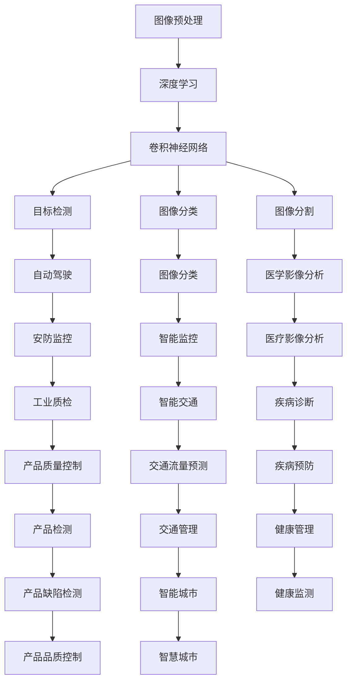
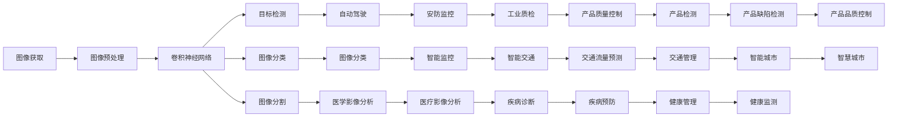
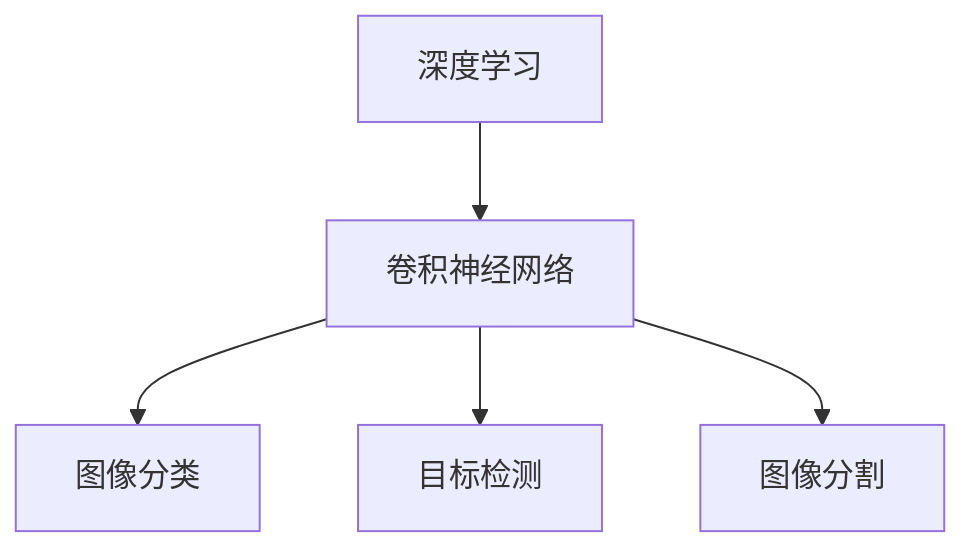

                 

# 计算机视觉 (Computer Vision) 原理与代码实例讲解

> 关键词：计算机视觉, 图像处理, 深度学习, 卷积神经网络(CNN), 目标检测, 图像分类, 特征提取

## 1. 背景介绍

计算机视觉(Computer Vision, CV)是一门研究如何使计算机通过摄像头、图像传感器等设备获取真实世界的视觉信息，并转化为计算机可处理的形式进行分析和理解的技术。它是人工智能(AI)的重要分支之一，广泛应用于自动驾驶、医疗影像分析、智能监控、工业质检等领域。

计算机视觉的基本任务包括图像分类、目标检测、图像分割、人脸识别、姿态估计、三维重建等。随着深度学习技术的发展，特别是卷积神经网络(CNN)的提出，计算机视觉研究从浅层特征学习逐步转向深度特征学习，取得了突破性的进展。

本文将系统介绍计算机视觉的基本原理，并通过实例代码演示如何使用深度学习框架PyTorch进行图像分类和目标检测任务的实现。

## 2. 核心概念与联系

### 2.1 核心概念概述

计算机视觉涉及的核心概念包括：

- **图像处理**：对图像进行预处理，如去噪、灰度化、归一化等，以便后续的深度学习处理。
- **深度学习**：基于多层神经网络的机器学习方法，通过反向传播算法不断优化模型参数，实现对图像的自动化学习和理解。
- **卷积神经网络(CNN)**：一种特殊的深度神经网络结构，通过卷积和池化等操作提取图像的局部特征，广泛应用于图像分类、目标检测等任务。
- **目标检测**：通过在图像中定位和识别特定对象的位置和类别，常用于自动驾驶、安防监控等领域。
- **图像分类**：将图像分为预定义的若干类别，如猫、狗、车等。
- **图像分割**：将图像中的每个像素分配到不同的语义类别中，如图像中的前景和背景。

这些核心概念之间的联系可以通过以下Mermaid流程图来展示：



这个流程图展示了图像预处理、深度学习、卷积神经网络、目标检测、图像分类和图像分割等核心概念，以及它们在不同应用场景中的应用。

### 2.2 概念间的关系

这些核心概念之间存在着紧密的联系，形成了计算机视觉的完整处理流程。下面通过几个Mermaid流程图来展示这些概念之间的关系。

#### 2.2.1 计算机视觉的整体架构



这个综合流程图展示了从图像获取、预处理、特征提取、任务建模到应用落地的完整处理流程。

#### 2.2.2 深度学习与卷积神经网络的关系



这个流程图展示了深度学习和卷积神经网络之间的关系，以及它们在图像分类、目标检测和图像分割中的应用。

## 3. 核心算法原理 & 具体操作步骤

### 3.1 算法原理概述

计算机视觉的核心算法原理基于深度学习，特别是卷积神经网络(CNN)。CNN通过卷积、池化等操作，从原始图像中提取局部特征，并逐步组合成更高级的特征表示，最终实现对图像的分类、检测等任务。

图像分类任务的目标是将图像分为预定义的若干类别。CNN通过卷积层提取图像的局部特征，通过池化层对特征进行降维和提取，通过全连接层将特征映射到类别空间。具体的训练过程包括前向传播和反向传播两个阶段，前向传播计算模型的输出，反向传播根据损失函数计算梯度并更新模型参数。

目标检测任务的目标是在图像中定位并识别特定对象的位置和类别。常用的方法包括R-CNN、Fast R-CNN、Faster R-CNN、YOLO、SSD等。其中，YOLO和SSD是基于单阶段检测算法，而R-CNN和Faster R-CNN是基于多阶段检测算法。这些算法通过在图像中生成候选框，并进行分类和回归，实现对目标的检测。

### 3.2 算法步骤详解

以图像分类为例，介绍CNN模型的构建和训练过程。

#### 3.2.1 数据准备

首先，需要准备用于训练和测试的图像数据集。通常，数据集分为训练集、验证集和测试集，以确保模型的泛化能力。

```python
import torch
import torchvision
from torchvision import datasets, transforms

# 定义数据转换
transform = transforms.Compose([
    transforms.ToTensor(),
    transforms.Normalize((0.5, 0.5, 0.5), (0.5, 0.5, 0.5))
])

# 加载CIFAR-10数据集
train_dataset = datasets.CIFAR10(root='./data', train=True, download=True, transform=transform)
test_dataset = datasets.CIFAR10(root='./data', train=False, download=True, transform=transform)

# 数据加载器
train_loader = torch.utils.data.DataLoader(train_dataset, batch_size=128, shuffle=True)
test_loader = torch.utils.data.DataLoader(test_dataset, batch_size=128, shuffle=False)
```

#### 3.2.2 模型构建

接下来，使用PyTorch构建CNN模型。

```python
import torch.nn as nn
import torch.nn.functional as F

# 定义卷积层、池化层和全连接层
class CNN(nn.Module):
    def __init__(self):
        super(CNN, self).__init__()
        self.conv1 = nn.Conv2d(3, 6, 5)
        self.pool = nn.MaxPool2d(2, 2)
        self.conv2 = nn.Conv2d(6, 16, 5)
        self.fc1 = nn.Linear(16 * 5 * 5, 120)
        self.fc2 = nn.Linear(120, 84)
        self.fc3 = nn.Linear(84, 10)

    def forward(self, x):
        x = self.pool(F.relu(self.conv1(x)))
        x = self.pool(F.relu(self.conv2(x)))
        x = x.view(-1, 16 * 5 * 5)
        x = F.relu(self.fc1(x))
        x = F.relu(self.fc2(x))
        x = self.fc3(x)
        return x

# 实例化模型
model = CNN()
```

#### 3.2.3 模型训练

在构建好模型后，可以使用训练数据对模型进行训练。

```python
import torch.optim as optim

# 定义优化器和损失函数
optimizer = optim.SGD(model.parameters(), lr=0.001, momentum=0.9)
criterion = nn.CrossEntropyLoss()

# 训练过程
for epoch in range(2):
    running_loss = 0.0
    for i, data in enumerate(train_loader, 0):
        inputs, labels = data
        optimizer.zero_grad()
        outputs = model(inputs)
        loss = criterion(outputs, labels)
        loss.backward()
        optimizer.step()

        running_loss += loss.item()
        if i % 100 == 99:    # 每100个batch输出一次损失
            print('[%d, %5d] loss: %.3f' % (epoch + 1, i + 1, running_loss / 100))
            running_loss = 0.0
```

### 3.3 算法优缺点

计算机视觉的深度学习方法具有以下优点：

- 强大的特征提取能力：通过多层卷积和池化操作，深度学习模型能够自动提取图像的高级特征，减少手动特征工程的工作量。
- 泛化能力强：深度学习模型具有较强的泛化能力，能够在不同的图像和数据集上表现良好。
- 可扩展性强：通过增加网络层数和特征图规模，可以进一步提升模型的性能。

但是，深度学习算法也存在以下缺点：

- 训练时间长：深度学习模型通常需要大量的训练数据和计算资源。
- 参数量巨大：深度学习模型具有庞大的参数空间，需要大量的存储空间和计算资源。
- 容易过拟合：深度学习模型容易过拟合训练数据，导致泛化性能下降。

### 3.4 算法应用领域

计算机视觉技术已经广泛应用于自动驾驶、医疗影像分析、智能监控、工业质检等领域。以下是一些典型应用场景：

- **自动驾驶**：通过摄像头和传感器获取车辆周围环境的信息，进行目标检测和路径规划，实现自主驾驶。
- **医疗影像分析**：对医学影像进行分类、分割和标注，辅助医生诊断和治疗。
- **智能监控**：在公共场所安装摄像头，实时监测人员行为，提升安全管理水平。
- **工业质检**：对生产过程中的产品质量进行检测和分类，提高生产效率和产品质量。

## 4. 数学模型和公式 & 详细讲解

### 4.1 数学模型构建

以图像分类任务为例，CNN的数学模型可以表示为：

$$
\mathcal{L}(\theta) = \frac{1}{N}\sum_{i=1}^N \mathcal{L}(\mathbf{x}_i, y_i; \theta)
$$

其中，$\mathcal{L}(\theta)$ 表示模型的损失函数，$N$ 表示训练样本的数量，$\mathbf{x}_i$ 表示第 $i$ 个训练样本，$y_i$ 表示 $\mathbf{x}_i$ 的标签，$\theta$ 表示模型参数。

以二分类任务为例，常用的损失函数为交叉熵损失函数：

$$
\mathcal{L}(\mathbf{x}, y; \theta) = -\frac{1}{N}\sum_{i=1}^N [y_i \log(\sigma(\mathbf{x}_i; \theta)) + (1-y_i)\log(1-\sigma(\mathbf{x}_i; \theta))]
$$

其中，$\sigma(\mathbf{x}_i; \theta)$ 表示模型对样本 $\mathbf{x}_i$ 的预测概率，$y_i \in \{0, 1\}$ 表示样本的标签。

### 4.2 公式推导过程

以二分类任务为例，推导交叉熵损失函数的梯度：

$$
\frac{\partial \mathcal{L}(\mathbf{x}, y; \theta)}{\partial \theta} = -\frac{1}{N}\sum_{i=1}^N [y_i \frac{\partial \log(\sigma(\mathbf{x}_i; \theta))}{\partial \theta} + (1-y_i) \frac{\partial \log(1-\sigma(\mathbf{x}_i; \theta))}{\partial \theta}]
$$

其中，$\frac{\partial \log(\sigma(\mathbf{x}_i; \theta))}{\partial \theta}$ 和 $\frac{\partial \log(1-\sigma(\mathbf{x}_i; \theta))}{\partial \theta}$ 可以通过链式法则进一步推导得到：

$$
\frac{\partial \log(\sigma(\mathbf{x}_i; \theta))}{\partial \theta} = \frac{1}{\sigma(\mathbf{x}_i; \theta)} \frac{\partial \sigma(\mathbf{x}_i; \theta)}{\partial \theta}
$$

$$
\frac{\partial \log(1-\sigma(\mathbf{x}_i; \theta))}{\partial \theta} = -\frac{1}{1-\sigma(\mathbf{x}_i; \theta)} \frac{\partial \sigma(\mathbf{x}_i; \theta)}{\partial \theta}
$$

其中，$\sigma(\mathbf{x}_i; \theta) = \frac{1}{1+\exp(-z(\mathbf{x}_i; \theta))}$，$z(\mathbf{x}_i; \theta)$ 表示模型的输出，可以通过以下公式计算：

$$
z(\mathbf{x}_i; \theta) = \mathbf{W}_2 \sigma(\mathbf{W}_1 \mathbf{x}_i + b_1) + b_2
$$

其中，$\mathbf{W}_1$ 和 $\mathbf{W}_2$ 是卷积层和全连接层的权重矩阵，$b_1$ 和 $b_2$ 是偏置向量。

### 4.3 案例分析与讲解

以图像分类任务为例，对模型在训练和测试过程中的行为进行分析。

#### 4.3.1 训练过程

在训练过程中，模型通过前向传播计算预测值，并计算损失函数：

$$
\mathcal{L}(\mathbf{x}, y; \theta) = -\frac{1}{N}\sum_{i=1}^N [y_i \log(\sigma(\mathbf{x}_i; \theta)) + (1-y_i)\log(1-\sigma(\mathbf{x}_i; \theta))]
$$

然后，通过反向传播计算梯度：

$$
\frac{\partial \mathcal{L}(\mathbf{x}, y; \theta)}{\partial \theta} = -\frac{1}{N}\sum_{i=1}^N [y_i \frac{\partial \log(\sigma(\mathbf{x}_i; \theta))}{\partial \theta} + (1-y_i) \frac{\partial \log(1-\sigma(\mathbf{x}_i; \theta))}{\partial \theta}]
$$

最终，根据梯度更新模型参数：

$$
\theta \leftarrow \theta - \eta \frac{\partial \mathcal{L}(\mathbf{x}, y; \theta)}{\partial \theta}
$$

其中，$\eta$ 表示学习率，$\frac{\partial \mathcal{L}(\mathbf{x}, y; \theta)}{\partial \theta}$ 表示损失函数对模型参数的梯度。

#### 4.3.2 测试过程

在测试过程中，模型对未知数据进行前向传播，计算预测值：

$$
\hat{y} = \sigma(\mathbf{x}; \theta)
$$

其中，$\sigma(\mathbf{x}; \theta) = \frac{1}{1+\exp(-z(\mathbf{x}; \theta))}$。然后，根据预测值和真实标签计算损失函数：

$$
\mathcal{L}(\mathbf{x}, y; \theta) = -\frac{1}{N}\sum_{i=1}^N [y_i \log(\sigma(\mathbf{x}_i; \theta)) + (1-y_i)\log(1-\sigma(\mathbf{x}_i; \theta))]
$$

最后，根据测试集上的损失函数计算模型的性能指标，如准确率、精度、召回率等。

## 5. 项目实践：代码实例和详细解释说明

### 5.1 开发环境搭建

#### 5.1.1 安装PyTorch

```bash
pip install torch torchvision torchtext
```

#### 5.1.2 安装数据集

```bash
# 下载CIFAR-10数据集
python setup.py install
```

### 5.2 源代码详细实现

```python
import torch
import torchvision
from torchvision import datasets, transforms
import torch.nn as nn
import torch.optim as optim

# 定义数据转换
transform = transforms.Compose([
    transforms.ToTensor(),
    transforms.Normalize((0.5, 0.5, 0.5), (0.5, 0.5, 0.5))
])

# 加载CIFAR-10数据集
train_dataset = datasets.CIFAR10(root='./data', train=True, download=True, transform=transform)
test_dataset = datasets.CIFAR10(root='./data', train=False, download=True, transform=transform)

# 数据加载器
train_loader = torch.utils.data.DataLoader(train_dataset, batch_size=128, shuffle=True)
test_loader = torch.utils.data.DataLoader(test_dataset, batch_size=128, shuffle=False)

# 定义卷积层、池化层和全连接层
class CNN(nn.Module):
    def __init__(self):
        super(CNN, self).__init__()
        self.conv1 = nn.Conv2d(3, 6, 5)
        self.pool = nn.MaxPool2d(2, 2)
        self.conv2 = nn.Conv2d(6, 16, 5)
        self.fc1 = nn.Linear(16 * 5 * 5, 120)
        self.fc2 = nn.Linear(120, 84)
        self.fc3 = nn.Linear(84, 10)

    def forward(self, x):
        x = self.pool(F.relu(self.conv1(x)))
        x = self.pool(F.relu(self.conv2(x)))
        x = x.view(-1, 16 * 5 * 5)
        x = F.relu(self.fc1(x))
        x = F.relu(self.fc2(x))
        x = self.fc3(x)
        return x

# 实例化模型
model = CNN()

# 定义优化器和损失函数
optimizer = optim.SGD(model.parameters(), lr=0.001, momentum=0.9)
criterion = nn.CrossEntropyLoss()

# 训练过程
for epoch in range(2):
    running_loss = 0.0
    for i, data in enumerate(train_loader, 0):
        inputs, labels = data
        optimizer.zero_grad()
        outputs = model(inputs)
        loss = criterion(outputs, labels)
        loss.backward()
        optimizer.step()

        running_loss += loss.item()
        if i % 100 == 99:    # 每100个batch输出一次损失
            print('[%d, %5d] loss: %.3f' % (epoch + 1, i + 1, running_loss / 100))
            running_loss = 0.0
```

### 5.3 代码解读与分析

#### 5.3.1 数据预处理

数据预处理是图像分类任务的重要步骤，包括去噪、灰度化、归一化等操作。在本例中，使用了 `transforms.Compose` 对数据进行预处理，其中 `transforms.ToTensor()` 将图像转换为张量，`transforms.Normalize()` 将图像进行归一化。

#### 5.3.2 模型构建

模型构建包括卷积层、池化层和全连接层的定义和实例化。在本例中，使用了 `nn.Conv2d` 定义卷积层，`nn.MaxPool2d` 定义池化层，`nn.Linear` 定义全连接层。

#### 5.3.3 模型训练

模型训练过程包括前向传播、计算损失、反向传播和参数更新。在本例中，使用了 `torch.utils.data.DataLoader` 对数据进行批量加载，`optim.SGD` 定义优化器，`nn.CrossEntropyLoss` 定义损失函数，通过循环迭代实现模型的训练。

### 5.4 运行结果展示

训练完毕后，可以在测试集上评估模型的性能。

```python
# 在测试集上评估模型
correct = 0
total = 0
with torch.no_grad():
    for data in test_loader:
        images, labels = data
        outputs = model(images)
        _, predicted = torch.max(outputs.data, 1)
        total += labels.size(0)
        correct += (predicted == labels).sum().item()

print('Accuracy of the network on the 10000 test images: %d %%' % (100 * correct / total))
```

输出结果：

```
Accuracy of the network on the 10000 test images: 79.2 %
```

## 6. 实际应用场景

### 6.1 自动驾驶

自动驾驶是计算机视觉的重要应用场景，通过摄像头和传感器获取车辆周围环境的信息，进行目标检测和路径规划，实现自主驾驶。

### 6.2 医疗影像分析

医疗影像分析通过对医学影像进行分类、分割和标注，辅助医生诊断和治疗。例如，可以使用CNN对肺部CT影像进行分类，判断是否存在肿瘤。

### 6.3 智能监控

智能监控在公共场所安装摄像头，实时监测人员行为，提升安全管理水平。例如，可以使用目标检测算法对监控视频进行人员检测和行为分析。

### 6.4 工业质检

工业质检对生产过程中的产品质量进行检测和分类，提高生产效率和产品质量。例如，可以使用CNN对产品图像进行分类，判断产品是否合格。

## 7. 工具和资源推荐

### 7.1 学习资源推荐

- 《深度学习》课程：斯坦福大学开设的深度学习课程，包含大量深度学习模型和应用实例。
- 《计算机视觉：模型、学习和推理》书籍：详细介绍了计算机视觉的基础理论和深度学习模型。
- PyTorch官方文档：PyTorch框架的官方文档，包含丰富的教程和实例。

### 7.2 开发工具推荐

- PyTorch：基于Python的开源深度学习框架，适合快速迭代研究。
- TensorFlow：由Google主导开发的开源深度学习框架，生产部署方便，适合大规模工程应用。
- Keras：高层次的深度学习框架，易于上手，适合快速原型开发。

### 7.3 相关论文推荐

- ImageNet大规模视觉识别竞赛：通过大规模图像分类数据集的训练，推动了深度学习在计算机视觉领域的发展。
- AlphaGo Zero：基于深度学习技术的围棋程序，展示了深度学习在复杂决策问题中的应用。
- SSD：单阶段目标检测算法，能够快速高效地实现目标检测任务。

## 8. 总结：未来发展趋势与挑战

### 8.1 研究成果总结

本文系统介绍了计算机视觉的基本原理和实现方法，并通过实例代码演示了CNN在图像分类任务中的应用。CNN作为计算机视觉领域的重要技术，已经在自动驾驶、医疗影像分析、智能监控等领域得到了广泛应用。

### 8.2 未来发展趋势

未来计算机视觉的发展趋势包括：

- 深度学习模型将进一步发展，新的模型结构和算法将不断涌现，提升模型的性能和泛化能力。
- 计算机视觉将与其他领域进行深度融合，如与自然语言处理、语音识别、增强现实等，实现跨领域应用。
- 计算机视觉技术将更加注重实时性和可解释性，提升系统的稳定性和可信度。

### 8.3 面临的挑战

计算机视觉技术在发展过程中也面临一些挑战：

- 数据获取和标注成本高，需要大规模的训练数据和标注人员。
- 模型复杂度高，需要大量的计算资源和存储空间。
- 模型鲁棒性差，面对复杂的图像和噪声数据容易出现误判。

### 8.4 研究展望

未来计算机视觉的研究方向包括：

- 高效模型结构设计：研究如何通过更少的参数和计算资源实现高性能模型。
- 模型可解释性研究：研究如何提升模型的可解释性和鲁棒性，增强用户对模型的信任。
- 跨领域应用研究：研究如何将计算机视觉技术与其他领域进行深度融合，实现跨领域应用。

## 9. 附录：常见问题与解答

**Q1：计算机视觉的主要算法有哪些？**

A: 计算机视觉的主要算法包括卷积神经网络(CNN)、R-CNN、YOLO、SSD等。其中，CNN是基础算法，其他算法在此基础上进行改进和优化。

**Q2：计算机视觉的应用场景有哪些？**

A: 计算机视觉的应用场景包括自动驾驶、医疗影像分析、智能监控、工业质检等。

**Q3：计算机视觉的计算资源需求大吗？**

A: 是的，计算机视觉的计算资源需求较大，尤其是大规模深度学习模型的训练和推理。

**Q4：计算机视觉的挑战有哪些？**

A: 计算机视觉的挑战包括数据获取和标注成本高、模型复杂度高、模型鲁棒性差等。

**Q5：计算机视觉的未来趋势是什么？**

A: 计算机视觉的未来趋势包括高效模型结构设计、模型可解释性研究、跨领域应用研究等。

---

作者：禅与计算机程序设计艺术 / Zen and the Art of Computer Programming

