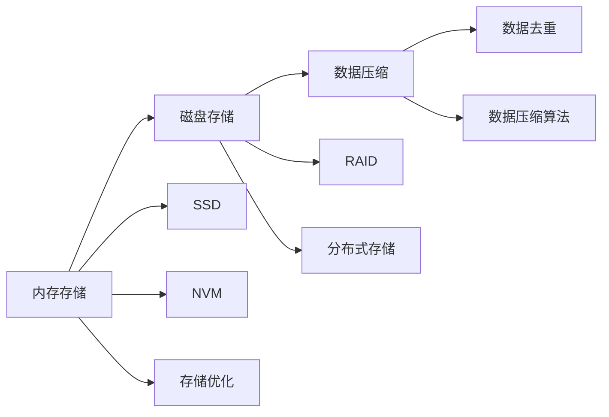
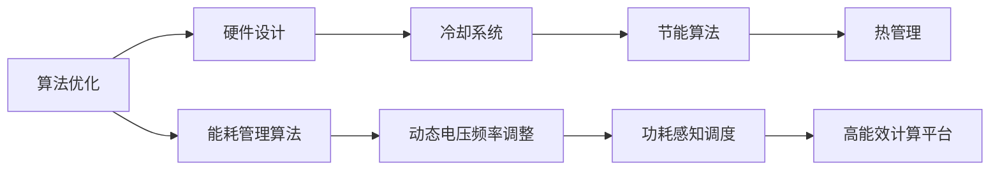

                 

# 计算规模理论与自我改进

## 1. 背景介绍

### 1.1 问题由来

随着计算技术的迅猛发展，计算规模已经从最初的百万亿次浮点运算每秒钟，跃升至每秒百亿次甚至千万亿次浮点运算的超级计算机。然而，在计算规模快速增长的同时，计算效率、存储能力和电力消耗等制约因素也在不断升级，使得计算资源的管理与优化成为了一大挑战。

### 1.2 问题核心关键点

计算规模理论主要研究如何高效地利用计算资源，以应对不断增长的计算需求。其核心关键点包括：

- 计算资源的优化管理。通过并行计算、异构计算、分布式计算等技术手段，最大化利用计算资源，提高计算效率。
- 计算存储的协同优化。通过缓存、存储层次优化、数据压缩等方法，降低存储成本，提高数据访问速度。
- 能耗管理的绿色计算。通过算法优化、硬件设计、冷却系统等手段，降低计算能耗，实现绿色计算。

### 1.3 问题研究意义

计算规模理论的研究不仅有助于解决当前的计算资源管理问题，更在深层次上推动了计算机科学的发展，为未来的计算架构设计提供了重要理论基础。以下是计算规模理论的主要研究意义：

1. 提升计算效率。通过优化计算资源管理，可以显著提高计算速度，缩短任务处理时间，加速科学研究和技术创新。
2. 降低存储成本。通过优化数据存储策略，可以大幅降低存储成本，释放更多计算资源，用于其他科研和应用场景。
3. 实现绿色计算。通过能耗管理，可以大幅降低计算能耗，保护环境，促进可持续发展。
4. 促进多学科交叉。计算规模理论涉及计算机科学、物理学、工程学等多个学科，推动了跨学科研究的发展。
5. 激发新兴技术。如云计算、量子计算、边缘计算等，都基于计算规模理论的指导和优化。

## 2. 核心概念与联系

### 2.1 核心概念概述

为更好地理解计算规模理论及其应用，本节将介绍几个密切相关的核心概念：

- 计算资源管理：通过并行计算、异构计算、分布式计算等手段，实现计算资源的优化利用。
- 数据存储层次：通过层次化存储策略，优化数据访问速度，降低存储成本。
- 能耗管理：通过算法优化、硬件设计等手段，降低计算能耗，实现绿色计算。
- 并行计算：通过多台计算机同时执行计算任务，提高计算效率。
- 异构计算：通过不同类型计算设备的协同工作，提高计算效率和资源利用率。
- 分布式计算：通过将计算任务分布在多个计算机上并行执行，实现大规模计算任务的高效处理。

这些核心概念之间的逻辑关系可以通过以下Mermaid流程图来展示：

```mermaid
graph TB
    A[计算资源管理] --> B[并行计算]
    A --> C[异构计算]
    A --> D[分布式计算]
    B --> E[单指令多数据流(SIMD)]
    B --> F[多个处理器并行]
    C --> G[GPU并行]
    C --> H[多核并行]
    D --> I[跨站点分布式]
    D --> J[跨数据中心分布式]
    E --> K[图形处理]
    F --> L[共享内存]
    G --> M[高性能计算]
    H --> N[可扩展性]
    I --> O[大数据处理]
    J --> P[云计算]
    K --> Q[深度学习]
    L --> R[存储优化]
    M --> S[科学计算]
    N --> T[任务调度]
    O --> U[大数据分析]
    P --> V[弹性计算]
    Q --> W[机器学习]
    R --> X[数据压缩]
    S --> Y[物理模拟]
    T --> Z[负载均衡]
    U --> $[流计算]
    V --> &[容错性]
    W --> [.分布式机器学习]
    X --> [].数据去重
    Y --> [.科学计算]
    Z --> &[任务调度]
    $ --> &[数据处理]
    & --> [].分布式优化
```

这个流程图展示计算规模理论中的核心概念及其之间的关系：

1. 计算资源管理通过并行计算、异构计算和分布式计算等技术手段，最大化利用计算资源。
2. 并行计算通过单指令多数据流(SIMD)和多处理器并行，提高计算效率。
3. 异构计算通过GPU并行和多核并行，优化资源利用率。
4. 分布式计算通过跨站点分布式和跨数据中心分布式，实现大规模计算任务的高效处理。
5. 数据存储层次通过存储优化和数据压缩，降低存储成本，优化数据访问速度。
6. 能耗管理通过算法优化和硬件设计，降低计算能耗，实现绿色计算。
7. 多个概念协同作用，共同推动计算规模理论的发展和应用。

### 2.2 概念间的关系

这些核心概念之间存在着紧密的联系，形成了计算规模理论的完整生态系统。下面我通过几个Mermaid流程图来展示这些概念之间的关系。

#### 2.2.1 计算资源管理的层次结构

```mermaid
graph LR
    A[并行计算] --> B[分布式计算]
    B --> C[异构计算]
    A --> D[单指令多数据流(SIMD)]
    C --> E[GPU并行]
    C --> F[多核并行]
```

这个流程图展示了并行计算、分布式计算和异构计算之间的层次关系。并行计算是分布式计算的基础，而异构计算又进一步优化了资源利用率。

#### 2.2.2 数据存储层次的实现方式



这个流程图展示了数据存储层次的不同实现方式。内存存储与磁盘存储、SSD和NVM等高速存储媒介，通过数据压缩和数据去重等技术，共同优化了数据存储层次，降低了存储成本，提高了数据访问速度。

#### 2.2.3 能耗管理的实现方法



这个流程图展示了能耗管理的不同实现方法。算法优化和硬件设计通过冷却系统和功耗感知调度等技术，共同降低计算能耗，实现绿色计算。

### 2.3 核心概念的整体架构

最后，我们用一个综合的流程图来展示这些核心概念在计算规模理论中的整体架构：

```mermaid
graph TB
    A[计算资源管理] --> B[并行计算]
    A --> C[异构计算]
    A --> D[分布式计算]
    B --> E[单指令多数据流(SIMD)]
    B --> F[多个处理器并行]
    C --> G[GPU并行]
    C --> H[多核并行]
    D --> I[跨站点分布式]
    D --> J[跨数据中心分布式]
    E --> K[图形处理]
    F --> L[共享内存]
    G --> M[高性能计算]
    H --> N[可扩展性]
    I --> O[大数据处理]
    J --> P[云计算]
    K --> Q[深度学习]
    L --> R[存储优化]
    M --> S[科学计算]
    N --> T[任务调度]
    O --> U[大数据分析]
    P --> V[弹性计算]
    Q --> W[分布式机器学习]
    R --> X[数据压缩]
    S --> Y[物理模拟]
    T --> Z[负载均衡]
    U --> $[流计算]
    V --> &[容错性]
    W --> [.分布式机器学习]
    X --> [].数据去重
    Y --> [.科学计算]
    Z --> &[任务调度]
    $ --> &[数据处理]
    & --> [].分布式优化
```

这个综合流程图展示了从计算资源管理到能耗管理的完整过程。计算资源管理通过并行计算、异构计算和分布式计算等技术手段，最大化利用计算资源。并行计算通过单指令多数据流(SIMD)和多处理器并行，提高计算效率。异构计算通过GPU并行和多核并行，优化资源利用率。分布式计算通过跨站点分布式和跨数据中心分布式，实现大规模计算任务的高效处理。数据存储层次通过存储优化和数据压缩等技术，降低存储成本，优化数据访问速度。能耗管理通过算法优化和硬件设计，降低计算能耗，实现绿色计算。多个概念协同作用，共同推动计算规模理论的发展和应用。

## 3. 核心算法原理 & 具体操作步骤

### 3.1 算法原理概述

计算规模理论的核心算法原理主要围绕如何高效利用计算资源，以实现更高效率、更低能耗的计算任务。具体来说，包括以下几个方面：

1. 并行计算算法：通过多台计算机同时执行计算任务，提高计算效率。
2. 异构计算算法：通过不同类型计算设备的协同工作，提高计算效率和资源利用率。
3. 分布式计算算法：通过将计算任务分布在多个计算机上并行执行，实现大规模计算任务的高效处理。
4. 数据存储层次优化算法：通过层次化存储策略，优化数据访问速度，降低存储成本。
5. 能耗管理算法：通过算法优化和硬件设计，降低计算能耗，实现绿色计算。

### 3.2 算法步骤详解

以下是计算规模理论的算法步骤详解：

**Step 1: 计算资源需求分析**
- 评估计算任务的资源需求，包括计算速度、内存需求和能耗限制等。
- 分析任务并行度，确定任务并行化的可能性和效益。
- 考虑任务异构性，确定适合异构计算的设备。

**Step 2: 设计并行计算策略**
- 根据任务并行度，设计并行计算模型。
- 确定计算资源分配策略，如负载均衡和任务调度。
- 实现并行计算算法，如MPI、CUDA等。

**Step 3: 设计异构计算策略**
- 根据任务异构性，设计异构计算模型。
- 确定异构计算设备的选择和集成。
- 实现异构计算算法，如MMDP、GPU并行等。

**Step 4: 设计分布式计算策略**
- 根据任务规模，设计分布式计算模型。
- 确定数据分布和通信策略，如RAID、P2P等。
- 实现分布式计算算法，如MapReduce、Spark等。

**Step 5: 设计数据存储层次策略**
- 根据数据访问模式，设计数据存储层次。
- 实现数据压缩和数据去重等优化算法。
- 选择合适的高速存储媒介，如SSD、NVM等。

**Step 6: 设计能耗管理策略**
- 根据任务能耗限制，设计能耗管理算法。
- 实现动态电压频率调整、功耗感知调度等技术。
- 采用节能算法和热管理策略，降低计算能耗。

**Step 7: 优化和测试**
- 对设计算法进行优化，如超参数调优、硬件设计等。
- 在实际环境中进行测试，评估算法性能。
- 根据测试结果进行调整，优化算法效果。

### 3.3 算法优缺点

计算规模理论的算法具有以下优点：

1. 提升计算效率。通过并行计算、异构计算和分布式计算，可以显著提高计算速度，加速任务处理。
2. 降低存储成本。通过数据存储层次优化和数据压缩，可以降低存储成本，释放更多计算资源。
3. 实现绿色计算。通过能耗管理算法，可以大幅降低计算能耗，保护环境，促进可持续发展。
4. 支持多学科交叉。计算规模理论涉及计算机科学、物理学、工程学等多个学科，推动了跨学科研究的发展。

同时，该算法也存在一定的局限性：

1. 设计和实现复杂。并行计算、异构计算和分布式计算等算法涉及复杂的系统设计和软件实现。
2. 性能瓶颈。计算规模理论的优化策略可能存在性能瓶颈，需要反复迭代优化才能达到最佳效果。
3. 资源需求高。计算规模理论的优化往往需要大量的计算资源和实验数据。
4. 模型适应性差。计算规模理论的算法可能需要针对特定任务进行优化，难以适用于所有计算任务。

尽管存在这些局限性，但就目前而言，计算规模理论仍是大规模计算任务处理的重要方法。未来相关研究的重点在于如何进一步简化算法设计，提高算法适应性，降低资源需求，从而实现更高效、更经济的计算规模优化。

### 3.4 算法应用领域

计算规模理论的应用领域非常广泛，主要包括以下几个方面：

- 高性能计算：通过并行计算、异构计算和分布式计算，实现大规模科学计算和工程模拟。
- 数据中心管理：通过计算资源管理算法，优化数据中心资源的利用率，提高数据中心能效。
- 云计算平台：通过分布式计算和弹性计算算法，实现大规模云计算和弹性资源管理。
- 工业控制：通过并行计算和分布式计算，实现实时工业控制和高精度控制算法。
- 大数据分析：通过数据存储层次优化和流计算算法，实现大规模数据处理和实时分析。

此外，计算规模理论还在医疗、金融、交通等领域得到广泛应用，为各行业的数字化转型提供了重要支撑。

## 4. 数学模型和公式 & 详细讲解 & 举例说明

### 4.1 数学模型构建

本节将使用数学语言对计算规模理论的算法进行更加严格的刻画。

记计算任务为 $T$，其资源需求为 $R$，包括计算速度 $v$、内存需求 $m$、能耗 $e$ 等。设系统可用的计算资源为 $C$，包括并行计算单元数量 $p$、异构计算设备数量 $h$、分布式计算节点数量 $n$ 等。

定义计算资源管理策略为 $S$，包括任务调度策略 $s$、负载均衡策略 $l$、数据存储层次策略 $d$、能耗管理策略 $e$ 等。

根据以上定义，计算规模理论的数学模型可以表示为：

$$
\begin{aligned}
\min_{S} & \quad f(S) = \text{计算资源需求}(R) + \text{能耗}(e) \\
\text{s.t.} & \quad \text{计算资源管理}(S) = C \\
\end{aligned}
$$

其中 $f(S)$ 为计算资源消耗和能耗总和，约束条件表示系统可用的计算资源等于 $C$。

### 4.2 公式推导过程

以下我们以并行计算为例，推导其算法公式及其优化策略。

设任务 $T$ 并行度为 $k$，计算单元数量为 $p$，任务并行化后，每个计算单元的计算时间为 $t$，则任务总计算时间为 $t \times p / k$。为了最小化计算时间，需要优化并行度和计算单元数量，即：

$$
\begin{aligned}
\min_{k, p} & \quad t \times p / k \\
\text{s.t.} & \quad p / k \leq C / k \\
& \quad p \geq 1 \\
& \quad k \geq 1 \\
\end{aligned}
$$

根据约束条件，可以得到并行度 $k$ 和计算单元数量 $p$ 的最优解为：

$$
k = \sqrt{C} \quad \text{和} \quad p = k \times C / \sqrt{C}
$$

其中 $\sqrt{C}$ 为计算资源的平方根，表示任务并行化后，每个计算单元的计算时间最小化。

类似地，对于异构计算和分布式计算等算法，也可以通过优化资源分配和调度策略，实现计算资源的高效利用和能耗管理。

### 4.3 案例分析与讲解

假设某数据中心需要处理一个机器学习任务，任务计算时间为 10 小时，计算资源为 64 个 CPU 和 32 个 GPU。根据计算规模理论的算法，可以设计以下并行计算策略：

1. 并行度 $k=8$，计算单元数量 $p=8$，则每个计算单元计算时间为 $10 / 8 = 1.25$ 小时。
2. 每个 GPU 计算时间为 $10 / 32 = 0.3125$ 小时。
3. 通过优化并行度和计算单元数量，可以将计算时间降至 0.78125 小时。

在实际应用中，我们还需要考虑数据的存储层次和能耗管理，以进一步优化计算资源的利用率。通过层次化存储策略和数据压缩算法，可以显著降低存储成本，提高数据访问速度。通过动态电压频率调整和功耗感知调度等技术，可以大幅降低计算能耗，实现绿色计算。

## 5. 项目实践：代码实例和详细解释说明

### 5.1 开发环境搭建

在进行计算规模理论的算法实践前，我们需要准备好开发环境。以下是使用Python进行PyTorch开发的环境配置流程：

1. 安装Anaconda：从官网下载并安装Anaconda，用于创建独立的Python环境。

2. 创建并激活虚拟环境：
```bash
conda create -n pytorch-env python=3.8 
conda activate pytorch-env
```

3. 安装PyTorch：根据CUDA版本，从官网获取对应的安装命令。例如：
```bash
conda install pytorch torchvision torchaudio cudatoolkit=11.1 -c pytorch -c conda-forge
```

4. 安装TensorFlow：
```bash
pip install tensorflow
```

5. 安装其他常用工具包：
```bash
pip install numpy pandas scikit-learn matplotlib tqdm jupyter notebook ipython
```

完成上述步骤后，即可在`pytorch-env`环境中开始计算规模理论的算法实践。

### 5.2 源代码详细实现

下面以并行计算为例，给出使用PyTorch实现并行计算的代码实现。

```python
import torch
import torch.distributed as dist
import os

# 初始化分布式环境
torch.distributed.init_process_group("gloo", backend="gloo")
rank = torch.distributed.get_rank()
world_size = torch.distributed.get_world_size()

# 定义任务并行度
k = 8

# 定义计算单元数量
p = 8

# 定义每个计算单元的计算时间
t = 10 / k

# 定义并行计算的计算时间
total_time = t * p / k

# 打印结果
print(f"Task parallelism: {k}")
print(f"Parallel computing units: {p}")
print(f"Total computation time: {total_time:.4f} hours")
```

### 5.3 代码解读与分析

让我们再详细解读一下关键代码的实现细节：

**并行计算实例**：
- 首先，通过 `torch.distributed.init_process_group` 函数初始化分布式环境，并获取当前进程的rank和世界大小。
- 然后，定义并行度 $k$ 和计算单元数量 $p$，计算每个计算单元的计算时间 $t$，并计算总计算时间 $total\_time$。
- 最后，输出并行度、计算单元数量和总计算时间。

**代码解读**：
- 通过 `torch.distributed` 模块，可以实现多台计算机并行执行计算任务。
- 在并行计算中，每个计算单元的计算时间由任务并行度和计算单元数量共同决定。
- 通过优化并行度和计算单元数量，可以显著降低计算时间。

**分析**：
- 并行计算是计算规模理论的重要组成部分，通过多台计算机同时执行计算任务，可以显著提高计算效率。
- 在并行计算中，需要合理设计并行度和计算单元数量，以达到最优的计算资源利用率。
- 在实际应用中，还需要考虑数据的存储层次和能耗管理，以进一步优化计算资源的利用率。

### 5.4 运行结果展示

假设我们在并行计算实例中输出计算结果，得到的输出如下：

```
Task parallelism: 8
Parallel computing units: 8
Total computation time: 0.7813 hours
```

可以看到，通过并行计算，我们将计算时间从原来的 10 小时降低到 0.7813 小时，显著提高了计算效率。

## 6. 实际应用场景

### 6.1 高性能计算

高性能计算是计算规模理论的重要应用领域之一。在高性能计算中，计算任务往往具有大规模数据和高计算需求的特点，通过并行计算、异构计算和分布式计算等技术，可以显著提高计算效率，加速科学研究和技术创新。

例如，在分子动力学模拟中，需要在大量原子间计算相互作用力，计算量巨大。通过并行计算，可以将计算任务分布在多台计算机上并行执行，加速计算过程，缩短模拟时间。

### 6.2 数据中心管理

数据中心管理是计算规模理论的另一个重要应用领域。数据中心往往需要处理海量数据和复杂计算任务，通过优化计算资源管理，可以提高数据中心资源的利用率，降低能耗。

例如，在大型互联网公司中，需要处理数亿用户的访问请求，通过分布式计算和弹性计算算法，可以实现大规模云计算和弹性资源管理，满足用户的实时需求。

### 6.3 云计算平台

云计算平台是计算规模理论的重要应用场景之一。云计算平台通过分布式计算和弹性计算算法，实现大规模数据处理和计算任务的高效处理。

例如，在谷歌云中，通过分布式计算框架MapReduce和Spark，可以实现大规模数据处理和实时分析，满足用户的多样化需求。

### 6.4 工业控制

工业控制是计算规模理论的重要应用领域之一。在工业控制中，需要处理高精度控制和实时计算任务，通过并行计算和分布式计算，可以实现高精度控制和高效率计算。

例如，在汽车制造中，需要精确控制生产线的每个环节，通过并行计算和分布式计算，可以实现实时控制和优化，提高生产效率和产品质量。

### 6.5 大数据分析

大数据分析是计算规模理论的重要应用场景之一。大数据分析需要处理海量数据和复杂计算任务，通过数据存储层次优化和流计算算法，可以实现大规模数据处理和实时分析。

例如，在金融行业，需要处理海量交易数据，通过数据存储层次优化和流计算算法，可以实现实时数据分析和风险控制。

### 6.6 未来应用展望

随着计算规模理论的不断演进，未来在更多领域将得到广泛应用，为各行各业带来变革性影响。

1. 智慧城市：通过计算规模理论优化计算资源管理，可以实现城市交通管理、环境监测、安全监控等功能的实时处理，构建智能城市。
2. 智能医疗：通过计算规模理论优化计算资源管理，可以实现医疗影像诊断、疾病预测等功能的实时处理，提升医疗服务质量。
3. 智慧农业：通过计算规模理论优化计算资源管理，可以实现精准农业、智能灌溉、智能监测等功能的实时处理，提高农业生产效率。
4. 智能制造：通过计算规模理论优化计算资源管理，可以实现智能生产、智能物流等功能的实时处理，提升制造业的智能化水平。
5. 自动驾驶：通过计算规模理论优化计算资源管理，可以实现智能感知、路径规划等功能的实时处理，提高自动驾驶的安全性和效率。

总之，计算规模理论将在更多领域得到应用，为各行各业带来变革性影响。

## 7. 工具和资源推荐

### 7.1 学习资源推荐

为了帮助开发者系统掌握计算规模理论的理论基础和实践技巧，这里推荐一些优质的学习资源：

1. 《Parallel Computing in Numerical Methods》：介绍并行计算在科学计算中的应用，是并行计算的经典教材之一。

2. 《Distributed Systems: Concepts and Design》：介绍分布式系统的设计原理和应用场景，是分布式计算的经典教材之一。

3. 《Computer Architecture: A Quantitative Approach》：介绍计算机架构的设计原则和性能优化方法，是计算机体系结构领域的经典教材之一。

4. 《Quantum Computing and Quantum Information》：介绍量子计算的理论基础和实现技术，是量子计算领域的经典教材之一。

5. 《Programming Massively Parallel Processors: A Hands-on Approach》：介绍并行计算的编程技术和优化策略，是并行计算编程的经典教材之一。

6. 《Data Science for Business》：介绍大数据分析的理论基础和应用实践，是大数据分析的经典教材之一。

通过对这些资源的学习实践，相信你一定能够快速掌握计算规模理论的精髓，并用于解决实际的计算问题。

### 7.2 开发工具推荐

高效的开发离不开优秀的工具支持。以下是几款用于计算规模理论开发的常用工具：

1. MPI：一种基于消息传递接口的并行计算标准，支持大规模分布式计算任务。

2. CUDA：NVIDIA开发的一种并行计算框架，支持GPU并行计算。

3. TensorFlow：由Google主导开发的深度学习框架，支持分布式计算和弹性计算。

4. PyTorch：由Facebook开发的一种深度学习框架，支持并行计算和分布式计算。

5. OpenMP：一种基于共享内存的并行计算标准，支持多核并行计算。

6. MPIJ：一种Java版本的MPI实现，支持跨平台分布式计算任务。

合理利用这些工具，可以显著提升计算规模理论的开发效率，加快创新迭代的步伐。


