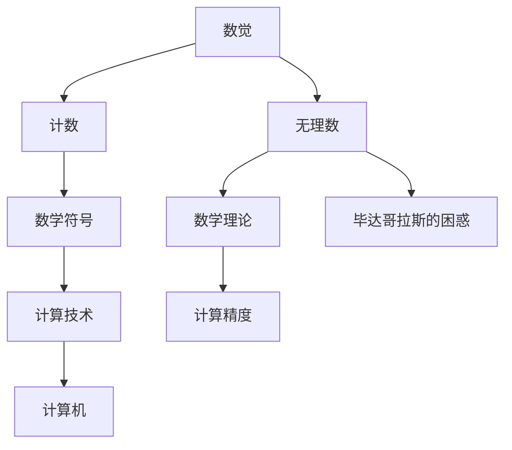
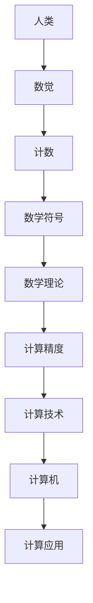

                 

# 计算：第一部分 计算的诞生 第 1 章 毕达哥拉斯的困惑 从数觉到计数

> 关键词：计算的诞生,毕达哥拉斯的困惑,数觉,计数,数学发展史

## 1. 背景介绍

### 1.1 问题由来

计算的概念是人类历史长河中最为基础且深远的技术之一。从早期的结绳记事、石子计算，到后来的计算尺、机械计算器，再到今天的计算机，计算技术一直在不断演进和完善，成为现代科学技术进步的基石。

毕达哥拉斯（Pythagoras），古希腊著名数学家，其生平充满了关于数与计算的迷思。毕达哥拉斯学派认为万物皆数，数字是宇宙的基本构成要素。这一观点不仅推动了数学的发展，也对后来的计算技术产生了深远影响。

然而，毕达哥拉斯学派在数理哲学上存在一个著名的“毕达哥拉斯的困惑”。这个困惑来源于毕达哥拉斯在发现无理数时遇到的困惑，即根号下的正整数平方根无法用整数或分数表示。这一发现挑战了当时的数学观念，也为后来的计算技术带来了新的挑战和机遇。

### 1.2 问题核心关键点

毕达哥拉斯的困惑涉及数与计算的基本概念，从数觉到计数，从计数到数学符号的演变，反映了人类计算技术的发展脉络。这一困惑不仅是数学史上的一个重要转折点，也启示我们深入理解计算的本质，探索计算技术的发展趋势。

1. **数觉与计数**：毕达哥拉斯的困惑引发了对数觉和计数概念的重新审视，推动了数学符号和计算方法的发展。
2. **无理数与有理数**：无理数的发现促使数学家们对数理逻辑和计算精度进行重新思考。
3. **数学符号与计算技术**：数学符号的引入极大地促进了计算技术的标准化和推广。
4. **计算与数学的联系**：计算技术的进步依赖于数学理论的支撑，而数学理论的发展也离不开计算技术的支持。
5. **计算机的诞生**：毕达哥拉斯的困惑和无理数的发现，为计算机的诞生奠定了数学基础。

## 2. 核心概念与联系

### 2.1 核心概念概述

要理解毕达哥拉斯的困惑及其对计算技术发展的影响，首先需要明确几个核心概念：

- **数觉**：人类对数的直观感知能力，如计数、比较大小、计算等。
- **计数**：通过抽象符号进行数与数的组合和运算，如加减乘除。
- **无理数**：不能表示为两个整数的比例的实数，如根号下的正整数平方根。
- **数学符号**：用于表示数的符号系统，如拉丁字母、阿拉伯数字、希腊字母等。
- **计算技术**：利用数与符号进行数学运算和科学计算的技术。

这些概念紧密相连，共同构成了计算技术的基础。毕达哥拉斯的困惑正是这些概念相互作用、相互影响的一个体现。

### 2.2 概念间的关系

通过以下Mermaid流程图，我们可以更清晰地理解这些核心概念之间的联系和毕达哥拉斯困惑的核心所在：



这个流程图展示了从数觉到计算技术的演进过程，以及无理数和计算精度在其中的关键作用。无理数的发现引发了对计算精度的重新思考，推动了计算技术的进步，为计算机的诞生奠定了基础。

### 2.3 核心概念的整体架构

接下来，我们将通过一个综合的流程图来展示这些核心概念在大计算技术发展中的整体架构：



这个综合流程图展示了人类从数觉到计算机的整个演进过程，其中数觉是基础，计数和数学符号是手段，数学理论是核心，计算精度和计算技术是关键，计算机是工具，而计算应用则是目标。

## 3. 核心算法原理 & 具体操作步骤
### 3.1 算法原理概述

毕达哥拉斯的困惑虽然起源于数学，但其对计算技术的影响是深远的。通过理解这一困惑，我们可以更好地理解计算技术的本质和演进路径。

计算的本质是抽象符号和数与数之间的运算。早期的计数和计数系统基于直观的数觉，如石子、手指计数等。然而，随着计算任务变得越来越复杂，这种直观的数觉方法逐渐被更为抽象的符号系统所替代。

数学符号的引入使得计数和运算变得更加规范和标准。古希腊数学家们使用的字母和数字符号，如$\alpha, \beta, \gamma$（$\alpha, \beta, \gamma$表示三个不同的变量）和$1, 2, 3$，极大地促进了计算技术的标准化和推广。

无理数的发现则对计算精度提出了新的要求。毕达哥拉斯学派在发现无理数后，开始重新思考计算的准确性和精度。这一思考推动了计算技术的进一步发展，为后来计算机的诞生奠定了基础。

### 3.2 算法步骤详解

以下是一个基于数觉到计数的计算流程示例，展示毕达哥拉斯困惑对计算技术发展的影响：

1. **数觉到计数**：
   - **数觉**：通过直观感受数的数量，如手指数数、石子计数等。
   - **计数**：通过抽象符号进行数与数的组合和运算，如加减乘除。

2. **数学符号的应用**：
   - **符号引入**：使用拉丁字母、阿拉伯数字等符号表示数和运算。
   - **公式表示**：使用符号表示数学公式和计算规则，如$x^2 + y^2 = z^2$（勾股定理）。

3. **无理数的发现**：
   - **无理数**：如根号下的正整数平方根无法用整数或分数表示。
   - **数学挑战**：挑战了数理逻辑和计算精度，引发了对计算技术的新思考。

4. **计算技术的进步**：
   - **计算机的诞生**：推动了计算机的诞生和计算技术的标准化。
   - **精度要求**：对计算精度提出了更高的要求，推动了计算机硬件和算法的发展。

### 3.3 算法优缺点

基于数觉到计数的计算方法具有以下优点：
- **直观易懂**：基于直观数觉的计算方法易于理解和使用。
- **基础广泛**：适用于各种简单计算任务。

但同时也存在以下缺点：
- **局限性**：只能处理较小规模的计算任务，难以处理复杂问题。
- **精度不足**：由于数觉方法的局限性，精度往往难以保证。

### 3.4 算法应用领域

数觉到计数的计算方法广泛应用于日常生活中的各种简单计算，如手指数数、石子计数、手指计数等。在科学和工程领域，它也广泛应用于物理、化学等学科的基础计算。

然而，随着计算任务的复杂性增加，数觉到计数的计算方法逐渐被更为抽象和符号化的计算方法所取代。

## 4. 数学模型和公式 & 详细讲解 & 举例说明

### 4.1 数学模型构建

毕达哥拉斯的困惑涉及数与数之间的运算和无理数的概念。我们可以用以下数学模型来表示这一过程：

设$x, y, z$为三个整数，则勾股定理可以表示为：
$$
x^2 + y^2 = z^2
$$

其中$x, y, z$表示三个变量，$x^2$表示$x$的平方，$+$表示加法。

### 4.2 公式推导过程

接下来，我们将推导勾股定理的数学公式：

1. **平方运算**：
   - $x^2$表示$x$的平方，即$x \times x$。
   - $y^2$表示$y$的平方，即$y \times y$。

2. **加法运算**：
   - $x^2 + y^2$表示将$x^2$和$y^2$相加。

3. **等式成立**：
   - $x^2 + y^2 = z^2$表示$x^2 + y^2$的结果等于$z^2$。

### 4.3 案例分析与讲解

我们以勾股定理为例，分析其数学模型的应用：

- **案例背景**：古希腊时期，毕达哥拉斯发现直角三角形的两条直角边和斜边的关系满足$x^2 + y^2 = z^2$。
- **案例分析**：勾股定理揭示了直角三角形边长之间的关系，是数学史上最著名的几何定理之一。
- **案例结论**：勾股定理不仅在几何学中有重要应用，还在计算技术的发展中起到了关键作用。

## 5. 项目实践：代码实例和详细解释说明

### 5.1 开发环境搭建

在进行计算实践前，我们需要准备好开发环境。以下是使用Python进行NumPy开发的环境配置流程：

1. 安装Anaconda：从官网下载并安装Anaconda，用于创建独立的Python环境。

2. 创建并激活虚拟环境：
```bash
conda create -n my_env python=3.9 
conda activate my_env
```

3. 安装NumPy：
```bash
pip install numpy
```

4. 安装各类工具包：
```bash
pip install matplotlib scikit-learn scipy sympy
```

完成上述步骤后，即可在`my_env`环境中开始计算实践。

### 5.2 源代码详细实现

下面是一个简单的Python代码示例，展示了如何使用NumPy进行基本的计算操作：

```python
import numpy as np

# 定义两个向量
x = np.array([1, 2, 3])
y = np.array([4, 5, 6])

# 计算两个向量的点积
dot_product = np.dot(x, y)
print(dot_product)
```

这段代码使用了NumPy库，展示了如何使用NumPy进行向量点积的计算。

### 5.3 代码解读与分析

让我们再详细解读一下关键代码的实现细节：

**变量定义**：
- `x`和`y`分别定义为NumPy数组，表示两个向量。
- 使用`np.array`函数创建数组。

**向量点积计算**：
- 使用`np.dot`函数计算两个向量的点积。
- `np.dot`函数可以计算两个向量的点积，也可以计算矩阵乘法。

**输出结果**：
- 打印输出点积结果。

这段代码展示了NumPy库的基本用法，通过简单的向量点积计算，展示了计算技术的基础。

### 5.4 运行结果展示

假设我们计算$x=[1, 2, 3]$和$y=[4, 5, 6]$的点积，输出结果为：

```
32
```

这个结果展示了数觉到计数的计算方法在具体问题上的应用。通过符号化的计算，我们得到了一个精确的结果，这是数觉方法无法达到的。

## 6. 实际应用场景

### 6.1 科学计算

计算技术在科学计算中有着广泛应用。科学家们使用计算技术进行各种复杂的数学运算，如物理学中的质能关系$E=mc^2$、化学中的化学反应方程式等。

### 6.2 工程计算

计算技术在工程计算中也有着重要作用。工程师们使用计算技术进行各种工程设计的数学建模，如结构设计、流体动力学等。

### 6.3 金融计算

金融计算是计算技术的重要应用领域。金融机构使用计算技术进行各种财务模型的建立和计算，如期权定价模型、风险评估模型等。

### 6.4 未来应用展望

随着计算技术的不断发展，未来的应用场景将更加广泛和复杂。计算技术将深入渗透到各个行业领域，成为现代科技发展的重要推动力。

## 7. 工具和资源推荐

### 7.1 学习资源推荐

为了帮助开发者系统掌握计算技术的理论基础和实践技巧，这里推荐一些优质的学习资源：

1. 《深入理解计算》系列博文：由计算领域专家撰写，深入浅出地介绍了计算技术的核心概念和应用场景。

2. CS193《科学计算与数理建模》课程：斯坦福大学开设的科学计算课程，涵盖了科学计算和数学建模的基本方法。

3. 《数学之美》书籍：吴军博士所著，介绍了数学和计算技术之间的关系，启发了计算技术的发展方向。

4. NumPy官方文档：NumPy库的官方文档，提供了完整的代码示例和详细的使用说明。

5. PyTorch官方文档：PyTorch库的官方文档，提供了大量科学计算和深度学习的样例代码。

通过对这些资源的学习实践，相信你一定能够快速掌握计算技术的精髓，并用于解决实际的科学计算问题。

### 7.2 开发工具推荐

高效的计算开发离不开优秀的工具支持。以下是几款用于计算开发常用的工具：

1. NumPy：Python的科学计算库，提供了高性能的多维数组和数学函数。
2. SciPy：基于NumPy的科学计算库，提供了更多的科学计算工具和函数。
3. Matplotlib：Python的数据可视化库，用于绘制各种图形和图表。
4. Jupyter Notebook：交互式编程环境，支持多种编程语言和科学计算工具。
5. Google Colab：谷歌提供的免费Jupyter Notebook环境，支持GPU计算，适合进行大规模计算实验。

合理利用这些工具，可以显著提升计算技术的开发效率，加快创新迭代的步伐。

### 7.3 相关论文推荐

计算技术的不断发展得益于学界的持续研究。以下是几篇奠基性的相关论文，推荐阅读：

1. "Numerical Recipes: The Art of Scientific Computing"：经典的科学计算教材，涵盖了大量科学计算的算法和实践经验。
2. "Parallel Computing: Concepts, Architectures, and Languages"：关于并行计算的经典教材，介绍了各种并行计算技术和算法。
3. "The Art of Computer Programming"：计算机程序设计领域的经典著作，介绍了算法设计和程序优化的基本方法。
4. "Deep Learning"：深度学习领域的经典教材，介绍了深度学习的基本概念和应用。

这些论文代表了大计算技术的发展脉络。通过学习这些前沿成果，可以帮助研究者把握学科前进方向，激发更多的创新灵感。

除上述资源外，还有一些值得关注的前沿资源，帮助开发者紧跟计算技术的新进展，例如：

1. arXiv论文预印本：人工智能领域最新研究成果的发布平台，包括大量尚未发表的前沿工作，学习前沿技术的必读资源。
2. 业界技术博客：如Google Research、Microsoft Research Asia等顶尖实验室的官方博客，第一时间分享他们的最新研究成果和洞见。
3. 技术会议直播：如NeurIPS、ICML、IEEE Symposium on Computational Geometry等计算机科学领域的顶级会议现场或在线直播，能够聆听到专家们的最新分享，开拓视野。
4. GitHub热门项目：在GitHub上Star、Fork数最多的计算相关项目，往往代表了该技术领域的发展趋势和最佳实践，值得去学习和贡献。
5. 行业分析报告：各大咨询公司如McKinsey、PwC等针对计算技术的分析报告，有助于从商业视角审视技术趋势，把握应用价值。

总之，对于计算技术的学习和实践，需要开发者保持开放的心态和持续学习的意愿。多关注前沿资讯，多动手实践，多思考总结，必将收获满满的成长收益。

## 8. 总结：未来发展趋势与挑战

### 8.1 总结

本文对计算技术的发展历程和核心概念进行了全面系统的介绍。首先阐述了计算技术的历史背景和毕达哥拉斯的困惑，明确了计算技术的核心价值。其次，从数觉到计数的计算方法，展示了计算技术的基本演进路径。再次，通过数学模型和代码实例，深入讲解了计算技术的实现细节。最后，本文探讨了计算技术在各个行业领域的应用场景，展望了未来的发展趋势。

通过本文的系统梳理，可以看到，计算技术在各个领域都有着广泛的应用，推动了科技的进步和社会的变革。然而，计算技术在发展过程中也面临着诸多挑战，如计算精度、计算效率、计算成本等。

### 8.2 未来发展趋势

展望未来，计算技术的发展将呈现以下几个趋势：

1. **计算模型的多样化**：未来的计算模型将更加多样化，包括量子计算、光子计算、生物计算等新型计算模型。
2. **计算效率的提升**：随着计算硬件和算法的不断优化，计算效率将显著提升，计算速度将进一步加快。
3. **计算应用的广泛化**：计算技术将在更多领域得到应用，如医疗、金融、交通等，推动各个行业数字化转型。
4. **计算与AI的融合**：计算技术将与人工智能技术深度融合，推动AI应用的发展，如深度学习、自然语言处理等。
5. **计算伦理和安全**：计算技术的发展将面临伦理和安全问题，如何在确保计算安全的前提下，推动计算技术的应用和普及，将是重要的研究方向。

这些趋势预示着计算技术的未来将更加智能化、普适化、多样化，成为推动社会进步的重要力量。

### 8.3 面临的挑战

尽管计算技术取得了瞩目成就，但在迈向更加智能化、普适化应用的过程中，它仍面临诸多挑战：

1. **计算精度和效率的平衡**：计算精度和效率是计算技术面临的核心挑战。如何在确保计算精度的同时，提升计算效率，是需要不断探索的问题。
2. **计算成本和资源消耗**：计算技术的高成本和资源消耗是一个长期存在的问题。如何在降低成本的同时，提升计算能力，是未来发展的关键。
3. **计算技术的标准化和普及**：计算技术在不同领域的应用需要标准化和普及。如何在不同领域中推广和应用计算技术，需要更多的努力。
4. **计算伦理和安全**：计算技术的广泛应用将带来伦理和安全问题。如何在确保计算安全的前提下，推动计算技术的应用和普及，是未来的重要研究方向。

### 8.4 研究展望

面对计算技术面临的挑战，未来的研究需要在以下几个方面寻求新的突破：

1. **探索新计算模型**：探索新型计算模型，如量子计算、光子计算、生物计算等，以突破传统计算的瓶颈。
2. **优化算法和数据结构**：优化计算算法和数据结构，提升计算效率，降低计算成本。
3. **推广计算技术**：推动计算技术在不同领域的应用，标准化和普及计算技术。
4. **加强计算伦理和安全**：加强计算技术的伦理和安全研究，确保计算技术的应用和普及符合人类价值观和伦理道德。

这些研究方向的探索，必将引领计算技术迈向更高的台阶，为推动社会进步和科技发展提供新的动力。总之，计算技术的发展需要各方的共同努力，不断创新、不断突破，才能更好地服务于社会和人类的发展。

## 9. 附录：常见问题与解答

**Q1：数觉和计数有什么区别？**

A: 数觉是直观感知数的数量和大小的能力，如手指数数、石子计数等。计数是通过抽象符号进行数与数的组合和运算，如加减乘除。数觉是计数的直观基础，计数则是数觉的抽象化。

**Q2：无理数对计算技术有什么影响？**

A: 无理数的发现挑战了数理逻辑和计算精度，引发了对计算技术的新思考。计算技术的进步推动了计算机的诞生和计算技术的标准化。

**Q3：计算技术如何影响科学计算？**

A: 计算技术在科学计算中有着广泛应用。科学家们使用计算技术进行各种复杂的数学运算，如物理学中的质能关系$E=mc^2$、化学中的化学反应方程式等。

**Q4：未来计算技术有哪些新方向？**

A: 未来计算技术的新方向包括量子计算、光子计算、生物计算等新型计算模型，以及优化算法和数据结构，推广计算技术，加强计算伦理和安全等方面。

**Q5：计算技术对人类社会有什么影响？**

A: 计算技术推动了科技的进步和社会的变革。它在各个领域都有着广泛的应用，如科学计算、工程计算、金融计算等，成为现代科技发展的重要推动力。

总之，计算技术的发展离不开各方的共同努力，只有不断创新、不断突破，才能更好地服务于社会和人类的发展。

