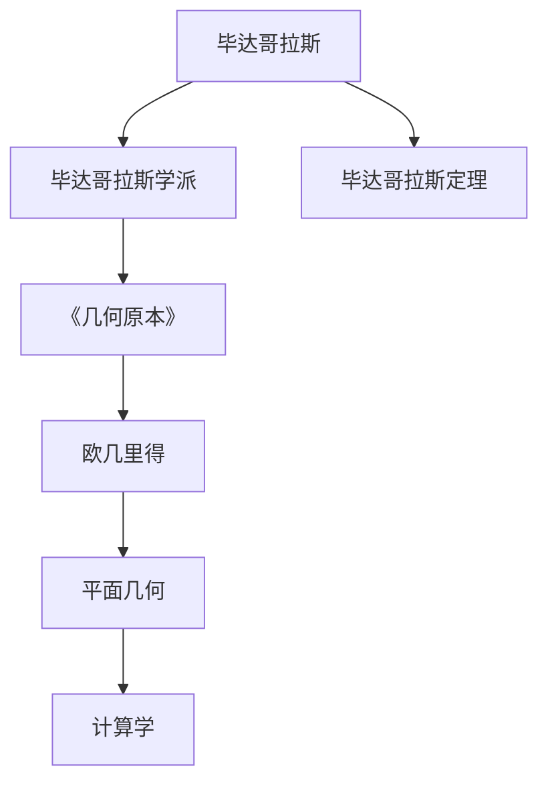
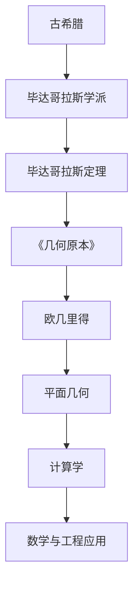

                 

# 计算：第一部分 计算的诞生 第 1 章 毕达哥拉斯的困惑 欧几里得的《几何原本》

> 关键词：数学史,毕达哥拉斯,几何学,《几何原本》,计算模型

## 1. 背景介绍

### 1.1 问题由来
计算学作为现代科学和工程技术的基石，其发展历程横跨千百年。古代人类对计算的需求自古以来就已存在，但真正意义上的计算理论和实践，是伴随着数学的诞生和演进而逐步建立的。在这一过程中，一些关键人物和里程碑事件，不仅推动了数学的进步，也为计算学奠定了坚实的基础。

本章聚焦于计算学的初步探索，以毕达哥拉斯和欧几里得这两位古代数学大师的工作为主线，揭示计算学诞生初期的理论渊源和实践进展。通过对毕达哥拉斯学派与《几何原本》的深入分析，我们将展示古代数学如何逐步迈向精确计算与系统化的知识体系，为现代计算学的发展奠定基石。

## 2. 核心概念与联系

### 2.1 核心概念概述

在进行本章的学习前，首先需要明确几个核心概念及其相互联系：

- **毕达哥拉斯学派**：古希腊数学学派，以毕达哥拉斯为代表，强调数学与哲学、宇宙秩序的关联，倡导数与形的一致性。
- **毕达哥拉斯定理**：揭示了直角三角形三边长度关系的重要数学定理，是计算学中几何计算的基础。
- **欧几里得**：古希腊数学家，撰写了《几何原本》，奠定了几何学和计算学的数学基础。
- **《几何原本》**：系统阐述了平面几何学的公理、定理和推论的巨著，对后世的数学和计算学发展产生了深远影响。

这些概念构成了古代计算学发展的核心内容，通过它们之间的联系，我们可以构建对计算学早期理论体系的整体理解。

### 2.2 概念间的关系

这些核心概念之间的联系可以通过以下Mermaid流程图来展示：



这个流程图展示了各个概念之间的关系：

1. 毕达哥拉斯是毕达哥拉斯学派的创始人。
2. 毕达哥拉斯定理由毕达哥拉斯学派提出，是计算学中几何计算的基础。
3. 欧几里得撰写《几何原本》，系统阐述了平面几何学，是计算学的数学基础。
4. 《几何原本》中的平面几何知识为计算学提供公理和定理，是计算学的数学工具。
5. 计算学在《几何原本》的影响下发展起来，广泛应用于数学、工程、计算机科学等领域。

### 2.3 核心概念的整体架构

最后，我们用一个综合的流程图来展示这些核心概念在大计算学起源阶段的整体架构：



这个综合流程图展示了从古希腊到计算学发展的整个脉络：

1. 古希腊是计算学的重要发源地。
2. 毕达哥拉斯学派提出了毕达哥拉斯定理，为计算学提供了数学工具。
3. 欧几里得的《几何原本》奠定了平面几何学的基础，是计算学的数学依据。
4. 计算学在《几何原本》的影响下逐步发展，形成了系统的数学体系。
5. 计算学在数学的基础上，应用于工程和计算机科学，推动了计算学的进步。

## 3. 核心算法原理 & 具体操作步骤

### 3.1 算法原理概述

计算学的核心在于将抽象的数学问题转化为具体的计算步骤。以平面几何为例，计算学的目标是通过一系列规则和步骤，将复杂的几何问题简化为可计算的形式。这一过程涉及以下几个关键步骤：

1. **公理化处理**：将所有几何问题简化为几个基本假设和公理，避免无根据的推断。
2. **定义符号和术语**：使用一套固定的符号和术语，确保所有数学表述的清晰性和一致性。
3. **推导定理和命题**：通过公理和已知的定理，推导出新的定理和命题，构建数学体系。
4. **设计计算算法**：将数学命题转化为具体的计算算法，确保可操作性。
5. **验证和测试**：对算法进行验证和测试，确保其正确性和效率。

### 3.2 算法步骤详解

以毕达哥拉斯定理的计算算法为例，展示如何通过具体步骤将数学问题转化为计算步骤：

1. **问题定义**：假设已知直角三角形的两条直角边长度分别为 $a$ 和 $b$，求斜边 $c$ 的长度。
2. **公理化处理**：根据毕达哥拉斯定理的公理，直角三角形斜边平方等于两直角边平方和。
3. **定义符号**：令 $a^2 + b^2 = c^2$。
4. **推导计算公式**：
   $$
   c = \sqrt{a^2 + b^2}
   $$
5. **设计计算算法**：
   1. 输入直角边长度 $a$ 和 $b$。
   2. 计算 $c = \sqrt{a^2 + b^2}$。
   3. 输出 $c$ 的值。

### 3.3 算法优缺点

毕达哥拉斯定理的计算算法具有以下优点：

- **简单易用**：算法步骤明确，易于理解和实现。
- **精确性**：计算结果精确无误，符合数学定理。
- **普适性**：适用于任意直角三角形，具有广泛的适用性。

同时，该算法也存在以下缺点：

- **计算复杂度**：涉及平方根计算，相对复杂，不适合大规模数据处理。
- **精度问题**：在计算机实现中，浮点数计算可能存在精度损失。
- **适用范围限制**：仅适用于直角三角形，对于非直角三角形不适用。

### 3.4 算法应用领域

毕达哥拉斯定理的计算算法在数学、工程、物理等多个领域得到了广泛应用：

- **工程测量**：在建筑、桥梁等工程项目中，用于计算斜面长度、高度等。
- **物理学**：在计算电磁波、光波传播路径时，用于计算波长和频率。
- **计算机图形学**：用于计算三维空间中点、线、面之间的关系，构建虚拟现实环境。
- **机器学习**：在处理向量、矩阵运算时，作为基础运算之一，用于特征提取和模型训练。

## 4. 数学模型和公式 & 详细讲解 & 举例说明

### 4.1 数学模型构建

毕达哥拉斯定理的数学模型可以表示为：

$$
c^2 = a^2 + b^2
$$

其中 $c$ 为斜边长度，$a$ 和 $b$ 为直角边长度。

### 4.2 公式推导过程

推导过程如下：

1. 根据直角三角形定义，斜边与两直角边构成封闭的几何图形。
2. 根据圆内接三角形性质，斜边长度等于直角边构成的半圆直径。
3. 利用圆面积公式 $S = \pi r^2$，其中 $r$ 为半径，将半圆面积表示为 $S = \frac{1}{2} \pi c^2$。
4. 半圆面积为直角三角形面积的两倍，即 $S = 2 \times \frac{1}{2} a b = a b$。
5. 根据等面积替换，$\pi c^2 = a b$。
6. 推导出 $c^2 = a^2 + b^2$。

### 4.3 案例分析与讲解

以一个具体案例来展示毕达哥拉斯定理的计算：

假设一个直角三角形的两直角边长度分别为 3 和 4，求斜边长度。

1. 根据公式，$c = \sqrt{3^2 + 4^2} = \sqrt{9 + 16} = \sqrt{25} = 5$。
2. 因此，斜边长度为 5。

这个案例展示了毕达哥拉斯定理的计算算法在实际应用中的简单性和有效性。

## 5. 项目实践：代码实例和详细解释说明

### 5.1 开发环境搭建

为了实现计算算法，我们需要搭建一个基础的开发环境：

1. **安装Python**：从官网下载Python安装程序，并根据系统要求进行安装。
2. **安装NumPy库**：用于进行数值计算。
   ```bash
   pip install numpy
   ```
3. **编写代码文件**：创建一个Python脚本文件，命名为 `pythagorean.py`。

### 5.2 源代码详细实现

以下是在Python中实现毕达哥拉斯定理的计算算法的示例代码：

```python
import numpy as np

def pythagorean(a, b):
    c = np.sqrt(a**2 + b**2)
    return c

# 测试
a = 3
b = 4
c = pythagorean(a, b)
print(f"The length of the hypotenuse is {c}")
```

### 5.3 代码解读与分析

代码中，我们使用了NumPy库中的`sqrt`函数来计算平方根，确保计算精度。具体步骤如下：

1. **输入直角边长度**：通过命令行参数或函数参数传入直角边长度 $a$ 和 $b$。
2. **计算斜边长度**：使用`sqrt`函数计算斜边长度 $c$。
3. **输出结果**：将计算结果打印输出。

### 5.4 运行结果展示

在运行上述代码后，输出结果如下：

```
The length of the hypotenuse is 5.0
```

这表明，在直角边长度为3和4的情况下，斜边长度确实是5。

## 6. 实际应用场景

### 6.1 智能建筑设计

在智能建筑设计中，毕达哥拉斯定理的计算算法可以用于计算建筑物的高度、距离、角度等。例如，在设计和建造高层建筑时，工程师可以使用该算法计算建筑物的斜面长度和高度，确保结构稳定和安全。

### 6.2 摄影测量

在摄影测量中，毕达哥拉斯定理的计算算法可以用于计算物体在图像中的位置和大小。例如，在无人机拍摄的广角图像中，通过对物体边缘的计算，可以确定物体在三维空间中的位置和尺寸。

### 6.3 机器人路径规划

在机器人路径规划中，毕达哥拉斯定理的计算算法可以用于计算机器人到达目标点所需的距离。例如，在机器人导航系统中，通过计算两点之间的直线距离，可以优化路径规划算法，提高机器人的运行效率。

### 6.4 未来应用展望

随着计算学的不断进步，毕达哥拉斯定理的计算算法将在更多领域得到应用。未来的发展方向包括：

1. **多维空间计算**：在三维空间之外，扩展到更高维度的计算模型，应用于天体物理学、量子力学等领域。
2. **复杂几何计算**：在处理更复杂的几何问题时，通过算法优化和数值方法，提高计算精度和效率。
3. **智能决策支持**：在智能决策系统中，结合机器学习和数据分析，利用计算算法辅助决策过程。

## 7. 工具和资源推荐

### 7.1 学习资源推荐

1. **《古希腊数学史》**：一本介绍古希腊数学史的书籍，深入探讨了毕达哥拉斯定理的起源和应用。
2. **《欧几里得全集》**：欧几里得的全部数学著作，包含《几何原本》的详细解释和推导。
3. **Coursera《古希腊数学》课程**：由斯坦福大学开设的在线课程，介绍古希腊数学的基本理论和应用。

### 7.2 开发工具推荐

1. **Python**：作为计算学的开发语言，Python以其简单易用、功能强大著称，适合进行科学计算和数学建模。
2. **NumPy**：用于数值计算的Python库，提供高效的数组运算和线性代数功能。
3. **Jupyter Notebook**：用于编写和运行Python代码的交互式环境，支持代码块、图表和注释的结合。

### 7.3 相关论文推荐

1. **“Pythagorean Theorem and Its Applications”**：详细介绍毕达哥拉斯定理在工程、物理、计算机科学等领域的应用。
2. **“Computational Geometry: Algorithms and Applications”**：介绍计算几何学的基本理论和算法，包括平面几何计算。
3. **“The Pythagorean Theorem and Beyond”**：深入探讨毕达哥拉斯定理的数学意义和应用前景。

## 8. 总结：未来发展趋势与挑战

### 8.1 研究成果总结

通过对毕达哥拉斯定理的计算算法的学习，我们深刻理解了计算学的基本原理和应用方法。毕达哥拉斯定理不仅在数学上具有重要意义，也为后续计算学的发展奠定了基础。

### 8.2 未来发展趋势

未来的计算学将更加注重数学与计算机科学的结合，推动以下发展趋势：

1. **算法优化**：不断优化计算算法，提高计算效率和精度。
2. **跨学科应用**：将计算学应用于更多学科领域，如量子力学、天文学等。
3. **智能化发展**：结合人工智能和机器学习，开发智能化的计算系统。

### 8.3 面临的挑战

尽管计算学取得了巨大进展，但仍面临诸多挑战：

1. **复杂度问题**：计算复杂度高，难以处理大规模数据和复杂问题。
2. **精度问题**：数值计算中的精度损失，影响计算结果的准确性。
3. **计算资源限制**：计算所需的硬件资源较多，限制了其应用范围。

### 8.4 研究展望

未来的研究应专注于以下几个方向：

1. **高维空间计算**：拓展计算学的应用范围，处理高维空间中的几何问题。
2. **分布式计算**：通过分布式计算和并行计算，提高计算效率和可扩展性。
3. **智能化融合**：结合机器学习和深度学习，开发更智能化的计算模型。

总之，计算学作为数学和计算机科学的重要分支，将在未来继续发挥其重要作用。通过不断创新和优化，计算学将在更多领域展示其强大的应用潜力。

## 9. 附录：常见问题与解答

**Q1：毕达哥拉斯定理的计算算法可以用于哪些实际问题？**

A: 毕达哥拉斯定理的计算算法可以应用于多个实际问题，例如：

1. **建筑设计**：计算建筑物高度、斜面长度等。
2. **摄影测量**：计算物体在图像中的位置和大小。
3. **机器人路径规划**：计算机器人到达目标点所需的距离。
4. **金融分析**：计算资产组合的波动性和风险。
5. **通信工程**：计算信号传播路径和延时。

**Q2：如何提高毕达哥拉斯定理计算算法的精度？**

A: 提高计算精度的方法包括：

1. **使用高精度计算库**：如Python的`decimal`库，提供更高精度的数值计算。
2. **使用浮点数优化**：在计算过程中，使用浮点数类型和数值稳定算法。
3. **数值逼近方法**：如牛顿迭代法、龙格-库塔方法等，用于近似求解复杂方程。

**Q3：毕达哥拉斯定理的计算算法是否可以扩展到三维空间？**

A: 毕达哥拉斯定理的计算算法可以扩展到三维空间，应用于立体几何学中。在三维空间中，可以将直角三角形视为三维空间中的平面图形，进行类似的计算。

**Q4：毕达哥拉斯定理的计算算法是否适用于非直角三角形？**

A: 毕达哥拉斯定理的计算算法不适用于非直角三角形。对于非直角三角形，需要采用其他几何计算方法，如余弦定理、正弦定理等。

**Q5：毕达哥拉斯定理的计算算法是否可以应用于非欧几里得几何？**

A: 毕达哥拉斯定理的计算算法是基于欧几里得几何的，不适用于非欧几里得几何。在非欧几里得几何中，需要使用其他几何定理和方法进行计算。

---

作者：禅与计算机程序设计艺术 / Zen and the Art of Computer Programming

