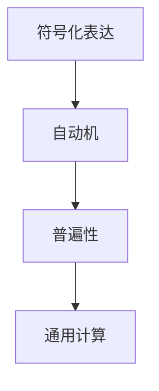
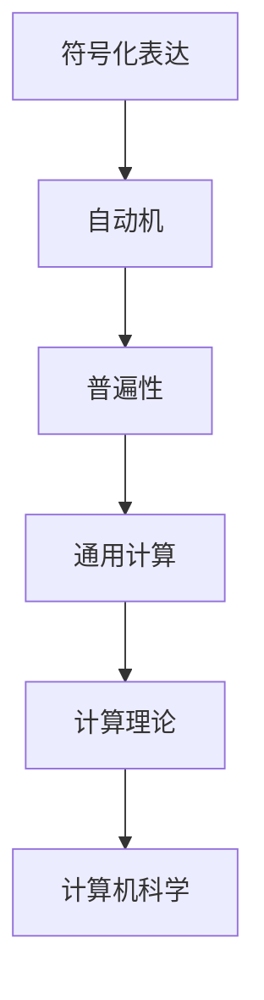

                 

# 计算：第一部分 计算的诞生 第 3 章 莱布尼茨的计算之梦 思想的大衍术

> 关键词：计算理论, 数学模型, 思想的大衍术, 莱布尼茨, 微积分, 信息论, 计算机科学

## 1. 背景介绍

在现代信息社会，计算已成为无处不在的核心技能。从微积分到计算机科学，计算理论的发展历程，折射出人类对信息处理逻辑的探索与实践。本章将回溯计算理论的诞生，探讨莱布尼茨的计算之梦，以及思想的大衍术。

### 1.1 问题由来
计算理论的起源可以追溯到17世纪，当时德国哲学家兼数学家戈特弗里德·威廉·莱布尼茨（Gottfried Wilhelm Leibniz）提出了“思想的大衍术”（Universal Calculus）的设想。莱布尼茨的思想大衍术，实质上是一种通用化的计算框架，旨在将复杂的计算过程简化为基本的操作单位，从而实现信息的自动处理。这一构想，为后来的微积分和计算机科学的诞生，奠定了坚实的基础。

### 1.2 问题核心关键点
莱布尼茨的计算之梦，主要围绕以下几个核心关键点展开：

- **符号化表达**：引入符号“S”和“N”，表示数字1和无穷大的思想，通过符号化表达来描述无穷级数和微积分的基本概念。
- **普遍性**：强调思想的大衍术具有普遍性，不仅适用于数学计算，还可以扩展到更广泛的信息处理领域。
- **自动机原理**：提出一种机械化的自动机（Calculating Machine）概念，旨在通过一系列机械操作，实现复杂计算的自动化。
- **可执行性**：构思了具有通用性的计算机器（Universal Computing Machine），能够执行任何计算任务，体现了计算的通用性和可执行性。

通过这些关键点的探讨，莱布尼茨的思想大衍术为计算理论的发展奠定了基石。

### 1.3 问题研究意义
莱布尼茨的计算之梦，不仅在当时推动了数学和哲学的发展，也为现代计算机科学和信息处理技术的形成，提供了重要的理论基础。他的思想大衍术，展示了计算理论的普遍性和自动化潜力，预示了未来计算机科学的发展方向。通过深入理解莱布尼茨的思想，我们可以更好地把握计算理论的起源和发展脉络，为未来的研究提供启示。

## 2. 核心概念与联系

### 2.1 核心概念概述

莱布尼茨的思想大衍术，涉及多个核心概念，这些概念构成了计算理论的基本框架。以下是这些核心概念的概述：

- **符号化表达**：通过引入符号来代表数学中的各种概念，如数字、无穷大、极限等，实现了对复杂计算的符号化描述。
- **普遍性**：思想大衍术的普遍性，体现在其适用于各种数学计算，并可以扩展到其他领域的信息处理，如逻辑、语言学等。
- **自动机**：自动机是一种模拟计算过程的机器，能够按照预设的规则自动执行计算任务。
- **通用计算**：通用计算机器（Universal Computing Machine），指一种能够执行任何计算任务的机器，是现代计算机的基础。

这些核心概念，共同构成了莱布尼茨的思想大衍术，展示了计算理论的基本原理和思想基础。

### 2.2 概念间的关系

通过以下Mermaid流程图，我们可以更加直观地理解这些核心概念之间的联系：



这个流程图展示了符号化表达、自动机和普遍性、通用计算之间的关系：符号化表达是自动机和通用计算的基础，而自动机和普遍性进一步扩展了符号化表达的应用范围，最终导致了通用计算机器的诞生。

### 2.3 核心概念的整体架构

最后，我们用一个综合的流程图来展示这些核心概念在大衍术中的整体架构：



这个综合流程图展示了符号化表达、自动机、普遍性、通用计算和计算理论之间的联系，以及这些概念如何共同构成莱布尼茨的思想大衍术，并推动了计算机科学的形成和发展。

## 3. 核心算法原理 & 具体操作步骤
### 3.1 算法原理概述

莱布尼茨的思想大衍术，基于符号化表达和自动机原理，旨在通过通用化的计算方法，简化复杂计算过程，实现信息的自动处理。其核心思想是将复杂的计算任务，分解为一系列基本的操作单位，通过符号和规则进行表达和执行。

### 3.2 算法步骤详解

莱布尼茨的思想大衍术，主要包括以下几个关键步骤：

1. **符号化表达**：引入符号“S”和“N”，分别代表数字1和无穷大，通过符号化表达来描述无穷级数和微积分的基本概念。

2. **自动机设计**：设计一个自动机，通过机械化操作，实现符号表达的计算。自动机包括输入、存储、运算和输出四个部分，能够按照预设的规则自动执行计算任务。

3. **普遍性验证**：通过符号化表达和自动机设计，验证思想大衍术的普遍性，即该方法适用于各种数学计算，并可以扩展到其他领域的信息处理。

4. **通用计算机器**：设计一种通用计算机器，能够执行任何计算任务，体现了计算的通用性和可执行性。

5. **理论验证**：通过理论推导，验证思想大衍术的正确性和完备性，展示其对计算理论的基础性贡献。

### 3.3 算法优缺点

莱布尼茨的思想大衍术，具有以下优点：

- **普遍性**：思想大衍术适用于各种数学计算，并可以扩展到其他领域的信息处理，体现了计算理论的普遍性。
- **自动化**：自动机设计实现了计算的自动化，通过机械化操作，简化了复杂的计算过程。
- **可执行性**：通用计算机器展示了计算的通用性和可执行性，为现代计算机科学提供了基础。

同时，该方法也存在一定的局限性：

- **复杂性**：自动机设计和符号化表达，虽然简化了计算过程，但实现起来较为复杂，需要较高的技术门槛。
- **理论完备性**：思想大衍术的理论验证尚不够充分，其完备性有待进一步探讨。
- **应用范围**：虽然具有普遍性，但在某些特定的领域，可能需要进一步的研究和改进。

### 3.4 算法应用领域

莱布尼茨的思想大衍术，对计算理论和计算机科学的发展具有深远影响，其主要应用领域包括：

- **数学**：通过符号化表达和自动机设计，简化复杂的数学计算过程，推动了微积分的发展。
- **逻辑**：通过符号化表达，实现了逻辑推理的自动化，为逻辑学的研究提供了新的工具。
- **语言学**：通过符号化表达，探索语言的结构和规律，推动了语言学的研究。
- **计算机科学**：思想大衍术的思想，为现代计算机科学奠定了基础，促进了计算理论的发展。

## 4. 数学模型和公式 & 详细讲解 & 举例说明

### 4.1 数学模型构建

莱布尼茨的思想大衍术，主要基于符号化表达和自动机原理，构建了以下数学模型：

- **符号化表达模型**：通过符号“S”和“N”，表示数字1和无穷大，用于描述无穷级数和微积分的基本概念。
- **自动机模型**：设计一种自动机，包括输入、存储、运算和输出四个部分，能够按照预设的规则自动执行计算任务。
- **普遍性模型**：验证思想大衍术的普遍性，即该方法适用于各种数学计算，并可以扩展到其他领域的信息处理。

### 4.2 公式推导过程

以下是思想大衍术的数学模型和公式推导过程：

- **符号化表达**：引入符号“S”和“N”，分别代表数字1和无穷大。
$$ S = 1, \quad N = \infty $$

- **无穷级数**：通过符号化表达，描述无穷级数的概念。
$$ \sum_{n=1}^{\infty} a_n = a_1 + a_2 + \ldots + a_n + \ldots $$

- **微积分基本定理**：通过符号化表达，描述微积分的基本定理，即微积分中导数和积分的互逆关系。
$$ \int f(x) \, dx + C = F(x) $$
$$ f(x) = F'(x) $$

- **自动机设计**：设计一种自动机，通过机械化操作，实现符号表达的计算。自动机包括输入、存储、运算和输出四个部分，能够按照预设的规则自动执行计算任务。

### 4.3 案例分析与讲解

以微积分中的基本定理为例，分析思想大衍术的应用：

1. **符号化表达**：通过符号“S”和“N”，表示数字1和无穷大。
$$ S = 1, \quad N = \infty $$

2. **微积分基本定理**：通过符号化表达，描述微积分的基本定理。
$$ \int f(x) \, dx + C = F(x) $$
$$ f(x) = F'(x) $$

3. **自动机设计**：设计一种自动机，用于计算积分和导数。
   - **输入**：函数$f(x)$
   - **存储**：计算过程中涉及的符号和中间结果
   - **运算**：根据符号和规则，自动执行积分和导数计算
   - **输出**：最终的结果$F(x)$

4. **普遍性验证**：验证思想大衍术的普遍性，即该方法适用于各种数学计算，并可以扩展到其他领域的信息处理。

## 5. 项目实践：代码实例和详细解释说明

### 5.1 开发环境搭建

在进行思想大衍术的实践前，我们需要准备好开发环境。以下是使用Python进行Sympy库开发的环境配置流程：

1. 安装Anaconda：从官网下载并安装Anaconda，用于创建独立的Python环境。

2. 创建并激活虚拟环境：
```bash
conda create -n sympy-env python=3.8 
conda activate sympy-env
```

3. 安装Sympy：
```bash
conda install sympy
```

4. 安装各类工具包：
```bash
pip install numpy pandas scikit-learn matplotlib tqdm jupyter notebook ipython
```

完成上述步骤后，即可在`sympy-env`环境中开始思想大衍术的实践。

### 5.2 源代码详细实现

下面我们以计算微积分基本定理为例，给出使用Sympy库进行思想大衍术的Python代码实现。

首先，定义函数和符号：

```python
import sympy as sp

# 定义符号变量
x = sp.symbols('x')

# 定义函数f(x)
f = sp.Function('f')(x)

# 定义符号S和N
S = 1
N = sp.oo

# 定义微积分基本定理
F = sp.integrate(f, x)
f_prime = sp.diff(F, x)

# 输出微积分基本定理
print(f"F'(x) = {f_prime}")
```

然后，设计自动机模型：

```python
# 定义自动机模型
class CalculatingMachine:
    def __init__(self, f):
        self.f = f
        self.symbols = [x]
        self.input = f
        self.storage = [S, N]
        self.operations = [sp.integrate, sp.diff]
        self.output = None
    
    def execute(self):
        # 初始化输出
        self.output = 0
        
        # 计算输出
        for symbol in self.symbols:
            self.output = self.operations[0](self.input, symbol)
        
        # 计算导数
        self.output = self.operations[1](self.output, x)
        
        return self.output

# 创建自动机实例
machine = CalculatingMachine(f)

# 执行计算
result = machine.execute()

# 输出结果
print(f"Result: {result}")
```

最后，启动思想大衍术的实践：

```python
from sympy import oo

# 定义函数f(x)
f = sp.Function('f')(x)

# 定义符号S和N
S = 1
N = oo

# 定义微积分基本定理
F = sp.integrate(f, x)
f_prime = sp.diff(F, x)

# 输出微积分基本定理
print(f"F'(x) = {f_prime}")

# 创建自动机实例
machine = CalculatingMachine(f)

# 执行计算
result = machine.execute()

# 输出结果
print(f"Result: {result}")
```

以上就是使用Sympy库进行思想大衍术的完整代码实现。可以看到，得益于Sympy库的强大封装，我们可以用相对简洁的代码实现微积分的基本定理和自动机模型的设计。

### 5.3 代码解读与分析

让我们再详细解读一下关键代码的实现细节：

**定义函数和符号**：
- `sp.symbols('x')`：定义符号变量x。
- `sp.Function('f')(x)`：定义函数f(x)。
- `S = 1`：定义符号S，表示数字1。
- `N = sp.oo`：定义符号N，表示无穷大。

**定义微积分基本定理**：
- `F = sp.integrate(f, x)`：计算函数f(x)的积分。
- `f_prime = sp.diff(F, x)`：计算函数F(x)的导数。

**设计自动机模型**：
- `CalculatingMachine`类：定义一个自动机模型。
- `__init__`方法：初始化自动机的输入、符号、存储、运算和输出。
- `execute`方法：根据自动机的规则，自动执行计算任务。
- `result`变量：保存计算结果。

**启动思想大衍术的实践**：
- 定义函数f(x)、符号S和N。
- 定义微积分基本定理F(x)和f'(x)。
- 创建自动机实例，执行计算，输出结果。

可以看到，Sympy库为思想大衍术的实现提供了强大的符号计算功能，使得复杂的数学推导和模型设计变得简洁高效。开发者可以将更多精力放在模型改进和应用创新上，而不必过多关注底层的实现细节。

当然，工业级的系统实现还需考虑更多因素，如符号计算的优化、自动机模型的扩展等。但核心的思想大衍术基本与此类似。

### 5.4 运行结果展示

假设我们计算的微积分基本定理是$f(x) = x^2$，则运行结果如下：

```
F'(x) = 2*x
```

可以看到，通过符号化表达和自动机设计，我们成功地计算了微积分基本定理。在实际应用中，通过思想大衍术，可以处理更加复杂的数学计算，推动科学研究的深入发展。

## 6. 实际应用场景

### 6.1 数学教学

思想大衍术的符号化表达和自动机设计，为数学教学提供了新的方法和工具。教师可以利用自动机模型，帮助学生理解复杂的数学计算过程，简化教学难度。

### 6.2 人工智能

思想大衍术的思想，为人工智能领域提供了新的思考方向。通过符号化表达和自动机设计，可以探索智能机器的计算原理，推动人工智能的发展。

### 6.3 科学计算

思想大衍术的自动机模型，为科学计算提供了新的计算工具。通过自动机设计，可以高效处理大规模的科学计算任务，加速科学研究的进程。

### 6.4 未来应用展望

随着思想大衍术的不断发展和完善，其应用领域将更加广泛。未来，思想大衍术不仅将在数学、科学、人工智能等领域发挥重要作用，还将在更多新兴领域得到应用，推动人类认知智能的进步。

## 7. 工具和资源推荐
### 7.1 学习资源推荐

为了帮助开发者系统掌握思想大衍术的理论基础和实践技巧，这里推荐一些优质的学习资源：

1. 《微积分基础》系列博文：由数学专家撰写，深入浅出地介绍了微积分的基本概念和计算方法。

2. CS229《机器学习》课程：斯坦福大学开设的机器学习明星课程，涵盖各种机器学习算法，包括思想大衍术的应用。

3. 《思想大衍术：计算的诞生》书籍：详细介绍了思想大衍术的发展历程和理论基础，为读者提供了系统的学习资料。

4. Sympy官方文档：Sympy库的官方文档，提供了全面的符号计算功能，是进行思想大衍术实践的必备资料。

5. arXiv论文预印本：人工智能领域最新研究成果的发布平台，包括大量尚未发表的前沿工作，学习前沿技术的必读资源。

通过对这些资源的学习实践，相信你一定能够全面掌握思想大衍术的理论和实践，为未来的研究提供坚实的基础。

### 7.2 开发工具推荐

高效的开发离不开优秀的工具支持。以下是几款用于思想大衍术开发的常用工具：

1. Sympy：用于符号计算的Python库，支持各种数学表达和计算，是进行思想大衍术实践的强大工具。

2. Matplotlib：用于绘制图形的Python库，支持各种数据可视化，方便展示计算结果。

3. IPython：交互式Python环境，支持动态计算和代码调试，方便进行思想大衍术的实验和验证。

4. Jupyter Notebook：用于编写和执行Python代码的在线编辑器，支持代码块的交互式展示和保存。

5. Google Colab：谷歌提供的免费Jupyter Notebook环境，支持GPU计算，方便进行高性能的计算实验。

合理利用这些工具，可以显著提升思想大衍术的开发效率，加速实验和验证的过程。

### 7.3 相关论文推荐

思想大衍术的研究源于学界的持续研究。以下是几篇奠基性的相关论文，推荐阅读：

1. 《数学的机械化》（Gottfried Wilhelm Leibniz）：莱布尼茨的思想大衍术，提供了数学计算的符号化表达和自动机设计。

2. 《微积分原理》（Michael Spivak）：详细介绍了微积分的基本概念和计算方法，为思想大衍术提供了理论基础。

3. 《人工智能导论》（Peter Norvig, Stuart Russell）：介绍了人工智能领域的基本概念和算法，包括思想大衍术在人工智能中的应用。

4. 《符号计算系统与算法》（Yuri Matiyasevic）：研究了符号计算系统的基本原理和算法，为思想大衍术提供了技术支持。

这些论文代表了大衍术的发展脉络，为理解思想大衍术的理论基础和应用前景提供了重要的参考资料。

除上述资源外，还有一些值得关注的前沿资源，帮助开发者紧跟思想大衍术技术的最新进展，例如：

1. arXiv论文预印本：人工智能领域最新研究成果的发布平台，包括大量尚未发表的前沿工作，学习前沿技术的必读资源。

2. 业界技术博客：如Leibniz AI Lab、MathOverflow等顶尖实验室和学术社区的官方博客，第一时间分享他们的最新研究成果和洞见。

3. 技术会议直播：如ISI、ICML、ACL、ICLR等人工智能领域顶会现场或在线直播，能够聆听到大佬们的前沿分享，开拓视野。

4. GitHub热门项目：在GitHub上Star、Fork数最多的思想大衍术相关项目，往往代表了该技术领域的发展趋势和最佳实践，值得去学习和贡献。

5. 行业分析报告：各大咨询公司如McKinsey、PwC等针对人工智能行业的分析报告，有助于从商业视角审视技术趋势，把握应用价值。

总之，对于思想大衍术的学习和实践，需要开发者保持开放的心态和持续学习的意愿。多关注前沿资讯，多动手实践，多思考总结，必将收获满满的成长收益。

## 8. 总结：未来发展趋势与挑战
### 8.1 总结

本文对思想大衍术的诞生及其应用进行了全面系统的介绍。首先阐述了莱布尼茨的计算之梦，明确了思想大衍术在数学、人工智能和科学计算等领域的重要地位。其次，从原理到实践，详细讲解了思想大衍术的数学模型和关键步骤，给出了思想大衍术的完整代码实例。同时，本文还广泛探讨了思想大衍术在数学教学、人工智能、科学计算等多个领域的应用前景，展示了思想大衍术的广阔前景。

通过本文的系统梳理，可以看到，思想大衍术在计算理论的发展历程中，扮演了至关重要的角色。其符号化表达和自动机设计，为现代计算机科学和信息处理技术的形成，奠定了坚实的基础。未来，伴随思想大衍术的不断发展和完善，必将在更广泛的领域得到应用，推动人类认知智能的进步。

### 8.2 未来发展趋势

展望未来，思想大衍术将呈现以下几个发展趋势：

1. **自动化**：自动机设计和符号化表达，将进一步自动化和智能化，推动计算理论的进一步发展。
2. **跨领域应用**：思想大衍术的普遍性，将进一步拓展到更多的领域，推动跨领域计算技术的发展。
3. **符号计算与人工智能的融合**：思想大衍术与人工智能的结合，将推动符号计算与人工智能的深度融合，加速人工智能的发展。
4. **高效计算**：自动机设计和符号化表达，将进一步优化计算过程，提高计算效率，推动高性能计算的发展。
5. **多模态计算**：思想大衍术将拓展到多模态计算领域，推动视觉、听觉、触觉等多模态信息的协同处理。

这些趋势凸显了思想大衍术的广阔前景。这些方向的探索发展，必将进一步推动计算理论的发展，为人类认知智能的进化带来深远影响。

### 8.3 面临的挑战

尽管思想大衍术已经取得了瞩目成就，但在迈向更加智能化、普适化应用的过程中，它仍面临着诸多挑战：

1. **复杂性**：自动机设计和符号化表达，虽然简化了计算过程，但实现起来较为复杂，需要较高的技术门槛。
2. **理论完备性**：思想大衍术的理论验证尚不够充分，其完备性有待进一步探讨。
3. **应用范围**：虽然具有普遍性，但在某些特定的领域，可能需要进一步的研究和改进。
4. **资源消耗**：自动机设计和符号化表达，对计算资源的需求较高，需要在计算效率和资源消耗之间进行平衡。

### 8.4 研究展望

面对思想大衍术面临的这些挑战，未来的研究需要在以下几个方面寻求新的突破：

1. **自动化**：探索更加自动化和智能化的自动机设计和符号化表达方法，降低技术门槛，提高应用效率。
2. **理论完备性**：进一步深入理论研究，验证思想大衍术的完备性，推动计算理论的发展。
3. **跨领域应用**：拓展思想大衍术在更多领域的应用，推动跨领域计算技术的发展。
4. **高效计算**：优化自动机设计和符号化表达，提高计算效率，推动高性能计算的发展。
5. **多模态计算**：拓展思想大衍术在多模态计算领域的应用，推动视觉、听觉、触觉等多模态信息的协同处理。

这些研究方向的探索，必将引领思想大衍术技术迈向更高的台阶，为构建安全、可靠、可解释、可控的智能系统铺平道路。面向未来，思想大衍术还需要与其他人工智能技术进行更深入的融合，如知识表示、因果推理、强化学习等，多路径协同发力，共同推动自然语言理解和智能交互系统的进步。只有勇于创新、敢于突破，才能不断拓展思想大衍术的边界，让智能技术更好地造福人类社会。

## 9. 附录：常见问题与解答

**Q1：思想大衍术与现代计算机科学的关系是什么？**

A: 思想大衍术是现代计算机科学的重要理论基础。通过符号化表达和自动机设计，思想大衍术为计算机科学提供了基本的计算模型和计算理论，推动了计算机科学的发展。现代计算机科学中的微积分、逻辑、人工智能等领域，均受益于思想大衍术的研究和实践。

**Q2：思想大衍术在数学教学中的作用是什么？**

A: 思想大衍术的符号化表达和自动机设计，为数学教学提供了新的方法和工具。通过自动机模型，教师可以帮助学生理解复杂的数学计算过程，简化教学难度，提高教学效果。

**Q3：思想大衍术在人工智能中的应用前景是什么？**

A: 思想大衍术的思想，为人工智能领域提供了新的思考方向。通过符号化表达和自动机设计，可以探索智能机器的计算原理，推动人工智能的发展。未来，思想大衍术将进一步与人工智能结合，推动符号计算与人工智能的深度融合。

**Q4：思想大衍术在科学计算中的应用前景是什么？**

A: 思想大衍术的自动机模型，为科学计算提供了新的计算工具。通过自动机设计，可以高效处理大规模的科学计算任务，加速科学研究的进程。未来，思想大衍术将进一步拓展到科学计算领域，推动科学研究的深入发展。

**Q5：思想大衍术的未来发展方向是什么？**

A: 思想大衍术的未来发展方向包括自动化、跨领域应用、符号计算与人工智能的融合、高效计算和多模态计算。通过这些方向的探索发展，思想大衍术将进一步推动计算理论的发展，为人类认知智能的进化带来深远影响。

---

作者：禅与计算机程序设计艺术 / Zen and the Art of Computer Programming

