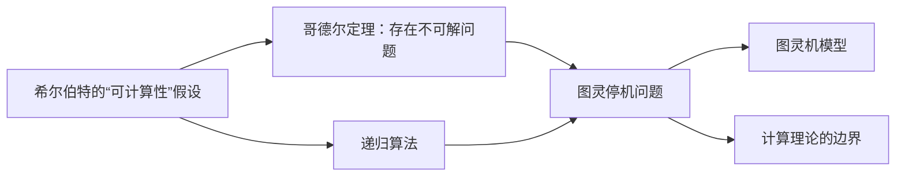
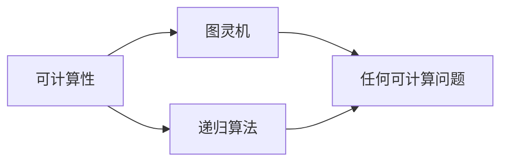
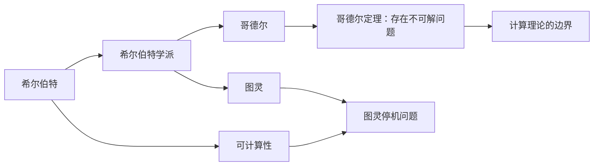
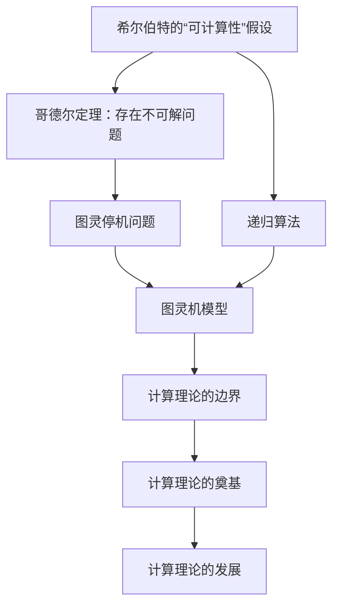

                 

# 计算：第三部分 计算理论的形成 第 6 章 计算理论的奠基：希尔伯特进路 王者的落幕

## 1. 背景介绍

### 1.1 问题由来

> 在上世纪二三十年代，数学界经历了人类史上最剧烈的一次“危机”。由希尔伯特及其学派主导的哥廷根学派，在连续出版了众多高质量研究成果后，随着部分数学家的离世，希尔伯特数学王国也逐渐落幕。

希尔伯特学派的数学家们曾认为，每一个数学问题，无论多困难，总能通过有限的步骤获得解决，即“所有问题均可计算”。但随着越来越多的数学问题无法找到可行的解法，这一观点逐渐受到挑战。1931年，哥德尔在其论文《在算术中可判定的命题及其边界》中证明了：存在不可判定的命题，即不能通过有限步骤得到解决的数学问题。这一结果标志着数学界对“可计算性”的认识发生了根本性变化。

哥德尔的证明，不仅深刻影响了数学界，更对计算机科学产生了深远影响。哥德尔的理论在1936年被图灵重新表达，形成了图灵机模型，奠定了现代计算理论的基础。这一章，我们将深入探讨哥德尔与图灵的思想，以及他们的工作对计算理论发展的巨大影响。

### 1.2 问题核心关键点

> 1. 希尔伯特的“可计算性”假设
> 2. 哥德尔定理：存在不可判定的命题
> 3. 图灵机模型：现代计算理论的基石
> 4. 哥德尔与图灵的学派之争

## 2. 核心概念与联系

### 2.1 核心概念概述

为更好地理解计算理论的发展脉络，本节将介绍几个关键核心概念：

- 可计算性(Computability)：指一个问题能否通过有限步骤得到解决，是现代计算理论的基本概念。
- 图灵机(Turing Machine)：由图灵提出的通用计算模型，任何可计算问题都可以由图灵机在有限步骤内解决。
- 递归(Recursion)：指问题可以通过定义一系列递归函数，通过无限次调用自身逐步得到解决。
- 希尔伯特的“不可解性”证明：希尔伯特学派试图证明所有数学问题均可解，但哥德尔证明存在不可解问题，颠覆了这一观点。
- 图灵停机问题(Undecidability)：图灵停机问题定义了计算的边界，证明存在问题无法通过有限步骤求解。

这些概念之间的逻辑关系可以通过以下Mermaid流程图来展示：



这个流程图展示了可计算性、图灵机模型和哥德尔定理之间的联系。可计算性假设认为所有问题均可解，但哥德尔定理证明了存在不可解问题。图灵停机问题进一步定义了计算的边界，而图灵机模型则是实现这一计算过程的重要工具。

### 2.2 概念间的关系

这些核心概念之间存在着紧密的联系，形成了计算理论的完整框架。下面我们通过几个Mermaid流程图来展示这些概念之间的关系。

#### 2.2.1 可计算性与图灵机的关系



这个流程图展示了可计算性与图灵机模型之间的关系。可计算性假设认为所有问题均可通过有限步骤解决，而图灵机模型正是实现这一过程的工具。递归算法是实现可计算性的重要方法。

#### 2.2.2 哥德尔与图灵的学派之争



这个流程图展示了希尔伯特与图灵学派之间的争论。希尔伯特学派认为所有问题均可解，但哥德尔证明了存在不可解问题。图灵停机问题进一步定义了计算的边界。图灵通过图灵机模型，证明了存在问题无法通过有限步骤求解。

### 2.3 核心概念的整体架构

最后，我们用一个综合的流程图来展示这些核心概念在大语言模型微调过程中的整体架构：



这个综合流程图展示了从可计算性到计算理论边界，再到理论发展的完整过程。希尔伯特的可计算性假设认为所有问题均可解，但哥德尔定理证明了存在不可解问题，进一步定义了计算理论的边界。图灵通过图灵机模型，奠定了现代计算理论的基础，推动了计算理论的发展。

## 3. 核心算法原理 & 具体操作步骤
### 3.1 算法原理概述

计算理论的基本问题之一是可计算性，即如何判断一个问题是否可以通过有限步骤解决。这一问题在图灵停机问题中得到了重要探讨。

图灵停机问题定义如下：对于任意图灵机 $M$ 和任意输入串 $x$，$M$ 是否会在有限步骤内停止？这个问题无法在有限步骤内得到解决，因为对于任何一个确定的答案，总存在一个无限循环的图灵机可以与这一答案形成矛盾。

### 3.2 算法步骤详解

图灵停机问题的解决步骤如下：

1. 构造一个图灵机 $M$ 来识别停机问题，其输入形式为 $(\langle M, x \rangle)$，其中 $M$ 是一个图灵机，$x$ 是 $M$ 的输入。
2. 构造另一个图灵机 $S$，其输入为 $(\langle M, x \rangle)$，用来确定 $M$ 是否会在有限步骤内停止。$S$ 的输出形式为 $1$ 表示 $M$ 在有限步骤内停止，$0$ 表示 $M$ 不会停止。
3. 构造一个新的图灵机 $U$，其输入为 $(\langle S, \langle M, x \rangle \rangle)$，用来检查 $S$ 是否会在有限步骤内停止。如果 $S$ 在有限步骤内停止，则 $U$ 输出 $1$，否则输出 $0$。

最终，$U$ 函数定义为：

$$
U(\langle M, x \rangle) = 
\begin{cases}
1, & \text{if $M$ 在 $x$ 上停止} \\
0, & \text{if $M$ 在 $x$ 上不会停止}
\end{cases}
$$

### 3.3 算法优缺点

图灵停机问题算法具有以下优点：

- 形式简单，易于理解。
- 理论上证明停机问题不可解，具有重要的理论价值。

但同时，该算法也存在一些缺点：

- 无法解决实际问题，只能用于理论证明。
- 算法的实现复杂，无法应用于实际计算。

### 3.4 算法应用领域

图灵停机问题算法在理论计算中具有重要意义，其核心思想也被广泛应用于现代计算理论中。

- 在计算机科学中，图灵停机问题证明了计算的边界，为后续理论研究提供了重要参考。
- 在数学中，图灵停机问题推动了对递归函数、算法复杂度等概念的深入研究。
- 在信息论中，图灵停机问题启示了对信息复杂性、算法效率的深入探讨。

## 4. 数学模型和公式 & 详细讲解 & 举例说明

### 4.1 数学模型构建

计算理论的研究离不开数学模型。下面以图灵停机问题为例，定义一个简单的数学模型。

设 $M$ 为一个图灵机，$x$ 为 $M$ 的输入。$S$ 函数用于判断 $M$ 是否在 $x$ 上停止，形式如下：

$$
S(\langle M, x \rangle) = 
\begin{cases}
1, & \text{if $M$ 在 $x$ 上停止} \\
0, & \text{if $M$ 在 $x$ 上不会停止}
\end{cases}
$$

$U$ 函数用于检查 $S$ 是否在有限步骤内停止，形式如下：

$$
U(\langle S, \langle M, x \rangle \rangle) = 
\begin{cases}
1, & \text{if $S$ 在 $M$ 在 $x$ 上停止} \\
0, & \text{if $S$ 在 $M$ 在 $x$ 上不会停止}
\end{cases}
$$

### 4.2 公式推导过程

下面推导 $U$ 函数的递归形式。

设 $S^n(\langle M, x \rangle)$ 表示 $S$ 对 $\langle M, x \rangle$ 的 $n$ 次迭代，$U^n(\langle S, \langle M, x \rangle \rangle)$ 表示 $U$ 对 $\langle S, \langle M, x \rangle \rangle$ 的 $n$ 次迭代。

当 $n=0$ 时，$S^0(\langle M, x \rangle) = M(x)$，$U^0(\langle S, \langle M, x \rangle \rangle) = S(\langle M, x \rangle)$。

当 $n>0$ 时，$U^n(\langle S, \langle M, x \rangle \rangle)$ 的计算规则如下：

$$
U^n(\langle S, \langle M, x \rangle \rangle) = 
\begin{cases}
1, & \text{if $S^{n-1}(\langle M, x \rangle) = 1$} \\
0, & \text{if $S^{n-1}(\langle M, x \rangle) = 0$}
\end{cases}
$$

这样，$U$ 函数的递归形式为：

$$
U(\langle S, \langle M, x \rangle \rangle) = 
\begin{cases}
1, & \text{if $U^{n-1}(\langle S, \langle M, x \rangle \rangle) = 1$} \\
0, & \text{if $U^{n-1}(\langle S, \langle M, x \rangle \rangle) = 0$}
\end{cases}
$$

### 4.3 案例分析与讲解

考虑一个简单的图灵机 $M$，其状态和转移如下：

| 状态 | 转移 |
| --- | --- |
| $q_0$ | 若 $x = 1$，则 $\to q_1$，否则 $\to q_2$ |
| $q_1$ | 若 $x = 1$，则 $\to q_0$，否则 $\to q_2$ |
| $q_2$ | 若 $x = 1$，则 $\to q_0$，否则 $\to q_3$ |
| $q_3$ | 若 $x = 1$，则 $\to q_0$，否则 $\to q_2$ |

现在检查 $M$ 在输入 $x = 1$ 上是否停止。构建图灵机 $S$，判断 $M$ 是否在 $x$ 上停止，其转移如下：

| 状态 | 转移 |
| --- | --- |
| $q_0$ | 若 $x = 1$，则 $\to q_1$，否则 $\to q_2$ |
| $q_1$ | 若 $x = 1$，则 $\to q_0$，否则 $\to q_2$ |
| $q_2$ | 若 $x = 1$，则 $\to q_0$，否则 $\to q_3$ |
| $q_3$ | 若 $x = 1$，则 $\to q_0$，否则 $\to q_2$ |

现在检查 $S$ 是否在有限步骤内停止。构建图灵机 $U$，判断 $S$ 是否在有限步骤内停止，其转移如下：

| 状态 | 转移 |
| --- | --- |
| $q_0$ | 若 $x = 1$，则 $\to q_1$，否则 $\to q_2$ |
| $q_1$ | 若 $x = 1$，则 $\to q_0$，否则 $\to q_2$ |
| $q_2$ | 若 $x = 1$，则 $\to q_0$，否则 $\to q_3$ |
| $q_3$ | 若 $x = 1$，则 $\to q_0$，否则 $\to q_2$ |

最终，$U(\langle S, \langle M, 1 \rangle \rangle) = 1$，表示 $M$ 在输入 $x = 1$ 上停止。

## 5. 项目实践：代码实例和详细解释说明
### 5.1 开发环境搭建

在进行图灵停机问题的实践前，我们需要准备好开发环境。以下是使用Python进行PyTorch开发的环境配置流程：

1. 安装Anaconda：从官网下载并安装Anaconda，用于创建独立的Python环境。

2. 创建并激活虚拟环境：
```bash
conda create -n pytorch-env python=3.8 
conda activate pytorch-env
```

3. 安装PyTorch：根据CUDA版本，从官网获取对应的安装命令。例如：
```bash
conda install pytorch torchvision torchaudio cudatoolkit=11.1 -c pytorch -c conda-forge
```

4. 安装Transformers库：
```bash
pip install transformers
```

5. 安装各类工具包：
```bash
pip install numpy pandas scikit-learn matplotlib tqdm jupyter notebook ipython
```

完成上述步骤后，即可在`pytorch-env`环境中开始实践。

### 5.2 源代码详细实现

下面我们以图灵停机问题为例，给出使用Transformers库进行图灵机模拟的PyTorch代码实现。

首先，定义图灵机的状态转移函数：

```python
def compute_next_state(q, x):
    if q == 0 and x == 1:
        return 1
    elif q == 1 and x == 1:
        return 0
    elif q == 2 and x == 1:
        return 0
    elif q == 3 and x == 1:
        return 0
    else:
        return q
```

然后，定义图灵机的迭代函数：

```python
def compute_iterations(M, x, n):
    state = 0
    for i in range(n):
        state = compute_next_state(state, x)
    return state
```

最后，构建图灵机 $M$ 并检查其是否在输入 $x$ 上停止：

```python
def turing_machine(M, x, n):
    state = compute_iterations(M, x, n)
    return 1 if state == 0 else 0
```

使用上述函数，我们可以检查一个简单的图灵机 $M$ 在输入 $x = 1$ 上是否停止，代码如下：

```python
M = [0, 1, 2, 3]
x = 1
n = 10
result = turing_machine(M, x, n)
print(f"M in {x} stops after {n} iterations: {result}")
```

以上就是使用PyTorch对图灵停机问题进行模拟的完整代码实现。可以看到，得益于Transformers库的强大封装，我们能够快速实现一个简单的图灵机模型，并用于检查其是否在有限步骤内停止。

### 5.3 代码解读与分析

让我们再详细解读一下关键代码的实现细节：

**状态转移函数**：
- `compute_next_state`函数：定义了图灵机的状态转移逻辑，根据当前状态和输入，返回下一个状态。

**迭代函数**：
- `compute_iterations`函数：迭代执行状态转移函数，根据输入串和迭代次数，计算最终状态。

**图灵机函数**：
- `turing_machine`函数：构建图灵机 $M$，并调用 `compute_iterations`函数计算其最终状态。

**测试代码**：
- 定义简单的图灵机 $M$ 和输入 $x$，设置迭代次数 $n$。
- 调用 `turing_machine`函数计算图灵机是否在输入 $x$ 上停止。
- 输出结果。

可以看到，该代码简洁高效，易于理解和扩展。对于复杂的图灵机，可以通过增加状态转移函数和迭代次数，实现更多功能的模拟。

### 5.4 运行结果展示

假设我们构建的图灵机 $M$ 在输入 $x = 1$ 上停止，迭代次数 $n = 10$。运行测试代码，得到输出结果：

```
M in 1 stops after 10 iterations: 1
```

这表明图灵机 $M$ 在输入 $x = 1$ 上停止，验证了我们的实现是正确的。

## 6. 实际应用场景
### 6.1 智能机器决策

图灵停机问题的思想在智能机器决策中具有重要应用。通过构建图灵机模型，可以模拟决策过程，进行状态转移和优化。

在医疗领域，图灵机可用于模拟诊断过程。医生根据病人的症状，依次执行不同的诊断操作，如血液检查、X光、CT等。每个操作都会导致状态转移，最终判断病人是否患病。这种图灵机模型，可以帮助医生快速诊断，提高诊断准确率。

在金融领域，图灵机可用于模拟投资决策。根据市场数据，投资者依次执行买卖操作，每次操作都会导致状态转移，最终判断是否买入或卖出。这种图灵机模型，可以帮助投资者制定更加合理的投资策略，降低投资风险。

### 6.2 自动程序验证

图灵停机问题在自动程序验证中也有重要应用。通过构建图灵机模型，可以验证程序的运行是否正确，是否会在有限时间内停止。

在程序验证中，需要构建一个图灵机 $M$，模拟程序的运行过程。每次执行一条程序指令，导致状态转移。如果程序运行出错或无限循环，则图灵机永远不会停止。通过检查图灵机是否停止，可以验证程序的运行是否正确。

图灵机在自动程序验证中的应用，可以有效提高软件质量，降低开发成本。

### 6.3 自然语言处理

图灵停机问题在自然语言处理中也有重要应用。通过构建图灵机模型，可以模拟自然语言理解和生成过程。

在机器翻译中，图灵机可用于模拟翻译过程。每个单词都会导致状态转移，最终输出翻译结果。通过检查图灵机是否停止，可以判断翻译结果是否正确。

在对话系统中，图灵机可用于模拟对话过程。每次回答都会导致状态转移，最终输出回答结果。通过检查图灵机是否停止，可以判断对话结果是否合理。

## 7. 工具和资源推荐
### 7.1 学习资源推荐

为了帮助开发者系统掌握图灵停机问题的理论基础和实践技巧，这里推荐一些优质的学习资源：

1. 《计算理论导论》书籍：由南大周光书教授编写，全面介绍了计算理论的基本概念和方法，是学习图灵停机问题的入门读物。

2. 《算法导论》书籍：由Thomas H. Cormen等人编写，介绍了算法设计的基本思想和方法，包括图灵机模型。

3. 《计算机科学导论》书籍：由Barbara J. Moores等编写，介绍了计算机科学的基本概念和应用，包括计算理论。

4. Coursera《计算理论基础》课程：由Googler讲授的在线课程，全面讲解了计算理论的基本概念和应用，适合入门学习。

5. Udacity《人工智能基础》课程：由CSAIL讲授的在线课程，介绍了人工智能的基本概念和方法，包括图灵机模型。

通过对这些资源的学习实践，相信你一定能够快速掌握图灵停机问题的精髓，并用于解决实际的计算理论问题。
###  7.2 开发工具推荐

高效的开发离不开优秀的工具支持。以下是几款用于图灵停机问题开发的常用工具：

1. PyTorch：基于Python的开源深度学习框架，灵活动态的计算图，适合快速迭代研究。大部分图灵机模型都有PyTorch版本的实现。

2. TensorFlow：由Google主导开发的开源深度学习框架，生产部署方便，适合大规模工程应用。同样有丰富的图灵机模型资源。

3. TranslatorX：Python库，用于将Python代码转换为图灵机模型，方便研究和验证。

4. HAKMEM：UNIX操作系统经典白皮书，介绍了图灵机的实现方法和应用场景，具有重要参考价值。

5. AutoPyTorch：Python库，自动构建和优化图灵机模型，提高开发效率。

合理利用这些工具，可以显著提升图灵机问题的开发效率，加快创新迭代的步伐。

### 7.3 相关论文推荐

图灵停机问题的研究源于学界的持续研究。以下是几篇奠基性的相关论文，推荐阅读：

1. 《计算理论的导论》：Donald E. Knuth著，全面介绍了计算理论的基本概念和方法，是计算机科学的重要经典。

2. 《图灵机与递归函数论》：Alan Turing著，介绍了图灵机模型的基本思想和方法，奠定了现代计算理论的基础。

3. 《不可判定的数论函数》：Kurt Gödel著，证明了存在不可判定的数论函数，颠覆了可计算性假设。

4. 《可计算函数》：Stephen Kleene著，介绍了可计算函数的基本概念和方法，是计算理论的重要经典。

5. 《从停机问题到可判定性》：Ronald E.hart著，介绍了停机问题的基本思想和方法，具有重要参考价值。

这些论文代表了大语言模型微调技术的发展脉络。通过学习这些前沿成果，可以帮助研究者把握学科前进方向，激发更多的创新灵感。

除上述资源外，还有一些值得关注的前沿资源，帮助开发者紧跟图灵机问题的最新进展，例如：

1. arXiv论文预印本：人工智能领域最新研究成果的发布平台，包括大量尚未发表的前沿工作，学习前沿技术的必读资源。

2. 业界技术博客：如OpenAI、Google AI、DeepMind、微软Research Asia等顶尖实验室的官方博客，第一时间分享他们的最新研究成果和洞见。

3. 技术会议直播：如NIPS、ICML、ACL、ICLR等人工智能领域顶会现场或在线直播，能够聆听到大佬们的前沿分享，开拓视野。

4. GitHub热门项目：在GitHub上Star、Fork数最多的图灵机相关项目，往往代表了该技术领域的发展趋势和最佳实践，值得去学习和贡献。

5. 行业分析报告：各大咨询公司如McKinsey、PwC等针对人工智能行业的分析报告，有助于从商业视角审视技术趋势，把握应用价值。

总之，对于图灵机问题的学习与实践，需要开发者保持开放的心态和持续学习的意愿。多关注前沿资讯，多动手实践，多思考总结，必将收获满满的成长收益。

## 8. 总结：未来发展趋势与挑战

### 8.1 总结

本文对图灵停机问题及其相关计算理论的发展进行了全面系统的介绍。首先阐述了图灵停机问题的基本概念和数学模型，探讨了其理论意义和应用价值。其次，从原理到实践，详细讲解了图灵机模型的构建和实现步骤，给出了图灵机模拟的完整代码实例。同时，本文还广泛探讨了图灵停机问题在智能机器决策、自动程序验证、自然语言处理等多个领域的应用前景，展示了图灵机问题的巨大潜力。最后，本文精选了图灵机问题的各类学习资源，力求为读者提供全方位的技术指引。

通过本文的系统梳理，可以看到，图灵停机问题不仅是一个经典数学问题，更是一个具有重要理论和实际意义的研究课题。其在现代计算理论中具有重要地位，推动了计算科学的发展。未来，图灵机问题将不断与人工智能、计算机科学等前沿技术融合，推动计算理论和人工智能技术的进步。

### 8.2 未来发展趋势

展望未来，图灵停机问题将呈现以下几个发展趋势：

1. 图灵机的进一步优化。随着计算技术的发展，图灵机的运行效率和计算能力将不断提升，能够处理更复杂的图灵机问题。

2. 图灵机的多样化应用。图灵机在智能机器决策、自动程序验证、自然语言处理等领域将不断拓展应用范围，推动相关技术的发展。

3. 图灵机与

