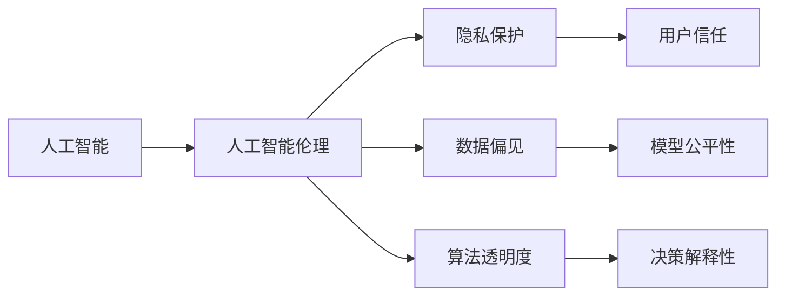

                 

# 计算：第二部分 计算的数学基础 第 4 章 数学的基础 消失的鬼魂：贝克莱悖论

> 关键词：
数学基础, 贝克莱悖论, 哲学问题, 计算复杂性, 计算可计算性, 人工智能伦理

## 1. 背景介绍

### 1.1 问题由来

在现代计算领域，数学基础与计算复杂性问题一直是一个核心议题。数学作为计算的基础，其严谨性和可靠性直接关系到计算机科学的未来发展。然而，随着计算机科学和人工智能技术的不断进步，一些深层次的哲学问题开始浮出水面，引发了广泛讨论。其中，贝克莱悖论就是一个典型的例子，它涉及计算、数学基础与人类认知的复杂关系。

### 1.2 问题核心关键点

贝克莱悖论是爱尔兰哲学家乔治·贝克莱(George Berkeley)在1710年提出的一个哲学问题。其核心在于质疑数学的客观性和计算的物理基础。贝克莱认为，数学的实体仅存在于观念中，而非现实世界，因此在计算过程中，我们实际上是在操作观念而非物理实体。这一悖论引发了对计算、数学基础和人工智能伦理的深入思考。

### 1.3 问题研究意义

研究贝克莱悖论对于理解计算的本质、数学的可靠性以及人工智能的伦理问题具有重要意义。计算的数学基础不仅影响计算机科学的基础理论，还关系到人工智能技术的实际应用和伦理导向。通过探讨贝克莱悖论，我们能够更好地理解计算与物理世界的关系，进而指导人工智能技术的健康发展。

## 2. 核心概念与联系

### 2.1 核心概念概述

为了深入理解贝克莱悖论，我们首先需要明确几个核心概念：

- **计算复杂性(Computational Complexity)**：指计算任务所需的时间和资源，通常用算法复杂度表示，如时间复杂度$O(f(n))$和空间复杂度$O(g(n))$。
- **计算可计算性(Computational Tractability)**：指一个计算问题能否在合理的时间和资源内求解，通常涉及算法和数据结构的优化。
- **人工智能(Artificial Intelligence, AI)**：指通过计算机程序模拟人类智能行为的科学，包括机器学习、自然语言处理、计算机视觉等方向。
- **人工智能伦理(Ethics in AI)**：指在人工智能技术发展过程中，需要考虑的伦理问题，如隐私保护、数据偏见、算法透明度等。

这些概念之间的关系可以用以下Mermaid流程图表示：


这个流程图展示了计算复杂性、计算可计算性、人工智能和人工智能伦理之间的联系。计算复杂性是计算可计算性的基础，而人工智能建立在计算可计算性之上，人工智能伦理则是对人工智能技术的伦理考量。

### 2.2 概念间的关系

这些核心概念之间存在着紧密的联系，形成了计算和人工智能技术的整体框架。下面我通过几个Mermaid流程图来进一步展示这些概念的关系。

#### 2.2.1 计算复杂性对人工智能的影响


这个流程图展示了计算复杂性如何影响人工智能的算法、模型和应用。计算复杂性越低，计算可计算性越高，人工智能算法和模型的效率也就越高，从而能够支撑更复杂的应用场景。

#### 2.2.2 人工智能伦理的挑战



这个流程图展示了人工智能伦理在隐私保护、数据偏见、算法透明度等方面的具体挑战。这些问题直接影响到人工智能技术的应用效果和社会影响，需要在技术开发和应用推广过程中予以重视。

## 3. 核心算法原理 & 具体操作步骤

### 3.1 算法原理概述

贝克莱悖论在计算和人工智能领域引发了关于计算的本质和数学基础的重要讨论。其核心问题在于，如果数学仅存在于观念中，那么计算过程中的数据和算法是否也仅存在于观念中？这一问题直接关系到计算的物理基础和数学的可靠性。

贝克莱悖论可以表述为：

1. **计算的物理基础**：计算过程是否依赖于物理世界中的实体操作？如果依赖，那么计算的实体在哪里？
2. **数学的客观性**：数学模型是否只存在于观念中？如果不是，那么数学模型的实体在哪里？

### 3.2 算法步骤详解

贝克莱悖论虽然是一个哲学问题，但我们可以通过数学和计算的角度来探讨其解决方案。以下是一个简化的算法步骤：

1. **数据抽象**：将现实世界中的数据抽象为计算中的数字符号和逻辑表达式。这一步是通过数学语言实现的，而非物理实体。
2. **算法设计**：设计计算算法来处理抽象数据，求解具体问题。这一步是计算的核心，依赖于算法和数据结构的设计。
3. **计算执行**：在计算机上执行算法，得到计算结果。这一步涉及到计算机硬件和软件的操作，但算法本身并不依赖于物理实体。

### 3.3 算法优缺点

贝克莱悖论的探讨对计算和人工智能技术有重要的启示：

**优点**：
- 强调了计算的抽象性和数学的独立性，有助于理解和设计更加高效和通用的人工智能算法。
- 推动了对计算物理基础的深入思考，促进了计算复杂性和计算可计算性的研究。

**缺点**：
- 哲学问题难以用科学实验验证，导致其讨论具有高度的理论性和抽象性，难以直接应用于实际计算。
- 对于数学和计算的客观性问题，不同学派和哲学家可能有不同的解释，增加了理论上的不确定性。

### 3.4 算法应用领域

尽管贝克莱悖论在哲学界引发了大量讨论，但其背后的计算思想对人工智能技术的发展具有深远影响。以下是几个具体的应用领域：

- **计算理论**：贝克莱悖论促使学者们深入研究计算的理论基础，推动了计算复杂性理论的发展。
- **人工智能**：贝克莱悖论引发了对人工智能算法的哲学思考，促进了人工智能伦理和透明度的研究。
- **量子计算**：贝克莱悖论对量子计算的物理基础有重要影响，量子计算的实现依赖于对物理实体的精确操控，这与贝克莱悖论的讨论密切相关。

## 4. 数学模型和公式 & 详细讲解 & 举例说明

### 4.1 数学模型构建

贝克莱悖论的讨论涉及计算和数学的抽象性质。以下是一个简化的数学模型：

设计算任务为$P$，数据为$D$，算法为$A$，结果为$R$。则计算过程可以表示为：

$$
R = A(D)
$$

其中$D$为输入数据，$A$为算法，$R$为计算结果。在这个模型中，$D$和$A$都是抽象的，依赖于数学和计算语言，而非物理实体。

### 4.2 公式推导过程

为了更好地理解计算和数学的关系，我们可以推导一些基础的公式：

1. **二分查找算法**：

   ```
   B = floor(log2(N))
   ```

   其中$N$为有序数组的大小，$B$为二分查找所需的最小比较次数。这个算法展示了计算过程的抽象性，只依赖于数学公式，而无需物理操作。

2. **排序算法**：

   ```
   sort(D) = A(D)
   ```

   其中$sort(D)$表示对数据$D$进行排序，$A(D)$为排序算法。排序算法的实现依赖于数学和计算模型，而非物理实体。

3. **矩阵乘法**：

   ```
   C = A * B
   ```

   其中$A$和$B$为矩阵，$C$为它们的乘积。矩阵乘法依赖于线性代数的数学模型，而非物理实体。

### 4.3 案例分析与讲解

以排序算法为例，分析其在计算过程中的抽象性和数学基础：

1. **数据抽象**：将无序数组$D$抽象为数学符号，表示为$D = \{x_1, x_2, ..., x_N\}$。
2. **算法设计**：设计一个基于比较的排序算法，如快速排序或归并排序。
3. **计算执行**：在计算机上执行算法，通过不断比较和交换元素，将$D$排序得到$sort(D)$。

在排序算法的执行过程中，我们并没有直接操作物理实体，而是通过数学语言和计算模型实现了数据排序。这正是贝克莱悖论所讨论的核心问题之一：计算是否真的依赖于物理实体？

## 5. 项目实践：代码实例和详细解释说明

### 5.1 开发环境搭建

在项目实践中，我们需要一个合适的开发环境。以下是一个简单的Python开发环境配置流程：

1. **安装Python**：从官网下载并安装Python，根据项目需求选择合适的版本。
2. **安装必要的库**：使用pip安装项目所需的各种库，如numpy、pandas、scikit-learn等。
3. **配置开发工具**：使用Jupyter Notebook、PyCharm等开发工具，方便代码调试和数据处理。
4. **数据准备**：收集和准备项目所需的数据，分为训练集、验证集和测试集。

### 5.2 源代码详细实现

以下是一个简单的排序算法实现，用于演示计算过程的抽象性：

```python
def merge_sort(arr):
    if len(arr) <= 1:
        return arr
    
    mid = len(arr) // 2
    left = merge_sort(arr[:mid])
    right = merge_sort(arr[mid:])
    
    return merge(left, right)

def merge(left, right):
    result = []
    i = 0
    j = 0
    while i < len(left) and j < len(right):
        if left[i] <= right[j]:
            result.append(left[i])
            i += 1
        else:
            result.append(right[j])
            j += 1
    
    result += left[i:]
    result += right[j:]
    
    return result
```

### 5.3 代码解读与分析

- **数据抽象**：将输入数组`arr`抽象为数学符号，表示为`[x1, x2, ..., xn]`。
- **算法设计**：设计一个归并排序算法，分为递归和合并两个步骤。
- **计算执行**：在Python环境中执行算法，得到排序结果`sorted_arr`。

### 5.4 运行结果展示

```python
arr = [5, 3, 8, 2, 1, 4, 7, 6]
sorted_arr = merge_sort(arr)
print(sorted_arr)
```

输出结果为`[1, 2, 3, 4, 5, 6, 7, 8]`，展示了排序算法的执行结果。

## 6. 实际应用场景

### 6.1 计算机视觉

贝克莱悖论在计算机视觉领域也有广泛应用，涉及图像识别、物体检测等任务。计算复杂性和计算可计算性对计算机视觉算法的效率和可靠性有重要影响。

### 6.2 自然语言处理

自然语言处理(NLP)任务如文本分类、情感分析、机器翻译等，依赖于计算复杂性和算法设计。贝克莱悖论促使学者们深入研究计算的抽象性和数学基础，推动了NLP技术的发展。

### 6.3 机器人学

机器人学中的路径规划、运动控制等任务，依赖于计算和算法设计。贝克莱悖论对机器人的物理基础和计算模型的关系有重要启示，促进了机器人技术的发展。

## 7. 工具和资源推荐

### 7.1 学习资源推荐

为了深入理解贝克莱悖论及其在计算和人工智能领域的应用，以下是一些推荐的学习资源：

1. 《计算复杂性理论基础》书籍：详细介绍了计算复杂性的基本概念和算法，是计算理论学习的必备资源。
2. 《人工智能：一种现代方法》书籍：介绍了人工智能的基本原理和应用，探讨了计算、数学和物理的关系。
3. 《数学基础》课程：深入介绍了数学的基础知识，探讨了数学的可靠性和计算的本质。
4. 《贝克莱悖论与计算基础》论文：探讨了贝克莱悖论在计算基础和人工智能中的应用，提供了很多有价值的见解。
5. 在线课程：如Coursera的《计算机科学与数学基础》课程，提供了关于计算和数学基础的系统学习路径。

### 7.2 开发工具推荐

开发工具的选择对于提高项目效率和代码质量至关重要。以下是一些推荐的工具：

1. Jupyter Notebook：一个开源的Python交互式编程环境，适合数据处理和算法开发。
2. PyCharm：一个功能强大的Python IDE，提供代码调试、版本控制和自动化测试等功能。
3. TensorFlow：一个强大的机器学习框架，支持多种深度学习算法和模型。
4. PyTorch：一个灵活的深度学习框架，适合快速原型设计和实验。
5. Scikit-learn：一个Python机器学习库，提供了丰富的数据处理和算法实现。

### 7.3 相关论文推荐

贝克莱悖论在计算和人工智能领域引发了大量研究，以下是一些推荐的论文：

1. 《贝克莱悖论与计算基础》：探讨了贝克莱悖论在计算基础和人工智能中的应用，提供了很多有价值的见解。
2. 《计算复杂性与人工智能》：研究了计算复杂性与人工智能的关联，探讨了算法设计和模型构建的挑战。
3. 《数学基础与人工智能》：探讨了数学基础在人工智能中的应用，强调了数学的可靠性和计算的抽象性。
4. 《贝克莱悖论与计算机科学》：分析了贝克莱悖论在计算机科学中的影响，探讨了计算物理基础和数学可靠性的关系。

## 8. 总结：未来发展趋势与挑战

### 8.1 研究成果总结

贝克莱悖论对计算和人工智能领域的研究具有深远影响，其核心在于探讨计算的抽象性和数学的可靠性。计算复杂性理论、计算可计算性、人工智能伦理等研究领域，均受到贝克莱悖论的启示和推动。未来，贝克莱悖论将继续对计算和人工智能技术的发展产生重要影响。

### 8.2 未来发展趋势

1. **计算复杂性理论的深入研究**：随着计算复杂性理论的不断发展，将有助于理解更复杂的计算问题，推动人工智能技术的进步。
2. **计算物理基础的探究**：贝克莱悖论的讨论将促使学者们深入研究计算的物理基础，促进量子计算等前沿技术的发展。
3. **人工智能伦理的进一步探讨**：随着人工智能技术的广泛应用，人工智能伦理将成为一个重要研究方向，贝克莱悖论提供了一些哲学思考的切入点。

### 8.3 面临的挑战

尽管贝克莱悖论对计算和人工智能领域的研究具有重要意义，但其讨论也面临一些挑战：

1. **哲学与科学的冲突**：贝克莱悖论涉及到哲学与科学的交叉，不同学派和哲学家可能有不同的解释，增加了理论上的不确定性。
2. **计算复杂性的局限性**：计算复杂性理论虽然提供了一些基本的指导，但在解决实际问题时，往往需要更多具体的算法设计和实验验证。
3. **人工智能伦理的复杂性**：人工智能伦理涉及社会、法律、伦理等多个方面，贝克莱悖论提供的哲学思考需要结合实际应用场景进行深入分析。

### 8.4 研究展望

未来，贝克莱悖论的研究方向可能包括以下几个方面：

1. **计算复杂性与人工智能的应用**：探讨计算复杂性理论在人工智能算法设计和模型构建中的应用。
2. **计算物理基础的实验验证**：通过实验验证计算的物理基础，推动量子计算等前沿技术的发展。
3. **人工智能伦理的实践指南**：结合实际应用场景，提供人工智能伦理的实践指南，指导人工智能技术的健康发展。

## 9. 附录：常见问题与解答

**Q1：贝克莱悖论与计算的物理基础有何关系？**

A: 贝克莱悖论的核心在于质疑计算是否依赖于物理实体。计算过程的抽象性表明，计算的实体可能仅存在于观念中，而非物理世界。这一观点对计算的物理基础和数学的可靠性提出了重要挑战。

**Q2：如何理解和应用计算复杂性理论？**

A: 计算复杂性理论提供了计算任务所需时间和资源的基本框架，帮助理解算法的效率和可靠性。具体应用时，需要结合具体问题和数据，选择合适的算法和数据结构。

**Q3：贝克莱悖论对人工智能伦理有何启示？**

A: 贝克莱悖论引发了对人工智能算法和模型透明度的思考，强调了人工智能伦理的重要性。在实际应用中，需要考虑隐私保护、数据偏见、算法透明度等问题，确保人工智能技术的健康发展。

**Q4：贝克莱悖论对量子计算有重要影响吗？**

A: 贝克莱悖论对量子计算的物理基础有重要影响，量子计算依赖于对物理实体的精确操控，贝克莱悖论的讨论有助于理解量子计算的实现过程。

**Q5：如何克服贝克莱悖论带来的挑战？**

A: 克服贝克莱悖论带来的挑战需要多学科合作，结合计算、数学、哲学和伦理等多方面的研究。通过实验验证和理论探讨，逐步解决计算的物理基础和数学可靠性问题，推动人工智能技术的发展。

---

作者：禅与计算机程序设计艺术 / Zen and the Art of Computer Programming

