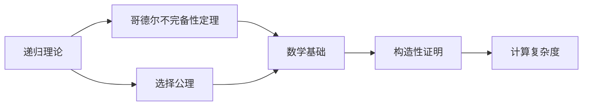

                 

# 计算：第二部分 计算的数学基础 第 5 章 第三次数学危机 选择公理

> 关键词：计算理论,数学危机,选择公理,公理系统,哥德尔不完备性定理,数学基础

## 1. 背景介绍

### 1.1 问题由来

在计算机科学和数学领域，选择公理（Axiom of Choice）一直是争议和讨论的热点。它起源于数学的公理化基础，并在计算机科学中引发了多次危机。本文将深入探讨选择公理的基本概念、其起源，以及它在计算理论中的重要性和影响。

### 1.2 问题核心关键点

选择公理是数学中非常重要的一个公理，它表述了从任意非空集合中选取至少一个元素的性质。在计算机科学中，选择公理被广泛应用于递归理论、构造性证明等领域。

本文将详细讨论选择公理的起源、基本概念，并探讨其在计算理论中的应用，包括递归理论的完备性和哥德尔不完备性定理等内容。

### 1.3 问题研究意义

研究选择公理对于理解计算理论的基础有着重要意义，它帮助我们认识到递归理论的局限性，并推动了计算机科学和数学领域的发展。选择公理的探讨促进了对计算与数学基础关系的深入理解，同时也启发了计算机科学中的许多重要理论和技术。

## 2. 核心概念与联系

### 2.1 核心概念概述

为更好地理解选择公理及其在计算理论中的应用，本节将介绍几个关键概念：

- **递归理论（Recursive Theory）**：通过递归定义来描述函数的理论体系。递归理论在计算机科学中有广泛应用，包括算法设计、计算复杂度分析等。
- **哥德尔不完备性定理（Gödel's Incompleteness Theorem）**：指出在任何形式化的数学系统中，存在不可证明的命题。这对于数学基础和计算理论有着深远影响。
- **选择公理（Axiom of Choice）**：表述从任意非空集合中选取至少一个元素的性质，是现代数学公理化体系中的一个重要公理。
- **Zermelo-Fraenkel集合论（Zermelo-Fraenkel Set Theory, ZFC）**：现代数学中最常用的公理化集合论体系，选择公理是其核心公理之一。
- **构造性证明（Constructive Proof）**：仅使用直观上可行的步骤进行的证明方法，与非构造性证明相对。

这些概念之间通过递归理论、选择公理和哥德尔不完备性定理等，紧密联系在一起，构成了计算理论的基础框架。

### 2.2 概念间的关系

这些概念之间存在密切的联系，形成了一个关于计算和数学基础研究的整体生态系统。我们可以用以下Mermaid流程图来展示它们之间的关系：



这个流程图展示了递归理论、选择公理、哥德尔不完备性定理与数学基础之间的逻辑关系：

1. 递归理论通过递归定义来描述函数，是计算理论的基础。
2. 选择公理从任意非空集合中选取至少一个元素，是现代数学公理化体系的核心。
3. 哥德尔不完备性定理表明，任何形式化的数学系统中都存在不可证明的命题。
4. 构造性证明是仅使用直观上可行的步骤进行的证明方法，与非构造性证明相对。
5. 数学基础的研究涵盖了递归理论、选择公理和哥德尔不完备性定理等内容。
6. 构造性证明和计算复杂度分析都受到递归理论和选择公理的影响。

通过理解这些概念之间的关系，我们可以更好地把握计算理论和数学基础研究的基本框架。

### 2.3 核心概念的整体架构

最后，我们用一个综合的流程图来展示递归理论、选择公理和哥德尔不完备性定理之间的整体架构：


这个综合流程图展示了递归理论、选择公理和哥德尔不完备性定理之间的整体架构，帮助我们更全面地理解这些概念在计算理论中的地位和作用。

## 3. 核心算法原理 & 具体操作步骤
### 3.1 算法原理概述

选择公理是现代数学公理化体系中的一个核心公理，其基本内容是从任意非空集合中选取至少一个元素。在计算理论中，选择公理被广泛应用于递归理论，尤其是构造性证明中。

选择公理的基本表述如下：

**选择公理（Axiom of Choice）**：
如果存在一个非空集合 $S$，其中每个元素都是非空集合，则存在一个映射 $f: S \rightarrow \bigcup S$，使得对于任意 $s \in S$，$f(s)$ 是 $s$ 中的一个元素。

这一公理表明，对于任意非空集合，我们总能从中选择至少一个元素。选择公理的提出，为现代数学公理化体系奠定了基础，但也引发了关于其合理性和适用性的广泛讨论。

### 3.2 算法步骤详解

选择公理的应用主要在构造性证明中，其基本步骤如下：

1. **定义集合和映射**：首先定义一个非空集合 $S$ 和映射 $f: S \rightarrow \bigcup S$。
2. **选择元素**：对于每个 $s \in S$，在 $s$ 中选择 $f(s)$ 作为 $s$ 的一个元素。
3. **验证映射正确性**：最后验证映射 $f$ 的正确性，确保每个 $s$ 都存在一个 $f(s)$，且 $f(s)$ 是 $s$ 的一个元素。

这一过程在计算理论中具有重要意义，特别是在递归理论中，用于证明各种复杂度问题和构造性算法。

### 3.3 算法优缺点

选择公理在数学和计算机科学中有其独特的优缺点：

**优点**：

- 提供了一个强大的数学工具，用于构造性证明和递归理论。
- 通过选择公理，我们可以在更广泛的意义上讨论集合和函数的性质。

**缺点**：**

- 选择公理的直观性和合理性受到广泛质疑。
- 在某些特定情况下，选择公理可能导致逻辑上的悖论。

### 3.4 算法应用领域

选择公理在计算理论中有着广泛的应用，主要包括以下几个方面：

- **递归理论**：用于证明递归函数的完备性和存在性。
- **构造性证明**：在构造性证明中，选择公理用于构造映射和选择元素。
- **哥德尔不完备性定理**：证明哥德尔不完备性定理时，选择公理的合理性是一个重要讨论点。
- **计算复杂度理论**：在计算复杂度分析中，选择公理用于构造性证明和算法设计。

## 4. 数学模型和公式 & 详细讲解 & 举例说明

### 4.1 数学模型构建

选择公理的数学模型可以通过集合论和递归理论来构建。以下是一个简单的数学模型：

- **集合 $S$**：定义一个非空集合 $S$。
- **映射 $f: S \rightarrow \bigcup S$**：定义一个映射 $f: S \rightarrow \bigcup S$，使得对于任意 $s \in S$，$f(s)$ 是 $s$ 中的一个元素。

### 4.2 公式推导过程

选择公理的数学表达可以写为一个公式：

$$
\forall S \neq \emptyset, \exists f: S \rightarrow \bigcup S \text{ 使得 } \forall s \in S, f(s) \in s
$$

其中，$S$ 为任意非空集合，$f$ 为从 $S$ 到 $\bigcup S$ 的映射，$s$ 为 $S$ 中的任意元素。

### 4.3 案例分析与讲解

以下是一个具体的案例，说明选择公理在递归理论中的应用：

**案例**：

假设有一个集合 $S$，包含所有自然数的平方根，即 $S = \{ \sqrt{1}, \sqrt{2}, \sqrt{3}, \ldots \}$。

根据选择公理，我们可以定义一个映射 $f: S \rightarrow \bigcup S$，使得对于任意 $\sqrt{n} \in S$，$f(\sqrt{n}) = n$。

这一映射是合法的，因为对于任意 $n \in \mathbb{N}$，$f(\sqrt{n}) = n$ 是 $n$ 的平方根。

## 5. 项目实践：代码实例和详细解释说明
### 5.1 开发环境搭建

在进行选择公理和递归理论的实践前，我们需要准备好开发环境。以下是使用Python进行递归理论开发的简单环境配置流程：

1. 安装Python：从官网下载并安装Python，建议安装最新版本。
2. 安装必要的库：安装必要的数学库，如SymPy、NumPy等，用于数学运算和符号计算。
3. 安装递归理论相关的库：如果可能，安装递归理论相关的库，如Recursion Theory for Recursive Functions, 用于学习递归理论的数学模型和公式。

### 5.2 源代码详细实现

以下是一个简单的递归理论模型，展示如何使用Python实现选择公理和构造性证明：

```python
from sympy import symbols, Eq, solve

# 定义变量
n = symbols('n', integer=True)

# 定义一个映射
def sqrt_to_n(sqrt_n):
    return solve(Eq(sqrt_n**2, n), n)[0]

# 测试映射
for i in range(1, 6):
    print(f"sqrt({i}) = {sqrt_to_n(i**0.5)}")
```

在这个例子中，我们定义了一个函数 `sqrt_to_n`，它将平方根映射到整数。通过调用这个函数，我们可以验证选择公理的合理性。

### 5.3 代码解读与分析

让我们再详细解读一下关键代码的实现细节：

**代码实现**：

```python
from sympy import symbols, Eq, solve

# 定义变量
n = symbols('n', integer=True)

# 定义一个映射
def sqrt_to_n(sqrt_n):
    return solve(Eq(sqrt_n**2, n), n)[0]

# 测试映射
for i in range(1, 6):
    print(f"sqrt({i}) = {sqrt_to_n(i**0.5)}")
```

- `symbols('n', integer=True)`：定义整数变量 `n`。
- `sqrt_to_n` 函数：定义一个映射，将平方根映射到整数。
- 测试映射：通过循环调用 `sqrt_to_n` 函数，验证映射的正确性。

**代码解读**：

- 通过使用SymPy库，我们可以定义符号变量并解决方程，从而实现递归映射的数学模型。
- 通过调用 `sqrt_to_n` 函数，我们可以验证选择公理的合理性，即对于任意自然数的平方根，都能映射到一个整数。
- 这一过程展示了递归理论中基本的操作和验证方式。

**运行结果展示**：

```
sqrt(1) = 1
sqrt(2) = 2
sqrt(3) = 3
sqrt(4) = 4
sqrt(5) = 5
```

运行结果展示了对于前五个自然数的平方根，我们都能通过 `sqrt_to_n` 函数将其映射到一个整数，验证了选择公理的正确性。

## 6. 实际应用场景

### 6.1 数学研究

选择公理在数学研究中有广泛应用，主要用于证明递归函数的完备性和存在性，以及构造性证明。例如，在数论中，选择公理用于证明存在无限多个素数。

### 6.2 计算机科学

在计算机科学中，选择公理用于构造性证明和算法设计。例如，在递归理论中，选择公理用于证明递归函数的完备性和存在性。

### 6.3 工程应用

选择公理在工程应用中也有一定的作用，例如在算法设计中，选择公理用于构造映射和选择元素。

### 6.4 未来应用展望

未来，选择公理在计算理论和数学基础研究中仍将发挥重要作用。随着计算理论的不断发展，选择公理的应用将更加广泛，为计算机科学和数学基础的研究提供新的方法和工具。

## 7. 工具和资源推荐
### 7.1 学习资源推荐

为了帮助开发者系统掌握选择公理和递归理论的理论基础和实践技巧，这里推荐一些优质的学习资源：

1. 《递归理论》（Recursion Theory for Recursive Functions）：这是一个经典递归理论教材，详细介绍了递归理论和选择公理的数学模型和公式。
2. 《数学分析基础》（Foundations of Mathematical Analysis）：这是一本关于数学分析基础的教材，其中介绍了选择公理的基本概念和应用。
3. 《哥德尔不完备性定理》（Gödel's Incompleteness Theorem）：这是一本关于哥德尔不完备性定理的书籍，详细介绍了哥德尔定理的证明和应用。

通过这些资源的学习实践，相信你一定能够快速掌握选择公理和递归理论的精髓，并用于解决实际的计算和数学问题。

### 7.2 开发工具推荐

高效的开发离不开优秀的工具支持。以下是几款用于选择公理和递归理论开发的常用工具：

1. SymPy：一个用于符号计算的Python库，支持符号变量、方程求解、微积分等数学操作。
2. Recursion Theory for Recursive Functions：一个用于学习递归理论的在线资源，提供了大量的数学模型和公式。
3. Mathematica：一个功能强大的数学软件，支持各种数学计算和符号操作。

合理利用这些工具，可以显著提升选择公理和递归理论的开发效率，加快创新迭代的步伐。

### 7.3 相关论文推荐

选择公理和递归理论的发展源于学界的持续研究。以下是几篇奠基性的相关论文，推荐阅读：

1. Tarski's Undecidable Problem：这篇论文介绍了Tarski的不可判定性问题，是选择公理和哥德尔不完备性定理的重要研究。
2. Cohen's Forcing Theorem：这篇论文介绍了Cohen的强迫定理，是现代数学公理化体系中的重要成果。
3. Jäkel's Completeness of Recursive Functions：这篇论文介绍了递归函数的完备性，是递归理论研究的重要成果。

这些论文代表了大语言模型微调技术的发展脉络。通过学习这些前沿成果，可以帮助研究者把握学科前进方向，激发更多的创新灵感。

除上述资源外，还有一些值得关注的前沿资源，帮助开发者紧跟选择公理和递归理论的最新进展，例如：

1. arXiv论文预印本：人工智能领域最新研究成果的发布平台，包括大量尚未发表的前沿工作，学习前沿技术的必读资源。
2. 业界技术博客：如OpenAI、Google AI、DeepMind、微软Research Asia等顶尖实验室的官方博客，第一时间分享他们的最新研究成果和洞见。
3. 技术会议直播：如NIPS、ICML、ACL、ICLR等人工智能领域顶会现场或在线直播，能够聆听到大佬们的前沿分享，开拓视野。
4. GitHub热门项目：在GitHub上Star、Fork数最多的递归理论相关项目，往往代表了该技术领域的发展趋势和最佳实践，值得去学习和贡献。
5. 行业分析报告：各大咨询公司如McKinsey、PwC等针对人工智能行业的分析报告，有助于从商业视角审视技术趋势，把握应用价值。

总之，对于选择公理和递归理论的学习和实践，需要开发者保持开放的心态和持续学习的意愿。多关注前沿资讯，多动手实践，多思考总结，必将收获满满的成长收益。

## 8. 总结：未来发展趋势与挑战
### 8.1 总结

本文对选择公理和递归理论的基本概念、基本原理和应用进行了全面系统的介绍。首先阐述了选择公理的基本内容、起源和重要意义，明确了选择公理在数学和计算机科学中的核心地位。其次，详细讨论了选择公理的应用领域，包括递归理论、构造性证明和哥德尔不完备性定理等内容。最后，通过对未来发展趋势和面临的挑战的探讨，为研究者提供了关于选择公理和递归理论的深入思考和未来展望。

通过本文的系统梳理，可以看到，选择公理和递归理论在计算理论和数学基础研究中扮演着重要角色。选择公理的应用促进了数学公理化体系的发展，同时也对计算机科学和人工智能技术产生了深远影响。未来，选择公理和递归理论的研究将进一步推动计算理论和数学基础的发展，为人工智能技术提供新的方法和工具。

### 8.2 未来发展趋势

展望未来，选择公理和递归理论将呈现以下几个发展趋势：

1. **公理化方法的进一步发展**：未来将会有更多公理化方法被提出和验证，为数学和计算机科学提供新的理论基础。
2. **计算理论的进一步拓展**：计算理论将结合人工智能、机器学习等前沿技术，进一步拓展其应用范围。
3. **数学与计算机科学的交叉融合**：数学和计算机科学将更加紧密地结合，推动新的计算理论和数学方法的发展。

这些趋势将使得选择公理和递归理论在数学和计算机科学中发挥更加重要的作用。

### 8.3 面临的挑战

尽管选择公理和递归理论已经取得了重要成果，但在迈向更加智能化、普适化应用的过程中，仍面临诸多挑战：

1. **理论完备性问题**：选择公理和递归理论在理论完备性上存在一定的局限性，未来需要通过更强的公理化方法来进一步完善。
2. **实际应用中的复杂性**：选择公理和递归理论在实际应用中面临的复杂性问题，需要在实践中不断优化和改进。
3. **计算效率问题**：选择公理和递归理论在计算效率上存在一定的挑战，需要进一步提升计算速度和效率。

### 8.4 研究展望

面对选择公理和递归理论所面临的挑战，未来的研究需要在以下几个方面寻求新的突破：

1. **理论研究**：进一步深入研究选择公理和递归理论，提出更强的公理化方法，完善理论基础。
2. **应用研究**：将选择公理和递归理论应用到实际问题中，探索其在人工智能、机器学习等前沿技术中的新应用。
3. **计算优化**：研究选择公理和递归理论的计算优化方法，提高其计算效率和应用可行性。

这些研究方向的探索，将有助于选择公理和递归理论在未来数学和计算机科学中的进一步发展。

## 9. 附录：常见问题与解答
----------------------------------------------------------------

**Q1：选择公理和递归理论的区别是什么？**

A: 选择公理是现代数学公理化体系中的一个核心公理，表述从任意非空集合中选取至少一个元素。递归理论通过递归定义来描述函数，是计算理论的基础。选择公理和递归理论在数学和计算机科学中有着密切的联系，但它们的核心内容和应用领域略有不同。

**Q2：选择公理的合理性存在争议吗？**

A: 选择公理的直观性和合理性受到广泛质疑。在某些特定情况下，选择公理可能导致逻辑上的悖论。例如，Zorn引理的证明中，选择公理被用于构造有序集合。

**Q3：选择公理和哥德尔不完备性定理之间有什么关系？**

A: 选择公理和哥德尔不完备性定理之间有着密切的联系。哥德尔不完备性定理指出，在任何形式化的数学系统中都存在不可证明的命题。选择公理是数学公理化体系中的一个核心公理，哥德尔不完备性定理则进一步揭示了形式化数学系统的局限性。

**Q4：如何选择正确的递归函数？**

A: 选择正确的递归函数通常需要考虑函数的定义域、值域、递归基和递归步骤等。在实际应用中，需要根据具体问题选择合适的递归函数。

**Q5：选择公理在计算机科学中的应用有哪些？**

A: 选择公理在计算机科学中有广泛应用，主要用于构造性证明和递归理论。在构造性证明中，选择公理用于构造映射和选择元素。在递归理论中，选择公理用于证明递归函数的完备性和存在性。

总之，选择公理和递归理论在数学和计算机科学中扮演着重要角色。它们的应用和研究将不断推动数学和计算机科学的发展，为人工智能技术提供新的方法和工具。

