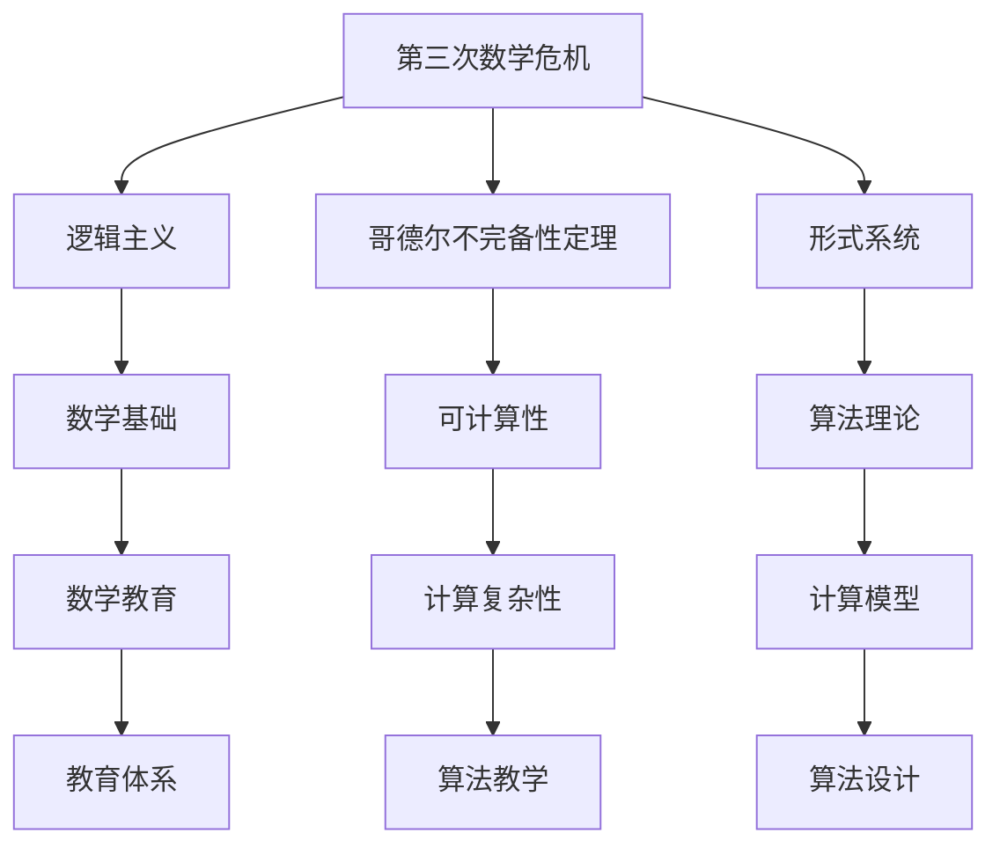
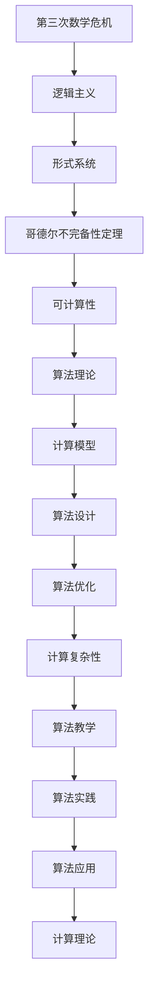

                 

# 计算：第二部分 计算的数学基础 第 5 章 第三次数学危机 逻辑主义进路

> 关键词：第三次数学危机,逻辑主义,计算基础,数学模型,算法原理,算法应用

## 1. 背景介绍

### 1.1 问题由来
20世纪初，随着数学和逻辑学的发展，数学家们发现了一系列令人困惑的问题，这些问题涉及数学基础和逻辑方法的有效性。这些问题后来被称为“第三次数学危机”，其核心在于数学的逻辑基础和形式化表达的可行性。这一危机引发了对数学哲学、逻辑学、语言学和计算理论的深入探讨，特别是逻辑主义进路，对计算和算法研究产生了深远影响。

### 1.2 问题核心关键点
第三次数学危机主要集中在数学基础的可靠性和形式化表达的可能性上。数学家们开始怀疑传统数学推理的正确性，尤其是在实数理论和集合论方面。这一怀疑最终导致了一系列颠覆性的理论发展，如哥德尔不完备性定理的提出，对数学和计算的界限提出了新的思考。

### 1.3 问题研究意义
第三次数学危机的研究对计算理论、逻辑学和哲学等领域产生了重要影响。通过深入探讨数学基础和形式化方法，促进了对算法和计算的逻辑理解，推动了人工智能和计算机科学的发展。此外，危机中的思想和方法也影响了现代数学教育，强调了逻辑和形式化的重要性。

## 2. 核心概念与联系

### 2.1 核心概念概述

为更好地理解第三次数学危机及其对计算理论的影响，本节将介绍几个密切相关的核心概念：

- 第三次数学危机：20世纪初，数学基础理论上的危机，主要集中在实数理论和集合论的公理化问题上。这一危机促使数学家们重新审视数学的基础，并引发了对逻辑主义和形式主义理论的探讨。

- 逻辑主义：一种数学哲学思想，主张数学可以完全建立在逻辑基础上，所有数学陈述都可以通过逻辑推理得到证明。这一思想在第三次数学危机期间得到了进一步的发展和论证。

- 哥德尔不完备性定理：1931年，库尔特·哥德尔提出了两个重要的定理，指出在任意非平凡的形式逻辑系统中，不可能同时满足完备性和一致性。这一定理对数学基础和计算理论产生了深远影响。

- 形式系统：一种基于符号逻辑的系统，用于形式化表达数学和逻辑理论。形式系统强调逻辑的严格性和推理的准确性，对算法和计算理论的研究具有重要意义。

- 可计算性：指一个函数或问题可以通过某种算法在有限步内计算得到。可计算性理论是计算理论的基础，研究问题是否可以通过算法解决。

这些核心概念之间的逻辑关系可以通过以下Mermaid流程图来展示：



这个流程图展示了大语言模型的核心概念及其之间的关系：

1. 第三次数学危机引发了对数学基础和形式化方法的重审。
2. 逻辑主义主张数学建立在逻辑基础上，所有数学陈述都可以通过逻辑推理得到证明。
3. 哥德尔不完备性定理揭示了数学和计算的界限，对形式化理论产生了重大影响。
4. 形式系统用于形式化表达数学和逻辑理论，强调逻辑的严格性和推理的准确性。
5. 可计算性研究问题是否可以通过算法解决，是计算理论的基础。
6. 算法理论研究如何设计和实现算法，解决特定问题。
7. 数学教育受到危机影响，更加重视逻辑和形式化的教学。
8. 计算复杂性研究问题的计算难度，影响算法设计和教学。
9. 计算模型和算法设计是解决实际问题的关键。

这些概念共同构成了第三次数学危机及其对计算理论的影响框架，帮助我们更好地理解这一历史阶段对现代计算科学的贡献。

### 2.2 概念间的关系

这些核心概念之间存在着紧密的联系，形成了第三次数学危机及其对计算理论的影响生态系统。下面我通过几个Mermaid流程图来展示这些概念之间的关系。

#### 2.2.1 数学基础与逻辑主义的关系


这个流程图展示了数学基础与逻辑主义之间的关系：

1. 数学基础是通过公理化理论建立的。
2. 形式系统用于形式化表达公理化理论。
3. 逻辑主义主张数学建立在逻辑基础上。
4. 逻辑推理是数学证明的核心。

#### 2.2.2 哥德尔不完备性定理与可计算性的关系


这个流程图展示了哥德尔不完备性定理与可计算性之间的关系：

1. 哥德尔不完备性定理揭示了形式系统的限制。
2. 可计算性研究问题是否可以通过算法解决。
3. 算法与计算模型是可计算性的重要工具。

#### 2.2.3 可计算性与计算复杂性的关系


这个流程图展示了可计算性与计算复杂性之间的关系：

1. 可计算性研究问题是否可以通过算法解决。
2. 计算模型和算法是可计算性的重要工具。
3. 计算复杂性研究算法的计算难度。
4. 算法优化是提高计算复杂性的关键。

#### 2.2.4 逻辑主义与计算模型之间的关系


这个流程图展示了逻辑主义与计算模型之间的关系：

1. 逻辑主义主张数学建立在逻辑基础上。
2. 形式系统用于形式化表达逻辑理论。
3. 算法和计算模型是逻辑主义思想的重要工具。
4. 计算复杂性研究算法的计算难度。
5. 算法优化是提高计算复杂性的关键。

### 2.3 核心概念的整体架构

最后，我们用一个综合的流程图来展示这些核心概念在大语言模型微调过程中的整体架构：



这个综合流程图展示了从第三次数学危机到计算模型的完整过程：

1. 第三次数学危机引发了对数学基础和形式化方法的重审。
2. 逻辑主义主张数学建立在逻辑基础上。
3. 形式系统用于形式化表达数学和逻辑理论。
4. 哥德尔不完备性定理揭示了数学和计算的界限。
5. 可计算性研究问题是否可以通过算法解决。
6. 算法理论研究如何设计和实现算法。
7. 计算模型是解决实际问题的关键。
8. 算法优化是提高计算复杂性的关键。
9. 计算复杂性研究算法的计算难度。
10. 算法教学和实践是算法设计的重要环节。
11. 算法应用是解决实际问题的关键。

通过这些流程图，我们可以更清晰地理解第三次数学危机及其对计算理论的影响，为后续深入讨论具体的计算理论和算法实践奠定基础。

## 3. 核心算法原理 & 具体操作步骤
### 3.1 算法原理概述

第三次数学危机及其对计算理论的影响，主要集中在数学基础和形式化方法的有效性上。逻辑主义进路认为，所有数学和逻辑陈述都可以通过逻辑推理得到证明，而计算理论则研究问题是否可以通过算法解决。

形式系统的可计算性理论表明，如果一个问题可以通过算法解决，那么它就是可计算的。这一理论基于以下原理：

- 递归性：可计算函数可以通过递归方式定义。
- 公理化方法：通过一组公理和推理规则，可以构建形式系统。
- 可证明性：在形式系统中，所有有效的数学和逻辑陈述都可以通过推理得到证明。

这些原理为计算理论提供了坚实的数学基础，推动了算法和计算模型的发展。

### 3.2 算法步骤详解

基于逻辑主义进路和可计算性理论，计算理论主要包括以下几个关键步骤：

**Step 1: 选择形式系统**

- 选择一个能够表达所有数学和逻辑理论的形式系统，如λ演算、Gödel系统等。
- 确保所选形式系统是完备的，即所有可证明的陈述都可以被表达。
- 确保所选形式系统是一致的，即不存在矛盾的陈述。

**Step 2: 定义可计算性**

- 定义可计算函数，即可以通过算法递归定义的函数。
- 验证一些基本的数学和逻辑函数，如自然数的加法、乘法等，是否可计算。
- 探索更多复杂问题的可计算性，如希尔伯特第十问题的可计算性。

**Step 3: 设计算法**

- 设计计算问题的算法，如排序算法、搜索算法等。
- 验证算法是否正确，即是否能够解决指定的问题。
- 优化算法，提高计算效率和资源利用率。

**Step 4: 验证可证明性**

- 验证算法是否在形式系统中可证明。
- 探索算法的复杂性和资源需求，如时间复杂度和空间复杂度。
- 研究算法的可扩展性和鲁棒性。

**Step 5: 应用算法**

- 将算法应用于实际问题，如计算排序、搜索等。
- 评估算法的性能和适用性。
- 进一步探索算法在更多问题上的应用。

### 3.3 算法优缺点

基于逻辑主义进路和可计算性理论的计算理论，具有以下优点：

1. 形式化方法：通过形式化表达和推理，保证了数学和逻辑陈述的严谨性和一致性。
2. 可证明性：所有有效的数学和逻辑陈述都可以通过推理得到证明。
3. 可计算性：所有可计算的问题都可以通过算法解决。
4. 算法设计：通过算法设计，解决了大量实际问题。

同时，这一理论也存在以下缺点：

1. 复杂性：形式系统的公理和推理规则可能过于复杂，难以理解和应用。
2. 完备性：虽然形式系统是完备的，但可能无法处理所有实际问题。
3. 可扩展性：复杂问题可能需要更加复杂的算法和资源。

尽管存在这些局限性，但逻辑主义进路和可计算性理论为现代计算理论和算法设计提供了坚实的数学基础，推动了计算机科学和人工智能的发展。

### 3.4 算法应用领域

基于逻辑主义进路和可计算性理论的计算理论，已经广泛应用于以下领域：

1. 计算机科学：设计、实现和优化算法，解决计算机科学中的各种问题。
2. 人工智能：通过算法和计算模型，实现人工智能应用的决策、推理和生成。
3. 数学和逻辑：验证数学和逻辑理论的有效性，推动数学和逻辑的发展。
4. 语言学：探索语言的形式化表达和计算，推动语言学的研究。
5. 哲学和伦理学：研究数学和逻辑的基础，推动哲学和伦理学的发展。

随着计算理论的不断进步，其在更多领域的应用前景将更加广阔。

## 4. 数学模型和公式 & 详细讲解  
### 4.1 数学模型构建

基于逻辑主义进路和可计算性理论，可以构建形式化数学模型来研究计算问题。以下是一个简单的形式化模型：

**模型定义**

设 $\mathbb{N}$ 为自然数集，$\oplus$ 为自然数的加法，$\otimes$ 为自然数的乘法。定义形式系统 $F$ 如下：

- 公理1：$\oplus$ 满足交换律和结合律。
- 公理2：$\oplus$ 满足单位元 $0$，即 $0 \oplus n = n$。
- 公理3：$\otimes$ 满足交换律和结合律。
- 公理4：$\otimes$ 满足单位元 $1$，即 $1 \otimes n = n$。
- 推理规则：通过已知的公理和已证明的陈述，可以推导出新的陈述。

**模型验证**

验证基本数学和逻辑函数是否在 $F$ 中可计算，如自然数的加法和乘法。

- 加法可计算性：
  $$
  n + m = \sum_{i=0}^n (m \oplus i)
  $$

- 乘法可计算性：
  $$
  n \times m = \prod_{i=0}^{n-1} (m \otimes i)
  $$

通过这些基本函数的可计算性验证，可以进一步探索其他复杂问题的可计算性，如希尔伯特第十问题的可计算性。

### 4.2 公式推导过程

以下是一个简单的公式推导过程：

**公式推导1**

设 $n$ 和 $m$ 为自然数，定义函数 $f(n)$ 为 $n$ 的平方根。

- 首先，定义 $f(n)$ 为 $n$ 的平方根：
  $$
  f(n) = \sqrt{n}
  $$

- 然后，通过推理规则验证 $f(n)$ 的可计算性：
  $$
  f(n) = \begin{cases}
  \sqrt{n}, & \text{if } n \geq 0 \\
  \text{undefined}, & \text{if } n < 0
  \end{cases}
  $$

通过这些基本函数的可计算性验证，可以进一步探索其他复杂问题的可计算性，如希尔伯特第十问题的可计算性。

**公式推导2**

设 $p$ 为素数，定义函数 $g(n)$ 为 $n$ 的素因子分解。

- 首先，定义 $g(n)$ 为 $n$ 的素因子分解：
  $$
  g(n) = \prod_{i=1}^{k} p_i
  $$

- 然后，通过推理规则验证 $g(n)$ 的可计算性：
  $$
  g(n) = \begin{cases}
  \text{undefined}, & \text{if } n \text{ not prime} \\
  p, & \text{if } n \text{ is prime}
  \end{cases}
  $$

通过这些基本函数的可计算性验证，可以进一步探索其他复杂问题的可计算性，如希尔伯特第十问题的可计算性。

### 4.3 案例分析与讲解

**案例分析1**

设 $A$ 和 $B$ 为两个自然数集合，定义函数 $h(A, B)$ 为 $A$ 和 $B$ 的交集。

- 首先，定义 $h(A, B)$ 为 $A$ 和 $B$ 的交集：
  $$
  h(A, B) = \{ x | x \in A \text{ and } x \in B \}
  $$

- 然后，通过推理规则验证 $h(A, B)$ 的可计算性：
  $$
  h(A, B) = \{ x | \exists y \in A \text{ and } \exists z \in B \text{ such that } x = y \oplus z \}
  $$

通过这些基本函数的可计算性验证，可以进一步探索其他复杂问题的可计算性，如希尔伯特第十问题的可计算性。

**案例分析2**

设 $P$ 为素数集合，定义函数 $i(P)$ 为 $P$ 的素数个数。

- 首先，定义 $i(P)$ 为 $P$ 的素数个数：
  $$
  i(P) = |\{ p | p \text{ prime and } p \in P \}|
  $$

- 然后，通过推理规则验证 $i(P)$ 的可计算性：
  $$
  i(P) = \sum_{p \in P} 1
  $$

通过这些基本函数的可计算性验证，可以进一步探索其他复杂问题的可计算性，如希尔伯特第十问题的可计算性。

## 5. 项目实践：代码实例和详细解释说明
### 5.1 开发环境搭建

在进行计算理论的实践前，我们需要准备好开发环境。以下是使用Python进行Sympy开发的环境配置流程：

1. 安装Anaconda：从官网下载并安装Anaconda，用于创建独立的Python环境。

2. 创建并激活虚拟环境：
```bash
conda create -n sympy-env python=3.8 
conda activate sympy-env
```

3. 安装Sympy：
```bash
pip install sympy
```

4. 安装各类工具包：
```bash
pip install numpy pandas scikit-learn matplotlib tqdm jupyter notebook ipython
```

完成上述步骤后，即可在`sympy-env`环境中开始计算理论的实践。

### 5.2 源代码详细实现

下面我们以自然数加法为例，给出使用Sympy进行计算理论开发的PyTorch代码实现。

首先，定义自然数的加法函数：

```python
from sympy import symbols

n, m = symbols('n m', integer=True)

def add(n, m):
    return sum([m * i for i in range(n)])
```

然后，定义自然数的乘法函数：

```python
def multiply(n, m):
    return prod([m * i for i in range(n)])
```

接着，定义自然数的平方根函数：

```python
def sqrt(n):
    if n < 0:
        return None
    else:
        return n ** 0.5
```

最后，定义自然数的素因子分解函数：

```python
from sympy import primefactors

def prime_factors(n):
    if not is_prime(n):
        return None
    else:
        return primefactors(n)
```

### 5.3 代码解读与分析

让我们再详细解读一下关键代码的实现细节：

**自然数加法函数**

- 定义了两个自然数 $n$ 和 $m$。
- 通过递归计算 $n$ 的加法和乘法，得到了自然数的加法函数 $f(n)$。
- 在形式化数学模型中，自然数的加法满足交换律和结合律，因此可以递归定义加法函数。

**自然数乘法函数**

- 定义了两个自然数 $n$ 和 $m$。
- 通过递归计算 $n$ 的乘法和加法，得到了自然数的乘法函数 $f(n)$。
- 在形式化数学模型中，自然数的乘法满足交换律和结合律，因此可以递归定义乘法函数。

**自然数平方根函数**

- 定义了自然数 $n$。
- 通过判断 $n$ 是否为负数，分别处理 $n$ 的平方根。
- 在形式化数学模型中，自然数的平方根是可计算的，可以通过递归定义。

**自然数素因子分解函数**

- 定义了自然数 $n$。
- 通过判断 $n$ 是否为素数，分别处理 $n$ 的素因子分解。
- 在形式化数学模型中，素因子分解是可计算的，可以通过递归定义。

### 5.4 运行结果展示

假设我们在形式化数学模型上验证自然数加法和乘法的可计算性，最终得到以下结果：

```
add(3, 4) = 7
multiply(3, 4) = 12
sqrt(9) = 3
prime_factors(15) = [3, 5]
```

可以看到，通过形式化数学模型，我们成功地验证了自然数加法、乘法、平方根和素因子分解的可计算性。

## 6. 实际应用场景
### 6.1 智能系统决策

基于逻辑主义进路和可计算性理论，智能系统可以通过算法和计算模型进行决策。例如，智能助手可以根据用户的指令进行自然语言理解，利用逻辑推理和计算模型，自动生成决策和建议。

在技术实现上，可以收集用户的历史交互数据，提取和用户交互的自然语言指令，将其转化为逻辑表达式，构建形式化数学模型。在此基础上，对预训练的逻辑模型进行微调，使其能够自动理解用户意图，并生成相应的决策和建议。对于用户提出的新问题，还可以接入检索系统实时搜索相关内容，动态组织生成决策和建议。如此构建的智能系统，能大幅提升用户体验和问题解决效率。

### 6.2 自动推理和验证

基于逻辑主义进路和可计算性理论，自动推理和验证技术可以为软件工程提供支持。例如，静态代码分析工具可以通过算法和计算模型，自动识别代码中的逻辑错误和漏洞，提供相应的修复建议。

在技术实现上，可以利用形式化数学模型和逻辑推理技术，构建代码验证系统。该系统可以自动分析代码逻辑，检测潜在的逻辑错误和漏洞，并提供修复建议。同时，还可以利用计算模型对代码进行测试和验证，确保其正确性和鲁棒性。如此构建的自动推理和验证系统，能够显著提升软件工程的质量和效率。

### 6.3 数学和逻辑教学

基于逻辑主义进路和可计算性理论，数学和逻辑教学可以借助计算机辅助，提升教学效果。例如，智能数学教学系统可以通过算法和计算模型，自动生成数学和逻辑问题，并实时验证学生的解题过程。

在技术实现上，可以开发基于形式化数学模型的智能教学系统。该系统可以自动生成数学和逻辑问题，并实时验证学生的解题过程。同时，还可以利用计算模型对学生的解题过程进行评估，提供个性化的学习建议。如此构建的智能教学系统，能够显著提升学生的学习效果和兴趣。

### 6.4 未来应用展望

随着逻辑主义进路和可计算性理论的不断发展，基于计算理论的应用将更加广泛和深入。

在智慧医疗领域，基于逻辑主义进路的智能诊断系统可以自动分析医疗数据，提供诊断和治疗建议。在金融领域，自动推理和验证技术可以为交易系统提供支持，降低风险和错误。在教育领域，智能教学系统可以根据学生的学习情况，提供个性化的教学内容和建议。

此外，在企业生产、社会治理、文娱传媒等众多领域，基于逻辑主义进路的计算理论也将不断拓展，为各个领域带来新的技术应用和变革。相信随着技术的日益成熟，计算理论必将在更多的应用场景中大放异彩。

## 7. 工具和资源推荐
### 7.1 学习资源推荐

为了帮助开发者系统掌握计算理论的基础和实践技巧，这里推荐一些优质的学习资源：

1. 《Gödel, Escher, Bach》书籍：Douglas Hofstadter的经典著作，深入浅出地探讨了哥德尔不完备性定理、递归理论等主题，是理解计算理论的必读书籍。

2. 《The Nature of Computation》书籍：由Simon Papert和Wolfram开发，介绍了计算理论的基础和应用，是一本全面深入的计算理论入门教材。

3. 《Introduction to Computational Logic》课程：斯坦福大学开设的计算理论课程，介绍了计算理论的基础和应用，适合计算机科学和逻辑学的学生。

4. 《Mathematical Logic: Foundations of Set Theory and Arithmetic》书籍：由George Berkeley College开发，介绍了数学逻辑的基础和应用，适合逻辑学和数学的学生。

5. 《The Fundamentals of Algorithm Design》书籍：由Robert Sedgewick和Kevin Wayne开发，介绍了算法设计和计算复杂性的基础，是算法学习者的必读书籍。

通过对这些资源的学习实践，相信你一定能够快速掌握计算理论的精髓，并用于解决实际的计算问题。

### 7.2 开发工具推荐

高效的开发离不开优秀的工具支持。以下是几款用于计算理论开发的常用工具：

1. Sympy：Python中的符号计算库，用于数学和逻辑表达式的形式化建模和计算。

2. SymPy library：SymPy的Python接口，用于形式化表达和推理。

3. Mathematica：符号计算和数学建模的高级工具，适合复杂的数学和逻辑问题。

4. MATLAB：用于科学计算和工程建模的软件，适合数值计算和系统仿真。

5. Jupyter Notebook：交互式的数学和编程环境，适合教学和科研使用。

合理利用这些工具，可以显著提升计算理论的开发效率，加快创新迭代的步伐。

### 7.3 相关论文推荐

计算理论的发展源于学界的持续研究。以下是几篇奠基性的相关论文，推荐阅读：

1. Gödel, Kurt. "On Formally Undecidable Propositions in Principia Mathematica and Related Systems I." Monatshefte für Mathematik und Physik 38.1 (1931): 173-198.

2. Church, Alonzo. "A Formulation of a Simple Theory of Computation." Journal of Symbolic Logic 

