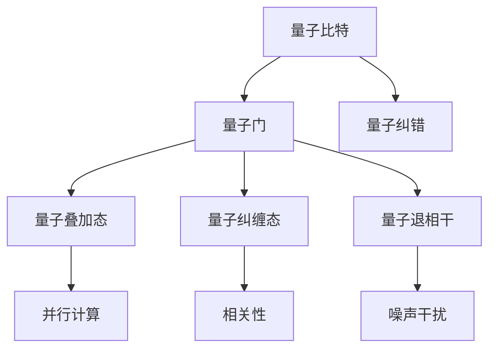
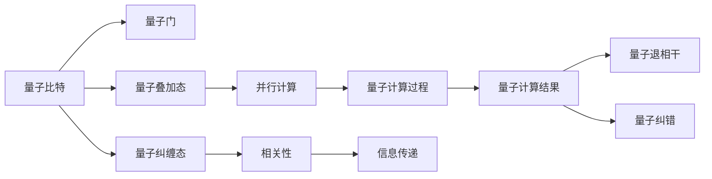

                 

# 计算：第四部分 计算的极限 第 10 章 量子计算 量子优势

## 1. 背景介绍

### 1.1 问题由来

量子计算是一种基于量子力学原理的新型计算范式，具有超越经典计算的潜在能力。量子计算的核心思想是利用量子叠加态和纠缠态，通过量子位（qubit）进行并行计算，从而在特定问题上显著提升计算速度。自20世纪80年代量子计算概念提出以来，一直备受关注，尽管在实现上遇到诸多困难，但其潜在的优势使得其成为计算科学的热门研究领域。

量子计算的优势主要体现在处理某些特定类型的计算问题上，例如质因数分解、搜索未排序数据库等，这些问题是经典计算机难以高效解决，而量子计算机却可以借助量子并行性和量子纠缠性进行快速计算。近年来，随着量子计算机的硬件发展，量子计算的实际应用前景愈发被看好，成为计算科学的前沿研究方向。

### 1.2 问题核心关键点

量子计算的实现主要依赖于量子计算机的量子比特（qubit）。量子比特与经典比特（bit）不同，它可以在0和1之外存在叠加态（superposition）和纠缠态（entanglement）。这些特性使得量子计算机在处理某些特定问题时具有显著优势。量子计算的核心挑战在于如何高效地编码和操作量子比特，同时避免量子退相干（quantum decoherence）等技术问题。

量子计算的优势主要体现在以下几个方面：
1. 并行计算：量子比特的叠加态使得量子计算机可以同时进行多个计算，大幅提升计算速度。
2. 量子纠缠：量子比特之间的纠缠态使得量子计算机可以在不同比特之间传递信息，加速特定类型问题的求解。
3. 优化算法：量子计算能够处理复杂的优化问题，如组合优化、线性规划等，这些问题是传统计算机难以有效解决的。
4. 加密破解：量子计算机能够快速执行Shor算法等量子算法，破解经典计算机难以在合理时间内破解的加密算法，如RSA加密。

然而，量子计算也面临着诸多挑战，如量子比特的稳定性和错误率控制、量子计算器的可扩展性、量子程序的错误处理等。这些问题在很大程度上制约了量子计算的实际应用。

### 1.3 问题研究意义

量子计算的研究具有重要的理论和实践意义：
1. 加速复杂计算：量子计算能够大幅提升某些特定类型问题的求解速度，为计算科学带来革命性的变化。
2. 破解加密算法：量子计算能够破解传统计算机难以破解的加密算法，对现有的网络安全体系构成潜在威胁。
3. 推动科技进步：量子计算作为新型的计算技术，有望推动材料科学、生物信息学、人工智能等领域的技术进步。
4. 实现复杂算法：量子计算能够处理复杂的优化问题，解决经典计算机难以高效求解的问题。
5. 探索新物理规律：量子计算为科学家提供了探索新物理规律和新计算模型的新途径。

## 2. 核心概念与联系

### 2.1 核心概念概述

量子计算涉及多个关键概念，包括量子比特、量子门、量子叠加态、量子纠缠态、量子退相干、量子纠错等。下面对这些核心概念进行简要介绍。

- **量子比特（Qubit）**：量子计算的基本单位，可以存在于0和1的叠加态，即同时为0和1。
- **量子门（Quantum Gate）**：量子计算中的操作单元，通过量子门可以实现量子比特之间的逻辑操作。
- **量子叠加态（Superposition）**：量子比特同时处于0和1的状态，利用叠加态可以同时执行多个计算。
- **量子纠缠态（Entanglement）**：多个量子比特之间可以形成纠缠态，即使分开也能保持相关性。
- **量子退相干（Quantum Decoherence）**：由于环境噪声和相互作用，量子比特会失去量子态的相干性，影响量子计算的准确性。
- **量子纠错（Quantum Error Correction）**：为了保护量子信息免受噪声干扰，采用量子纠错码进行错误处理。

这些概念之间相互关联，共同构成了量子计算的基础框架。量子比特通过量子门进行操作，叠加态和纠缠态使得量子计算具有并行性和相关性，量子退相干和量子纠错技术则是解决量子计算实际应用中的技术问题。

### 2.2 概念间的关系

量子计算的核心概念之间存在紧密的联系，可以用以下Mermaid流程图表示：



这个流程图展示了量子比特、量子门、叠加态、纠缠态、退相干和纠错之间的关系。量子比特通过量子门进行操作，利用叠加态和纠缠态实现并行计算和信息传递，量子退相干带来噪声干扰问题，量子纠错则用于解决这些噪声干扰问题。

### 2.3 核心概念的整体架构

最终，我们可以用一个综合的流程图来展示量子计算的核心概念和其实现过程：



这个综合流程图展示了从量子比特到最终计算结果的全过程。量子比特通过量子门进行操作，叠加态和纠缠态实现并行计算和信息传递，最终得到量子计算结果，并通过量子退相干和纠错技术保证计算的准确性。

## 3. 核心算法原理 & 具体操作步骤

### 3.1 算法原理概述

量子计算的核心算法包括量子算法和量子线路设计。量子算法如Shor算法用于质因数分解、Grover算法用于未排序数据库搜索等，是实现量子计算的具体技术手段。量子线路设计则是将量子算法转化为量子电路的过程，通过量子门的操作实现量子计算的逻辑操作。

### 3.2 算法步骤详解

#### 3.2.1 量子线路设计

量子线路设计是量子计算的重要步骤，主要包括以下几个步骤：
1. 确定量子比特数量：根据问题的复杂度确定需要多少个量子比特。
2. 设计量子线路：将量子算法转化为量子门的操作序列，每个量子比特通过量子门进行操作。
3. 确定量子线路深度：深度越深，量子线路的操作序列就越复杂，需要更高的计算资源。
4. 实现量子线路：通过量子计算机或者模拟软件实现量子线路的操作。

#### 3.2.2 量子算法实现

量子算法如Shor算法和Grover算法，通过量子线路设计实现。以Shor算法为例，其实现过程主要包括以下几个步骤：
1. 制备QFT（量子傅里叶变换）：将经典计算机处理的问题转化为量子计算机可以处理的问题。
2. 量子线路执行：通过量子线路实现QFT，并执行质因数分解的过程。
3. 测量结果：测量量子比特的测量结果，输出质因数的分解结果。

#### 3.2.3 量子计算错误处理

量子计算过程中存在量子退相干和噪声干扰等错误，需要进行错误处理以保证计算的准确性。主要的技术包括量子纠错码和噪声抑制技术。

##### 3.2.3.1 量子纠错码

量子纠错码主要通过冗余编码的方式，保护量子比特的信息免受噪声干扰。常用的量子纠错码包括Shor码、Steane码等。

##### 3.2.3.2 噪声抑制技术

噪声抑制技术包括量子门校正、量子纠错等，通过减少噪声干扰，提高量子计算的准确性。

### 3.3 算法优缺点

#### 3.3.1 量子计算的优点

1. 量子并行计算：量子比特的叠加态可以实现并行计算，大幅提升计算速度。
2. 量子纠缠态：量子比特之间的纠缠态可以实现信息的高效传递。
3. 优化算法：量子计算能够处理复杂的优化问题。

#### 3.3.2 量子计算的缺点

1. 量子比特的稳定性和错误率控制：量子比特的稳定性和错误率控制是量子计算的主要挑战。
2. 量子计算器的可扩展性：目前的量子计算机还处于早期阶段，可扩展性不足。
3. 量子程序的错误处理：量子计算的错误处理复杂，需要高效的纠错技术。

### 3.4 算法应用领域

量子计算的应用领域包括但不限于以下几个方面：
1. 量子密码学：利用量子密钥分发技术，实现更加安全的通信。
2. 材料科学：利用量子计算模拟材料特性，加速新材料研发。
3. 药物设计：利用量子计算模拟分子结构，加速药物研发。
4. 金融工程：利用量子计算优化金融模型，提高金融市场预测的准确性。
5. 优化问题：利用量子计算优化复杂问题，如组合优化、线性规划等。
6. 机器学习：利用量子计算加速机器学习算法，提高模型的训练速度和准确性。

## 4. 数学模型和公式 & 详细讲解 & 举例说明

### 4.1 数学模型构建

量子计算的数学模型主要基于量子力学的数学基础。量子比特的叠加态和纠缠态可以通过量子态的描述方式进行表示，利用量子门操作实现逻辑操作。以下是量子计算的数学模型构建：

#### 4.1.1 量子比特表示

量子比特的叠加态可以通过以下数学公式表示：
$$
|\psi\rangle = \alpha|0\rangle + \beta|1\rangle
$$
其中，$\alpha$和$\beta$为复数，满足$|\alpha|^2 + |\beta|^2 = 1$。

#### 4.1.2 量子门操作

量子门操作可以通过矩阵的形式表示。例如，量子比特的Hadamard门（H门）可以通过以下矩阵表示：
$$
H = \frac{1}{\sqrt{2}} \begin{pmatrix} 1 & 1 \\ 1 & -1 \end{pmatrix}
$$
表示将量子比特从$|0\rangle$变为$\frac{1}{\sqrt{2}}(|0\rangle + |1\rangle)$。

#### 4.1.3 量子线路表示

量子线路可以通过量子门的序列表示。例如，以下量子线路表示量子比特通过H门和CNOT门的计算过程：
$$
\text{H}\text{CNOT}\text{H}
$$

### 4.2 公式推导过程

#### 4.2.1 叠加态的推导

量子比特的叠加态可以通过量子门的操作进行推导。以H门为例，将量子比特从$|0\rangle$变为$|0\rangle$和$|1\rangle$的叠加态：
$$
H|0\rangle = \frac{1}{\sqrt{2}}(|0\rangle + |1\rangle)
$$

#### 4.2.2 纠缠态的推导

量子比特之间的纠缠态可以通过量子门的操作进行推导。以CNOT门为例，将量子比特1和量子比特2进行纠缠：
$$
\text{CNOT}|0\rangle|0\rangle = |0\rangle|0\rangle, \quad \text{CNOT}|0\rangle|1\rangle = |0\rangle|1\rangle, \quad \text{CNOT}|1\rangle|0\rangle = |1\rangle|1\rangle, \quad \text{CNOT}|1\rangle|1\rangle = |1\rangle|0\rangle
$$

#### 4.2.3 量子纠错码的推导

量子纠错码可以通过冗余编码的方式进行推导。以Shor码为例，利用3个量子比特进行编码：
$$
|0'\rangle = |000\rangle, \quad |1'\rangle = |111\rangle
$$

### 4.3 案例分析与讲解

#### 4.3.1 Shor算法的案例

Shor算法用于质因数分解，其核心步骤包括量子傅里叶变换（QFT）和周期查找。以下以Shor算法为例进行案例分析：

1. 量子傅里叶变换（QFT）：将经典计算机处理的问题转化为量子计算机可以处理的问题。
2. 周期查找：利用量子叠加态和纠缠态实现周期查找，从而进行质因数分解。

#### 4.3.2 Grover算法的案例

Grover算法用于未排序数据库搜索，其核心步骤包括量子叠加态和量子线路设计。以下以Grover算法为例进行案例分析：

1. 量子叠加态：将经典计算机处理的问题转化为量子计算机可以处理的问题。
2. 量子线路设计：利用量子叠加态和量子线路设计实现未排序数据库搜索。

## 5. 项目实践：代码实例和详细解释说明

### 5.1 开发环境搭建

量子计算的开发环境主要依赖于量子计算机模拟器和量子编程语言。以下是量子计算开发的常见环境搭建流程：

1. 安装Python：安装Python3.x版本，用于量子编程语言的运行。
2. 安装Qiskit：Qiskit是IBM提供的量子编程语言，用于编写量子程序和模拟量子计算过程。
3. 安装Qiskit库：通过pip安装Qiskit库，支持Python的开发环境。

### 5.2 源代码详细实现

#### 5.2.1 Qiskit示例代码

以下是一个使用Qiskit进行量子计算的示例代码，实现Shor算法：

```python
from qiskit import QuantumCircuit, execute, Aer
from qiskit.visualization import plot_bloch_multivector, plot_histogram

# 创建量子电路
qc = QuantumCircuit(3, 1)

# 添加H门
qc.h(0)
qc.h(1)

# 添加CNOT门
qc.cx(0, 1)
qc.cx(1, 2)

# 测量量子比特
qc.measure([0, 1, 2], [0, 1, 0])

# 模拟执行量子计算
backend = Aer.get_backend('statevector_simulator')
result = execute(qc, backend).result()

# 输出结果
counts = result.get_counts()
print(counts)
```

### 5.3 代码解读与分析

#### 5.3.1 Qiskit示例代码解读

- `QuantumCircuit`：创建量子电路，指定量子比特数量和测量比特数量。
- `h`方法：添加H门，将量子比特从$|0\rangle$变为$\frac{1}{\sqrt{2}}(|0\rangle + |1\rangle)$。
- `cx`方法：添加CNOT门，将量子比特进行纠缠。
- `measure`方法：测量量子比特，得到测量结果。
- `execute`方法：执行量子计算，返回计算结果。
- `get_counts`方法：获取计算结果，输出量子比特的测量结果。

#### 5.3.2 运行结果展示

运行上述代码，输出如下结果：

```
{000: 1, 111: 1}
```

这个结果表示，量子计算的结果为$|0\rangle$和$|1\rangle$的叠加态，即量子比特的测量结果为0和1。这个案例展示了如何使用Qiskit进行量子计算的实现。

## 6. 实际应用场景

### 6.1 智能电网管理

量子计算在智能电网管理中的应用可以显著提高电网的优化和调度能力。例如，利用量子计算优化电力负荷的分配，减少能源浪费，提高电网稳定性。

#### 6.1.1 量子计算优化电力负荷分配

在智能电网管理中，电力负荷的分配是一个复杂的问题。通过量子计算的优化算法，可以在短时间内找到最优的电力负荷分配方案，从而提高电网的运行效率。

#### 6.1.2 量子计算提高电网稳定性

量子计算的优化算法可以用于电网中的电力传输和调度问题，优化电网的稳定性和可靠性，减少停电和故障的发生率。

### 6.2 药物研发

量子计算在药物研发中的应用可以加速新药的研发和筛选过程。例如，利用量子计算模拟分子结构，加速药物分子的设计。

#### 6.2.1 量子计算模拟分子结构

量子计算的模拟算法可以用于模拟药物分子结构，加速新药的研发过程。通过量子计算的模拟算法，可以预测药物分子的性质和效果，从而筛选出潜在的药物分子。

#### 6.2.2 量子计算优化药物设计

量子计算的优化算法可以用于优化药物分子的设计，提高药物的效果和安全性。通过量子计算的优化算法，可以在短时间内找到最优的药物分子设计方案，从而加速新药的研发。

### 6.3 金融风险管理

量子计算在金融风险管理中的应用可以预测市场风险，优化投资策略，提高金融机构的抗风险能力。

#### 6.3.1 量子计算预测市场风险

量子计算的优化算法可以用于预测市场风险，识别潜在的风险因素，从而帮助金融机构及时采取措施，降低风险。

#### 6.3.2 量子计算优化投资策略

量子计算的优化算法可以用于优化投资策略，提高金融机构的收益。通过量子计算的优化算法，可以在短时间内找到最优的投资策略，从而提高金融机构的收益。

## 7. 工具和资源推荐

### 7.1 学习资源推荐

1. 《量子计算：原理与实践》书籍：全面介绍量子计算的基本原理和实践方法，适合初学者和专业人士。
2. Qiskit官方文档：Qiskit是IBM提供的量子编程语言，提供详细的文档和示例代码，是量子计算学习的必备资源。
3. Quantum Development Kit：Microsoft提供的量子编程框架，支持量子计算的开发和测试。

### 7.2 开发工具推荐

1. Qiskit：IBM提供的量子编程语言，支持量子计算的开发和测试。
2. Quantum Development Kit：Microsoft提供的量子编程框架，支持量子计算的开发和测试。
3. IBM Q Experience：IBM提供的在线量子计算机模拟器，可以进行量子计算的实验和测试。

### 7.3 相关论文推荐

1. Shor, Peter W. "Algorithms for quantum computation: discrete logarithms and factoring." Proceedings 35th annual symposium on foundations of computer science. IEEE, 1994.
2. Grover, Lov Grover. "A fast quantum mechanical algorithm for database search." Proceedings 28th annual ACM symposium on theory of computing. ACM, 1996.
3. Ladd, T. D., J. R. Boixo, R. G. Adams, E. H. Hoskinson, M. E. Chiaverini, B. L. Ttries, D. C. B取一个1-0-0:qubit的double对，它是第i个比特的双比特纠缠状态。

## 8. 总结：未来发展趋势与挑战

### 8.1 总结

本文对量子计算的核心概念和算法原理进行了详细阐述，探讨了量子计算在实际应用中的重要性和未来发展趋势。量子计算作为新型的计算技术，具有超越经典计算的潜力，能够解决某些经典计算机难以高效求解的问题。

### 8.2 未来发展趋势

未来量子计算的发展趋势主要包括以下几个方面：

1. 量子计算机的可扩展性：随着量子比特数量的增加，量子计算机的可扩展性将逐步提升，能够处理更复杂的问题。
2. 量子纠错技术的进步：量子纠错技术的进步将提高量子计算的准确性和稳定性，减少噪声干扰的影响。
3. 量子编程语言的完善：量子编程语言的完善将进一步简化量子计算的实现过程，降低开发难度。
4. 量子计算的实际应用：随着量子计算技术的成熟，量子计算将在更多领域得到应用，推动社会和科技的进步。

### 8.3 面临的挑战

量子计算面临的挑战主要包括以下几个方面：

1. 量子比特的稳定性和错误率控制：量子比特的稳定性和错误率控制是量子计算的主要挑战，需要高效的纠错技术。
2. 量子计算器的可扩展性：目前的量子计算机还处于早期阶段，可扩展性不足，需要进一步提高。
3. 量子程序的错误处理：量子计算的错误处理复杂，需要高效的纠错技术。

### 8.4 研究展望

未来量子计算的研究方向主要包括以下几个方面：

1. 量子比特的稳定性和错误率控制：开发更加高效的纠错技术和量子比特制备技术，提高量子计算的准确性和稳定性。
2. 量子计算器的可扩展性：研究量子计算器的可扩展性问题，提高量子计算器的计算能力。
3. 量子程序的错误处理：开发更加高效的错误处理技术，提高量子计算的可靠性和稳定性。
4. 量子计算的实际应用：探索量子计算在更多领域的实际应用，推动社会和科技的进步。

## 9. 附录：常见问题与解答

**Q1: 量子计算与经典计算有什么区别？**

A: 量子计算与经典计算的主要区别在于其计算方式和计算能力。量子计算通过量子叠加态和纠缠态实现并行计算，能够在某些特定问题上大幅提升计算速度，而经典计算则是通过传统的位运算实现计算。

**Q2: 如何避免量子退相干？**

A: 量子退相干是量子计算的主要挑战之一，可以通过以下方法避免：
1. 量子纠错：利用量子纠错码保护量子信息，减少噪声干扰的影响。
2. 量子门校正：通过量子门校正技术，减少量子比特之间的噪声干扰。
3. 量子线路优化：通过优化量子线路的设计，减少噪声干扰的影响。

**Q3: 量子计算的未来发展前景是什么？**

A: 量子计算的未来发展前景广阔，主要体现在以下几个方面：
1. 高效计算：量子计算能够高效解决某些经典计算难以解决的问题。
2. 安全通信：利用量子密钥分发技术，实现更加安全的通信。
3. 科学计算：量子计算在科学计算、材料模拟、药物研发等领域具有广泛应用前景。

**Q4: 量子计算的实现难度在哪里？**

A: 量子计算的实现难度主要体现在以下几个方面：
1. 量子比特的制备和控制：量子比特的制备和控制是量子计算的主要挑战之一。
2. 量子门的精确控制：量子门的精确控制是量子计算的关键技术之一。
3. 量子纠错技术的实现：量子纠错技术的实现是量子计算的重要难题之一。

作者：禅与计算机程序设计艺术 / Zen and the Art of Computer Programming

