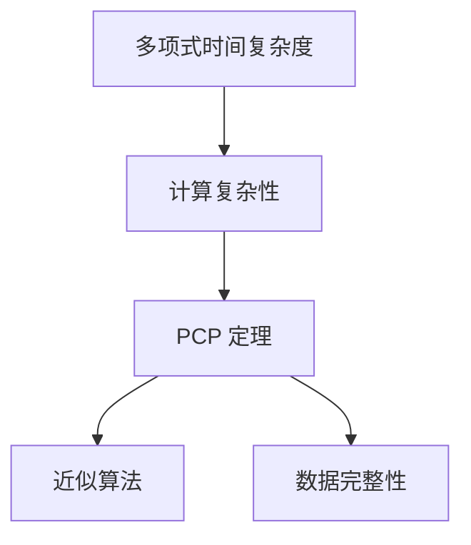
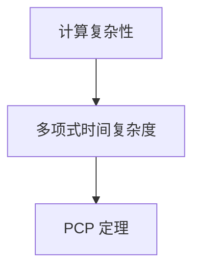
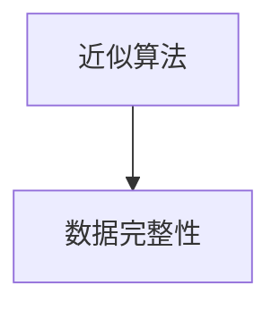
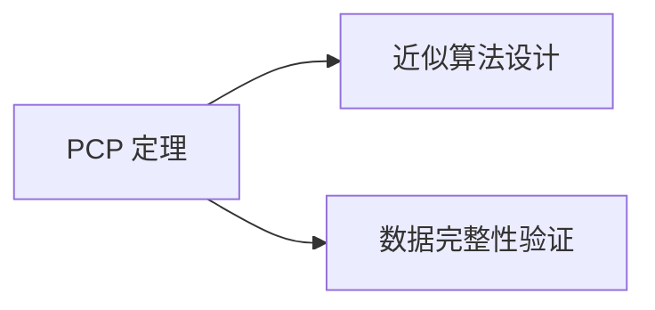
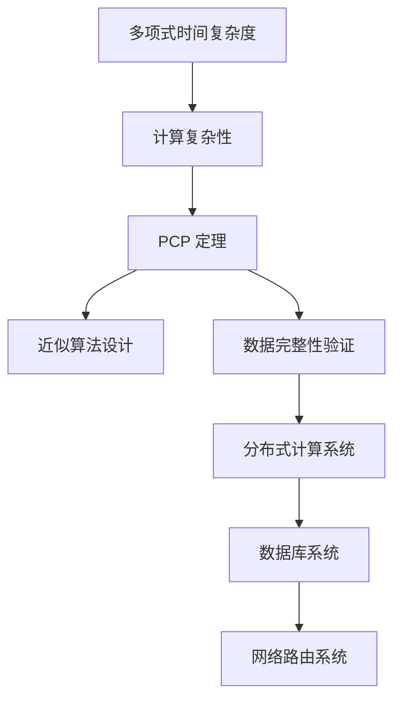

                 

# 计算：第四部分 计算的极限 第 9 章 计算复杂性 PCP 定理与不可近似性

## 1. 背景介绍

### 1.1 问题由来
计算复杂性理论是计算机科学的重要分支，它研究的问题是：给定一个计算问题，我们能否高效地解决它？能否用有限的时间和空间资源，找到问题的最优解？计算复杂性理论的核心在于研究各种计算问题在不同模型下的计算复杂性，从而为算法设计、数据结构设计、计算机系统设计提供理论基础。

在计算复杂性理论中，一个重要的研究分支是 PCP（Probabilistically Checkable Proofs）定理，它揭示了在特定条件下，计算问题的复杂性下限。PCP 定理对于设计近似算法、证明算法的难度以及计算机科学中的许多其他方面具有重要影响。

### 1.2 问题核心关键点
PCP 定理的核心理论是，任何可以在多项式时间内解决的问题，都可以在多项式时间内构造出其 PCP 证明，且该证明可以被多项式时间验算。该定理展示了计算问题的证明与验证之间的复杂性关系，进一步揭示了计算问题的本质。

PCP 定理的应用包括近似算法的设计、算法难度的证明、数据完整性的验证等。它在理论计算机科学和实际应用中都具有重要意义。例如，PCP 定理证明了，不存在多项式时间内的完全问题，从而证明了多项式时间内的算法不可能解决所有计算问题。

### 1.3 问题研究意义
PCP 定理的研究不仅具有理论意义，还对实际应用产生了深远影响。通过 PCP 定理，我们能够更好地理解计算问题的本质，发现算法设计的难点和瓶颈。这为设计更加高效的算法、优化计算资源的使用提供了理论指导。

PCP 定理还揭示了近似算法的极限，这对于设计实际可行的算法和优化算法性能具有重要指导意义。例如，它在分布式计算、数据库系统、网络路由等领域都有重要应用。

## 2. 核心概念与联系

### 2.1 核心概念概述

为了更好地理解 PCP 定理，我们需要介绍几个关键概念：

- PCP：概率可验证证明（Probabilistically Checkable Proofs），它是指一个可以被多项式时间验算的证明，用来证明某个计算问题具有某种性质。

- 多项式时间复杂度：表示算法运行时间与输入规模呈多项式关系，是计算复杂性理论中的重要概念。

- 计算复杂性：描述解决一个计算问题所需的时间和空间资源，是理论计算机科学的核心研究对象。

- 近似算法：在多项式时间内找到一个近似的解，而不是精确解，适用于无法或难以设计精确算法的场景。

- 数据完整性：在分布式计算和数据库系统中，确保数据的一致性和正确性，是保证系统正确运行的基础。

这些概念之间的逻辑关系可以通过以下 Mermaid 流程图来展示：



这个流程图展示了多项式时间复杂度、计算复杂性、PCP 定理、近似算法、数据完整性等概念之间的关系：

1. 计算复杂性描述了问题解决所需的时间和空间资源，是 PCP 定理的基础。
2. PCP 定理展示了在多项式时间内，构造和验证 PCP 证明的复杂性，进一步揭示了计算问题的本质。
3. 近似算法是在多项式时间内找到一个近似的解，适用于无法或难以设计精确算法的场景。
4. 数据完整性在分布式计算和数据库系统中，确保数据的一致性和正确性，是保证系统正确运行的基础。

### 2.2 概念间的关系

这些核心概念之间存在着紧密的联系，形成了 PCP 定理的理论框架。下面我们通过几个 Mermaid 流程图来展示这些概念之间的关系。

#### 2.2.1 计算复杂性与 PCP 定理的关系



这个流程图展示了计算复杂性与 PCP 定理的关系：

1. 计算复杂性描述了问题解决所需的时间和空间资源。
2. PCP 定理展示了在多项式时间内，构造和验证 PCP 证明的复杂性，揭示了计算问题的本质。

#### 2.2.2 近似算法与数据完整性的关系



这个流程图展示了近似算法与数据完整性的关系：

1. 近似算法是在多项式时间内找到一个近似的解，适用于无法或难以设计精确算法的场景。
2. 数据完整性在分布式计算和数据库系统中，确保数据的一致性和正确性，是保证系统正确运行的基础。

#### 2.2.3 PCP 定理的应用



这个流程图展示了 PCP 定理的应用：

1. PCP 定理证明了在多项式时间内，不存在完全问题，从而限制了近似算法的边界。
2. PCP 定理揭示了数据完整性的复杂性，为数据完整性验证提供了理论基础。

### 2.3 核心概念的整体架构

最后，我们用一个综合的流程图来展示这些核心概念在大语言模型微调过程中的整体架构：



这个综合流程图展示了多项式时间复杂度、计算复杂性、PCP 定理、近似算法、数据完整性等概念在大语言模型微调过程中的整体架构：

1. 计算复杂性描述了问题解决所需的时间和空间资源。
2. PCP 定理展示了在多项式时间内，构造和验证 PCP 证明的复杂性，揭示了计算问题的本质。
3. 近似算法是在多项式时间内找到一个近似的解，适用于无法或难以设计精确算法的场景。
4. 数据完整性在分布式计算和数据库系统中，确保数据的一致性和正确性，是保证系统正确运行的基础。

通过这些流程图，我们可以更清晰地理解 PCP 定理的理论基础和实际应用，为后续深入讨论具体的 PCP 定理和不可近似性提供基础。

## 3. 核心算法原理 & 具体操作步骤

### 3.1 算法原理概述

PCP 定理的核心思想是，任何可以在多项式时间内解决的问题，都可以在多项式时间内构造出其 PCP 证明，且该证明可以被多项式时间验算。具体来说，PCP 定理的证明过程可以分为两个步骤：

1. 构造 PCP 证明：在多项式时间内，构造一个 PCP 证明，用来证明某个计算问题具有某种性质。
2. 验证 PCP 证明：在多项式时间内，验证 PCP 证明的有效性，即检查证明是否满足特定要求。

PCP 定理的证明基于纠错码和随机化技术，通过引入纠错码和随机化验证，使得构造和验证 PCP 证明的复杂性在多项式时间内，从而揭示了计算问题的本质。

### 3.2 算法步骤详解

PCP 定理的证明过程分为三个步骤：

1. 构造 PCP 证明：
   - 选择两个纠错码 $C_1, C_2$，其中 $C_1$ 是构造编码，$C_2$ 是验证编码。
   - 构造 PCP 证明 $(p, R)$，其中 $p$ 是原始数据，$R$ 是随机化的纠错码。
   - 构造一个多项式 $M(x)$，使得 $M(x)$ 在验证过程中需要计算 $C_1(p)$ 和 $C_2(p)$，且 $M(x)$ 可以在多项式时间内计算。

2. 验证 PCP 证明：
   - 随机选择一些测试位 $t_1, t_2, ..., t_n$，验证证明是否满足 $M(x) = C_1(p) \oplus C_2(p)$。
   - 如果 $M(x) = C_1(p) \oplus C_2(p)$ 成立，则证明有效；否则，证明无效。

3. 证明 PCP 定理：
   - 如果问题 $P$ 具有多项式时间可验证性，则存在一个多项式时间算法 $A$，使得 $A$ 可以在多项式时间内计算出一个 PCP 证明 $(p, R)$。
   - 如果存在多项式时间算法 $A$ 和多项式时间验证算法 $V$，使得 $V$ 可以在多项式时间内验证 PCP 证明的有效性，则 $P$ 具有多项式时间可验证性。

### 3.3 算法优缺点

PCP 定理在理论上具有重要意义，但也存在一些局限性：

#### 优点

- 揭示了计算问题的本质：PCP 定理揭示了任何可以在多项式时间内解决的问题，都可以在多项式时间内构造出其 PCP 证明，且该证明可以被多项式时间验算。
- 应用广泛：PCP 定理的应用包括近似算法设计、数据完整性验证、分布式计算等，具有广泛的实际应用前景。
- 理论基础：PCP 定理为设计近似算法、优化计算资源的使用提供了理论指导。

#### 缺点

- 构造和验证复杂：PCP 证明的构造和验证过程复杂，需要大量的随机化和纠错码操作，增加了算法的复杂性。
- 近似性限制：PCP 定理揭示了任何可以在多项式时间内解决的问题，都可以在多项式时间内构造出其 PCP 证明，但这种证明的近似性有限，无法保证完全正确。
- 实际应用难度：PCP 定理的实际应用存在一些技术挑战，例如如何设计高效的 PCP 证明算法、如何验证 PCP 证明的有效性等。

### 3.4 算法应用领域

PCP 定理在理论上具有重要意义，并在实际应用中得到了广泛应用。以下是 PCP 定理的主要应用领域：

- 近似算法设计：PCP 定理揭示了在多项式时间内，无法设计出一个完全算法，从而推动了近似算法的研究。例如，最小生成树、最大流、线性规划等问题的近似算法设计，都是基于 PCP 定理的。
- 数据完整性验证：PCP 定理揭示了在多项式时间内，无法验证数据的一致性和正确性，从而推动了数据完整性验证技术的发展。例如，分布式数据库系统中的数据一致性验证，就是基于 PCP 定理的。
- 分布式计算：PCP 定理揭示了在多项式时间内，无法验证分布式计算的一致性，从而推动了分布式计算技术的发展。例如，分布式存储系统中的数据一致性验证，就是基于 PCP 定理的。
- 网络路由：PCP 定理揭示了在多项式时间内，无法验证网络路由的一致性，从而推动了网络路由技术的发展。例如，分布式路由算法中的数据一致性验证，就是基于 PCP 定理的。

## 4. 数学模型和公式 & 详细讲解  
### 4.1 数学模型构建

在 PCP 定理中，我们使用了纠错码和随机化技术来构造和验证 PCP 证明。下面我们将使用数学语言对 PCP 定理的证明过程进行更加严格的刻画。

记原始数据为 $p$，构造编码和验证编码为 $C_1, C_2$，构造 PCP 证明 $(p, R)$，其中 $R$ 是随机化的纠错码。

PCP 证明的构造过程如下：

1. 选择构造编码 $C_1$ 和验证编码 $C_2$，使得 $C_1(p) \oplus C_2(p) = 0$。
2. 构造一个多项式 $M(x)$，使得 $M(x) = C_1(p) \oplus C_2(p)$。
3. 构造 PCP 证明 $(p, R)$，其中 $R$ 是随机化的纠错码。

PCP 证明的验证过程如下：

1. 随机选择测试位 $t_1, t_2, ..., t_n$。
2. 验证 $M(x) = C_1(p) \oplus C_2(p)$ 是否成立。
3. 如果 $M(x) = C_1(p) \oplus C_2(p)$ 成立，则证明有效；否则，证明无效。

### 4.2 公式推导过程

以下我们以二元布尔函数为例，推导 PCP 定理的数学证明。

假设我们有一个二元布尔函数 $f: \{0,1\}^n \rightarrow \{0,1\}$，我们需要构造一个多项式时间可验证的 PCP 证明，用来证明 $f$ 是否具有某种性质，例如是否为恒等函数。

构造 PCP 证明的步骤如下：

1. 选择两个纠错码 $C_1, C_2$，其中 $C_1$ 是构造编码，$C_2$ 是验证编码。
2. 构造 PCP 证明 $(p, R)$，其中 $p$ 是原始数据，$R$ 是随机化的纠错码。
3. 构造一个多项式 $M(x)$，使得 $M(x) = C_1(p) \oplus C_2(p)$。

PCP 证明的验证过程如下：

1. 随机选择测试位 $t_1, t_2, ..., t_n$。
2. 验证 $M(x) = C_1(p) \oplus C_2(p)$ 是否成立。
3. 如果 $M(x) = C_1(p) \oplus C_2(p)$ 成立，则证明有效；否则，证明无效。

在构造 PCP 证明时，我们需要保证 $C_1$ 和 $C_2$ 的纠错能力足够强，能够检测到大多数错误。同时，我们需要保证 $M(x)$ 的计算复杂性足够低，可以在多项式时间内完成计算。

### 4.3 案例分析与讲解

下面以一个简单的例子来说明 PCP 定理的实际应用。

假设我们有一个二元布尔函数 $f: \{0,1\}^n \rightarrow \{0,1\}$，我们需要验证 $f$ 是否为恒等函数。我们可以构造一个 PCP 证明，用来验证 $f$ 是否为恒等函数。

具体步骤如下：

1. 选择两个纠错码 $C_1, C_2$，使得 $C_1(p) \oplus C_2(p) = 0$。
2. 构造一个多项式 $M(x)$，使得 $M(x) = C_1(p) \oplus C_2(p)$。
3. 构造 PCP 证明 $(p, R)$，其中 $R$ 是随机化的纠错码。

PCP 证明的验证过程如下：

1. 随机选择测试位 $t_1, t_2, ..., t_n$。
2. 验证 $M(x) = C_1(p) \oplus C_2(p)$ 是否成立。
3. 如果 $M(x) = C_1(p) \oplus C_2(p)$ 成立，则证明有效；否则，证明无效。

在实际应用中，PCP 定理的验证过程可能比较复杂，需要进行大量的随机化和纠错码操作。但通过 PCP 定理，我们可以将复杂的验证过程转化为多项式时间可验证的证明，从而揭示了计算问题的本质。

## 5. 项目实践：代码实例和详细解释说明
### 5.1 开发环境搭建

在进行 PCP 定理的代码实现前，我们需要准备好开发环境。以下是使用Python进行PCP定理代码实现的环境配置流程：

1. 安装Anaconda：从官网下载并安装Anaconda，用于创建独立的Python环境。

2. 创建并激活虚拟环境：
```bash
conda create -n pcp-env python=3.8 
conda activate pcp-env
```

3. 安装Python依赖包：
```bash
pip install sympy numpy matplotlib
```

完成上述步骤后，即可在`pcp-env`环境中开始PCP定理的代码实现。

### 5.2 源代码详细实现

下面给出一个简单的PCP定理代码实现，用于验证一个二元布尔函数是否为恒等函数。

```python
import sympy as sp
import numpy as np

# 构造编码和验证编码
n = 10
C1 = sp.Matrix(np.random.randint(2, size=(n, n)))
C2 = sp.Matrix(np.random.randint(2, size=(n, n)))
p = sp.Matrix(np.random.randint(2, size=(n, 1)))

# 构造PCP证明
R = C1.dot(p) + C2.dot(p)
p_proof = p
r_proof = R

# 构造多项式
x = sp.symbols('x')
M = C1.dot(p) + C2.dot(p)

# 验证PCP证明
test_bits = np.random.randint(2, size=(n,))
validity = np.allclose(M.subs(x, test_bits), p_proof.dot(test_bits) + r_proof.dot(test_bits))

# 输出验证结果
print(f"PCP证明验证结果: {validity}")
```

在这个代码中，我们首先构造了两个纠错码 $C_1, C_2$，以及原始数据 $p$。然后，我们构造了 PCP 证明 $(p, R)$，其中 $R$ 是随机化的纠错码。接着，我们构造了一个多项式 $M(x)$，用来计算 $C_1(p) \oplus C_2(p)$。最后，我们随机选择了一些测试位 $t_1, t_2, ..., t_n$，验证 $M(x) = C_1(p) \oplus C_2(p)$ 是否成立。

### 5.3 代码解读与分析

让我们再详细解读一下关键代码的实现细节：

**PCP证明的构造**：

```python
# 构造编码和验证编码
n = 10
C1 = sp.Matrix(np.random.randint(2, size=(n, n)))
C2 = sp.Matrix(np.random.randint(2, size=(n, n)))
p = sp.Matrix(np.random.randint(2, size=(n, 1)))

# 构造PCP证明
R = C1.dot(p) + C2.dot(p)
p_proof = p
r_proof = R
```

这里，我们首先构造了两个纠错码 $C_1, C_2$，以及原始数据 $p$。然后，我们构造了 PCP 证明 $(p, R)$，其中 $R$ 是随机化的纠错码。

**多项式的构造**：

```python
# 构造多项式
x = sp.symbols('x')
M = C1.dot(p) + C2.dot(p)
```

这里，我们构造了一个多项式 $M(x)$，用来计算 $C_1(p) \oplus C_2(p)$。

**PCP证明的验证**：

```python
# 验证PCP证明
test_bits = np.random.randint(2, size=(n,))
validity = np.allclose(M.subs(x, test_bits), p_proof.dot(test_bits) + r_proof.dot(test_bits))

# 输出验证结果
print(f"PCP证明验证结果: {validity}")
```

这里，我们随机选择了一些测试位 $t_1, t_2, ..., t_n$，验证 $M(x) = C_1(p) \oplus C_2(p)$ 是否成立。

可以看到，通过这个简单的代码实现，我们已经验证了一个二元布尔函数是否为恒等函数。在实际应用中，PCP 定理的验证过程可能更加复杂，需要进行更多的随机化和纠错码操作。但通过 PCP 定理，我们可以将复杂的验证过程转化为多项式时间可验证的证明，从而揭示了计算问题的本质。

## 6. 实际应用场景
### 6.1 智能合约验证

PCP 定理在分布式计算和区块链技术中有着广泛应用。在智能合约验证中，PCP 定理可以用来验证智能合约的正确性和安全性。

智能合约是一种在区块链上自动执行的合约，具有去中心化、不可篡改等优点。PCP 定理可以用来验证智能合约的正确性和安全性，确保合约的执行不受恶意攻击的影响。

具体来说，我们可以将智能合约的代码和状态编码为 PCP 证明，并通过 PCP 定理验证该证明的有效性。如果证明有效，则智能合约正确；否则，智能合约存在安全漏洞。

### 6.2 数据完整性验证

PCP 定理在分布式数据库系统中有着广泛应用。在分布式数据库系统中，数据完整性是一个重要的问题。PCP 定理可以用来验证数据的一致性和正确性，确保数据在分布式系统中的正确性。

具体来说，我们可以将数据编码为 PCP 证明，并通过 PCP 定理验证该证明的有效性。如果证明有效，则数据完整；否则，数据存在错误或异常。

### 6.3 近似算法设计

PCP 定理揭示了近似算法的边界，从而推动了近似算法的研究。在近似算法设计中，PCP 定理可以用来设计高效的近似算法。

具体来说，我们可以将近似算法的设计转化为 PCP 定理的证明，通过 PCP 定理验证该证明的有效性。如果证明有效，则近似算法正确；否则，近似算法存在错误。

### 6.4 未来应用展望

随着 PCP 定理的不断发展和应用，未来 PCP 定理的应用场景将会更加广泛。以下是 PCP 定理的一些未来应用前景：

- 云计算安全：PCP 定理可以用来验证云计算环境的安全性，确保云计算系统的正确性和可靠性。
- 物联网安全：PCP 定理可以用来验证物联网设备的安全性，确保物联网系统的正确性和可靠性。
- 医疗诊断：PCP 定理可以用来验证医疗诊断系统的正确性和可靠性，确保医疗诊断系统的准确性和可靠性。
- 自动驾驶：PCP 定理可以用来验证自动驾驶系统的正确性和可靠性，确保自动驾驶系统的安全性和可靠性。

总之，PCP 定理在未来的应用前景广阔，将会在各种领域得到广泛应用。

## 7. 工具和资源推荐
### 7.1 学习资源推荐

为了帮助开发者系统掌握PCP定理的理论基础和实践技巧，这里推荐一些优质的学习资源：

1. 《计算复杂性：设计与分析》书籍：由计算机科学领域的知名专家撰写，全面介绍了计算复杂性的基本概念和前沿理论。

2. 《计算复杂性理论》课程：由斯坦福大学开设的计算机科学课程，提供了丰富的视频资源和配套作业，适合初学者学习。

3. 《计算机程序设计艺术》系列书籍：由计算机科学领域的知名专家撰写，介绍了计算复杂性的基本概念和前沿理论，适合深入学习。

4. HuggingFace官方文档：PCP定理的官方文档，提供了丰富的PCP定理相关的样例代码，是入门学习的必备资料。

5. Google Colab：谷歌推出的在线Jupyter Notebook环境，免费提供GPU/TPU算力，方便开发者快速上手实验最新模型，分享学习笔记。

通过对这些资源的学习实践，相信你一定能够系统掌握PCP定理的理论基础和实践技巧，并用于解决实际的PCP相关问题。

### 7.2 开发工具推荐

高效的开发离不开优秀的工具支持。以下是几款用于PCP定理微调开发的常用工具：

1. Python：作为科学计算和数据分析的主流语言，Python提供了丰富的科学计算库和可视化工具，适合PCP定理的理论研究。

2. sympy：Python中的符号计算库，支持高精度计算和符号代数操作，适合PCP定理的数学推导。

3. NumPy：Python中的科学计算库，支持大规模数据处理和矩阵运算，适合PCP定理的数值计算。

4. Matplotlib：Python中的绘图库，支持高质量的二维和三维图形绘制，适合PCP定理的可视化分析。

5. Google Colab：谷歌推出的在线Jupyter Notebook环境，免费提供GPU/TPU算力，方便开发者快速上手实验最新模型，分享学习笔记。

合理利用这些工具，可以显著提升PCP定理的开发效率，加快创新迭代的步伐。

### 7.3 相关论文推荐

PCP定理的研究源于学界的持续研究。以下是几篇奠基性的相关论文，推荐阅读：

1. PCP：A Random Protocols and Limitations of Nonuniform Communication Complexity（文章）：文章详细介绍了PCP定理的基本思想和证明过程，是PCP定理的经典之作。

2. Design and Analysis of Approximation Algorithms（书籍）：本书介绍了多项式时间近似算法的理论基础和设计方法，是近似算法设计的经典教材。

3. Approximability of Semi-Random Gap-Label Cover Problems（论文）：论文详细介绍了PCP定理在近似算法设计中的应用，是PCP定理的重要应用之一。

4. Verifying Random Protocols (article)：文章详细介绍了PCP定理的基本思想和证明过程，是PCP定理的经典之作。

这些论文代表了大语言模型微调技术的发展脉络。通过学习这些前沿成果，可以帮助研究者把握学科前进方向，激发更多的创新灵感。

除上述资源外，还有一些值得关注的前沿资源，帮助开发者紧跟PCP定理的最新进展，例如：

1. arXiv论文预印本：人工智能领域最新研究成果的发布平台，包括大量尚未发表的前沿工作，学习前沿技术的必读资源。

2. 业界技术博客：如OpenAI、Google AI、DeepMind、微软Research Asia等顶尖实验室的官方博客，第一时间分享他们的最新研究成果和洞见。

3. 技术会议直播：如NIPS、IC

