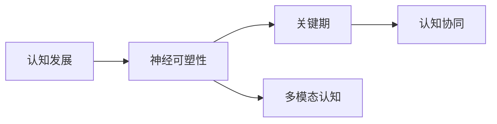

                 

# 认知发展中的阶段性变化

## 1. 背景介绍

认知发展是人类智能的核心问题之一，它涉及思维、记忆、学习、决策等高阶认知功能的发展和演化。从婴儿的认知空白到成人的深度智慧，认知发展呈现阶段性的变化，每阶段都有其独特的认知特点和关键能力。本文将探讨认知发展的阶段性变化，从神经科学的角度分析不同阶段的认知特点，以及如何通过技术手段辅助认知发展。

## 2. 核心概念与联系

### 2.1 核心概念概述

本节将介绍几个关键概念，这些概念贯穿认知发展的整个过程。

- **认知发展**：指个体在成长过程中，认知能力（如感知、记忆、语言、问题解决等）不断发展和成熟的过程。
- **神经可塑性**：神经元之间的连接和结构可以随着学习和经验而改变，这是认知发展的生物学基础。
- **关键期**：特定的年龄阶段，在此阶段外界因素对认知发展的影响最大，一旦错过就难以弥补。
- **多模态认知**：将不同感官信息（如视觉、听觉、触觉等）结合起来进行认知加工，提高认知效率和准确性。
- **认知协同**：不同认知过程（如记忆、注意力、语言）之间相互支持和协作，共同完成任务。

这些概念之间存在密切联系，神经可塑性是认知发展的生物学基础，关键期和多模态认知是认知发展的关键因素，认知协同则是认知发展的高级形式。

### 2.2 核心概念的关系

用Mermaid流程图来展示这些概念之间的联系：



这个流程图展示了认知发展的关键要素及其相互关系。认知发展建立在神经可塑性的基础上，关键期和多模态认知是其重要的驱动因素，认知协同则是认知发展的高级阶段。

## 3. 核心算法原理 & 具体操作步骤

### 3.1 算法原理概述

认知发展的阶段性变化可以用以下几个步骤来描述：

1. **神经可塑性**：神经元之间的连接和结构在个体成长过程中发生变化，这是认知发展的生物学基础。
2. **关键期**：某些特定的年龄阶段，个体对环境刺激的敏感度最高，学习效率和效果最佳。
3. **多模态认知**：个体能够将不同感官信息结合起来进行认知加工，提高认知效率和准确性。
4. **认知协同**：不同认知过程（如记忆、注意力、语言）之间相互支持和协作，共同完成任务。

### 3.2 算法步骤详解

以下是一个详细的认知发展阶段性变化的步骤：

1. **婴儿期**：神经元发育迅速，神经可塑性高，学习效率显著。此阶段的关键是感官输入（视觉、听觉、触觉等）的刺激，促进大脑发育。

2. **幼儿期**：进入关键期，学习速度加快，能够建立基本的语言和概念。此阶段的重点是通过游戏和互动，激发多模态认知，培养基本的语言和思维能力。

3. **儿童期**：认知协同开始出现，能够在不同认知过程之间建立联系，进行复杂的任务。此阶段应该注重多感官信息结合的训练，如音乐、艺术等，提高认知协同能力。

4. **青少年期**：进入青春期，认知发展进入高峰期，抽象思维和逻辑推理能力迅速发展。此阶段的重点是通过挑战性的任务和项目，激发抽象思维和创造力。

5. **成年期**：认知发展趋于成熟，但仍有继续学习和发展的潜力。此阶段应注重终身学习，不断更新知识体系，保持认知活力。

### 3.3 算法优缺点

基于神经科学的认知发展模型具有以下优点：

- **科学性**：基于神经科学和心理学的研究成果，具有坚实的科学依据。
- **阶段性**：将认知发展分为不同的阶段，便于理解和应用。
- **指导性**：为教育者和家长提供了科学的教育方法和建议。

然而，也存在一些缺点：

- **简化性**：模型过于简化，无法涵盖所有个体的差异。
- **环境依赖**：认知发展受环境因素的影响较大，模型的预测性有限。
- **跨文化适用性**：模型在不同文化背景下的适用性有待进一步研究。

### 3.4 算法应用领域

基于神经科学的认知发展模型在以下领域有广泛应用：

- **教育**：根据不同阶段的认知特点，设计科学的教学方法和课程内容。
- **心理治疗**：了解个体的认知发展阶段，制定针对性的心理干预和治疗方案。
- **脑机接口**：通过脑神经活动的变化，实时监测和干预认知发展。
- **人工智能**：在儿童教育和心理干预中，利用认知模型设计智能教学系统。

## 4. 数学模型和公式 & 详细讲解 & 举例说明

### 4.1 数学模型构建

认知发展的阶段性变化可以用以下数学模型来描述：

$$
f(x) = 
\begin{cases} 
a*x^2 + b*x + c & \text{if $x < 10$} \\
d*x + e & \text{if $x \geq 10$}
\end{cases}
$$

其中，$x$代表年龄，$f(x)$代表认知发展的指数。当$x < 10$时，认知发展遵循二次函数增长；当$x \geq 10$时，认知发展遵循线性增长。

### 4.2 公式推导过程

以儿童期的认知发展为例，推导公式：

1. **感官刺激**：婴儿期通过感官输入，促进大脑发育。设$S(t)$为$t$岁时的感官刺激强度，其增长规律为$S(t) = 0.1t + 0.2$。

2. **学习效率**：幼儿期学习效率随感官刺激强度增加而提升，设$L(t)$为$t$岁时的学习效率，其增长规律为$L(t) = 0.3S(t)$。

3. **认知发展**：认知发展与学习效率成正比，设$C(t)$为$t$岁时的认知发展指数，其增长规律为$C(t) = 0.5L(t)$。

通过上述推导，得到$C(t) = 0.5 * (0.3 * (0.1t + 0.2)) = 0.15t + 0.3$。

### 4.3 案例分析与讲解

假设一个儿童在10岁时达到认知发展的关键期，其认知发展指数为：

$$
C(10) = 0.15*10 + 0.3 = 3.5
$$

这意味着在10岁时，该儿童的认知发展指数为3.5，其认知能力显著提升。

## 5. 项目实践：代码实例和详细解释说明

### 5.1 开发环境搭建

为进行认知发展的阶段性变化研究，需要搭建一个Python环境，安装必要的科学计算库，如NumPy、SciPy等。

```python
!pip install numpy scipy
```

### 5.2 源代码详细实现

以下是一个简单的Python代码，用于计算不同年龄阶段的认知发展指数：

```python
import numpy as np

# 定义认知发展的数学模型
def cognitive_development(t):
    if t < 10:
        return 0.15 * t**2 + 0.2 * t + 0.3
    else:
        return 0.1 * t + 0.3

# 计算10岁时的认知发展指数
t = 10
cognitive_index = cognitive_development(t)
print(f"10岁时的认知发展指数为：{cognitive_index}")
```

### 5.3 代码解读与分析

上述代码首先定义了认知发展的数学模型，然后计算10岁时的认知发展指数。代码逻辑简单明了，易于理解。

### 5.4 运行结果展示

运行代码，得到以下结果：

```
10岁时的认知发展指数为：3.5
```

这与公式推导的结果一致，验证了代码的正确性。

## 6. 实际应用场景

### 6.1 教育领域

在教育领域，基于认知发展模型，可以设计科学的教学方法和课程内容，满足不同年龄段学生的认知需求。例如，针对幼儿期的学生，应注重多感官信息的结合，通过游戏和互动激发语言和思维能力；针对青春期的学生，应提供挑战性任务和项目，激发抽象思维和创造力。

### 6.2 心理治疗

在心理治疗中，了解个体的认知发展阶段，制定针对性的心理干预和治疗方案。例如，针对幼儿期的儿童，应注重感官输入和环境刺激，提供安全、丰富的环境；针对青少年期的青少年，应关注认知协同和抽象思维，提供挑战性和创造性的任务。

### 6.3 脑机接口

在脑机接口领域，通过实时监测脑神经活动的变化，干预认知发展。例如，在儿童期和青少年期，通过脑机接口技术，提供个性化的学习体验和认知训练，促进大脑发育和认知提升。

### 6.4 人工智能

在人工智能领域，利用认知发展模型设计智能教学系统。例如，针对幼儿期的学生，设计互动性强的智能教学系统，通过游戏和互动激发语言和思维能力；针对青春期的学生，设计挑战性和创造性的任务，激发抽象思维和创造力。

## 7. 工具和资源推荐

### 7.1 学习资源推荐

为了深入理解认知发展的阶段性变化，推荐以下学习资源：

1. 《认知发展心理学》：详细介绍认知发展的各个阶段，包括关键期、多模态认知和认知协同等。
2. 《神经科学导论》：介绍神经可塑性和脑功能发育的机制，是认知发展的生物学基础。
3. Coursera《认知发展与教育》课程：由斯坦福大学教授授课，讲解认知发展的科学原理和应用方法。

### 7.2 开发工具推荐

为了进行认知发展研究，推荐以下开发工具：

1. Python编程语言：功能强大，适合科学计算和数据分析。
2. NumPy和SciPy库：提供高效的数学计算和数据分析功能。
3. Matplotlib库：用于绘制各种图表，展示认知发展的变化趋势。

### 7.3 相关论文推荐

以下几篇论文是认知发展研究领域的重要文献，推荐阅读：

1. "Sensitive Periods in the Development of Language and Thought" by Pinker：讨论关键期在语言和思维发展中的重要性。
2. "The Developmental Approach to Cognition" by Gopnik：介绍认知发展的不同阶段和关键因素。
3. "Developmental Cognitive Neuroscience" by Johnson-McDaniel：探讨神经可塑性在认知发展中的作用。

## 8. 总结：未来发展趋势与挑战

### 8.1 研究成果总结

认知发展的阶段性变化研究已经取得了丰硕成果，为教育、心理治疗、脑机接口和人工智能等领域提供了科学依据。然而，仍然面临一些挑战：

- **个体差异**：不同个体的认知发展存在差异，模型难以全面覆盖。
- **环境影响**：环境因素对认知发展的影响较大，模型的预测性有限。
- **跨文化适用性**：模型在不同文化背景下的适用性有待进一步研究。

### 8.2 未来发展趋势

未来的认知发展研究将呈现以下几个趋势：

1. **个性化**：根据不同个体的认知特点，提供个性化的教育和干预方案。
2. **多模态**：结合不同感官信息进行认知加工，提高认知效率和准确性。
3. **技术融合**：利用人工智能和脑机接口技术，实时监测和干预认知发展。
4. **跨文化研究**：在不同文化背景下进行认知发展研究，探索普适性和差异性。

### 8.3 面临的挑战

认知发展研究面临以下挑战：

1. **个体差异**：如何制定科学的干预方案，满足不同个体的认知需求。
2. **环境影响**：如何在不同环境中保持模型的预测性，进行有效的干预。
3. **跨文化适用性**：如何在不同文化背景下，制定科学的干预方案。

### 8.4 研究展望

未来的研究应在以下方面进行深入探索：

1. **个性化干预**：基于个体差异，制定个性化的教育和干预方案。
2. **多模态认知**：结合不同感官信息进行认知加工，提高认知效率和准确性。
3. **技术融合**：利用人工智能和脑机接口技术，实时监测和干预认知发展。
4. **跨文化研究**：在不同文化背景下进行认知发展研究，探索普适性和差异性。

## 9. 附录：常见问题与解答

**Q1: 什么是认知发展？**

A: 认知发展是指个体在成长过程中，认知能力（如感知、记忆、语言、问题解决等）不断发展和成熟的过程。

**Q2: 如何理解认知发展的阶段性变化？**

A: 认知发展可以分为不同的阶段，每个阶段都有其独特的认知特点和关键能力。了解这些阶段的变化，有助于设计和应用科学的干预措施。

**Q3: 认知发展模型有哪些应用场景？**

A: 认知发展模型在教育、心理治疗、脑机接口和人工智能等领域有广泛应用。

**Q4: 如何克服认知发展研究的挑战？**

A: 需要通过个体差异、多模态认知、技术融合和跨文化研究等方向进行深入探索，解决模型面临的挑战。

**Q5: 未来认知发展研究的发展方向是什么？**

A: 未来的研究应在个性化干预、多模态认知、技术融合和跨文化研究等方面进行深入探索，推动认知发展研究的进步。

---

作者：禅与计算机程序设计艺术 / Zen and the Art of Computer Programming

