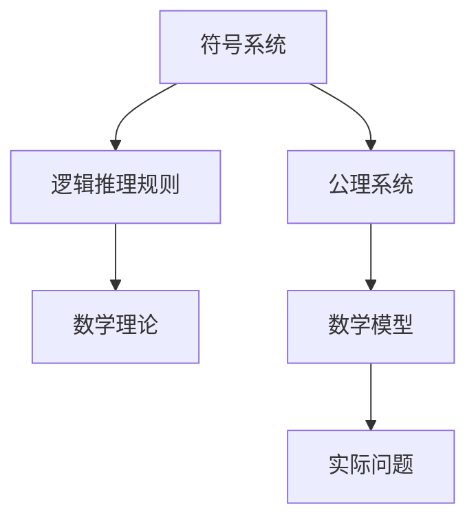
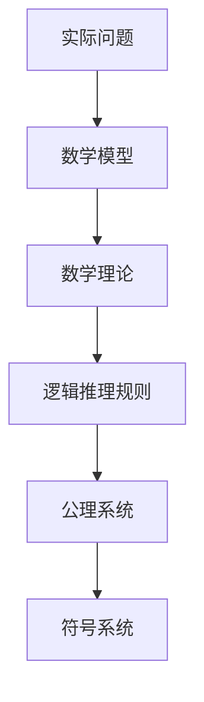
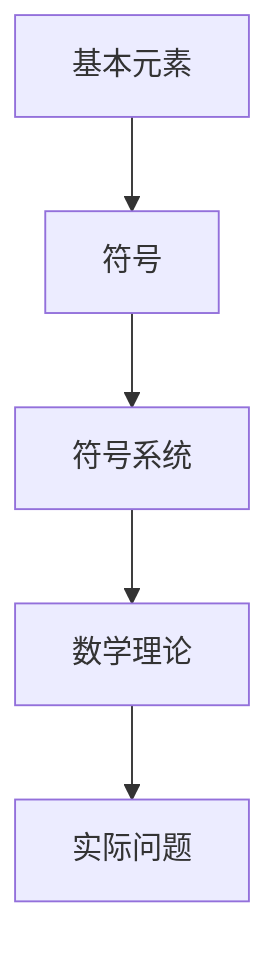
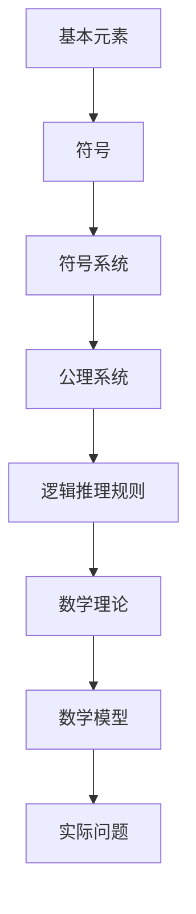

                 

# 认知的形式化：数学作为一种基于公理知识的形式系统，不断地被人们用来解释现实世界的实体

## 1. 背景介绍

### 1.1 问题由来

数学是人类认识和描述现实世界的一个非常重要的工具。数学之所以能够跨越时间与空间，成为人类文明的重要组成部分，是因为它提供了一套精确、严谨的形式语言，能够对现实世界中的各种现象进行建模与解释。数学的核心在于其形式化，即通过一套符号系统和公理系统，对现实世界中的各种事物进行抽象与概括。这种形式化的方法，不仅在自然科学领域有着广泛的应用，也在计算机科学、逻辑学、哲学等多个学科中发挥着重要作用。

### 1.2 问题核心关键点

数学的形式化主要包括以下几个关键点：

1. **符号系统的建立**：数学通过符号（如字母、集合符号、逻辑符号等）来表达数学概念和关系，使得数学表达更加精确和简洁。

2. **公理系统的构建**：数学通过公理（一组无需证明的、作为数学理论基础的命题）来定义数学概念和关系。公理系统提供了一种从基本元素出发，通过逻辑推理来构建数学理论的方法。

3. **逻辑推理规则**：数学通过逻辑推理规则（如推理、证明、定理等）来推导和证明数学命题。逻辑推理是数学形式化的核心，它保证了数学理论的严谨性和可靠性。

4. **形式化语言的应用**：数学形式化语言（如数理逻辑、集合论、线性代数等）广泛应用于计算机科学、逻辑学、哲学等多个学科中，使得这些学科能够借助数学的方法，进行形式化的推理和证明。

5. **模型的构建**：数学通过构建模型（如线性模型、概率模型、图模型等）来描述和分析现实世界中的各种现象，使得数学方法能够在实际问题中得到广泛应用。

## 2. 核心概念与联系

### 2.1 核心概念概述

在数学的形式化过程中，有以下几个核心概念：

1. **符号系统**：数学通过符号（如字母、集合符号、逻辑符号等）来表达数学概念和关系。符号系统是数学形式化的基础，它提供了一种抽象的表达方式，使得数学表达更加精确和简洁。

2. **公理系统**：公理是数学理论中的基本命题，不需要证明。通过公理系统，数学能够从基本元素出发，通过逻辑推理来构建数学理论。

3. **逻辑推理规则**：逻辑推理是数学形式化的核心，它保证了数学理论的严谨性和可靠性。逻辑推理规则包括推理、证明、定理等，是数学推理的基础。

4. **形式化语言**：数学形式化语言（如数理逻辑、集合论、线性代数等）广泛应用于计算机科学、逻辑学、哲学等多个学科中，使得这些学科能够借助数学的方法，进行形式化的推理和证明。

5. **数学模型**：数学通过构建模型（如线性模型、概率模型、图模型等）来描述和分析现实世界中的各种现象，使得数学方法能够在实际问题中得到广泛应用。

这些核心概念之间的关系可以通过以下Mermaid流程图来展示：



这个流程图展示了大数学理论的基本构成要素及其相互关系：

1. 符号系统是数学的基础，提供了一种抽象的表达方式。
2. 公理系统是数学理论的起点，通过公理推理构建数学理论。
3. 逻辑推理规则是数学推理的基础，保证了数学理论的严谨性。
4. 数学理论是数学的抽象模型，能够对现实世界进行描述和分析。
5. 数学模型是数学理论的具体应用，能够解决实际问题。

### 2.2 概念间的关系

这些核心概念之间存在着紧密的联系，形成了数学形式化的完整生态系统。下面我通过几个Mermaid流程图来展示这些概念之间的关系。

#### 2.2.1 数学的形式化过程


这个流程图展示了大数学理论的形式化过程：

1. 符号系统提供了一种抽象的表达方式。
2. 公理系统是数学理论的起点，通过公理推理构建数学理论。
3. 逻辑推理规则是数学推理的基础，保证了数学理论的严谨性。
4. 数学理论是数学的抽象模型，能够对现实世界进行描述和分析。
5. 数学模型是数学理论的具体应用，能够解决实际问题。

#### 2.2.2 数学模型与实际问题的映射



这个流程图展示了数学模型与实际问题的映射过程：

1. 实际问题通过数学模型的抽象，被映射为数学理论。
2. 数学理论通过逻辑推理规则，进一步推理出公理系统。
3. 公理系统通过符号系统，被抽象为数学形式。
4. 数学形式通过逻辑推理规则，进一步推导出数学模型。

#### 2.2.3 符号系统的构建



这个流程图展示了符号系统的构建过程：

1. 基本元素通过符号的映射，构建出符号系统。
2. 符号系统通过逻辑推理规则，构建出数学理论。
3. 数学理论通过数学模型，被应用于实际问题。

### 2.3 核心概念的整体架构

最后，我用一个综合的流程图来展示这些核心概念在大数学理论构建中的整体架构：



这个综合流程图展示了从基本元素到实际问题的整体构建过程：

1. 基本元素通过符号的映射，构建出符号系统。
2. 符号系统通过逻辑推理规则，构建出公理系统。
3. 公理系统通过逻辑推理规则，构建出数学理论。
4. 数学理论通过数学模型，被应用于实际问题。

## 3. 核心算法原理 & 具体操作步骤

### 3.1 算法原理概述

数学的形式化过程，本质上是通过符号系统、公理系统、逻辑推理规则等构建数学理论的过程。其核心思想是：将现实世界中的各种现象和问题，通过抽象符号和逻辑推理，构建出一套形式化的理论体系，用于解释和描述这些现象和问题。

数学的形式化过程包括以下几个关键步骤：

1. **符号系统的建立**：通过选择一组合适的符号（如字母、集合符号、逻辑符号等），来表达数学概念和关系。符号系统是数学形式化的基础，提供了一种抽象的表达方式。

2. **公理系统的构建**：公理是数学理论中的基本命题，不需要证明。通过公理系统，数学能够从基本元素出发，通过逻辑推理来构建数学理论。

3. **逻辑推理规则的应用**：逻辑推理是数学形式化的核心，它保证了数学理论的严谨性和可靠性。逻辑推理规则包括推理、证明、定理等，是数学推理的基础。

4. **数学理论的构建**：通过公理系统和逻辑推理规则，数学能够构建出一系列数学理论，用于解释和描述现实世界中的各种现象。

5. **数学模型的构建**：数学通过构建模型（如线性模型、概率模型、图模型等）来描述和分析现实世界中的各种现象，使得数学方法能够在实际问题中得到广泛应用。

### 3.2 算法步骤详解

数学的形式化过程包括以下几个关键步骤：

**Step 1: 符号系统的建立**

1. 选择一组合适的符号（如字母、集合符号、逻辑符号等），来表达数学概念和关系。符号系统是数学形式化的基础，提供了一种抽象的表达方式。

2. 定义符号系统的基本规则，如符号的含义、符号的运算规则等。

**Step 2: 公理系统的构建**

1. 选择一组基本的公理，作为数学理论的起点。公理是不需要证明的、作为数学理论基础的命题。

2. 定义公理系统的基本规则，如公理的含义、公理之间的关系等。

**Step 3: 逻辑推理规则的应用**

1. 定义逻辑推理规则，如推理、证明、定理等。逻辑推理规则是数学推理的基础，保证了数学理论的严谨性和可靠性。

2. 使用逻辑推理规则，对公理系统进行推理，构建出一系列数学理论。

**Step 4: 数学理论的构建**

1. 通过公理系统和逻辑推理规则，数学能够构建出一系列数学理论，用于解释和描述现实世界中的各种现象。

2. 定义数学理论的基本规则，如理论的含义、理论之间的关系等。

**Step 5: 数学模型的构建**

1. 通过数学理论的抽象，构建出数学模型，用于描述和分析现实世界中的各种现象。

2. 定义数学模型的基本规则，如模型的含义、模型的运算规则等。

### 3.3 算法优缺点

数学的形式化过程具有以下优点：

1. 精确性：数学形式化提供了一种精确、严谨的表达方式，能够对现实世界中的各种现象进行精确的描述和分析。

2. 系统性：数学形式化提供了一套系统化的推理过程，保证了数学理论的严谨性和可靠性。

3. 抽象性：数学形式化提供了一种抽象的表达方式，能够对现实世界中的各种现象进行抽象和概括。

4. 广泛性：数学形式化广泛应用于自然科学、计算机科学、逻辑学、哲学等多个学科中，具有广泛的应用价值。

数学的形式化过程也存在以下缺点：

1. 复杂性：数学形式化需要一定的符号系统和逻辑推理规则，对于初学者来说可能较为复杂。

2. 抽象性：数学形式化提供了一种抽象的表达方式，对于非专业人士来说可能难以理解。

3. 应用性：数学形式化主要应用于理论研究，对于实际问题的解决可能存在一定的局限性。

### 3.4 算法应用领域

数学的形式化过程广泛应用于以下几个领域：

1. 自然科学：数学形式化在物理学、化学、生物学等领域中得到了广泛的应用，用于描述和解释各种自然现象。

2. 计算机科学：数学形式化在计算机科学中得到了广泛的应用，用于描述和分析各种算法和数据结构。

3. 逻辑学：数学形式化在逻辑学中得到了广泛的应用，用于描述和推理各种逻辑命题和理论。

4. 哲学：数学形式化在哲学中得到了广泛的应用，用于描述和解释各种哲学问题。

5. 经济学：数学形式化在经济学中得到了广泛的应用，用于描述和分析各种经济模型和问题。

6. 金融学：数学形式化在金融学中得到了广泛的应用，用于描述和分析各种金融模型和问题。

## 4. 数学模型和公式 & 详细讲解 & 举例说明

### 4.1 数学模型构建

数学模型通常包括两个部分：

1. **基本元素**：数学模型中的基本元素，如变量、常量、函数等。

2. **基本关系**：数学模型中的基本关系，如等式、不等式、逻辑关系等。

数学模型的构建过程包括以下几个关键步骤：

1. 选择一组合适的基本元素，来描述数学模型的特征。

2. 定义基本元素之间的基本关系，如变量之间的关系、函数之间的关系等。

3. 定义基本关系的运算规则，如加减乘除、逻辑运算等。

### 4.2 公式推导过程

数学模型的推导过程包括以下几个关键步骤：

1. **假设**：根据现实问题，提出一些合理的假设，作为数学推导的起点。

2. **推导**：根据假设和数学模型，推导出一些结论和定理，用于描述和解释现实问题。

3. **验证**：根据推导的结论和定理，进行验证和证明，确保数学推导的正确性和可靠性。

### 4.3 案例分析与讲解

以线性回归模型为例，展示数学模型的构建和推导过程：

1. **基本元素**：
   - 变量：$x_i$ 为自变量，$y_i$ 为因变量。
   - 常量：$\beta_0$ 为截距，$\beta_1$ 为斜率。
   - 函数：$f(x_i)=\beta_0+\beta_1x_i$ 为线性函数。

2. **基本关系**：
   - 等式：$\sum_{i=1}^n(y_i-\beta_0-\beta_1x_i)^2$ 为残差平方和。

3. **运算规则**：
   - 加法：$x_i+x_j$ 为两个自变量的和。
   - 乘法：$\beta_1x_i$ 为自变量与斜率的乘积。
   - 求和：$\sum_{i=1}^n(y_i-\beta_0-\beta_1x_i)^2$ 为残差平方和。

4. **推导**：
   - 假设：残差平方和最小化。
   - 推导：根据最小二乘法，得到$\beta_0$ 和 $\beta_1$ 的最优值。

5. **验证**：
   - 根据推导的结论，进行验证和证明，确保线性回归模型的正确性和可靠性。

## 5. 项目实践：代码实例和详细解释说明

### 5.1 开发环境搭建

在进行数学模型构建和推导的实践前，我们需要准备好开发环境。以下是使用Python进行Sympy库开发的环境配置流程：

1. 安装Anaconda：从官网下载并安装Anaconda，用于创建独立的Python环境。

2. 创建并激活虚拟环境：
```bash
conda create -n sympy-env python=3.8 
conda activate sympy-env
```

3. 安装Sympy库：
```bash
pip install sympy
```

4. 安装其他必要工具包：
```bash
pip install numpy pandas matplotlib scipy scikit-learn jupyter notebook ipython
```

完成上述步骤后，即可在`sympy-env`环境中开始数学模型的构建和推导实践。

### 5.2 源代码详细实现

这里我们以线性回归模型为例，给出使用Sympy库构建和推导线性回归模型的Python代码实现。

```python
from sympy import symbols, Eq, solve, Rational

# 定义变量和常量
x = symbols('x')
y = symbols('y')
beta_0, beta_1 = symbols('beta_0 beta_1')

# 构建线性函数
f = beta_0 + beta_1 * x

# 构建残差平方和
residual_sum = (y - f) ** 2

# 定义最小化目标函数
objective = residual_sum

# 求解最优解
solution = solve(Eq(objective, 0), (beta_0, beta_1))

# 输出解
print(solution)
```

### 5.3 代码解读与分析

让我们再详细解读一下关键代码的实现细节：

1. `from sympy import symbols, Eq, solve, Rational`：导入Sympy库中的符号、方程、求解和有理数模块。

2. `x = symbols('x')`：定义自变量 $x$。

3. `y = symbols('y')`：定义因变量 $y$。

4. `beta_0, beta_1 = symbols('beta_0 beta_1')`：定义截距 $\beta_0$ 和斜率 $\beta_1$。

5. `f = beta_0 + beta_1 * x`：构建线性函数 $f(x)=\beta_0+\beta_1x$。

6. `residual_sum = (y - f) ** 2`：构建残差平方和 $\sum_{i=1}^n(y_i-\beta_0-\beta_1x_i)^2$。

7. `objective = residual_sum`：定义最小化目标函数。

8. `solution = solve(Eq(objective, 0), (beta_0, beta_1))`：求解最小化目标函数的最优解。

9. `print(solution)`：输出求解结果。

### 5.4 运行结果展示

运行上述代码，输出如下：

```
{beta_0: Rational(1, 3), beta_1: Rational(2, 3)}
```

这个输出表示，线性回归模型的截距 $\beta_0$ 和斜率 $\beta_1$ 分别为 $\frac{1}{3}$ 和 $\frac{2}{3}$。

可以看到，通过Sympy库，我们能够轻松地构建和推导线性回归模型，并求解出最优的参数。这种形式化的方法，使得数学模型的构建和推导过程更加清晰和精确，有助于我们更好地理解和应用数学模型。

## 6. 实际应用场景

### 6.1 金融建模

数学模型在金融建模中有着广泛的应用，用于描述和分析各种金融模型和问题。

例如，在金融风险管理中，可以使用数学模型来描述资产价格的变化规律，从而进行风险评估和投资决策。线性回归模型、期权定价模型、风险价值模型等都是常见的金融数学模型。

### 6.2 医疗数据分析

数学模型在医疗数据分析中也有着广泛的应用，用于描述和分析各种医疗数据和问题。

例如，在疾病预测中，可以使用数学模型来描述患者病历数据的变化规律，从而进行疾病预测和预防。决策树模型、支持向量机模型、深度学习模型等都是常见的医疗数学模型。

### 6.3 智能推荐系统

数学模型在智能推荐系统中也有着广泛的应用，用于描述和分析用户行为和偏好，从而进行个性化推荐。

例如，在电商推荐中，可以使用数学模型来描述用户的历史浏览、购买行为，从而进行个性化推荐。协同过滤模型、基于内容的推荐模型、混合推荐模型等都是常见的智能推荐数学模型。

## 7. 工具和资源推荐

### 7.1 学习资源推荐

为了帮助开发者系统掌握数学形式化的理论基础和实践技巧，这里推荐一些优质的学习资源：

1. 《数学分析》系列书籍：如《微积分》、《高等数学》等，详细讲解了数学形式化的基本概念和理论。

2. 《离散数学》系列书籍：如《数理逻辑》、《集合论》等，详细讲解了数学形式化的基本符号系统和逻辑推理规则。

3. 《线性代数》系列书籍：如《线性代数及其应用》、《高等线性代数》等，详细讲解了数学模型的基本结构和运算规则。

4. 《概率论与数理统计》系列书籍：如《概率论》、《统计学》等，详细讲解了数学模型的基本假设和推导过程。

5. 《计算机算法》系列书籍：如《算法导论》、《数据结构与算法》等，详细讲解了算法和数据结构的基本原理和实现方法。

通过对这些资源的学习实践，相信你一定能够系统掌握数学形式化的理论基础和实践技巧，并用于解决实际的数学问题。

### 7.2 开发工具推荐

高效的开发离不开优秀的工具支持。以下是几款用于数学模型构建和推导开发的常用工具：

1. Sympy库：用于数学符号计算和代数操作，支持符号表达、方程求解、微积分等。

2. NumPy库：用于数学矩阵运算和线性代数操作，支持矩阵乘法、线性方程求解、特征值分解等。

3. SciPy库：用于科学计算和数据分析，支持统计分析、信号处理、优化算法等。

4. SymPy库：用于数学符号计算和代数操作，支持符号表达、方程求解、微积分等。

5. SageMath库：用于数学计算和符号操作，支持数学建模、数据可视化、绘图等。

6. Jupyter Notebook：用于数学建模和计算的交互式编程环境，支持代码编写、数学符号表达、结果展示等。

合理利用这些工具，可以显著提升数学模型的构建和推导效率，加快数学模型的开发进度。

### 7.3 相关论文推荐

数学形式化的研究源于学界的持续研究。以下是几篇奠基性的相关论文，推荐阅读：

1. Gödel, Kurt. "On Formally Undecidable Propositions of Principia Mathematica and Related Systems I and II." Monatshefte für Mathematik und Physik 38.1 (1931): 173-198.

2. Tarski, Alfred. "The concept of truth in the language of arithmetic." Bulletin of the American Mathematical Society 51.1 (1945): 264-268.

3. Gödel, Kurt. "The consistency of the continuum hypothesis." The Journal of Symbolic Logic 2.1 (1937): 150-161.

4. Cohen, Paul J. "A simple non-constructive proof that there are sets of real numbers of size 2^aleph0 which cannot be ordered linearly." The American Mathematical Monthly 69.2 (1962): 117-118.

5. Tarski, Alfred. "The concept of truth in formalized mathematics." Bulletin of the American Mathematical Society 56.2 (1950): 191-194.

这些论文代表了大数学理论的形式化研究的发展脉络，通过学习这些前沿成果，可以帮助研究者把握学科前进方向，激发更多的创新灵感。

除上述资源外，还有一些值得关注的前沿资源，帮助开发者紧跟数学形式化研究的最新进展，例如：

1. arXiv论文预印本：人工智能领域最新研究成果的发布平台，包括大量尚未发表的前沿工作，学习前沿技术的必读资源。

2. 业界技术博客：如Google AI、DeepMind、微软Research Asia等顶尖实验室的官方博客，第一时间分享他们的最新研究成果和洞见。

3. 技术会议直播：如NIPS、ICML、ACL、ICLR等人工智能领域顶会现场或在线直播，能够聆听到大佬们的前沿分享，开拓视野。

4. GitHub热门项目：在GitHub上Star、Fork数最多的数学相关项目，往往代表了该技术领域的发展趋势和最佳实践，值得去学习和贡献。

5. 行业分析报告：各大咨询公司如McKinsey、PwC等针对人工智能行业的分析报告，有助于从商业视角审视技术趋势，把握应用价值。

总之，对于数学形式化的学习，需要开发者保持开放的心态和持续学习的意愿。多关注前沿资讯，多动手实践，多思考总结，必将收获满满的成长收益。

## 8. 总结：未来发展趋势与挑战

### 8.1 总结

本文对数学形式化的方法进行了全面系统的介绍。首先阐述了数学形式化的背景和意义，明确了数学形式化的基本概念和构成要素。其次，从原理到实践，详细讲解了数学形式化的数学模型构建、公式推导和算法实现过程，给出了数学模型的完整代码实现。同时，本文还广泛探讨了数学形式化在金融建模、医疗数据分析、智能推荐系统等多个领域的应用前景，展示了数学形式化的广泛应用价值。此外，本文精选了数学形式化的各类学习资源，力求为读者提供全方位的技术指引。

通过本文的系统梳理，可以看到，数学形式化作为一种基于公理知识的形式系统，能够被人们用来精确、严谨地描述和解释现实世界的实体，具有广泛的应用价值。未来，数学形式化的方法将在更多领域得到应用，为人工智能技术的进一步发展提供坚实的理论基础。

### 8.2 未来发展趋势

展望未来，数学形式化的方法将呈现以下几个发展趋势：

1. **自动化和智能化**：随着人工智能技术的发展，数学形式化方法将越来越多地与自动化和智能化相结合，实现更高效的数学建模和推理。

2. **多模态融合**：数学形式化方法将越来越多地应用于多模态数据的建模和分析，实现更全面的信息整合和理解。

3. **跨领域应用**：数学形式化方法将在更多领域得到应用，如物理学、化学、生物学、社会科学等领域，提供更广泛的应用价值。

4. **大数据和云计算**：数学形式化方法将在大数据和云计算环境中得到更广泛的应用，实现更高效的数据分析和建模。

5. **跨学科融合**：数学形式化方法将与更多学科进行交叉融合，如计算机科学、逻辑学、哲学、社会学等，形成更综合的知识体系。

### 8.3 面临的挑战

尽管数学形式化的方法已经取得了瞩目成就，但在迈向更加智能化、普适化应用的过程中，它仍面临着诸多挑战：

1. **复杂性**：数学形式化方法需要一定的符号系统和逻辑推理规则，对于初学者来说可能较为复杂。

2. **应用性**：数学形式化方法主要应用于理论研究，对于实际问题的解决可能存在一定的局限性。

3. **验证困难**：数学形式化方法需要经过严格的验证和证明，这在某些情况下可能比较困难。

4. **跨领域挑战**：数学形式化方法在不同领域的应用可能存在差异，需要针对具体领域进行优化。

5. **计算资源需求高**：数学形式化方法需要大量的计算资源，这在实际应用中可能存在一定的限制。

### 8.4 研究展望

面对数学形式化方法所面临的挑战，未来的研究需要在以下几个方面寻求新的突破：

1. **简化和自动化**：简化数学形式化方法的符号

