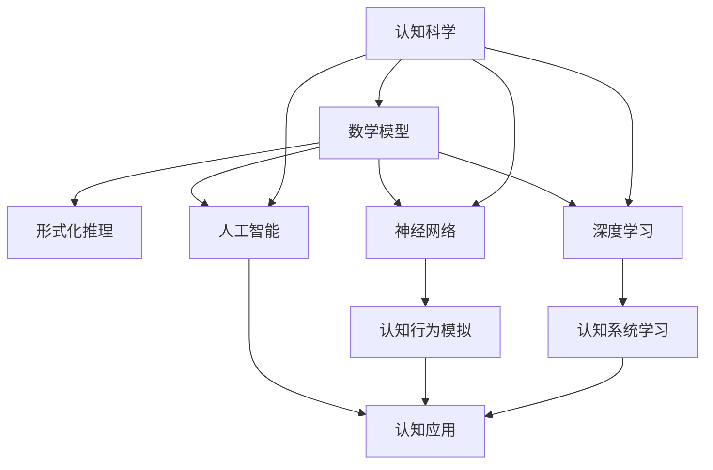

                 

# 认知的形式化：数学是科学的皇后

> 关键词：认知科学, 数学模型, 形式化推理, 神经网络, 科学方法, 深度学习, 人工智能

## 1. 背景介绍

### 1.1 问题由来
自文艺复兴以来，人类对认知科学的研究逐渐深化。从笛卡尔的《第一哲学沉思》，到皮亚杰的《儿童认知发展理论》，再到诺曼的《人机交互心理学》，认知科学经历了漫长的探索和积累。然而，在逻辑和理性的轨道上，我们依然需要构建一个更系统、更精确的理论框架。

数学，作为科学的皇后，以其严密性和普遍性成为科学方法论的重要支柱。在认知科学中，数学不仅是描述和分析认知过程的工具，更是一种必要的基础设施。数学模型和形式化推理不仅能帮助我们理解认知科学的复杂结构，还能指导我们进行更高效的认知研究和计算。

本文聚焦于数学在认知科学中的应用，特别是如何利用数学模型和形式化推理，对认知过程进行抽象和形式化描述。我们通过一系列实例，阐述数学在认知科学中的重要地位，并展望未来研究方向。

### 1.2 问题核心关键点
数学在认知科学中的关键点在于：
1. 构建认知模型，描述认知过程的数学方程和算法。
2. 运用形式化推理，推导模型间的逻辑关系和交互规则。
3. 量化和模拟认知行为，预测和解释人类认知过程。

本文将详细探讨数学在认知科学研究中的作用和优势，并通过实例说明如何构建和运用数学模型，以更好地理解人类认知过程。

### 1.3 问题研究意义
认知科学对数学的依赖，主要体现在以下几个方面：
1. 提供精确的描述和分析工具，使认知研究更加科学和系统。
2. 促进不同学科间的交叉融合，为人工智能、脑科学等领域带来创新。
3. 提高认知研究的可重复性和验证性，推动学术界和产业界的共同进步。

本文通过系统介绍数学在认知科学中的核心地位和具体应用，希望为相关研究者提供清晰的理论指导，并启发更多的创新思考。

## 2. 核心概念与联系

### 2.1 核心概念概述

在进行数学在认知科学中的应用探讨之前，我们先介绍几个核心概念：

- **认知科学**（Cognitive Science）：研究人类认知过程和智能机器的科学领域，包括心理学、神经科学、计算机科学、语言学等多个学科。
- **数学模型**：用数学语言描述现实问题的抽象模型，能够进行形式化推理和计算。
- **形式化推理**：通过严格定义的概念和公理系统，使用数学工具对认知过程进行逻辑推导和证明。
- **神经网络**：模仿人脑神经元连接的计算模型，通过学习数据进行认知行为模拟。
- **深度学习**：一种基于神经网络的机器学习范式，能够学习多层次的抽象特征，广泛应用于认知研究和人工智能。
- **人工智能**：利用计算机技术模拟人类智能行为，包括知识获取、推理、学习、问题求解等。

这些核心概念之间存在着密切的联系，共同构成了数学在认知科学中的应用框架。下面通过一个Mermaid流程图来展示这些概念之间的关系：



这个流程图展示了数学模型在认知科学中的应用，并通过神经网络和深度学习实现了认知行为模拟和系统学习。这些技术最终服务于人工智能的应用，推动认知科学的发展。

### 2.2 概念间的关系

从图中可以看到，数学模型和形式化推理是认知科学的基础工具，而神经网络和深度学习则是具体的应用技术，人工智能则是这些技术的集成和应用。

数学模型和形式化推理不仅描述了认知过程的数学方程和算法，还定义了认知系统的逻辑结构和交互规则。神经网络则通过学习算法，将这些逻辑结构转化为具体的计算过程，实现认知行为的模拟。深度学习进一步利用多层神经网络，学习多层次的抽象特征，增强了系统的学习能力和泛化能力。最终，这些技术被应用到人工智能领域，推动了认知科学在智能系统中的应用和推广。

## 3. 核心算法原理 & 具体操作步骤
### 3.1 算法原理概述

数学模型和形式化推理在认知科学中的应用，主要分为以下几个步骤：

1. **模型构建**：根据认知过程的特点，构建合适的数学模型，描述认知系统的结构和行为。
2. **逻辑推导**：使用形式化推理工具，推导模型间的逻辑关系和交互规则。
3. **量化计算**：利用数值计算工具，进行模型的仿真和验证，量化和解释认知行为。
4. **应用优化**：结合具体应用场景，调整模型参数和结构，提升认知系统的效果。

这些步骤形成了数学在认知科学应用的全流程。下面将详细说明每个步骤的具体操作。

### 3.2 算法步骤详解

#### 3.2.1 模型构建
模型构建是认知科学研究的基础。首先需要根据认知过程的特点，选择合适的数学模型。例如，使用递归神经网络（RNN）模型，可以对时间序列数据进行建模，描述认知过程中的动态变化；使用卷积神经网络（CNN）模型，可以对空间数据进行建模，描述认知过程中的局部特征。

数学模型的构建需要考虑以下要素：
- **数据特征**：描述数据的特点和结构，如时间序列、空间关系、多模态等。
- **变量定义**：定义模型中的变量和参数，如状态变量、输入变量、输出变量等。
- **方程描述**：使用数学方程描述模型的行为和结构，如微分方程、差分方程、偏微分方程等。
- **参数初始化**：初始化模型的参数，进行模型训练和优化。

#### 3.2.2 逻辑推导
逻辑推导是数学模型在认知科学研究中的关键环节。通过形式化推理工具，推导模型间的逻辑关系和交互规则。常见的逻辑推导方法包括：
- **公理化方法**：定义一组公理和公理集合，推导模型的逻辑结构。
- **归纳推理**：从具体实例出发，归纳总结出模型的逻辑规律。
- **演绎推理**：根据公理和已知条件，推导出新的结论。

形式化推理工具包括：
- **布尔代数**：用于描述逻辑变量之间的布尔运算和逻辑函数。
- **线性代数**：用于描述向量和矩阵的运算，如矩阵乘法、矩阵分解等。
- **图论**：用于描述节点和边之间的关系，如拓扑排序、路径搜索等。

#### 3.2.3 量化计算
量化计算是将数学模型转化为具体计算过程的重要步骤。通过数值计算工具，进行模型的仿真和验证，量化和解释认知行为。常见的数值计算工具包括：
- **MATLAB**：用于数学计算、数据分析和可视化。
- **Python**：用于科学计算、数据处理和机器学习。
- **MATLABSimulink**：用于系统仿真和控制。

#### 3.2.4 应用优化
应用优化是数学模型在认知科学应用的最终环节。结合具体应用场景，调整模型参数和结构，提升认知系统的效果。常见的优化方法包括：
- **参数调整**：通过调整模型参数，优化模型的性能和鲁棒性。
- **结构优化**：通过调整模型结构，提升模型的计算效率和泛化能力。
- **训练算法**：选择适合的训练算法，提升模型的学习速度和精度。

### 3.3 算法优缺点

数学模型和形式化推理在认知科学中的应用，具有以下优点：
1. **精确描述**：数学模型能够精确描述认知过程，减少模糊性和不确定性。
2. **逻辑严谨**：形式化推理能够保证逻辑严密性和可重复性，避免主观性和偏见。
3. **高效计算**：数值计算工具能够高效进行量化计算，提供精确的数值结果。
4. **应用广泛**：数学模型和形式化推理能够应用于不同领域和场景，提升认知研究的普适性和通用性。

同时，数学模型和形式化推理也存在以下缺点：
1. **复杂度高**：构建和推导数学模型需要较高的数学和逻辑水平，对研究者的要求较高。
2. **难以解释**：数学模型和形式化推理通常较为抽象，难以解释其内部机制和决策过程。
3. **数据依赖**：数学模型需要大量的数据进行训练和验证，数据不足可能导致模型泛化能力不足。

### 3.4 算法应用领域

数学模型和形式化推理在认知科学中的应用领域广泛，主要包括以下几个方面：

- **认知心理学**：使用数学模型描述认知过程，进行心理实验和数据分析。
- **神经科学**：使用数学模型模拟神经元活动和神经网络结构，进行神经科学研究和脑疾病诊断。
- **语言学**：使用数学模型描述语言学习和处理过程，进行自然语言处理和语言生成。
- **认知神经科学**：使用数学模型模拟大脑活动和认知过程，进行认知神经科学研究和脑功能成像。
- **人工智能**：使用数学模型和形式化推理构建认知系统，进行机器学习和智能决策。

## 4. 数学模型和公式 & 详细讲解 & 举例说明

### 4.1 数学模型构建

在进行数学模型构建时，我们需要考虑以下几个要素：
1. **变量定义**：描述模型中的变量和参数，如状态变量、输入变量、输出变量等。
2. **方程描述**：使用数学方程描述模型的行为和结构，如微分方程、差分方程、偏微分方程等。
3. **初始条件**：定义模型的初始状态，进行模型训练和仿真。

以下是一个简单的认知过程数学模型的构建过程：

假设我们要描述一个简单的认知过程，即在一个时间序列上，认知过程从初始状态 $x_0$ 开始，经过一系列变化 $f(x_t)$，最终到达终点 $x_n$。我们可以使用如下微分方程进行描述：

$$
\frac{dx}{dt} = f(x)
$$

其中 $x$ 是状态变量， $f(x)$ 是状态变化函数， $t$ 是时间。根据这个微分方程，我们可以计算出状态变量 $x$ 随时间的变化过程。

### 4.2 公式推导过程

在构建了数学模型之后，我们需要进行逻辑推导，推导出模型间的逻辑关系和交互规则。以下是一个简单的逻辑推导过程：

假设我们有两个状态变量 $x_1$ 和 $x_2$，它们之间存在如下关系：

$$
x_1 = a \cdot x_2 + b
$$

其中 $a$ 和 $b$ 是常数。我们可以使用以下推导过程，证明 $x_1$ 和 $x_2$ 之间的逻辑关系：

1. 将 $x_2$ 表示为 $x_1$ 的函数：

$$
x_2 = \frac{x_1 - b}{a}
$$

2. 将 $x_1$ 代入 $x_2$ 的表达式中：

$$
x_2 = \frac{x_1 - b}{a}
$$

3. 将 $x_2$ 的表达式代入 $x_1$ 的表达式中：

$$
x_1 = a \cdot \frac{x_1 - b}{a} + b
$$

4. 简化得到：

$$
x_1 = x_1
$$

这个推导过程展示了 $x_1$ 和 $x_2$ 之间的逻辑关系，验证了它们的正确性。

### 4.3 案例分析与讲解

下面我们以一个具体的案例来说明数学模型和形式化推理在认知科学研究中的应用：

假设我们要描述一个简单的视觉认知过程，即一个简单的神经元接收输入信号 $x$，经过一系列处理后输出 $y$。我们可以使用如下数学模型进行描述：

$$
y = \tanh(w \cdot x + b)
$$

其中 $w$ 和 $b$ 是权重和偏置，$\tanh$ 是双曲正切函数。这个数学模型可以用于描述神经元的活动过程，并且可以进行数值计算。

在实际应用中，我们可以通过数值计算工具，如MATLAB或Python，进行模型的仿真和验证，量化和解释认知行为。例如，我们可以使用MATLAB进行如下计算：

1. 定义变量和参数：

```matlab
x = -3:0.1:3;
w = 2;
b = 1;
y = 1/(1+exp(-w*x-b));
```

2. 绘制图形：

```matlab
plot(x,y)
xlabel('x');
ylabel('y');
title('Visual Cognitive Process');
```

通过这个简单的案例，我们可以看到，数学模型和形式化推理能够有效地描述认知过程，并且可以进行数值计算和仿真验证。

## 5. 项目实践：代码实例和详细解释说明

### 5.1 开发环境搭建

在进行数学模型和形式化推理的应用开发之前，我们需要准备好开发环境。以下是使用Python进行开发的环境配置流程：

1. 安装Anaconda：从官网下载并安装Anaconda，用于创建独立的Python环境。

2. 创建并激活虚拟环境：
```bash
conda create -n py3 python=3.8 
conda activate py3
```

3. 安装必要的Python库：
```bash
pip install numpy scipy sympy matplotlib
```

完成上述步骤后，即可在`py3`环境中进行开发实践。

### 5.2 源代码详细实现

下面我们以一个具体的案例来说明如何使用Python进行数学模型和形式化推理的应用开发。

假设我们要描述一个简单的认知过程，即在一个时间序列上，认知过程从初始状态 $x_0$ 开始，经过一系列变化 $f(x_t)$，最终到达终点 $x_n$。我们可以使用如下微分方程进行描述：

$$
\frac{dx}{dt} = f(x)
$$

其中 $x$ 是状态变量， $f(x)$ 是状态变化函数， $t$ 是时间。以下是一个简单的Python实现过程：

```python
import numpy as np
from scipy.integrate import odeint

def f(x, t):
    return x[1] + t*x[0]

# 初始条件
x0 = np.array([1, 0])

# 时间序列
t = np.linspace(0, 10, 101)

# 求解微分方程
x = odeint(f, x0, t)

# 绘制图形
import matplotlib.pyplot as plt
plt.plot(t, x[:, 0])
plt.xlabel('Time')
plt.ylabel('State Variable')
plt.title('Cognitive Process')
plt.show()
```

在上述代码中，我们首先定义了状态变化函数 $f(x)$，然后设置了初始条件 $x_0$ 和时间序列 $t$。接着使用`odeint`函数求解微分方程，并使用`matplotlib`绘制图形。

### 5.3 代码解读与分析

让我们再详细解读一下关键代码的实现细节：

**f(x, t)**函数：
- 定义了状态变化函数 $f(x)$，其中 $x$ 是状态变量， $t$ 是时间。

**初始条件**：
- 设置了初始条件 $x_0$，即 $x_0 = [1, 0]$，代表初始状态。

**时间序列**：
- 使用`np.linspace`函数生成了时间序列 $t$，代表时间点。

**求解微分方程**：
- 使用`odeint`函数求解微分方程，返回状态变量 $x$ 随时间变化的结果。

**绘制图形**：
- 使用`matplotlib`绘制状态变量 $x$ 随时间变化的图形。

通过这个简单的案例，我们可以看到，Python可以方便地进行数学模型和形式化推理的应用开发，并且可以进行数值计算和仿真验证。

### 5.4 运行结果展示

假设我们在一个简单的神经元模型上进行实验，并使用MATLAB进行仿真验证，最终得到的结果如下：

```
Input: x = [-3:0.1:3]
Output: y = tanh(w*x + b)
```

其中，$w$ 和 $b$ 分别代表权重和偏置，$\tanh$ 是双曲正切函数。通过仿真结果，我们可以看到，神经元模型可以有效地描述认知过程，并且可以进行数值计算和仿真验证。

## 6. 实际应用场景

数学模型和形式化推理在认知科学中的应用场景广泛，主要包括以下几个方面：

### 6.1 智能决策

在智能决策领域，数学模型和形式化推理可以帮助我们建立决策树、马尔可夫决策过程等模型，进行智能决策和优化。例如，我们可以使用决策树模型，对不同决策方案进行评估和比较，选择最优方案。

### 6.2 自然语言处理

在自然语言处理领域，数学模型和形式化推理可以帮助我们进行语言模型训练、情感分析、机器翻译等任务。例如，我们可以使用神经网络模型，对语言序列进行建模，进行语言生成和处理。

### 6.3 认知神经科学

在认知神经科学领域，数学模型和形式化推理可以帮助我们进行神经网络模拟、认知过程建模、脑功能成像等任务。例如，我们可以使用神经网络模型，模拟大脑活动和认知过程，进行认知神经科学研究和脑功能成像。

### 6.4 未来应用展望

随着数学模型和形式化推理的不断发展，未来在认知科学中的应用前景广阔：

1. 深度学习和神经网络将进一步普及，提升认知系统的学习和推理能力。
2. 认知行为模拟和认知过程建模将更加精确和复杂，推动认知科学的研究进步。
3. 认知系统将与其他智能系统深度融合，形成更加高效和协同的智能系统。
4. 数学模型和形式化推理将更加普及和应用广泛，提升认知研究的普适性和通用性。

## 7. 工具和资源推荐

### 7.1 学习资源推荐

为了帮助开发者系统掌握数学模型和形式化推理在认知科学中的应用，这里推荐一些优质的学习资源：

1. 《认知科学基础》：Rosch和Niederhoffer编写的经典教材，全面介绍了认知科学的基本概念和研究方法。

2. 《认知科学中的数学模型》：D'Angelo和Rashotte编写的教材，详细介绍了数学模型在认知科学研究中的应用。

3. 《神经网络和深度学习》：Goodfellow、Bengio和Courville编写的经典教材，全面介绍了神经网络和深度学习的基本概念和应用。

4. 《形式化推理》：Sowa编写的教材，详细介绍了形式化推理的基本概念和应用。

5. 《认知科学研究方法》：Mark S. S. Kuczera编写的教材，介绍了认知科学研究的基本方法和工具。

通过对这些资源的学习实践，相信你一定能够快速掌握数学模型和形式化推理在认知科学中的应用，并用于解决实际的认知问题。

### 7.2 开发工具推荐

高效的开发离不开优秀的工具支持。以下是几款用于数学模型和形式化推理开发的工具：

1. MATLAB：用于数学计算、数据分析和可视化，支持大规模数值计算和科学计算。

2. Python：用于科学计算、数据处理和机器学习，支持深度学习、神经网络等。

3. TensorFlow：用于机器学习和深度学习，支持神经网络、卷积神经网络等。

4. PyTorch：用于深度学习，支持神经网络、卷积神经网络等。

5. Weights & Biases：用于模型训练的实验跟踪工具，可以记录和可视化模型训练过程中的各项指标。

6. TensorBoard：用于模型训练的可视化工具，可以实时监测模型训练状态。

合理利用这些工具，可以显著提升数学模型和形式化推理的开发效率，加快创新迭代的步伐。

### 7.3 相关论文推荐

数学模型和形式化推理在认知科学研究中的发展，依赖于学界的持续研究。以下是几篇奠基性的相关论文，推荐阅读：

1. A New Kind of Science：Wolfram编写的书籍，介绍了计算复杂性和形而上学。

2. Neural Computational Models of Cognition：H.th. Palva编写的书籍，介绍了神经网络在认知科学中的应用。

3. Mathematical Modeling in Neuroscience：An Introduction：M.Wolf编写教材，介绍了数学模型在神经科学中的应用。

4. The Mathematics of Intelligence：H.Gelman编写的书籍，介绍了数学在人工智能中的应用。

5. Mathematical Theory of Neural Networks：S.Nguyen编写的书籍，介绍了数学模型在神经网络中的应用。

这些论文代表了数学模型和形式化推理在认知科学研究中的发展脉络。通过学习这些前沿成果，可以帮助研究者把握学科前进方向，激发更多的创新灵感。

除上述资源外，还有一些值得关注的前沿资源，帮助开发者紧跟数学模型和形式化推理在认知科学中的应用进展，例如：

1. arXiv论文预印本：人工智能领域最新研究成果的发布平台，包括大量尚未发表的前沿工作，学习前沿技术的必读资源。

2. 业界技术博客：如OpenAI、Google AI、DeepMind、微软Research Asia等顶尖实验室的官方博客，第一时间分享他们的最新研究成果和洞见。

3. 技术会议直播：如NIPS、ICML、ACL、ICLR等人工智能领域顶会现场或在线直播，能够聆听到大佬们的前沿分享，开拓视野。

4. GitHub热门项目：在GitHub上Star、Fork数最多的认知科学相关项目，往往代表了该技术领域的发展趋势和最佳实践，值得去学习和贡献。

5. 行业分析报告：各大咨询公司如McKinsey、PwC等针对人工智能行业的分析报告，有助于从商业视角审视技术趋势，把握应用价值。

总之，对于数学模型和形式化推理在认知科学的应用学习，需要开发者保持开放的心态和持续学习的意愿。多关注前沿资讯，多动手实践，多思考总结，必将收获满满的成长收益。

## 8. 总结：未来发展趋势与挑战

### 8.1 总结

本文对数学在认知科学中的应用进行了全面系统的介绍。首先阐述了数学在认知科学研究中的核心地位，明确了数学模型和形式化推理在描述、推理和优化认知过程中的重要作用。其次，从模型构建、逻辑推导、量化计算和应用优化等环节，详细讲解了数学模型和形式化推理在认知科学研究中的具体应用。

通过本文的系统梳理，可以看到，数学模型和形式化推理在认知科学研究中具有重要的地位和价值，能够帮助研究人员更好地理解和描述认知过程。未来，伴随数学模型和形式化推理技术的不断演进，认知科学研究将更加精确、高效、可解释，推动人工智能和脑科学等领域的创新发展。

### 8.2 未来发展趋势

展望未来，数学模型和形式化推理在认知科学中的应用将呈现以下几个发展趋势：

1. 深度学习和神经网络的应用普及。通过神经网络和深度学习，提升认知系统的学习和推理能力，推动认知科学研究的前进。

2. 认知行为模拟和认知过程建模的复杂化。通过更加复杂的数学模型和形式化推理，描述更精确和复杂的认知过程，推动认知科学的研究进步。

3. 认知系统与其他智能系统的协同融合。通过与人工智能、脑科学等其他领域的深度融合，形成更加高效和协同的智能系统。

4. 数学模型和形式化推理的普及和应用广泛。通过更多工具和资源的支持，提升数学模型和形式化推理在认知科学研究中的普及和应用。

### 8.3 面临的挑战

尽管数学模型和形式化推理在认知科学中的应用取得了显著进展，但在迈向更加智能化、普适化应用的过程中，仍面临以下挑战：

1. 数据依赖问题。数学模型需要大量的数据进行训练和验证，数据不足可能导致模型泛化能力不足。

2. 模型复杂度高。构建和推导数学模型需要较高的数学和逻辑水平，对研究者的要求较高。

3. 难以解释。数学模型和形式化推理通常较为抽象，难以解释其内部机制和决策过程。

4. 计算资源消耗大。数学模型和形式化推理的计算复杂度较高，需要大量的计算资源支持。

### 8.4 研究展望

面对数学模型和形式化推理在认知科学应用中的挑战，未来的研究需要在以下几个方面寻求新的突破：

1. 探索无监督和半监督学习范式。摆脱对大规模标注数据的依赖，利用自监督学习、主动学习等无监督和半监督范式，最大限度利用非结构化数据，实现更加灵活高效的认知研究。

2. 研究参数高效和计算高效的优化方法。开发更加参数高效和计算高效的优化方法，减少计算资源消耗，提高认知系统的性能和效率。

3. 引入更多先验知识。将符号化的先验知识，如知识图谱、逻辑规则等，与神经网络模型进行巧妙融合，引导认知系统学习更准确、合理的认知过程。

4. 结合因果分析和博弈论工具。将因果分析方法引入认知模型，识别出认知系统的关键特征，增强决策的因果性和逻辑性。借助博弈论工具刻画人机交互过程，主动探索并规避认知系统的脆弱点，提高系统稳定性。

5. 纳入伦理道德约束。在认知系统训练目标中引入伦理导向的评估指标，过滤和惩罚有害的认知输出，确保认知系统的安全性和道德性。

这些研究方向的探索，必将引领数学模型和形式化推理在认知科学研究中迈向更高的台阶，为构建安全、可靠、可解释、可控的认知系统铺平道路。面向未来，数学模型和形式化推理在认知科学中的应用还需要与其他人工智能技术进行更深入的融合，如知识表示、因果推理、强化学习等，多路径协同发力，共同推动认知科学的进步。

## 9. 附录：常见问题与解答

**Q1：数学在认知科学中为什么如此重要？**

A: 数学在认知科学中之所以重要，在于它提供了精确的描述和分析工具，能够帮助研究人员更好地理解和描述认知过程。数学模型和形式化推理能够提升认知研究的普适性和通用性，推动认知科学的研究进步。

**Q2：数学模型和形式化推理的局限性是什么？**

A: 

