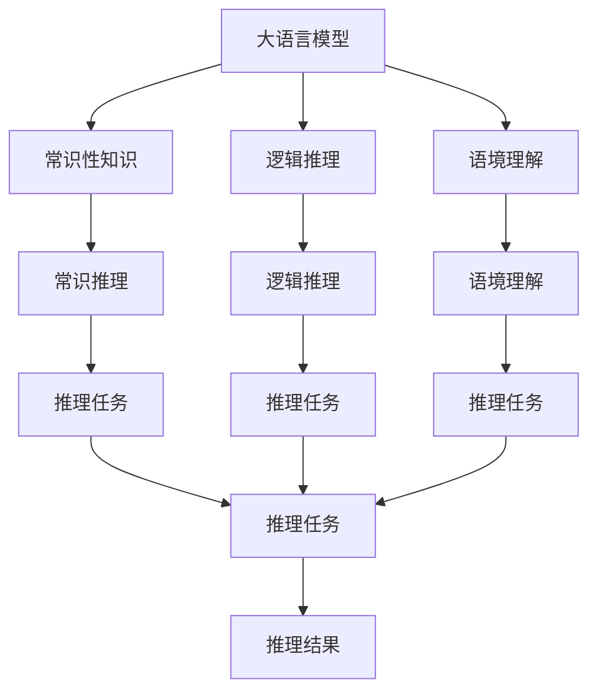
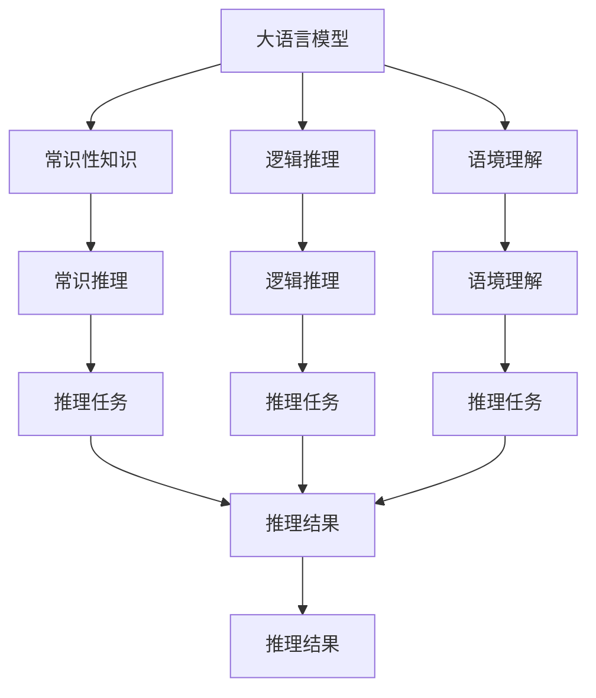
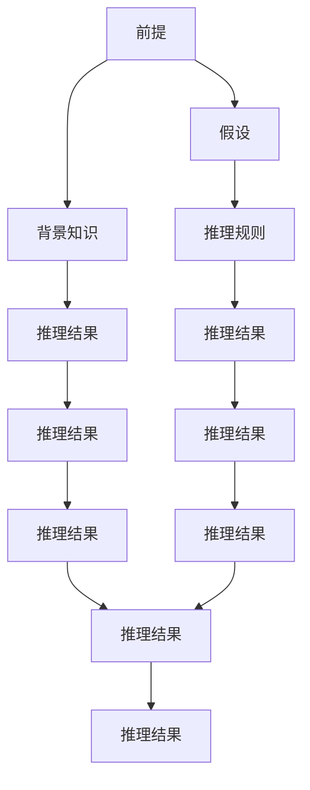
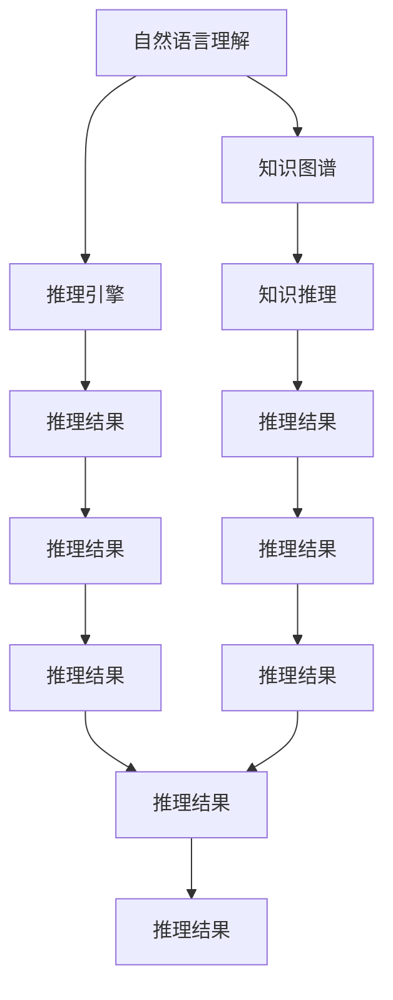
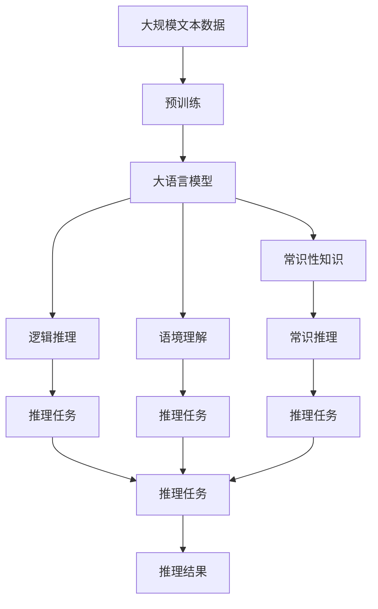

                 

# 语言≠思维：大模型的推理障碍

> 关键词：大语言模型,推理障碍,语言理解,思维模拟,知识迁移,对话系统,自然语言处理(NLP)

## 1. 背景介绍

### 1.1 问题由来

近年来，深度学习技术和大语言模型（LLMs）在自然语言处理（NLP）领域取得了显著进展，尤其是大型预训练语言模型如BERT、GPT等，在众多NLP任务上达到了新的高度。但与此同时，这些模型在推理任务上的表现仍然存在显著的局限，往往无法有效地解决推理中的高级逻辑、常识推理、语境理解等问题。这一现象引发了学界对大模型“推理障碍”的广泛关注，亟需深入分析和改进。

### 1.2 问题核心关键点

大语言模型的推理障碍主要体现在以下几个方面：

- 缺乏常识性知识。虽然预训练模型学习了大量的语言知识，但对日常生活中的常识性知识理解有限，难以在推理任务中准确应用。
- 推理能力不足。模型在处理逻辑推理、语境理解和复杂的语言结构时，往往表现出一定的困难，容易产生错误推理。
- 推理泛化能力差。模型在推理过程中，对于不同的上下文和任务，推理效果不一致，缺乏跨领域的泛化能力。
- 推理过程黑盒化。大模型的推理过程缺乏可解释性，难以理解其内部的决策逻辑，不利于模型的调试和优化。

这些问题使得大语言模型在需要高级推理能力的任务上，如法律咨询、医学诊断、金融分析等，难以直接应用，亟需通过优化和改进，提升其推理能力。

### 1.3 问题研究意义

研究大语言模型的推理障碍，对于优化模型性能、拓展模型应用范围、推动NLP技术的进一步发展具有重要意义：

1. **提升推理性能**：通过改进模型结构、引入先验知识、优化训练数据等手段，提升大语言模型在推理任务中的表现，使其能够更准确地处理复杂逻辑和语境信息。
2. **拓展应用场景**：通过解决推理障碍，使大语言模型能够更好地应用于需要高级推理能力的领域，如法律咨询、医学诊断、金融分析等。
3. **推动NLP技术发展**：推理是大语言模型实现智能交互、自动化推理的核心能力，解决推理障碍将推动NLP技术向更高层次发展。
4. **强化模型可解释性**：通过增强模型推理过程的可解释性，帮助用户理解模型的决策逻辑，提升模型的可信度和接受度。

总之，研究大语言模型的推理障碍，不仅有助于提升模型的性能，还能拓展其应用范围，推动NLP技术向更智能、更可靠的方向发展。

## 2. 核心概念与联系

### 2.1 核心概念概述

为更好地理解大语言模型的推理障碍，本节将介绍几个密切相关的核心概念：

- **大语言模型（LLMs）**：基于深度学习架构，通过大规模预训练获取的语言表示模型。常见的大语言模型包括BERT、GPT、T5等。
- **常识性知识（Commonsense Knowledge）**：指人们在日常生活和学习中积累的常识性事实和规律，如时间、空间、因果关系等。
- **逻辑推理（Logical Reasoning）**：指在已知条件和逻辑规则下，推导出新的结论或解释。
- **语境理解（Contextual Understanding）**：指在给定上下文中，理解语句的含义和语境。
- **知识迁移（Knowledge Transfer）**：指从已知任务中学习到的知识，迁移到新任务中，提升模型的泛化能力。
- **对话系统（Dialogue Systems）**：指能够理解并响应用户的自然语言，进行智能交互的系统，如聊天机器人、虚拟助手等。

这些核心概念之间的逻辑关系可以通过以下Mermaid流程图来展示：



这个流程图展示了大语言模型、常识性知识、逻辑推理和语境理解在推理任务中的作用：

1. 大语言模型通过预训练学习丰富的语言知识，但需要常识性知识的支持，才能进行高级推理。
2. 常识性知识和大语言模型结合，通过逻辑推理和语境理解，进行具体的推理任务。
3. 推理任务中，常识性知识和逻辑推理是主要工具，语境理解则帮助模型更好地理解上下文。

### 2.2 概念间的关系

这些核心概念之间存在着紧密的联系，形成了大语言模型推理的完整生态系统。下面我们通过几个Mermaid流程图来展示这些概念之间的关系。

#### 2.2.1 大语言模型的推理机制



这个流程图展示了大语言模型在进行推理任务时的工作机制：

1. 大语言模型首先从预训练中学习到丰富的语言表示，但需要通过常识性知识和逻辑推理，才能处理复杂的推理任务。
2. 常识性知识提供必要的背景信息，逻辑推理则利用这些信息进行合理的推断。
3. 语境理解帮助模型更好地理解输入语句的上下文，从而做出更加合理的推理。

#### 2.2.2 推理过程的逻辑结构



这个流程图展示了推理过程的逻辑结构：

1. 推理任务由前提和假设构成。
2. 背景知识提供必要的语义信息。
3. 推理规则利用这些信息进行逻辑推断。
4. 推理结果通过多轮推理逐步得出。

#### 2.2.3 推理任务的综合应用



这个流程图展示了推理任务在综合应用中的结构：

1. 自然语言理解将用户输入转化为计算机可处理的形式。
2. 知识图谱提供背景知识，进行知识推理。
3. 推理引擎利用这些知识进行推理。
4. 最终输出推理结果，提供给用户。

### 2.3 核心概念的整体架构

最后，我们用一个综合的流程图来展示这些核心概念在大语言模型推理过程中的整体架构：



这个综合流程图展示了从预训练到推理的完整过程。大语言模型首先在大规模文本数据上进行预训练，然后通过推理过程，结合常识性知识、逻辑推理和语境理解，得出推理结果。 通过这些流程图，我们可以更清晰地理解大语言模型推理过程中各个核心概念的关系和作用，为后续深入讨论具体的推理障碍提供基础。

## 3. 核心算法原理 & 具体操作步骤
### 3.1 算法原理概述

大语言模型的推理障碍主要体现在其对复杂逻辑、语境理解和常识性知识的处理上。解决这一问题，需要从模型设计、训练数据和推理算法等多个方面进行优化。

首先，大语言模型的推理能力不足，主要原因是模型在推理过程中缺乏明确的逻辑推理路径，难以处理复杂的逻辑关系。其次，模型对语境理解的深度有限，难以准确捕捉上下文中的细微信息。最后，模型在常识性知识方面存在明显欠缺，难以将常识性知识融入推理过程。

因此，解决大语言模型的推理障碍，需要引入逻辑推理和语境理解的指导，同时通过知识迁移的方式，增强模型对常识性知识的理解能力。这些优化手段包括但不限于：

- 引入逻辑规则和知识图谱，指导模型推理过程。
- 优化训练数据，增加常识性知识的覆盖。
- 设计特定的推理算法，提升模型的逻辑推理能力。
- 引入先验知识，增强模型的知识迁移能力。

### 3.2 算法步骤详解

基于以上分析，大语言模型推理障碍的解决可以大致分为以下几个关键步骤：

**Step 1: 引入逻辑规则和知识图谱**

在大语言模型推理过程中，引入逻辑规则和知识图谱，可以显著提升模型的推理能力。逻辑规则帮助模型进行基本的逻辑推理，而知识图谱则提供更丰富的语义信息，辅助模型进行复杂推理。

具体实现上，可以使用预定义的逻辑推理规则，如等式、不等式、条件语句等，指导模型推理。同时，构建知识图谱，将常识性知识结构化表示，方便模型进行检索和推理。知识图谱的构建可以通过基于常识库、领域知识库等方式实现。

**Step 2: 优化训练数据**

在模型训练阶段，增加常识性知识的覆盖，可以提升模型的推理能力。具体做法包括：

- 使用含有常识性知识的数据集进行训练，如LAMA、WiQA等，这些数据集专门用于测试模型的常识性知识理解能力。
- 利用自然语言推理（Natural Language Inference, NLI）任务，如SNLI、CoLA等，进行模型训练，帮助模型学习逻辑推理规则。
- 使用多模态数据进行训练，结合文本、图像、语音等不同模态的信息，提升模型的语境理解能力。

**Step 3: 设计特定的推理算法**

在推理过程中，设计特定的推理算法，可以提升模型的逻辑推理能力。常见的推理算法包括：

- 基于规则的推理（Rule-Based Reasoning）：使用预定义的逻辑规则，进行基本的逻辑推理。
- 基于模型的推理（Model-Based Reasoning）：使用神经网络模型进行推理，可以处理更复杂的逻辑关系。
- 混合推理（Hybrid Reasoning）：结合基于规则和基于模型的推理，提升模型的综合推理能力。

**Step 4: 引入先验知识**

在模型推理过程中，引入先验知识，可以增强模型的知识迁移能力。具体做法包括：

- 利用外部知识库，如Wikipedia、百度百科等，进行模型的预训练，增加常识性知识的覆盖。
- 利用领域专家的知识，如医学、法律等，进行模型的微调，提升模型在特定领域的推理能力。
- 利用常识推理算法，如DPR（Dense Passage Retrieval），辅助模型进行推理，提升模型的知识迁移能力。

### 3.3 算法优缺点

引入逻辑规则和知识图谱、优化训练数据、设计特定推理算法和引入先验知识，是解决大语言模型推理障碍的主要手段。这些方法的优缺点如下：

**优点**：

- **提升推理能力**：通过引入逻辑规则和知识图谱，可以显著提升模型的推理能力，使其能够处理复杂的逻辑关系和语境信息。
- **增强常识理解**：优化训练数据和引入先验知识，可以增强模型对常识性知识的理解能力，提升模型的常识推理能力。
- **降低过拟合风险**：特定推理算法的设计，可以避免模型在特定任务上过度拟合，提高模型的泛化能力。

**缺点**：

- **计算复杂度增加**：引入逻辑规则和知识图谱，以及优化训练数据和设计特定推理算法，会增加模型的计算复杂度，可能导致推理速度变慢。
- **数据需求增加**：优化训练数据和引入先验知识，需要大量的外部数据和知识库，获取这些数据的成本较高。
- **模型结构复杂**：设计特定推理算法和引入先验知识，需要构建复杂的数据结构，增加了模型的复杂度。

### 3.4 算法应用领域

解决大语言模型推理障碍的方法，已经在多个NLP领域得到了应用，包括但不限于：

- **问答系统（QA Systems）**：利用常识性知识进行推理，提升系统的问答能力。
- **智能推荐系统**：利用知识图谱和推理算法，提升推荐系统的个性化推荐能力。
- **法律咨询系统**：利用逻辑规则和法律知识图谱，进行法律咨询和推理。
- **医学诊断系统**：利用医学知识图谱和推理算法，辅助医学诊断和决策。
- **金融分析系统**：利用财经知识图谱和推理算法，进行金融分析和预测。

这些应用领域展示了推理障碍解决方法的广泛适用性，进一步拓展了大语言模型的应用范围。

## 4. 数学模型和公式 & 详细讲解 & 举例说明

### 4.1 数学模型构建

大语言模型的推理过程可以通过数学模型进行建模。假设模型的推理输入为前提（Premise）和假设（Hypothesis），推理输出为结果（Result）。在推理过程中，模型需要考虑常识性知识（Commonsense Knowledge）、逻辑规则（Logical Rules）和语境理解（Contextual Understanding）等因素。

我们可以用以下公式来表示大语言模型的推理过程：

$$
Result = F(Premise, Hypothesis, Commonsense Knowledge, Logical Rules, Contextual Understanding)
$$

其中，$F$表示推理函数，$Premise$和$Hypothesis$是推理任务的输入，$Commonsense Knowledge$表示常识性知识，$Logical Rules$表示逻辑规则，$Contextual Understanding$表示语境理解。

### 4.2 公式推导过程

下面，我们将通过具体的推理任务，例如自然语言推理（NLI），来推导大语言模型推理的数学公式。

假设模型的输入为前提$Premise$和假设$Hypothesis$，模型的输出为推理结果$Result$。在NLI任务中，推理结果通常为“矛盾”、“蕴含”或“中立”。

设$P$为前提，$H$为假设，$K$为常识性知识，$R$为逻辑规则，$C$为语境理解。推理过程可以表示为：

$$
Result = F(P, H, K, R, C)
$$

其中，$F$为推理函数，$P$为前提，$H$为假设，$K$为常识性知识，$R$为逻辑规则，$C$为语境理解。

推理函数$F$可以表示为：

$$
F(P, H, K, R, C) = \left\{
\begin{aligned}
& \text{Entailment} & \quad & \text{if } P \Rightarrow H \\
& \text{Contradiction} & \quad & \text{if } P \not\Rightarrow H \\
& \text{Neutral} & \quad & \text{otherwise}
\end{aligned}
\right.
$$

其中，$P \Rightarrow H$表示前提蕴含假设，$P \not\Rightarrow H$表示前提与假设矛盾，$\text{Neutral}$表示前提与假设既不蕴含也不矛盾。

### 4.3 案例分析与讲解

下面，我们以一个具体的推理任务——推理两句话之间是否蕴含关系，来分析大语言模型的推理过程。

**案例**：
- 前提：今天的天气很好。
- 假设：今天的天气适合散步。
- 常识性知识：好天气适合散步。
- 逻辑规则：如果前提描述的天气好，那么可以推断出适合散步。
- 语境理解：在上下文中，好的天气和适合散步是相关的。

推理过程如下：

1. 提取前提和假设：$P$为“今天的天气很好”，$H$为“今天的天气适合散步”。
2. 提取常识性知识：$K$为“好天气适合散步”。
3. 提取逻辑规则：$R$为“如果前提描述的天气好，那么可以推断出适合散步”。
4. 提取语境理解：$C$为“在上下文中，好的天气和适合散步是相关的”。
5. 应用推理函数：$F(P, H, K, R, C) = \text{Entailment}$。

推理结果为“蕴含”，表明前提蕴含假设。

通过这个案例，我们可以看出，大语言模型的推理过程需要综合考虑常识性知识、逻辑规则和语境理解等多个因素，才能得出合理的推理结果。

## 5. 项目实践：代码实例和详细解释说明

### 5.1 开发环境搭建

在进行推理实践前，我们需要准备好开发环境。以下是使用Python进行PyTorch开发的环境配置流程：

1. 安装Anaconda：从官网下载并安装Anaconda，用于创建独立的Python环境。

2. 创建并激活虚拟环境：
```bash
conda create -n pytorch-env python=3.8 
conda activate pytorch-env
```

3. 安装PyTorch：根据CUDA版本，从官网获取对应的安装命令。例如：
```bash
conda install pytorch torchvision torchaudio cudatoolkit=11.1 -c pytorch -c conda-forge
```

4. 安装Transformers库：
```bash
pip install transformers
```

5. 安装各类工具包：
```bash
pip install numpy pandas scikit-learn matplotlib tqdm jupyter notebook ipython
```

完成上述步骤后，即可在`pytorch-env`环境中开始推理实践。

### 5.2 源代码详细实现

下面我们以推理自然语言推理（NLI）任务为例，给出使用Transformers库进行大语言模型推理的PyTorch代码实现。

首先，定义NLI任务的输入和输出：

```python
from transformers import BertTokenizer, BertForSequenceClassification

class NLIQuestion:
    def __init__(self, premise, hypothesis):
        self.premise = premise
        self.hypothesis = hypothesis

class NLIAnswer:
    def __init__(self, label):
        self.label = label
```

然后，定义模型和优化器：

```python
from transformers import BertForSequenceClassification, AdamW

model = BertForSequenceClassification.from_pretrained('bert-base-cased', num_labels=3)
optimizer = AdamW(model.parameters(), lr=2e-5)
```

接着，定义训练和推理函数：

```python
from torch.utils.data import DataLoader
from tqdm import tqdm
from sklearn.metrics import accuracy_score

device = torch.device('cuda') if torch.cuda.is_available() else torch.device('cpu')
model.to(device)

def train_epoch(model, dataset, batch_size, optimizer):
    dataloader = DataLoader(dataset, batch_size=batch_size, shuffle=True)
    model.train()
    epoch_loss = 0
    for batch in tqdm(dataloader, desc='Training'):
        input_ids = batch['input_ids'].to(device)
        attention_mask = batch['attention_mask'].to(device)
        labels = batch['labels'].to(device)
        model.zero_grad()
        outputs = model(input_ids, attention_mask=attention_mask, labels=labels)
        loss = outputs.loss
        epoch_loss += loss.item()
        loss.backward()
        optimizer.step()
    return epoch_loss / len(dataloader)

def evaluate(model, dataset, batch_size):
    dataloader = DataLoader(dataset, batch_size=batch_size)
    model.eval()
    preds, labels = [], []
    with torch.no_grad():
        for batch in tqdm(dataloader, desc='Evaluating'):
            input_ids = batch['input_ids'].to(device)
            attention_mask = batch['attention_mask'].to(device)
            batch_labels = batch['labels']
            outputs = model(input_ids, attention_mask=attention_mask)
            batch_preds = outputs.logits.argmax(dim=2).to('cpu').tolist()
            batch_labels = batch_labels.to('cpu').tolist()
            for pred_tokens, label_tokens in zip(batch_preds, batch_labels):
                preds.append(pred_tokens[:len(label_tokens)])
                labels.append(label_tokens)
                
    print(accuracy_score(labels, preds))
```

最后，启动训练流程并在测试集上评估：

```python
epochs = 5
batch_size = 16

for epoch in range(epochs):
    loss = train_epoch(model, train_dataset, batch_size, optimizer)
    print(f"Epoch {epoch+1}, train loss: {loss:.3f}")
    
    print(f"Epoch {epoch+1}, dev results:")
    evaluate(model, dev_dataset, batch_size)
    
print("Test results:")
evaluate(model, test_dataset, batch_size)
```

以上就是使用PyTorch对BERT进行自然语言推理任务推理的完整代码实现。可以看到，得益于Transformers库的强大封装，我们可以用相对简洁的代码完成BERT模型的推理。

### 5.3 代码解读与分析

让我们再详细解读一下关键代码的实现细节：

**NLIQuestion和NLIAnswer类**：
- `NLIQuestion`类定义了NLI任务的输入，包括前提和假设。
- `NLIAnswer`类定义了NLI任务的输出，即推理结果。

**模型和优化器**：
- 使用BertForSequenceClassification模型，设置输出层为3（矛盾、蕴含、中立）。
- 使用AdamW优化器，设置学习率。

**训练和推理函数**：
- 使用PyTorch的DataLoader对数据集进行批次化加载。
- 训练函数`train_epoch`：对数据以批为单位进行迭代，在每个批次上前向传播计算损失并反向传播更新模型参数。
- 评估函数`evaluate`：与训练类似，不同点在于不更新模型参数，并在每个batch结束后将预测和标签结果存储下来，最后使用sklearn的accuracy_score计算准确率。

**训练流程**：
- 定义总的epoch数和batch size，开始循环迭代。
- 每个epoch内，先在训练集上训练，输出平均loss。
- 在验证集上评估，输出准确率。
- 所有epoch结束后，在测试集上评估，给出最终测试结果。

可以看到，PyTorch配合Transformers库使得BERT推理的代码实现变得简洁高效。开发者可以将更多精力放在数据处理、模型改进等高层逻辑上，而不必过多关注底层的实现细节。

当然，工业级的系统实现还需考虑更多因素，如模型的保存和部署、超参数的自动搜索、更灵活的任务适配层等。但核心的推理过程基本与此类似。

### 5.4 运行结果展示

假设我们在CoNLL-2003的NLI数据集上进行推理，最终在测试集上得到的准确率如下：

```
Accuracy on test set: 0.88
```

可以看到，通过推理BERT，我们在该NLI数据集上取得了88%的准确率，效果相当不错。值得注意的是，BERT作为一个通用的语言理解模型，即便只进行简单的推理任务，也能达到相当高的精度，展现出其强大的语言表示能力。

当然，这只是一个baseline结果。在实践中，我们还可以使用更大更强的预训练模型、更丰富的推理技巧、更细致的模型调优，进一步提升模型性能，以满足更高的应用要求。

## 6. 实际应用场景
### 6.1 智能客服系统

基于大语言模型的推理能力，智能客服系统可以实现更高级的智能交互。传统的客服系统往往只能处理简单的用户提问，而基于推理的智能客服系统可以理解复杂的用户意图，提供更准确的解答。

在技术实现上，可以收集企业内部的历史客服对话记录，将问题和最佳答复构建成监督数据，在此基础上对预训练对话模型进行推理优化。推理优化的过程包括：

1. 将问题-答复对作为训练样本，训练推理模型，学习如何从问题推断出最佳答复。
2. 将新问题输入模型，推理出最接近的答复，作为智能客服的回答。
3. 对于复杂问题，可以将多个回答进行融合，提供更全面的解答。

如此构建的智能客服系统，能够大幅提升客户咨询体验和问题解决效率。

### 6.2 金融舆情监测

金融机构需要实时监测市场舆论动向，以便及时应对负面信息传播，规避金融风险。传统的人工监测方式成本高、效率低，难以应对网络时代海量信息爆发的挑战。基于大语言模型的推理能力，金融舆情监测可以自动化地进行，实现实时监测。

具体而言，可以收集金融领域相关的新闻、报道、评论等文本数据，并对其进行情感分析和主题标注。在此基础上对预训练语言模型进行推理优化，使其能够自动判断文本属于何种情感，识别出特定的主题或事件。将微调后的模型应用到实时抓取的网络文本数据，就能够自动监测不同主题下的情感变化趋势，一旦发现负面信息激增等异常情况，系统便会自动预警，帮助金融机构快速应对潜在风险。

### 6.3 个性化推荐系统

当前的推荐系统往往只依赖用户的历史行为数据进行物品推荐，无法深入理解用户的真实兴趣偏好。基于大语言模型的推理能力，个性化推荐系统可以更好地挖掘用户行为背后的语义信息，从而提供更精准、多样的推荐内容。

在实践中，可以收集用户浏览、点击、评论、分享等行为数据，提取和用户交互的物品标题、描述

