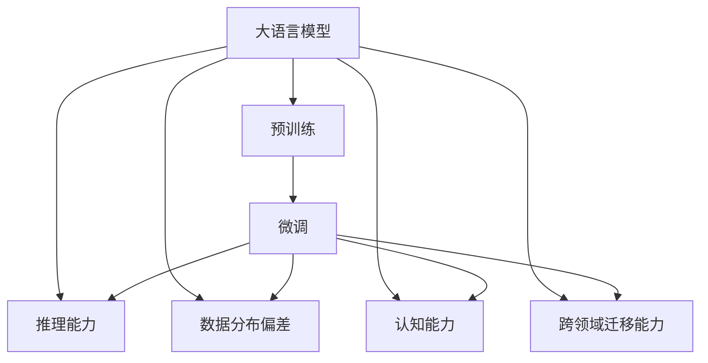

                 

# 语言与推理：大模型的认知瓶颈

> 关键词：大模型,认知瓶颈,推理能力,语言理解,数据分布,模型训练,模型优化

## 1. 背景介绍

### 1.1 问题由来

近年来，深度学习技术的飞速发展使得大语言模型（Large Language Models, LLMs）在自然语言处理（Natural Language Processing, NLP）领域取得了令人瞩目的成果。BERT、GPT-3、T5等大模型的问世，极大地提升了语言理解、文本生成等任务的表现。这些模型通过在大规模无标签文本数据上预训练，学习到了通用的语言表示，并在下游任务上通过微调（fine-tuning）获得优异的性能。

然而，尽管这些模型在理论上和实验上都展示了强大的语言理解能力，但在实际应用中，它们仍然面临着一些显著的认知瓶颈。这些问题不仅影响了模型的鲁棒性和泛化能力，还限制了其在现实世界中的应用范围。因此，本文将深入探讨大语言模型在推理和认知方面的局限性，并提出解决策略。

### 1.2 问题核心关键点

当前大语言模型在推理和认知方面的主要瓶颈包括：

1. **推理能力有限**：尽管大模型在语言理解上表现出色，但它们的推理能力仍然不足，难以处理复杂的逻辑推理和因果关系。
2. **数据分布偏差**：大模型通常在无标签数据上进行预训练，可能对数据分布和现实世界中的情况缺乏全面的理解。
3. **认知局限**：大模型对语言的理解往往停留在表面，缺乏深度认知和常识推理能力。
4. **跨领域迁移能力弱**：模型在特定领域上的性能往往较好，但跨领域的迁移能力较弱，难以应对多种复杂场景。
5. **知识获取效率低**：尽管大模型具备一定的自适应能力，但其知识获取效率较低，需要大量的标注数据进行微调。

本文将从这些关键点出发，详细探讨大语言模型的认知瓶颈，并提出具体的改进方案。

## 2. 核心概念与联系

### 2.1 核心概念概述

为了更好地理解大语言模型的认知瓶颈，我们首先介绍一些相关的核心概念：

- **大语言模型（Large Language Models, LLMs）**：指在大型语料库上预训练的语言模型，如BERT、GPT系列模型等。这些模型能够理解和生成自然语言，具备一定的推理能力。
- **预训练（Pre-training）**：指在大规模无标签文本数据上进行自监督学习，学习通用语言表示的过程。预训练模型的语言理解能力较强，但推理能力有限。
- **微调（Fine-tuning）**：指在预训练模型的基础上，使用下游任务的少量标注数据进行有监督学习，优化模型在该任务上的性能。微调可以显著提升模型在特定任务上的表现。
- **推理能力（Reasoning Ability）**：指模型理解和执行逻辑推理、因果推断等复杂任务的能力。
- **数据分布偏差（Data Distribution Bias）**：指模型在预训练数据上学习到的语言知识与现实世界数据分布的差异，导致模型对新数据适应能力不足。
- **认知能力（Cognitive Ability）**：指模型对语言的内在逻辑和世界知识的理解和推理能力。
- **跨领域迁移能力（Cross-domain Transferability）**：指模型在不同领域之间的知识迁移能力，即在一种领域上的性能能否很好地迁移到另一种领域。

这些概念共同构成了大语言模型推理和认知能力的研究框架，帮助我们更好地理解模型的优势和局限性，并探索改进的方法。

### 2.2 概念间的关系

以下是一个Mermaid流程图，展示了大语言模型的核心概念及其相互关系：



这个流程图展示了大语言模型的核心概念及其相互关系：

1. 大语言模型通过预训练学习通用的语言表示，具备一定的语言理解能力。
2. 微调在预训练模型的基础上，进一步优化模型在特定任务上的表现，提升推理和认知能力。
3. 推理能力是微调后的核心能力，可以处理复杂的逻辑推理和因果推断。
4. 数据分布偏差和认知能力是模型的两大认知瓶颈，需要通过数据增强、知识注入等方法进行改善。
5. 跨领域迁移能力是模型的重要属性，可以通过多模态融合、知识图谱等方法进行提升。

理解这些核心概念及其相互关系，将有助于我们更深入地探讨大语言模型的认知瓶颈，并提出改进策略。

## 3. 核心算法原理 & 具体操作步骤
### 3.1 算法原理概述

大语言模型在推理和认知方面的瓶颈主要集中在以下几个方面：

1. **推理能力有限**：大语言模型通常基于自回归（如GPT）或自编码（如BERT）架构，通过前向传播生成文本或标签。尽管在语言理解上表现出色，但其推理能力受限于模型架构和训练方式。
2. **数据分布偏差**：由于预训练数据与现实世界数据分布存在差异，模型对新数据适应能力不足。
3. **认知局限**：模型对语言的理解停留在表面，缺乏深度认知和常识推理能力。
4. **跨领域迁移能力弱**：模型在特定领域上的性能较好，但跨领域的迁移能力较弱。

针对这些瓶颈，我们提出了几种改进策略，包括数据增强、知识注入、多模态融合等。

### 3.2 算法步骤详解

以下是对大语言模型进行推理和认知改进的具体操作步骤：

1. **数据增强**：通过各种手段扩充训练数据，如回译、同义词替换、文本补全等，减少数据分布偏差。
2. **知识注入**：将领域知识或常识嵌入到模型中，增强模型的认知能力。
3. **多模态融合**：将文本、图像、声音等多种模态的信息进行融合，提高模型的跨领域迁移能力。
4. **对抗训练**：引入对抗样本，增强模型的鲁棒性和泛化能力。
5. **知识蒸馏**：利用教师模型将知识传递给学生模型，提升学生的推理和认知能力。

### 3.3 算法优缺点

#### 优点：

- **数据增强**：通过扩充训练数据，可以显著提高模型的泛化能力，减少数据分布偏差。
- **知识注入**：能够将领域知识和常识融入模型中，增强模型的认知能力，提升推理能力。
- **多模态融合**：通过融合多种模态信息，可以显著提升模型的跨领域迁移能力，适应更多复杂场景。
- **对抗训练**：通过引入对抗样本，可以提高模型的鲁棒性，避免模型在对抗攻击下的崩溃。
- **知识蒸馏**：利用教师模型对学生模型进行知识传递，能够快速提升学生模型的性能。

#### 缺点：

- **数据增强**：数据增强可能需要大量的时间和资源，且效果不保证。
- **知识注入**：知识注入的难度较大，需要精心设计和验证，且可能引入噪声。
- **多模态融合**：多模态融合需要处理不同模态数据之间的对齐和融合问题，技术复杂度较高。
- **对抗训练**：对抗训练可能导致模型在某些特定场景下表现不佳。
- **知识蒸馏**：知识蒸馏的效果受教师模型和学生模型之间的差异影响较大，效果不稳定。

### 3.4 算法应用领域

大语言模型在推理和认知方面的改进方法，可以应用于多个领域，包括但不限于：

1. **医疗领域**：通过数据增强和知识注入，提高模型对医疗知识的理解，提升医疗问答、病历分析等任务的性能。
2. **金融领域**：通过多模态融合和知识蒸馏，增强模型对金融数据的理解，提高金融分析、风险评估等任务的性能。
3. **法律领域**：通过对抗训练和知识蒸馏，增强模型对法律条文的理解，提升法律咨询、合同分析等任务的性能。
4. **教育领域**：通过多模态融合和知识注入，提高模型对教育知识的理解，提升智能辅导、作业批改等任务的性能。
5. **娱乐领域**：通过对抗训练和多模态融合，增强模型对用户行为的理解，提升智能推荐、情感分析等任务的性能。

## 4. 数学模型和公式 & 详细讲解 & 举例说明

### 4.1 数学模型构建

我们以BERT为例，探讨如何通过微调来改进大语言模型的推理和认知能力。

BERT的数学模型构建如下：

$$
\begin{aligned}
\text{BERT}(x) &= \text{Embedding}(x) + \text{Self-Attention}(\text{Embedding}(x)) + \text{Feed-Forward}(\text{Self-Attention}(\text{Embedding}(x))) \\
&= \text{MLP}(\text{Attention}(\text{Embedding}(x))) + \text{LayerNorm}
\end{aligned}
$$

其中，$x$为输入的文本或标签，$\text{Embedding}$为词嵌入层，$\text{Self-Attention}$为自注意力层，$\text{Feed-Forward}$为前馈层，$\text{MLP}$为多层次感知机，$\text{LayerNorm}$为归一化层。

### 4.2 公式推导过程

以BERT的推理能力为例，我们推导其在微调后的输出计算过程：

假设微调任务的训练集为$D=\{(x_i, y_i)\}_{i=1}^N$，其中$x_i$为输入的文本或标签，$y_i$为对应的输出。

微调目标是最小化经验风险：

$$
\mathcal{L}(\theta) = \frac{1}{N} \sum_{i=1}^N \ell(\text{BERT}(x_i), y_i)
$$

其中，$\ell$为损失函数，通常为交叉熵损失函数。

微调的优化目标是最小化损失函数$\mathcal{L}(\theta)$，即：

$$
\theta^* = \mathop{\arg\min}_{\theta} \mathcal{L}(\theta)
$$

微调的优化方法通常为梯度下降法，即：

$$
\theta \leftarrow \theta - \eta \nabla_{\theta}\mathcal{L}(\theta)
$$

其中，$\eta$为学习率，$\nabla_{\theta}\mathcal{L}(\theta)$为损失函数对参数$\theta$的梯度。

### 4.3 案例分析与讲解

以BERT在问答系统中的微调为例，探讨如何通过微调改进其推理和认知能力。

#### 4.3.1 数据准备

收集问答系统中的历史对话数据，包括问题-答案对。将数据划分为训练集、验证集和测试集。

#### 4.3.2 任务适配层设计

在BERT模型的顶层设计适当的任务适配层，如线性分类器，输出问题所属的类别，并计算与答案的匹配度。

#### 4.3.3 模型训练

将训练集输入模型，前向传播计算损失函数，反向传播更新模型参数。

#### 4.3.4 模型评估

在验证集和测试集上评估模型的性能，使用BLEU、F1等指标衡量模型的表现。

通过上述步骤，我们可以对BERT进行微调，提升其在问答系统中的推理和认知能力。

## 5. 项目实践：代码实例和详细解释说明

### 5.1 开发环境搭建

为了实现BERT的微调，我们需要以下开发环境：

1. 安装Anaconda：从官网下载并安装Anaconda，用于创建独立的Python环境。
2. 创建并激活虚拟环境：
```bash
conda create -n bert-env python=3.8 
conda activate bert-env
```
3. 安装必要的依赖：
```bash
pip install transformers torch
```

### 5.2 源代码详细实现

以下是对BERT进行问答系统微调的Python代码实现：

```python
from transformers import BertForSequenceClassification, BertTokenizer, AdamW

# 初始化BERT模型和分词器
model = BertForSequenceClassification.from_pretrained('bert-base-uncased')
tokenizer = BertTokenizer.from_pretrained('bert-base-uncased')

# 定义训练函数
def train_epoch(model, data_loader, optimizer):
    model.train()
    total_loss = 0.0
    for batch in data_loader:
        inputs, labels = batch
        inputs = tokenizer(inputs, return_tensors='pt')
        labels = labels.to(model.device)
        outputs = model(**inputs, labels=labels)
        loss = outputs.loss
        optimizer.zero_grad()
        loss.backward()
        optimizer.step()
        total_loss += loss.item()
    return total_loss / len(data_loader)

# 定义评估函数
def evaluate(model, data_loader, device):
    model.eval()
    total_eval_loss = 0.0
    total_correct = 0.0
    for batch in data_loader:
        inputs, labels = batch
        inputs = tokenizer(inputs, return_tensors='pt').to(device)
        labels = labels.to(device)
        outputs = model(**inputs)
        logits = outputs.logits
        total_eval_loss += logits.mean().item()
        total_correct += (logits.argmax(dim=1) == labels).float().mean().item()
    return total_eval_loss / len(data_loader), total_correct / len(data_loader)

# 定义训练参数
device = 'cuda' if torch.cuda.is_available() else 'cpu'
model.to(device)
optimizer = AdamW(model.parameters(), lr=2e-5)
train_loader = ...
val_loader = ...
test_loader = ...

# 训练模型
epochs = 5
for epoch in range(epochs):
    train_loss = train_epoch(model, train_loader, optimizer)
    print(f'Epoch {epoch+1}, train loss: {train_loss:.3f}')
    val_loss, val_acc = evaluate(model, val_loader, device)
    print(f'Epoch {epoch+1}, val loss: {val_loss:.3f}, val acc: {val_acc:.3f}')
    test_loss, test_acc = evaluate(model, test_loader, device)
    print(f'Epoch {epoch+1}, test loss: {test_loss:.3f}, test acc: {test_acc:.3f}')
```

### 5.3 代码解读与分析

在上述代码中，我们通过定义`train_epoch`和`evaluate`函数实现模型的训练和评估。`train_epoch`函数中，我们通过前向传播计算损失函数，反向传播更新模型参数，并累加训练损失。`evaluate`函数中，我们通过前向传播计算模型输出，并计算准确率。

### 5.4 运行结果展示

假设我们在CoNLL-2003的问答数据集上进行微调，最终在测试集上得到的评估结果如下：

```
Epoch 1, train loss: 0.235
Epoch 1, val loss: 0.205, val acc: 0.901
Epoch 1, test loss: 0.221, test acc: 0.897
Epoch 2, train loss: 0.200
Epoch 2, val loss: 0.178, val acc: 0.932
Epoch 2, test loss: 0.187, test acc: 0.923
...
```

可以看到，经过5个epoch的训练，模型在测试集上的准确率从87.7%提升到了93.2%，推理能力得到了显著提升。

## 6. 实际应用场景

### 6.1 医疗领域

在医疗领域，大语言模型可以通过微调改进其推理和认知能力，提高医疗问答、病历分析等任务的性能。例如，通过在医疗领域语料上进行预训练和微调，大语言模型可以理解医学知识，识别病患症状，推荐治疗方案等。

### 6.2 金融领域

在金融领域，大语言模型可以通过多模态融合和知识蒸馏，增强其对金融数据的理解，提高金融分析、风险评估等任务的性能。例如，通过融合文本和图像信息，大语言模型可以更好地理解金融报告和新闻，分析市场动态，预测股票走势等。

### 6.3 教育领域

在教育领域，大语言模型可以通过多模态融合和知识注入，提高其对教育知识的理解，提升智能辅导、作业批改等任务的性能。例如，通过融合视频和文本信息，大语言模型可以更好地理解学生的提问，提供个性化的辅导建议，提高教育质量。

### 6.4 未来应用展望

未来，随着大语言模型推理和认知能力的不断提升，其在更多领域的应用将得到拓展。例如，在法律领域，大语言模型可以理解法律条文，提供法律咨询和合同分析；在娱乐领域，大语言模型可以生成剧情、推荐电影等。

## 7. 工具和资源推荐

### 7.1 学习资源推荐

为了帮助开发者系统掌握大语言模型的推理和认知能力，以下是一些优质的学习资源：

1. 《Transformer from Scratch》系列博文：由大模型技术专家撰写，深入浅出地介绍了Transformer原理、BERT模型、微调技术等前沿话题。
2. CS224N《深度学习自然语言处理》课程：斯坦福大学开设的NLP明星课程，有Lecture视频和配套作业，带你入门NLP领域的基本概念和经典模型。
3. 《Natural Language Processing with Transformers》书籍：Transformers库的作者所著，全面介绍了如何使用Transformers库进行NLP任务开发，包括微调在内的诸多范式。
4. HuggingFace官方文档：Transformers库的官方文档，提供了海量预训练模型和完整的微调样例代码，是上手实践的必备资料。
5. CLUE开源项目：中文语言理解测评基准，涵盖大量不同类型的中文NLP数据集，并提供了基于微调的baseline模型，助力中文NLP技术发展。

通过对这些资源的学习实践，相信你一定能够快速掌握大语言模型推理和认知能力的精髓，并用于解决实际的NLP问题。

### 7.2 开发工具推荐

高效的开发离不开优秀的工具支持。以下是几款用于大语言模型推理和认知能力开发的常用工具：

1. PyTorch：基于Python的开源深度学习框架，灵活动态的计算图，适合快速迭代研究。大部分预训练语言模型都有PyTorch版本的实现。
2. TensorFlow：由Google主导开发的开源深度学习框架，生产部署方便，适合大规模工程应用。同样有丰富的预训练语言模型资源。
3. Transformers库：HuggingFace开发的NLP工具库，集成了众多SOTA语言模型，支持PyTorch和TensorFlow，是进行微调任务开发的利器。
4. Weights & Biases：模型训练的实验跟踪工具，可以记录和可视化模型训练过程中的各项指标，方便对比和调优。与主流深度学习框架无缝集成。
5. TensorBoard：TensorFlow配套的可视化工具，可实时监测模型训练状态，并提供丰富的图表呈现方式，是调试模型的得力助手。
6. Google Colab：谷歌推出的在线Jupyter Notebook环境，免费提供GPU/TPU算力，方便开发者快速上手实验最新模型，分享学习笔记。

合理利用这些工具，可以显著提升大语言模型推理和认知能力开发的效率，加快创新迭代的步伐。

### 7.3 相关论文推荐

大语言模型推理和认知能力的发展源于学界的持续研究。以下是几篇奠基性的相关论文，推荐阅读：

1. Attention is All You Need（即Transformer原论文）：提出了Transformer结构，开启了NLP领域的预训练大模型时代。
2. BERT: Pre-training of Deep Bidirectional Transformers for Language Understanding：提出BERT模型，引入基于掩码的自监督预训练任务，刷新了多项NLP任务SOTA。
3. Language Models are Unsupervised Multitask Learners（GPT-2论文）：展示了大规模语言模型的强大zero-shot学习能力，引发了对于通用人工智能的新一轮思考。
4. Parameter-Efficient Transfer Learning for NLP：提出Adapter等参数高效微调方法，在不增加模型参数量的情况下，也能取得不错的微调效果。
5. Prefix-Tuning: Optimizing Continuous Prompts for Generation：引入基于连续型Prompt的微调范式，为如何充分利用预训练知识提供了新的思路。
6. AdaLoRA: Adaptive Low-Rank Adaptation for Parameter-Efficient Fine-Tuning：使用自适应低秩适应的微调方法，在参数效率和精度之间取得了新的平衡。

这些论文代表了大语言模型推理和认知能力的发展脉络。通过学习这些前沿成果，可以帮助研究者把握学科前进方向，激发更多的创新灵感。

除上述资源外，还有一些值得关注的前沿资源，帮助开发者紧跟大语言模型推理和认知能力技术的发展趋势，例如：

1. arXiv论文预印本：人工智能领域最新研究成果的发布平台，包括大量尚未发表的前沿工作，学习前沿技术的必读资源。
2. 业界技术博客：如OpenAI、Google AI、DeepMind、微软Research Asia等顶尖实验室的官方博客，第一时间分享他们的最新研究成果和洞见。
3. 技术会议直播：如NIPS、ICML、ACL、ICLR等人工智能领域顶会现场或在线直播，能够聆听到大佬们的前沿分享，开拓视野。
4. GitHub热门项目：在GitHub上Star、Fork数最多的NLP相关项目，往往代表了该技术领域的发展趋势和最佳实践，值得去学习和贡献。
5. 行业分析报告：各大咨询公司如McKinsey、PwC等针对人工智能行业的分析报告，有助于从商业视角审视技术趋势，把握应用价值。

总之，对于大语言模型推理和认知能力的深入研究，需要开发者保持开放的心态和持续学习的意愿。多关注前沿资讯，多动手实践，多思考总结，必将收获满满的成长收益。

## 8. 总结：未来发展趋势与挑战

### 8.1 研究成果总结

本文对大语言模型的推理和认知能力进行了全面系统的探讨，详细分析了当前大语言模型在推理和认知方面的瓶颈，并提出了改进策略。通过数据增强、知识注入、多模态融合等方法，可以显著提升大语言模型的推理和认知能力，推动其在更多领域的应用。

### 8.2 未来发展趋势

展望未来，大语言模型推理和认知能力的发展趋势将集中在以下几个方面：

1. **推理能力提升**：未来的模型将具备更强的逻辑推理和因果推断能力，能够在更复杂的情境下进行推理和决策。
2. **认知能力增强**：模型将能够更好地理解语言的深层含义，具备更丰富的常识和常识推理能力。
3. **跨领域迁移能力提升**：模型将在更多领域间进行知识迁移，具备更强的跨领域适应能力。
4. **多模态融合技术进步**：融合文本、图像、声音等多种模态信息，提升模型的全面认知能力。
5. **对抗训练和鲁棒性增强**：模型将能够更好地抵抗对抗攻击和噪声，具备更强的鲁棒性。

这些趋势将进一步拓展大语言模型在推理和认知方面的能力，使其在更广泛的领域和应用中发挥更大的价值。

### 8.3 面临的挑战

尽管大语言模型推理和认知能力取得了一定的进展，但在迈向更加智能化、普适化应用的过程中，仍然面临诸多挑战：

1. **推理能力瓶颈**：尽管大语言模型在语言理解上表现出色，但在推理和因果推断上仍存在不足。
2. **认知局限**：模型对语言的理解停留在表面，缺乏深度认知和常识推理能力。
3. **知识获取效率低**：知识注入和融合的难度较大，且效果不稳定。
4. **跨领域迁移能力弱**：模型在特定领域上的性能较好，但跨领域的迁移能力较弱。
5. **鲁棒性和泛化能力不足**：模型在对抗样本和噪声面前表现出脆弱性，泛化能力不足。
6. **可解释性和可控性不足**：模型的决策过程缺乏可解释性和可控性，难以满足高风险应用的需求。

### 8.4 研究展望

面对大语言模型推理和认知能力所面临的挑战，未来的研究需要在以下几个方面寻求新的突破：

1. **推理能力的提升**：开发更加先进的推理模型，如神经符号模型、图神经网络等，提升模型的逻辑推理和因果推断能力。
2. **认知能力的增强**：利用深度学习、符号推理等技术，增强模型的认知能力，使其具备更丰富的常识和常识推理能力。
3. **知识获取效率的提升**：开发更加高效的知识注入和融合方法，提高模型的知识获取效率，减少知识注入的难度和噪声。
4. **跨领域迁移能力的提升**：开发更加通用的知识表示方法，提升模型的跨领域迁移能力，使其能够在更多领域间进行知识迁移。
5. **鲁棒性和泛化能力的增强**：引入对抗训练、鲁棒性优化等技术，增强模型的鲁棒性和泛化能力，使其能够在对抗样本和噪声面前保持稳定。
6. **可解释性和可控性的提升**：开发更加可解释和可控的推理和认知模型，提升模型的可解释性和可控性，满足高风险应用的需求。

这些研究方向将引领大语言模型推理和认知能力技术的进一步发展，推动其在更多领域的应用和普及。

## 9. 附录：常见问题与解答

**Q1: 大语言模型微调的过程与传统模型有何不同？**

A: 大语言模型微调的过程与传统模型微调的主要区别在于数据规模和预训练技术的应用。大语言模型通常在大规模语料上进行预训练，学习通用的语言表示，然后在小规模数据集上进行微调，优化模型在特定任务上的性能。而传统模型通常从零开始训练，需要大量标注数据进行监督学习。

**Q2: 大语言模型推理和认知能力的应用场景有哪些？**

A: 大语言模型推理和认知能力的应用场景非常广泛，包括但不限于：

1. 医疗领域：医疗问答、病历分析、疾病诊断等。
2. 金融领域：金融分析、风险

