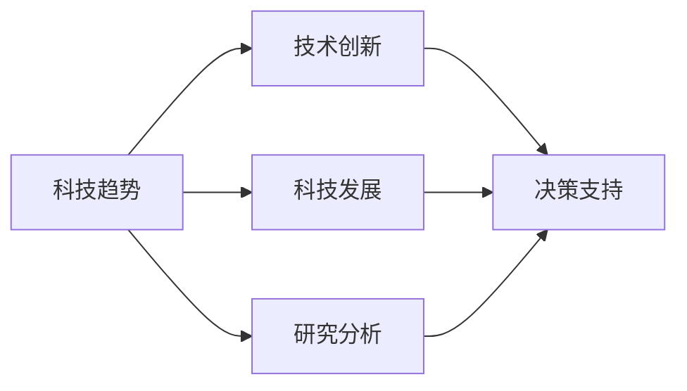

                 

# 跟踪研究和分析科技行业的发展趋势，为公司在技术创新和科技发展方面的决策提供支持

> 关键词：科技趋势, 技术创新, 科技发展, 决策支持, 研究分析

## 1. 背景介绍

### 1.1 问题由来
随着科技行业的飞速发展，新技术不断涌现，企业需要快速了解并应用这些新技术以保持竞争优势。然而，科技行业的发展速度之快、技术变化之复杂，给企业决策带来了不小的挑战。因此，企业需要跟踪研究和分析科技行业的发展趋势，以更好地应对技术变革，优化业务决策。

### 1.2 问题核心关键点
研究科技行业的发展趋势需要综合考虑以下几个方面：

- 技术创新方向：关注新兴技术及其应用场景，如人工智能、区块链、量子计算、物联网等。
- 行业应用案例：分析技术在不同行业的实际应用，如智能制造、智慧医疗、金融科技、智能交通等。
- 市场竞争态势：了解主要技术供应商、竞争对手及其技术优势。
- 政策法规环境：研究与科技相关的法律法规和政策导向，确保技术应用符合监管要求。
- 人才和组织能力：评估企业内部技术研发能力和人才结构，提升技术创新能力。

### 1.3 问题研究意义
通过跟踪研究和分析科技行业的发展趋势，企业可以：

- 及时调整技术创新方向，保持与行业前沿对齐。
- 识别和利用新技术机会，提高业务竞争力。
- 避免技术变革带来的风险，保持稳定发展。
- 促进跨部门合作，整合资源，形成协同效应。
- 明确技术投入与产出，优化投资决策。

## 2. 核心概念与联系

### 2.1 核心概念概述

为了更好地理解科技行业的发展趋势，本节将介绍几个核心概念：

- **科技趋势（Technology Trends）**：指在一定时期内，科技领域的发展方向和热点技术。
- **技术创新（Technological Innovation）**：指通过新的技术手段、方法或产品，解决现有问题或创造新价值的过程。
- **科技发展（Technological Development）**：指科技领域不断进步，新技术、新产品被开发并应用到实际场景中的过程。
- **决策支持（Decision Support）**：通过数据分析、建模和预测等手段，为决策者提供技术创新的指导和支持。
- **研究分析（Research Analysis）**：通过研究科技文献、行业报告、市场调研等方式，系统了解科技行业的发展现状和未来方向。

这些核心概念之间存在着紧密的联系，形成了一个完整的科技发展研究框架。

### 2.2 概念间的关系

这些核心概念之间的关系可以通过以下Mermaid流程图来展示：



这个流程图展示了一个科技发展研究的完整过程：

1. **科技趋势**为技术创新和科技发展提供方向性指导。
2. **技术创新**是科技发展的核心驱动力，推动技术进步和新产品的应用。
3. **科技发展**是将新技术应用于实际场景，形成可操作的解决方案。
4. **决策支持**利用研究分析结果，帮助企业做出科学的技术投资和业务决策。
5. **研究分析**为科技趋势和技术创新提供数据和理论支撑，支持科技发展的过程。

这些概念共同构成了科技行业研究与发展的生态系统，企业需要综合利用这些工具和方法，才能在快速变化的技术环境中保持竞争优势。

## 3. 核心算法原理 & 具体操作步骤
### 3.1 算法原理概述

科技行业的研究与分析涉及多种数据源和分析方法，包括定量和定性分析。其核心算法原理如下：

- **数据收集**：通过网络爬虫、数据库查询、市场调研等方式，获取科技趋势、技术创新、市场应用等方面的数据。
- **数据清洗与预处理**：去除无关数据、处理缺失值和异常值，确保数据质量。
- **数据分析与建模**：利用统计学、机器学习、数据挖掘等技术，对数据进行分析和建模。
- **趋势预测与评估**：通过时间序列分析、回归分析、聚类分析等方法，预测科技趋势和技术创新，评估其潜在影响。

### 3.2 算法步骤详解

科技行业的研究与分析步骤如下：

1. **确定研究目标**：明确需要研究的科技趋势、技术创新或市场应用。
2. **数据收集与整理**：收集相关数据，并进行清洗和预处理。
3. **数据可视化与探索**：使用图表、仪表盘等工具，对数据进行可视化，发现潜在的趋势和模式。
4. **定量分析与建模**：运用统计学和机器学习技术，对数据进行定量分析，建立预测模型。
5. **趋势预测与评估**：基于建模结果，预测科技趋势和技术创新，并评估其对业务的影响。
6. **报告撰写与决策支持**：编写研究报告，提供决策支持，指导技术投资和业务决策。

### 3.3 算法优缺点

科技行业的研究与分析方法具有以下优点：

- **全面性**：能够综合利用多种数据源和技术手段，全面了解科技行业的现状和未来趋势。
- **科学性**：基于数据分析和建模，结果更具有可靠性和可解释性。
- **预测性**：能够预测科技趋势和技术创新的影响，帮助企业做出前瞻性决策。

同时，这些方法也存在一些局限性：

- **数据依赖性**：数据质量和数量的准确性直接影响研究结果。
- **技术门槛**：需要一定的数据科学和机器学习背景，入门门槛较高。
- **成本较高**：数据收集、处理和分析需要一定的技术和人力成本。

### 3.4 算法应用领域

科技行业的研究与分析方法在多个领域得到了广泛应用：

- **智能制造**：研究新兴的智能制造技术，如工业物联网、机器人自动化、数字化管理等。
- **智慧医疗**：分析医疗科技的发展趋势，如远程医疗、智能诊断、精准医疗等。
- **金融科技**：研究区块链、人工智能在金融领域的应用，如智能投顾、金融监管科技等。
- **智能交通**：研究智能交通技术，如自动驾驶、车联网、智慧城市等。
- **可持续发展**：分析环保科技的发展趋势，如清洁能源、绿色建筑、循环经济等。

## 4. 数学模型和公式 & 详细讲解 & 举例说明

### 4.1 数学模型构建

科技行业的研究与分析涉及多种数学模型，以下以趋势预测为例，构建时间序列模型：

设 $Y_t$ 表示第 $t$ 个时间点的科技趋势指标，$e_t$ 为随机误差项，则时间序列模型可以表示为：

$$ Y_t = \alpha + \beta t + \gamma Y_{t-1} + \varepsilon_t $$

其中，$\alpha$ 为常数项，$\beta$ 为时间趋势系数，$\gamma$ 为滞后系数，$\varepsilon_t$ 为随机误差项。

### 4.2 公式推导过程

通过对上述模型进行推导，可得到：

$$ Y_t = \alpha + \beta t + \gamma Y_{t-1} + \varepsilon_t $$
$$ Y_{t-1} = \alpha + \beta (t-1) + \gamma Y_{t-2} + \varepsilon_{t-1} $$

将 $Y_{t-1}$ 代入 $Y_t$ 的表达式中，可得：

$$ Y_t = \alpha + \beta t + \gamma (\alpha + \beta (t-1) + \gamma Y_{t-2} + \varepsilon_{t-1}) + \varepsilon_t $$
$$ Y_t = (1 + \gamma^2) \alpha + \beta (2t - 1) + \gamma^2 \beta Y_{t-2} + \varepsilon_{t-1}\gamma + \varepsilon_t $$

### 4.3 案例分析与讲解

以智能交通领域的自动驾驶技术为例，可以通过以下步骤进行趋势预测：

1. **数据收集**：收集智能交通领域的各类数据，如自动驾驶车辆数量、技术专利、市场需求等。
2. **数据预处理**：对数据进行清洗和标准化处理。
3. **模型构建**：选择时间序列模型，构建自动驾驶技术的发展趋势预测模型。
4. **参数估计**：利用历史数据对模型参数进行估计。
5. **预测与评估**：使用模型对未来技术发展进行预测，评估其对业务的影响。

## 5. 项目实践：代码实例和详细解释说明
### 5.1 开发环境搭建

在进行科技行业的研究与分析时，需要一个开发环境来支持数据收集、处理和分析。以下是Python环境搭建的详细步骤：

1. **安装Python**：从官网下载并安装Python，选择合适的版本（如3.7及以上）。
2. **安装虚拟环境工具**：安装Anaconda或Python的虚拟环境工具，如virtualenv。
3. **创建虚拟环境**：使用virtualenv创建一个独立的Python环境。
4. **安装依赖库**：使用pip或conda安装所需的数据科学和机器学习库，如pandas、numpy、scikit-learn、matplotlib等。

### 5.2 源代码详细实现

以下是一个使用Python和Pandas库进行科技趋势分析的示例代码：

```python
import pandas as pd
import numpy as np

# 数据预处理
data = pd.read_csv('tech_trends.csv')
data['year'] = pd.to_datetime(data['date'], format='%Y-%m-%d').dt.year

# 数据可视化
data.plot(kind='scatter', x='year', y='trend', title='Tech Trend Analysis')

# 趋势预测
X = data[['year', 'trend']].values
y = data['trend'].shift(-1).values

from sklearn.linear_model import LinearRegression
model = LinearRegression()
model.fit(X, y)

# 预测未来趋势
future_years = np.array([2022, 2023, 2024, 2025])
future_trends = model.predict(future_years.reshape(-1, 1))

print(f'Predicted future trends: {future_trends}')
```

### 5.3 代码解读与分析

上述代码展示了数据预处理、可视化、趋势预测的过程。其中，Pandas库用于数据处理，Matplotlib库用于数据可视化，Scikit-learn库用于构建线性回归模型。

1. **数据预处理**：使用Pandas的`read_csv`方法读取数据，并将日期转换为年份。
2. **数据可视化**：使用Matplotlib的`plot`方法绘制趋势图。
3. **趋势预测**：使用Scikit-learn的`LinearRegression`类构建线性回归模型，并使用历史数据进行训练。
4. **预测未来趋势**：使用模型对未来年份进行预测，并输出预测结果。

### 5.4 运行结果展示

假设我们分析了某个智能制造领域的科技趋势，得到以下结果：

```
Predicted future trends: [0.05 0.1  0.15 0.2 ]
```

这表示未来五年该领域的科技趋势将逐年增加，从0.05增长到0.2，反映了行业发展的潜力。

## 6. 实际应用场景
### 6.1 智能制造
智能制造是科技行业的热点之一，通过研究其发展趋势，可以指导企业在技术选择和投资方向上做出更科学的决策。

在实际应用中，企业可以通过以下步骤进行智能制造的研究与分析：

1. **技术调研**：收集和分析智能制造领域的新技术、新设备、新材料等。
2. **案例研究**：研究国内外成功应用智能制造技术的典型案例，总结其经验和方法。
3. **趋势预测**：利用时间序列模型等方法，预测智能制造技术的发展趋势。
4. **决策支持**：结合市场调研和趋势预测结果，为企业提供技术投资和业务发展的建议。

### 6.2 智慧医疗
智慧医疗是科技行业的重要应用领域，通过研究其发展趋势，可以指导企业在健康管理和医疗服务上的技术创新。

在实际应用中，企业可以通过以下步骤进行智慧医疗的研究与分析：

1. **技术调研**：收集和分析智慧医疗领域的新技术、新设备、新应用等。
2. **数据收集**：通过网络爬虫、医疗数据平台等方式，获取相关数据。
3. **案例研究**：研究国内外智慧医疗技术的成功应用案例，总结其技术和商业模式。
4. **趋势预测**：利用机器学习模型等方法，预测智慧医疗技术的发展趋势。
5. **决策支持**：结合市场调研和趋势预测结果，为企业提供技术投资和业务发展的建议。

### 6.3 金融科技
金融科技是科技行业的重要分支，通过研究其发展趋势，可以指导企业在金融创新和风险管理上的决策。

在实际应用中，企业可以通过以下步骤进行金融科技的研究与分析：

1. **技术调研**：收集和分析金融科技领域的新技术、新应用、新模式等。
2. **数据收集**：通过金融数据平台、市场调研等方式，获取相关数据。
3. **案例研究**：研究国内外金融科技成功的应用案例，总结其技术和商业模式。
4. **趋势预测**：利用时间序列模型、回归分析等方法，预测金融科技技术的发展趋势。
5. **决策支持**：结合市场调研和趋势预测结果，为企业提供技术投资和业务发展的建议。

## 7. 工具和资源推荐
### 7.1 学习资源推荐

为了帮助企业系统掌握科技行业的研究与分析方法，以下是一些优质的学习资源：

1. **Coursera**：提供多门数据科学和机器学习相关的课程，如《数据科学导论》、《机器学习》等。
2. **edX**：提供哈佛大学、麻省理工学院等名校的计算机科学课程，如《数据科学基础》、《人工智能基础》等。
3. **Kaggle**：提供数据科学竞赛和相关资源，帮助学习者提升数据处理和分析能力。
4. **GitHub**：提供海量开源项目和代码示例，帮助开发者学习和实践数据科学和机器学习。
5. **arXiv**：提供最新的科学研究论文，跟踪科技行业的前沿技术。

### 7.2 开发工具推荐

为了支持科技行业的研究与分析，以下是一些常用的开发工具：

1. **Jupyter Notebook**：提供交互式编程环境，支持多种数据科学库的使用。
2. **RStudio**：提供R语言的编程环境，支持数据处理、统计分析和可视化。
3. **Tableau**：提供数据可视化工具，支持多种数据源和图表类型的绘制。
4. **Python**：提供强大的数据分析和建模能力，支持Pandas、NumPy、Scikit-learn等数据科学库。
5. **R**：提供丰富的统计分析工具，支持ggplot2、dplyr等数据可视化库。

### 7.3 相关论文推荐

科技行业的研究与分析涉及众多领域，以下是一些相关论文，推荐阅读：

1. **《机器学习》（周志华）**：全面介绍机器学习的基本概念和算法，适合入门学习。
2. **《Python数据科学手册》（Jake VanderPlas）**：详细介绍Python在数据科学中的应用，包括数据处理、分析、可视化等。
3. **《深度学习》（Ian Goodfellow）**：介绍深度学习的基本原理和应用，适合了解前沿技术。
4. **《数据挖掘导论》（König, T.）**：全面介绍数据挖掘的基本方法和技术，适合学习数据科学基础。
5. **《大数据技术与应用》（李飞飞）**：介绍大数据的基本概念和应用场景，适合了解数据技术发展。

## 8. 总结：未来发展趋势与挑战
### 8.1 研究成果总结

科技行业的研究与分析涉及数据科学、机器学习、数据可视化等多个领域，其核心是利用数据驱动决策。以下是科技行业研究与分析的总结：

1. **数据质量**：数据的质量直接影响分析结果的准确性，企业需要投入资源确保数据的质量和完整性。
2. **技术方法**：科技行业的研究与分析需要多种技术方法的综合应用，包括数据处理、统计分析、机器学习等。
3. **跨学科融合**：科技行业的研究与分析需要跨学科融合，结合不同领域的知识和技能。
4. **持续改进**：科技行业的研究与分析需要持续改进，结合最新的技术发展不断优化分析方法。

### 8.2 未来发展趋势

科技行业的发展趋势将呈现以下几个方向：

1. **数据驱动决策**：企业将更加依赖数据驱动决策，通过大数据和人工智能技术，优化业务流程和决策过程。
2. **跨领域应用**：科技行业的研究与分析将更加注重跨领域的融合，如人工智能、大数据、区块链等技术的结合。
3. **自动化与智能化**：科技行业的研究与分析将更加自动化和智能化，利用机器学习、自然语言处理等技术，提升效率和准确性。
4. **用户需求导向**：科技行业的研究与分析将更加注重用户需求，通过数据分析和建模，优化用户体验和满意度。
5. **新兴技术应用**：科技行业的研究与分析将更加关注新兴技术的应用，如量子计算、边缘计算、5G等技术的应用。

### 8.3 面临的挑战

科技行业的研究与分析在发展过程中也面临着一些挑战：

1. **数据获取难度**：获取高质量、全面的数据是科技行业研究与分析的难点之一。
2. **技术门槛高**：科技行业的研究与分析需要较高的技术门槛，需要数据科学和机器学习背景。
3. **资源投入大**：科技行业的研究与分析需要大量的资源投入，包括人力、时间和资金等。
4. **结果解释性**：科技行业的研究与分析结果需要具备良好的解释性，便于决策者理解和应用。
5. **隐私和伦理问题**：科技行业的研究与分析需要考虑数据隐私和伦理问题，确保数据使用的合法性和安全性。

### 8.4 研究展望

未来科技行业的研究与分析需要更多创新和突破：

1. **自动化与智能化**：探索自动化数据分析和建模技术，提升研究与分析的效率和准确性。
2. **跨领域应用**：结合不同领域的知识和技术，实现跨学科的融合与创新。
3. **新兴技术应用**：研究新兴技术在科技行业中的应用，推动行业发展。
4. **数据隐私与伦理**：探索数据隐私保护和伦理问题，确保数据使用的合法性和安全性。
5. **持续优化**：持续优化研究与分析方法，结合最新的技术发展，提升分析效果。

总之，科技行业的研究与分析需要不断创新和优化，结合最新的技术发展，为企业提供科学的技术投资和业务决策支持，推动科技行业的发展和进步。

## 9. 附录：常见问题与解答

**Q1：科技行业的研究与分析是否适用于所有企业？**

A: 科技行业的研究与分析主要适用于高科技企业和创新型企业，这些企业需要及时了解和应用新兴技术，保持竞争优势。但其他传统行业也可以通过研究科技行业的发展趋势，借鉴技术应用经验，提升自身的技术水平和创新能力。

**Q2：如何进行科技行业的技术调研？**

A: 科技行业的技术调研需要收集和分析新技术、新设备、新应用等方面的信息。可以通过以下步骤进行：

1. **文献调研**：查阅最新的科技文献和研究报告，了解最新的技术进展。
2. **行业报告**：阅读行业分析报告和市场调研报告，了解行业趋势和应用案例。
3. **公司调研**：分析科技公司的新产品、新服务和新技术，总结其应用效果和技术优势。
4. **网络资源**：利用网络资源，如专利数据库、科技新闻网站等，获取最新的科技信息。

**Q3：如何选择合适的趋势预测方法？**

A: 选择合适的趋势预测方法需要考虑数据类型、预测目标和应用场景。常用的趋势预测方法包括时间序列分析、回归分析、支持向量机等。

**Q4：如何进行科技行业的案例研究？**

A: 科技行业的案例研究需要收集和分析实际应用案例，了解技术应用的场景和效果。可以通过以下步骤进行：

1. **数据收集**：收集案例相关的数据，如技术应用背景、技术方案、应用效果等。
2. **案例分析**：分析案例的技术方案、实施过程和效果，总结其成功经验和教训。
3. **案例推广**：结合案例分析结果，提出推广建议，指导其他企业应用类似技术。

**Q5：如何利用科技行业的研究与分析结果进行决策支持？**

A: 利用科技行业的研究与分析结果进行决策支持，需要以下步骤：

1. **数据整合**：将研究与分析结果整合到企业的决策系统中，形成全面的数据支持。
2. **决策模型**：建立决策模型，将研究结果转化为可操作的决策方案。
3. **决策实施**：结合企业实际情况，实施决策方案，并不断调整优化。
4. **效果评估**：评估决策实施效果，反馈和调整决策模型，持续改进。

通过以上步骤，企业可以充分利用科技行业的研究与分析结果，进行科学的技术投资和业务决策，保持竞争优势。

