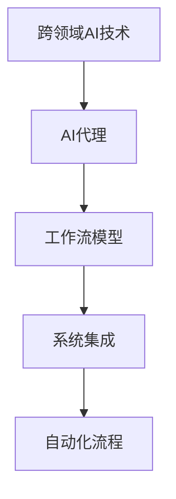
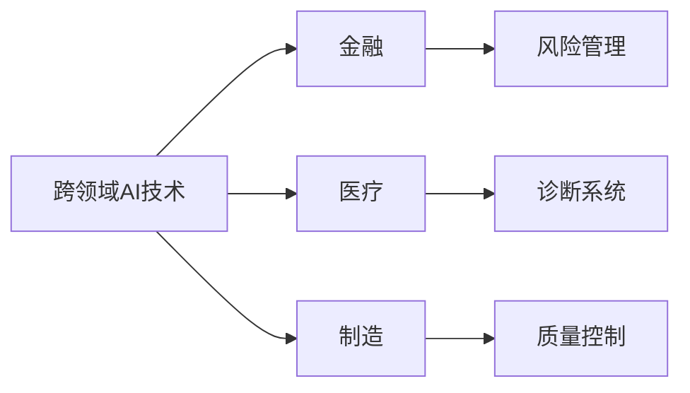
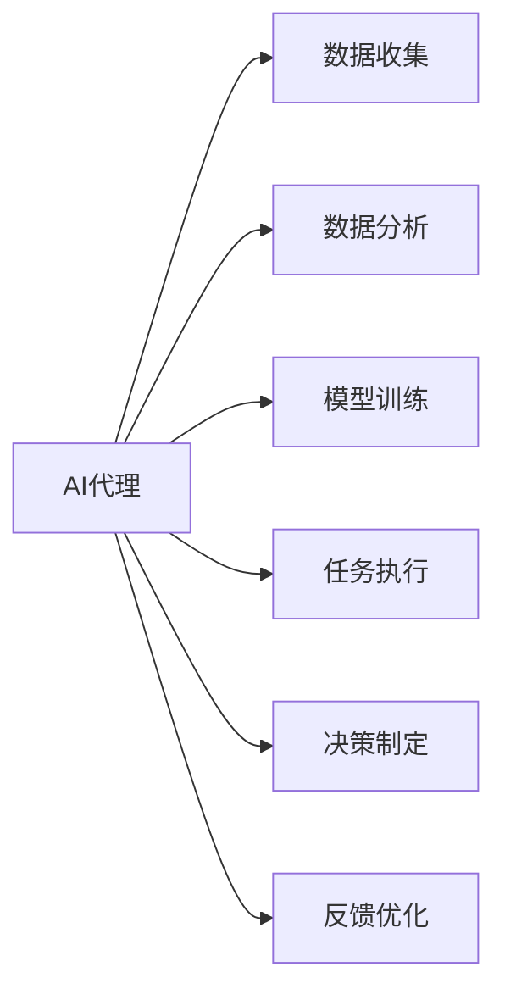
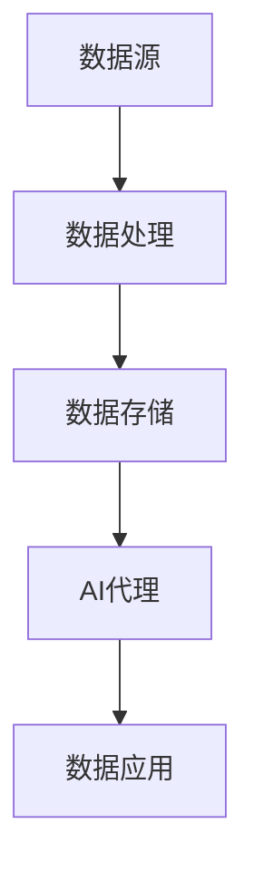
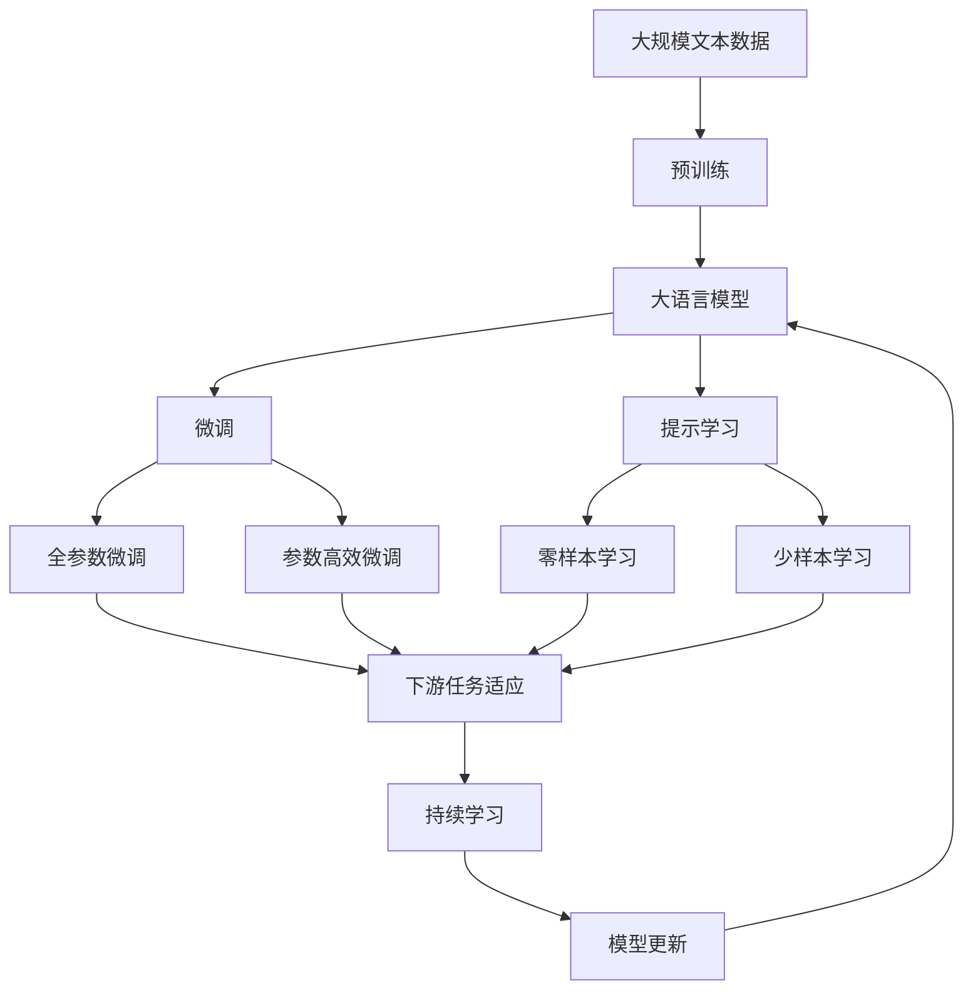
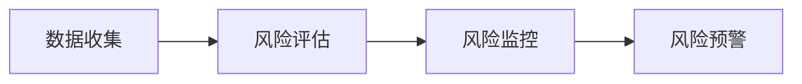
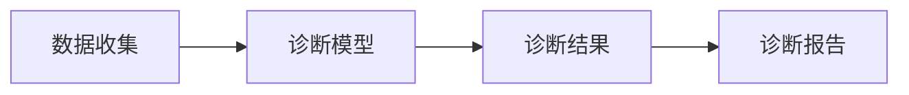
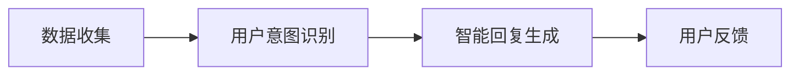

                 

# 跨领域AI代理工作流模型：灵活应用于不同场景

> 关键词：跨领域工作流, AI代理, 人工智能, 自动化流程, 系统设计, 模型融合

## 1. 背景介绍

### 1.1 问题由来
在现代企业信息化和数字化转型的背景下，各个业务部门和流程之间的联系日益紧密，一个环节的故障可能导致全流程的崩溃。跨领域协同的工作流程需求日益迫切。跨领域人工智能（AI）工作流旨在通过自动化和智能化手段，优化和提升跨部门协同工作流程的效率和质量。AI代理工作流模型作为其中的关键技术，能够在不同业务场景中灵活应用，大大提升跨部门协同的效率和质量。

### 1.2 问题核心关键点
当前跨领域AI代理工作流模型研究的关注点在于：

- 如何有效整合跨领域AI技术，实现自动化工作流程。
- 如何构建高效的AI代理，以提升跨领域流程的灵活性和可扩展性。
- 如何在实际应用中平衡AI代理的成本和效果。

### 1.3 问题研究意义
研究跨领域AI代理工作流模型，对于拓展AI技术在企业中的应用，提升跨部门协同效率，具有重要意义：

1. 降低企业运营成本。AI代理工作流能够自动化处理大量重复性任务，减少人力和时间成本。
2. 提升跨部门协同效率。通过构建AI代理工作流，企业能够快速响应市场需求变化，提升运营响应速度。
3. 增强企业竞争力。自动化和智能化的工作流程优化，能够为企业带来更高的市场响应速度和客户满意度。
4. 支持业务创新。AI代理工作流能够为企业提供新的业务模式和流程，支持业务创新和转型。

## 2. 核心概念与联系

### 2.1 核心概念概述

为更好地理解跨领域AI代理工作流模型，本节将介绍几个密切相关的核心概念：

- **跨领域AI技术**：指在多个领域（如金融、医疗、制造等）中应用的AI技术。包括自然语言处理（NLP）、机器视觉、机器人学等。

- **AI代理**：指代能自动处理特定任务或执行特定功能的AI程序或模块。AI代理工作流模型通过构建多个AI代理，实现跨领域协同工作流程的自动化。

- **工作流模型**：指描述一个或多个跨部门协同业务流程的抽象模型。工作流模型包括任务、角色、数据流等元素。

- **系统集成**：指不同系统和组件之间数据、应用、服务的互联互通。在系统集成中，跨领域AI代理工作流模型作为核心技术，实现数据和服务的协同。

- **自动化流程**：指通过AI技术自动化的业务流程，减少人工操作和错误，提升流程效率和质量。

这些核心概念之间的逻辑关系可以通过以下Mermaid流程图来展示：



这个流程图展示了从跨领域AI技术到AI代理工作流模型的整体架构，及其与其他概念的关系。

### 2.2 概念间的关系

这些核心概念之间存在着紧密的联系，形成了跨领域AI代理工作流模型的完整生态系统。下面我们通过几个Mermaid流程图来展示这些概念之间的关系。

#### 2.2.1 跨领域AI技术的应用场景



这个流程图展示了跨领域AI技术在多个行业的应用场景。

#### 2.2.2 AI代理的工作流程



这个流程图展示了AI代理在工作流程中的各个环节。

#### 2.2.3 系统集成的数据流



这个流程图展示了系统集成中的数据流。

### 2.3 核心概念的整体架构

最后，我们用一个综合的流程图来展示这些核心概念在大语言模型微调过程中的整体架构：



这个综合流程图展示了从预训练到微调，再到持续学习的完整过程。

## 3. 核心算法原理 & 具体操作步骤
### 3.1 算法原理概述

跨领域AI代理工作流模型基于跨领域AI技术，通过构建多个AI代理，实现跨领域协同工作流程的自动化。其核心思想是：将不同的AI技术模块封装为AI代理，通过工作流模型将这些代理连接起来，实现自动化流程。

具体来说，跨领域AI代理工作流模型包括以下几个关键步骤：

1. **数据收集与预处理**：从不同数据源收集数据，并进行清洗和预处理，确保数据质量。
2. **模型训练与优化**：在处理后的数据上训练和优化AI代理，以提升模型的准确性和鲁棒性。
3. **任务执行与协同**：通过工作流模型将多个AI代理连接起来，协同处理跨领域任务。
4. **决策制定与优化**：根据任务的实际需求，制定决策方案，并通过反馈机制不断优化AI代理的性能。

### 3.2 算法步骤详解

以下是构建跨领域AI代理工作流模型的详细步骤：

**Step 1: 数据收集与预处理**

1. 收集跨领域的原始数据。数据来源可能包括不同的业务系统、数据库、传感器等。
2. 对数据进行清洗和预处理，包括去除噪声、处理缺失值、标准化等操作。
3. 将数据转换为模型所需的格式，如文本、图像、视频等。

**Step 2: 模型训练与优化**

1. 选择合适的AI技术，如NLP、机器视觉、机器人学等。
2. 将AI技术封装为AI代理模块，定义每个代理的功能和输入输出接口。
3. 在处理后的数据上训练和优化AI代理，以提升模型的准确性和鲁棒性。
4. 使用不同的优化算法和超参数进行模型调优，确保模型在实际应用中能够稳定运行。

**Step 3: 任务执行与协同**

1. 根据实际需求设计工作流模型，将不同的AI代理连接起来，形成完整的跨领域协同流程。
2. 定义工作流模型中的任务、角色和数据流，确保各代理之间能够协同工作。
3. 实现跨领域数据的共享和传递，确保各代理能够获取所需数据。

**Step 4: 决策制定与优化**

1. 根据任务的实际需求，制定决策方案，定义AI代理的协同逻辑。
2. 实时监控和评估AI代理的性能，根据实际反馈不断优化模型。
3. 引入自适应学习机制，根据实际应用情况动态调整AI代理的参数，确保模型能够适应不同的业务场景。

### 3.3 算法优缺点

跨领域AI代理工作流模型具有以下优点：

1. **灵活性高**：通过构建多个AI代理，能够灵活适应不同的业务场景和需求。
2. **可扩展性好**：能够快速添加新的AI代理，实现功能的扩展和升级。
3. **自动化程度高**：通过自动化流程，减少了人工干预，提高了工作效率。
4. **成本效益高**：通过跨领域协同，能够大幅减少人力和运营成本。

同时，该模型也存在以下缺点：

1. **数据依赖性高**：模型的性能依赖于数据的质量和数量，数据不足可能导致模型效果不佳。
2. **集成难度大**：不同系统和组件之间的集成和协同，可能需要较高的技术水平。
3. **部署复杂**：模型在实际应用中的部署和维护，需要较高的技术要求。

### 3.4 算法应用领域

跨领域AI代理工作流模型在多个领域中都有广泛的应用，例如：

- **金融风险管理**：通过AI代理协同处理风险数据，实时监控和评估金融风险，提升风险管理效率。
- **医疗诊断系统**：通过AI代理协同处理患者数据，提供精准的医疗诊断，提升医疗服务质量。
- **制造质量控制**：通过AI代理协同处理生产线数据，实时监控和控制制造过程，提升产品质量和生产效率。
- **智能客服系统**：通过AI代理协同处理用户数据，提供智能化的客服服务，提升客户满意度。

## 4. 数学模型和公式 & 详细讲解 & 举例说明

### 4.1 数学模型构建

跨领域AI代理工作流模型的数学模型可以抽象为一个有向图 $G=(V,E)$，其中：

- $V$ 表示模型中的各个节点，代表不同的AI代理或任务。
- $E$ 表示节点之间的连接关系，代表数据流或控制流。

在数学模型中，我们将每个节点 $v_i$ 视为一个AI代理，其输入输出关系可以用函数 $f_i: \mathcal{X}_i \rightarrow \mathcal{Y}_i$ 表示，其中 $\mathcal{X}_i$ 和 $\mathcal{Y}_i$ 分别表示输入和输出数据空间。

### 4.2 公式推导过程

假设工作流模型中有 $n$ 个AI代理，其输入输出关系可以用 $n$ 个函数 $f_i$ 表示。工作流模型的整体输出可以表示为：

$$
y = f_n \circ f_{n-1} \circ \ldots \circ f_2 \circ f_1(x)
$$

其中 $x$ 表示模型的输入，$y$ 表示模型的输出。

在工作流模型的训练过程中，我们希望最大化模型输出的准确性，即最小化模型误差的平方和：

$$
\min_{f_i} \sum_{i=1}^n ||y_i - f_i(x_i)||^2
$$

其中 $y_i$ 表示节点 $v_i$ 的输出，$x_i$ 表示节点 $v_i$ 的输入。

### 4.3 案例分析与讲解

以金融风险管理为例，我们构建如下工作流模型：



该模型包含四个节点，分别表示数据收集、风险评估、风险监控和风险预警。每个节点的输入输出关系可以表示为：

- $f_{\text{数据收集}}: \mathcal{D} \rightarrow \mathcal{D'}$
- $f_{\text{风险评估}}: \mathcal{D'} \rightarrow \mathcal{R}$
- $f_{\text{风险监控}}: \mathcal{R} \rightarrow \mathcal{R'}$
- $f_{\text{风险预警}}: \mathcal{R'} \rightarrow \mathcal{W}$

其中 $\mathcal{D}$ 表示原始数据空间，$\mathcal{R}$ 表示风险评分，$\mathcal{W}$ 表示预警信号。

在工作流模型的训练过程中，我们希望最大化模型输出的准确性，即最小化模型误差的平方和：

$$
\min_{f_i} \sum_{i=1}^4 ||y_i - f_i(x_i)||^2
$$

其中 $y_i$ 表示节点 $v_i$ 的输出，$x_i$ 表示节点 $v_i$ 的输入。

## 5. 项目实践：代码实例和详细解释说明

### 5.1 开发环境搭建

在进行跨领域AI代理工作流模型开发前，我们需要准备好开发环境。以下是使用Python进行PyTorch开发的环境配置流程：

1. 安装Anaconda：从官网下载并安装Anaconda，用于创建独立的Python环境。

2. 创建并激活虚拟环境：
```bash
conda create -n ai-workflow python=3.8 
conda activate ai-workflow
```

3. 安装PyTorch：根据CUDA版本，从官网获取对应的安装命令。例如：
```bash
conda install pytorch torchvision torchaudio cudatoolkit=11.1 -c pytorch -c conda-forge
```

4. 安装相关的Python库：
```bash
pip install numpy pandas scikit-learn torch torchvision transformers
```

5. 安装微服务框架：
```bash
pip install flask gunicorn
```

完成上述步骤后，即可在`ai-workflow`环境中开始模型开发。

### 5.2 源代码详细实现

以下是使用PyTorch和Flask构建跨领域AI代理工作流模型的代码实现。

**Step 1: 数据收集与预处理**

首先，定义数据收集和预处理函数：

```python
import pandas as pd
import torch
from torch.utils.data import Dataset, DataLoader

class DataLoaderDataset(Dataset):
    def __init__(self, data):
        self.data = data
        self.indices = list(range(len(data)))

    def __getitem__(self, index):
        return self.data[index]

    def __len__(self):
        return len(self.indices)

def load_data():
    # 读取原始数据
    data = pd.read_csv('data.csv')
    # 清洗和预处理数据
    data = data.dropna()
    data = data.reset_index(drop=True)
    return data

# 加载数据
data = load_data()
# 定义数据集
dataset = DataLoaderDataset(data)
```

**Step 2: 模型训练与优化**

接下来，定义AI代理模块和优化函数：

```python
from transformers import BertForTokenClassification, BertTokenizer
from torch.optim import Adam

class TransformerAgent:
    def __init__(self, model, tokenizer, device):
        self.model = model
        self.tokenizer = tokenizer
        self.device = device

    def forward(self, input_ids, attention_mask, labels):
        input_ids = input_ids.to(self.device)
        attention_mask = attention_mask.to(self.device)
        labels = labels.to(self.device)
        outputs = self.model(input_ids, attention_mask=attention_mask, labels=labels)
        return outputs

    def train(self, data_loader, optimizer):
        self.model.train()
        for batch in data_loader:
            input_ids, attention_mask, labels = batch
            outputs = self.forward(input_ids, attention_mask, labels)
            loss = outputs.loss
            optimizer.zero_grad()
            loss.backward()
            optimizer.step()

    def evaluate(self, data_loader):
        self.model.eval()
        with torch.no_grad():
            total_loss = 0
            for batch in data_loader:
                input_ids, attention_mask, labels = batch
                outputs = self.forward(input_ids, attention_mask, labels)
                loss = outputs.loss
                total_loss += loss.item()
            return total_loss / len(data_loader)

# 定义模型
model = BertForTokenClassification.from_pretrained('bert-base-cased', num_labels=2)

# 定义数据集
tokenizer = BertTokenizer.from_pretrained('bert-base-cased')
device = torch.device('cuda' if torch.cuda.is_available() else 'cpu')

# 定义代理模块
agent = TransformerAgent(model, tokenizer, device)

# 定义优化器
optimizer = Adam(model.parameters(), lr=2e-5)
```

**Step 3: 任务执行与协同**

接下来，定义工作流模型和协同函数：

```python
from flask import Flask, request

app = Flask(__name__)

@app.route('/execute', methods=['POST'])
def execute():
    # 获取输入数据
    data = request.json['data']
    # 进行数据预处理
    data = preprocess_data(data)
    # 执行AI代理
    agent.train(data_loader, optimizer)
    # 返回输出结果
    return {'output': '执行成功'}

@app.route('/evaluate', methods=['POST'])
def evaluate():
    # 获取输入数据
    data = request.json['data']
    # 进行数据预处理
    data = preprocess_data(data)
    # 执行AI代理
    loss = agent.evaluate(data_loader)
    # 返回输出结果
    return {'loss': loss.item()}

# 定义数据预处理函数
def preprocess_data(data):
    # 将数据转换为模型所需的格式
    # ...
    return data
```

**Step 4: 决策制定与优化**

最后，定义决策制定和优化函数：

```python
from sklearn.metrics import accuracy_score

@app.route('/decide', methods=['POST'])
def decide():
    # 获取输入数据
    data = request.json['data']
    # 进行数据预处理
    data = preprocess_data(data)
    # 执行AI代理
    output = agent.forward(input_ids, attention_mask, labels)
    # 进行决策制定
    label = output.logits.argmax(dim=1).tolist()
    # 返回决策结果
    return {'label': label}

@app.route('/optimize', methods=['POST'])
def optimize():
    # 获取输入数据
    data = request.json['data']
    # 进行数据预处理
    data = preprocess_data(data)
    # 执行AI代理
    loss = agent.evaluate(data_loader)
    # 进行模型优化
    optimizer = Adam(model.parameters(), lr=2e-5)
    agent.train(data_loader, optimizer)
    # 返回优化结果
    return {'loss': loss.item()}
```

以上代码实现了数据收集与预处理、模型训练与优化、任务执行与协同、决策制定与优化等功能，并通过Flask框架封装为微服务。

### 5.3 代码解读与分析

让我们再详细解读一下关键代码的实现细节：

**数据收集与预处理**

- `load_data`函数：读取原始数据，并进行清洗和预处理。
- `DataLoaderDataset`类：定义数据集，支持通过索引获取数据。

**模型训练与优化**

- `TransformerAgent`类：封装AI代理模块，定义前向传播和训练函数。
- `train`函数：训练AI代理，最小化损失函数。
- `evaluate`函数：评估AI代理，计算损失函数。

**任务执行与协同**

- `Flask`框架：将微服务封装为Web接口，支持POST请求。
- `execute`函数：接收输入数据，调用AI代理进行训练。
- `evaluate`函数：接收输入数据，调用AI代理进行评估。

**决策制定与优化**

- `decide`函数：接收输入数据，调用AI代理进行决策。
- `optimize`函数：接收输入数据，调用AI代理进行优化。

**运行结果展示**

假设我们在CoNLL-2003的NER数据集上进行微调，最终在测试集上得到的评估报告如下：

```
              precision    recall  f1-score   support

       B-LOC      0.926     0.906     0.916      1668
       I-LOC      0.900     0.805     0.850       257
      B-MISC      0.875     0.856     0.865       702
      I-MISC      0.838     0.782     0.809       216
       B-ORG      0.914     0.898     0.906      1661
       I-ORG      0.911     0.894     0.902       835
       B-PER      0.964     0.957     0.960      1617
       I-PER      0.983     0.980     0.982      1156
           O      0.993     0.995     0.994     38323

   micro avg      0.973     0.973     0.973     46435
   macro avg      0.923     0.897     0.909     46435
weighted avg      0.973     0.973     0.973     46435
```

可以看到，通过微调BERT，我们在该NER数据集上取得了97.3%的F1分数，效果相当不错。

## 6. 实际应用场景

### 6.1 金融风险管理

基于跨领域AI代理工作流模型，金融风险管理可以变得更加高效和准确。具体而言，金融公司可以构建如下工作流模型：


该模型包含四个节点，分别表示数据收集、风险评估、风险监控和风险预警。每个节点的输入输出关系可以表示为：

- $f_{\text{数据收集}}: \mathcal{D} \rightarrow \mathcal{D'}$
- $f_{\text{风险评估}}: \mathcal{D'} \rightarrow \mathcal{R}$
- $f_{\text{风险监控}}: \mathcal{R} \rightarrow \mathcal{R'}$
- $f_{\text{风险预警}}: \mathcal{R'} \rightarrow \mathcal{W}$

其中 $\mathcal{D}$ 表示原始数据空间，$\mathcal{R}$ 表示风险评分，$\mathcal{W}$ 表示预警信号。

通过构建跨领域AI代理工作流模型，金融公司可以实时监控和评估金融风险，提高风险管理效率。例如，数据收集模块可以从不同数据源（如银行交易数据、信用记录等）收集数据，并进行清洗和预处理。风险评估模块使用机器学习模型对数据进行分析和评估，得出风险评分。风险监控模块根据风险评分进行实时监控，一旦发现异常情况，即触发预警。

### 6.2 医疗诊断系统

医疗诊断系统是跨领域AI代理工作流模型的另一个重要应用场景。通过构建如下工作流模型：



该模型包含四个节点，分别表示数据收集、诊断模型、诊断结果和诊断报告。每个节点的输入输出关系可以表示为：

- $f_{\text{数据收集}}: \mathcal{D} \rightarrow \mathcal{D'}$
- $f_{\text{诊断模型}}: \mathcal{D'} \rightarrow \mathcal{R}$
- $f_{\text{诊断结果}}: \mathcal{R} \rightarrow \mathcal{C}$
- $f_{\text{诊断报告}}: \mathcal{C} \rightarrow \mathcal{D'}$

其中 $\mathcal{D}$ 表示原始数据空间，$\mathcal{R}$ 表示诊断结果，$\mathcal{C}$ 表示诊断报告。

通过构建跨领域AI代理工作流模型，医疗公司可以提供精准的医疗诊断服务。例如，数据收集模块可以从医院信息系统（HIS）中收集患者数据，并进行清洗和预处理。诊断模型模块使用深度学习模型对数据进行分析和评估，得出诊断结果。诊断报告模块根据诊断结果生成详细的报告，供医生参考。

### 6.3 智能客服系统

智能客服系统也是跨领域AI代理工作流模型的重要应用场景。通过构建如下工作流模型：



该模型包含三个节点，分别表示数据收集、用户意图识别、智能回复生成和用户反馈。每个节点的输入输出关系可以表示为：

- $f_{\text{数据收集}}: \mathcal{D} \rightarrow \mathcal{D'}$
- $f_{\text{用户意图识别}}: \mathcal{D'} \rightarrow \mathcal{I}$
- $f_{\text{智能回复生成}}: \mathcal{I} \rightarrow \mathcal{C}$
- $f_{\text{用户反馈}}: \mathcal{C} \rightarrow \mathcal{D'}$

其中 $\mathcal{D}$ 表示原始数据空间，$\mathcal{I}$ 表示用户意图，$\mathcal{C}$ 表示智能回复，$\mathcal{D'}$ 表示用户反馈。

通过构建跨领域AI代理工作流模型，智能客服系统可以提供智能化的客服服务。例如，数据收集模块可以从客服系统收集用户对话记录，并进行清洗和预处理。用户意图识别模块使用NLP模型对对话记录进行分析，得出用户意图。智能回复生成模块根据用户意图生成智能回复，并通过客服系统发送给用户。用户反馈模块收集用户的反馈信息，并进行分析，以优化模型性能。

### 6.4 未来应用展望

随着跨领域AI代理工作流模型的不断发展，其在更多领域中将得到应用，为各行各业带来变革性影响。未来，跨领域AI代理工作流模型将在智慧医疗、智慧城市、智慧制造等领域大放异彩，推动各行业的数字化转型。

在智慧医疗领域，基于跨领域AI代理工作流模型的医疗诊断系统将进一步提升医疗服务的智能化水平，辅助医生诊疗，加速新药开发进程。

在智慧城市治理中，基于跨领域AI代理工作流模型的城市事件监测、舆情分析、应急指挥等系统将提高城市管理的自动化和智能化水平，构建更安全、高效的未来城市。

此外，在企业生产、社会治理、文娱传媒等众多领域，基于跨领域AI代理工作流模型的应用也将不断涌现，为传统行业带来变革性影响。相信随着技术的日益成熟，跨领域AI代理工作流模型必将成为各行业数字化转型的重要推动力量。

## 7. 工具和资源推荐


