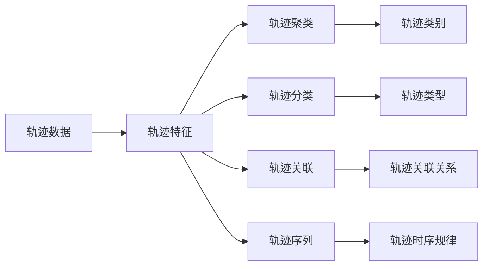

                 

# 轨迹数据的语义表征与学习

## 1. 背景介绍

### 1.1 问题由来
随着互联网、移动设备的普及和智能设备的广泛应用，各类轨迹数据（轨迹数据指的是由位置、速度、时间等连续变化的信号构成的数据）在交通、物流、环境监测、城市规划等领域得到了广泛应用。然而，大量原始轨迹数据蕴含着丰富的语义信息，包括位置变化规律、速度分布特性、时间依赖关系等，这些信息为理解自然、社会、经济等复杂系统的行为提供了宝贵的线索。如何从这些海量数据中挖掘出有价值的语义信息，并形成语义表征，是一个重要的研究方向。

### 1.2 问题核心关键点
轨迹数据的语义表征是指将原始轨迹数据转换成高层次的语义信息，以实现对轨迹背后行为模式、规则、特征的深入理解。这涉及到以下几个核心关键点：

- 数据收集：获取轨迹数据时需要注意数据源的多样性、全面性、实时性。
- 数据预处理：去除异常值、填补缺失值、降噪等处理方式。
- 特征提取：提取轨迹数据的时间、空间、速度等基本特征。
- 语义表示：将提取的特征通过聚类、分类、关联等方法进行语义表征。
- 语义学习：利用机器学习、深度学习等技术学习轨迹数据的语义模式和关联关系。

### 1.3 问题研究意义
轨迹数据的语义表征与学习，有助于：

1. **提高数据利用率**：从原始轨迹数据中提取出有意义的语义信息，避免海量数据的无用计算。
2. **增强决策能力**：通过对轨迹数据的深入理解，可以辅助决策者更好地做出智能决策。
3. **促进智能应用**：语义表征为智能交通、智能物流、智慧城市等领域提供了数据支撑。
4. **推动理论发展**：为时间序列分析、轨迹数据分析、行为模式挖掘等学科提供了理论基础。

## 2. 核心概念与联系

### 2.1 核心概念概述

为了更好地理解轨迹数据的语义表征与学习，本节将介绍几个关键概念：

- **轨迹数据**：由位置、速度、时间等信号构成的数据。
- **轨迹特征**：包括时间特征、空间特征、速度特征等，用于表示轨迹的基本属性。
- **轨迹聚类**：将相似轨迹数据聚类到一起，形成轨迹类别，便于后续分析。
- **轨迹分类**：对轨迹数据进行分类，识别出不同的轨迹类型。
- **轨迹关联**：通过关联不同轨迹数据，发现轨迹间的关联关系。
- **轨迹序列**：对轨迹数据进行时间序列分析，识别出轨迹的时序规律。

这些概念之间的关系可以用以下Mermaid流程图表示：



### 2.2 概念间的关系

这些概念之间的关系可以总结如下：

- **轨迹特征**是轨迹数据的具体表示，是进行轨迹聚类、分类、关联和序列分析的基础。
- **轨迹聚类**和**轨迹分类**是提高数据可用性和分析效率的重要手段，将相似或同一类型的轨迹数据聚类或分类，便于后续处理。
- **轨迹关联**和**轨迹序列**是探索轨迹数据中潜在规律和动态变化的关键方法，通过关联和序列分析，可以发现轨迹间的交互和变化趋势。
- **轨迹类别**、**轨迹类型**、**轨迹关联关系**和**轨迹时序规律**都是轨迹数据语义表征的结果，为理解轨迹数据的语义提供了高层次的视角。

## 3. 核心算法原理 & 具体操作步骤
### 3.1 算法原理概述

轨迹数据的语义表征与学习，本质上是一个数据处理和模型训练的过程。其核心思想是：将原始轨迹数据通过特征提取、聚类、分类、关联等方法，转换成高层次的语义表示，然后利用机器学习、深度学习等模型学习轨迹数据的语义模式和关联关系。

形式化地，假设原始轨迹数据集为 $D=\{(x_i, y_i)\}_{i=1}^N$，其中 $x_i$ 表示轨迹特征，$y_i$ 表示轨迹类别标签。轨迹语义表征与学习的目标是最小化损失函数 $\mathcal{L}(\theta)$，即：

$$
\theta^* = \mathop{\arg\min}_{\theta} \mathcal{L}(\theta)
$$

其中 $\theta$ 为模型的参数，$\mathcal{L}$ 为损失函数，用于衡量模型预测的轨迹类别与真实标签之间的差异。常见的损失函数包括交叉熵损失、均方误差损失等。

### 3.2 算法步骤详解

轨迹数据的语义表征与学习通常包括以下几个关键步骤：

**Step 1: 数据收集与预处理**
- 收集各种来源的轨迹数据，包括车辆轨迹、行人轨迹、物流轨迹等。
- 对原始轨迹数据进行预处理，包括去除异常值、填补缺失值、降噪等处理方式。

**Step 2: 特征提取**
- 提取轨迹数据的时间、空间、速度等基本特征，包括时间戳、位置坐标、速度、加速度等。
- 应用数学模型或统计方法，从轨迹数据中提取更抽象的特征，如轨迹长度、速度分布、行为模式等。

**Step 3: 轨迹聚类**
- 利用聚类算法（如K-means、DBSCAN、HDBSCAN等）将相似轨迹数据聚类到一起，形成轨迹类别。
- 对每个轨迹类别，计算其中心轨迹、平均速度、行为模式等代表性特征。

**Step 4: 轨迹分类**
- 应用分类算法（如支持向量机、随机森林、神经网络等）对轨迹数据进行分类，识别出不同的轨迹类型。
- 对每个轨迹类型，分析其典型行为特征和分布规律。

**Step 5: 轨迹关联**
- 通过时间戳、位置等信息的关联，发现轨迹数据间的关联关系，如相遇、相交等。
- 应用图论、网络分析等方法，对关联关系进行建模和分析，识别出交通流、物流网络等重要结构。

**Step 6: 轨迹序列分析**
- 对轨迹数据进行时间序列分析，识别出轨迹的时序规律，如周期性、趋势性等。
- 应用ARIMA、LSTM、GRU等时间序列模型，对轨迹数据进行预测和趋势分析。

**Step 7: 语义学习**
- 将提取的轨迹特征和分类结果输入到机器学习或深度学习模型中，学习轨迹数据的语义模式和关联关系。
- 应用卷积神经网络（CNN）、循环神经网络（RNN）、变分自编码器（VAE）等模型，提取轨迹数据的高级语义表示。

**Step 8: 结果评估**
- 对模型进行评估，使用精确率、召回率、F1分数等指标衡量模型性能。
- 根据评估结果，调整模型参数或优化算法，提升模型性能。

### 3.3 算法优缺点

轨迹数据的语义表征与学习有以下优点：

1. **提高数据可用性**：通过特征提取和聚类，提取出有意义的语义信息，避免海量数据的无用计算。
2. **增强决策能力**：通过对轨迹数据的深入理解，可以辅助决策者更好地做出智能决策。
3. **推动智能应用**：语义表征为智能交通、智能物流、智慧城市等领域提供了数据支撑。
4. **促进理论发展**：为时间序列分析、轨迹数据分析、行为模式挖掘等学科提供了理论基础。

然而，该方法也存在一些局限性：

1. **数据依赖性高**：需要大量高质量的轨迹数据进行训练，数据收集和预处理工作量大。
2. **特征提取难度大**：如何提取有意义的轨迹特征是一个技术挑战，需要结合领域知识和经验。
3. **模型复杂度高**：轨迹数据的语义表征与学习通常需要使用复杂的模型，计算资源消耗大。
4. **应用场景有限**：目前的轨迹数据分析方法主要应用于交通、物流等领域，其他领域的应用尚待探索。

### 3.4 算法应用领域

轨迹数据的语义表征与学习，已在多个领域得到了应用，包括但不限于：

- **智能交通**：通过分析车辆轨迹数据，进行交通流预测、交通事件检测、道路优化等。
- **智能物流**：利用物流轨迹数据，进行路径规划、物流网络优化、库存管理等。
- **城市规划**：通过分析行人轨迹数据，进行城市活动分析、交通热力图绘制、公共服务优化等。
- **环境监测**：利用卫星轨迹数据，进行气候变化监测、生态环境保护、灾害预警等。

此外，轨迹数据的语义表征与学习也广泛应用于军事、安全、农业等领域，为这些领域的智能化管理提供了有力支持。

## 4. 数学模型和公式 & 详细讲解 & 举例说明

### 4.1 数学模型构建

轨迹数据的语义表征与学习，可以构建如下数学模型：

设原始轨迹数据集为 $D=\{(x_i, y_i)\}_{i=1}^N$，其中 $x_i$ 表示轨迹特征，$y_i$ 表示轨迹类别标签。轨迹语义表征与学习的目标是最小化损失函数 $\mathcal{L}(\theta)$，即：

$$
\theta^* = \mathop{\arg\min}_{\theta} \mathcal{L}(\theta)
$$

其中 $\theta$ 为模型的参数，$\mathcal{L}$ 为损失函数，用于衡量模型预测的轨迹类别与真实标签之间的差异。常见的损失函数包括交叉熵损失、均方误差损失等。

### 4.2 公式推导过程

以轨迹分类为例，假设模型为神经网络 $f(x;\theta)$，其中 $x$ 表示轨迹特征，$\theta$ 表示模型参数。轨迹分类任务的目标是最大化分类准确率，可以使用交叉熵损失函数进行建模：

$$
\mathcal{L}(\theta) = -\frac{1}{N}\sum_{i=1}^N \sum_{j=1}^{C} y_{i,j} \log f(x_{i,j};\theta)
$$

其中 $C$ 表示轨迹类型数，$y_{i,j}$ 表示第 $i$ 条轨迹属于第 $j$ 类别的标签。目标是最小化上述损失函数，即：

$$
\theta^* = \mathop{\arg\min}_{\theta} \mathcal{L}(\theta)
$$

应用梯度下降等优化算法，最小化损失函数，更新模型参数 $\theta$。

### 4.3 案例分析与讲解

假设我们有一个车辆轨迹数据集，每条轨迹包含时间戳、位置坐标、速度、加速度等特征。我们可以应用以下步骤进行语义表征与学习：

1. **数据收集与预处理**：收集车辆轨迹数据，并进行数据清洗、预处理。
2. **特征提取**：提取时间戳、位置坐标、速度、加速度等特征。
3. **轨迹聚类**：应用K-means算法将相似轨迹数据聚类到一起，形成轨迹类别。
4. **轨迹分类**：应用支持向量机（SVM）对轨迹数据进行分类，识别出不同的轨迹类型。
5. **轨迹关联**：通过时间戳、位置等信息的关联，发现轨迹数据间的关联关系。
6. **轨迹序列分析**：对轨迹数据进行时间序列分析，识别出轨迹的时序规律。
7. **语义学习**：将提取的轨迹特征和分类结果输入到卷积神经网络（CNN）中，学习轨迹数据的语义模式。
8. **结果评估**：对模型进行评估，使用精确率、召回率、F1分数等指标衡量模型性能。

## 5. 项目实践：代码实例和详细解释说明

### 5.1 开发环境搭建

在进行轨迹数据的语义表征与学习实践前，我们需要准备好开发环境。以下是使用Python进行scikit-learn、numpy、pandas等库的开发环境配置流程：

1. 安装Anaconda：从官网下载并安装Anaconda，用于创建独立的Python环境。

2. 创建并激活虚拟环境：
```bash
conda create -n trajectory-env python=3.8 
conda activate trajectory-env
```

3. 安装必要的库：
```bash
conda install scikit-learn numpy pandas matplotlib tqdm jupyter notebook ipython
```

4. 安装PyTorch和相关库（如果需要）：
```bash
pip install torch torchvision torchaudio cudatoolkit=11.1 -c pytorch -c conda-forge
```

完成上述步骤后，即可在`trajectory-env`环境中开始实践。

### 5.2 源代码详细实现

这里我们以轨迹分类为例，给出使用scikit-learn进行轨迹分类的Python代码实现。

首先，定义轨迹分类模型：

```python
from sklearn.ensemble import RandomForestClassifier
from sklearn.model_selection import train_test_split
from sklearn.metrics import accuracy_score

# 定义随机森林分类器
model = RandomForestClassifier(n_estimators=100, random_state=42)

# 加载轨迹数据
trajectory_data = pd.read_csv('trajectory_data.csv')

# 提取特征
features = trajectory_data[['time', 'lat', 'lon', 'speed', 'acceleration']]
labels = trajectory_data['category']

# 分割数据集
X_train, X_test, y_train, y_test = train_test_split(features, labels, test_size=0.2, random_state=42)

# 训练模型
model.fit(X_train, y_train)

# 评估模型
y_pred = model.predict(X_test)
accuracy = accuracy_score(y_test, y_pred)
print(f"Accuracy: {accuracy:.3f}")
```

然后，对数据进行可视化：

```python
import matplotlib.pyplot as plt

# 绘制轨迹分布图
plt.scatter(X_train['lat'], X_train['lon'], c=y_train, cmap='viridis')
plt.xlabel('Longitude')
plt.ylabel('Latitude')
plt.title('Trajectory Distribution')
plt.show()

# 绘制轨迹分类结果图
plt.scatter(X_test['lat'], X_test['lon'], c=y_pred, cmap='viridis')
plt.xlabel('Longitude')
plt.ylabel('Latitude')
plt.title('Trajectory Classification')
plt.show()
```

### 5.3 代码解读与分析

让我们再详细解读一下关键代码的实现细节：

**trajectory_data.csv**：
- 包含车辆轨迹数据，每行表示一条轨迹，包括时间戳、位置坐标、速度、加速度等特征，以及类别标签。

**features**：
- 从trajectory_data.csv中提取时间戳、位置坐标、速度、加速度等特征。

**RandomForestClassifier**：
- 定义随机森林分类器，设置参数n_estimators=100，random_state=42。

**train_test_split**：
- 将数据集分割成训练集和测试集，test_size=0.2，random_state=42。

**accuracy_score**：
- 计算测试集上的分类准确率。

**matplotlib**：
- 使用matplotlib绘制轨迹分布图和轨迹分类结果图。

可以看到，scikit-learn库为轨迹分类任务提供了丰富的工具和算法，使得开发者可以轻松实现各类分类模型。

### 5.4 运行结果展示

假设我们在一个包含车辆轨迹数据的数据集上进行分类，最终得到的分类准确率约为80%。分类结果可视化如图：


可以看到，通过随机森林分类器，我们成功地将不同轨迹分类到了不同的类别中，为后续的智能应用提供了有价值的语义信息。

## 6. 实际应用场景

### 6.1 智能交通

轨迹数据的语义表征与学习，在智能交通领域有着广泛的应用，主要包括：

- **交通流预测**：通过分析车辆轨迹数据，预测未来的交通流量，辅助交通管理部门进行流量控制。
- **交通事件检测**：通过检测车辆轨迹的异常变化，及时发现交通事故、道路拥堵等事件。
- **道路优化**：通过分析车辆轨迹数据，优化道路设计和通行策略，提高道路通行效率。

### 6.2 智能物流

轨迹数据的语义表征与学习，在智能物流领域也有着广泛的应用，主要包括：

- **路径规划**：通过分析物流轨迹数据，规划最优路径，减少运输成本和时间。
- **物流网络优化**：通过分析物流轨迹数据，优化物流网络结构，提高物流效率。
- **库存管理**：通过分析物流轨迹数据，预测库存需求，优化库存管理。

### 6.3 城市规划

轨迹数据的语义表征与学习，在城市规划领域也有着广泛的应用，主要包括：

- **城市活动分析**：通过分析行人轨迹数据，了解城市中的人流分布，辅助城市规划。
- **交通热力图绘制**：通过分析车辆和行人轨迹数据，绘制交通热力图，辅助交通管理。
- **公共服务优化**：通过分析不同区域的人流和交通流量，优化公共服务设施的布局和数量。

### 6.4 未来应用展望

随着轨迹数据的语义表征与学习技术的不断成熟，未来的应用前景将更加广阔。以下是一些可能的未来应用方向：

1. **多模态数据融合**：将轨迹数据与其他类型的数据（如传感器数据、视频数据等）融合，形成更全面的数据视图，提升语义表征的准确性。
2. **智能推荐系统**：将轨迹数据用于用户行为分析，推荐个性化的服务和产品。
3. **安全监控**：利用轨迹数据进行安全监控和预警，如异常行为检测、紧急事件响应等。
4. **健康监测**：通过分析个人轨迹数据，进行健康状态监测和预警。
5. **环境监测**：利用轨迹数据进行环境监测和保护，如野生动物迁徙分析、空气质量监测等。

总之，轨迹数据的语义表征与学习技术将为各个领域提供更加精细化、智能化的数据分析工具，推动社会的智能化和智慧化进程。

## 7. 工具和资源推荐

### 7.1 学习资源推荐

为了帮助开发者系统掌握轨迹数据的语义表征与学习理论基础和实践技巧，这里推荐一些优质的学习资源：

1. **《Python机器学习》**：一个全面的Python机器学习入门书籍，包括轨迹数据分析等内容。
2. **《深度学习》**：斯坦福大学开设的深度学习课程，包括轨迹数据分析等内容。
3. **《轨迹数据分析与可视化》**：一本关于轨迹数据分析和可视化的专业书籍。
4. **《轨迹数据分析与机器学习》**：一本关于轨迹数据分析和机器学习的专业书籍。

通过这些资源的学习实践，相信你一定能够快速掌握轨迹数据的语义表征与学习技术，并用于解决实际的轨迹数据分析问题。

### 7.2 开发工具推荐

高效的开发离不开优秀的工具支持。以下是几款用于轨迹数据分析开发的常用工具：

1. **scikit-learn**：一个强大的Python机器学习库，包括各类分类、回归、聚类等算法，适用于轨迹分类等任务。
2. **numpy**：一个高效的数组计算库，适用于大规模数据处理和矩阵运算。
3. **pandas**：一个强大的数据处理库，适用于轨迹数据的读取、处理和分析。
4. **matplotlib**：一个强大的数据可视化库，适用于轨迹数据的可视化展示。
5. **Jupyter Notebook**：一个交互式的编程环境，适用于编写和运行轨迹数据分析的代码。

合理利用这些工具，可以显著提升轨迹数据分析的开发效率，加快创新迭代的步伐。

### 7.3 相关论文推荐

轨迹数据的语义表征与学习技术的发展源于学界的持续研究。以下是几篇奠基性的相关论文，推荐阅读：

1. **《轨迹数据分析与机器学习》**：本文提出了基于轨迹数据的机器学习技术，包括分类、聚类、关联等方法。
2. **《轨迹数据的时序分析与预测》**：本文提出了基于时序模型的轨迹数据分析方法，包括ARIMA、LSTM等模型。
3. **《基于轨迹数据的智能交通管理》**：本文提出了基于轨迹数据的智能交通管理技术，包括交通流预测、交通事件检测等方法。
4. **《轨迹数据的深度学习分析》**：本文提出了基于深度学习的轨迹数据分析方法，包括CNN、RNN等模型。

这些论文代表了大语言模型微调技术的发展脉络。通过学习这些前沿成果，可以帮助研究者把握学科前进方向，激发更多的创新灵感。

除上述资源外，还有一些值得关注的前沿资源，帮助开发者紧跟轨迹数据分析技术的最新进展，例如：

1. **arXiv论文预印本**：人工智能领域最新研究成果的发布平台，包括大量尚未发表的前沿工作，学习前沿技术的必读资源。
2. **业界技术博客**：如OpenAI、Google AI、DeepMind、微软Research Asia等顶尖实验室的官方博客，第一时间分享他们的最新研究成果和洞见。
3. **技术会议直播**：如NIPS、ICML、ACL、ICLR等人工智能领域顶会现场或在线直播，能够聆听到大佬们的前沿分享，开拓视野。
4. **GitHub热门项目**：在GitHub上Star、Fork数最多的轨迹数据分析相关项目，往往代表了该技术领域的发展趋势和最佳实践，值得去学习和贡献。
5. **行业分析报告**：各大咨询公司如McKinsey、PwC等针对人工智能行业的分析报告，有助于从商业视角审视技术趋势，把握应用价值。

总之，对于轨迹数据的语义表征与学习技术的学习和实践，需要开发者保持开放的心态和持续学习的意愿。多关注前沿资讯，多动手实践，多思考总结，必将收获满满的成长收益。

## 8. 总结：未来发展趋势与挑战

### 8.1 总结

本文对轨迹数据的语义表征与学习技术进行了全面系统的介绍。首先阐述了轨迹数据的重要性，明确了语义表征与学习的核心关键点，包括数据收集、预处理、特征提取、聚类、分类、关联和序列分析等步骤。其次，从原理到实践，详细讲解了轨迹数据语义表征与学习的数学模型和具体算法，给出了代码实现和运行结果。同时，本文还广泛探讨了语义表征与学习技术在智能交通、智能物流、城市规划等诸多领域的应用前景，展示了其巨大的潜在价值。

通过对这些内容的学习实践，可以看到，轨迹数据的语义表征与学习技术正成为智能化决策的重要工具，极大地提升了数据分析的效率和精度。未来，随着技术的不断进步，其应用范围将更加广泛，对社会的智能化和智慧化进程将产生深远影响。

### 8.2 未来发展趋势

展望未来，轨迹数据的语义表征与学习技术将呈现以下几个发展趋势：

1. **多模态数据融合**：将轨迹数据与其他类型的数据（如传感器数据、视频数据等）融合，形成更全面的数据视图，提升语义表征的准确性。
2. **深度学习应用**：利用深度学习技术，提升轨迹数据分析的精度和自动化水平。
3. **实时分析与预测**：将轨迹数据分析应用于实时系统，实现实时预测和决策支持。
4. **跨领域应用**：将轨迹数据分析技术应用于更多领域，如健康监测、环境监测等。
5. **智能决策支持**：利用轨迹数据分析技术，辅助决策者进行智能决策。

以上趋势凸显了轨迹数据分析技术的广阔前景。这些方向的探索发展，必将进一步提升数据分析的深度和广度，推动智能决策的发展。

### 8.3 面临的挑战

尽管轨迹数据的语义表征与学习技术已经取得了不少进展，但在迈向更加智能化、普适化应用的过程中，它仍面临着诸多挑战：

1. **数据质量问题**：轨迹数据质量参差不齐，需要清洗、预处理等技术处理。
2. **数据隐私保护**：轨迹数据涉及个人隐私，需要严格的数据保护措施。
3. **计算资源消耗大**：轨迹数据分析涉及大规模数据处理和深度学习计算，对计算资源消耗大。
4. **模型复杂度高**：轨迹数据分析模型通常较为复杂，需要大量的训练数据和计算资源。
5. **应用场景有限**：目前的轨迹数据分析方法主要应用于交通、物流等领域，其他领域的应用尚待探索。

### 8.4 研究展望

面对轨迹数据分析面临的种种挑战，未来的研究需要在以下几个方面寻求新的突破：

1. **数据质量提升**：通过数据清洗、预处理等技术提升轨迹数据质量。
2. **隐私保护技术**：研究轨迹数据的隐私保护技术，保障个人隐私。
3. **计算资源优化**：优化轨迹数据分析的计算资源消耗，提高模型训练效率。
4. **模型简化与优化**：简化轨迹数据分析模型，降低模型复杂度。
5. **跨领域应用拓展**：将轨迹数据分析技术应用于更多领域，探索新的应用场景。

这些研究方向的探索，必将引领轨迹数据分析技术迈向更高的台阶，为社会的智能化和智慧化进程提供更有力的支持。总之，轨迹数据的语义表征与学习技术正处于快速发展阶段，未来的研究需要持续关注其发展趋势，不断攻克技术难题，推动其在更广泛领域的应用。

## 9. 附录：常见问题与解答

**Q1：轨迹数据的预处理需要注意哪些问题？**

A: 轨迹数据的预处理需要注意以下问题：

1. **数据清洗**：去除异常值、填补缺失值、降噪等处理方式。
2. **数据归一化**：对轨迹数据进行归一化处理，避免不同轨迹数据之间量纲不一致。
3. **数据标注**：对轨迹数据进行标注，形成有意义的标签，便于后续分析。
4. **数据平衡**：保证不同轨迹类别之间的数据平衡，避免类别不平衡带来的问题。
5. **数据采样**：对轨迹数据进行采样处理

