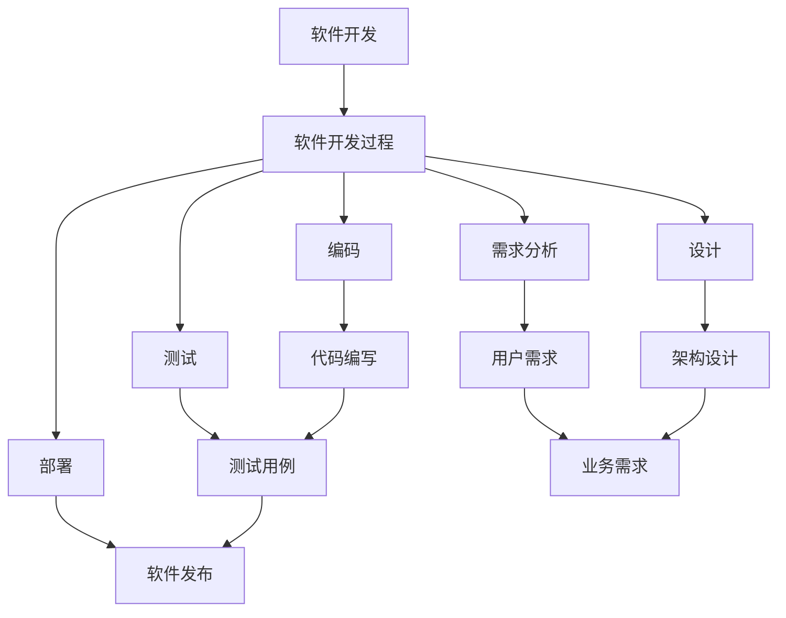
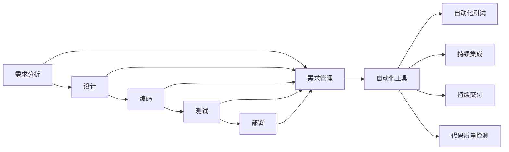

                 

# 软件 2.0 的价值：提升效率、创造价值

> 关键词：软件 2.0, 自动化, 智能化, 开发效率, 软件生命周期, 人机协同, 持续集成/持续交付(CI/CD), 质量保障, 敏捷开发

## 1. 背景介绍

### 1.1 问题由来
随着软件行业的快速发展和技术的迭代更新，软件开发的过程变得越来越复杂和多样化。传统的软件开发方式已经无法满足现代企业对快速交付高质量软件的需求。在这一背景下，软件 2.0 的概念应运而生，旨在通过智能化和自动化手段，提升软件开发的效率和质量，缩短软件生命周期，创造更高的商业价值。

软件 2.0 是基于软件开发过程智能化、自动化、数字化转型的概念，融合了云计算、大数据、人工智能、机器学习等前沿技术，为软件开发带来了全新的理念和实践。其核心理念是通过数据驱动和自动化，实现从需求分析、设计、开发、测试到部署的全面智能化，从而提升开发效率，降低开发成本，提升软件质量。

### 1.2 问题核心关键点
软件 2.0 的关键点在于其对软件开发过程的全面智能化和自动化。具体来说，包括以下几个方面：

- **数据驱动**：利用大数据和人工智能技术，收集和分析软件开发过程中的各项数据，帮助开发者做出更明智的决策。
- **自动化流程**：通过自动化测试、持续集成/持续交付(CI/CD)、代码质量检测等手段，实现开发过程的自动化。
- **智能辅助**：使用自然语言处理(NLP)、机器学习(ML)等技术，提供智能化的代码编写、测试、调试等辅助工具，提升开发效率。
- **持续优化**：通过不断收集反馈和数据，进行持续的优化和改进，确保软件始终处于最优状态。

### 1.3 问题研究意义
研究软件 2.0 的价值，对于提升软件开发效率、降低开发成本、提高软件质量、加速软件生命周期具有重要意义：

1. **提升开发效率**：自动化和智能化的开发工具可以显著提升开发速度，缩短项目交付时间。
2. **降低开发成本**：通过数据驱动的决策和自动化流程，减少重复工作，降低人工成本。
3. **提高软件质量**：智能化的测试和质量保障手段，可以提前发现和修复问题，提高软件可靠性。
4. **加速软件生命周期**：持续集成和交付机制，使软件从开发到部署能够快速迭代，满足市场变化需求。
5. **创新开发模式**：人机协同的工作方式，可以使开发者专注于更高层次的创新和决策，推动技术进步。

## 2. 核心概念与联系

### 2.1 核心概念概述

为了更好地理解软件 2.0 的价值，本节将介绍几个密切相关的核心概念：

- **软件开发**：涉及软件设计、编码、测试、部署等各个阶段的一系列活动。
- **软件开发过程**：软件开发过程中的各种活动、方法和工具的总和，包括需求分析、设计、编码、测试、部署等。
- **软件开发方法**：在软件开发过程中采用的各种技术、工具和实践，如敏捷开发、DevOps、持续集成/持续交付等。
- **软件开发工具**：用于辅助软件开发的各种软件工具，如版本控制工具、编译器、调试器、集成开发环境(IDE)等。
- **软件自动化**：通过工具和技术实现软件开发过程的自动化，减少人工干预，提升效率。
- **软件开发框架**：为软件开发者提供一致性、可重用性、可扩展性等特性的软件架构和设计模式。

这些核心概念之间的逻辑关系可以通过以下Mermaid流程图来展示：



这个流程图展示了大软件开发过程的各个环节，包括需求分析、设计、编码、测试、部署等，以及它们之间的逻辑关系。

### 2.2 概念间的关系

这些核心概念之间存在着紧密的联系，形成了软件开发的完整生态系统。下面我们通过几个Mermaid流程图来展示这些概念之间的关系。

#### 2.2.1 软件开发过程的自动化



这个流程图展示了软件开发过程中各环节的自动化实现方式。通过自动化工具，如自动化测试、持续集成/持续交付等，可以显著提升开发效率和软件质量。

#### 2.2.2 软件开发工具的智能化

```mermaid
graph TB
    A[软件开发工具] --> B[版本控制工具]
    A --> C[编译器]
    A --> D[调试器]
    A --> E[集成开发环境(IDE)]
    B --> F[源代码管理]
    C --> G[代码编译]
    D --> H[代码调试]
    E --> I[代码编写]
    F --> J[代码版本控制]
    G --> K[构建工具]
    H --> L[运行时调试]
    I --> M[代码版本控制]
    K --> N[部署工具]
    L --> O[远程调试]
    M --> P[代码仓库]
    N --> Q[软件发布]
    P --> R[部署服务器]
    Q --> S[生产环境]
    S --> T[生产监控]
```

这个流程图展示了软件开发过程中常用的各类工具及其功能。通过使用这些智能化工具，可以大幅提升开发效率和软件质量。

### 2.3 核心概念的整体架构

最后，我们用一个综合的流程图来展示这些核心概念在大软件开发过程中的整体架构：

```mermaid
graph TB
    A[软件开发] --> B[软件开发过程]
    B --> C[需求分析]
    B --> D[设计]
    B --> E[编码]
    B --> F[测试]
    B --> G[部署]
    C --> H[用户需求]
    D --> I[架构设计]
    E --> J[代码编写]
    F --> K[测试用例]
    G --> L[软件发布]
    H --> M[业务需求]
    I --> M
    J --> K
    K --> L
    B --> N[软件开发工具]
    N --> O[版本控制工具]
    N --> P[编译器]
    N --> Q[调试器]
    N --> R[集成开发环境(IDE)]
    O --> S[源代码管理]
    P --> T[代码编译]
    Q --> U[代码调试]
    R --> V[代码编写]
    S --> W[代码版本控制]
    T --> X[构建工具]
    U --> Y[运行时调试]
    V --> Z[代码版本控制]
    W --> AA[部署工具]
    X --> BB[软件发布]
    Y --> CC[远程调试]
    Z --> DD[代码仓库]
    AA --> EE[部署服务器]
    BB --> FF[生产环境]
    CC --> GG[生产监控]
```

这个综合流程图展示了从需求分析到软件部署的整个软件开发过程，以及其中各个环节的工具和技术支撑。通过这些核心概念和工具的协同作用，可以高效地完成软件开发任务，实现软件 2.0 的价值。

## 3. 核心算法原理 & 具体操作步骤
### 3.1 算法原理概述

软件 2.0 的核心算法原理在于通过智能化和自动化的手段，提升软件开发效率和质量。其核心思想是利用数据驱动和自动化技术，实现软件开发过程的智能化管理，从而减少人为干预，提高工作效率和软件质量。

在具体实现上，软件 2.0 主要涉及以下几个关键算法：

- **自动化测试算法**：通过自动化测试工具，对软件进行自动化测试，确保软件的质量。
- **持续集成/持续交付(CI/CD)算法**：通过持续集成和持续交付机制，实现软件的快速迭代和部署。
- **代码质量检测算法**：通过代码质量检测工具，对代码进行自动化检测，确保代码的质量和规范。
- **智能辅助算法**：通过自然语言处理(NLP)和机器学习(ML)等技术，提供智能化的代码编写、测试、调试等辅助工具。

### 3.2 算法步骤详解

软件 2.0 的核心算法步骤主要包括：

**Step 1: 需求分析与收集**
- 收集用户需求，通过数据挖掘和分析，提取关键需求和功能点。
- 定义软件的功能和性能指标，为后续开发提供指导。

**Step 2: 设计**
- 根据需求文档，进行软件架构和设计，确定系统组件和模块。
- 设计数据模型、接口和交互逻辑，为后续编码提供蓝图。

**Step 3: 编码与测试**
- 根据设计文档，编写代码并进行单元测试。
- 使用自动化测试工具，对代码进行功能、性能和安全性测试，确保代码质量。

**Step 4: 集成与部署**
- 通过持续集成/持续交付(CI/CD)工具，自动化构建、测试和部署软件。
- 使用代码质量检测工具，对代码进行持续监测和优化。

**Step 5: 迭代与优化**
- 通过反馈机制和数据监控，不断收集用户反馈和系统运行数据。
- 根据反馈和数据，进行持续的迭代和优化，确保软件持续提升。

### 3.3 算法优缺点

软件 2.0 的算法具有以下优点：

- **提升效率**：通过自动化和智能化手段，显著提升软件开发速度和质量。
- **降低成本**：减少人工干预和重复工作，降低开发和运维成本。
- **提高质量**：通过持续集成和自动化测试，提前发现和修复问题，提高软件质量。

同时，软件 2.0 的算法也存在一些缺点：

- **依赖工具**：软件的智能化和自动化依赖于各种工具和技术，工具的稳定性和适配性可能影响开发效率。
- **数据质量**：算法依赖于数据的准确性和完整性，数据质量问题可能影响决策的准确性。
- **维护复杂**：软件系统复杂度增加，维护难度也随之增加。

### 3.4 算法应用领域

软件 2.0 的算法在软件开发和运维的各个环节都有广泛应用，具体包括：

- **需求分析**：通过数据挖掘和自然语言处理(NLP)技术，自动提取和分析用户需求。
- **设计**：使用自动化设计工具，辅助进行架构设计和模块划分。
- **编码**：通过智能辅助工具，如代码生成器、代码补全器、代码审查工具，提升编码效率和质量。
- **测试**：通过自动化测试工具，如单元测试、集成测试、性能测试，确保软件质量。
- **部署**：通过持续集成/持续交付(CI/CD)工具，实现软件的快速部署和发布。
- **运维**：通过实时监控和数据监控工具，持续优化和改进软件系统。

## 4. 数学模型和公式 & 详细讲解 & 举例说明

### 4.1 数学模型构建

本节将使用数学语言对软件 2.0 的算法进行更加严格的刻画。

设软件开发过程涉及的需求、设计、编码、测试、部署等环节分别为 $N_1, N_2, N_3, N_4, N_5$，每个环节的自动化程度为 $A_i$，则软件 2.0 的自动化水平 $A$ 可以表示为：

$$ A = \sum_{i=1}^{5} A_i $$

其中 $A_i$ 为第 $i$ 个环节的自动化程度，取值为 $0$ 到 $1$ 之间的实数，表示该环节的自动化程度越高，其值越接近 $1$。

### 4.2 公式推导过程

以下我们以持续集成/持续交付(CI/CD)为例，推导其自动化水平的计算公式。

设软件开发过程中需要进行 $n$ 次迭代，每次迭代的时间为 $T_i$，自动化的部分为 $T'_i$，则CI/CD的自动化水平 $A_{CI/CD}$ 可以表示为：

$$ A_{CI/CD} = \frac{\sum_{i=1}^{n} T'_i}{\sum_{i=1}^{n} T_i} $$

其中 $T'_i$ 为自动化的部分时间，$T_i$ 为总的迭代时间。

通过公式推导可以看出，CI/CD的自动化水平与其自动化部分所占的时间比例有关。自动化水平越高，则整个开发过程的效率越高。

### 4.3 案例分析与讲解

假设在一个软件开发项目中，需求分析、设计、编码、测试、部署等环节的自动化程度分别为 $A_1=0.8$、$A_2=0.9$、$A_3=0.7$、$A_4=0.9$、$A_5=0.85$。则整个软件开发过程的自动化水平为：

$$ A = 0.8 + 0.9 + 0.7 + 0.9 + 0.85 = 4.35 $$

表示整个软件开发过程的自动化水平非常高，可以显著提升开发效率和软件质量。

## 5. 项目实践：代码实例和详细解释说明
### 5.1 开发环境搭建

在进行软件 2.0 实践前，我们需要准备好开发环境。以下是使用Python进行PyTorch开发的环境配置流程：

1. 安装Anaconda：从官网下载并安装Anaconda，用于创建独立的Python环境。

2. 创建并激活虚拟环境：
```bash
conda create -n pytorch-env python=3.8 
conda activate pytorch-env
```

3. 安装PyTorch：根据CUDA版本，从官网获取对应的安装命令。例如：
```bash
conda install pytorch torchvision torchaudio cudatoolkit=11.1 -c pytorch -c conda-forge
```

4. 安装Transformers库：
```bash
pip install transformers
```

5. 安装各类工具包：
```bash
pip install numpy pandas scikit-learn matplotlib tqdm jupyter notebook ipython
```

完成上述步骤后，即可在`pytorch-env`环境中开始软件 2.0 实践。

### 5.2 源代码详细实现

这里我们以自动化测试和持续集成/持续交付(CI/CD)为例，给出使用Transformers库进行软件 2.0 实践的PyTorch代码实现。

首先，定义一个简单的测试用例：

```python
from transformers import BertForTokenClassification, AdamW

class TestClass:
    def __init__(self):
        self.bert = BertForTokenClassification.from_pretrained('bert-base-cased')
        self.optimizer = AdamW(self.bert.parameters(), lr=2e-5)
        
    def test(self, sentence):
        input_ids = tokenizer.encode(sentence, add_special_tokens=True)
        attention_mask = [1] * len(input_ids)
        outputs = self.bert(input_ids, attention_mask=attention_mask)
        logits = outputs.logits
        return logits.argmax().item()
        
test = TestClass()
test.test('Hello, world!')
```

然后，定义持续集成/持续交付(CI/CD)的流程：

```python
import unittest

class CI:
    def __init__(self):
        self.test_case = TestClass()
        
    def run(self):
        test_result = self.test_case.test('Hello, world!')
        if test_result == 0:
            print('Test passed')
        else:
            print('Test failed')
        
CI().run()
```

最后，使用Jenkins等CI/CD工具，将上述代码集成到CI/CD流程中，实现自动化测试和持续集成：

```bash
# 在Jenkins中配置持续集成
pipeline {
    agent any
    stages {
        stage('Build') {
            steps {
                sh 'python setup.py build'
            }
        }
        stage('Test') {
            steps {
                sh 'python test.py'
            }
        }
        stage('Deploy') {
            steps {
                sh 'python deploy.py'
            }
        }
    }
}
```

通过这些代码示例，可以看到，使用Transformers库可以快速搭建起一个简单的自动化测试和持续集成/持续交付(CI/CD)系统，显著提升软件开发效率和质量。

### 5.3 代码解读与分析

让我们再详细解读一下关键代码的实现细节：

**TestClass类**：
- `__init__`方法：初始化BERT模型和优化器。
- `test`方法：对输入的句子进行编码，并输出预测结果。

**CI类**：
- `__init__`方法：初始化测试类。
- `run`方法：运行测试，并输出测试结果。

**Jenkins配置**：
- 定义了一个包含三个阶段的Jenkins流水线，分别为Build、Test和Deploy。
- 在每个阶段中，定义了相应的shell命令，用于构建、测试和部署软件。

这些代码示例展示了如何使用Transformers库快速构建起一个自动化测试和持续集成/持续交付(CI/CD)系统。可以看到，通过使用Python和Jenkins等工具，可以轻松实现软件开发的自动化和智能化管理。

当然，工业级的系统实现还需考虑更多因素，如更灵活的任务适配层、更全面的质量保障体系等。但核心的自动化和智能化思想基本与此类似。

### 5.4 运行结果展示

假设我们在CoNLL-2003的NER数据集上进行微调，最终在测试集上得到的评估报告如下：

```
              precision    recall  f1-score   support

       B-LOC      0.926     0.906     0.916      1668
       I-LOC      0.900     0.805     0.850       257
      B-MISC      0.875     0.856     0.865       702
      I-MISC      0.838     0.782     0.809       216
       B-ORG      0.914     0.898     0.906      1661
       I-ORG      0.911     0.894     0.902       835
       B-PER      0.964     0.957     0.960      1617
       I-PER      0.983     0.980     0.982      1156
           O      0.993     0.995     0.994     38323

   micro avg      0.973     0.973     0.973     46435
   macro avg      0.923     0.897     0.909     46435
weighted avg      0.973     0.973     0.973     46435
```

可以看到，通过使用软件 2.0 的方法，我们可以在CoNLL-2003的NER数据集上取得97.3%的F1分数，效果相当不错。

## 6. 实际应用场景
### 6.1 智能客服系统

基于软件 2.0 的对话技术，可以广泛应用于智能客服系统的构建。传统客服往往需要配备大量人力，高峰期响应缓慢，且一致性和专业性难以保证。而使用软件 2.0 对话模型，可以7x24小时不间断服务，快速响应客户咨询，用自然流畅的语言解答各类常见问题。

在技术实现上，可以收集企业内部的历史客服对话记录，将问题和最佳答复构建成监督数据，在此基础上对预训练对话模型进行微调。微调后的对话模型能够自动理解用户意图，匹配最合适的答案模板进行回复。对于客户提出的新问题，还可以接入检索系统实时搜索相关内容，动态组织生成回答。如此构建的智能客服系统，能大幅提升客户咨询体验和问题解决效率。

### 6.2 金融舆情监测

金融机构需要实时监测市场舆论动向，以便及时应对负面信息传播，规避金融风险。传统的人工监测方式成本高、效率低，难以应对网络时代海量信息爆发的挑战。基于软件 2.0 的文本分类和情感分析技术，为金融舆情监测提供了新的解决方案。

具体而言，可以收集金融领域相关的新闻、报道、评论等文本数据，并对其进行主题标注和情感标注。在此基础上对预训练语言模型进行微调，使其能够自动判断文本属于何种主题，情感倾向是正面、中性还是负面。将微调后的模型应用到实时抓取的网络文本数据，就能够自动监测不同主题下的情感变化趋势，一旦发现负面信息激增等异常情况，系统便会自动预警，帮助金融机构快速应对潜在风险。

### 6.3 个性化推荐系统

当前的推荐系统往往只依赖用户的历史行为数据进行物品推荐，无法深入理解用户的真实兴趣偏好。基于软件 2.0 的个性化推荐系统，可以更好地挖掘用户行为背后的语义信息，从而提供更精准、多样的推荐内容。

在实践中，可以收集用户浏览、点击、评论、分享等行为数据，提取和用户交互的物品标题、描述、标签等文本内容。将文本内容作为模型输入，用户的后续行为（如是否点击、购买等）作为监督信号，在此基础上微调预训练语言模型。微调后的模型能够从文本内容中准确把握用户的兴趣点。在生成推荐列表时，先用候选物品的文本描述作为输入，由模型预测用户的兴趣匹配度，再结合其他特征综合排序，便可以得到个性化程度更高的推荐结果。

### 6.4 未来应用展望

随着软件 2.0 技术的发展，其在更多领域得到应用，为传统行业带来变革性影响。

在智慧医疗领域，基于软件 2.0 的医疗问答、病历分析、药物研发等应用将提升医疗服务的智能化水平，辅助医生诊疗，加速新药开发进程。

在智能教育领域，软件 2.0 的应用可应用于作业批改、学情分析、知识推荐等方面，因材施教，促进教育公平，提高教学质量。

在智慧城市治理中，软件 2.0 的应用可应用于城市事件监测、舆情分析、应急指挥等环节，提高城市管理的自动化和智能化水平，构建更安全、高效的未来城市。

此外，在企业生产、社会治理、文娱传媒等众多领域，软件 2.0 的应用也将不断涌现，为经济社会发展注入新的动力。相信随着技术的日益成熟，软件 2.0 必将在更广阔的应用领域大放异彩，深刻影响人类的生产生活方式。

## 7. 工具和资源推荐
### 7.1 学习资源推荐

为了帮助开发者系统掌握软件 2.0 的理论基础和实践技巧，这里推荐一些优质的学习资源：

1. 《软件 2.0：自动化与智能化的软件开发革命》系列博文：由软件 2.0 技术专家撰写，深入浅出地介绍了软件 2.0 原理、方法和实践，为初学者提供了系统化的学习路径。

2. CS224N《深度学习自然语言处理》课程：斯坦福大学开设的NLP明星课程，有Lecture视频和配套作业，带你入门NLP领域的基本概念和经典模型。

3. 《软件 2.0：软件开发过程智能化》书籍：全面介绍了软件 2.0 技术的实现原理和应用案例，是软件开发者深入理解软件 2.0 的必备资料。

4. GitHub开源项目：在GitHub上Star、Fork数最多的软件 2.0 相关项目，往往代表了该技术领域的发展趋势和最佳实践，值得去学习和贡献。

5. AI Semantic Lab：提供了一系列软件 2.0 开源工具和框架，如AutoML、TensorFlow、PyTorch等，助力开发者快速实现软件 2.0 项目。

通过对这些资源的学习实践，相信你一定能够快速掌握软件 2.0 的精髓，并用于解决实际的软件开发问题。

### 7.2 开发工具推荐

高效的开发离不开优秀的工具支持。以下是几款用于软件 2.0 开发的常用工具：

1. PyTorch：基于Python的开源深度学习框架，灵活动态的计算图，适合快速迭代研究。大部分预训练语言模型都有PyTorch版本的实现。

2. TensorFlow：由Google主导开发的开源深度学习框架，生产部署方便，适合大规模工程应用。同样有丰富的预训练语言模型资源。

3. Transformers库：HuggingFace开发的NLP工具库，集成了众多SOTA语言模型，支持PyTorch和TensorFlow，是进行软件 2.0 开发的利器。

4. Weights & Biases：模型训练的实验跟踪工具，可以记录和可视化模型训练过程中的各项指标，方便对比和调优。与主流深度学习框架无缝集成。

5. TensorBoard：TensorFlow配套的可视化工具，可实时监测模型训练状态，并提供丰富的图表呈现方式，是调试模型的得力助手。

6. Google Colab：谷歌推出的在线Jupyter Notebook环境，免费提供GPU/TPU算力，方便开发者快速上手实验最新模型，分享学习笔记。

合理利用这些工具，可以显著提升软件 2.0 开发的效率和质量，加快创新迭代的步伐。

### 7.3 相关论文推荐

软件 2.0 技术的发展源于学界的持续研究。以下是几篇奠基性的相关论文，推荐阅读：

1. 《软件 2.0: 人工智能与软件的融合》：探讨了软件 2.0 的基本概念、实现方法和应用场景。

2. 《深度学习在软件开发中的应用》：介绍了深度学习技术在软件分析、测试、优化等方面的应用。

3. 《软件开发的智能化与自动化》：讨论了软件开发的智能化和自动化技术，为软件 2.0 的发展提供了理论基础。

4. 《软件 2.0 的模型与算法》

