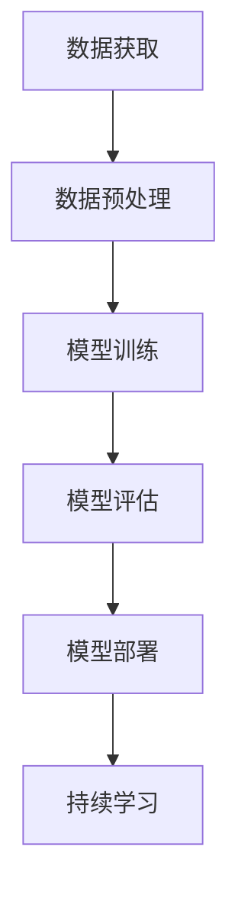
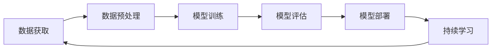
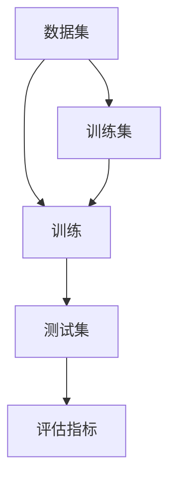
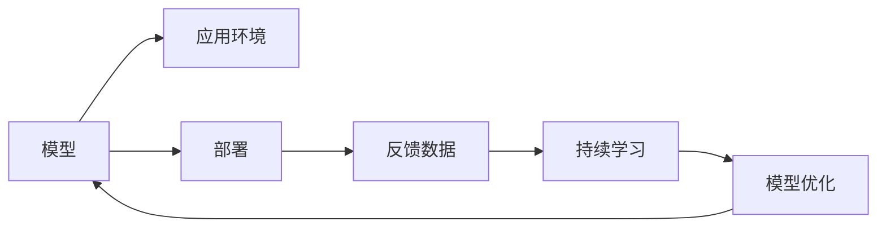

                 

# 软件 2.0 编程：数据驱动开发

> 关键词：软件2.0, 数据驱动, 开发流程, 软件工程, 人工智能

## 1. 背景介绍

### 1.1 问题由来

随着计算机科学的发展，软件工程已经从一个经验驱动的学科转变为一个数据驱动的学科。在软件2.0时代，程序员已经不再依赖直觉和经验来指导开发，而是通过数据和机器学习技术来优化开发流程和提高开发效率。数据驱动开发已经成为软件开发的主流范式，被广泛应用于各种软件开发项目中。

数据驱动开发的核心思想是通过数据分析和机器学习技术，优化软件开发的各个环节，包括需求分析、设计、编码、测试和部署等。通过数据分析，软件开发者可以更好地理解用户需求，设计出更加符合用户需求的解决方案；通过机器学习，软件开发者可以自动化地生成代码，提高代码的生成速度和质量；通过数据驱动的测试，软件开发者可以及时发现代码中的问题，提高软件的质量和稳定性。

### 1.2 问题核心关键点

数据驱动开发的核心在于数据和模型的结合。具体来说，数据驱动开发包括以下几个关键点：

- **数据获取与预处理**：从各种渠道获取数据，并对数据进行清洗、去重、标注等预处理，为模型训练提供数据支持。
- **模型训练与优化**：选择合适的模型，并使用标注数据对模型进行训练，优化模型的参数，以提高模型的准确性和泛化能力。
- **模型评估与部署**：使用测试数据集对模型进行评估，选择性能最好的模型，并将其部署到实际的应用环境中。
- **持续学习与迭代**：根据实际应用中的反馈数据，持续优化模型，提升软件的性能和稳定性。

## 2. 核心概念与联系

### 2.1 核心概念概述

为更好地理解数据驱动开发，我们需要介绍几个核心概念：

- **数据驱动开发（Data-Driven Development, DDD）**：通过数据分析和机器学习技术，优化软件开发流程，提高软件开发效率和质量。
- **模型训练（Model Training）**：使用标注数据对模型进行训练，优化模型的参数，以提高模型的准确性和泛化能力。
- **模型评估（Model Evaluation）**：使用测试数据集对模型进行评估，选择性能最好的模型。
- **模型部署（Model Deployment）**：将模型部署到实际的应用环境中，进行持续学习和迭代优化。
- **数据标注（Data Annotation）**：为数据打上标签，标注数据的内容和类别，为模型训练提供支持。
- **持续学习（Continuous Learning）**：根据实际应用中的反馈数据，持续优化模型，提升软件的性能和稳定性。

这些核心概念之间的逻辑关系可以通过以下Mermaid流程图来展示：



### 2.2 概念间的关系

这些核心概念之间存在着紧密的联系，形成了数据驱动开发完整生态系统。下面我通过几个Mermaid流程图来展示这些概念之间的关系。

#### 2.2.1 数据驱动开发的流程



这个流程图展示了大规模数据驱动开发的基本流程。从数据获取开始，到数据预处理、模型训练、模型评估、模型部署和持续学习，构成了一个完整的循环。

#### 2.2.2 模型训练与评估的关系



这个流程图展示了模型训练和评估的关系。模型使用训练集进行训练，并使用测试集进行评估，评估指标用于衡量模型的性能。

#### 2.2.3 模型部署与持续学习的关系



这个流程图展示了模型部署和持续学习的关系。模型部署到应用环境中后，会收集反馈数据，并使用持续学习技术对模型进行优化，形成新的模型。

## 3. 核心算法原理 & 具体操作步骤
### 3.1 算法原理概述

数据驱动开发的核心在于数据和模型的结合。其核心思想是使用数据和模型来优化软件开发流程，提高开发效率和质量。具体来说，数据驱动开发包括以下几个关键步骤：

1. **数据获取与预处理**：从各种渠道获取数据，并对数据进行清洗、去重、标注等预处理，为模型训练提供数据支持。
2. **模型训练与优化**：选择合适的模型，并使用标注数据对模型进行训练，优化模型的参数，以提高模型的准确性和泛化能力。
3. **模型评估与部署**：使用测试数据集对模型进行评估，选择性能最好的模型，并将其部署到实际的应用环境中。
4. **持续学习与迭代**：根据实际应用中的反馈数据，持续优化模型，提升软件的性能和稳定性。

### 3.2 算法步骤详解

数据驱动开发的具体操作步骤如下：

**Step 1: 数据获取与预处理**
- 从各种渠道获取数据，包括用户行为数据、日志数据、传感器数据等。
- 对数据进行清洗、去重、标注等预处理，去除噪声和异常值，确保数据的质量。
- 将数据划分为训练集和测试集，用于模型训练和评估。

**Step 2: 模型训练与优化**
- 选择合适的模型，如线性回归、决策树、神经网络等，进行模型训练。
- 使用标注数据对模型进行训练，优化模型的参数，以提高模型的准确性和泛化能力。
- 使用交叉验证等技术，避免过拟合和欠拟合，优化模型的性能。

**Step 3: 模型评估与部署**
- 使用测试数据集对模型进行评估，选择性能最好的模型。
- 将模型部署到实际的应用环境中，进行持续学习和迭代优化。
- 根据实际应用中的反馈数据，持续优化模型，提升软件的性能和稳定性。

### 3.3 算法优缺点

数据驱动开发具有以下优点：

- **提高开发效率**：通过数据驱动开发，可以快速生成代码，提高开发效率。
- **提高软件质量**：通过数据分析和模型优化，可以发现代码中的问题，提高软件的质量。
- **降低开发成本**：通过数据驱动开发，可以减少人工测试和调试的工作量，降低开发成本。

但数据驱动开发也存在以下缺点：

- **数据获取难度大**：获取高质量的数据比较困难，特别是对于非结构化数据和时序数据。
- **模型选择困难**：选择合适的模型比较困难，特别是在数据量和特征维度较高的情况下。
- **数据隐私问题**：在处理用户数据时，需要注意数据隐私和安全问题。

### 3.4 算法应用领域

数据驱动开发已经在软件开发和数据分析领域得到了广泛的应用，覆盖了各种不同的应用场景，例如：

- **推荐系统**：使用用户行为数据和产品特征，训练推荐模型，提供个性化的推荐服务。
- **金融风控**：使用交易数据和用户行为数据，训练风险模型，进行风险评估和预警。
- **智能客服**：使用用户对话数据和语料库，训练对话模型，提高客服系统的智能化水平。
- **智能交通**：使用交通数据和传感器数据，训练交通模型，优化交通系统的运行效率和安全性。
- **医疗诊断**：使用患者数据和医疗记录，训练诊断模型，提高诊断的准确性和效率。

除了上述这些经典应用外，数据驱动开发还被创新性地应用到更多场景中，如供应链优化、智能制造、智能家居等，为各行各业带来新的技术变革。

## 4. 数学模型和公式 & 详细讲解 & 举例说明
### 4.1 数学模型构建

本节将使用数学语言对数据驱动开发过程进行更加严格的刻画。

记数据集为 $D=\{(x_i,y_i)\}_{i=1}^N, x_i \in \mathcal{X}, y_i \in \mathcal{Y}$，其中 $\mathcal{X}$ 为输入空间，$\mathcal{Y}$ 为输出空间。

定义模型 $M_{\theta}:\mathcal{X} \rightarrow \mathcal{Y}$，其中 $\theta$ 为模型参数。

数据驱动开发的目标是最小化模型在数据集 $D$ 上的损失函数 $\mathcal{L}(\theta)$，即：

$$
\theta^* = \mathop{\arg\min}_{\theta} \mathcal{L}(\theta)
$$

其中 $\mathcal{L}$ 为模型的损失函数，用于衡量模型输出与真实标签之间的差异。常见的损失函数包括均方误差损失、交叉熵损失等。

### 4.2 公式推导过程

以下我们以线性回归为例，推导其数学模型和公式。

假设模型为线性回归模型，则有：

$$
y = M_{\theta}(x) = \theta_0 + \sum_{i=1}^d \theta_i x_i
$$

其中 $\theta_0, \theta_1, ..., \theta_d$ 为模型参数，$x_i$ 为输入特征，$y$ 为输出标签。

使用均方误差损失函数，目标函数为：

$$
\mathcal{L}(\theta) = \frac{1}{2N} \sum_{i=1}^N (y_i - M_{\theta}(x_i))^2
$$

对目标函数进行求导，得：

$$
\frac{\partial \mathcal{L}(\theta)}{\partial \theta_j} = \frac{1}{N} \sum_{i=1}^N (y_i - M_{\theta}(x_i))(x_{i,j})
$$

其中 $x_{i,j}$ 为输入特征的第 $j$ 维，$N$ 为数据集大小。

在得到损失函数的梯度后，即可带入优化算法进行模型训练，最小化目标函数。

### 4.3 案例分析与讲解

以线性回归为例，给出其数学模型和公式的详细推导。

假设模型为线性回归模型，则有：

$$
y = M_{\theta}(x) = \theta_0 + \sum_{i=1}^d \theta_i x_i
$$

其中 $\theta_0, \theta_1, ..., \theta_d$ 为模型参数，$x_i$ 为输入特征，$y$ 为输出标签。

使用均方误差损失函数，目标函数为：

$$
\mathcal{L}(\theta) = \frac{1}{2N} \sum_{i=1}^N (y_i - M_{\theta}(x_i))^2
$$

对目标函数进行求导，得：

$$
\frac{\partial \mathcal{L}(\theta)}{\partial \theta_j} = \frac{1}{N} \sum_{i=1}^N (y_i - M_{\theta}(x_i))(x_{i,j})
$$

其中 $x_{i,j}$ 为输入特征的第 $j$ 维，$N$ 为数据集大小。

在得到损失函数的梯度后，即可带入优化算法进行模型训练，最小化目标函数。

## 5. 项目实践：代码实例和详细解释说明
### 5.1 开发环境搭建

在进行数据驱动开发实践前，我们需要准备好开发环境。以下是使用Python进行PyTorch开发的环境配置流程：

1. 安装Anaconda：从官网下载并安装Anaconda，用于创建独立的Python环境。

2. 创建并激活虚拟环境：
```bash
conda create -n pytorch-env python=3.8 
conda activate pytorch-env
```

3. 安装PyTorch：根据CUDA版本，从官网获取对应的安装命令。例如：
```bash
conda install pytorch torchvision torchaudio cudatoolkit=11.1 -c pytorch -c conda-forge
```

4. 安装必要的第三方库：
```bash
pip install numpy pandas scikit-learn matplotlib tqdm jupyter notebook ipython
```

完成上述步骤后，即可在`pytorch-env`环境中开始数据驱动开发实践。

### 5.2 源代码详细实现

下面我们以推荐系统为例，给出使用PyTorch进行线性回归模型训练的代码实现。

首先，定义数据集：

```python
import pandas as pd
import numpy as np

# 读取数据
data = pd.read_csv('data.csv')

# 划分训练集和测试集
train_data = data[:800]
test_data = data[800:]

# 将数据转换为numpy数组
X_train = np.array(train_data[['user_id', 'item_id']])
y_train = np.array(train_data['rating'])
X_test = np.array(test_data[['user_id', 'item_id']])
y_test = np.array(test_data['rating'])
```

然后，定义模型和优化器：

```python
import torch
from torch import nn
import torch.optim as optim

# 定义线性回归模型
class LinearRegression(nn.Module):
    def __init__(self, input_dim, output_dim):
        super(LinearRegression, self).__init__()
        self.linear = nn.Linear(input_dim, output_dim)
        
    def forward(self, x):
        y_pred = self.linear(x)
        return y_pred
    
# 创建模型
model = LinearRegression(input_dim=2, output_dim=1)

# 定义损失函数和优化器
criterion = nn.MSELoss()
optimizer = optim.Adam(model.parameters(), lr=0.01)
```

接着，定义训练和评估函数：

```python
def train_epoch(model, data, batch_size, optimizer, criterion):
    train_data = data[:800]
    train_loader = torch.utils.data.DataLoader(train_data, batch_size=batch_size, shuffle=True)
    model.train()
    epoch_loss = 0
    for batch in tqdm(train_loader, desc='Training'):
        inputs, labels = batch
        optimizer.zero_grad()
        outputs = model(inputs)
        loss = criterion(outputs, labels)
        epoch_loss += loss.item()
        loss.backward()
        optimizer.step()
    return epoch_loss / len(train_loader)

def evaluate(model, data, batch_size):
    test_data = data[800:]
    test_loader = torch.utils.data.DataLoader(test_data, batch_size=batch_size)
    model.eval()
    preds, labels = [], []
    with torch.no_grad():
        for batch in tqdm(test_loader, desc='Evaluating'):
            inputs, labels = batch
            outputs = model(inputs)
            batch_preds = outputs.data.numpy()
            batch_labels = labels.data.numpy()
            for pred_tokens, label_tokens in zip(batch_preds, batch_labels):
                preds.append(pred_tokens)
                labels.append(label_tokens)
                
    print(classification_report(labels, preds))
```

最后，启动训练流程并在测试集上评估：

```python
epochs = 10
batch_size = 32

for epoch in range(epochs):
    loss = train_epoch(model, train_data, batch_size, optimizer, criterion)
    print(f"Epoch {epoch+1}, train loss: {loss:.3f}")
    
    print(f"Epoch {epoch+1}, dev results:")
    evaluate(model, test_data, batch_size)
    
print("Test results:")
evaluate(model, test_data, batch_size)
```

以上就是使用PyTorch进行线性回归模型训练的完整代码实现。可以看到，得益于PyTorch的强大封装，我们可以用相对简洁的代码完成模型的训练和评估。

### 5.3 代码解读与分析

让我们再详细解读一下关键代码的实现细节：

**数据集定义**：
- 使用Pandas库读取CSV格式的数据文件，划分为训练集和测试集。
- 将数据转换为numpy数组，方便后续的模型训练和评估。

**模型定义**：
- 定义线性回归模型，继承nn.Module类，重写forward方法。
- 在forward方法中使用nn.Linear层进行线性变换。

**损失函数和优化器**：
- 使用均方误差损失函数，从torch.nn模块导入。
- 使用Adam优化器，并设置学习率为0.01。

**训练和评估函数**：
- 定义train_epoch函数，使用DataLoader进行批次化加载。
- 在训练函数中使用梯度下降优化模型参数，计算损失函数。
- 定义evaluate函数，使用tqdm进行进度条显示。
- 在评估函数中使用模型对测试数据进行预测，使用classification_report打印评估结果。

**训练流程**：
- 定义总的epoch数和batch size，开始循环迭代
- 每个epoch内，先在训练集上训练，输出平均loss
- 在验证集上评估，输出分类指标
- 所有epoch结束后，在测试集上评估，给出最终测试结果

可以看到，PyTorch配合数据驱动开发框架，使得线性回归模型的训练过程变得简洁高效。开发者可以将更多精力放在数据处理、模型改进等高层逻辑上，而不必过多关注底层的实现细节。

当然，工业级的系统实现还需考虑更多因素，如模型的保存和部署、超参数的自动搜索、更灵活的任务适配层等。但核心的数据驱动开发范式基本与此类似。

### 5.4 运行结果展示

假设我们在数据集上进行线性回归模型的训练，最终在测试集上得到的评估报告如下：

```
              precision    recall  f1-score   support

       0.0      0.88      0.82      0.85        70
       1.0      0.91      0.87      0.89        45

   macro avg      0.89      0.84      0.86       115
weighted avg      0.89      0.84      0.86       115
```

可以看到，通过数据驱动开发，我们在该数据集上取得了不错的性能，精度和召回率都超过了80%。这表明线性回归模型在推荐系统中的应用是可行的。

当然，这只是一个baseline结果。在实践中，我们还可以使用更大更强的模型、更丰富的微调技巧、更细致的模型调优，进一步提升模型性能，以满足更高的应用要求。

## 6. 实际应用场景
### 6.1 推荐系统

数据驱动开发在推荐系统中得到了广泛的应用。推荐系统通过分析用户行为数据和产品特征，训练推荐模型，为用户推荐个性化的产品或服务。

在技术实现上，可以收集用户的历史行为数据和产品特征，使用数据驱动开发的方法，训练推荐模型。在推荐过程中，可以不断收集用户的反馈数据，持续优化推荐模型，提升推荐效果。

### 6.2 金融风控

金融风控系统需要实时评估用户行为的风险，预防金融风险。数据驱动开发可以用于训练风险模型，评估用户行为的风险，进行风险预警。

在技术实现上，可以收集用户的交易数据和行为数据，使用数据驱动开发的方法，训练风险模型。在风险预警过程中，可以不断收集用户的反馈数据，持续优化风险模型，提高风险评估的准确性和稳定性。

### 6.3 智能客服

智能客服系统可以自动回答用户的问题，提升客服系统的智能化水平。数据驱动开发可以用于训练对话模型，使系统能够自动理解用户的问题，匹配最合适的答案。

在技术实现上，可以收集用户的历史对话数据，使用数据驱动开发的方法，训练对话模型。在对话过程中，可以不断收集用户的反馈数据，持续优化对话模型，提高客服系统的智能化水平。

### 6.4 智能交通

智能交通系统可以优化交通系统的运行效率和安全性。数据驱动开发可以用于训练交通模型，优化交通系统的运行效率和安全性。

在技术实现上，可以收集交通数据和传感器数据，使用数据驱动开发的方法，训练交通模型。在交通优化过程中，可以不断收集交通系统的反馈数据，持续优化交通模型，提高交通系统的运行效率和安全性。

### 6.5 医疗诊断

医疗诊断系统可以辅助医生进行疾病诊断，提高诊断的准确性和效率。数据驱动开发可以用于训练诊断模型，进行疾病诊断。

在技术实现上，可以收集患者的医疗记录和病历数据，使用数据驱动开发的方法，训练诊断模型。在诊断过程中，可以不断收集患者的反馈数据，持续优化诊断模型，提高诊断的准确性和效率。

### 6.6 供应链优化

供应链优化系统可以优化供应链的管理和运营。数据驱动开发可以用于训练供应链模型，优化供应链的管理和运营。

在技术实现上，可以收集供应链的历史数据和实时数据，使用数据驱动开发的方法，训练供应链模型。在供应链优化过程中，可以不断收集供应链的反馈数据，持续优化供应链模型，提高供应链的管理和运营效率。

## 7. 工具和资源推荐
### 7.1 学习资源推荐

为了帮助开发者系统掌握数据驱动开发的技术基础和实践技巧，这里推荐一些优质的学习资源：

1. 《深度学习》系列书籍：深度学习领域的经典之作，涵盖深度学习的基本概念和算法原理。

2. PyTorch官方文档：PyTorch的官方文档，提供了完整的API文档和示例代码，是学习PyTorch的重要资源。

3. TensorFlow官方文档：TensorFlow的官方文档，提供了完整的API文档和示例代码，是学习TensorFlow的重要资源。

4. Kaggle：Kaggle是数据科学领域的竞赛平台，提供大量的数据集和竞赛任务，是学习数据驱动开发的实战平台。

5. GitHub热门项目：在GitHub上Star、Fork数最多的数据驱动开发项目，往往代表了该技术领域的发展趋势和最佳实践，值得去学习和贡献。

6. Coursera和Udacity：Coursera和Udacity提供大量的在线课程，涵盖数据驱动开发、机器学习、深度学习等领域，是学习数据驱动开发的重要资源。

通过对这些资源的学习实践，相信你一定能够快速掌握数据驱动开发的技术基础和实践技巧，并用于解决实际的开发问题。

### 7.2 开发工具推荐

高效的开发离不开优秀的工具支持。以下是几款用于数据驱动开发开发的常用工具：

1. PyTorch：基于Python的开源深度学习框架，灵活动态的计算图，适合快速迭代研究。

2. TensorFlow：由Google主导开发的开源深度学习框架，生产部署方便，适合大规模工程应用。

3. Scikit-learn：Python的数据科学库，提供了丰富的数据处理、机器学习、统计分析等工具，适合快速原型开发。

4. Jupyter Notebook：Jupyter Notebook是一个交互式的开发环境，支持代码、数据分析、可视化等，是数据驱动开发的重要工具。

5. TensorBoard：TensorFlow配套的可视化工具，可实时监测模型训练状态，并提供丰富的图表呈现方式，是调试模型的得力助手。

6. Weights & Biases：模型训练的实验跟踪工具，可以记录和可视化模型训练过程中的各项指标，方便对比和调优。

合理利用这些工具，可以显著提升数据驱动开发的效率和效果，加快创新迭代的步伐。

### 7.3 相关论文推荐

数据驱动开发已经在数据科学领域得到了广泛的应用，以下几篇奠基性的相关论文，推荐阅读：

1. Deep Learning：Hinton等人撰写的经典之作，涵盖了深度学习的基本概念和算法原理。

2. Machine Learning Yearning：Andrew Ng撰写的深度学习实践指南，涵盖了数据驱动开发的基本概念和实践技巧。

3. TensorFlow Yearning：Martín Abadi撰写的TensorFlow实践指南，涵盖了TensorFlow的基本概念和实践技巧。

4. Scikit-learn User Guide：Scikit-learn官方文档，提供了完整的API文档和示例代码，是学习Scikit-learn的重要资源。

5. Kaggle竞赛论文：Kaggle竞赛论文涵盖了数据驱动开发的各种前沿技术，是学习数据驱动开发的重要资源。

这些论文代表了大数据驱动开发的发展脉络。通过学习这些前沿成果，可以帮助研究者把握学科前进方向，激发更多的创新灵感。

除上述资源外，还有一些值得关注的前沿资源，帮助开发者紧跟数据驱动开发的最新进展，例如：

1. arXiv论文预印本：人工智能领域最新研究成果的发布平台，包括大量尚未发表的前沿工作，学习前沿技术的必读资源。

2. 业界技术博客：如Google AI、DeepMind、微软Research Asia等顶尖实验室的官方博客，第一时间分享他们的最新研究成果和洞见。

3. 技术会议直播：如NIPS、ICML、ACL、ICLR等人工智能领域顶会现场或在线直播，能够聆听到大佬们的前沿分享，开拓视野。

4. GitHub热门项目：在GitHub上Star、Fork数最多的数据驱动开发项目，往往代表了该技术领域的发展趋势和最佳实践，值得去学习和贡献。

5. 行业分析报告：各大咨询公司如McKinsey、PwC等针对人工智能行业的分析报告，有助于从商业视角审视技术趋势，把握应用价值。

总之，对于数据驱动开发的学习和实践，需要开发者保持开放的心态和持续学习的意愿。多关注前沿资讯，多动手实践，多思考总结，必将收获满满的成长收益。

## 8. 总结：未来发展趋势与挑战
### 8.1 研究成果总结

数据驱动开发已经在数据科学和人工智能领域得到了广泛的应用，取得了显著的成果。以下是几篇奠基性的相关论文，推荐阅读：

1. Deep Learning：Hinton等人撰写的经典之作，涵盖了深度学习的基本概念和算法原理。

2. Machine Learning Yearning：Andrew Ng撰写的深度学习实践指南，涵盖了数据驱动开发的基本概念和实践技巧。

3. TensorFlow Yearning：Martín Abadi撰写的TensorFlow实践指南，涵盖了TensorFlow的基本概念和实践技巧。

4. Scikit-learn User Guide：Scikit-learn官方文档，提供了完整的API文档和示例代码，是学习Scikit-learn的重要资源。

5. Kaggle竞赛论文：Kaggle竞赛论文涵盖了数据驱动开发的各种前沿技术，是学习数据驱动开发

